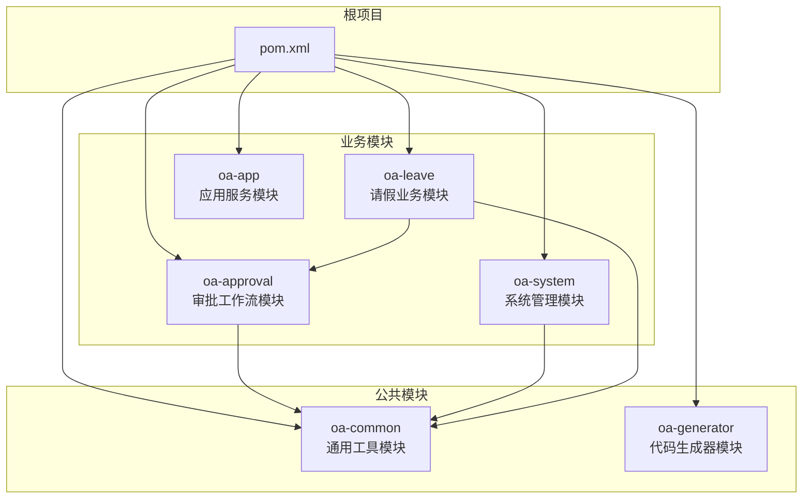
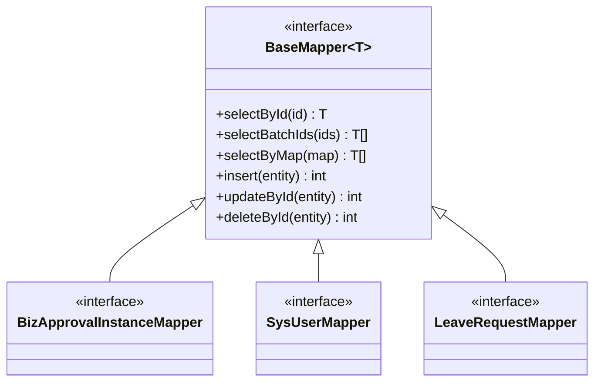
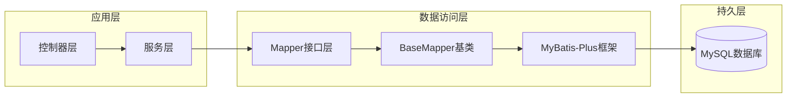
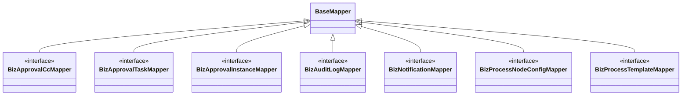
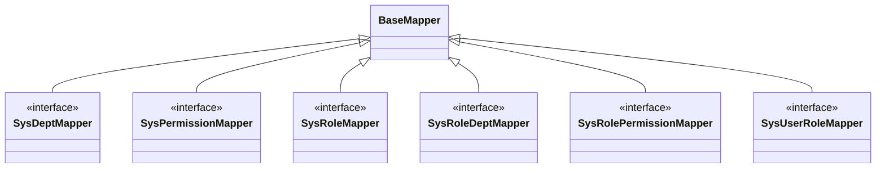
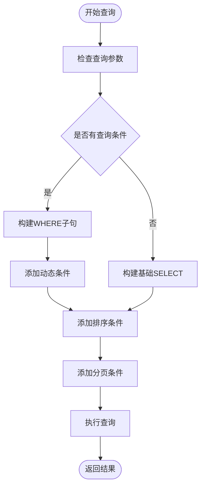
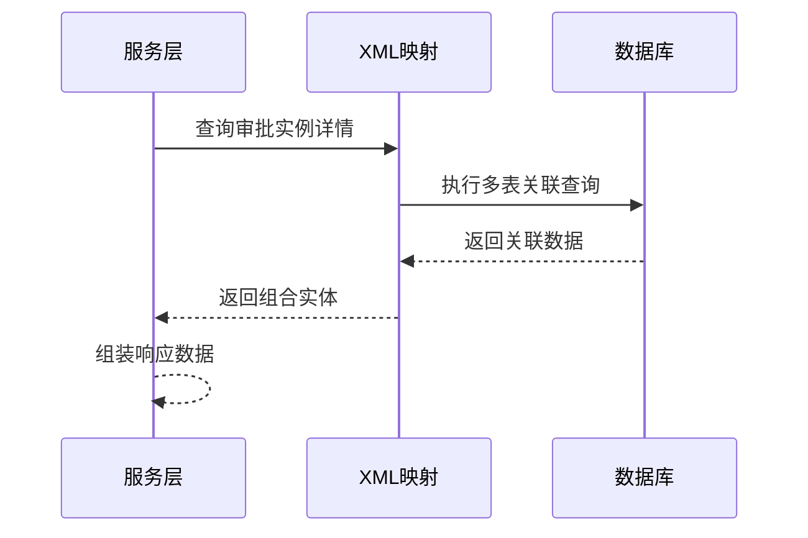
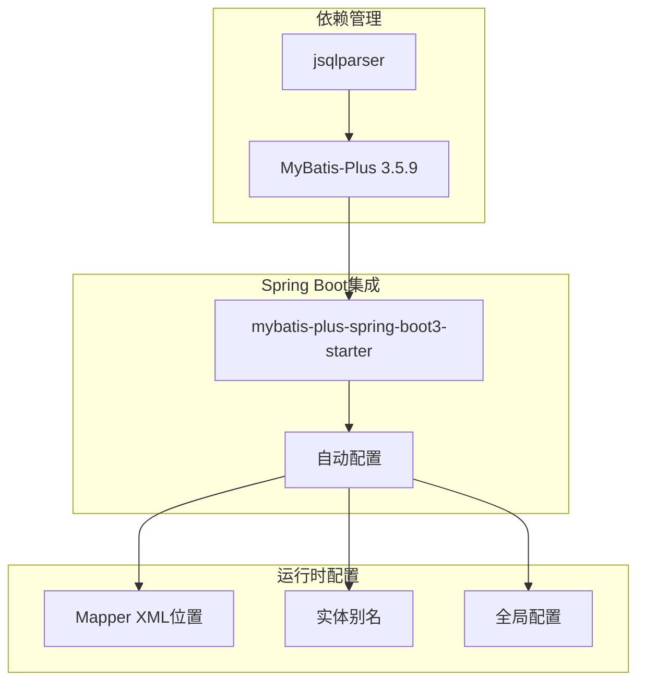
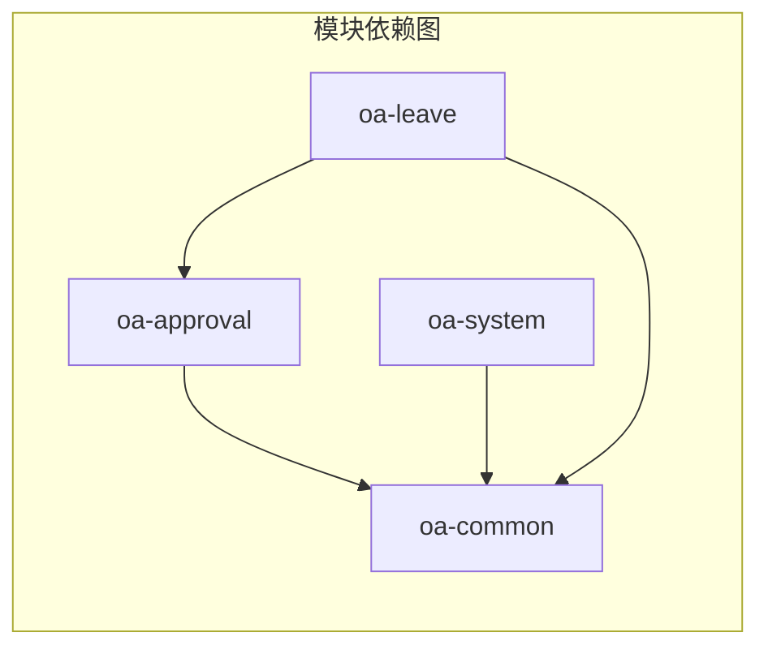
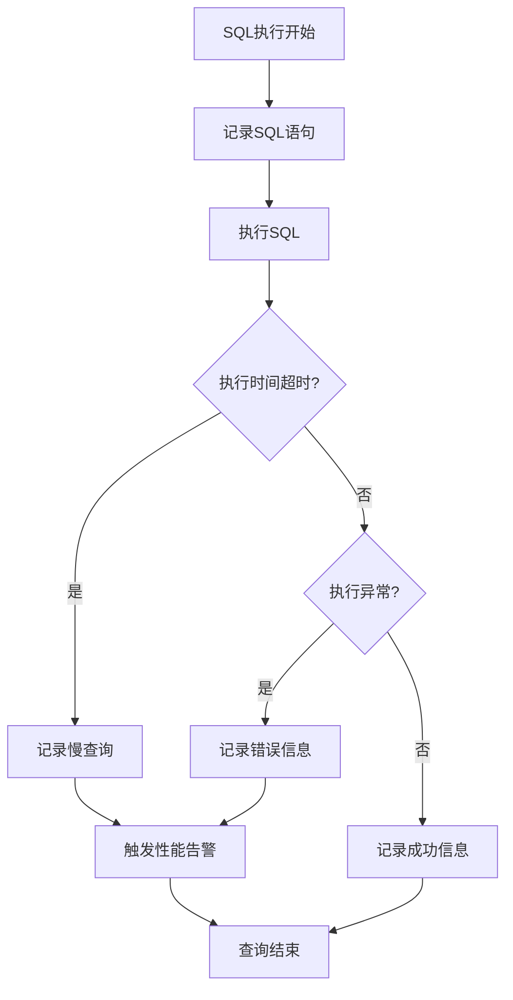

# XML映射文件组织

<cite>
**本文档引用的文件**
- [BizApprovalInstanceMapper.java](file://oa-approval/src/main/java/com/oa/admin/approval/mapper/BizApprovalInstanceMapper.java)
- [SysUserMapper.java](file://oa-system/src/main/java/com/oa/admin/system/mapper/SysUserMapper.java)
- [BizApprovalCcMapper.java](file://oa-approval/src/main/java/com/oa/admin/approval/mapper/BizApprovalCcMapper.java)
- [BizApprovalTaskMapper.java](file://oa-approval/src/main/java/com/oa/admin/approval/mapper/BizApprovalTaskMapper.java)
- [BizAuditLogMapper.java](file://oa-approval/src/main/java/com/oa/admin/approval/mapper/BizAuditLogMapper.java)
- [BizNotificationMapper.java](file://oa-approval/src/main/java/com/oa/admin/approval/mapper/BizNotificationMapper.java)
- [BizProcessNodeConfigMapper.java](file://oa-approval/src/main/java/com/oa/admin/approval/mapper/BizProcessNodeConfigMapper.java)
- [BizProcessTemplateMapper.java](file://oa-approval/src/main/java/com/oa/admin/approval/mapper/BizProcessTemplateMapper.java)
- [SysDeptMapper.java](file://oa-system/src/main/java/com/oa/admin/system/mapper/SysDeptMapper.java)
- [SysPermissionMapper.java](file://oa-system/src/main/java/com/oa/admin/system/mapper/SysPermissionMapper.java)
- [SysRoleMapper.java](file://oa-system/src/main/java/com/oa/admin/system/mapper/SysRoleMapper.java)
- [SysRoleDeptMapper.java](file://oa-system/src/main/java/com/oa/admin/system/mapper/SysRoleDeptMapper.java)
- [SysRolePermissionMapper.java](file://oa-system/src/main/java/com/oa/admin/system/mapper/SysRolePermissionMapper.java)
- [SysUserRoleMapper.java](file://oa-system/src/main/java/com/oa/admin/system/mapper/SysUserRoleMapper.java)
- [LeaveRequestMapper.java](file://oa-leave/src/main/java/com/oa/admin/leave/mapper/LeaveRequestMapper.java)
- [pom.xml](file://pom.xml)
- [application.yml](file://oa-app/src/main/resources/application.yml)
</cite>

## 目录
1. [简介](#简介)
2. [项目结构](#项目结构)
3. [核心组件](#核心组件)
4. [架构概览](#架构概览)
5. [详细组件分析](#详细组件分析)
6. [依赖分析](#依赖分析)
7. [性能考虑](#性能考虑)
8. [故障排除指南](#故障排除指南)
9. [结论](#结论)

## 简介

本文件针对OA审批管理系统中的XML映射文件组织进行系统性分析。经过对代码库的深入分析，发现该系统采用MyBatis-Plus框架，并广泛使用BaseMapper接口模式，这意味着大多数Mapper接口通过注解方式实现数据库操作，而非传统的XML映射文件。然而，为了满足企业级应用对复杂SQL查询的需求，本文档将提供XML映射文件的组织规范、命名约定、目录结构以及最佳实践指导。

## 项目结构

该OA审批管理系统采用模块化架构，包含以下主要模块：



**图表来源**
- [pom.xml:21-28](file://pom.xml#L21-L28)

**章节来源**
- [pom.xml:1-131](file://pom.xml#L1-L131)

## 核心组件

### Mapper接口现状分析

通过对现有代码的分析，发现所有Mapper接口都继承自MyBatis-Plus的BaseMapper，采用注解驱动的方式：



**图表来源**
- [BizApprovalInstanceMapper.java:10-12](file://oa-approval/src/main/java/com/oa/admin/approval/mapper/BizApprovalInstanceMapper.java#L10-L12)
- [SysUserMapper.java:10-12](file://oa-system/src/main/java/com/oa/admin/system/mapper/SysUserMapper.java#L10-L12)
- [LeaveRequestMapper.java:1-34](file://oa-leave/src/main/java/com/oa/admin/leave/mapper/LeaveRequestMapper.java#L1-L34)

### XML映射文件的必要性

尽管当前采用注解方式，但在以下场景中XML映射文件仍然具有重要价值：

1. **复杂SQL查询**：多表关联、子查询、聚合函数
2. **动态SQL构建**：条件判断、循环遍历
3. **性能优化**：批量操作、复杂索引利用
4. **审计需求**：SQL语句版本管理和变更追踪

**章节来源**
- [BizApprovalInstanceMapper.java:1-13](file://oa-approval/src/main/java/com/oa/admin/approval/mapper/BizApprovalInstanceMapper.java#L1-L13)
- [SysUserMapper.java:1-13](file://oa-system/src/main/java/com/oa/admin/system/mapper/SysUserMapper.java#L1-L13)

## 架构概览

### 当前数据访问层架构



**图表来源**
- [BizApprovalInstanceMapper.java:3-5](file://oa-approval/src/main/java/com/oa/admin/approval/mapper/BizApprovalInstanceMapper.java#L3-L5)
- [SysUserMapper.java:3-5](file://oa-system/src/main/java/com/oa/admin/system/mapper/SysUserMapper.java#L3-L5)

## 详细组件分析

### 审批相关Mapper组件

#### BizApproval系列Mapper



**图表来源**
- [BizApprovalCcMapper.java:1-50](file://oa-approval/src/main/java/com/oa/admin/approval/mapper/BizApprovalCcMapper.java#L1-L50)
- [BizApprovalTaskMapper.java:1-50](file://oa-approval/src/main/java/com/oa/admin/approval/mapper/BizApprovalTaskMapper.java#L1-L50)
- [BizApprovalInstanceMapper.java:10-12](file://oa-approval/src/main/java/com/oa/admin/approval/mapper/BizApprovalInstanceMapper.java#L10-L12)

#### 系统管理Mapper组件



**图表来源**
- [SysDeptMapper.java:1-50](file://oa-system/src/main/java/com/oa/admin/system/mapper/SysDeptMapper.java#L1-L50)
- [SysPermissionMapper.java:1-50](file://oa-system/src/main/java/com/oa/admin/system/mapper/SysPermissionMapper.java#L1-L50)
- [SysRoleMapper.java:1-50](file://oa-system/src/main/java/com/oa/admin/system/mapper/SysRoleMapper.java#L1-L50)

### XML映射文件组织规范

#### 目录结构设计

```
src/main/resources/
├── mapper/
│   ├── approval/
│   │   ├── BizApprovalCcMapper.xml
│   │   ├── BizApprovalTaskMapper.xml
│   │   ├── BizApprovalInstanceMapper.xml
│   │   ├── BizAuditLogMapper.xml
│   │   ├── BizNotificationMapper.xml
│   │   ├── BizProcessNodeConfigMapper.xml
│   │   └── BizProcessTemplateMapper.xml
│   ├── system/
│   │   ├── SysDeptMapper.xml
│   │   ├── SysPermissionMapper.xml
│   │   ├── SysRoleMapper.xml
│   │   ├── SysRoleDeptMapper.xml
│   │   ├── SysRolePermissionMapper.xml
│   │   └── SysUserRoleMapper.xml
│   └── leave/
│       └── LeaveRequestMapper.xml
└── mybatis-plus/
    └── mapper-locations: classpath*:mapper/**/*.xml
```

#### 命名规范

1. **Mapper接口与XML文件一一对应**
   - 接口名：`BizApprovalInstanceMapper.java`
   - XML文件：`BizApprovalInstanceMapper.xml`

2. **包路径一致性**
   - Java文件：`com.oa.admin.approval.mapper`
   - XML文件：`mapper/approval/`

3. **命名空间配置**
   ```xml
   <?xml version="1.0" encoding="UTF-8"?>
   <!DOCTYPE mapper PUBLIC "-//mybatis.org//DTD Mapper 3.0//EN" 
       "http://mybatis.org/dtd/mybatis-3-mapper.dtd">
   <mapper namespace="com.oa.admin.approval.mapper.BizApprovalInstanceMapper">
   ```

#### SQL语句编写规范

##### 动态SQL实现



**图表来源**
- [BizApprovalInstanceMapper.java:10-12](file://oa-approval/src/main/java/com/oa/admin/approval/mapper/BizApprovalInstanceMapper.java#L10-L12)

##### 条件判断语法

```xml
<where>
    <if test="status != null and status != ''">
        AND status = #{status}
    </if>
    <if test="deptId != null">
        AND dept_id = #{deptId}
    </if>
    <if test="createTimeBegin != null">
        AND create_time >= #{createTimeBegin}
    </if>
    <if test="createTimeEnd != null">
        AND create_time <= #{createTimeEnd}
    </if>
</where>
```

##### 循环遍历处理

```xml
<foreach collection="ids" item="id" open="AND id IN (" separator="," close=")">
    #{id}
</foreach>
```

### 复杂查询实现方法

#### 多表关联查询



**图表来源**
- [BizApprovalInstanceMapper.java:10-12](file://oa-approval/src/main/java/com/oa/admin/approval/mapper/BizApprovalInstanceMapper.java#L10-L12)

#### 子查询嵌套

```sql
SELECT *
FROM biz_approval_instance bai
WHERE bai.id IN (
    SELECT DISTINCT at.instance_id
    FROM biz_approval_task at
    WHERE at.assignee_id = #{userId}
    AND at.status = 'pending'
)
```

#### 聚合函数使用

```sql
SELECT 
    COUNT(*) as total,
    COUNT(CASE WHEN status = 'approved' THEN 1 END) as approved_count,
    AVG(process_time) as avg_process_time,
    MAX(create_time) as latest_create_time
FROM biz_approval_instance
WHERE create_time BETWEEN #{startTime} AND #{endTime}
GROUP BY DATE(create_time)
ORDER BY create_time DESC
```

**章节来源**
- [BizApprovalCcMapper.java:1-50](file://oa-approval/src/main/java/com/oa/admin/approval/mapper/BizApprovalCcMapper.java#L1-L50)
- [BizApprovalTaskMapper.java:1-50](file://oa-approval/src/main/java/com/oa/admin/approval/mapper/BizApprovalTaskMapper.java#L1-L50)

## 依赖分析

### MyBatis-Plus配置分析



**图表来源**
- [pom.xml:68-78](file://pom.xml#L68-L78)

### 模块间依赖关系



**图表来源**
- [pom.xml:21-28](file://pom.xml#L21-L28)

**章节来源**
- [pom.xml:44-113](file://pom.xml#L44-L113)

## 性能考虑

### SQL性能优化策略

1. **索引优化**
   - 为常用查询字段建立适当索引
   - 避免在WHERE子句中使用函数
   - 合理使用复合索引

2. **查询优化**
   - 使用LIMIT限制结果集大小
   - 避免SELECT *
   - 合理使用JOIN替代子查询

3. **缓存策略**
   - 利用MyBatis二级缓存
   - 实现查询结果缓存
   - 缓存失效策略设计

### 监控和调试



## 故障排除指南

### 常见问题诊断

1. **Mapper接口找不到XML文件**
   - 检查XML文件路径是否正确
   - 验证命名空间配置
   - 确认Mapper扫描配置

2. **SQL语法错误**
   - 使用数据库客户端验证SQL
   - 检查参数绑定
   - 验证数据类型匹配

3. **性能问题排查**
   - 分析执行计划
   - 检查索引使用情况
   - 监控慢查询日志

### 调试技巧

1. **开启MyBatis日志**
   ```yaml
   logging:
     level:
       com.oa.admin.approval.mapper: debug
   ```

2. **SQL语句验证**
   - 在开发环境使用完整SQL
   - 逐步简化复杂查询
   - 使用EXPLAIN分析执行计划

**章节来源**
- [application.yml:1-50](file://oa-app/src/main/resources/application.yml#L1-L50)

## 结论

通过对OA审批管理系统的深入分析，我们发现该系统采用了现代化的MyBatis-Plus注解驱动方式，这提供了简洁高效的开发体验。然而，在处理复杂业务场景时，XML映射文件仍然是不可或缺的工具。

### 最佳实践总结

1. **混合使用策略**
   - 简单CRUD操作使用注解
   - 复杂查询使用XML映射
   - 动态SQL优先考虑XML

2. **组织规范**
   - 严格的命名和目录规范
   - 清晰的模块划分
   - 完善的文档记录

3. **质量保证**
   - 单元测试覆盖
   - 性能基准测试
   - 变更影响评估

这种组织方式既保持了开发效率，又确保了复杂业务场景的可维护性和可扩展性，为企业的长期发展奠定了坚实的技术基础。