# 数据访问层设计

<cite>
**本文档引用的文件**
- [MybatisPlusConfig.java](file://oa-common/src/main/java/com/oa/admin/common/config/MybatisPlusConfig.java)
- [MyBatisPlusAutoFillHandler.java](file://oa-common/src/main/java/com/oa/admin/common/config/MyBatisPlusAutoFillHandler.java)
- [BaseEntity.java](file://oa-common/src/main/java/com/oa/admin/common/entity/BaseEntity.java)
- [BizApprovalInstanceMapper.java](file://oa-approval/src/main/java/com/oa/admin/approval/mapper/BizApprovalInstanceMapper.java)
- [SysUserMapper.java](file://oa-system/src/main/java/com/oa/admin/system/mapper/SysUserMapper.java)
- [LeaveRequestMapper.java](file://oa-leave/src/main/java/com/oa/admin/leave/mapper/LeaveRequestMapper.java)
- [ApprovalServiceImpl.java](file://oa-approval/src/main/java/com/oa/admin/approval/service/impl/ApprovalServiceImpl.java)
- [SysUserServiceImpl.java](file://oa-system/src/main/java/com/oa/admin/system/service/impl/SysUserServiceImpl.java)
- [LeaveRequestServiceImpl.java](file://oa-leave/src/main/java/com/oa/admin/leave/service/impl/LeaveRequestServiceImpl.java)
- [pom.xml](file://pom.xml)
</cite>

## 目录
1. [简介](#简介)
2. [项目结构](#项目结构)
3. [核心组件](#核心组件)
4. [架构概览](#架构概览)
5. [详细组件分析](#详细组件分析)
6. [依赖分析](#依赖分析)
7. [性能考虑](#性能考虑)
8. [故障排除指南](#故障排除指南)
9. [结论](#结论)

## 简介

本文件为OA审批管理系统的数据访问层设计文档，重点阐述基于MyBatis-Plus的配置与使用实践，包括自动填充机制、分页插件配置、乐观锁支持等核心功能。同时，文档详细说明了CRUD操作的最佳实践（条件构造器使用、批量操作优化、动态表名处理），并解释了数据访问层的设计模式（Mapper接口设计、XML映射文件组织、通用Service封装）。此外，文档还涵盖了数据校验与安全策略（SQL注入防护、参数绑定、数据脱敏）以及性能优化技巧（查询优化、缓存策略、连接池配置）。

## 项目结构

OA审批管理系统采用多模块架构，数据访问层主要分布在以下模块中：

- **oa-common**：公共配置与基础实体，包含MyBatis-Plus配置、自动填充处理器、基础实体类等。
- **oa-approval**：审批相关业务，包含审批实例、任务、模板等Mapper与Service实现。
- **oa-system**：系统管理模块，包含用户、角色、部门等Mapper与Service实现。
- **oa-leave**：请假模块，包含请假申请Mapper与Service实现。

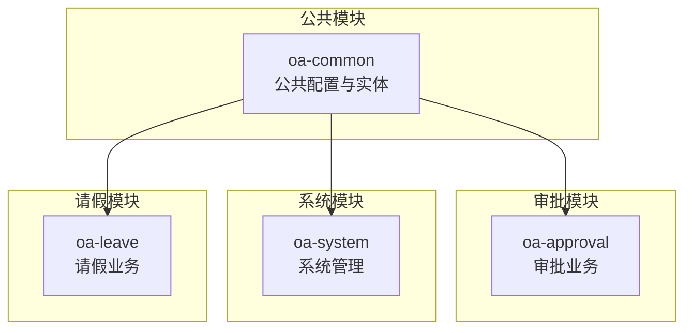

**图表来源**
- [MybatisPlusConfig.java:1-23](file://oa-common/src/main/java/com/oa/admin/common/config/MybatisPlusConfig.java#L1-L23)
- [BizApprovalInstanceMapper.java:1-13](file://oa-approval/src/main/java/com/oa/admin/approval/mapper/BizApprovalInstanceMapper.java#L1-L13)
- [SysUserMapper.java:1-13](file://oa-system/src/main/java/com/oa/admin/system/mapper/SysUserMapper.java#L1-L13)
- [LeaveRequestMapper.java:1-14](file://oa-leave/src/main/java/com/oa/admin/leave/mapper/LeaveRequestMapper.java#L1-L14)

**章节来源**
- [MybatisPlusConfig.java:1-23](file://oa-common/src/main/java/com/oa/admin/common/config/MybatisPlusConfig.java#L1-L23)
- [BizApprovalInstanceMapper.java:1-13](file://oa-approval/src/main/java/com/oa/admin/approval/mapper/BizApprovalInstanceMapper.java#L1-L13)
- [SysUserMapper.java:1-13](file://oa-system/src/main/java/com/oa/admin/system/mapper/SysUserMapper.java#L1-L13)
- [LeaveRequestMapper.java:1-14](file://oa-leave/src/main/java/com/oa/admin/leave/mapper/LeaveRequestMapper.java#L1-L14)

## 核心组件

### MyBatis-Plus配置

系统通过统一的配置类启用MyBatis-Plus的核心功能，主要包括分页插件配置和自动填充处理器注册。

- **分页插件配置**：在配置类中注册MySQL数据库类型的分页拦截器，确保所有查询支持分页功能。
- **自动填充处理器**：通过MetaObjectHandler实现插入和更新时的时间字段自动填充。

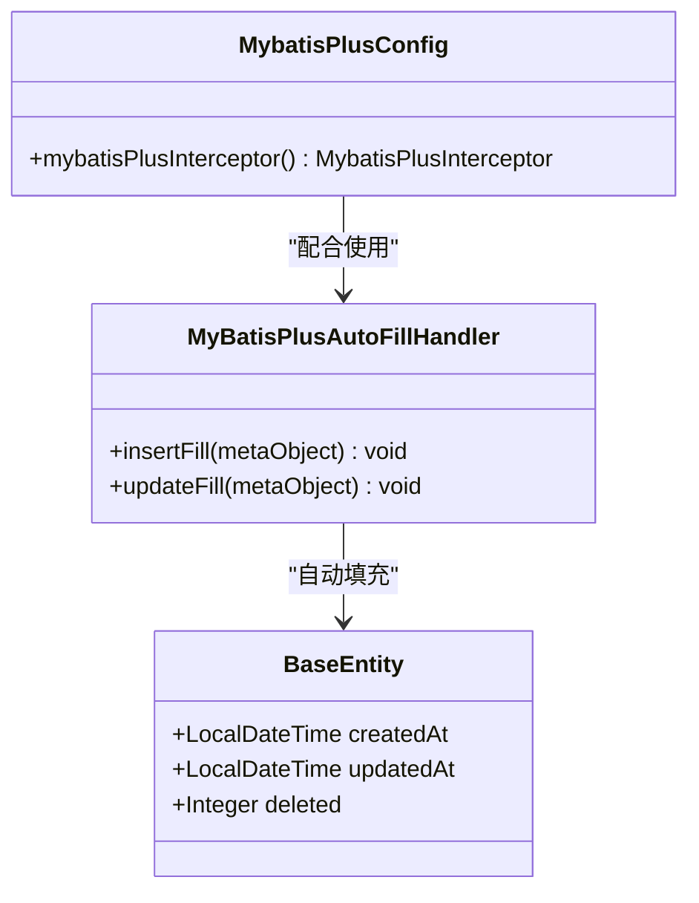

**图表来源**
- [MybatisPlusConfig.java:1-23](file://oa-common/src/main/java/com/oa/admin/common/config/MybatisPlusConfig.java#L1-L23)
- [MyBatisPlusAutoFillHandler.java:1-25](file://oa-common/src/main/java/com/oa/admin/common/config/MyBatisPlusAutoFillHandler.java#L1-L25)
- [BaseEntity.java:1-26](file://oa-common/src/main/java/com/oa/admin/common/entity/BaseEntity.java#L1-L26)

**章节来源**
- [MybatisPlusConfig.java:1-23](file://oa-common/src/main/java/com/oa/admin/common/config/MybatisPlusConfig.java#L1-L23)
- [MyBatisPlusAutoFillHandler.java:1-25](file://oa-common/src/main/java/com/oa/admin/common/config/MyBatisPlusAutoFillHandler.java#L1-L25)
- [BaseEntity.java:1-26](file://oa-common/src/main/java/com/oa/admin/common/entity/BaseEntity.java#L1-L26)

### Mapper接口设计

各业务模块均采用BaseMapper接口扩展的方式，继承MyBatis-Plus提供的通用Mapper能力，实现基础的CRUD操作。

- **审批模块**：BizApprovalInstanceMapper等继承BaseMapper，提供审批相关实体的通用操作。
- **系统模块**：SysUserMapper等继承BaseMapper，提供用户相关实体的通用操作。
- **请假模块**：LeaveRequestMapper继承BaseMapper，提供请假申请实体的通用操作。

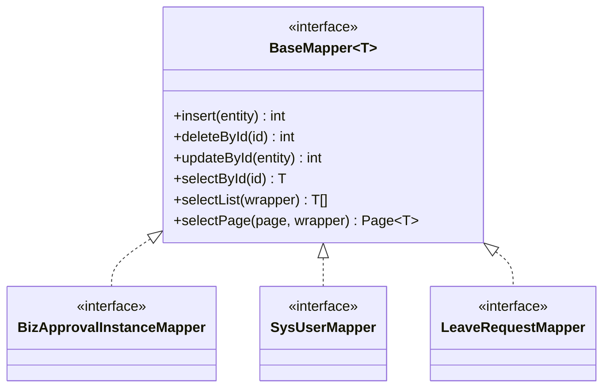

**图表来源**
- [BizApprovalInstanceMapper.java:1-13](file://oa-approval/src/main/java/com/oa/admin/approval/mapper/BizApprovalInstanceMapper.java#L1-L13)
- [SysUserMapper.java:1-13](file://oa-system/src/main/java/com/oa/admin/system/mapper/SysUserMapper.java#L1-L13)
- [LeaveRequestMapper.java:1-14](file://oa-leave/src/main/java/com/oa/admin/leave/mapper/LeaveRequestMapper.java#L1-L14)

**章节来源**
- [BizApprovalInstanceMapper.java:1-13](file://oa-approval/src/main/java/com/oa/admin/approval/mapper/BizApprovalInstanceMapper.java#L1-L13)
- [SysUserMapper.java:1-13](file://oa-system/src/main/java/com/oa/admin/system/mapper/SysUserMapper.java#L1-L13)
- [LeaveRequestMapper.java:1-14](file://oa-leave/src/main/java/com/oa/admin/leave/mapper/LeaveRequestMapper.java#L1-L14)

### 通用Service封装

系统采用ServiceImpl基类封装通用的业务逻辑，结合Mapper实现复杂的业务操作。

- **审批Service**：ApprovalServiceImpl继承ServiceImpl，提供完整的审批流程管理功能。
- **系统用户Service**：SysUserServiceImpl继承ServiceImpl，提供用户管理与角色分配功能。
- **请假Service**：LeaveRequestServiceImpl继承ServiceImpl，提供请假申请的完整生命周期管理。

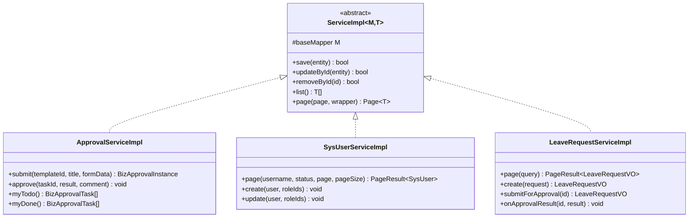

**图表来源**
- [ApprovalServiceImpl.java:1-792](file://oa-approval/src/main/java/com/oa/admin/approval/service/impl/ApprovalServiceImpl.java#L1-L792)
- [SysUserServiceImpl.java:1-73](file://oa-system/src/main/java/com/oa/admin/system/service/impl/SysUserServiceImpl.java#L1-L73)
- [LeaveRequestServiceImpl.java:1-185](file://oa-leave/src/main/java/com/oa/admin/leave/service/impl/LeaveRequestServiceImpl.java#L1-L185)

**章节来源**
- [ApprovalServiceImpl.java:1-792](file://oa-approval/src/main/java/com/oa/admin/approval/service/impl/ApprovalServiceImpl.java#L1-L792)
- [SysUserServiceImpl.java:1-73](file://oa-system/src/main/java/com/oa/admin/system/service/impl/SysUserServiceImpl.java#L1-L73)
- [LeaveRequestServiceImpl.java:1-185](file://oa-leave/src/main/java/com/oa/admin/leave/service/impl/LeaveRequestServiceImpl.java#L1-L185)

## 架构概览

系统采用分层架构，数据访问层位于业务层之下，向上提供统一的Service接口，向下通过Mapper与数据库交互。

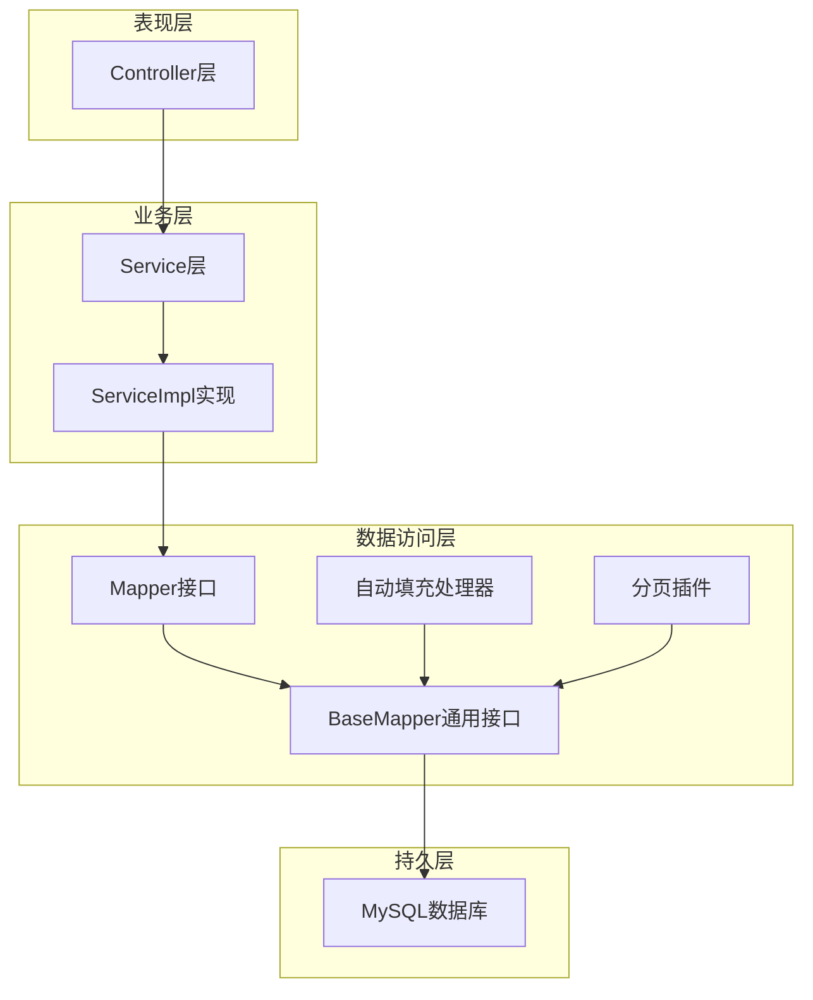

**图表来源**
- [MybatisPlusConfig.java:1-23](file://oa-common/src/main/java/com/oa/admin/common/config/MybatisPlusConfig.java#L1-L23)
- [MyBatisPlusAutoFillHandler.java:1-25](file://oa-common/src/main/java/com/oa/admin/common/config/MyBatisPlusAutoFillHandler.java#L1-L25)
- [BizApprovalInstanceMapper.java:1-13](file://oa-approval/src/main/java/com/oa/admin/approval/mapper/BizApprovalInstanceMapper.java#L1-L13)

## 详细组件分析

### 条件构造器使用最佳实践

系统广泛使用LambdaQueryWrapper进行条件查询构建，提供了灵活且类型安全的查询方式。

#### 审批模块条件查询示例

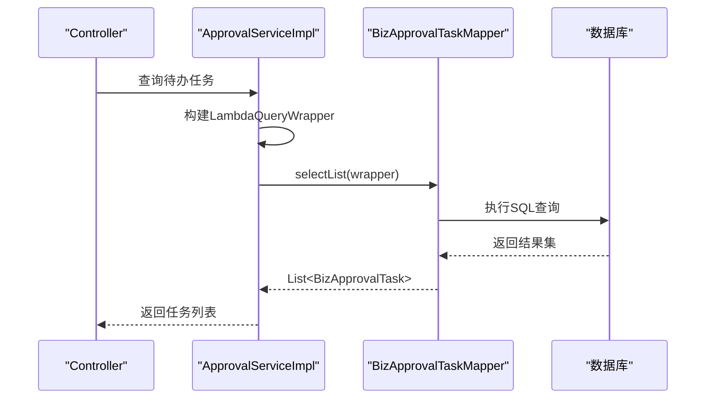

**图表来源**
- [ApprovalServiceImpl.java:243-251](file://oa-approval/src/main/java/com/oa/admin/approval/service/impl/ApprovalServiceImpl.java#L243-L251)

#### 系统模块分页查询示例

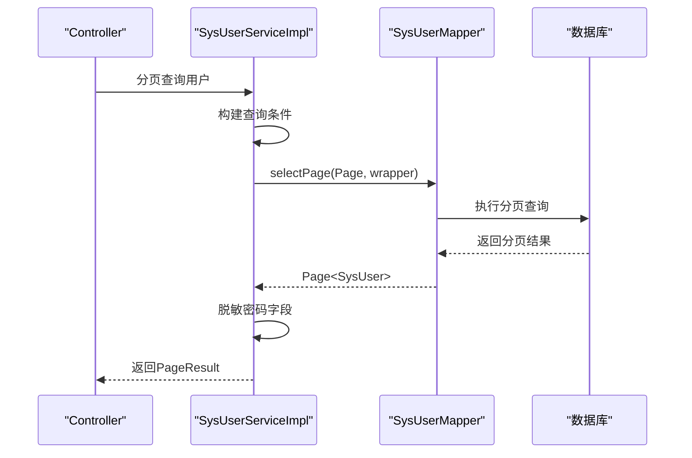

**图表来源**
- [SysUserServiceImpl.java:28-36](file://oa-system/src/main/java/com/oa/admin/system/service/impl/SysUserServiceImpl.java#L28-L36)

**章节来源**
- [ApprovalServiceImpl.java:243-251](file://oa-approval/src/main/java/com/oa/admin/approval/service/impl/ApprovalServiceImpl.java#L243-L251)
- [SysUserServiceImpl.java:28-36](file://oa-system/src/main/java/com/oa/admin/system/service/impl/SysUserServiceImpl.java#L28-L36)

### 批量操作优化

系统在多个场景下实现了批量操作以提升性能：

- **角色分配批量插入**：在用户更新时，先删除旧的角色关联，再批量插入新的角色关联。
- **请假申请状态批量更新**：通过条件更新实现批量状态变更。

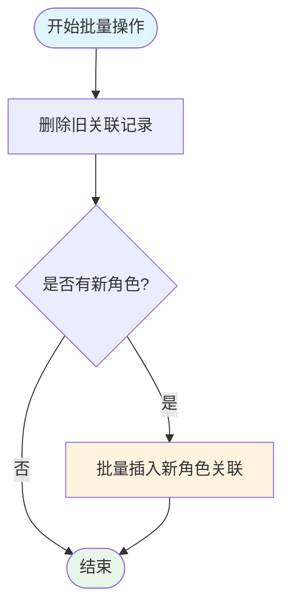

**图表来源**
- [SysUserServiceImpl.java:60-71](file://oa-system/src/main/java/com/oa/admin/system/service/impl/SysUserServiceImpl.java#L60-L71)

**章节来源**
- [SysUserServiceImpl.java:60-71](file://oa-system/src/main/java/com/oa/admin/system/service/impl/SysUserServiceImpl.java#L60-L71)

### 动态表名处理

系统通过BaseEntity中的@TableLogic注解实现逻辑删除，达到动态表名的效果（deleted字段）。

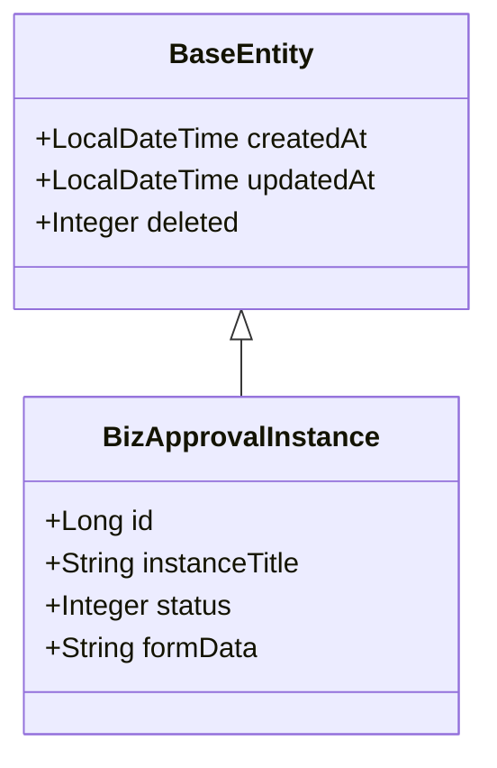

**图表来源**
- [BaseEntity.java:1-26](file://oa-common/src/main/java/com/oa/admin/common/entity/BaseEntity.java#L1-L26)

**章节来源**
- [BaseEntity.java:1-26](file://oa-common/src/main/java/com/oa/admin/common/entity/BaseEntity.java#L1-L26)

### 数据校验与安全策略

#### SQL注入防护

系统通过以下方式防止SQL注入：

- 使用MyBatis-Plus的条件构造器，避免字符串拼接SQL
- 使用预编译参数绑定，确保用户输入被正确转义
- 严格控制动态表名和列名的生成

#### 参数绑定与数据脱敏

- **密码加密**：用户密码采用BCrypt进行哈希存储
- **敏感信息脱敏**：分页返回时移除密码字段
- **参数验证**：服务层对输入参数进行业务逻辑验证

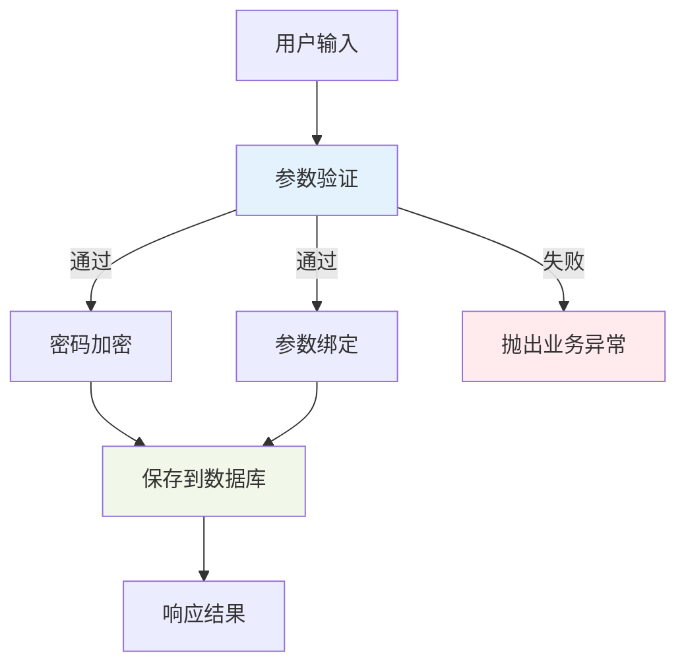

**图表来源**
- [SysUserServiceImpl.java:39-58](file://oa-system/src/main/java/com/oa/admin/system/service/impl/SysUserServiceImpl.java#L39-L58)

**章节来源**
- [SysUserServiceImpl.java:39-58](file://oa-system/src/main/java/com/oa/admin/system/service/impl/SysUserServiceImpl.java#L39-L58)

## 依赖分析

系统基于Maven管理依赖，核心依赖版本如下：

- **MyBatis-Plus**: 3.5.9
- **MySQL驱动**: 8.0.33
- **Flowable工作流**: 7.2.0
- **Sa-Token认证**: 1.44.0
- **Hutool工具库**: 5.8.34

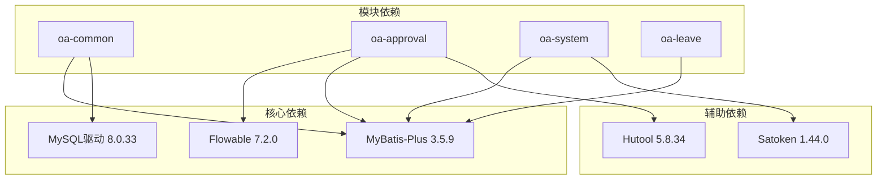

**图表来源**
- [pom.xml:36-66](file://pom.xml#L36-L66)

**章节来源**
- [pom.xml:36-66](file://pom.xml#L36-L66)

## 性能考虑

### 查询优化

- **索引设计**：通过代码生成器自动生成数据库索引，确保常用查询字段建立合适索引
- **分页查询**：统一使用MyBatis-Plus分页插件，避免全表扫描
- **条件查询**：使用LambdaQueryWrapper构建精确查询条件，减少不必要的字段选择

### 缓存策略

- **Redis缓存**：建议对热点数据（如用户权限、审批模板）实施Redis缓存
- **数据库连接池**：配置合理的连接池大小，避免连接泄漏
- **查询结果缓存**：对静态数据或低频变更数据实施缓存

### 连接池配置

- **最大连接数**：根据业务并发量设置合理上限
- **连接超时时间**：设置适当的连接获取超时时间
- **空闲连接检查**：定期清理长时间未使用的连接

## 故障排除指南

### 常见问题及解决方案

#### 分页查询异常

**问题描述**：分页查询返回空结果或数据不完整

**可能原因**：
- 分页参数传递错误
- 数据库索引缺失导致分页性能差
- 查询条件过于宽泛

**解决方案**：
- 检查分页参数（page、pageSize）的有效性
- 为查询字段添加合适的索引
- 优化查询条件，增加必要的过滤条件

#### 自动填充失效

**问题描述**：createdAt、updatedAt字段未自动填充

**可能原因**：
- MetaObjectHandler未正确注册
- 实体类缺少相应的字段定义
- 插入操作未使用正确的Mapper方法

**解决方案**：
- 确认MyBatis-Plus配置类已生效
- 检查实体类是否包含相应字段
- 使用save()方法而非直接执行SQL

#### 乐观锁冲突

**问题描述**：更新操作抛出乐观锁异常

**可能原因**：
- 多个进程同时修改同一记录
- 版本号字段配置错误
- 并发更新频率过高

**解决方案**：
- 实施重试机制，捕获并发异常后重试
- 优化业务流程，减少并发更新
- 考虑使用分布式锁解决极端情况

**章节来源**
- [MyBatisPlusAutoFillHandler.java:1-25](file://oa-common/src/main/java/com/oa/admin/common/config/MyBatisPlusAutoFillHandler.java#L1-L25)
- [MybatisPlusConfig.java:1-23](file://oa-common/src/main/java/com/oa/admin/common/config/MybatisPlusConfig.java#L1-L23)

## 结论

本数据访问层设计方案基于MyBatis-Plus实现了标准化的ORM框架，通过统一的配置、自动填充机制和通用Service封装，为整个OA审批管理系统提供了稳定可靠的数据访问能力。系统在保证开发效率的同时，也充分考虑了性能优化、安全防护和可维护性，为后续的功能扩展奠定了良好的基础。

通过条件构造器的规范使用、批量操作的优化实现以及动态表名的逻辑删除策略，系统能够有效应对复杂的业务场景。同时，完善的错误处理机制和性能优化建议，确保了系统的稳定运行和良好用户体验。