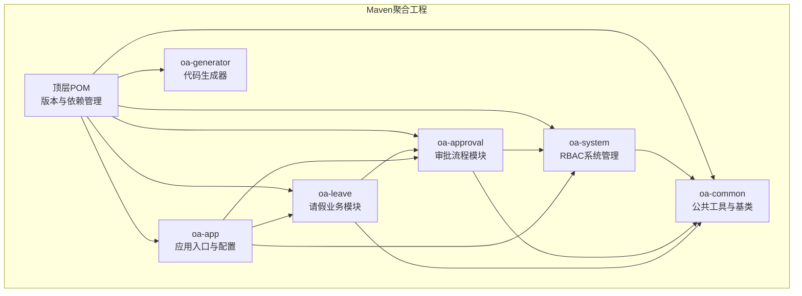
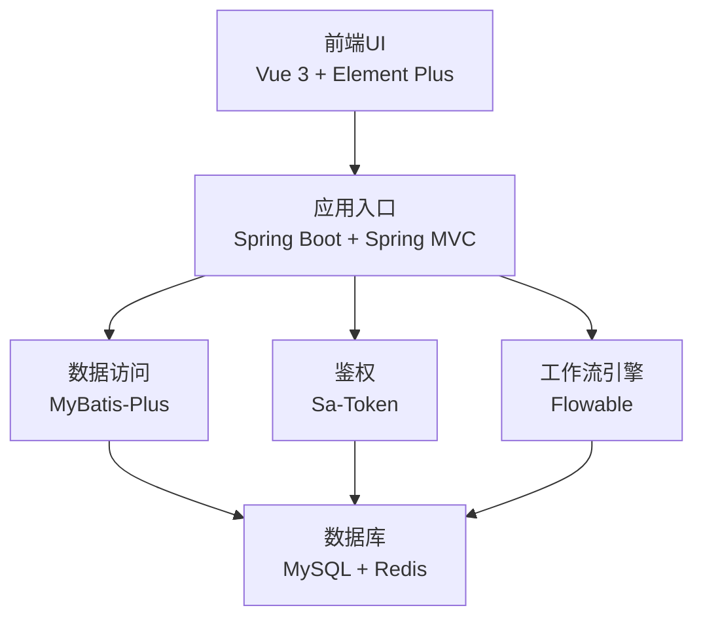
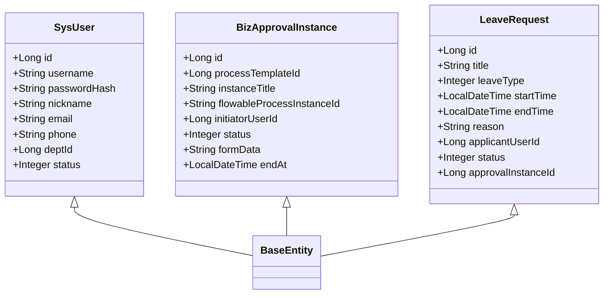
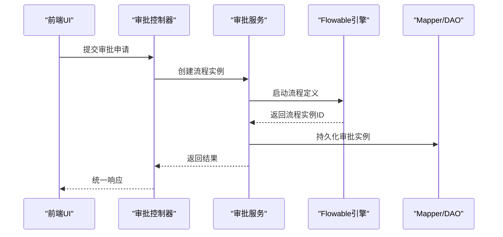
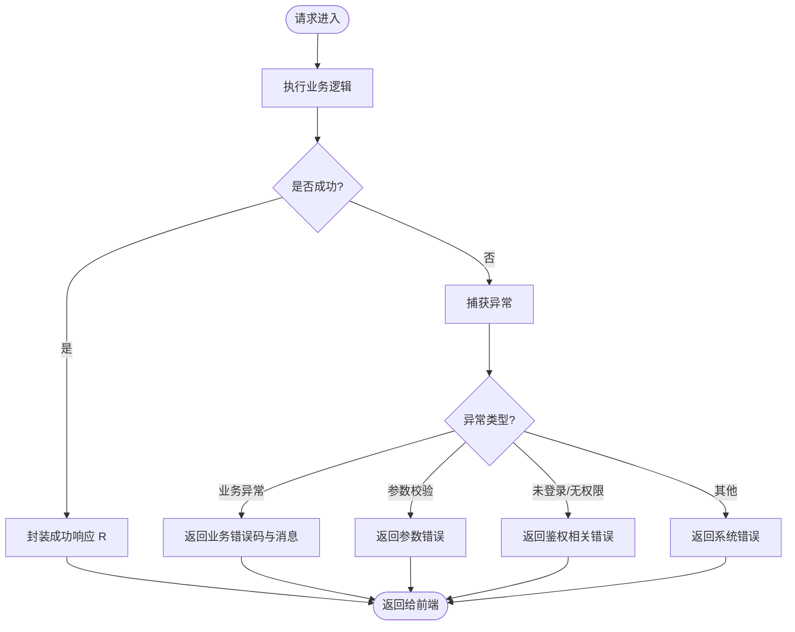
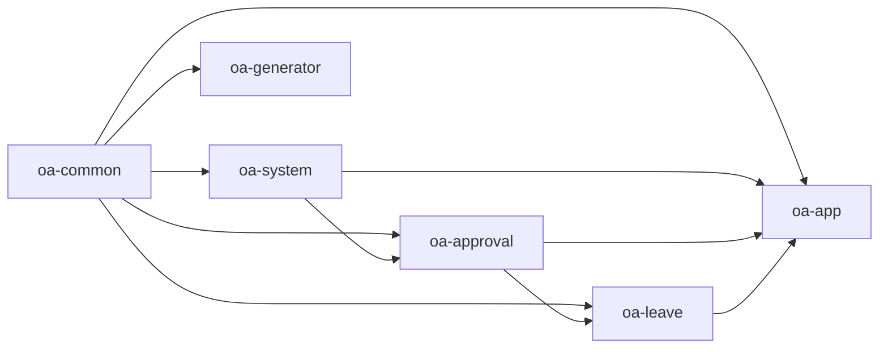

# 整体架构设计

<cite>
**本文引用的文件**
- [pom.xml](file://pom.xml)
- [application.yml](file://oa-app/src/main/resources/application.yml)
- [R.java](file://oa-common/src/main/java/com/oa/admin/common/result/R.java)
- [GlobalExceptionHandler.java](file://oa-common/src/main/java/com/oa/admin/common/exception/GlobalExceptionHandler.java)
- [SaTokenConfig.java](file://oa-system/src/main/java/com/oa/admin/system/config/SaTokenConfig.java)
- [SysUser.java](file://oa-system/src/main/java/com/oa/admin/system/entity/SysUser.java)
- [FlowableConfig.java](file://oa-approval/src/main/java/com/oa/admin/approval/config/FlowableConfig.java)
- [BizApprovalInstance.java](file://oa-approval/src/main/java/com/oa/admin/approval/entity/BizApprovalInstance.java)
- [LeaveRequest.java](file://oa-leave/src/main/java/com/oa/admin/leave/entity/LeaveRequest.java)
- [oa-common/pom.xml](file://oa-common/pom.xml)
- [oa-system/pom.xml](file://oa-system/pom.xml)
- [oa-approval/pom.xml](file://oa-approval/pom.xml)
- [oa-leave/pom.xml](file://oa-leave/pom.xml)
- [oa-generator/pom.xml](file://oa-generator/pom.xml)
- [package.json](file://oa-ui/package.json)
</cite>

## 目录
1. [引言](#引言)
2. [项目结构](#项目结构)
3. [核心组件](#核心组件)
4. [架构总览](#架构总览)
5. [详细组件分析](#详细组件分析)
6. [依赖分析](#依赖分析)
7. [性能考虑](#性能考虑)
8. [故障排查指南](#故障排查指南)
9. [结论](#结论)
10. [附录](#附录)

## 引言
本项目是一个基于Spring Boot的RBAC+审批流程管理平台模板，采用Maven多模块架构组织，覆盖表现层（Vue前端）、后端应用层（Spring Boot）、业务层与数据访问层的清晰分层。系统以Flowable工作流引擎为核心实现审批流程编排，结合Sa-Token实现鉴权与会话管理，并通过MyBatis-Plus进行数据库访问。本文档从架构设计角度阐述分层职责、模块边界与依赖关系，总结设计原则与技术选型权衡，并给出可扩展性、性能优化与安全架构要点。

## 项目结构
项目采用Maven聚合工程，顶层POM统一管理版本与模块依赖；子模块按功能域拆分：公共基础模块、系统管理模块、审批流程模块、业务模块（示例：请假）、应用入口模块以及代码生成器模块。前端UI独立于后端，通过HTTP API交互。

**图表来源**
- [pom.xml:21-28](file://pom.xml#L21-L28)
- [oa-common/pom.xml:17-51](file://oa-common/pom.xml#L17-L51)
- [oa-system/pom.xml:14-36](file://oa-system/pom.xml#L14-L36)
- [oa-approval/pom.xml:14-46](file://oa-approval/pom.xml#L14-L46)
- [oa-leave/pom.xml:14-31](file://oa-leave/pom.xml#L14-L31)
- [oa-generator/pom.xml:16-49](file://oa-generator/pom.xml#L16-L49)

**章节来源**
- [pom.xml:21-28](file://pom.xml#L21-L28)
- [pom.xml:44-113](file://pom.xml#L44-L113)

## 核心组件
- 公共基础模块（oa-common）
  - 职责：提供统一响应包装、全局异常处理、通用实体基类、工具类与通用依赖（Web、MyBatis-Plus、Sa-Token、Jackson等）。
  - 关键点：统一返回格式R<T>、全局异常处理器GlobalExceptionHandler，确保前后端一致的错误语义。
- 系统管理模块（oa-system）
  - 职责：用户、角色、权限、部门等RBAC体系的增删改查与权限控制。
  - 关键点：集成Sa-Token并配置拦截器，保护受控接口路径。
- 审批流程模块（oa-approval）
  - 职责：审批流程定义、实例管理、任务管理、监听器与事件处理、流程模板与节点配置。
  - 关键点：集成Flowable，自定义FlowableConfig注入事件监听器，支撑流程生命周期事件。
- 业务模块（oa-leave）
  - 职责：具体业务场景（如请假）的数据模型与服务，与审批模块解耦协作。
  - 关键点：业务实体继承公共基类，复用公共能力。
- 应用入口模块（oa-app）
  - 职责：Spring Boot启动类与运行时配置（数据库、Redis、Flyway、MyBatis-Plus、Sa-Token、Flowable等）。
- 代码生成器模块（oa-generator）
  - 职责：根据YAML定义生成后端代码、前端页面与迁移脚本，提升开发效率。

**章节来源**
- [R.java:11-43](file://oa-common/src/main/java/com/oa/admin/common/result/R.java#L11-L43)
- [GlobalExceptionHandler.java:21-73](file://oa-common/src/main/java/com/oa/admin/common/exception/GlobalExceptionHandler.java#L21-L73)
- [SaTokenConfig.java:13-24](file://oa-system/src/main/java/com/oa/admin/system/config/SaTokenConfig.java#L13-L24)
- [FlowableConfig.java:17-30](file://oa-approval/src/main/java/com/oa/admin/approval/config/FlowableConfig.java#L17-L30)
- [BizApprovalInstance.java:16-32](file://oa-approval/src/main/java/com/oa/admin/approval/entity/BizApprovalInstance.java#L16-L32)
- [LeaveRequest.java:16-47](file://oa-leave/src/main/java/com/oa/admin/leave/entity/LeaveRequest.java#L16-L47)
- [application.yml:4-59](file://oa-app/src/main/resources/application.yml#L4-L59)

## 架构总览
系统采用经典的分层架构：
- 表现层：Vue前端（oa-ui），负责用户界面与API调用。
- 应用层：Spring Boot应用（oa-app），承载业务编排与外部集成。
- 业务层：oa-system、oa-approval、oa-leave等模块，封装领域逻辑与服务。
- 数据访问层：MyBatis-Plus Mapper与实体，配合通用基类与逻辑删除配置。
- 基础设施：数据库（MySQL）、缓存（Redis）、工作流引擎（Flowable）、鉴权（Sa-Token）。

**图表来源**
- [package.json:15-22](file://oa-ui/package.json#L15-L22)
- [application.yml:4-59](file://oa-app/src/main/resources/application.yml#L4-L59)
- [pom.xml:36-112](file://pom.xml#L36-L112)

## 详细组件分析

### 分层架构与职责划分
- 表现层（前端UI）
  - 使用Vue 3与Element Plus构建管理后台，路由、状态管理（Pinia）、API封装与BPMN流程设计器集成。
  - 通过Axios调用后端REST接口，遵循统一响应格式。
- 业务层（后端模块）
  - 系统管理：用户、角色、权限、部门管理，RBAC鉴权。
  - 审批流程：流程模板、实例、任务、抄送、通知、审计日志。
  - 业务模块：以请假为例，展示如何在审批框架下扩展业务实体与服务。
- 数据访问层
  - 统一使用MyBatis-Plus，实体继承公共基类，支持逻辑删除、自动填充等特性。
- 应用层（配置与启动）
  - 集成数据库连接池、Flyway迁移、Redis、MyBatis-Plus、Sa-Token、Flowable等。

**图表来源**
- [SysUser.java:16-26](file://oa-system/src/main/java/com/oa/admin/system/entity/SysUser.java#L16-L26)
- [BizApprovalInstance.java:19-32](file://oa-approval/src/main/java/com/oa/admin/approval/entity/BizApprovalInstance.java#L19-L32)
- [LeaveRequest.java:18-47](file://oa-leave/src/main/java/com/oa/admin/leave/entity/LeaveRequest.java#L18-L47)

**章节来源**
- [SysUser.java:16-26](file://oa-system/src/main/java/com/oa/admin/system/entity/SysUser.java#L16-L26)
- [BizApprovalInstance.java:19-32](file://oa-approval/src/main/java/com/oa/admin/approval/entity/BizApprovalInstance.java#L19-L32)
- [LeaveRequest.java:18-47](file://oa-leave/src/main/java/com/oa/admin/leave/entity/LeaveRequest.java#L18-L47)

### 审批流程集成序列
以下序列图展示了前端提交审批请求到流程引擎的典型调用链路。

**图表来源**
- [FlowableConfig.java:20-29](file://oa-approval/src/main/java/com/oa/admin/approval/config/FlowableConfig.java#L20-L29)
- [BizApprovalInstance.java:19-32](file://oa-approval/src/main/java/com/oa/admin/approval/entity/BizApprovalInstance.java#L19-L32)

### 错误处理与统一响应
系统通过全局异常处理器与统一响应包装，保证前后端一致的错误语义与调试信息。

**图表来源**
- [GlobalExceptionHandler.java:21-73](file://oa-common/src/main/java/com/oa/admin/common/exception/GlobalExceptionHandler.java#L21-L73)
- [R.java:21-43](file://oa-common/src/main/java/com/oa/admin/common/result/R.java#L21-L43)

**章节来源**
- [GlobalExceptionHandler.java:21-73](file://oa-common/src/main/java/com/oa/admin/common/exception/GlobalExceptionHandler.java#L21-L73)
- [R.java:21-43](file://oa-common/src/main/java/com/oa/admin/common/result/R.java#L21-L43)

## 依赖分析
模块间依赖遵循“上层模块依赖下层模块”的原则，避免循环依赖。公共模块被所有业务模块依赖，系统模块同时依赖公共模块并被审批模块依赖，审批模块再依赖系统模块与公共模块，业务模块依赖公共模块与审批模块，应用模块聚合所有业务模块。

**图表来源**
- [pom.xml:21-28](file://pom.xml#L21-L28)
- [oa-common/pom.xml:17-51](file://oa-common/pom.xml#L17-L51)
- [oa-system/pom.xml:14-36](file://oa-system/pom.xml#L14-L36)
- [oa-approval/pom.xml:14-46](file://oa-approval/pom.xml#L14-L46)
- [oa-leave/pom.xml:14-31](file://oa-leave/pom.xml#L14-L31)
- [oa-generator/pom.xml:16-49](file://oa-generator/pom.xml#L16-L49)

**章节来源**
- [pom.xml:21-28](file://pom.xml#L21-L28)
- [oa-common/pom.xml:17-51](file://oa-common/pom.xml#L17-L51)
- [oa-system/pom.xml:14-36](file://oa-system/pom.xml#L14-L36)
- [oa-approval/pom.xml:14-46](file://oa-approval/pom.xml#L14-L46)
- [oa-leave/pom.xml:14-31](file://oa-leave/pom.xml#L14-L31)
- [oa-generator/pom.xml:16-49](file://oa-generator/pom.xml#L16-L49)

## 性能考虑
- 连接池与数据库
  - HikariCP连接池参数可调，建议根据QPS与并发线程数调整最大池大小、空闲超时与最大生命周期。
  - 启用预编译语句缓存与服务器端预编译，减少SQL解析开销。
- 缓存策略
  - Redis用于会话存储与热点数据缓存，建议对查询频繁且变更不频繁的数据设置合理TTL。
- 工作流性能
  - Flowable异步执行器默认关闭，适合中小规模流程；大规模场景可评估开启异步执行与事件监听器优化。
- 序列化与安全
  - Sa-Token启用JSON序列化以缓解特定CVE风险，建议定期升级依赖版本。
- 前端性能
  - Vue按需加载组件与路由懒加载，减少首屏体积；BPMN设计器仅在需要时加载。

**章节来源**
- [application.yml:10-24](file://oa-app/src/main/resources/application.yml#L10-L24)
- [application.yml:32-35](file://oa-app/src/main/resources/application.yml#L32-L35)
- [application.yml:56-59](file://oa-app/src/main/resources/application.yml#L56-L59)
- [pom.xml:36-112](file://pom.xml#L36-L112)

## 故障排查指南
- 鉴权相关
  - 未登录或令牌过期：检查前端是否携带有效token，后端拦截器是否正确配置。
  - 无权限访问：确认用户角色与权限映射，接口路径是否在白名单中。
- 参数校验
  - 方法参数绑定与校验异常：查看字段错误提示，定位首个错误字段。
- 业务异常
  - 自定义业务异常：返回统一错误码与消息，便于前端提示与日志追踪。
- 数据库与迁移
  - Flyway迁移失败：检查迁移脚本与占位符配置，确认baseline策略。
- 工作流事件
  - 流程结束事件未触发：检查事件监听器注册与配置。

**章节来源**
- [SaTokenConfig.java:16-23](file://oa-system/src/main/java/com/oa/admin/system/config/SaTokenConfig.java#L16-L23)
- [GlobalExceptionHandler.java:23-72](file://oa-common/src/main/java/com/oa/admin/common/exception/GlobalExceptionHandler.java#L23-L72)
- [application.yml:25-29](file://oa-app/src/main/resources/application.yml#L25-L29)
- [FlowableConfig.java:17-30](file://oa-approval/src/main/java/com/oa/admin/approval/config/FlowableConfig.java#L17-L30)

## 结论
本项目通过Maven多模块与分层架构实现了高内聚低耦合的设计目标，公共模块沉淀通用能力，业务模块围绕领域职责展开，应用入口集中配置与启动。技术栈选择兼顾成熟度与可维护性：Flowable提供强大的流程编排能力，Sa-Token简化鉴权，MyBatis-Plus提升数据访问效率。通过统一响应与异常处理，系统具备良好的一致性与可观测性。建议在生产环境中进一步完善监控、限流与灰度发布机制，持续演进以满足业务增长需求。

## 附录
- 设计原则
  - 高内聚：每个模块聚焦单一职责（如RBAC、审批、业务）。
  - 低耦合：模块间通过接口与公共契约交互，避免直接耦合。
  - 单一职责：控制器仅负责请求转发，服务封装业务规则，Mapper专注数据访问。
  - 开闭原则：通过扩展监听器、事件与配置实现功能增强，无需修改既有代码。
- 技术选型权衡
  - Flowable vs Camunda：本项目选择Flowable，因其生态适配Spring Boot 3与国内社区支持。
  - Sa-Token vs Spring Security：Sa-Token更轻量、易用，适合快速搭建RBAC。
  - MyBatis-Plus vs JPA/Hibernate：MyBatis-Plus在复杂SQL与性能调优方面更具灵活性。
- 可扩展性设计
  - 新增业务模块：复用oa-common，依赖oa-approval即可接入审批流程。
  - 新增流程模板：通过设计器与事件监听器扩展流程行为。
  - 插件化：代码生成器模块可作为新模块的脚手架工具。
- 安全架构要点
  - 传输安全：建议在网关层启用HTTPS。
  - 会话安全：Sa-Token配置合理的超时与共享策略。
  - 权限最小化：RBAC细粒度授权，接口级权限校验。
  - 输入校验：结合Bean Validation与全局异常处理，阻断非法输入。