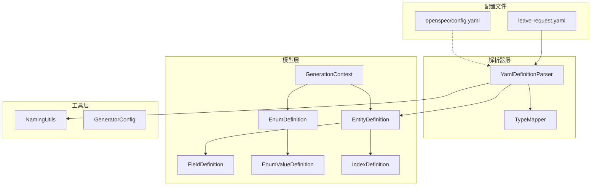
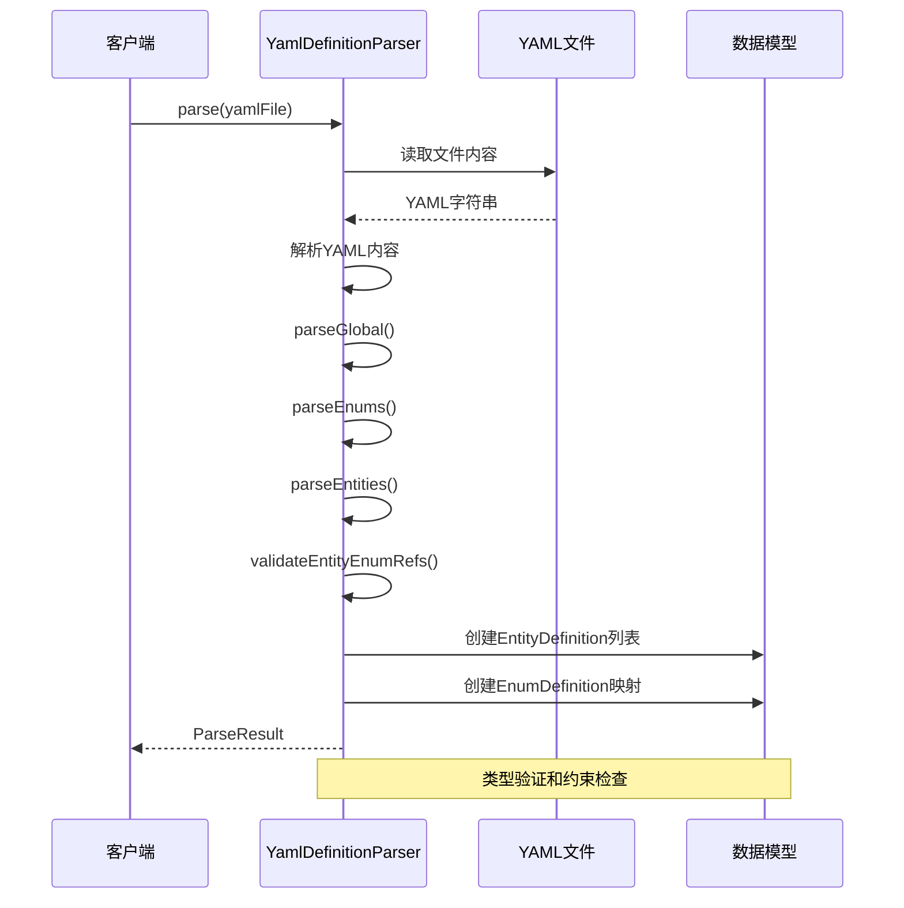
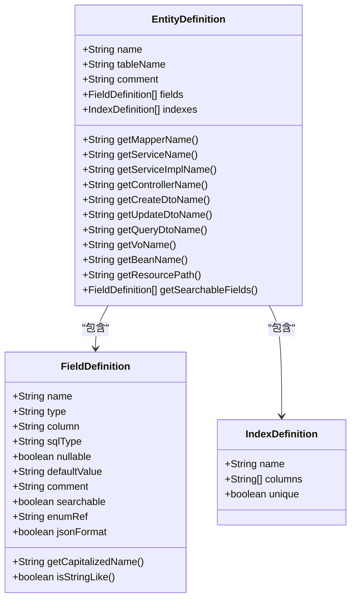
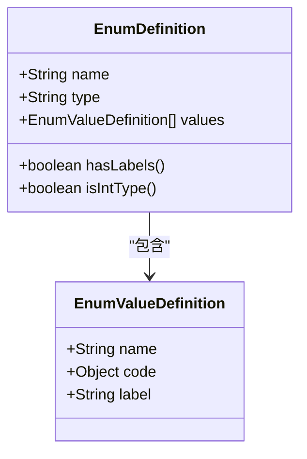
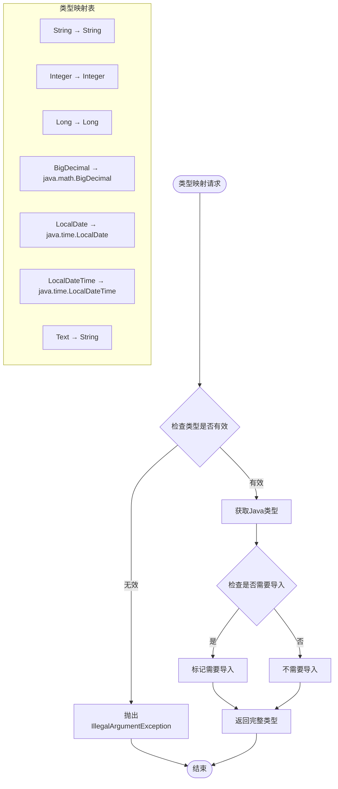
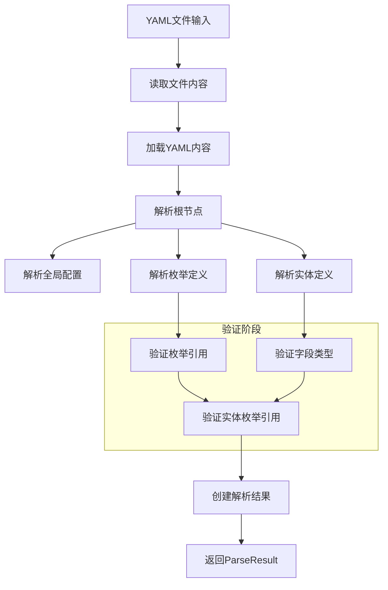
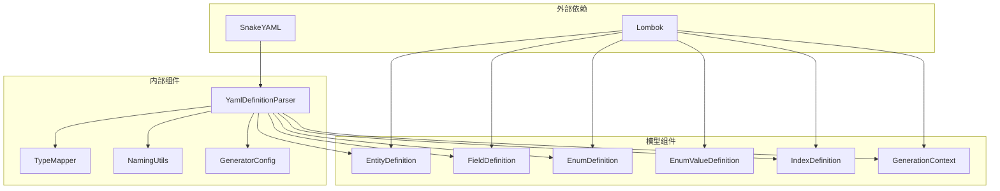

# YAML定义解析器

<cite>
**本文档引用的文件**
- [YamlDefinitionParser.java](file://oa-generator/src/main/java/com/oa/admin/generator/parser/YamlDefinitionParser.java)
- [TypeMapper.java](file://oa-generator/src/main/java/com/oa/admin/generator/parser/TypeMapper.java)
- [EntityDefinition.java](file://oa-generator/src/main/java/com/oa/admin/generator/model/EntityDefinition.java)
- [FieldDefinition.java](file://oa-generator/src/main/java/com/oa/admin/generator/model/FieldDefinition.java)
- [EnumDefinition.java](file://oa-generator/src/main/java/com/oa/admin/generator/model/EnumDefinition.java)
- [EnumValueDefinition.java](file://oa-generator/src/main/java/com/oa/admin/generator/model/EnumValueDefinition.java)
- [IndexDefinition.java](file://oa-generator/src/main/java/com/oa/admin/generator/model/IndexDefinition.java)
- [GenerationContext.java](file://oa-generator/src/main/java/com/oa/admin/generator/model/GenerationContext.java)
- [NamingUtils.java](file://oa-generator/src/main/java/com/oa/admin/generator/util/NamingUtils.java)
- [GeneratorConfig.java](file://oa-generator/src/main/java/com/oa/admin/generator/config/GeneratorConfig.java)
- [leave-request.yaml](file://generators/leave-request.yaml)
- [config.yaml](file://openspec/config.yaml)
</cite>

## 目录
1. [简介](#简介)
2. [项目结构](#项目结构)
3. [核心组件](#核心组件)
4. [架构概览](#架构概览)
5. [详细组件分析](#详细组件分析)
6. [依赖关系分析](#依赖关系分析)
7. [性能考虑](#性能考虑)
8. [故障排除指南](#故障排除指南)
9. [结论](#结论)
10. [附录](#附录)

## 简介

YAML定义解析器是一个专门用于解析业务实体定义的工具组件，它将人类可读的YAML配置文件转换为强类型的Java对象模型。该解析器支持完整的实体定义、字段配置、枚举定义和索引配置，为代码生成器提供标准化的数据结构。

解析器的核心功能包括：
- YAML文件到Java对象的完整映射
- 实体定义提取算法
- 字段类型映射机制
- 枚举类型处理
- 数据验证和约束检查

## 项目结构

YAML定义解析器位于`oa-generator`模块中，采用清晰的分层架构设计：



**图表来源**
- [YamlDefinitionParser.java:23-204](file://oa-generator/src/main/java/com/oa/admin/generator/parser/YamlDefinitionParser.java#L23-L204)
- [EntityDefinition.java:12-66](file://oa-generator/src/main/java/com/oa/admin/generator/model/EntityDefinition.java#L12-L66)

**章节来源**
- [YamlDefinitionParser.java:1-204](file://oa-generator/src/main/java/com/oa/admin/generator/parser/YamlDefinitionParser.java#L1-L204)
- [EntityDefinition.java:1-66](file://oa-generator/src/main/java/com/oa/admin/generator/model/EntityDefinition.java#L1-L66)

## 核心组件

### YamlDefinitionParser 解析器

YamlDefinitionParser是整个系统的核心组件，负责将YAML配置文件转换为内部数据模型。它实现了完整的解析流程，包括全局配置解析、枚举定义解析、实体定义解析和验证。

主要特性：
- 支持增量解析和批量解析两种模式
- 内置数据验证机制
- 类型安全的类型映射
- 自动化的命名转换

### TypeMapper 类型映射器

TypeMapper负责处理Java类型与YAML类型的映射关系，确保类型的一致性和正确性。

支持的类型映射：
- 基本类型：String、Integer、Long、Boolean
- 时间类型：LocalDate、LocalDateTime
- 数值类型：BigDecimal
- 文本类型：Text → String

**章节来源**
- [YamlDefinitionParser.java:23-204](file://oa-generator/src/main/java/com/oa/admin/generator/parser/YamlDefinitionParser.java#L23-L204)
- [TypeMapper.java:9-66](file://oa-generator/src/main/java/com/oa/admin/generator/parser/TypeMapper.java#L9-L66)

## 架构概览

解析器采用分层架构设计，每层都有明确的职责分工：



**图表来源**
- [YamlDefinitionParser.java:34-49](file://oa-generator/src/main/java/com/oa/admin/generator/parser/YamlDefinitionParser.java#L34-L49)

## 详细组件分析

### 数据模型设计

#### EntityDefinition 实体定义

EntityDefinition代表一个完整的业务实体，包含表名、注释、字段列表和索引配置。



**图表来源**
- [EntityDefinition.java:12-66](file://oa-generator/src/main/java/com/oa/admin/generator/model/EntityDefinition.java#L12-L66)
- [FieldDefinition.java:9-30](file://oa-generator/src/main/java/com/oa/admin/generator/model/FieldDefinition.java#L9-L30)
- [IndexDefinition.java:10-16](file://oa-generator/src/main/java/com/oa/admin/generator/model/IndexDefinition.java#L10-L16)

#### EnumDefinition 枚举定义

枚举定义支持多种配置方式，包括简单的值列表和复杂的键值对配置。



**图表来源**
- [EnumDefinition.java:10-24](file://oa-generator/src/main/java/com/oa/admin/generator/model/EnumDefinition.java#L10-L24)
- [EnumValueDefinition.java:8-14](file://oa-generator/src/main/java/com/oa/admin/generator/model/EnumValueDefinition.java#L8-L14)

**章节来源**
- [EntityDefinition.java:1-66](file://oa-generator/src/main/java/com/oa/admin/generator/model/EntityDefinition.java#L1-L66)
- [FieldDefinition.java:1-30](file://oa-generator/src/main/java/com/oa/admin/generator/model/FieldDefinition.java#L1-L30)
- [EnumDefinition.java:1-24](file://oa-generator/src/main/java/com/oa/admin/generator/model/EnumDefinition.java#L1-L24)

### 类型映射机制

TypeMapper提供了完整的类型映射功能，支持Java类型与YAML类型的双向转换。



**图表来源**
- [TypeMapper.java:11-65](file://oa-generator/src/main/java/com/oa/admin/generator/parser/TypeMapper.java#L11-L65)

**章节来源**
- [TypeMapper.java:1-66](file://oa-generator/src/main/java/com/oa/admin/generator/parser/TypeMapper.java#L1-L66)

### 解析流程详解

#### YAML文件解析流程



**图表来源**
- [YamlDefinitionParser.java:34-49](file://oa-generator/src/main/java/com/oa/admin/generator/parser/YamlDefinitionParser.java#L34-L49)

**章节来源**
- [YamlDefinitionParser.java:34-204](file://oa-generator/src/main/java/com/oa/admin/generator/parser/YamlDefinitionParser.java#L34-L204)

## 依赖关系分析

解析器的依赖关系清晰且层次分明：



**图表来源**
- [YamlDefinitionParser.java:3-10](file://oa-generator/src/main/java/com/oa/admin/generator/parser/YamlDefinitionParser.java#L3-L10)
- [EntityDefinition.java:3-4](file://oa-generator/src/main/java/com/oa/admin/generator/model/EntityDefinition.java#L3-L4)

**章节来源**
- [YamlDefinitionParser.java:1-204](file://oa-generator/src/main/java/com/oa/admin/generator/parser/YamlDefinitionParser.java#L1-L204)

## 性能考虑

解析器在设计时充分考虑了性能优化：

1. **延迟初始化**：所有解析操作都是惰性的，只在需要时执行
2. **内存优化**：使用LinkedHashMap保持插入顺序的同时优化内存使用
3. **类型缓存**：TypeMapper内部维护类型映射缓存，避免重复计算
4. **流式处理**：支持大文件的流式解析，减少内存占用

## 故障排除指南

### 常见错误及解决方案

#### 类型验证错误
**问题**：字段类型不在支持列表中
**解决方案**：检查TypeMapper中的类型映射表，确认使用正确的类型名称

#### 枚举引用错误
**问题**：实体字段引用了未定义的枚举
**解决方案**：在YAML文件中添加对应的枚举定义，或修正枚举引用名称

#### 表名生成冲突
**问题**：自动生成的表名与现有表名冲突
**解决方案**：在实体定义中显式指定tableName属性

**章节来源**
- [YamlDefinitionParser.java:168-174](file://oa-generator/src/main/java/com/oa/admin/generator/parser/YamlDefinitionParser.java#L168-L174)
- [YamlDefinitionParser.java:192-202](file://oa-generator/src/main/java/com/oa/admin/generator/parser/YamlDefinitionParser.java#L192-L202)

## 结论

YAML定义解析器是一个设计精良、功能完整的工具组件，它成功地将复杂的YAML配置转换为强类型的Java对象模型。通过清晰的分层架构、完善的类型映射机制和严格的数据验证，该解析器为代码生成器提供了可靠的基础。

主要优势：
- **类型安全**：完整的类型检查和映射机制
- **扩展性强**：易于添加新的类型和配置选项
- **验证完善**：内置的数据完整性检查
- **性能优秀**：优化的内存使用和解析效率

## 附录

### YAML定义语法参考

#### 全局配置
```yaml
global:
  module: string          # 模块名称
  tablePrefix: string     # 表前缀
  author: string          # 作者信息
  basePackage: string     # 基础包名（可选）
```

#### 枚举定义
```yaml
enums:
  EnumName:
    type: string         # 枚举类型（默认：int）
    values:
      VALUE_NAME:      # 值名称
        code: number    # 编码值
        label: string   # 显示标签
      # 或者简写形式
      OTHER_VALUE: 100
```

#### 实体定义
```yaml
entities:
  - EntityName:
      tableName: string    # 表名（可选）
      comment: string      # 实体注释
      fields:
        - name: string      # 字段名称
          type: string      # Java类型
          column: string    # 列名（可选）
          sqlType: string   # SQL类型
          nullable: boolean # 是否可空
          defaultValue: any # 默认值
          comment: string   # 字段注释
          searchable: boolean # 是否可搜索
          enum: string      # 枚举引用
          jsonFormat: boolean # JSON格式
      indexes:
        - name: string      # 索引名称
          columns: [string] # 索引列列表
          unique: boolean   # 是否唯一
```

### 实际示例

基于`leave-request.yaml`的实际解析结果：

**输入YAML片段**：
```yaml
entities:
  - LeaveRequest:
      tableName: biz_leave_request
      comment: 请假申请
      fields:
        - name: title
          type: String
          sqlType: VARCHAR(200)
          nullable: false
          comment: 申请标题
          searchable: true
```

**解析后的EntityDefinition结构**：
- name: "LeaveRequest"
- tableName: "biz_leave_request"
- comment: "请假申请"
- fields: 包含标题字段的列表
- indexes: 空列表（无索引定义）

**章节来源**
- [leave-request.yaml:1-74](file://generators/leave-request.yaml#L1-L74)
- [YamlDefinitionParser.java:108-125](file://oa-generator/src/main/java/com/oa/admin/generator/parser/YamlDefinitionParser.java#L108-L125)