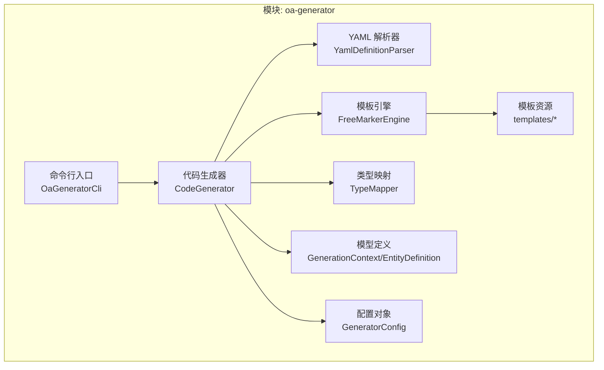
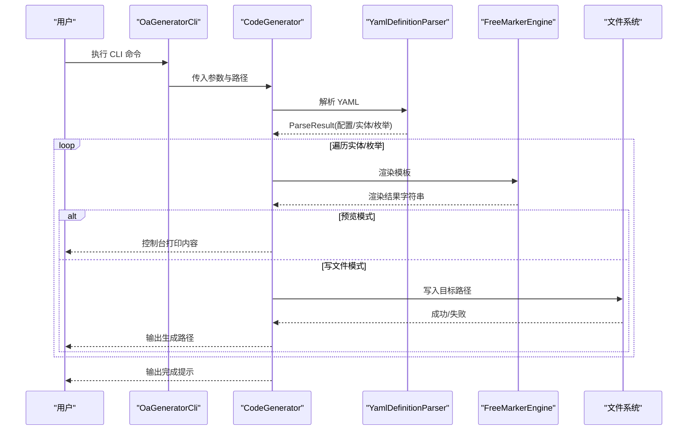
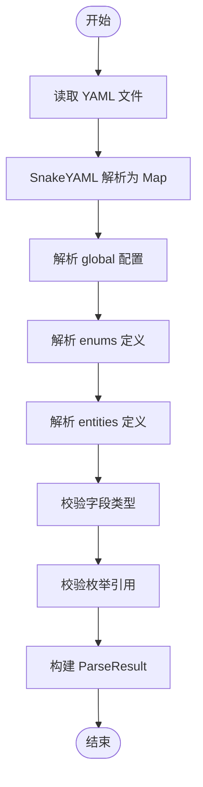
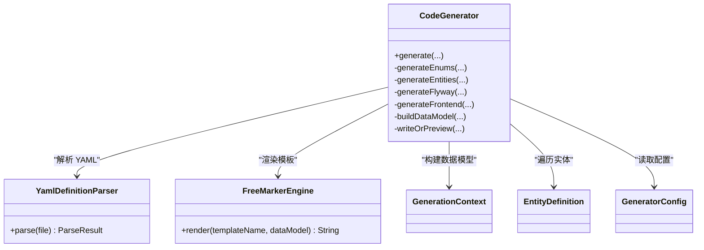
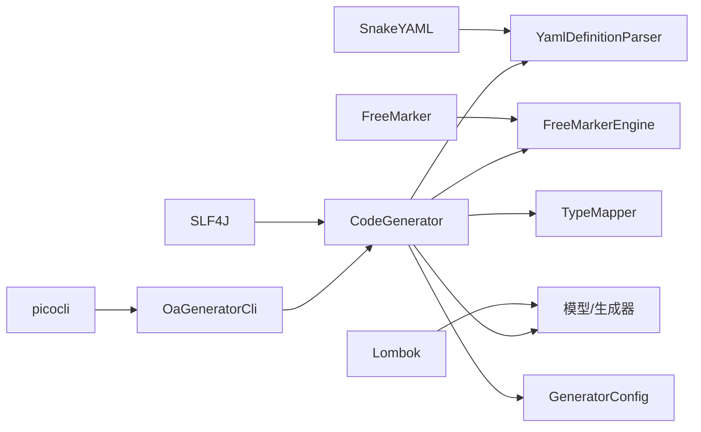

# 代码生成器模块 (oa-generator)

<cite>
**本文引用的文件**
- [OaGeneratorCli.java](file://oa-generator/src/main/java/com/oa/admin/generator/OaGeneratorCli.java)
- [CodeGenerator.java](file://oa-generator/src/main/java/com/oa/admin/generator/engine/CodeGenerator.java)
- [FreeMarkerEngine.java](file://oa-generator/src/main/java/com/oa/admin/generator/engine/FreeMarkerEngine.java)
- [YamlDefinitionParser.java](file://oa-generator/src/main/java/com/oa/admin/generator/parser/YamlDefinitionParser.java)
- [TypeMapper.java](file://oa-generator/src/main/java/com/oa/admin/generator/parser/TypeMapper.java)
- [EntityDefinition.java](file://oa-generator/src/main/java/com/oa/admin/generator/model/EntityDefinition.java)
- [GenerationContext.java](file://oa-generator/src/main/java/com/oa/admin/generator/model/GenerationContext.java)
- [GeneratorConfig.java](file://oa-generator/src/main/java/com/oa/admin/generator/config/GeneratorConfig.java)
- [entity.ftl](file://oa-generator/src/main/resources/templates/entity.ftl)
- [controller.ftl](file://oa-generator/src/main/resources/templates/controller.ftl)
- [vue/list.vue.ftl](file://oa-generator/src/main/resources/templates/vue/list.vue.ftl)
- [leave-request.yaml](file://generators/leave-request.yaml)
- [pom.xml](file://oa-generator/pom.xml)
- [README.md](file://README.md)
</cite>

## 目录
1. [简介](#简介)
2. [项目结构](#项目结构)
3. [核心组件](#核心组件)
4. [架构总览](#架构总览)
5. [详细组件分析](#详细组件分析)
6. [依赖分析](#依赖分析)
7. [性能考虑](#性能考虑)
8. [故障排查指南](#故障排查指南)
9. [结论](#结论)
10. [附录](#附录)

## 简介
本文件为 oa-generator 代码生成器模块的全面架构文档，面向开发者与技术管理者，系统阐述以下主题：
- 整体设计理念与实现架构
- YAML DSL 定义语法与解析流程
- 模板引擎设计与渲染机制
- 代码生成流程（含后端与前端）
- 各类模板的设计与用途
- 使用指南（YAML 定义、CLI 命令、模板定制）

该生成器以 YAML 描述业务实体与枚举为核心输入，通过解析器将 YAML 转换为内部模型，再由模板引擎渲染生成后端 CRUD 代码与 Flyway 迁移脚本，并可选生成 Vue 前端页面骨架。

## 项目结构
oa-generator 模块位于 oa-check-admin 工程内，采用“分层 + 按职责划分”的组织方式：
- engine：代码生成主流程与模板引擎封装
- parser：YAML 解析与类型映射
- model：生成过程中的数据模型
- config：全局配置对象
- util：命名工具等辅助能力
- resources/templates：FreeMarker 模板集合
- test：单元测试与生成流程验证

图表来源
- [OaGeneratorCli.java:1-76](file://oa-generator/src/main/java/com/oa/admin/generator/OaGeneratorCli.java#L1-L76)
- [CodeGenerator.java:1-226](file://oa-generator/src/main/java/com/oa/admin/generator/engine/CodeGenerator.java#L1-L226)
- [FreeMarkerEngine.java:1-37](file://oa-generator/src/main/java/com/oa/admin/generator/engine/FreeMarkerEngine.java#L1-L37)
- [YamlDefinitionParser.java:1-204](file://oa-generator/src/main/java/com/oa/admin/generator/parser/YamlDefinitionParser.java#L1-L204)
- [TypeMapper.java:1-66](file://oa-generator/src/main/java/com/oa/admin/generator/parser/TypeMapper.java#L1-L66)
- [GenerationContext.java:1-25](file://oa-generator/src/main/java/com/oa/admin/generator/model/GenerationContext.java#L1-L25)
- [EntityDefinition.java:1-66](file://oa-generator/src/main/java/com/oa/admin/generator/model/EntityDefinition.java#L1-L66)
- [GeneratorConfig.java:1-19](file://oa-generator/src/main/java/com/oa/admin/generator/config/GeneratorConfig.java#L1-L19)

章节来源
- [pom.xml:1-93](file://oa-generator/pom.xml#L1-L93)

## 核心组件
- 命令行入口：负责解析 CLI 参数并调用生成器执行生成任务
- 代码生成器：协调解析、模板渲染与文件输出，支持后端、枚举、Flyway 与前端生成
- YAML 解析器：将 YAML DSL 解析为内部模型，进行类型与引用校验
- 类型映射：维护 YAML 类型到 Java 类型的映射与校验
- 模板引擎：基于 FreeMarker 的模板渲染封装
- 模型与配置：统一的数据上下文与全局配置

章节来源
- [OaGeneratorCli.java:1-76](file://oa-generator/src/main/java/com/oa/admin/generator/OaGeneratorCli.java#L1-L76)
- [CodeGenerator.java:1-226](file://oa-generator/src/main/java/com/oa/admin/generator/engine/CodeGenerator.java#L1-L226)
- [YamlDefinitionParser.java:1-204](file://oa-generator/src/main/java/com/oa/admin/generator/parser/YamlDefinitionParser.java#L1-L204)
- [TypeMapper.java:1-66](file://oa-generator/src/main/java/com/oa/admin/generator/parser/TypeMapper.java#L1-L66)
- [FreeMarkerEngine.java:1-37](file://oa-generator/src/main/java/com/oa/admin/generator/engine/FreeMarkerEngine.java#L1-L37)
- [GenerationContext.java:1-25](file://oa-generator/src/main/java/com/oa/admin/generator/model/GenerationContext.java#L1-L25)
- [EntityDefinition.java:1-66](file://oa-generator/src/main/java/com/oa/admin/generator/model/EntityDefinition.java#L1-L66)
- [GeneratorConfig.java:1-19](file://oa-generator/src/main/java/com/oa/admin/generator/config/GeneratorConfig.java#L1-L19)

## 架构总览
整体架构遵循“解析 → 渲染 → 输出”的流水线模式：
- 输入：YAML DSL
- 处理：解析为模型 → 构建数据上下文 → 模板渲染
- 输出：后端 Java 源文件、Flyway SQL、可选前端 Vue 页面

图表来源
- [OaGeneratorCli.java:51-70](file://oa-generator/src/main/java/com/oa/admin/generator/OaGeneratorCli.java#L51-L70)
- [CodeGenerator.java:27-63](file://oa-generator/src/main/java/com/oa/admin/generator/engine/CodeGenerator.java#L27-L63)
- [YamlDefinitionParser.java:34-49](file://oa-generator/src/main/java/com/oa/admin/generator/parser/YamlDefinitionParser.java#L34-L49)
- [FreeMarkerEngine.java:30-35](file://oa-generator/src/main/java/com/oa/admin/generator/engine/FreeMarkerEngine.java#L30-L35)

## 详细组件分析

### YAML DSL 定义语法与解析器
YAML DSL 由三部分组成：
- global：模块元信息（模块名、表前缀、作者、基础包名）
- enums：枚举定义（名称、类型、键值对列表）
- entities：实体定义（名称、表名、注释、字段列表、索引列表）

解析器工作流程：
- 读取 YAML 文本并转换为 Map
- 解析 global → 生成 GeneratorConfig
- 解析 enums → 生成 EnumDefinition 列表
- 解析 entities → 生成 EntityDefinition 列表，并解析字段与索引
- 校验字段类型合法性与枚举引用有效性
- 返回 ParseResult（包含 config、entities、enums）

图表来源
- [YamlDefinitionParser.java:34-49](file://oa-generator/src/main/java/com/oa/admin/generator/parser/YamlDefinitionParser.java#L34-L49)
- [YamlDefinitionParser.java:168-174](file://oa-generator/src/main/java/com/oa/admin/generator/parser/YamlDefinitionParser.java#L168-L174)
- [YamlDefinitionParser.java:192-202](file://oa-generator/src/main/java/com/oa/admin/generator/parser/YamlDefinitionParser.java#L192-L202)

章节来源
- [YamlDefinitionParser.java:1-204](file://oa-generator/src/main/java/com/oa/admin/generator/parser/YamlDefinitionParser.java#L1-L204)
- [leave-request.yaml:1-74](file://generators/leave-request.yaml#L1-L74)

### 类型映射与字段校验
- TypeMapper 提供 YAML 类型到 Java 类型的映射、简单类型名、导入类名、是否字符串类比等能力
- 解析器在解析字段时调用 isValidType 校验类型合法性；若非法则抛出异常
- 模板中通过静态方法访问 TypeMapper 的能力，用于渲染字段类型与导入语句

章节来源
- [TypeMapper.java:1-66](file://oa-generator/src/main/java/com/oa/admin/generator/parser/TypeMapper.java#L1-L66)
- [YamlDefinitionParser.java:168-174](file://oa-generator/src/main/java/com/oa/admin/generator/parser/YamlDefinitionParser.java#L168-L174)
- [entity.ftl:59-62](file://oa-generator/src/main/resources/templates/entity.ftl#L59-L62)

### 代码生成器实现机制
CodeGenerator 是生成流程的核心编排者，主要职责：
- 解析 YAML → 获取配置、实体、枚举
- 计算目标包路径与模块路径
- 生成顺序：枚举 → 实体（含 DTO、VO、Mapper、Service、ServiceImpl、Controller）→ Flyway SQL → 前端页面（可选）
- 构造数据模型（GenerationContext），注入 TypeMapper 静态方法
- 通过 FreeMarkerEngine 渲染模板，按路径写入或预览

图表来源
- [CodeGenerator.java:22-63](file://oa-generator/src/main/java/com/oa/admin/generator/engine/CodeGenerator.java#L22-L63)
- [FreeMarkerEngine.java:17-35](file://oa-generator/src/main/java/com/oa/admin/generator/engine/FreeMarkerEngine.java#L17-L35)
- [YamlDefinitionParser.java:23-49](file://oa-generator/src/main/java/com/oa/admin/generator/parser/YamlDefinitionParser.java#L23-L49)
- [GenerationContext.java:14-24](file://oa-generator/src/main/java/com/oa/admin/generator/model/GenerationContext.java#L14-L24)
- [EntityDefinition.java:12-65](file://oa-generator/src/main/java/com/oa/admin/generator/model/EntityDefinition.java#L12-L65)
- [GeneratorConfig.java:8-18](file://oa-generator/src/main/java/com/oa/admin/generator/config/GeneratorConfig.java#L8-L18)

章节来源
- [CodeGenerator.java:1-226](file://oa-generator/src/main/java/com/oa/admin/generator/engine/CodeGenerator.java#L1-L226)

### 模板引擎设计与渲染
- FreeMarkerEngine 初始化配置：模板路径、编码、区域、异常策略、数字格式
- 渲染入口：根据模板名获取模板并传入数据模型，返回渲染后的字符串
- 模板中通过 ${ctx.*} 访问上下文，通过 TypeMapper.* 方法访问类型映射能力

章节来源
- [FreeMarkerEngine.java:1-37](file://oa-generator/src/main/java/com/oa/admin/generator/engine/FreeMarkerEngine.java#L1-L37)
- [entity.ftl:1-63](file://oa-generator/src/main/resources/templates/entity.ftl#L1-L63)
- [controller.ftl:1-56](file://oa-generator/src/main/resources/templates/controller.ftl#L1-L56)

### 各类模板的设计与用途
- 实体类模板：生成 MyBatis-Plus 实体类，自动导入所需类型，处理 JSON 时间格式注解与 Base 实体继承
- Mapper 模板：生成 Mapper 接口
- Service 模板：生成 Service 接口
- ServiceImpl 模板：生成 Service 实现，使用 LambdaQueryWrapper 进行分页查询
- Controller 模板：生成 REST 控制器，包含鉴权注解与统一响应包装
- DTO/VO 模板：生成创建/更新/查询 DTO 与视图 VO
- Flyway 模板：生成数据库迁移脚本，包含建表与索引
- 前端模板：Vue 页面（列表、表单对话框）、API 封装与路由片段

章节来源
- [entity.ftl:1-63](file://oa-generator/src/main/resources/templates/entity.ftl#L1-L63)
- [controller.ftl:1-56](file://oa-generator/src/main/resources/templates/controller.ftl#L1-L56)
- [vue/list.vue.ftl:1-144](file://oa-generator/src/main/resources/templates/vue/list.vue.ftl#L1-L144)

### 命令行接口与使用指南
- CLI 参数
  - definitionFile：YAML 定义文件路径（必填）
  - -p/--project：项目根目录（默认当前目录）
  - -m/--target-module：目标 Maven 模块（默认 oa-app）
  - --dry-run：预览模式，不写文件
  - --flyway-only：仅生成 Flyway SQL
  - --frontend：同时生成 Vue 前端页面
  - --entity：仅生成指定实体（逗号分隔）
- 生成后手动步骤
  - 在应用入口类中添加 Mapper 扫描包
  - 在权限表中插入菜单与按钮权限
  - 将路由片段加入前端路由配置
  - 在前端布局中添加侧边栏菜单项

章节来源
- [OaGeneratorCli.java:21-49](file://oa-generator/src/main/java/com/oa/admin/generator/OaGeneratorCli.java#L21-L49)
- [CodeGenerator.java:205-214](file://oa-generator/src/main/java/com/oa/admin/generator/engine/CodeGenerator.java#L205-L214)
- [README.md:141-222](file://README.md#L141-L222)

## 依赖分析
- 外部依赖
  - SnakeYAML：YAML 解析
  - FreeMarker：模板渲染
  - picocli：命令行参数解析
  - Lombok：简化模型与生成器代码
  - SLF4J：日志（示例）
- 模块内耦合
  - CodeGenerator 依赖解析器、模板引擎、类型映射、模型与配置
  - 模板通过数据模型访问上下文与类型映射能力
  - CLI 作为唯一入口，调用生成器

图表来源
- [pom.xml:16-49](file://oa-generator/pom.xml#L16-L49)
- [OaGeneratorCli.java:1-10](file://oa-generator/src/main/java/com/oa/admin/generator/OaGeneratorCli.java#L1-L10)
- [CodeGenerator.java:1-12](file://oa-generator/src/main/java/com/oa/admin/generator/engine/CodeGenerator.java#L1-L12)
- [FreeMarkerEngine.java:1-12](file://oa-generator/src/main/java/com/oa/admin/generator/engine/FreeMarkerEngine.java#L1-L12)
- [YamlDefinitionParser.java:1-10](file://oa-generator/src/main/java/com/oa/admin/generator/parser/YamlDefinitionParser.java#L1-L10)
- [TypeMapper.java:1-5](file://oa-generator/src/main/java/com/oa/admin/generator/parser/TypeMapper.java#L1-L5)
- [GenerationContext.java:1-6](file://oa-generator/src/main/java/com/oa/admin/generator/model/GenerationContext.java#L1-L6)
- [EntityDefinition.java:1-7](file://oa-generator/src/main/java/com/oa/admin/generator/model/EntityDefinition.java#L1-L7)
- [GeneratorConfig.java:1-4](file://oa-generator/src/main/java/com/oa/admin/generator/config/GeneratorConfig.java#L1-L4)

## 性能考虑
- 解析阶段：YAML 解析与 Map 遍历为 O(N) 级别，N 为节点数量
- 渲染阶段：模板渲染为 O(M) 级别，M 为模板指令与数据量
- IO 阶段：文件写入为 O(K) 级别，K 为生成文件数
- 建议
  - 大批量实体时优先使用 --dry-run 预览，减少磁盘 IO
  - 仅生成必要实体（--entity）以缩短生成时间
  - 合理拆分 YAML 文件，避免单文件过大

## 故障排查指南
- YAML 类型错误
  - 现象：解析字段时报类型无效
  - 处理：检查 TypeMapper 支持的类型集合，修正 YAML 字段类型
- 枚举引用未定义
  - 现象：解析实体字段时提示引用了未定义枚举
  - 处理：在 enums 中定义对应枚举，或修正字段的 enum 引用
- 模板渲染异常
  - 现象：模板渲染抛出异常
  - 处理：检查模板中使用的上下文字段是否存在；确保数据模型已正确构建
- 文件写入失败
  - 现象：生成失败或无文件输出
  - 处理：确认目标模块路径存在且有写权限；检查 --project 与 -m 参数

章节来源
- [YamlDefinitionParser.java:168-174](file://oa-generator/src/main/java/com/oa/admin/generator/parser/YamlDefinitionParser.java#L168-L174)
- [YamlDefinitionParser.java:192-202](file://oa-generator/src/main/java/com/oa/admin/generator/parser/YamlDefinitionParser.java#L192-L202)
- [FreeMarkerEngine.java:26-27](file://oa-generator/src/main/java/com/oa/admin/generator/engine/FreeMarkerEngine.java#L26-L27)
- [CodeGenerator.java:146-156](file://oa-generator/src/main/java/com/oa/admin/generator/engine/CodeGenerator.java#L146-L156)

## 结论
oa-generator 以简洁的 YAML DSL 与 FreeMarker 模板为核心，实现了从领域模型到后端 CRUD 代码与 Flyway 迁移脚本的自动化生成。其模块化设计便于扩展与维护，CLI 提供灵活的生成控制，适合快速搭建审批与权限领域的业务模块。配合 README 的使用指南与手动步骤，可高效落地到实际项目中。

## 附录

### YAML DSL 字段说明
- global
  - module：模块名
  - tablePrefix：表名前缀
  - author：作者
  - basePackage：基础包名（默认 com.oa.admin）
- enums
  - name：枚举名
  - type：枚举类型（如 int）
  - values：键值对列表，支持 code 与 label
- entities
  - name：实体名
  - tableName：表名（可省略，将按规则生成）
  - comment：实体注释
  - fields：字段列表
    - name/type：字段名与类型（受 TypeMapper 支持）
    - column/sqlType：列名与 SQL 类型
    - nullable/defaultValue/comment：可空、默认值、注释
    - searchable：是否参与查询条件
    - enum：引用的枚举名
    - jsonFormat：是否使用 JSON 时间格式注解
  - indexes：索引列表
    - name：索引名
    - columns：列名数组
    - unique：是否唯一索引

章节来源
- [YamlDefinitionParser.java:52-62](file://oa-generator/src/main/java/com/oa/admin/generator/parser/YamlDefinitionParser.java#L52-L62)
- [YamlDefinitionParser.java:66-96](file://oa-generator/src/main/java/com/oa/admin/generator/parser/YamlDefinitionParser.java#L66-L96)
- [YamlDefinitionParser.java:100-125](file://oa-generator/src/main/java/com/oa/admin/generator/parser/YamlDefinitionParser.java#L100-L125)
- [YamlDefinitionParser.java:136-159](file://oa-generator/src/main/java/com/oa/admin/generator/parser/YamlDefinitionParser.java#L136-L159)
- [YamlDefinitionParser.java:177-189](file://oa-generator/src/main/java/com/oa/admin/generator/parser/YamlDefinitionParser.java#L177-L189)

### CLI 使用示例
- 预览生成内容
  - java -jar oa-generator/target/oa-generator-*.jar generators/your-module.yaml --dry-run
- 正式生成
  - java -jar oa-generator/target/oa-generator-*.jar generators/your-module.yaml
- 仅生成 Flyway SQL
  - java -jar oa-generator/target/oa-generator-*.jar generators/your-module.yaml --flyway-only
- 生成前端页面
  - java -jar oa-generator/target/oa-generator-*.jar generators/your-module.yaml --frontend
- 指定目标模块与项目根目录
  - java -jar oa-generator/target/oa-generator-*.jar generators/your-module.yaml -m your-module -p /path/to/project

章节来源
- [README.md:141-150](file://README.md#L141-L150)
- [OaGeneratorCli.java:24-49](file://oa-generator/src/main/java/com/oa/admin/generator/OaGeneratorCli.java#L24-L49)