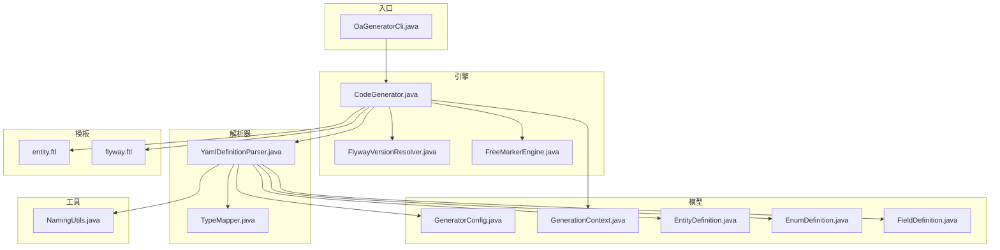
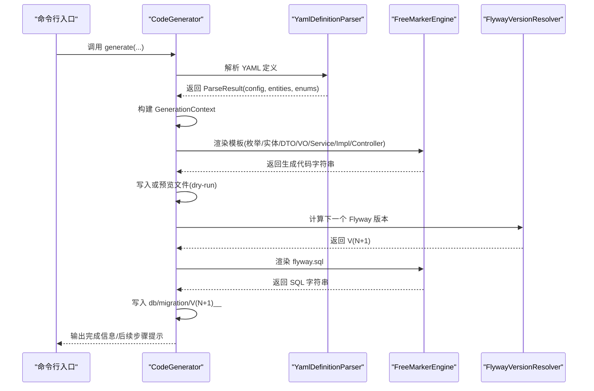
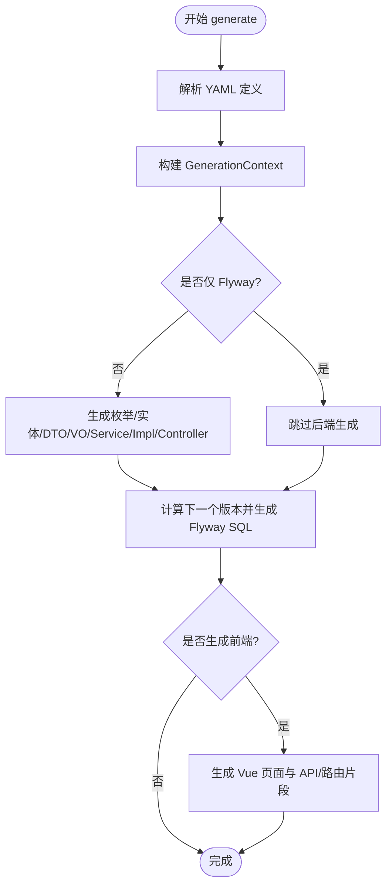
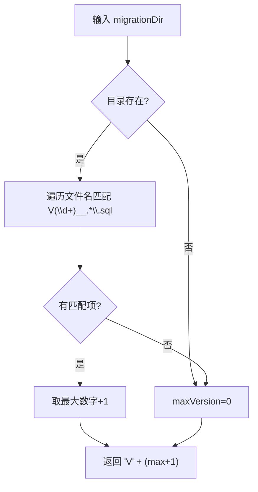
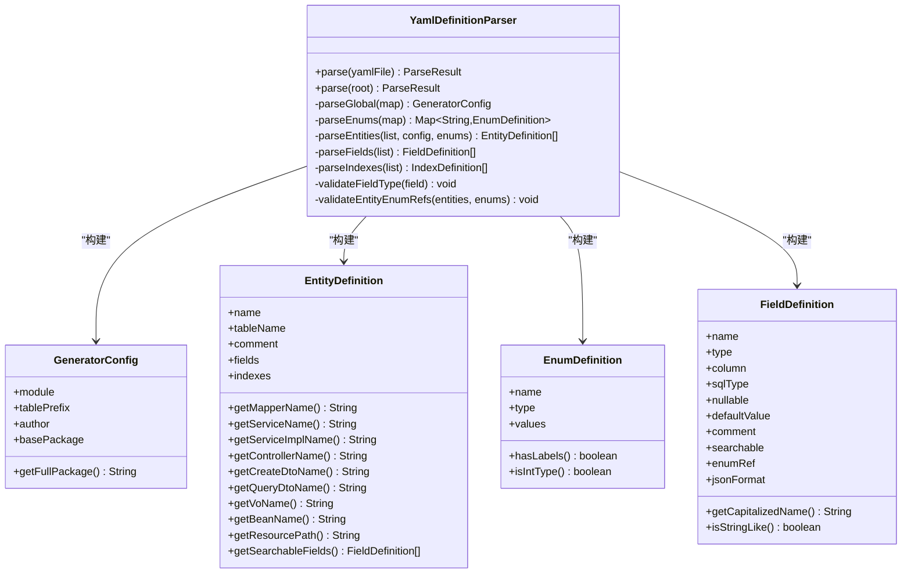
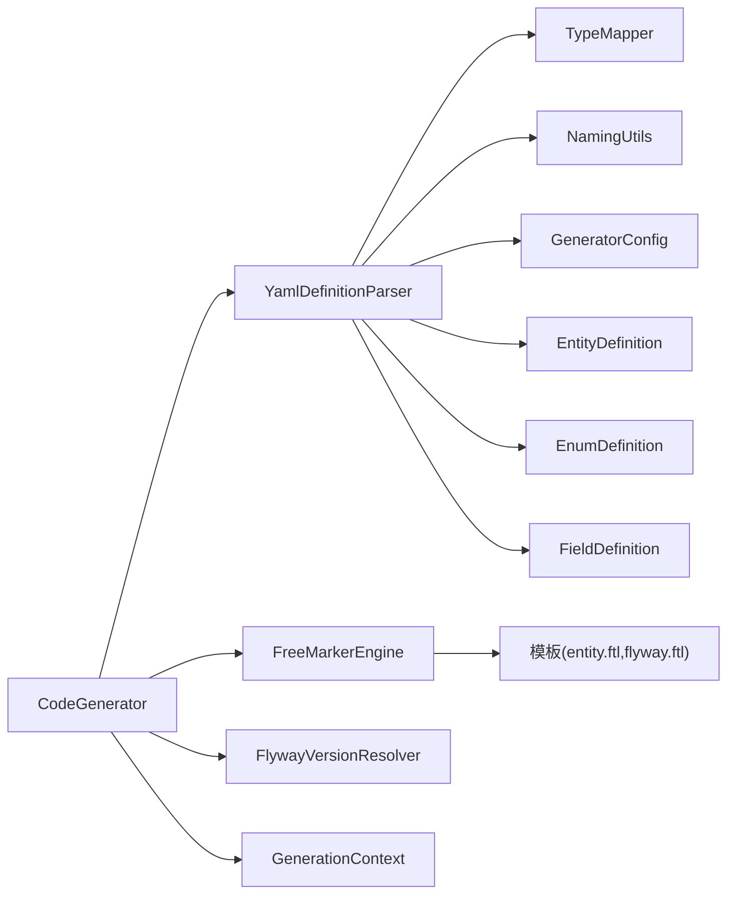
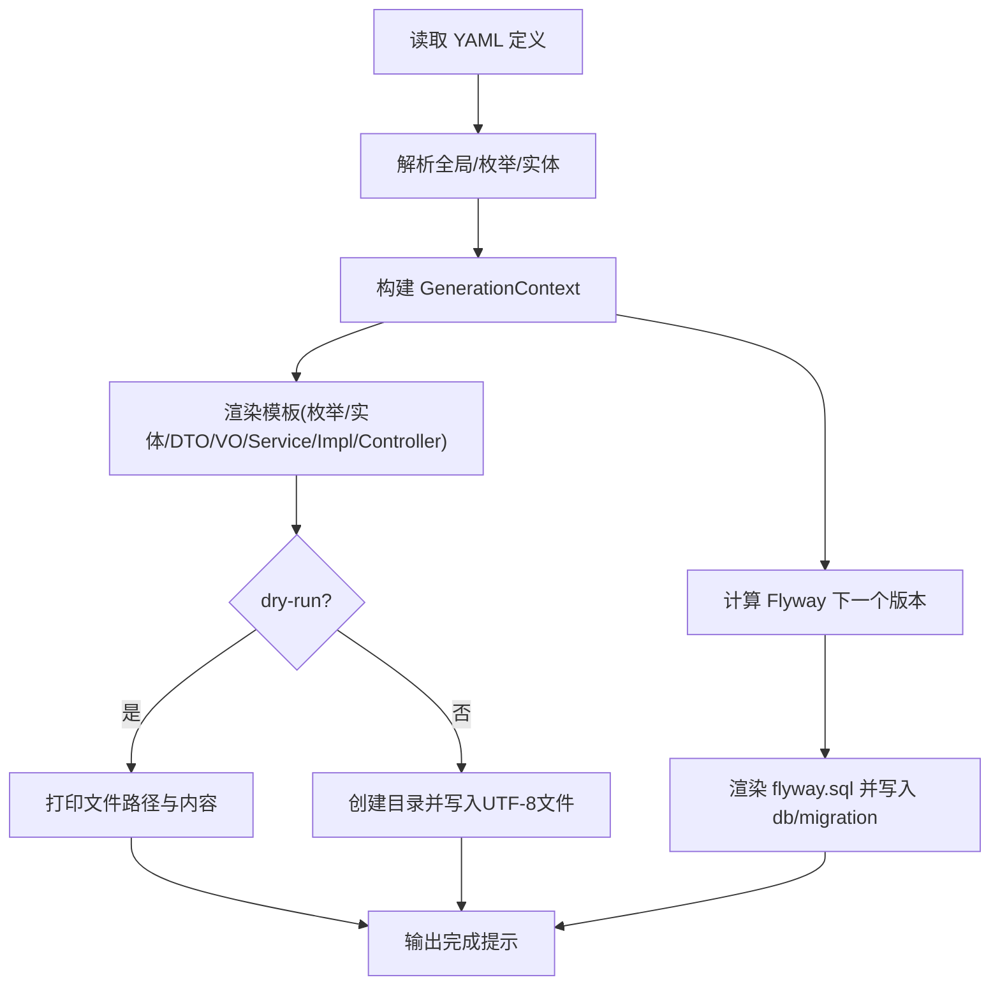

# 代码生成核心逻辑

<cite>
**本文引用的文件**
- [CodeGenerator.java](file://oa-generator/src/main/java/com/oa/admin/generator/engine/CodeGenerator.java)
- [FlywayVersionResolver.java](file://oa-generator/src/main/java/com/oa/admin/generator/engine/FlywayVersionResolver.java)
- [FreeMarkerEngine.java](file://oa-generator/src/main/java/com/oa/admin/generator/engine/FreeMarkerEngine.java)
- [YamlDefinitionParser.java](file://oa-generator/src/main/java/com/oa/admin/generator/parser/YamlDefinitionParser.java)
- [TypeMapper.java](file://oa-generator/src/main/java/com/oa/admin/generator/parser/TypeMapper.java)
- [NamingUtils.java](file://oa-generator/src/main/java/com/oa/admin/generator/util/NamingUtils.java)
- [GenerationContext.java](file://oa-generator/src/main/java/com/oa/admin/generator/model/GenerationContext.java)
- [EntityDefinition.java](file://oa-generator/src/main/java/com/oa/admin/generator/model/EntityDefinition.java)
- [EnumDefinition.java](file://oa-generator/src/main/java/com/oa/admin/generator/model/EnumDefinition.java)
- [FieldDefinition.java](file://oa-generator/src/main/java/com/oa/admin/generator/model/FieldDefinition.java)
- [GeneratorConfig.java](file://oa-generator/src/main/java/com/oa/admin/generator/config/GeneratorConfig.java)
- [OaGeneratorCli.java](file://oa-generator/src/main/java/com/oa/admin/generator/OaGeneratorCli.java)
- [entity.ftl](file://oa-generator/src/main/resources/templates/entity.ftl)
- [flyway.ftl](file://oa-generator/src/main/resources/templates/flyway.ftl)
- [leave-request.yaml](file://generators/leave-request.yaml)
- [CodeGeneratorCrudStackTest.java](file://oa-generator/src/test/java/com/oa/admin/generator/engine/CodeGeneratorCrudStackTest.java)
</cite>

## 目录
1. [简介](#简介)
2. [项目结构](#项目结构)
3. [核心组件](#核心组件)
4. [架构总览](#架构总览)
5. [详细组件分析](#详细组件分析)
6. [依赖关系分析](#依赖关系分析)
7. [性能考虑](#性能考虑)
8. [故障排查指南](#故障排查指南)
9. [结论](#结论)
10. [附录](#附录)

## 简介
本文面向代码生成器的核心逻辑，系统性梳理从YAML定义到最终代码与数据库迁移脚本输出的完整流程，重点覆盖以下方面：
- CodeGenerator 的生成流程控制、文件输出管理与错误处理
- FlywayVersionResolver 的版本解析与迁移脚本命名规范
- NamingUtils 的命名转换策略（驼峰/下划线/首字母大小写）
- 完整的生成流程图与时序图
- 生成结果验证方法与调试技巧

## 项目结构
oa-generator 模块是本次文档关注的重点，其核心由“引擎”“解析器”“模型”“工具类”“CLI入口”构成，并配套 FreeMarker 模板资源。

图表来源
- [CodeGenerator.java:1-226](file://oa-generator/src/main/java/com/oa/admin/generator/engine/CodeGenerator.java#L1-L226)
- [FlywayVersionResolver.java:1-36](file://oa-generator/src/main/java/com/oa/admin/generator/engine/FlywayVersionResolver.java#L1-L36)
- [FreeMarkerEngine.java:1-37](file://oa-generator/src/main/java/com/oa/admin/generator/engine/FreeMarkerEngine.java#L1-L37)
- [YamlDefinitionParser.java:1-204](file://oa-generator/src/main/java/com/oa/admin/generator/parser/YamlDefinitionParser.java#L1-L204)
- [TypeMapper.java:1-66](file://oa-generator/src/main/java/com/oa/admin/generator/parser/TypeMapper.java#L1-L66)
- [NamingUtils.java:1-62](file://oa-generator/src/main/java/com/oa/admin/generator/util/NamingUtils.java#L1-L62)
- [GenerationContext.java:1-25](file://oa-generator/src/main/java/com/oa/admin/generator/model/GenerationContext.java#L1-L25)
- [EntityDefinition.java:1-66](file://oa-generator/src/main/java/com/oa/admin/generator/model/EntityDefinition.java#L1-L66)
- [EnumDefinition.java:1-24](file://oa-generator/src/main/java/com/oa/admin/generator/model/EnumDefinition.java#L1-L24)
- [FieldDefinition.java:1-30](file://oa-generator/src/main/java/com/oa/admin/generator/model/FieldDefinition.java#L1-L30)
- [GeneratorConfig.java:1-19](file://oa-generator/src/main/java/com/oa/admin/generator/config/GeneratorConfig.java#L1-L19)
- [OaGeneratorCli.java:1-76](file://oa-generator/src/main/java/com/oa/admin/generator/OaGeneratorCli.java#L1-L76)
- [entity.ftl](file://oa-generator/src/main/resources/templates/entity.ftl)
- [flyway.ftl](file://oa-generator/src/main/resources/templates/flyway.ftl)

章节来源
- [OaGeneratorCli.java:1-76](file://oa-generator/src/main/java/com/oa/admin/generator/OaGeneratorCli.java#L1-L76)
- [CodeGenerator.java:1-226](file://oa-generator/src/main/java/com/oa/admin/generator/engine/CodeGenerator.java#L1-L226)

## 核心组件
- CodeGenerator：协调解析、模板渲染与文件输出，支持后端CRUD栈、枚举、前端Vue页面以及仅Flyway模式。
- FlywayVersionResolver：扫描现有迁移脚本，解析最大版本号并生成下一个版本号。
- FreeMarkerEngine：加载模板目录、设置编码与异常策略，统一渲染接口。
- YamlDefinitionParser：解析YAML定义为内部模型，执行字段类型校验与枚举引用校验。
- TypeMapper：YAML类型到Java类型的映射与导入判断。
- NamingUtils：命名转换工具（驼峰/下划线/首字母大小写）。
- GenerationContext：传递给模板的数据上下文对象。
- CLI入口：命令行参数解析与调用CodeGenerator。

章节来源
- [CodeGenerator.java:22-63](file://oa-generator/src/main/java/com/oa/admin/generator/engine/CodeGenerator.java#L22-L63)
- [FlywayVersionResolver.java:13-35](file://oa-generator/src/main/java/com/oa/admin/generator/engine/FlywayVersionResolver.java#L13-L35)
- [FreeMarkerEngine.java:17-36](file://oa-generator/src/main/java/com/oa/admin/generator/engine/FreeMarkerEngine.java#L17-L36)
- [YamlDefinitionParser.java:23-49](file://oa-generator/src/main/java/com/oa/admin/generator/parser/YamlDefinitionParser.java#L23-L49)
- [TypeMapper.java:9-65](file://oa-generator/src/main/java/com/oa/admin/generator/parser/TypeMapper.java#L9-L65)
- [NamingUtils.java:6-61](file://oa-generator/src/main/java/com/oa/admin/generator/util/NamingUtils.java#L6-L61)
- [GenerationContext.java:13-24](file://oa-generator/src/main/java/com/oa/admin/generator/model/GenerationContext.java#L13-L24)
- [OaGeneratorCli.java:12-75](file://oa-generator/src/main/java/com/oa/admin/generator/OaGeneratorCli.java#L12-L75)

## 架构总览
整体流程自上而下分为三层：
- 命令层：CLI接收参数并调用CodeGenerator
- 生成层：CodeGenerator组织生成流程，协调解析、模板渲染与文件输出
- 资源层：YAML定义、模板与工具类

图表来源
- [OaGeneratorCli.java:51-70](file://oa-generator/src/main/java/com/oa/admin/generator/OaGeneratorCli.java#L51-L70)
- [CodeGenerator.java:27-63](file://oa-generator/src/main/java/com/oa/admin/generator/engine/CodeGenerator.java#L27-L63)
- [YamlDefinitionParser.java:34-48](file://oa-generator/src/main/java/com/oa/admin/generator/parser/YamlDefinitionParser.java#L34-L48)
- [FreeMarkerEngine.java:30-35](file://oa-generator/src/main/java/com/oa/admin/generator/engine/FreeMarkerEngine.java#L30-L35)
- [FlywayVersionResolver.java:17-34](file://oa-generator/src/main/java/com/oa/admin/generator/engine/FlywayVersionResolver.java#L17-L34)

## 详细组件分析

### CodeGenerator：生成流程控制与文件输出
- 流程控制
  - 解析YAML定义，构建GeneratorConfig与数据模型
  - 条件生成：可选择仅生成Flyway脚本、仅生成后端、或同时生成前端Vue页面
  - 支持实体过滤，按名称列表只生成指定实体
- 文件输出管理
  - 预览模式(dry-run)：打印将要生成的文件路径与内容，不落盘
  - 正常模式：创建目标目录并写入UTF-8编码文件，输出生成路径
- 错误处理机制
  - 捕获模板渲染异常与IO异常，向标准错误输出错误信息并返回非零退出码
  - 生成完成后打印后续步骤提示（MyBatis MapperScan、权限种子数据、路由片段、侧边栏菜单）

图表来源
- [CodeGenerator.java:27-63](file://oa-generator/src/main/java/com/oa/admin/generator/engine/CodeGenerator.java#L27-L63)
- [CodeGenerator.java:146-156](file://oa-generator/src/main/java/com/oa/admin/generator/engine/CodeGenerator.java#L146-L156)

章节来源
- [CodeGenerator.java:27-63](file://oa-generator/src/main/java/com/oa/admin/generator/engine/CodeGenerator.java#L27-L63)
- [CodeGenerator.java:146-156](file://oa-generator/src/main/java/com/oa/admin/generator/engine/CodeGenerator.java#L146-L156)
- [OaGeneratorCli.java:51-70](file://oa-generator/src/main/java/com/oa/admin/generator/OaGeneratorCli.java#L51-L70)

### FlywayVersionResolver：版本解析与命名规范
- 功能职责
  - 扫描 db/migration 目录，匹配以 V<数字>__ 开头的SQL文件
  - 提取最大版本号并返回下一个版本号 V(max+1)
- 版本冲突处理
  - 若目录不存在或无匹配文件，默认从 V1 开始
  - 通过正则严格匹配命名格式，避免误识别
- 迁移脚本命名规范
  - 使用 V<版本号>__<描述>.sql 的命名约定
  - 描述通常来自模块名与“module”描述组合

图表来源
- [FlywayVersionResolver.java:17-34](file://oa-generator/src/main/java/com/oa/admin/generator/engine/FlywayVersionResolver.java#L17-L34)

章节来源
- [FlywayVersionResolver.java:13-35](file://oa-generator/src/main/java/com/oa/admin/generator/engine/FlywayVersionResolver.java#L13-L35)

### NamingUtils：命名工具类设计理念
- 驼峰转下划线：首字符小写，后续大写字母前加下划线并转小写
- 下划线转驼峰：遇到下划线后，下个字符大写；否则保持原字符
- 首字母大小写：提供首字母大写与首字母小写的便捷方法
- 设计原则
  - 无状态工具类，便于在模板与模型中直接调用
  - 与TypeMapper配合，确保Java类型导入与简单类型名的一致性

章节来源
- [NamingUtils.java:6-61](file://oa-generator/src/main/java/com/oa/admin/generator/util/NamingUtils.java#L6-L61)
- [EntityDefinition.java:52-58](file://oa-generator/src/main/java/com/oa/admin/generator/model/EntityDefinition.java#L52-L58)
- [FieldDefinition.java:22-28](file://oa-generator/src/main/java/com/oa/admin/generator/model/FieldDefinition.java#L22-L28)

### YamlDefinitionParser：YAML到模型的解析与校验
- 全局配置解析：模块名、表前缀、作者、基础包名
- 枚举解析：支持枚举值的code/label，缺省类型为int
- 实体解析：表名（显式优先，否则基于camelToSnake与表前缀）、注释、字段、索引
- 字段解析：名称、类型、列名（显式优先，否则camelToSnake）、SQL类型、可空、默认值、注释、搜索标记、枚举引用、JSON格式
- 校验逻辑
  - 字段类型合法性检查（依赖TypeMapper）
  - 枚举引用完整性检查（引用的枚举必须存在）

图表来源
- [YamlDefinitionParser.java:23-49](file://oa-generator/src/main/java/com/oa/admin/generator/parser/YamlDefinitionParser.java#L23-L49)
- [GeneratorConfig.java:8-18](file://oa-generator/src/main/java/com/oa/admin/generator/config/GeneratorConfig.java#L8-L18)
- [EntityDefinition.java:12-65](file://oa-generator/src/main/java/com/oa/admin/generator/model/EntityDefinition.java#L12-L65)
- [EnumDefinition.java:10-23](file://oa-generator/src/main/java/com/oa/admin/generator/model/EnumDefinition.java#L10-L23)
- [FieldDefinition.java:9-29](file://oa-generator/src/main/java/com/oa/admin/generator/model/FieldDefinition.java#L9-L29)

章节来源
- [YamlDefinitionParser.java:34-48](file://oa-generator/src/main/java/com/oa/admin/generator/parser/YamlDefinitionParser.java#L34-L48)
- [YamlDefinitionParser.java:127-133](file://oa-generator/src/main/java/com/oa/admin/generator/parser/YamlDefinitionParser.java#L127-L133)
- [YamlDefinitionParser.java:161-166](file://oa-generator/src/main/java/com/oa/admin/generator/parser/YamlDefinitionParser.java#L161-L166)
- [YamlDefinitionParser.java:168-174](file://oa-generator/src/main/java/com/oa/admin/generator/parser/YamlDefinitionParser.java#L168-L174)
- [YamlDefinitionParser.java:192-202](file://oa-generator/src/main/java/com/oa/admin/generator/parser/YamlDefinitionParser.java#L192-L202)

### TypeMapper：类型映射与导入判断
- 映射范围：String、Integer、Long、BigDecimal、Boolean、LocalDate、LocalDateTime、Text
- 工具方法：
  - isValidType/getValidTypes：类型合法性检查
  - getJavaType/getSimpleJavaType：获取完整/简单Java类型名
  - needsImport/getImport：判断是否需要导入及导入全限定名
  - isStringLike：判断是否为字符串类类型

章节来源
- [TypeMapper.java:9-65](file://oa-generator/src/main/java/com/oa/admin/generator/parser/TypeMapper.java#L9-L65)
- [CodeGenerator.java:216-224](file://oa-generator/src/main/java/com/oa/admin/generator/engine/CodeGenerator.java#L216-L224)

### FreeMarkerEngine：模板渲染引擎
- 初始化：设置模板加载路径、编码、区域、异常处理策略与数字格式
- 渲染：根据模板名与数据模型生成字符串

章节来源
- [FreeMarkerEngine.java:17-36](file://oa-generator/src/main/java/com/oa/admin/generator/engine/FreeMarkerEngine.java#L17-L36)

### GenerationContext：模板数据上下文
- 统一承载：当前配置、实体/枚举/所有实体、包名、Flyway版本与描述
- 作用：作为模板根对象，供ftl访问

章节来源
- [GenerationContext.java:13-24](file://oa-generator/src/main/java/com/oa/admin/generator/model/GenerationContext.java#L13-L24)

### CLI入口：参数与调用链
- 参数：定义文件、项目根目录、目标模块、Dry Run、仅Flyway、前端生成、实体过滤
- 异常处理：捕获异常并打印错误信息，返回非零退出码

章节来源
- [OaGeneratorCli.java:12-75](file://oa-generator/src/main/java/com/oa/admin/generator/OaGeneratorCli.java#L12-L75)

## 依赖关系分析
- CodeGenerator 依赖 YamlDefinitionParser、FreeMarkerEngine、FlywayVersionResolver、GenerationContext
- YamlDefinitionParser 依赖 TypeMapper、NamingUtils、GeneratorConfig、EntityDefinition、EnumDefinition、FieldDefinition
- 模板依赖 TypeMapper 静态方法注入，以便在ftl中调用类型映射

图表来源
- [CodeGenerator.java:24-25](file://oa-generator/src/main/java/com/oa/admin/generator/engine/CodeGenerator.java#L24-L25)
- [YamlDefinitionParser.java:3-9](file://oa-generator/src/main/java/com/oa/admin/generator/parser/YamlDefinitionParser.java#L3-L9)
- [FreeMarkerEngine.java:22-27](file://oa-generator/src/main/java/com/oa/admin/generator/engine/FreeMarkerEngine.java#L22-L27)

章节来源
- [CodeGenerator.java:24-25](file://oa-generator/src/main/java/com/oa/admin/generator/engine/CodeGenerator.java#L24-L25)
- [YamlDefinitionParser.java:3-9](file://oa-generator/src/main/java/com/oa/admin/generator/parser/YamlDefinitionParser.java#L3-L9)
- [FreeMarkerEngine.java:22-27](file://oa-generator/src/main/java/com/oa/admin/generator/engine/FreeMarkerEngine.java#L22-L27)

## 性能考虑
- IO开销主要集中在文件读取与写入，建议：
  - 在大型项目中启用干跑(dry-run)进行预检，减少磁盘IO
  - 合理使用实体过滤，避免对无关实体进行模板渲染
  - 将模板数量与复杂度控制在合理范围内，避免渲染耗时过长
- 类型映射与命名转换均为常量时间操作，影响较小

## 故障排查指南
- YAML类型非法
  - 现象：抛出非法参数异常，提示有效类型集合
  - 排查：核对字段type是否在TypeMapper的有效类型集中
  - 参考
    - [YamlDefinitionParser.java:168-174](file://oa-generator/src/main/java/com/oa/admin/generator/parser/YamlDefinitionParser.java#L168-L174)
    - [TypeMapper.java:27-33](file://oa-generator/src/main/java/com/oa/admin/generator/parser/TypeMapper.java#L27-L33)
- 枚举引用未定义
  - 现象：抛出非法参数异常，指出具体实体字段引用了未定义枚举
  - 排查：确认枚举名称拼写一致且已在enums节中定义
  - 参考
    - [YamlDefinitionParser.java:192-202](file://oa-generator/src/main/java/com/oa/admin/generator/parser/YamlDefinitionParser.java#L192-L202)
- Flyway版本冲突或命名不规范
  - 现象：生成的新版本与已有脚本重复或命名不符合 V<数字>__ 规范
  - 排查：检查db/migration目录中文件命名，确保以 V<版本号>__ 开头
  - 参考
    - [FlywayVersionResolver.java:15-34](file://oa-generator/src/main/java/com/oa/admin/generator/engine/FlywayVersionResolver.java#L15-L34)
- 模板渲染异常
  - 现象：TemplateException
  - 排查：检查模板语法、数据模型键是否存在；必要时开启dry-run对比生成内容
  - 参考
    - [FreeMarkerEngine.java:26-27](file://oa-generator/src/main/java/com/oa/admin/generator/engine/FreeMarkerEngine.java#L26-L27)
- 生成结果验证
  - 使用单元测试验证生成产物的存在性与关键导入/方法签名
  - 参考
    - [CodeGeneratorCrudStackTest.java:20-73](file://oa-generator/src/test/java/com/oa/admin/generator/engine/CodeGeneratorCrudStackTest.java#L20-L73)
- 调试技巧
  - 使用 dry-run 预览生成内容，快速定位模板或数据模型问题
  - 逐步缩小范围：先仅生成Flyway脚本，再逐步加入后端/前端生成
  - 参考
    - [CodeGenerator.java:146-156](file://oa-generator/src/main/java/com/oa/admin/generator/engine/CodeGenerator.java#L146-L156)

## 结论
该代码生成器以清晰的分层设计实现了从YAML定义到多端产物的自动化生成，具备良好的扩展性与可维护性。通过严格的类型与引用校验、规范化的命名与版本管理，以及完善的错误处理与调试手段，能够显著提升开发效率并降低手写代码的错误率。

## 附录
- 示例定义文件
  - [leave-request.yaml](file://generators/leave-request.yaml)
- 关键模板
  - [entity.ftl](file://oa-generator/src/main/resources/templates/entity.ftl)
  - [flyway.ftl](file://oa-generator/src/main/resources/templates/flyway.ftl)
- 生成流程图（代码级）

图表来源
- [CodeGenerator.java:27-63](file://oa-generator/src/main/java/com/oa/admin/generator/engine/CodeGenerator.java#L27-L63)
- [YamlDefinitionParser.java:34-48](file://oa-generator/src/main/java/com/oa/admin/generator/parser/YamlDefinitionParser.java#L34-L48)
- [FreeMarkerEngine.java:30-35](file://oa-generator/src/main/java/com/oa/admin/generator/engine/FreeMarkerEngine.java#L30-L35)
- [FlywayVersionResolver.java:17-34](file://oa-generator/src/main/java/com/oa/admin/generator/engine/FlywayVersionResolver.java#L17-L34)