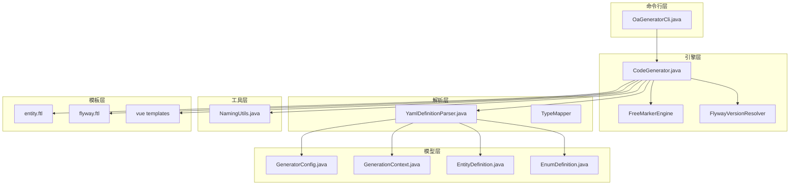
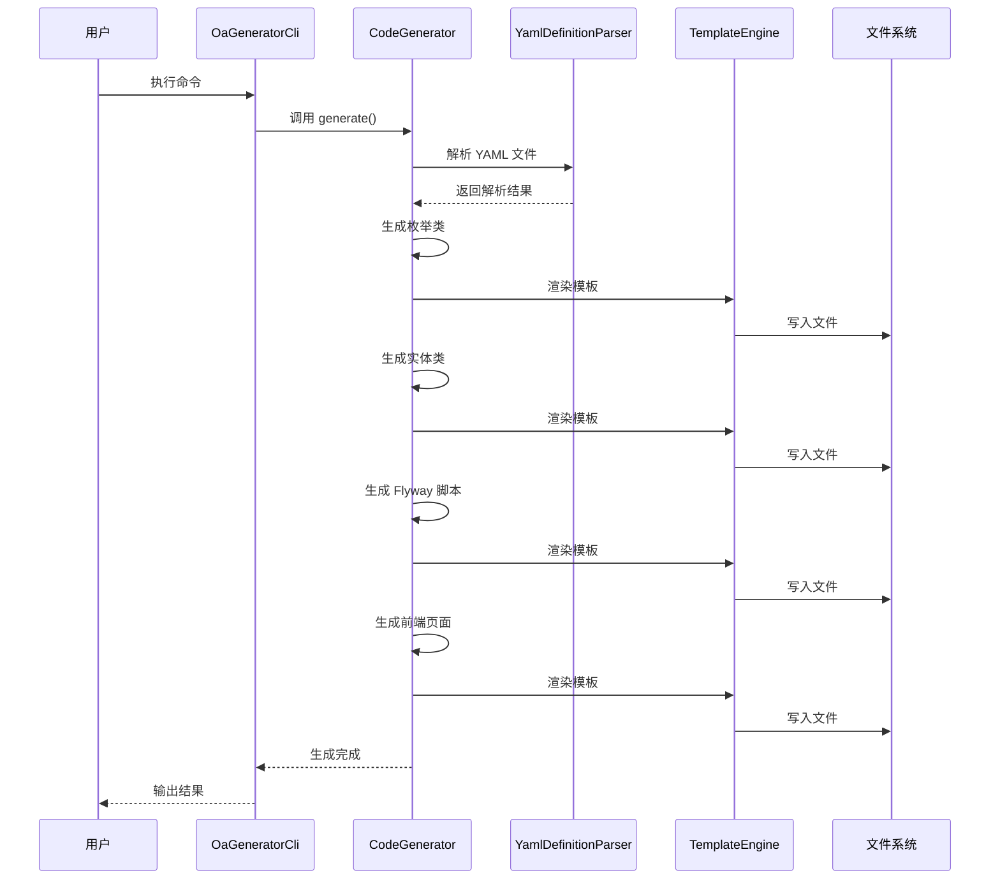
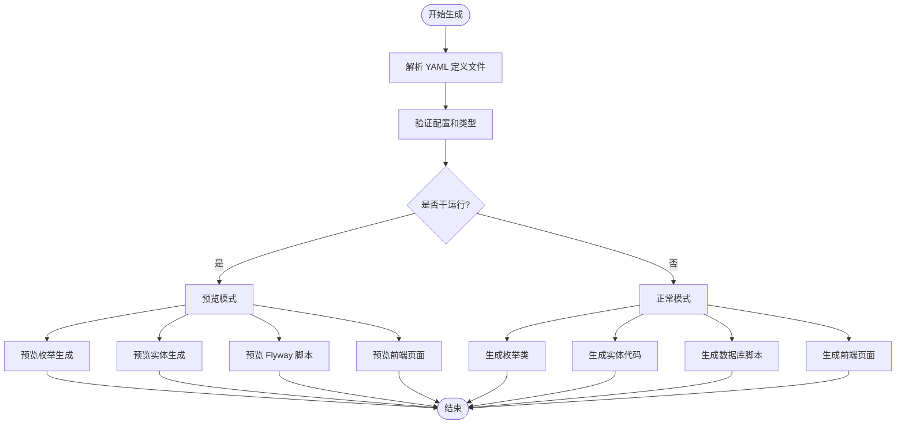
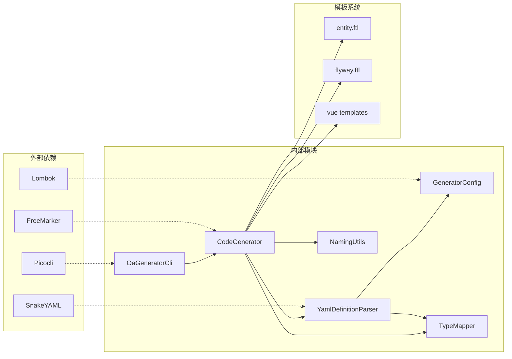

# 命令行接口

<cite>
**本文档引用的文件**
- [OaGeneratorCli.java](file://oa-generator/src/main/java/com/oa/admin/generator/OaGeneratorCli.java)
- [CodeGenerator.java](file://oa-generator/src/main/java/com/oa/admin/generator/engine/CodeGenerator.java)
- [YamlDefinitionParser.java](file://oa-generator/src/main/java/com/oa/admin/generator/parser/YamlDefinitionParser.java)
- [GeneratorConfig.java](file://oa-generator/src/main/java/com/oa/admin/generator/config/GeneratorConfig.java)
- [GenerationContext.java](file://oa-generator/src/main/java/com/oa/admin/generator/model/GenerationContext.java)
- [NamingUtils.java](file://oa-generator/src/main/java/com/oa/admin/generator/util/NamingUtils.java)
- [entity.ftl](file://oa-generator/src/main/resources/templates/entity.ftl)
- [flyway.ftl](file://oa-generator/src/main/resources/templates/flyway.ftl)
- [list.vue.ftl](file://oa-generator/src/main/resources/templates/vue/list.vue.ftl)
- [leave-request.yaml](file://generators/leave-request.yaml)
- [pom.xml](file://oa-generator/pom.xml)
- [README.md](file://README.md)
</cite>

## 目录
1. [简介](#简介)
2. [项目结构](#项目结构)
3. [核心组件](#核心组件)
4. [架构概览](#架构概览)
5. [详细组件分析](#详细组件分析)
6. [依赖关系分析](#依赖关系分析)
7. [性能考虑](#性能考虑)
8. [故障排除指南](#故障排除指南)
9. [结论](#结论)
10. [附录](#附录)

## 简介

OaGeneratorCli 是一个专门用于生成 OA 系统业务模块代码的命令行工具。该工具基于 YAML 定义文件，自动生成后端 CRUD 代码、数据库迁移脚本以及前端页面代码，专注于审批和权限管理领域。

该工具采用现代化的代码生成技术，支持：
- 自动化的后端代码生成（实体、Mapper、Service、Controller）
- 数据库 Flyway 迁移脚本生成
- Vue 3 前端页面代码生成
- 类型安全的枚举处理
- 批量生成和过滤机制

## 项目结构

OaGeneratorCli 工具位于 `oa-generator` 模块中，采用分层架构设计：



**图表来源**
- [OaGeneratorCli.java:12-76](file://oa-generator/src/main/java/com/oa/admin/generator/OaGeneratorCli.java#L12-L76)
- [CodeGenerator.java:22-226](file://oa-generator/src/main/java/com/oa/admin/generator/engine/CodeGenerator.java#L22-L226)
- [YamlDefinitionParser.java:23-204](file://oa-generator/src/main/java/com/oa/admin/generator/parser/YamlDefinitionParser.java#L23-L204)

**章节来源**
- [OaGeneratorCli.java:1-76](file://oa-generator/src/main/java/com/oa/admin/generator/OaGeneratorCli.java#L1-L76)
- [CodeGenerator.java:1-226](file://oa-generator/src/main/java/com/oa/admin/generator/engine/CodeGenerator.java#L1-L226)

## 核心组件

### 命令行接口 (OaGeneratorCli)

OaGeneratorCli 使用 Picocli 库实现命令行参数解析，提供了直观易用的 CLI 接口。

**主要特性：**
- 支持标准帮助选项（`--help`、`--version`）
- 参数验证和错误处理
- 模块化设计，便于扩展

**章节来源**
- [OaGeneratorCli.java:12-76](file://oa-generator/src/main/java/com/oa/admin/generator/OaGeneratorCli.java#L12-L76)

### 代码生成器 (CodeGenerator)

CodeGenerator 是核心生成引擎，负责协调整个代码生成过程。

**主要功能：**
- 解析 YAML 定义文件
- 生成 Java 实体类
- 生成数据库迁移脚本
- 生成 Vue 前端页面
- 支持干运行模式

**章节来源**
- [CodeGenerator.java:22-226](file://oa-generator/src/main/java/com/oa/admin/generator/engine/CodeGenerator.java#L22-L226)

### YAML 解析器 (YamlDefinitionParser)

YamlDefinitionParser 负责将 YAML 定义转换为内部数据结构。

**核心能力：**
- 解析全局配置
- 处理枚举定义
- 解析实体字段和索引
- 类型验证和引用检查

**章节来源**
- [YamlDefinitionParser.java:23-204](file://oa-generator/src/main/java/com/oa/admin/generator/parser/YamlDefinitionParser.java#L23-L204)

## 架构概览



**图表来源**
- [OaGeneratorCli.java:51-70](file://oa-generator/src/main/java/com/oa/admin/generator/OaGeneratorCli.java#L51-L70)
- [CodeGenerator.java:27-63](file://oa-generator/src/main/java/com/oa/admin/generator/engine/CodeGenerator.java#L27-L63)

## 详细组件分析

### 命令行参数详解

#### 基本参数

**定义文件参数**
- **名称**: `definitionFile`
- **位置**: 第一个参数
- **必需**: 是
- **描述**: YAML 定义文件的路径
- **默认值**: 无

**项目根目录参数**
- **名称**: `-p, --project`
- **类型**: 字符串
- **必需**: 否
- **描述**: 项目根目录路径
- **默认值**: 当前目录 `.`
- **使用场景**: 指定多模块项目的根目录

**目标模块参数**
- **名称**: `-m, --target-module`
- **类型**: 字符串
- **必需**: 否
- **描述**: 目标 Maven 模块名称
- **默认值**: `oa-app`
- **使用场景**: 在多模块项目中指定生成目标

#### 可选参数

**干运行模式**
- **名称**: `--dry-run`
- **类型**: 布尔值
- **必需**: 否
- **描述**: 预览模式，不实际写入文件
- **默认值**: false
- **使用场景**: 测试生成结果，验证配置正确性

**Flyway 专用模式**
- **名称**: `--flyway-only`
- **类型**: 布尔值
- **必需**: 否
- **描述**: 仅生成 Flyway 数据库迁移脚本
- **默认值**: false
- **使用场景**: 仅需要数据库结构变更，不需要业务代码

**前端生成模式**
- **名称**: `--frontend`
- **类型**: 布尔值
- **必需**: 否
- **描述**: 同时生成 Vue 3 前端页面
- **默认值**: false
- **使用场景**: 需要完整的前后端代码生成

#### 实体过滤参数

**实体过滤**
- **名称**: `--entity`
- **类型**: 字符串列表
- **必需**: 否
- **描述**: 仅生成指定的实体（逗号分隔）
- **默认值**: 全部实体
- **使用场景**: 批量生成时只生成特定实体

### 生成流程分析



**图表来源**
- [CodeGenerator.java:27-63](file://oa-generator/src/main/java/com/oa/admin/generator/engine/CodeGenerator.java#L27-L63)

**章节来源**
- [OaGeneratorCli.java:21-49](file://oa-generator/src/main/java/com/oa/admin/generator/OaGeneratorCli.java#L21-L49)
- [CodeGenerator.java:27-63](file://oa-generator/src/main/java/com/oa/admin/generator/engine/CodeGenerator.java#L27-L63)

### 生成内容详解

#### 后端代码生成

对于每个实体，工具生成以下文件：
- `entity/Xxx.java`: MyBatis-Plus 实体类
- `dto/CreateXxxDTO.java`: 创建请求 DTO
- `dto/UpdateXxxDTO.java`: 更新请求 DTO
- `dto/XxxQueryDTO.java`: 查询请求 DTO
- `vo/XxxVO.java`: 响应 VO 类
- `mapper/XxxMapper.java`: 数据访问层接口
- `service/XxxService.java`: 业务服务接口
- `service/impl/XxxServiceImpl.java`: 业务服务实现
- `controller/XxxController.java`: REST 控制器

#### 数据库迁移脚本

生成 Flyway 格式的 SQL 脚本，包含：
- 表结构定义
- 字段约束和注释
- 索引创建
- 时间戳和软删除字段

#### 前端页面生成

生成 Vue 3 单文件组件：
- `views/module/index.vue`: 主列表页面
- `views/module/components/XxxFormDialog.vue`: 表单对话框
- `src/api/module.ts`: API 接口定义
- 路由片段代码（需要手动添加到路由配置）

**章节来源**
- [CodeGenerator.java:65-133](file://oa-generator/src/main/java/com/oa/admin/generator/engine/CodeGenerator.java#L65-L133)
- [CodeGenerator.java:158-203](file://oa-generator/src/main/java/com/oa/admin/generator/engine/CodeGenerator.java#L158-L203)

## 依赖关系分析



**图表来源**
- [pom.xml:16-50](file://oa-generator/pom.xml#L16-L50)
- [OaGeneratorCli.java:3-10](file://oa-generator/src/main/java/com/oa/admin/generator/OaGeneratorCli.java#L3-L10)

**章节来源**
- [pom.xml:16-93](file://oa-generator/pom.xml#L16-L93)

## 性能考虑

### 生成性能优化

1. **内存管理**: 使用流式处理避免大文件加载到内存
2. **模板缓存**: FreeMarker 模板引擎自动缓存编译后的模板
3. **并行处理**: 当前实现为顺序处理，可考虑并行化多个实体的生成
4. **I/O 优化**: 批量文件写入减少磁盘 I/O 操作

### 内存使用

- YAML 解析: O(n) 空间复杂度，n 为定义文件大小
- 模板渲染: O(m) 空间复杂度，m 为生成代码大小
- 内存峰值: 主要受最大模板渲染影响

## 故障排除指南

### 常见错误类型

#### YAML 解析错误

**错误**: `Invalid field type 'Xxx' on field 'fieldName'. Valid types: [types]`
**原因**: 字段类型不在支持列表中
**解决方案**: 检查 YAML 文件中的字段类型定义

**错误**: `Entity 'EntityName' field 'FieldName' references undefined enum 'EnumName'`
**原因**: 实体引用了不存在的枚举定义
**解决方案**: 确保枚举在 `enums` 部分正确定义

#### 文件系统错误

**错误**: `Cannot generate files in non-existent directory`
**原因**: 指定的目标目录不存在
**解决方案**: 创建目标目录或使用正确的项目根路径

**错误**: `Permission denied`
**原因**: 没有写入目标目录的权限
**解决方案**: 检查目录权限或以管理员身份运行

#### 类型映射错误

**错误**: `TypeMapper.getSimpleJavaType(yamlType)`
**原因**: YAML 类型无法映射到 Java 类型
**解决方案**: 使用支持的类型列表中的类型

### 调试技巧

1. **使用干运行模式**: `--dry-run` 查看生成内容而不实际写入
2. **检查 YAML 语法**: 使用在线 YAML 验证器
3. **查看详细输出**: 生成过程中会显示详细的进度信息
4. **验证模板**: 确保 FreeMarker 模板文件存在且格式正确

**章节来源**
- [YamlDefinitionParser.java:168-174](file://oa-generator/src/main/java/com/oa/admin/generator/parser/YamlDefinitionParser.java#L168-L174)
- [YamlDefinitionParser.java:192-202](file://oa-generator/src/main/java/com/oa/admin/generator/parser/YamlDefinitionParser.java#L192-L202)

## 结论

OaGeneratorCli 提供了一个强大而灵活的代码生成解决方案，特别适用于 OA 系统的快速开发。其主要优势包括：

1. **自动化程度高**: 从单一 YAML 定义文件生成完整的 CRUD 应用
2. **类型安全**: 强类型的枚举和字段定义
3. **可扩展性**: 基于模板引擎，易于定制生成内容
4. **开发效率**: 显著减少重复性代码编写工作

该工具最适合以下场景：
- 快速原型开发
- 标准化的业务模块开发
- 团队协作中的代码规范统一
- 需要快速迭代的敏捷开发

## 附录

### 使用示例

#### 基本使用

```bash
# 预览生成结果
java -jar oa-generator/target/oa-generator-*.jar generators/leave-request.yaml --dry-run

# 生成完整代码
java -jar oa-generator/target/oa-generator-*.jar generators/leave-request.yaml
```

#### 高级配置

```bash
# 指定项目根目录和目标模块
java -jar oa-generator/target/oa-generator-*.jar \
  -p /path/to/project \
  -m oa-approval \
  generators/leave-request.yaml

# 仅生成 Flyway 脚本
java -jar oa-generator/target/oa-generator-*.jar \
  --flyway-only \
  generators/leave-request.yaml

# 生成前端页面
java -jar oa-generator/target/oa-generator-*.jar \
  --frontend \
  generators/leave-request.yaml

# 只生成特定实体
java -jar oa-generator/target/oa-generator-*.jar \
  --entity LeaveRequest,LeaveType \
  generators/leave-request.yaml
```

#### 最佳实践

1. **YAML 设计**: 使用清晰的命名约定和完整的注释
2. **枚举定义**: 在 `enums` 部分集中定义所有枚举
3. **字段设计**: 合理使用 `searchable` 标志启用查询功能
4. **索引规划**: 为常用查询字段添加索引
5. **版本控制**: 将生成的代码纳入版本控制系统

### 支持的字段类型

- `String`: 字符串类型
- `Integer`: 整数类型
- `Long`: 长整型
- `BigDecimal`: 精确小数
- `Boolean`: 布尔类型
- `LocalDate`: 日期类型
- `LocalDateTime`: 日期时间类型
- `Text`: 文本类型

### 生成后手动处理

1. 在应用入口类中添加新的 Mapper 扫描路径
2. 在权限表中插入相应的菜单和按钮权限
3. 手动添加前端路由配置
4. 根据业务需求调整生成的代码

**章节来源**
- [README.md:141-222](file://README.md#L141-L222)
- [leave-request.yaml:1-74](file://generators/leave-request.yaml#L1-L74)