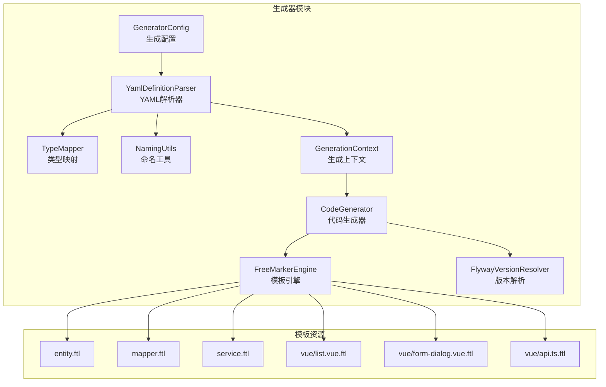
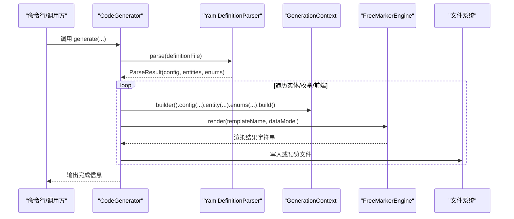
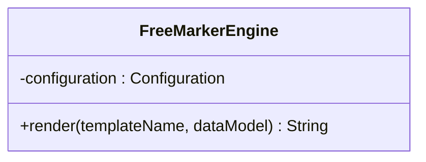
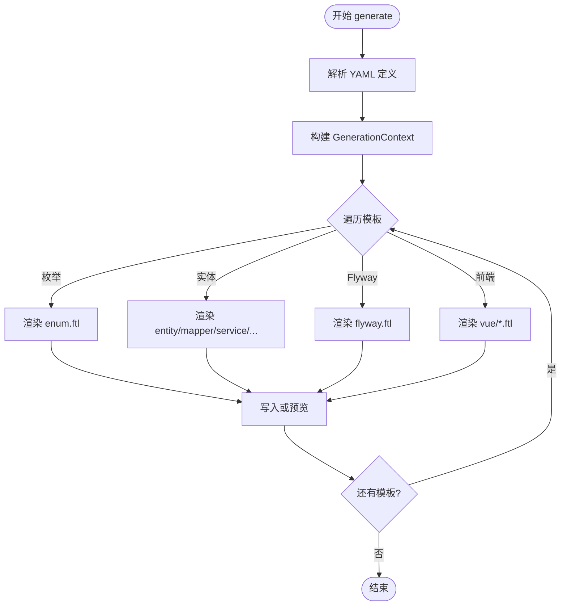
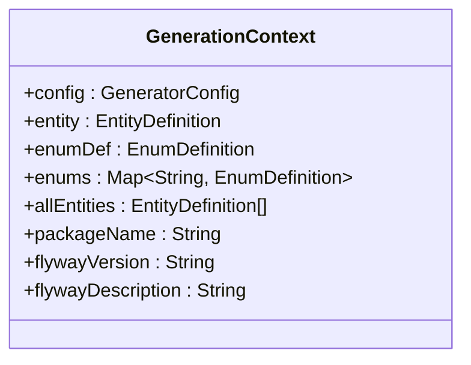
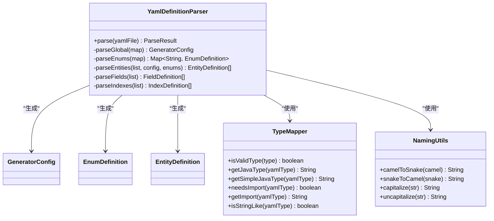
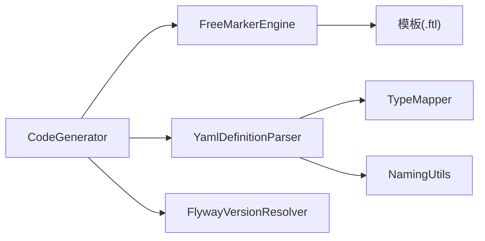

# 模板引擎系统

<cite>
**本文引用的文件**
- [FreeMarkerEngine.java](file://oa-generator/src/main/java/com/oa/admin/generator/engine/FreeMarkerEngine.java)
- [CodeGenerator.java](file://oa-generator/src/main/java/com/oa/admin/generator/engine/CodeGenerator.java)
- [GenerationContext.java](file://oa-generator/src/main/java/com/oa/admin/generator/model/GenerationContext.java)
- [YamlDefinitionParser.java](file://oa-generator/src/main/java/com/oa/admin/generator/parser/YamlDefinitionParser.java)
- [TypeMapper.java](file://oa-generator/src/main/java/com/oa/admin/generator/parser/TypeMapper.java)
- [NamingUtils.java](file://oa-generator/src/main/java/com/oa/admin/generator/util/NamingUtils.java)
- [GeneratorConfig.java](file://oa-generator/src/main/java/com/oa/admin/generator/config/GeneratorConfig.java)
- [FlywayVersionResolver.java](file://oa-generator/src/main/java/com/oa/admin/generator/engine/FlywayVersionResolver.java)
- [EntityDefinition.java](file://oa-generator/src/main/java/com/oa/admin/generator/model/EntityDefinition.java)
- [EnumDefinition.java](file://oa-generator/src/main/java/com/oa/admin/generator/model/EnumDefinition.java)
- [entity.ftl](file://oa-generator/src/main/resources/templates/entity.ftl)
- [mapper.ftl](file://oa-generator/src/main/resources/templates/mapper.ftl)
- [service.ftl](file://oa-generator/src/main/resources/templates/service.ftl)
- [list.vue.ftl](file://oa-generator/src/main/resources/templates/vue/list.vue.ftl)
- [form-dialog.vue.ftl](file://oa-generator/src/main/resources/templates/vue/form-dialog.vue.ftl)
- [api.ts.ftl](file://oa-generator/src/main/resources/templates/vue/api.ts.ftl)
- [leave-request.yaml](file://generators/leave-request.yaml)
</cite>

## 目录
1. [简介](#简介)
2. [项目结构](#项目结构)
3. [核心组件](#核心组件)
4. [架构总览](#架构总览)
5. [详细组件分析](#详细组件分析)
6. [依赖分析](#依赖分析)
7. [性能考虑](#性能考虑)
8. [故障排查指南](#故障排查指南)
9. [结论](#结论)
10. [附录](#附录)

## 简介
本文件面向模板引擎系统，聚焦于 FreeMarkerEngine 模板引擎的集成与使用，涵盖模板加载机制、数据绑定过程、代码渲染流程；解释 GenerationContext 生成上下文的设计与作用（全局变量、模板参数传递、生成状态管理）；阐述各类模板类型（实体类、Mapper、Service、前端页面等）的设计思路；提供模板语法参考与最佳实践（条件判断、循环处理、宏定义、国际化支持等），并给出自定义模板开发指南与优化技巧。

## 项目结构
模板引擎系统位于 oa-generator 模块，采用“配置驱动 + YAML 定义 + FreeMarker 渲染”的结构化设计。核心目录与职责如下：
- engine：模板引擎与生成器实现（FreeMarkerEngine、CodeGenerator、FlywayVersionResolver）
- model：生成上下文与数据模型（GenerationContext、EntityDefinition、EnumDefinition 等）
- parser：YAML 解析与类型映射（YamlDefinitionParser、TypeMapper、NamingUtils）
- config：生成配置（GeneratorConfig）
- resources/templates：模板资源（后缀 .ftl），含 Java 后端模板与 Vue 前端模板
- generators：示例定义文件（leave-request.yaml）

图表来源
- [CodeGenerator.java:22-63](file://oa-generator/src/main/java/com/oa/admin/generator/engine/CodeGenerator.java#L22-L63)
- [FreeMarkerEngine.java:17-37](file://oa-generator/src/main/java/com/oa/admin/generator/engine/FreeMarkerEngine.java#L17-L37)
- [YamlDefinitionParser.java:23-49](file://oa-generator/src/main/java/com/oa/admin/generator/parser/YamlDefinitionParser.java#L23-L49)
- [GeneratorConfig.java:8-19](file://oa-generator/src/main/java/com/oa/admin/generator/config/GeneratorConfig.java#L8-L19)
- [FlywayVersionResolver.java:13-36](file://oa-generator/src/main/java/com/oa/admin/generator/engine/FlywayVersionResolver.java#L13-L36)

章节来源
- [CodeGenerator.java:22-63](file://oa-generator/src/main/java/com/oa/admin/generator/engine/CodeGenerator.java#L22-L63)
- [FreeMarkerEngine.java:17-37](file://oa-generator/src/main/java/com/oa/admin/generator/engine/FreeMarkerEngine.java#L17-L37)
- [YamlDefinitionParser.java:23-49](file://oa-generator/src/main/java/com/oa/admin/generator/parser/YamlDefinitionParser.java#L23-L49)
- [GeneratorConfig.java:8-19](file://oa-generator/src/main/java/com/oa/admin/generator/config/GeneratorConfig.java#L8-L19)
- [FlywayVersionResolver.java:13-36](file://oa-generator/src/main/java/com/oa/admin/generator/engine/FlywayVersionResolver.java#L13-L36)

## 核心组件
- FreeMarkerEngine：封装 FreeMarker 配置与模板渲染，负责从类路径加载模板、设置编码与异常处理策略，并将数据模型渲染为字符串输出。
- CodeGenerator：协调生成流程，构建 GenerationContext，组装数据模型，调用模板引擎渲染并写入文件或预览。
- GenerationContext：承载生成所需的全部上下文信息（配置、实体、枚举、包名、Flyway 版本等），作为模板中的统一入口。
- YamlDefinitionParser：解析 YAML 定义文件，产出 GeneratorConfig、实体列表与枚举映射，并进行字段类型与枚举引用校验。
- TypeMapper：维护 YAML 类型到 Java 类型的映射表，提供简单类型、导入类型、是否字符串类等查询方法。
- NamingUtils：提供驼峰与下划线命名互转、首字母大小写转换等工具方法。
- FlywayVersionResolver：扫描迁移目录，解析现有版本并计算下一个可用版本号。
- 模板资源：包含 Java 后端模板（entity、mapper、service 等）与 Vue 前端模板（列表页、表单对话框、API 封装、路由片段）。

章节来源
- [FreeMarkerEngine.java:17-37](file://oa-generator/src/main/java/com/oa/admin/generator/engine/FreeMarkerEngine.java#L17-L37)
- [CodeGenerator.java:22-226](file://oa-generator/src/main/java/com/oa/admin/generator/engine/CodeGenerator.java#L22-L226)
- [GenerationContext.java:13-25](file://oa-generator/src/main/java/com/oa/admin/generator/model/GenerationContext.java#L13-L25)
- [YamlDefinitionParser.java:23-204](file://oa-generator/src/main/java/com/oa/admin/generator/parser/YamlDefinitionParser.java#L23-L204)
- [TypeMapper.java:9-66](file://oa-generator/src/main/java/com/oa/admin/generator/parser/TypeMapper.java#L9-L66)
- [NamingUtils.java:6-62](file://oa-generator/src/main/java/com/oa/admin/generator/util/NamingUtils.java#L6-L62)
- [FlywayVersionResolver.java:13-36](file://oa-generator/src/main/java/com/oa/admin/generator/engine/FlywayVersionResolver.java#L13-L36)

## 架构总览
模板引擎系统以 CodeGenerator 为核心编排者，通过 YamlDefinitionParser 读取 YAML 定义，结合 TypeMapper 与 NamingUtils 进行类型与命名处理，构造 GenerationContext 并交由 FreeMarkerEngine 渲染模板，最终生成后端 Java 代码与前端 Vue 页面及 API 文件。

图表来源
- [CodeGenerator.java:27-63](file://oa-generator/src/main/java/com/oa/admin/generator/engine/CodeGenerator.java#L27-L63)
- [YamlDefinitionParser.java:34-49](file://oa-generator/src/main/java/com/oa/admin/generator/parser/YamlDefinitionParser.java#L34-L49)
- [FreeMarkerEngine.java:30-35](file://oa-generator/src/main/java/com/oa/admin/generator/engine/FreeMarkerEngine.java#L30-L35)

## 详细组件分析

### FreeMarkerEngine 组件分析
- 模板加载机制：通过类路径加载模板，模板根目录固定在 /templates。
- 编码与区域：UTF-8 编码、Locale.CHINA 区域设置，确保日期格式与数字格式符合预期。
- 异常处理：RETHROW_HANDLER，便于上层捕获并处理模板错误。
- 渲染流程：根据模板名称获取模板，将数据模型写入 StringWriter 返回字符串。

图表来源
- [FreeMarkerEngine.java:17-37](file://oa-generator/src/main/java/com/oa/admin/generator/engine/FreeMarkerEngine.java#L17-L37)

章节来源
- [FreeMarkerEngine.java:17-37](file://oa-generator/src/main/java/com/oa/admin/generator/engine/FreeMarkerEngine.java#L17-L37)

### CodeGenerator 组件分析
- 生成入口：接收定义文件、项目根路径、目标模块、干跑模式、实体过滤、仅 Flyway 模式、前端生成开关等参数。
- 流程控制：先生成枚举与实体（可按过滤器筛选），再生成 Flyway SQL，最后可选生成前端 Vue 页面与 API。
- 数据模型构建：将 GenerationContext 放入模型，并注入 TypeMapper 的静态方法以便模板内直接调用。
- 文件输出：支持干跑模式（打印内容不落盘）与真实生成（创建目录并写入 UTF-8 文件）。
- 前端生成：生成列表页、表单对话框、API 封装，并输出路由片段提示。

图表来源
- [CodeGenerator.java:27-203](file://oa-generator/src/main/java/com/oa/admin/generator/engine/CodeGenerator.java#L27-L203)

章节来源
- [CodeGenerator.java:22-226](file://oa-generator/src/main/java/com/oa/admin/generator/engine/CodeGenerator.java#L22-L226)

### GenerationContext 设计与作用
- 字段覆盖：包含 GeneratorConfig、当前实体、枚举定义、所有实体、包名、Flyway 版本与描述等。
- 模板入口：模板通过 ${ctx} 访问所有上下文信息，实现强一致的数据传递。
- 全局变量：通过数据模型注入 TypeMapper 静态方法，使模板可直接调用类型映射逻辑。

图表来源
- [GenerationContext.java:13-25](file://oa-generator/src/main/java/com/oa/admin/generator/model/GenerationContext.java#L13-L25)

章节来源
- [GenerationContext.java:13-25](file://oa-generator/src/main/java/com/oa/admin/generator/model/GenerationContext.java#L13-L25)

### YAML 定义解析与类型映射
- 解析流程：解析 global、enums、entities，校验字段类型与枚举引用合法性。
- 表名与列名：支持显式指定或基于命名规则自动推导（表前缀 + 下划线）。
- 类型映射：YAML 类型到 Java 类型的映射表，提供简单类型、导入类型、是否字符串类等查询。
- 命名工具：提供驼峰/下划线互转、首字母大小写转换等。

图表来源
- [YamlDefinitionParser.java:23-204](file://oa-generator/src/main/java/com/oa/admin/generator/parser/YamlDefinitionParser.java#L23-L204)
- [TypeMapper.java:9-66](file://oa-generator/src/main/java/com/oa/admin/generator/parser/TypeMapper.java#L9-L66)
- [NamingUtils.java:6-62](file://oa-generator/src/main/java/com/oa/admin/generator/util/NamingUtils.java#L6-L62)

章节来源
- [YamlDefinitionParser.java:23-204](file://oa-generator/src/main/java/com/oa/admin/generator/parser/YamlDefinitionParser.java#L23-L204)
- [TypeMapper.java:9-66](file://oa-generator/src/main/java/com/oa/admin/generator/parser/TypeMapper.java#L9-L66)
- [NamingUtils.java:6-62](file://oa-generator/src/main/java/com/oa/admin/generator/util/NamingUtils.java#L6-L62)

### 模板类型与设计思路
- 实体类模板（entity.ftl）：根据实体字段动态导入所需类型（如日期、大数、JSON 格式注解），生成继承 BaseEntity 的实体类。
- Mapper 模板（mapper.ftl）：生成 MyBatis-Plus Mapper 接口，继承 BaseMapper 并标注 @Mapper。
- Service 接口模板（service.ftl）：定义分页、详情、新增、更新、删除等接口，返回 VO 或 PageResult。
- 前端页面模板：
  - 列表页（list.vue.ftl）：生成搜索区、表格、分页、操作列、对话框联动。
  - 表单对话框（form-dialog.vue.ftl）：根据字段类型与枚举生成不同控件，内置表单校验。
  - API 封装（api.ts.ftl）：为每个实体生成 CRUD 请求函数。
- Flyway 模板（flyway.ftl）：根据配置与实体生成数据库迁移脚本，自动计算版本号。

章节来源
- [entity.ftl:1-63](file://oa-generator/src/main/resources/templates/entity.ftl#L1-L63)
- [mapper.ftl:1-14](file://oa-generator/src/main/resources/templates/mapper.ftl#L1-L14)
- [service.ftl:1-42](file://oa-generator/src/main/resources/templates/service.ftl#L1-L42)
- [list.vue.ftl:1-144](file://oa-generator/src/main/resources/templates/vue/list.vue.ftl#L1-L144)
- [form-dialog.vue.ftl:1-111](file://oa-generator/src/main/resources/templates/vue/form-dialog.vue.ftl#L1-L111)
- [api.ts.ftl:1-26](file://oa-generator/src/main/resources/templates/vue/api.ts.ftl#L1-L26)

### 模板语法参考与最佳实践
- 条件判断：使用 <#if>/<#else>/<#if> 组合，如字段类型判断、可空性判断、枚举引用存在性判断。
- 循环处理：使用 <#list> 遍历字段、索引、枚举值等，配合 size 判断与条件分支。
- 宏定义与函数：使用 <#macro> 定义复用片段，使用 <#function> 定义纯函数（如搜索控件类型、宽度计算）。
- 国际化支持：可在模板中预留占位符或通过外部资源文件注入，建议在前端模板中结合 Element Plus 的本地化能力。
- 最佳实践：
  - 在实体模板中按需导入类型，避免冗余 import。
  - 使用 NamingUtils 保持命名一致性（表名、列名、资源路径）。
  - 前端模板中对枚举字段使用下拉选择，非空字段添加必填校验。
  - Flyway 模板中按模块生成独立描述，便于追踪变更。

章节来源
- [entity.ftl:3-20](file://oa-generator/src/main/resources/templates/entity.ftl#L3-L20)
- [list.vue.ftl:6-18](file://oa-generator/src/main/resources/templates/vue/list.vue.ftl#L6-L18)
- [form-dialog.vue.ftl:11-33](file://oa-generator/src/main/resources/templates/vue/form-dialog.vue.ftl#L11-L33)
- [list.vue.ftl:117-144](file://oa-generator/src/main/resources/templates/vue/list.vue.ftl#L117-L144)

### 自定义模板开发指南
- 模板位置：放置于 /resources/templates 下，命名遵循模块/文件名.ftl。
- 上下文访问：通过 ${ctx} 获取 GenerationContext 中的所有字段；通过 ${TypeMapper.xxx} 调用类型映射方法。
- 建议规范：
  - 保持模板结构清晰，使用宏与函数抽象重复逻辑。
  - 对外暴露的 API 模板应与资源路径一致，便于前端调用。
  - Flyway 模板需考虑幂等性与版本号递增规则。
- 优化技巧：
  - 减少模板中的复杂逻辑，将复杂处理前置到 Java 层（如计算资源路径、枚举标签）。
  - 使用静态方法封装常用逻辑，避免在模板中重复编写。

章节来源
- [CodeGenerator.java:135-144](file://oa-generator/src/main/java/com/oa/admin/generator/engine/CodeGenerator.java#L135-L144)
- [FreeMarkerEngine.java:21-28](file://oa-generator/src/main/java/com/oa/admin/generator/engine/FreeMarkerEngine.java#L21-L28)

## 依赖分析
- 组件耦合：CodeGenerator 依赖 FreeMarkerEngine、YamlDefinitionParser、FlywayVersionResolver；模板依赖 GenerationContext 与 TypeMapper。
- 外部依赖：FreeMarker、SnakeYAML、MyBatis-Plus、Element Plus（前端）。
- 可能的循环依赖：未发现直接循环依赖，各模块职责清晰。

图表来源
- [CodeGenerator.java:24-25](file://oa-generator/src/main/java/com/oa/admin/generator/engine/CodeGenerator.java#L24-L25)
- [FreeMarkerEngine.java:3-12](file://oa-generator/src/main/java/com/oa/admin/generator/engine/FreeMarkerEngine.java#L3-L12)
- [YamlDefinitionParser.java:9-10](file://oa-generator/src/main/java/com/oa/admin/generator/parser/YamlDefinitionParser.java#L9-L10)

章节来源
- [CodeGenerator.java:24-25](file://oa-generator/src/main/java/com/oa/admin/generator/engine/CodeGenerator.java#L24-L25)
- [FreeMarkerEngine.java:3-12](file://oa-generator/src/main/java/com/oa/admin/generator/engine/FreeMarkerEngine.java#L3-L12)
- [YamlDefinitionParser.java:9-10](file://oa-generator/src/main/java/com/oa/admin/generator/parser/YamlDefinitionParser.java#L9-L10)

## 性能考虑
- 模板数量与渲染次数：批量生成时，尽量减少模板切换与 IO 操作，优先在 Java 层聚合数据。
- 模板复杂度：将复杂逻辑移至 Java 层（如资源路径计算、枚举标签拼接），降低模板负担。
- 文件写入策略：在干跑模式下仅输出到控制台，避免磁盘 IO；正式生成时批量创建目录并顺序写入。
- 类型映射缓存：TypeMapper 为纯静态方法，无需额外缓存；若扩展复杂映射，可考虑在 Java 层缓存结果。

## 故障排查指南
- 模板加载失败：检查模板路径是否正确（/templates）、模板名是否匹配。
- 类型映射异常：确认 YAML 字段类型在 TypeMapper 支持范围内，否则抛出非法参数异常。
- 枚举引用缺失：当实体字段引用了未定义的枚举名时，解析阶段会抛出异常，需在 YAML 中补齐枚举定义。
- Flyway 版本冲突：FlywayVersionResolver 会扫描现有版本并计算下一个版本，若命名不规范可能导致版本解析异常。
- 前端模板渲染问题：检查 GenerationContext 中的 allEntities、enums 是否正确传入；确认前端路由片段是否按提示添加。

章节来源
- [YamlDefinitionParser.java:168-174](file://oa-generator/src/main/java/com/oa/admin/generator/parser/YamlDefinitionParser.java#L168-L174)
- [YamlDefinitionParser.java:192-202](file://oa-generator/src/main/java/com/oa/admin/generator/parser/YamlDefinitionParser.java#L192-L202)
- [FlywayVersionResolver.java:17-34](file://oa-generator/src/main/java/com/oa/admin/generator/engine/FlywayVersionResolver.java#L17-L34)

## 结论
该模板引擎系统通过清晰的职责划分与强约束的 YAML 定义，实现了从领域模型到后端代码与前端页面的一致性生成。FreeMarkerEngine 提供稳定的渲染能力，GenerationContext 作为统一上下文贯穿整个生成流程，YamlDefinitionParser 与 TypeMapper 确保类型与命名的准确性。通过合理的模板组织与最佳实践，可高效产出高质量的 CRUD 代码与前端界面。

## 附录
- 示例定义：参考 generators/leave-request.yaml，了解模块、表前缀、作者、枚举与实体字段的配置方式。
- 模板清单：
  - Java 后端：entity.ftl、mapper.ftl、service.ftl、flyway.ftl
  - Vue 前端：vue/list.vue.ftl、vue/form-dialog.vue.ftl、vue/api.ts.ftl、vue/route-snippet.ts.ftl

章节来源
- [leave-request.yaml:1-74](file://generators/leave-request.yaml#L1-L74)