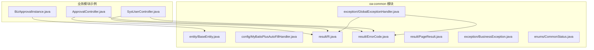
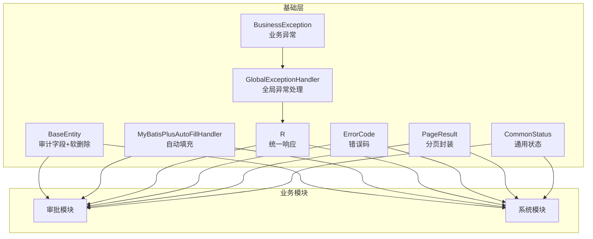
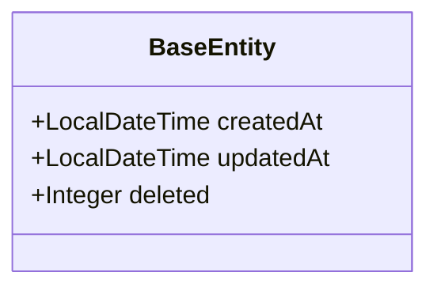
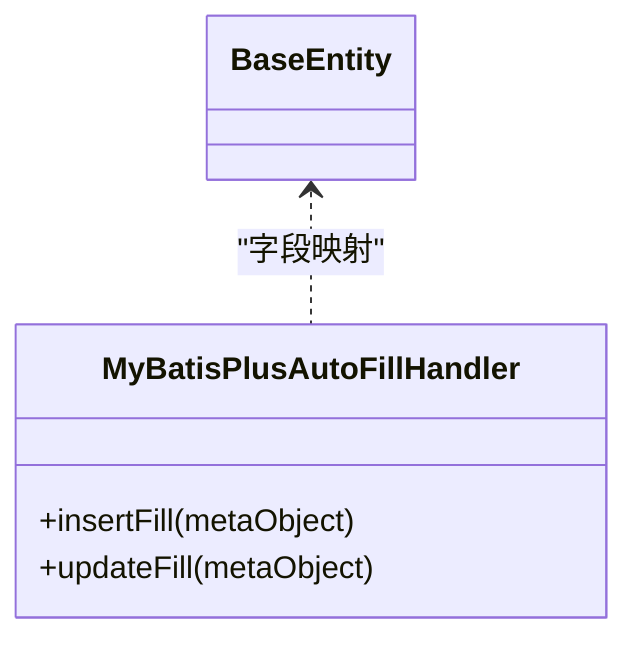
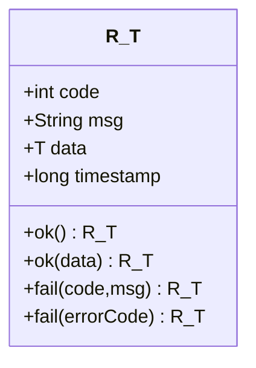
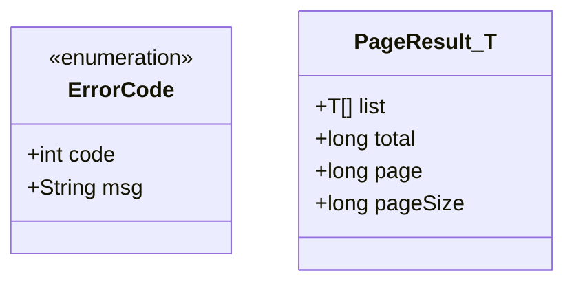
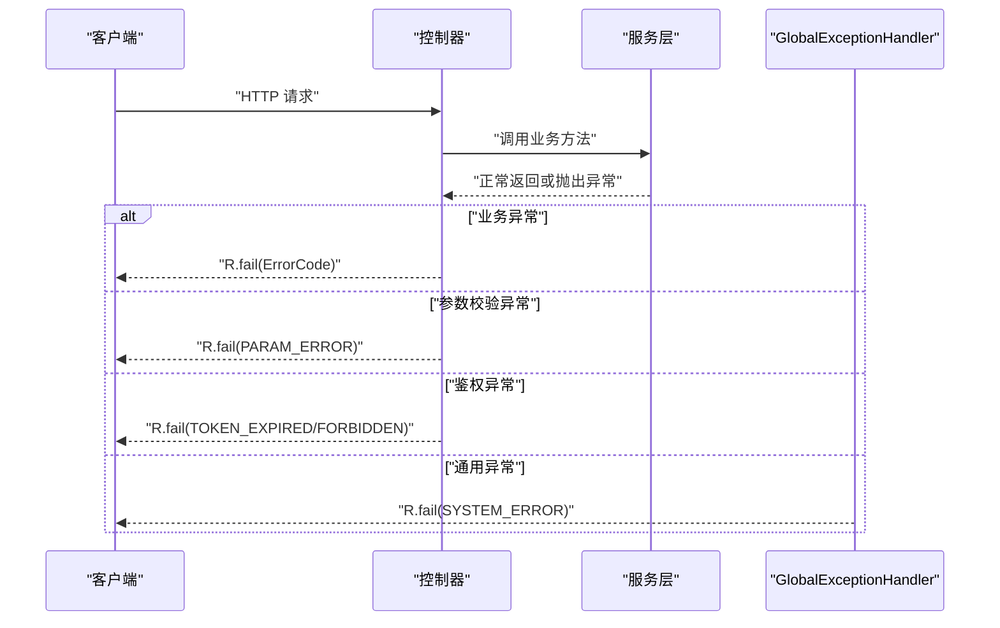
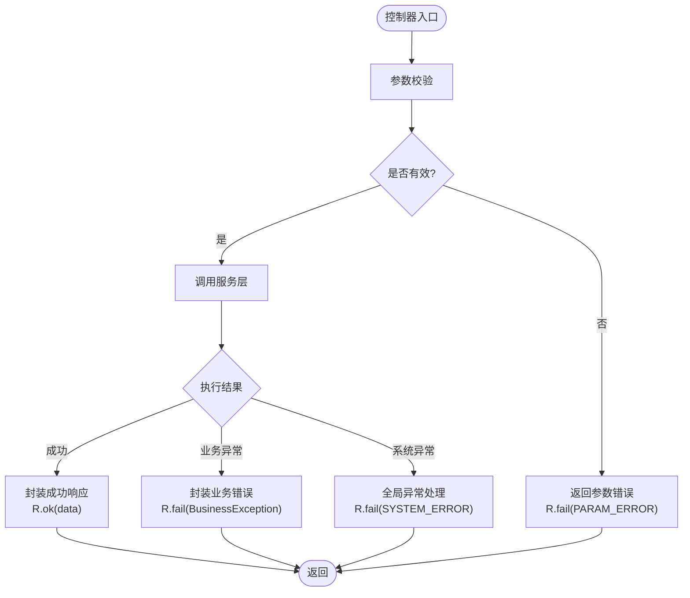
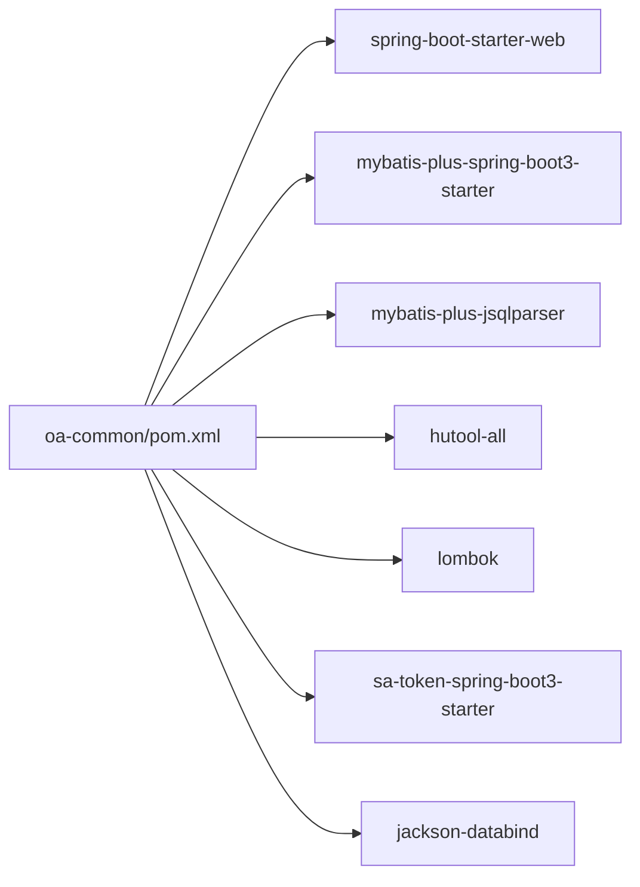

# 公共模块 (oa-common)

<cite>
**本文引用的文件**
- [BaseEntity.java](file://oa-common/src/main/java/com/oa/admin/common/entity/BaseEntity.java)
- [MyBatisPlusAutoFillHandler.java](file://oa-common/src/main/java/com/oa/admin/common/config/MyBatisPlusAutoFillHandler.java)
- [R.java](file://oa-common/src/main/java/com/oa/admin/common/result/R.java)
- [ErrorCode.java](file://oa-common/src/main/java/com/oa/admin/common/result/ErrorCode.java)
- [PageResult.java](file://oa-common/src/main/java/com/oa/admin/common/result/PageResult.java)
- [BusinessException.java](file://oa-common/src/main/java/com/oa/admin/common/exception/BusinessException.java)
- [GlobalExceptionHandler.java](file://oa-common/src/main/java/com/oa/admin/common/exception/GlobalExceptionHandler.java)
- [CommonStatus.java](file://oa-common/src/main/java/com/oa/admin/common/enums/CommonStatus.java)
- [BizApprovalInstance.java](file://oa-approval/src/main/java/com/oa/admin/approval/entity/BizApprovalInstance.java)
- [ApprovalController.java](file://oa-approval/src/main/java/com/oa/admin/approval/controller/ApprovalController.java)
- [SysUserController.java](file://oa-system/src/main/java/com/oa/admin/system/controller/SysUserController.java)
- [pom.xml](file://oa-common/pom.xml)
</cite>

## 目录
1. [简介](#简介)
2. [项目结构](#项目结构)
3. [核心组件](#核心组件)
4. [架构总览](#架构总览)
5. [详细组件分析](#详细组件分析)
6. [依赖分析](#依赖分析)
7. [性能考虑](#性能考虑)
8. [故障排查指南](#故障排查指南)
9. [结论](#结论)
10. [附录](#附录)

## 简介
oa-common 是整个 OA 系统的基础公共模块，承担统一的基础设施职责，包括：
- 实体基类设计：提供统一的审计字段与软删除能力，确保所有业务实体具备一致的时间戳与状态管理。
- MyBatis-Plus 自动填充：通过元对象处理器实现创建/更新时间的自动化填充。
- 统一响应封装：R<T> 标准化接口返回格式，支持成功/失败、分页结果封装与时间戳。
- 错误码体系：ErrorCode 枚举定义系统、认证授权、审批等领域的标准错误码。
- 全局异常处理：GlobalExceptionHandler 集中处理鉴权异常、业务异常、参数校验异常与通用异常。
- 通用状态枚举：CommonStatus 提供启用/禁用等通用状态语义。

这些能力被各业务模块（如审批、系统管理）广泛复用，保证了系统的规范性与一致性。

## 项目结构
oa-common 模块采用按功能域划分的包结构，核心目录如下：
- entity：基础实体基类 BaseEntity
- config：MyBatis-Plus 自动填充配置
- result：统一响应与错误码、分页结果
- exception：业务异常与全局异常处理器
- enums：通用状态枚举
- util：工具类（本模块未包含具体实现）
- test：单元测试覆盖上述组件

**图表来源**
- [BaseEntity.java:1-26](file://oa-common/src/main/java/com/oa/admin/common/entity/BaseEntity.java#L1-L26)
- [MyBatisPlusAutoFillHandler.java:1-25](file://oa-common/src/main/java/com/oa/admin/common/config/MyBatisPlusAutoFillHandler.java#L1-L25)
- [R.java:1-44](file://oa-common/src/main/java/com/oa/admin/common/result/R.java#L1-L44)
- [ErrorCode.java:1-45](file://oa-common/src/main/java/com/oa/admin/common/result/ErrorCode.java#L1-L45)
- [PageResult.java:1-23](file://oa-common/src/main/java/com/oa/admin/common/result/PageResult.java#L1-L23)
- [BusinessException.java:1-23](file://oa-common/src/main/java/com/oa/admin/common/exception/BusinessException.java#L1-L23)
- [GlobalExceptionHandler.java:1-74](file://oa-common/src/main/java/com/oa/admin/common/exception/GlobalExceptionHandler.java#L1-L74)
- [CommonStatus.java:1-26](file://oa-common/src/main/java/com/oa/admin/common/enums/CommonStatus.java#L1-L26)
- [BizApprovalInstance.java:1-33](file://oa-approval/src/main/java/com/oa/admin/approval/entity/BizApprovalInstance.java#L1-L33)
- [ApprovalController.java:1-252](file://oa-approval/src/main/java/com/oa/admin/approval/controller/ApprovalController.java#L1-L252)
- [SysUserController.java:1-85](file://oa-system/src/main/java/com/oa/admin/system/controller/SysUserController.java#L1-L85)

**章节来源**
- [pom.xml:1-54](file://oa-common/pom.xml#L1-L54)

## 核心组件
- BaseEntity：统一审计字段 createdAt、updatedAt 与软删除 deleted 字段，配合 MyBatis-Plus 注解实现自动填充与逻辑删除。
- MyBatisPlusAutoFillHandler：MetaObjectHandler 实现类，负责插入与更新时自动填充时间字段。
- R<T>：统一响应包装器，提供 ok()/fail() 工厂方法，携带 code、msg、data、timestamp。
- ErrorCode：错误码枚举，按领域划分（系统/认证/审批），便于前后端约定。
- PageResult<T>：分页结果封装，包含列表、总数、页码、页大小。
- BusinessException：业务异常类，支持自定义 code 与错误码枚举。
- GlobalExceptionHandler：全局异常处理器，集中处理鉴权、参数校验、业务与通用异常。
- CommonStatus：通用状态枚举，提供启用/禁用等常用状态。

**章节来源**
- [BaseEntity.java:1-26](file://oa-common/src/main/java/com/oa/admin/common/entity/BaseEntity.java#L1-L26)
- [MyBatisPlusAutoFillHandler.java:1-25](file://oa-common/src/main/java/com/oa/admin/common/config/MyBatisPlusAutoFillHandler.java#L1-L25)
- [R.java:1-44](file://oa-common/src/main/java/com/oa/admin/common/result/R.java#L1-L44)
- [ErrorCode.java:1-45](file://oa-common/src/main/java/com/oa/admin/common/result/ErrorCode.java#L1-L45)
- [PageResult.java:1-23](file://oa-common/src/main/java/com/oa/admin/common/result/PageResult.java#L1-L23)
- [BusinessException.java:1-23](file://oa-common/src/main/java/com/oa/admin/common/exception/BusinessException.java#L1-L23)
- [GlobalExceptionHandler.java:1-74](file://oa-common/src/main/java/com/oa/admin/common/exception/GlobalExceptionHandler.java#L1-L74)
- [CommonStatus.java:1-26](file://oa-common/src/main/java/com/oa/admin/common/enums/CommonStatus.java#L1-L26)

## 架构总览
oa-common 通过“实体基类 + ORM 自动填充 + 统一响应 + 异常处理 + 错误码 + 通用状态”构成系统基础层，业务模块仅需继承实体基类、抛出业务异常、返回统一响应即可，无需重复造轮子。

**图表来源**
- [BaseEntity.java:1-26](file://oa-common/src/main/java/com/oa/admin/common/entity/BaseEntity.java#L1-L26)
- [MyBatisPlusAutoFillHandler.java:1-25](file://oa-common/src/main/java/com/oa/admin/common/config/MyBatisPlusAutoFillHandler.java#L1-L25)
- [R.java:1-44](file://oa-common/src/main/java/com/oa/admin/common/result/R.java#L1-L44)
- [ErrorCode.java:1-45](file://oa-common/src/main/java/com/oa/admin/common/result/ErrorCode.java#L1-L45)
- [PageResult.java:1-23](file://oa-common/src/main/java/com/oa/admin/common/result/PageResult.java#L1-L23)
- [BusinessException.java:1-23](file://oa-common/src/main/java/com/oa/admin/common/exception/BusinessException.java#L1-L23)
- [GlobalExceptionHandler.java:1-74](file://oa-common/src/main/java/com/oa/admin/common/exception/GlobalExceptionHandler.java#L1-L74)
- [CommonStatus.java:1-26](file://oa-common/src/main/java/com/oa/admin/common/enums/CommonStatus.java#L1-L26)

## 详细组件分析

### 实体基类 BaseEntity 设计
设计理念：
- 审计字段：createdAt、updatedAt 使用 LocalDateTime，统一 JSON 时间格式。
- 软删除：deleted 字段配合逻辑删除注解，避免物理删除造成数据不可恢复。
- 与 MyBatis-Plus 协作：通过注解与自动填充处理器实现零样板代码的审计字段维护。

**图表来源**
- [BaseEntity.java:1-26](file://oa-common/src/main/java/com/oa/admin/common/entity/BaseEntity.java#L1-L26)

**章节来源**
- [BaseEntity.java:1-26](file://oa-common/src/main/java/com/oa/admin/common/entity/BaseEntity.java#L1-L26)

### MyBatis-Plus 自动填充配置
实现要点：
- MetaObjectHandler 接口：在插入与更新时自动填充 createdAt、updatedAt。
- 严格填充：使用 strictInsertFill/strictUpdateFill 确保类型匹配与非空约束。
- 与 BaseEntity 协同：ORM 层与实体层形成闭环，保证数据一致性。

**图表来源**
- [MyBatisPlusAutoFillHandler.java:1-25](file://oa-common/src/main/java/com/oa/admin/common/config/MyBatisPlusAutoFillHandler.java#L1-L25)
- [BaseEntity.java:1-26](file://oa-common/src/main/java/com/oa/admin/common/entity/BaseEntity.java#L1-L26)

**章节来源**
- [MyBatisPlusAutoFillHandler.java:1-25](file://oa-common/src/main/java/com/oa/admin/common/config/MyBatisPlusAutoFillHandler.java#L1-L25)

### 统一响应 R<T> 设计
设计模式：
- 泛型包装：R<T> 封装 code、msg、data、timestamp，支持任意数据类型。
- 工厂方法：ok() 返回成功响应；fail(code,msg) 与 fail(ErrorCode) 支持多种失败场景。
- JSON 序列化：排除 null 字段，减少响应体积。

**图表来源**
- [R.java:1-44](file://oa-common/src/main/java/com/oa/admin/common/result/R.java#L1-L44)

**章节来源**
- [R.java:1-44](file://oa-common/src/main/java/com/oa/admin/common/result/R.java#L1-L44)

### 错误码 ErrorCode 与分页 PageResult
- 错误码划分：系统（10xx）、认证授权（20xx）、审批（30xx）等，便于前端统一处理。
- 分页封装：PageResult<T> 提供 list、total、page、pageSize，简化分页接口返回。

**图表来源**
- [ErrorCode.java:1-45](file://oa-common/src/main/java/com/oa/admin/common/result/ErrorCode.java#L1-L45)
- [PageResult.java:1-23](file://oa-common/src/main/java/com/oa/admin/common/result/PageResult.java#L1-L23)

**章节来源**
- [ErrorCode.java:1-45](file://oa-common/src/main/java/com/oa/admin/common/result/ErrorCode.java#L1-L45)
- [PageResult.java:1-23](file://oa-common/src/main/java/com/oa/admin/common/result/PageResult.java#L1-L23)

### 业务异常 BusinessException 与全局异常处理器 GlobalExceptionHandler
- BusinessException：支持自定义 code 与错误码枚举，便于业务层抛出结构化错误。
- GlobalExceptionHandler：集中处理以下异常并返回标准化响应：
  - 鉴权异常：未登录、权限不足、角色不足 → 对应错误码与状态码。
  - 参数校验异常：MethodArgumentNotValidException、BindException → 参数错误码与首条错误消息。
  - 业务异常：BusinessException → 透传业务 code 与 message。
  - 通用异常：Exception → 系统错误码与日志记录。

**图表来源**
- [GlobalExceptionHandler.java:1-74](file://oa-common/src/main/java/com/oa/admin/common/exception/GlobalExceptionHandler.java#L1-L74)
- [BusinessException.java:1-23](file://oa-common/src/main/java/com/oa/admin/common/exception/BusinessException.java#L1-L23)
- [ErrorCode.java:1-45](file://oa-common/src/main/java/com/oa/admin/common/result/ErrorCode.java#L1-L45)
- [R.java:1-44](file://oa-common/src/main/java/com/oa/admin/common/result/R.java#L1-L44)

**章节来源**
- [BusinessException.java:1-23](file://oa-common/src/main/java/com/oa/admin/common/exception/BusinessException.java#L1-L23)
- [GlobalExceptionHandler.java:1-74](file://oa-common/src/main/java/com/oa/admin/common/exception/GlobalExceptionHandler.java#L1-L74)

### 通用状态枚举 CommonStatus
- 启用/禁用：提供 ACTIVE(1)、DISABLED(0)，并包含 of(code) 工具方法进行安全转换。
- 适用范围：适用于系统配置、用户状态、菜单状态等通用场景。

**章节来源**
- [CommonStatus.java:1-26](file://oa-common/src/main/java/com/oa/admin/common/enums/CommonStatus.java#L1-L26)

### 在业务模块中的复用示例
- 继承实体基类：业务实体只需扩展 BaseEntity，即可获得统一审计字段与软删除能力。
- 控制器返回统一响应：控制器直接返回 R.ok()/R.fail(...)，无需手动构造响应体。
- 抛出业务异常：服务层抛出 BusinessException 或使用 ErrorCode 构造，由全局异常处理器统一拦截。
- 分页接口：将查询结果封装为 PageResult 并通过 R.ok(...) 返回。

**图表来源**
- [ApprovalController.java:1-252](file://oa-approval/src/main/java/com/oa/admin/approval/controller/ApprovalController.java#L1-L252)
- [SysUserController.java:1-85](file://oa-system/src/main/java/com/oa/admin/system/controller/SysUserController.java#L1-L85)
- [R.java:1-44](file://oa-common/src/main/java/com/oa/admin/common/result/R.java#L1-L44)
- [ErrorCode.java:1-45](file://oa-common/src/main/java/com/oa/admin/common/result/ErrorCode.java#L1-L45)
- [BusinessException.java:1-23](file://oa-common/src/main/java/com/oa/admin/common/exception/BusinessException.java#L1-L23)
- [GlobalExceptionHandler.java:1-74](file://oa-common/src/main/java/com/oa/admin/common/exception/GlobalExceptionHandler.java#L1-L74)

**章节来源**
- [BizApprovalInstance.java:1-33](file://oa-approval/src/main/java/com/oa/admin/approval/entity/BizApprovalInstance.java#L1-L33)
- [ApprovalController.java:1-252](file://oa-approval/src/main/java/com/oa/admin/approval/controller/ApprovalController.java#L1-L252)
- [SysUserController.java:1-85](file://oa-system/src/main/java/com/oa/admin/system/controller/SysUserController.java#L1-L85)

## 依赖分析
oa-common 的核心依赖包括 Spring Web、MyBatis-Plus、Sa-Token、Jackson 与 Lombok，这些依赖为统一响应、ORM 自动填充、鉴权与序列化提供了基础能力。

**图表来源**
- [pom.xml:1-54](file://oa-common/pom.xml#L1-L54)

**章节来源**
- [pom.xml:1-54](file://oa-common/pom.xml#L1-L54)

## 性能考虑
- 响应体积优化：R<T> 使用 JSON 序列化排除 null 字段，降低网络传输开销。
- 自动填充效率：MetaObjectHandler 在持久层完成时间字段填充，避免在业务层重复赋值。
- 分页封装：PageResult<T> 仅传递必要字段，避免一次性加载大量数据。
- 异常处理：全局异常处理器集中处理，减少重复判断与分支逻辑。

## 故障排查指南
- 参数校验失败：检查请求体与校验注解，确认错误消息是否正确映射到错误码。
- 业务异常未被捕获：确认服务层是否抛出 BusinessException，控制器是否直接返回 R.ok(...)。
- 鉴权失败：核对 Sa-Token 权限注解与登录状态，确认错误码是否为 TOKEN_EXPIRED 或 FORBIDDEN。
- 通用异常：查看全局异常处理器日志输出，定位未捕获异常的具体位置。

**章节来源**
- [GlobalExceptionHandler.java:1-74](file://oa-common/src/main/java/com/oa/admin/common/exception/GlobalExceptionHandler.java#L1-L74)
- [BusinessException.java:1-23](file://oa-common/src/main/java/com/oa/admin/common/exception/BusinessException.java#L1-L23)

## 结论
oa-common 通过“实体基类 + ORM 自动填充 + 统一响应 + 错误码 + 全局异常处理 + 通用状态”的组合拳，构建了系统级的基础设施。它不仅提升了开发效率，还保证了接口风格的一致性与错误处理的规范化。业务模块只需遵循公共约定，即可快速集成并保持整体架构的稳定与可演进性。

## 附录
- 复用建议：
  - 所有业务实体继承 BaseEntity，确保审计字段与软删除生效。
  - 控制器统一返回 R.ok()/R.fail(...)，避免手写响应体。
  - 服务层抛出 BusinessException 或使用 ErrorCode，交由全局异常处理器处理。
  - 分页接口使用 PageResult<T> 进行封装，提升前端交互体验。