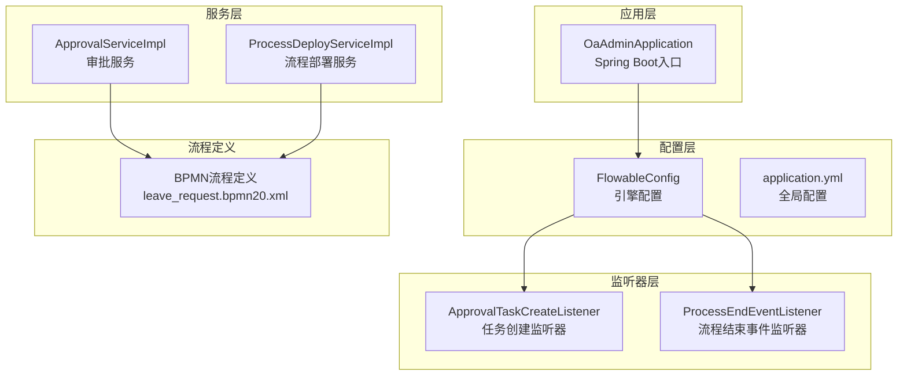
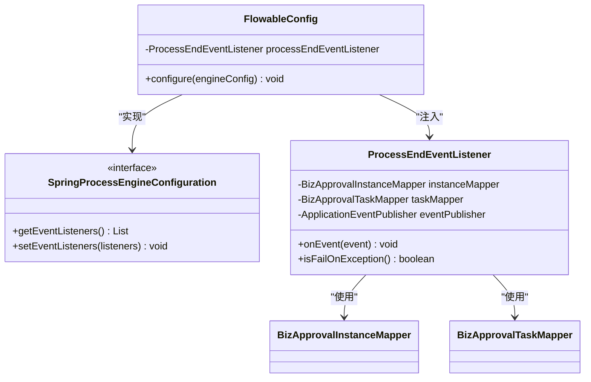
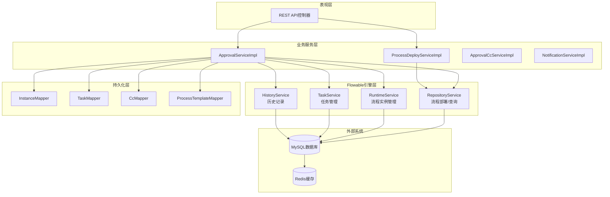
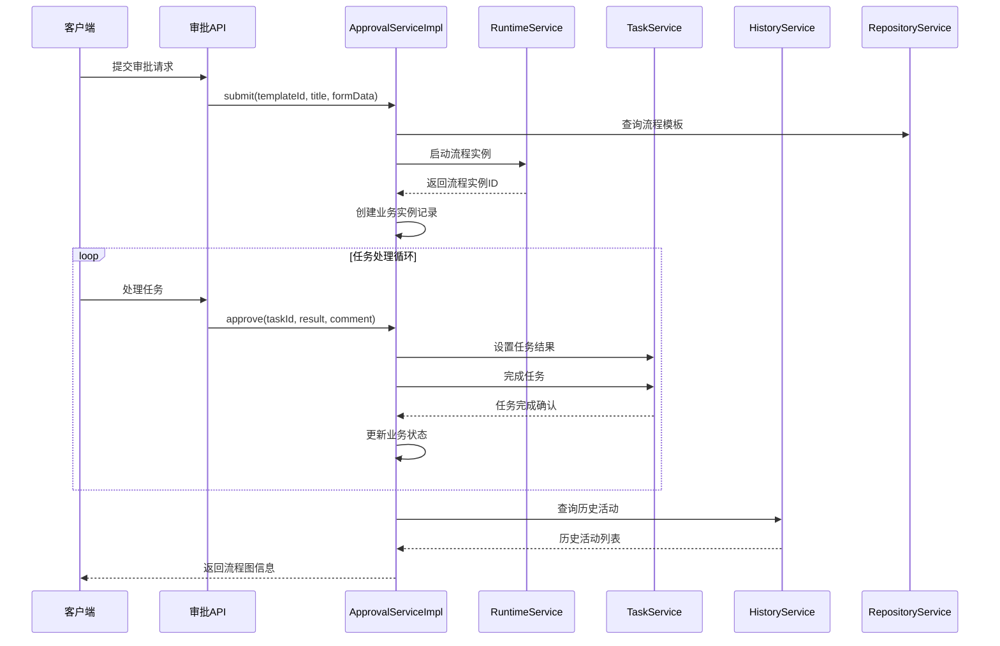
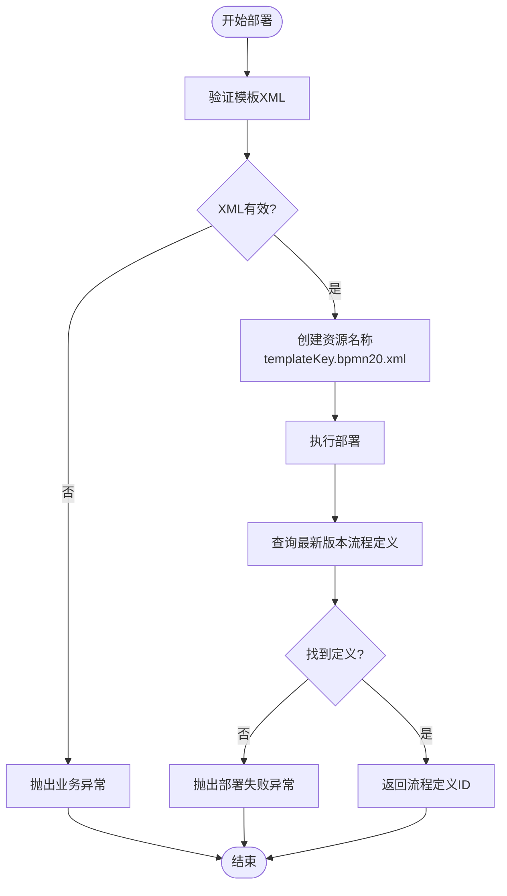
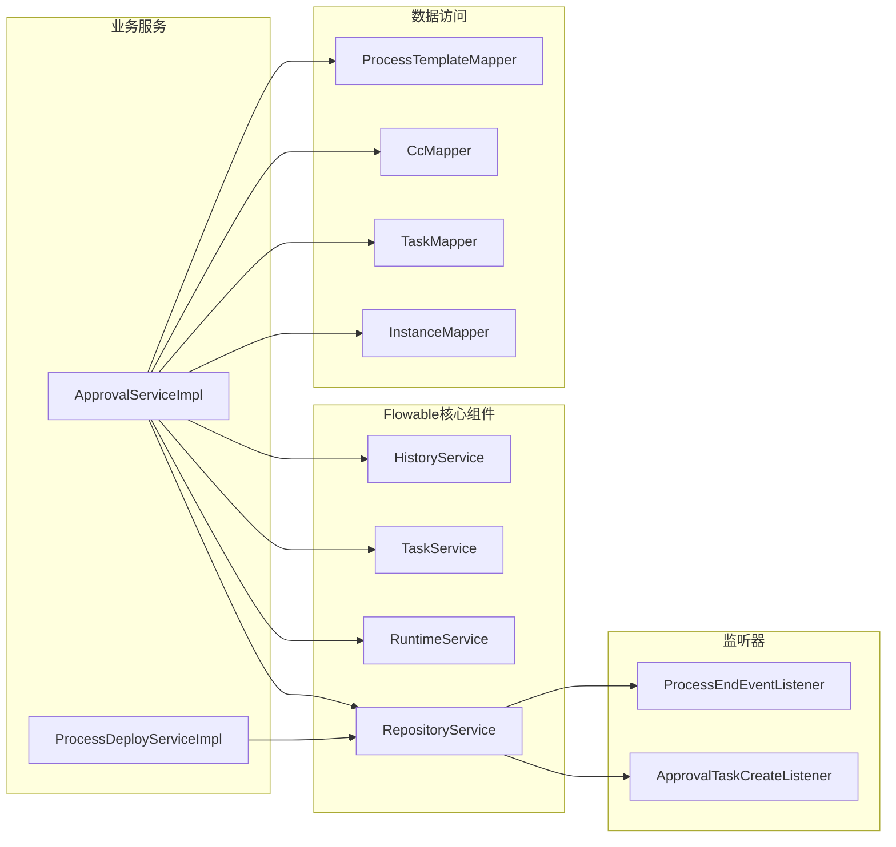

# Flowable引擎集成

<cite>
**本文档引用的文件**
- [FlowableConfig.java](file://oa-approval/src/main/java/com/oa/admin/approval/config/FlowableConfig.java)
- [FlowableConstants.java](file://oa-approval/src/main/java/com/oa/admin/approval/constant/FlowableConstants.java)
- [ApprovalTaskCreateListener.java](file://oa-approval/src/main/java/com/oa/admin/approval/listener/ApprovalTaskCreateListener.java)
- [ProcessEndEventListener.java](file://oa-approval/src/main/java/com/oa/admin/approval/listener/ProcessEndEventListener.java)
- [application.yml](file://oa-app/src/main/resources/application.yml)
- [OaAdminApplication.java](file://oa-app/src/main/java/com/oa/admin/OaAdminApplication.java)
- [ApprovalServiceImpl.java](file://oa-approval/src/main/java/com/oa/admin/approval/service/impl/ApprovalServiceImpl.java)
- [ProcessDeployServiceImpl.java](file://oa-approval/src/main/java/com/oa/admin/approval/service/impl/ProcessDeployServiceImpl.java)
- [ApprovalTaskType.java](file://oa-approval/src/main/java/com/oa/admin/approval/enums/ApprovalTaskType.java)
- [ApprovalInstanceStatus.java](file://oa-approval/src/main/java/com/oa/admin/approval/enums/ApprovalInstanceStatus.java)
- [ApprovalTaskResult.java](file://oa-approval/src/main/java/com/oa/admin/approval/enums/ApprovalTaskResult.java)
- [leave_request.bpmn20.xml](file://oa-app/src/main/resources/processes/leave_request.bpmn20.xml)
- [leave_request.bpmn20.xml（测试）](file://oa-approval/src/test/resources/processes/leave_request.bpmn20.xml)
</cite>

## 目录
1. [简介](#简介)
2. [项目结构](#项目结构)
3. [核心组件](#核心组件)
4. [架构概览](#架构概览)
5. [详细组件分析](#详细组件分析)
6. [依赖关系分析](#依赖关系分析)
7. [性能考虑](#性能考虑)
8. [故障排除指南](#故障排除指南)
9. [结论](#结论)

## 简介

本项目集成了Flowable工作流引擎，实现了完整的审批流程管理系统。系统基于Spring Boot构建，通过Flowable实现业务流程的自动化执行，包括流程部署、实例启动、任务处理、历史记录等功能。

Flowable引擎提供了企业级工作流和BPMN 2.0支持，能够处理复杂的业务流程场景，如多级审批、并行审批、条件分支等。本集成方案采用Spring Boot自动配置机制，简化了Flowable引擎的初始化和配置过程。

## 项目结构

项目采用多模块架构，Flowable相关的核心代码主要集中在oa-approval模块中：

**图表来源**
- [OaAdminApplication.java:11-18](file://oa-app/src/main/java/com/oa/admin/OaAdminApplication.java#L11-L18)
- [FlowableConfig.java:15-30](file://oa-approval/src/main/java/com/oa/admin/approval/config/FlowableConfig.java#L15-L30)

**章节来源**
- [OaAdminApplication.java:1-19](file://oa-app/src/main/java/com/oa/admin/OaAdminApplication.java#L1-L19)
- [application.yml:1-59](file://oa-app/src/main/resources/application.yml#L1-L59)

## 核心组件

### FlowableConfig配置类

FlowableConfig是系统的核心配置类，实现了EngineConfigurationConfigurer接口，用于自定义Flowable引擎的配置。

**图表来源**
- [FlowableConfig.java:17-29](file://oa-approval/src/main/java/com/oa/admin/approval/config/FlowableConfig.java#L17-L29)
- [ProcessEndEventListener.java:29-63](file://oa-approval/src/main/java/com/oa/admin/approval/listener/ProcessEndEventListener.java#L29-L63)

### 数据源配置

系统使用MySQL作为数据库，通过HikariCP连接池提供高性能的数据访问能力：

**章节来源**
- [application.yml:5-18](file://oa-app/src/main/resources/application.yml#L5-L18)

### 事务管理配置

系统启用了Spring事务管理，并配置了MyBatis-Plus的逻辑删除功能：

**章节来源**
- [application.yml:36-43](file://oa-app/src/main/resources/application.yml#L36-L43)
- [OaAdminApplication.java:12-12](file://oa-app/src/main/java/com/oa/admin/OaAdminApplication.java#L12-L12)

## 架构概览

系统采用分层架构设计，Flowable引擎作为工作流核心，与业务服务紧密集成：

**图表来源**
- [ApprovalServiceImpl.java:105-111](file://oa-approval/src/main/java/com/oa/admin/approval/service/impl/ApprovalServiceImpl.java#L105-L111)
- [ProcessDeployServiceImpl.java:26-26](file://oa-approval/src/main/java/com/oa/admin/approval/service/impl/ProcessDeployServiceImpl.java#L26-L26)

## 详细组件分析

### 审批服务实现

ApprovalServiceImpl是核心业务服务，负责处理完整的审批流程生命周期：

**图表来源**
- [ApprovalServiceImpl.java:114-159](file://oa-approval/src/main/java/com/oa/admin/approval/service/impl/ApprovalServiceImpl.java#L114-L159)
- [ApprovalServiceImpl.java:162-231](file://oa-approval/src/main/java/com/oa/admin/approval/service/impl/ApprovalServiceImpl.java#L162-L231)

#### 流程提交流程

服务实现了完整的流程提交功能，包括模板验证、变量设置、实例创建等步骤：

**章节来源**
- [ApprovalServiceImpl.java:114-159](file://oa-approval/src/main/java/com/oa/admin/approval/service/impl/ApprovalServiceImpl.java#L114-L159)

#### 任务审批流程

支持多种审批结果处理，包括批准、拒绝、转办等操作：

**章节来源**
- [ApprovalServiceImpl.java:162-231](file://oa-approval/src/main/java/com/oa/admin/approval/service/impl/ApprovalServiceImpl.java#L162-L231)

### 流程部署服务

ProcessDeployServiceImpl负责流程定义的部署和管理：

**图表来源**
- [ProcessDeployServiceImpl.java:28-58](file://oa-approval/src/main/java/com/oa/admin/approval/service/impl/ProcessDeployServiceImpl.java#L28-L58)

**章节来源**
- [ProcessDeployServiceImpl.java:1-82](file://oa-approval/src/main/java/com/oa/admin/approval/service/impl/ProcessDeployServiceImpl.java#L1-L82)

### 任务创建监听器

ApprovalTaskCreateListener在任务创建时自动同步到业务系统：

**章节来源**
- [ApprovalTaskCreateListener.java:1-89](file://oa-approval/src/main/java/com/oa/admin/approval/listener/ApprovalTaskCreateListener.java#L1-L89)

### 流程结束事件监听器

ProcessEndEventListener监听流程结束事件，自动更新业务状态并发布事件：

**章节来源**
- [ProcessEndEventListener.java:1-80](file://oa-approval/src/main/java/com/oa/admin/approval/listener/ProcessEndEventListener.java#L1-L80)

### 流程常量定义

FlowableConstants定义了流程相关的常量，包括变量名、文件后缀等：

**章节来源**
- [FlowableConstants.java:1-16](file://oa-approval/src/main/java/com/oa/admin/approval/constant/FlowableConstants.java#L1-L16)

## 依赖关系分析

系统与Flowable引擎的依赖关系清晰明确：

**图表来源**
- [ApprovalServiceImpl.java:105-111](file://oa-approval/src/main/java/com/oa/admin/approval/service/impl/ApprovalServiceImpl.java#L105-L111)
- [ProcessDeployServiceImpl.java:26-26](file://oa-approval/src/main/java/com/oa/admin/approval/service/impl/ProcessDeployServiceImpl.java#L26-L26)

**章节来源**
- [ApprovalServiceImpl.java:39-44](file://oa-approval/src/main/java/com/oa/admin/approval/service/impl/ApprovalServiceImpl.java#L39-L44)

## 性能考虑

### 连接池配置

系统使用HikariCP连接池，配置了合理的连接参数以确保性能：

**章节来源**
- [application.yml:10-24](file://oa-app/src/main/resources/application.yml#L10-L24)

### 异步执行器

Flowable异步执行器已禁用，适用于当前的业务场景：

**章节来源**
- [application.yml:58-58](file://oa-app/src/main/resources/application.yml#L58-L58)

### 缓存策略

系统集成了Redis缓存，可以进一步优化频繁访问的数据：

**章节来源**
- [application.yml:32-34](file://oa-app/src/main/resources/application.yml#L32-L34)

## 故障排除指南

### 常见问题及解决方案

1. **流程部署失败**
   - 检查BPMN XML格式是否正确
   - 确认流程ID唯一性
   - 验证流程定义的可执行属性

2. **任务创建异常**
   - 检查任务监听器是否正确注册
   - 验证用户ID格式是否正确
   - 确认业务实例是否存在

3. **流程实例无法启动**
   - 检查流程模板状态
   - 验证流程定义版本
   - 确认起始用户任务配置

4. **历史数据查询异常**
   - 检查历史级别配置
   - 验证数据库表结构
   - 确认查询条件

**章节来源**
- [ProcessDeployServiceImpl.java:30-52](file://oa-approval/src/main/java/com/oa/admin/approval/service/impl/ProcessDeployServiceImpl.java#L30-L52)
- [ApprovalTaskCreateListener.java:25-64](file://oa-approval/src/main/java/com/oa/admin/approval/listener/ApprovalTaskCreateListener.java#L25-L64)

### 日志监控

系统使用SLF4J进行日志记录，建议重点关注以下日志级别：

- **ERROR**: 业务异常、系统错误
- **WARN**: 警告信息、潜在问题
- **INFO**: 关键业务操作、流程状态变化

## 结论

本Flowable引擎集成为企业级审批系统提供了完整的技术解决方案。通过合理的架构设计和配置管理，系统实现了：

1. **完整的审批流程管理**：从流程部署到实例执行的全生命周期管理
2. **灵活的任务处理**：支持多种审批模式和任务类型
3. **完善的监控机制**：通过监听器实现流程状态的实时跟踪
4. **良好的扩展性**：模块化设计便于功能扩展和维护

系统的关键优势在于：
- 基于Spring Boot的自动配置简化了集成复杂度
- 清晰的分层架构便于维护和扩展
- 完善的异常处理和日志记录机制
- 合理的性能配置确保系统稳定性

未来可以考虑的改进方向包括：引入更高级的流程优化策略、增强监控和告警功能、完善流程设计器的集成等。