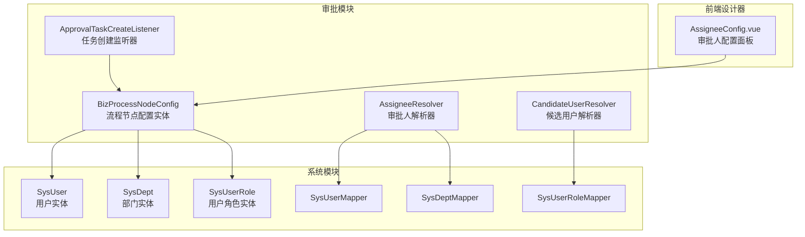
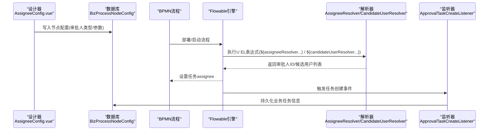
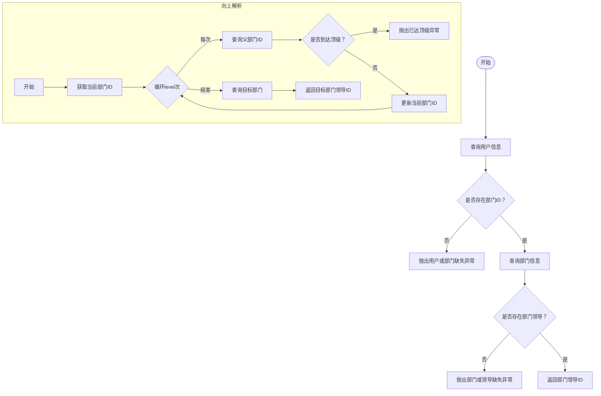
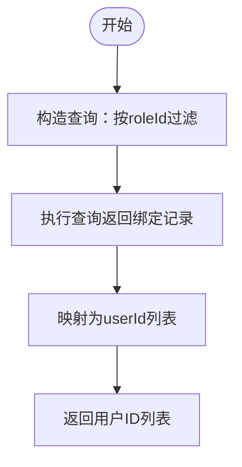
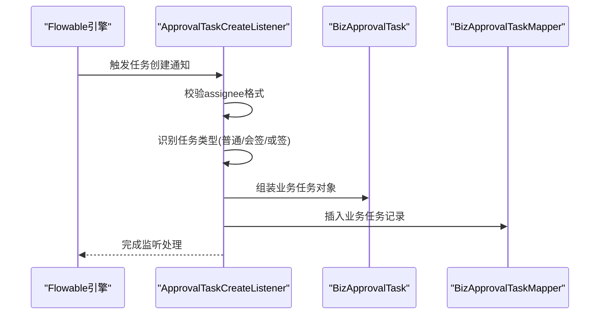
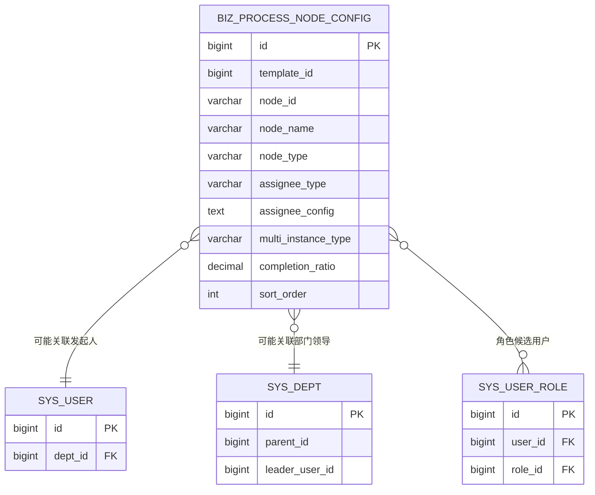
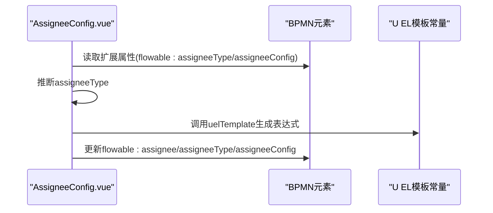
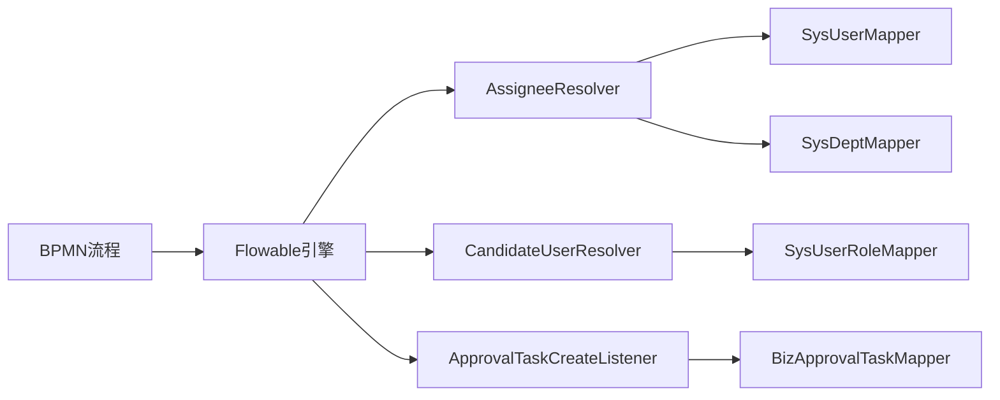

# 候选人解析系统

<cite>
**本文引用的文件**
- [AssigneeResolver.java](file://oa-approval/src/main/java/com/oa/admin/approval/resolver/AssigneeResolver.java)
- [CandidateUserResolver.java](file://oa-approval/src/main/java/com/oa/admin/approval/resolver/CandidateUserResolver.java)
- [AssigneeResolverTest.java](file://oa-approval/src/test/java/com/oa/admin/approval/resolver/AssigneeResolverTest.java)
- [CandidateUserResolverTest.java](file://oa-approval/src/test/java/com/oa/admin/approval/resolver/CandidateUserResolverTest.java)
- [FlowableGatewayIntegrationTest.java](file://oa-approval/src/test/java/com/oa/admin/approval/integration/FlowableGatewayIntegrationTest.java)
- [ApprovalTaskCreateListener.java](file://oa-approval/src/main/java/com/oa/admin/approval/listener/ApprovalTaskCreateListener.java)
- [SysUser.java](file://oa-system/src/main/java/com/oa/admin/system/entity/SysUser.java)
- [SysDept.java](file://oa-system/src/main/java/com/oa/admin/system/entity/SysDept.java)
- [SysUserRole.java](file://oa-system/src/main/java/com/oa/admin/system/entity/SysUserRole.java)
- [SysUserMapper.java](file://oa-system/src/main/java/com/oa/admin/system/mapper/SysUserMapper.java)
- [SysDeptMapper.java](file://oa-system/src/main/java/com/oa/admin/system/mapper/SysDeptMapper.java)
- [SysUserRoleMapper.java](file://oa-system/src/main/java/com/oa/admin/system/mapper/SysUserRoleMapper.java)
- [BizProcessNodeConfig.java](file://oa-approval/src/main/java/com/oa/admin/approval/entity/BizProcessNodeConfig.java)
- [FlowableConstants.java](file://oa-approval/src/main/java/com/oa/admin/approval/constant/FlowableConstants.java)
- [ApprovalTaskType.java](file://oa-approval/src/main/java/com/oa/admin/approval/enums/ApprovalTaskType.java)
- [V4__phase2_flow_design.sql](file://oa-app/src/main/resources/db/migration/V4__phase2_flow_design.sql)
- [AssigneeConfig.vue](file://oa-ui/src/views/approval/template/designer/components/panels/AssigneeConfig.vue)
- [constants.test.ts](file://oa-ui/src/bpmn/constants.test.ts)
</cite>

## 目录
1. [简介](#简介)
2. [项目结构](#项目结构)
3. [核心组件](#核心组件)
4. [架构总览](#架构总览)
5. [详细组件分析](#详细组件分析)
6. [依赖分析](#依赖分析)
7. [性能考虑](#性能考虑)
8. [故障排查指南](#故障排查指南)
9. [结论](#结论)
10. [附录](#附录)

## 简介
本文件面向候选人解析系统，聚焦于审批人分配策略与候选用户解析机制。系统通过两个核心解析器：AssigneeResolver（审批人解析器）与CandidateUserResolver（候选用户解析器），在工作流引擎中以U EL表达式形式动态解析审批人与多实例候选集合。解析能力覆盖部门领导、向上级部门领导、发起人本人、角色用户集合等常见业务场景，并通过监听器与数据库配置表实现从设计器到运行时的闭环。

## 项目结构
系统采用模块化分层设计，审批模块负责解析与监听，系统模块提供组织与用户数据模型及Mapper，前端设计器负责将配置持久化到数据库并在BPMN中生成U EL表达式。

图表来源
- [AssigneeResolver.java:1-62](file://oa-approval/src/main/java/com/oa/admin/approval/resolver/AssigneeResolver.java#L1-L62)
- [CandidateUserResolver.java:1-31](file://oa-approval/src/main/java/com/oa/admin/approval/resolver/CandidateUserResolver.java#L1-L31)
- [ApprovalTaskCreateListener.java:1-89](file://oa-approval/src/main/java/com/oa/admin/approval/listener/ApprovalTaskCreateListener.java#L1-L89)
- [BizProcessNodeConfig.java:1-36](file://oa-approval/src/main/java/com/oa/admin/approval/entity/BizProcessNodeConfig.java#L1-L36)
- [SysUser.java:1-27](file://oa-system/src/main/java/com/oa/admin/system/entity/SysUser.java#L1-L27)
- [SysDept.java:1-31](file://oa-system/src/main/java/com/oa/admin/system/entity/SysDept.java#L1-L31)
- [SysUserRole.java:1-19](file://oa-system/src/main/java/com/oa/admin/system/entity/SysUserRole.java#L1-L19)
- [AssigneeConfig.vue:87-171](file://oa-ui/src/views/approval/template/designer/components/panels/AssigneeConfig.vue#L87-L171)

章节来源
- [AssigneeResolver.java:1-62](file://oa-approval/src/main/java/com/oa/admin/approval/resolver/AssigneeResolver.java#L1-L62)
- [CandidateUserResolver.java:1-31](file://oa-approval/src/main/java/com/oa/admin/approval/resolver/CandidateUserResolver.java#L1-L31)
- [BizProcessNodeConfig.java:1-36](file://oa-approval/src/main/java/com/oa/admin/approval/entity/BizProcessNodeConfig.java#L1-L36)
- [SysUser.java:1-27](file://oa-system/src/main/java/com/oa/admin/system/entity/SysUser.java#L1-L27)
- [SysDept.java:1-31](file://oa-system/src/main/java/com/oa/admin/system/entity/SysDept.java#L1-L31)
- [SysUserRole.java:1-19](file://oa-system/src/main/java/com/oa/admin/system/entity/SysUserRole.java#L1-L19)
- [AssigneeConfig.vue:87-171](file://oa-ui/src/views/approval/template/designer/components/panels/AssigneeConfig.vue#L87-L171)

## 核心组件
- AssigneeResolver：基于用户与部门关系解析审批人，支持“本部门领导”“向上级部门领导（按层级）”“当前流程发起人”三种模式。
- CandidateUserResolver：基于角色解析候选用户列表，用于多实例会签/或签场景。
- ApprovalTaskCreateListener：监听任务创建事件，将Flowable中的assignee映射为业务任务记录，并识别多实例类型。
- BizProcessNodeConfig：持久化流程节点的审批人类型与配置，作为设计器与运行时的契约。
- 前端AssigneeConfig.vue：可视化配置审批人类型与参数，生成U EL表达式并写入BPMN扩展属性。

章节来源
- [AssigneeResolver.java:1-62](file://oa-approval/src/main/java/com/oa/admin/approval/resolver/AssigneeResolver.java#L1-L62)
- [CandidateUserResolver.java:1-31](file://oa-approval/src/main/java/com/oa/admin/approval/resolver/CandidateUserResolver.java#L1-L31)
- [ApprovalTaskCreateListener.java:1-89](file://oa-approval/src/main/java/com/oa/admin/approval/listener/ApprovalTaskCreateListener.java#L1-L89)
- [BizProcessNodeConfig.java:1-36](file://oa-approval/src/main/java/com/oa/admin/approval/entity/BizProcessNodeConfig.java#L1-L36)
- [AssigneeConfig.vue:87-171](file://oa-ui/src/views/approval/template/designer/components/panels/AssigneeConfig.vue#L87-L171)

## 架构总览
系统通过“设计器配置—持久化—BPMN—运行时解析—监听入库”的链路完成候选人解析闭环。设计器将配置写入biz_process_node_config，BPMN中使用U EL表达式调用解析器，运行时由Flowable执行表达式并触发监听器入库。

图表来源
- [AssigneeConfig.vue:87-171](file://oa-ui/src/views/approval/template/designer/components/panels/AssigneeConfig.vue#L87-L171)
- [BizProcessNodeConfig.java:1-36](file://oa-approval/src/main/java/com/oa/admin/approval/entity/BizProcessNodeConfig.java#L1-L36)
- [AssigneeResolver.java:1-62](file://oa-approval/src/main/java/com/oa/admin/approval/resolver/AssigneeResolver.java#L1-L62)
- [CandidateUserResolver.java:1-31](file://oa-approval/src/main/java/com/oa/admin/approval/resolver/CandidateUserResolver.java#L1-L31)
- [ApprovalTaskCreateListener.java:1-89](file://oa-approval/src/main/java/com/oa/admin/approval/listener/ApprovalTaskCreateListener.java#L1-L89)

## 详细组件分析

### AssigneeResolver 审批人解析器
- 职责
  - 解析“本部门领导”
  - 解析“向上级部门领导（按层级）”
  - 获取“当前流程发起人”ID
- 关键算法
  - 本部门领导：根据用户ID查用户，再根据deptId查部门，取leaderUserId。
  - 向上级领导：逐层向上查找parentId，达到根或越界则抛错。
  - 发起人：通过登录上下文获取当前用户ID。
- 权限与错误处理
  - 用户不存在或无部门：抛出业务异常。
  - 部门不存在或无领导：抛出业务异常。
  - 越过顶级部门：抛出业务异常。
- 复杂度
  - 单次解析为O(1)查询；向上解析最多为层级深度k，整体O(k)。

图表来源
- [AssigneeResolver.java:26-56](file://oa-approval/src/main/java/com/oa/admin/approval/resolver/AssigneeResolver.java#L26-L56)

章节来源
- [AssigneeResolver.java:1-62](file://oa-approval/src/main/java/com/oa/admin/approval/resolver/AssigneeResolver.java#L1-L62)
- [AssigneeResolverTest.java:1-99](file://oa-approval/src/test/java/com/oa/admin/approval/resolver/AssigneeResolverTest.java#L1-L99)

### CandidateUserResolver 候选用户解析器
- 职责
  - 根据角色ID解析该角色下的所有用户ID列表，供多实例会签/或签使用。
- 关键算法
  - 查询sys_user_role表，筛选roleId等于输入值，收集所有userId。
- 错误与边界
  - 无用户绑定该角色时返回空列表，不抛异常。
- 复杂度
  - O(n)扫描角色绑定表，n为该角色绑定的用户数。

图表来源
- [CandidateUserResolver.java:23-29](file://oa-approval/src/main/java/com/oa/admin/approval/resolver/CandidateUserResolver.java#L23-L29)

章节来源
- [CandidateUserResolver.java:1-31](file://oa-approval/src/main/java/com/oa/admin/approval/resolver/CandidateUserResolver.java#L1-L31)
- [CandidateUserResolverTest.java:1-52](file://oa-approval/src/test/java/com/oa/admin/approval/resolver/CandidateUserResolverTest.java#L1-L52)

### ApprovalTaskCreateListener 任务创建监听器
- 职责
  - 在任务创建时读取assignee，检测任务类型（普通/会签/或签），并将任务信息持久化到业务表。
- 任务类型识别
  - 通过Flowable变量nrOfInstances与completionCondition判断多实例类型。
- 入库字段
  - 关联业务实例ID、Flowable任务ID、assignee用户ID、任务名称、任务类型。

图表来源
- [ApprovalTaskCreateListener.java:25-87](file://oa-approval/src/main/java/com/oa/admin/approval/listener/ApprovalTaskCreateListener.java#L25-L87)

章节来源
- [ApprovalTaskCreateListener.java:1-89](file://oa-approval/src/main/java/com/oa/admin/approval/listener/ApprovalTaskCreateListener.java#L1-L89)
- [FlowableConstants.java:1-16](file://oa-approval/src/main/java/com/oa/admin/approval/constant/FlowableConstants.java#L1-L16)
- [ApprovalTaskType.java:1-27](file://oa-approval/src/main/java/com/oa/admin/approval/enums/ApprovalTaskType.java#L1-L27)

### 数据模型与持久化
- BizProcessNodeConfig
  - 存储每个流程节点的审批人类型与配置，以及多实例类型与完成比例等。
  - 字段：assignee_type、assignee_config、multi_instance_type、completion_ratio等。
- 数据库迁移
  - 创建biz_process_node_config表，包含索引与注释，支撑设计器与运行时配置解耦。

图表来源
- [BizProcessNodeConfig.java:1-36](file://oa-approval/src/main/java/com/oa/admin/approval/entity/BizProcessNodeConfig.java#L1-L36)
- [V4__phase2_flow_design.sql:15-31](file://oa-app/src/main/resources/db/migration/V4__phase2_flow_design.sql#L15-L31)
- [SysUser.java:1-27](file://oa-system/src/main/java/com/oa/admin/system/entity/SysUser.java#L1-L27)
- [SysDept.java:1-31](file://oa-system/src/main/java/com/oa/admin/system/entity/SysDept.java#L1-L31)
- [SysUserRole.java:1-19](file://oa-system/src/main/java/com/oa/admin/system/entity/SysUserRole.java#L1-L19)

章节来源
- [BizProcessNodeConfig.java:1-36](file://oa-approval/src/main/java/com/oa/admin/approval/entity/BizProcessNodeConfig.java#L1-L36)
- [V4__phase2_flow_design.sql:15-31](file://oa-app/src/main/resources/db/migration/V4__phase2_flow_design.sql#L15-L31)

### 前端设计器与U EL模板
- AssigneeConfig.vue
  - 读取元素扩展属性，推断当前配置类型（固定、部门领导、向上级、角色、发起人、表达式）。
  - 生成U EL表达式并写回扩展属性，确保与后端解析器一致。
- constants.test.ts
  - 验证各类型U EL模板输出符合预期，如deptLeader、upwardDeptLeader、role等。

图表来源
- [AssigneeConfig.vue:87-171](file://oa-ui/src/views/approval/template/designer/components/panels/AssigneeConfig.vue#L87-L171)
- [constants.test.ts:31-49](file://oa-ui/src/bpmn/constants.test.ts#L31-L49)

章节来源
- [AssigneeConfig.vue:87-171](file://oa-ui/src/views/approval/template/designer/components/panels/AssigneeConfig.vue#L87-L171)
- [constants.test.ts:1-62](file://oa-ui/src/bpmn/constants.test.ts#L1-L62)

## 依赖分析
- 组件内聚与耦合
  - AssigneeResolver与CandidateUserResolver均通过MyBatis Mapper访问系统数据，职责单一，内聚性高。
  - 监听器依赖业务Mapper进行入库，与解析器无直接耦合，通过Flowable事件解耦。
- 外部依赖
  - Flowable引擎：执行U EL表达式、触发任务监听。
  - Sa-Token：获取当前登录用户ID（发起人）。
- 可能的循环依赖
  - 当前模块间无循环依赖迹象，解析器与监听器通过Spring容器管理，避免循环注入。

图表来源
- [AssigneeResolver.java:1-62](file://oa-approval/src/main/java/com/oa/admin/approval/resolver/AssigneeResolver.java#L1-L62)
- [CandidateUserResolver.java:1-31](file://oa-approval/src/main/java/com/oa/admin/approval/resolver/CandidateUserResolver.java#L1-L31)
- [ApprovalTaskCreateListener.java:1-89](file://oa-approval/src/main/java/com/oa/admin/approval/listener/ApprovalTaskCreateListener.java#L1-L89)
- [SysUserMapper.java:1-13](file://oa-system/src/main/java/com/oa/admin/system/mapper/SysUserMapper.java#L1-L13)
- [SysDeptMapper.java:1-13](file://oa-system/src/main/java/com/oa/admin/system/mapper/SysDeptMapper.java#L1-L13)
- [SysUserRoleMapper.java:1-13](file://oa-system/src/main/java/com/oa/admin/system/mapper/SysUserRoleMapper.java#L1-L13)

章节来源
- [AssigneeResolver.java:1-62](file://oa-approval/src/main/java/com/oa/admin/approval/resolver/AssigneeResolver.java#L1-L62)
- [CandidateUserResolver.java:1-31](file://oa-approval/src/main/java/com/oa/admin/approval/resolver/CandidateUserResolver.java#L1-L31)
- [ApprovalTaskCreateListener.java:1-89](file://oa-approval/src/main/java/com/oa/admin/approval/listener/ApprovalTaskCreateListener.java#L1-L89)

## 性能考虑
- 查询路径优化
  - AssigneeResolver：单次用户与部门查询，复杂度O(1)；向上解析按层级k查询，建议限制层级上限并缓存常用部门链路。
  - CandidateUserResolver：按角色查询用户绑定表，建议在角色维度建立索引，避免全表扫描。
- 缓存策略
  - 对热点部门领导与角色用户列表可引入本地缓存，降低数据库压力。
- 监听器开销
  - 任务创建监听器为轻量操作，主要成本在插入业务任务记录，建议批量入库或异步化（视业务需求）。
- 表结构建议
  - biz_process_node_config对template_id与node_id建立复合索引，提升设计器与运行时查询效率。

## 故障排查指南
- 常见异常与定位
  - 用户或部门缺失：AssigneeResolver在解析部门领导时若用户或部门不存在会抛出业务异常，检查用户deptId与部门leaderUserId。
  - 达到顶级部门：向上解析越界时抛出异常，检查部门树结构与层级参数。
  - 角色无绑定用户：CandidateUserResolver返回空列表属正常，确认角色绑定是否正确。
  - 任务assignee非数值：监听器校验失败会记录告警，检查U EL表达式是否正确生成。
- 测试验证
  - 使用集成测试注册mock解析器，验证U EL表达式在引擎中的执行结果与监听器入库行为。

章节来源
- [AssigneeResolverTest.java:1-99](file://oa-approval/src/test/java/com/oa/admin/approval/resolver/AssigneeResolverTest.java#L1-L99)
- [CandidateUserResolverTest.java:1-52](file://oa-approval/src/test/java/com/oa/admin/approval/resolver/CandidateUserResolverTest.java#L1-L52)
- [FlowableGatewayIntegrationTest.java:35-69](file://oa-approval/src/test/java/com/oa/admin/approval/integration/FlowableGatewayIntegrationTest.java#L35-L69)
- [ApprovalTaskCreateListener.java:46-52](file://oa-approval/src/main/java/com/oa/admin/approval/listener/ApprovalTaskCreateListener.java#L46-L52)

## 结论
候选人解析系统通过“设计器配置—持久化—BPMN—运行时解析—监听入库”的完整链路，实现了灵活且可扩展的审批人与候选用户解析能力。AssigneeResolver与CandidateUserResolver分别覆盖了部门/层级/角色等主流场景，配合监听器与配置表形成清晰的契约与边界。建议在生产环境中结合缓存与索引优化，持续完善异常监控与测试覆盖。

## 附录

### 解析策略配置示例
- 部门领导
  - 类型：deptLeader
  - 表达式：${assigneeResolver.resolveDeptLeader(initiator)}
- 向上级部门领导
  - 类型：upwardDeptLeader
  - 表达式：${assigneeResolver.resolveUpwardDeptLeader(initiator, level)}
- 发起人本人
  - 类型：initiator
  - 表达式：${initiator}
- 固定用户
  - 类型：fixed
  - 表达式：直接填写用户ID
- 角色用户集合（多实例）
  - 类型：role
  - 表达式：${candidateUserResolver.resolveRoleUsers(roleId)}

章节来源
- [constants.test.ts:31-49](file://oa-ui/src/bpmn/constants.test.ts#L31-L49)
- [AssigneeConfig.vue:87-171](file://oa-ui/src/views/approval/template/designer/components/panels/AssigneeConfig.vue#L87-L171)

### 扩展接口与自定义解析器开发指南
- 新增解析器步骤
  - 实现类：添加@Component("yourResolver")并暴露公共方法。
  - BPMN调用：在设计器生成U EL表达式时，使用${yourResolver.method(params)}。
  - 注册与测试：在集成测试中通过ProcessEngineConfig.setBeans注册mock实现，验证引擎执行。
- 自定义候选用户解析
  - 若需跨维度（如岗位、职级、组织树）组合筛选，可在新解析器中组合多个Mapper查询。
- 自定义审批人解析
  - 若需复杂规则（如条件审批、动态权重），可在解析器中加入业务逻辑并返回优先级最高的候选。

章节来源
- [FlowableGatewayIntegrationTest.java:35-69](file://oa-approval/src/test/java/com/oa/admin/approval/integration/FlowableGatewayIntegrationTest.java#L35-L69)