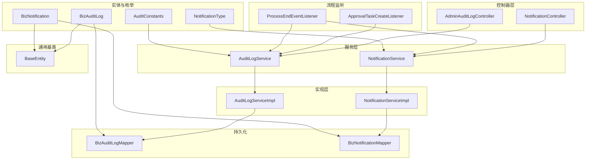
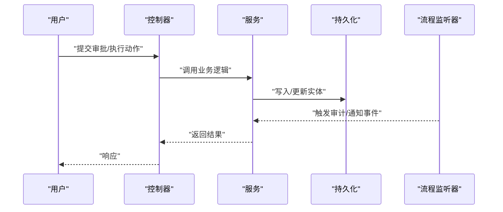
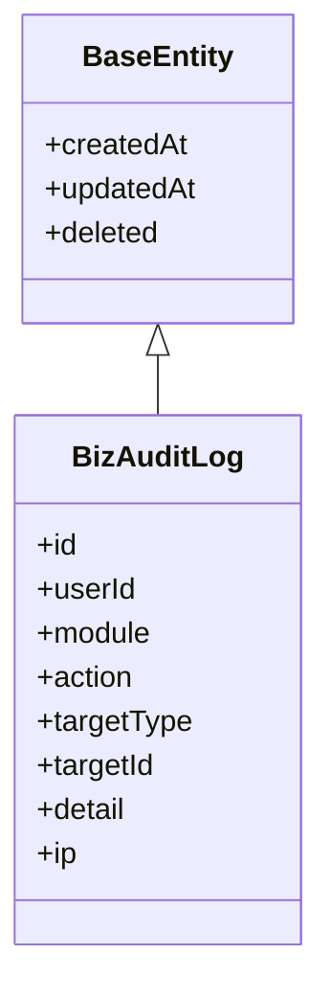
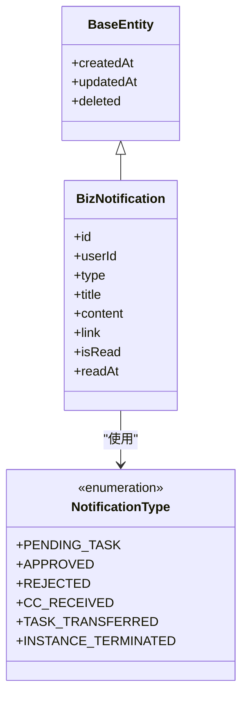
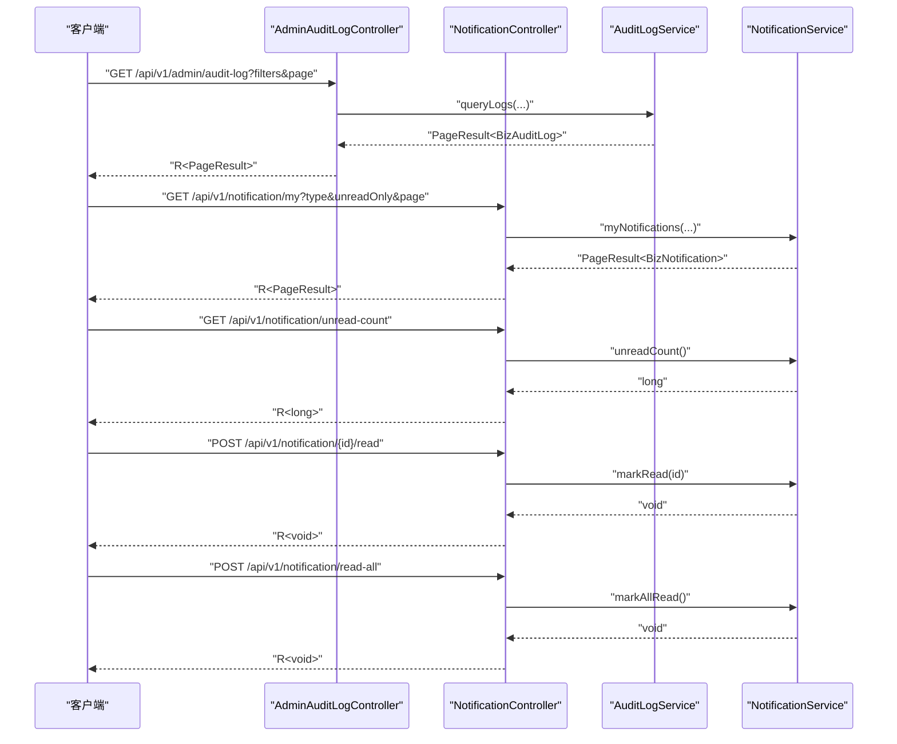
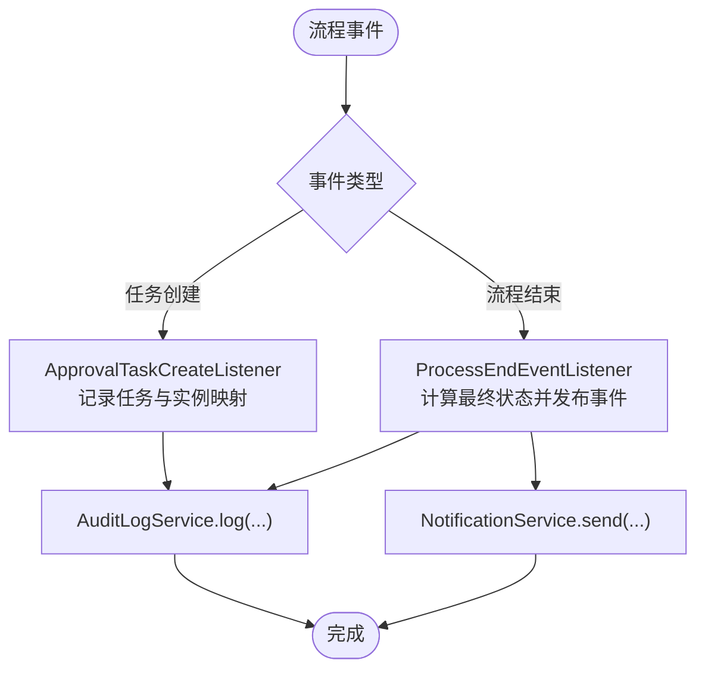
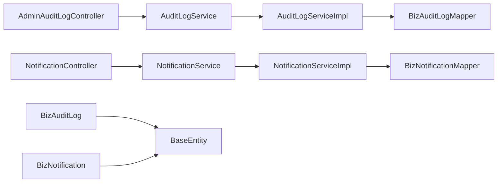

# 审批审计与通知

<cite>
**本文引用的文件**
- [BizAuditLog.java](file://oa-approval/src/main/java/com/oa/admin/approval/entity/BizAuditLog.java)
- [BizNotification.java](file://oa-approval/src/main/java/com/oa/admin/approval/entity/BizNotification.java)
- [AdminAuditLogController.java](file://oa-approval/src/main/java/com/oa/admin/approval/controller/AdminAuditLogController.java)
- [NotificationController.java](file://oa-approval/src/main/java/com/oa/admin/approval/controller/NotificationController.java)
- [AuditLogService.java](file://oa-approval/src/main/java/com/oa/admin/approval/service/AuditLogService.java)
- [NotificationService.java](file://oa-approval/src/main/java/com/oa/admin/approval/service/NotificationService.java)
- [AuditLogServiceImpl.java](file://oa-approval/src/main/java/com/oa/admin/approval/service/impl/AuditLogServiceImpl.java)
- [NotificationServiceImpl.java](file://oa-approval/src/main/java/com/oa/admin/approval/service/impl/NotificationServiceImpl.java)
- [AuditConstants.java](file://oa-approval/src/main/java/com/oa/admin/approval/constant/AuditConstants.java)
- [NotificationType.java](file://oa-approval/src/main/java/com/oa/admin/approval/enums/NotificationType.java)
- [BizAuditLogMapper.java](file://oa-approval/src/main/java/com/oa/admin/approval/mapper/BizAuditLogMapper.java)
- [BizNotificationMapper.java](file://oa-approval/src/main/java/com/oa/admin/approval/mapper/BizNotificationMapper.java)
- [BaseEntity.java](file://oa-common/src/main/java/com/oa/admin/common/entity/BaseEntity.java)
- [ApprovalTaskCreateListener.java](file://oa-approval/src/main/java/com/oa/admin/approval/listener/ApprovalTaskCreateListener.java)
- [ProcessEndEventListener.java](file://oa-approval/src/main/java/com/oa/admin/approval/listener/ProcessEndEventListener.java)
</cite>

## 目录
1. [简介](#简介)
2. [项目结构](#项目结构)
3. [核心组件](#核心组件)
4. [架构总览](#架构总览)
5. [详细组件分析](#详细组件分析)
6. [依赖分析](#依赖分析)
7. [性能考虑](#性能考虑)
8. [故障排查指南](#故障排查指南)
9. [结论](#结论)
10. [附录](#附录)

## 简介
本文件面向审批审计与通知功能，系统性阐述审计日志与通知两大模块的设计与实现，覆盖数据模型、事件捕获机制、存储策略、API 接口、与审批流程的集成方式、合规性与时效性最佳实践，以及通知模板配置与自定义通知开发指南。目标是帮助技术与非技术读者全面理解系统如何在关键操作上留痕、如何及时触达相关人员，并确保可追溯、可治理。

## 项目结构
审批与通知能力主要位于 oa-approval 模块，采用分层架构：控制器层负责对外 API；服务层封装业务逻辑；实现层对接持久化；监听器与事件在审批流程中触发审计与通知；通用基类 BaseEntity 提供统一的时间戳与软删除字段。

图表来源
- [AdminAuditLogController.java:1-35](file://oa-approval/src/main/java/com/oa/admin/approval/controller/AdminAuditLogController.java#L1-L35)
- [NotificationController.java:1-47](file://oa-approval/src/main/java/com/oa/admin/approval/controller/NotificationController.java#L1-L47)
- [AuditLogService.java:1-17](file://oa-approval/src/main/java/com/oa/admin/approval/service/AuditLogService.java#L1-L17)
- [NotificationService.java:1-24](file://oa-approval/src/main/java/com/oa/admin/approval/service/NotificationService.java#L1-L24)
- [AuditLogServiceImpl.java:1-67](file://oa-approval/src/main/java/com/oa/admin/approval/service/impl/AuditLogServiceImpl.java#L1-L67)
- [NotificationServiceImpl.java:1-94](file://oa-approval/src/main/java/com/oa/admin/approval/service/impl/NotificationServiceImpl.java#L1-L94)
- [BizAuditLogMapper.java:1-13](file://oa-approval/src/main/java/com/oa/admin/approval/mapper/BizAuditLogMapper.java#L1-L13)
- [BizNotificationMapper.java:1-13](file://oa-approval/src/main/java/com/oa/admin/approval/mapper/BizNotificationMapper.java#L1-L13)
- [BizAuditLog.java:1-28](file://oa-approval/src/main/java/com/oa/admin/approval/entity/BizAuditLog.java#L1-L28)
- [BizNotification.java:1-32](file://oa-approval/src/main/java/com/oa/admin/approval/entity/BizNotification.java#L1-L32)
- [BaseEntity.java:1-26](file://oa-common/src/main/java/com/oa/admin/common/entity/BaseEntity.java#L1-L26)
- [ApprovalTaskCreateListener.java:1-89](file://oa-approval/src/main/java/com/oa/admin/approval/listener/ApprovalTaskCreateListener.java#L1-L89)
- [ProcessEndEventListener.java:1-95](file://oa-approval/src/main/java/com/oa/admin/approval/listener/ProcessEndEventListener.java#L1-L95)

章节来源
- [AdminAuditLogController.java:1-35](file://oa-approval/src/main/java/com/oa/admin/approval/controller/AdminAuditLogController.java#L1-L35)
- [NotificationController.java:1-47](file://oa-approval/src/main/java/com/oa/admin/approval/controller/NotificationController.java#L1-L47)
- [AuditLogService.java:1-17](file://oa-approval/src/main/java/com/oa/admin/approval/service/AuditLogService.java#L1-L17)
- [NotificationService.java:1-24](file://oa-approval/src/main/java/com/oa/admin/approval/service/NotificationService.java#L1-L24)
- [AuditLogServiceImpl.java:1-67](file://oa-approval/src/main/java/com/oa/admin/approval/service/impl/AuditLogServiceImpl.java#L1-L67)
- [NotificationServiceImpl.java:1-94](file://oa-approval/src/main/java/com/oa/admin/approval/service/impl/NotificationServiceImpl.java#L1-L94)
- [BizAuditLog.java:1-28](file://oa-approval/src/main/java/com/oa/admin/approval/entity/BizAuditLog.java#L1-L28)
- [BizNotification.java:1-32](file://oa-approval/src/main/java/com/oa/admin/approval/entity/BizNotification.java#L1-L32)
- [BaseEntity.java:1-26](file://oa-common/src/main/java/com/oa/admin/common/entity/BaseEntity.java#L1-L26)
- [ApprovalTaskCreateListener.java:1-89](file://oa-approval/src/main/java/com/oa/admin/approval/listener/ApprovalTaskCreateListener.java#L1-L89)
- [ProcessEndEventListener.java:1-95](file://oa-approval/src/main/java/com/oa/admin/approval/listener/ProcessEndEventListener.java#L1-L95)

## 核心组件
- 审计日志实体 BizAuditLog：记录用户、模块、动作、目标类型与ID、详情、IP 等信息，继承 BaseEntity 自动填充时间戳与软删除。
- 通知实体 BizNotification：记录用户、类型、标题、内容、链接、已读状态与阅读时间等，继承 BaseEntity。
- 审计服务 AuditLogService：提供审计日志写入与查询能力。
- 通知服务 NotificationService：提供单人/批量发送、我的通知查询、未读统计、标记已读等能力。
- 控制器 AdminAuditLogController 与 NotificationController：分别暴露审计查询与通知管理接口。
- 流程监听器：在任务创建与流程结束时触发审计与通知。

章节来源
- [BizAuditLog.java:1-28](file://oa-approval/src/main/java/com/oa/admin/approval/entity/BizAuditLog.java#L1-L28)
- [BizNotification.java:1-32](file://oa-approval/src/main/java/com/oa/admin/approval/entity/BizNotification.java#L1-L32)
- [AuditLogService.java:1-17](file://oa-approval/src/main/java/com/oa/admin/approval/service/AuditLogService.java#L1-L17)
- [NotificationService.java:1-24](file://oa-approval/src/main/java/com/oa/admin/approval/service/NotificationService.java#L1-L24)
- [AdminAuditLogController.java:1-35](file://oa-approval/src/main/java/com/oa/admin/approval/controller/AdminAuditLogController.java#L1-L35)
- [NotificationController.java:1-47](file://oa-approval/src/main/java/com/oa/admin/approval/controller/NotificationController.java#L1-L47)

## 架构总览
审批流程通过 Flowable 引擎驱动，监听器在关键节点触发审计与通知。审计日志用于合规与审计追踪，通知用于实时提醒与闭环确认。

图表来源
- [AdminAuditLogController.java:1-35](file://oa-approval/src/main/java/com/oa/admin/approval/controller/AdminAuditLogController.java#L1-L35)
- [NotificationController.java:1-47](file://oa-approval/src/main/java/com/oa/admin/approval/controller/NotificationController.java#L1-L47)
- [AuditLogServiceImpl.java:1-67](file://oa-approval/src/main/java/com/oa/admin/approval/service/impl/AuditLogServiceImpl.java#L1-L67)
- [NotificationServiceImpl.java:1-94](file://oa-approval/src/main/java/com/oa/admin/approval/service/impl/NotificationServiceImpl.java#L1-L94)
- [ApprovalTaskCreateListener.java:1-89](file://oa-approval/src/main/java/com/oa/admin/approval/listener/ApprovalTaskCreateListener.java#L1-L89)
- [ProcessEndEventListener.java:1-95](file://oa-approval/src/main/java/com/oa/admin/approval/listener/ProcessEndEventListener.java#L1-L95)

## 详细组件分析

### 审计日志系统
- 数据模型
  - BizAuditLog 继承 BaseEntity，自动记录创建与更新时间，支持软删除。
  - 关键字段：用户ID、模块、动作、目标类型、目标ID、详情、IP。
- 事件捕获机制
  - 在审批流程的关键节点（如任务创建、流程结束）由监听器触发审计写入。
  - 常见动作包括提交、审批、拒绝、撤回、转办、管理员终止/重分配等。
- 存储策略
  - 使用 MyBatis-Plus Mapper 持久化，分页查询支持按模块、动作、目标、用户、时间范围过滤。
  - 查询按创建时间倒序，保证最新记录优先展示。
- 合规性要点
  - 记录 IP 与时间戳，便于审计取证。
  - 与审批实例/任务关联，形成完整证据链。

图表来源
- [BizAuditLog.java:1-28](file://oa-approval/src/main/java/com/oa/admin/approval/entity/BizAuditLog.java#L1-L28)
- [BaseEntity.java:1-26](file://oa-common/src/main/java/com/oa/admin/common/entity/BaseEntity.java#L1-L26)

章节来源
- [BizAuditLog.java:1-28](file://oa-approval/src/main/java/com/oa/admin/approval/entity/BizAuditLog.java#L1-L28)
- [AuditLogService.java:1-17](file://oa-approval/src/main/java/com/oa/admin/approval/service/AuditLogService.java#L1-L17)
- [AuditLogServiceImpl.java:1-67](file://oa-approval/src/main/java/com/oa/admin/approval/service/impl/AuditLogServiceImpl.java#L1-L67)
- [BizAuditLogMapper.java:1-13](file://oa-approval/src/main/java/com/oa/admin/approval/mapper/BizAuditLogMapper.java#L1-L13)
- [AuditConstants.java:1-20](file://oa-approval/src/main/java/com/oa/admin/approval/constant/AuditConstants.java#L1-L20)

### 通知系统
- 数据模型
  - BizNotification 继承 BaseEntity，包含用户ID、类型、标题、内容、链接、已读标志与阅读时间。
- 通知类型
  - pending_task、approved、rejected、cc_received、task_transferred、instance_terminated。
- 发送机制
  - 支持单人发送与批量发送。
  - 提供“我的通知”分页查询、未读统计、单条/全部标记已读。
- 时效性与体验
  - 未读数与分页查询提升信息密度与检索效率。
  - 链接字段便于直达详情，减少二次跳转成本。

图表来源
- [BizNotification.java:1-32](file://oa-approval/src/main/java/com/oa/admin/approval/entity/BizNotification.java#L1-L32)
- [NotificationType.java:1-21](file://oa-approval/src/main/java/com/oa/admin/approval/enums/NotificationType.java#L1-L21)
- [BaseEntity.java:1-26](file://oa-common/src/main/java/com/oa/admin/common/entity/BaseEntity.java#L1-L26)

章节来源
- [BizNotification.java:1-32](file://oa-approval/src/main/java/com/oa/admin/approval/entity/BizNotification.java#L1-L32)
- [NotificationService.java:1-24](file://oa-approval/src/main/java/com/oa/admin/approval/service/NotificationService.java#L1-L24)
- [NotificationServiceImpl.java:1-94](file://oa-approval/src/main/java/com/oa/admin/approval/service/impl/NotificationServiceImpl.java#L1-L94)
- [BizNotificationMapper.java:1-13](file://oa-approval/src/main/java/com/oa/admin/approval/mapper/BizNotificationMapper.java#L1-L13)
- [NotificationType.java:1-21](file://oa-approval/src/main/java/com/oa/admin/approval/enums/NotificationType.java#L1-L21)

### 控制器 API 实现
- AdminAuditLogController
  - 路径：/api/v1/admin/audit-log
  - 功能：按模块、动作、目标类型、目标ID、用户、起止时间进行分页查询。
  - 权限：需要 admin:audit:list。
- NotificationController
  - 路径：/api/v1/notification
  - 功能：我的通知列表、未读数量、标记已读、一键已读。
  - 登录态：需要登录。

图表来源
- [AdminAuditLogController.java:1-35](file://oa-approval/src/main/java/com/oa/admin/approval/controller/AdminAuditLogController.java#L1-L35)
- [NotificationController.java:1-47](file://oa-approval/src/main/java/com/oa/admin/approval/controller/NotificationController.java#L1-L47)
- [AuditLogService.java:1-17](file://oa-approval/src/main/java/com/oa/admin/approval/service/AuditLogService.java#L1-L17)
- [NotificationService.java:1-24](file://oa-approval/src/main/java/com/oa/admin/approval/service/NotificationService.java#L1-L24)

章节来源
- [AdminAuditLogController.java:1-35](file://oa-approval/src/main/java/com/oa/admin/approval/controller/AdminAuditLogController.java#L1-L35)
- [NotificationController.java:1-47](file://oa-approval/src/main/java/com/oa/admin/approval/controller/NotificationController.java#L1-L47)

### 审计与审批流程集成
- 任务创建监听：当 Flowable 创建任务时，记录任务与业务实例的映射，并可触发审计写入。
- 流程结束监听：根据任务结果确定最终实例状态（批准/拒绝），并发布完成事件，用于后续通知或审计。

图表来源
- [ApprovalTaskCreateListener.java:1-89](file://oa-approval/src/main/java/com/oa/admin/approval/listener/ApprovalTaskCreateListener.java#L1-L89)
- [ProcessEndEventListener.java:1-95](file://oa-approval/src/main/java/com/oa/admin/approval/listener/ProcessEndEventListener.java#L1-L95)
- [AuditLogService.java:1-17](file://oa-approval/src/main/java/com/oa/admin/approval/service/AuditLogService.java#L1-L17)
- [NotificationService.java:1-24](file://oa-approval/src/main/java/com/oa/admin/approval/service/NotificationService.java#L1-L24)

章节来源
- [ApprovalTaskCreateListener.java:1-89](file://oa-approval/src/main/java/com/oa/admin/approval/listener/ApprovalTaskCreateListener.java#L1-L89)
- [ProcessEndEventListener.java:1-95](file://oa-approval/src/main/java/com/oa/admin/approval/listener/ProcessEndEventListener.java#L1-L95)

## 依赖分析
- 控制器依赖服务接口，服务实现依赖 Mapper 与通用基类。
- 审计与通知均依赖 BaseEntity 的时间戳与软删除字段。
- 流程监听器通过服务接口写入审计与发送通知，形成跨模块协作。

图表来源
- [AdminAuditLogController.java:1-35](file://oa-approval/src/main/java/com/oa/admin/approval/controller/AdminAuditLogController.java#L1-L35)
- [NotificationController.java:1-47](file://oa-approval/src/main/java/com/oa/admin/approval/controller/NotificationController.java#L1-L47)
- [AuditLogService.java:1-17](file://oa-approval/src/main/java/com/oa/admin/approval/service/AuditLogService.java#L1-L17)
- [NotificationService.java:1-24](file://oa-approval/src/main/java/com/oa/admin/approval/service/NotificationService.java#L1-L24)
- [AuditLogServiceImpl.java:1-67](file://oa-approval/src/main/java/com/oa/admin/approval/service/impl/AuditLogServiceImpl.java#L1-L67)
- [NotificationServiceImpl.java:1-94](file://oa-approval/src/main/java/com/oa/admin/approval/service/impl/NotificationServiceImpl.java#L1-L94)
- [BizAuditLogMapper.java:1-13](file://oa-approval/src/main/java/com/oa/admin/approval/mapper/BizAuditLogMapper.java#L1-L13)
- [BizNotificationMapper.java:1-13](file://oa-approval/src/main/java/com/oa/admin/approval/mapper/BizNotificationMapper.java#L1-L13)
- [BizAuditLog.java:1-28](file://oa-approval/src/main/java/com/oa/admin/approval/entity/BizAuditLog.java#L1-L28)
- [BizNotification.java:1-32](file://oa-approval/src/main/java/com/oa/admin/approval/entity/BizNotification.java#L1-L32)
- [BaseEntity.java:1-26](file://oa-common/src/main/java/com/oa/admin/common/entity/BaseEntity.java#L1-L26)

章节来源
- [BizAuditLog.java:1-28](file://oa-approval/src/main/java/com/oa/admin/approval/entity/BizAuditLog.java#L1-L28)
- [BizNotification.java:1-32](file://oa-approval/src/main/java/com/oa/admin/approval/entity/BizNotification.java#L1-L32)
- [BaseEntity.java:1-26](file://oa-common/src/main/java/com/oa/admin/common/entity/BaseEntity.java#L1-L26)

## 性能考虑
- 分页查询：审计与通知查询均支持分页，建议前端传入合理页码与页大小，避免一次性加载过多数据。
- 过滤条件：尽量使用模块、动作、目标类型、用户、时间范围等条件缩小结果集，提高查询效率。
- 批量发送：通知支持批量发送，减少多次请求开销。
- 未读统计：提供未读计数接口，便于前端快速展示，降低重复查询成本。
- 日志清理：建议结合业务制定审计日志保留策略，定期归档或清理，避免表膨胀。

## 故障排查指南
- 审计日志为空
  - 检查监听器是否正确注册与触发。
  - 确认调用 AuditLogService.log 的上下文是否包含有效用户ID。
- 通知未送达
  - 检查用户ID格式是否为数值型。
  - 确认通知类型是否在枚举范围内。
  - 查看批量发送循环是否正常执行。
- 已读状态异常
  - 标记已读接口会设置阅读时间，检查更新条件与事务一致性。
  - 全部已读接口应仅更新当前用户的未读通知。
- 权限问题
  - 审计查询需要 admin:audit:list 权限。
  - 通知接口需登录态。

章节来源
- [AuditLogServiceImpl.java:1-67](file://oa-approval/src/main/java/com/oa/admin/approval/service/impl/AuditLogServiceImpl.java#L1-L67)
- [NotificationServiceImpl.java:1-94](file://oa-approval/src/main/java/com/oa/admin/approval/service/impl/NotificationServiceImpl.java#L1-L94)
- [AdminAuditLogController.java:1-35](file://oa-approval/src/main/java/com/oa/admin/approval/controller/AdminAuditLogController.java#L1-L35)
- [NotificationController.java:1-47](file://oa-approval/src/main/java/com/oa/admin/approval/controller/NotificationController.java#L1-L47)

## 结论
该系统以清晰的分层架构实现了审批审计与通知能力：审计日志覆盖关键动作与目标，通知体系支持多类型与高时效性，控制器 API 明确且权限控制到位。通过流程监听器将审计与通知嵌入审批生命周期，既满足合规要求，又提升了用户体验与流程透明度。建议在生产环境中配合合理的日志保留策略与监控告警，持续优化查询与发送性能。

## 附录

### 审计动作与目标定义
- 模块：approval
- 动作：submit、approve、reject、withdraw、transfer、admin_terminate、admin_reassign
- 目标：instance、task

章节来源
- [AuditConstants.java:1-20](file://oa-approval/src/main/java/com/oa/admin/approval/constant/AuditConstants.java#L1-L20)

### 通知类型与含义
- pending_task：待处理任务提醒
- approved：审批通过
- rejected：审批拒绝
- cc_received：抄送接收
- task_transferred：任务转办
- instance_terminated：实例终止

章节来源
- [NotificationType.java:1-21](file://oa-approval/src/main/java/com/oa/admin/approval/enums/NotificationType.java#L1-L21)

### 通知模板配置与自定义开发指南
- 模板配置
  - 标题与内容建议采用参数化模板，便于复用与国际化。
  - 链接字段指向前端路由或外部系统地址，确保可直达详情。
- 自定义通知
  - 新增通知类型枚举值并在服务层扩展发送逻辑。
  - 如需异步发送或队列化，可在现有 send/sendBatch 基础上引入消息中间件。
  - 对于高频场景，建议增加去重与限流策略，避免刷屏。

[本节为通用指导，无需特定文件引用]