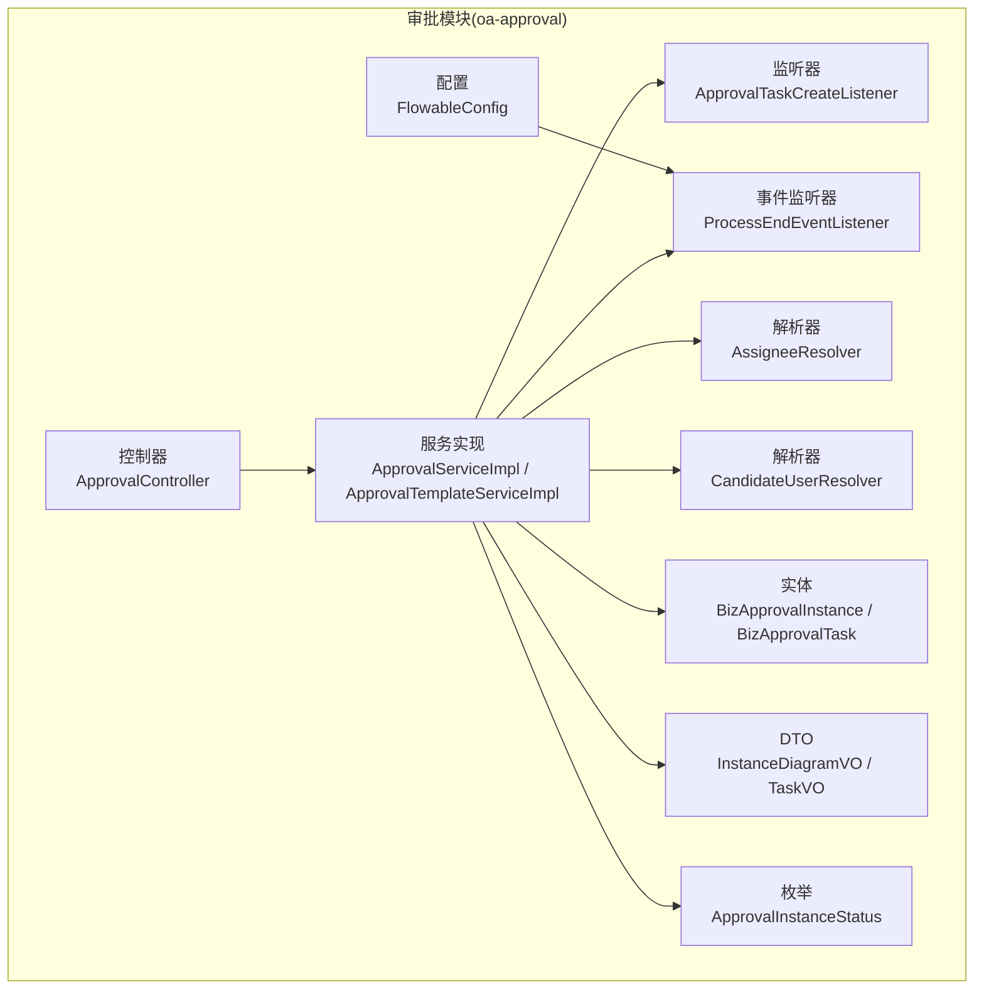
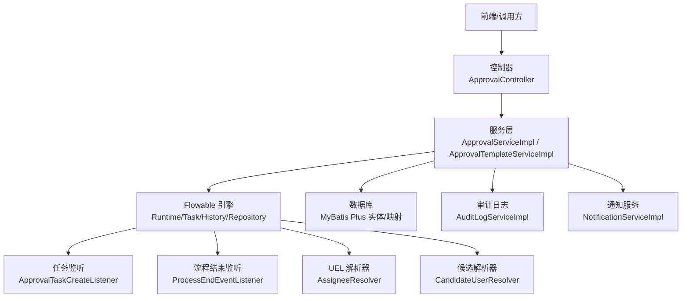
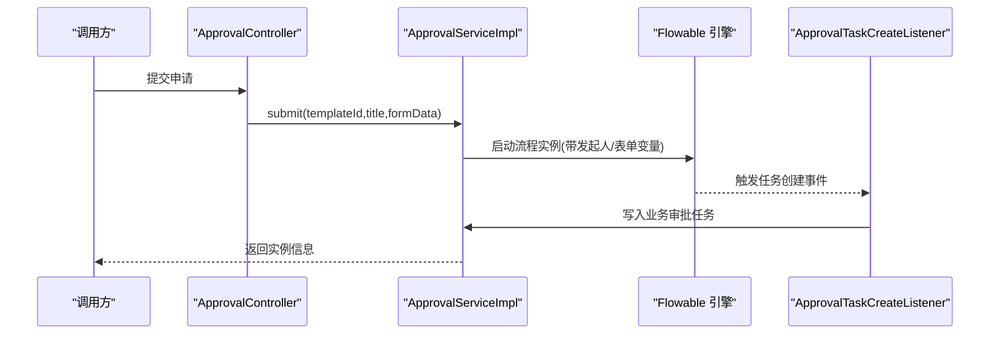
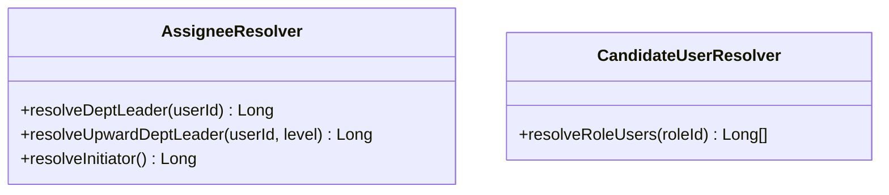
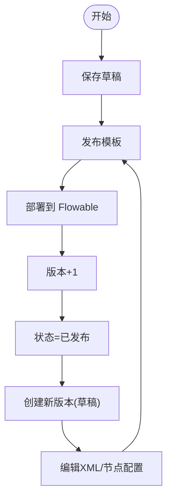
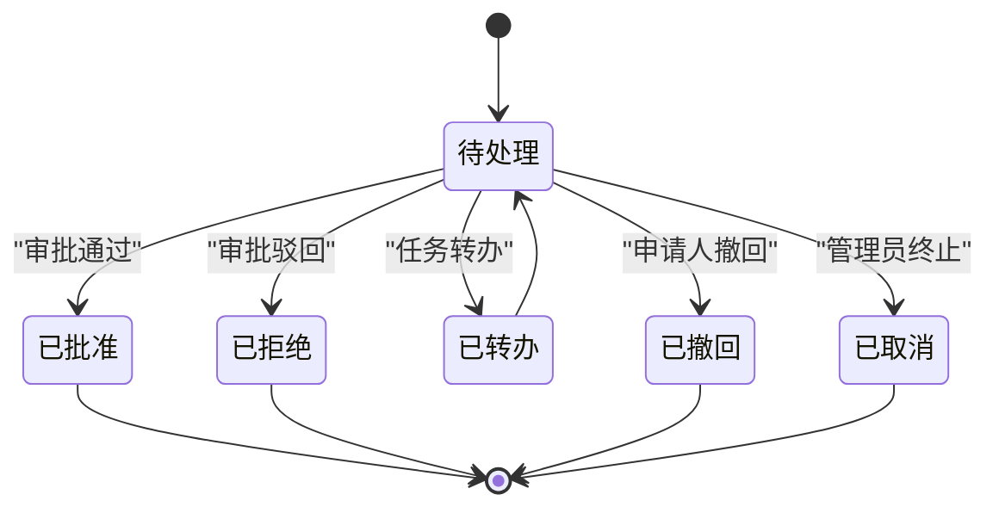
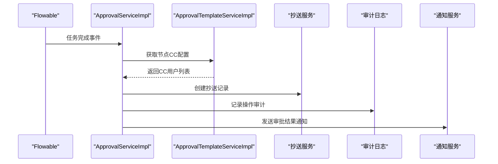
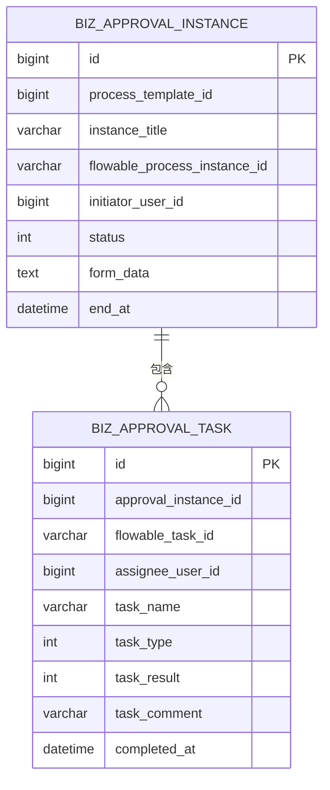
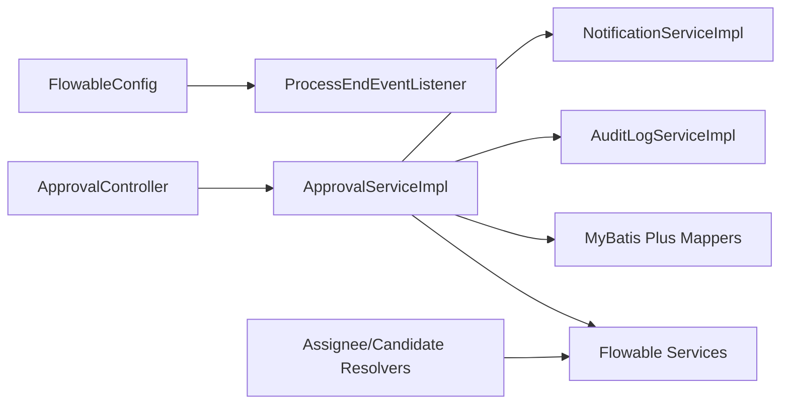

# 审批模块 (oa-approval)

<cite>
**本文引用的文件**
- [FlowableConfig.java](file://oa-approval/src/main/java/com/oa/admin/approval/config/FlowableConfig.java)
- [ApprovalTaskCreateListener.java](file://oa-approval/src/main/java/com/oa/admin/approval/listener/ApprovalTaskCreateListener.java)
- [ProcessEndEventListener.java](file://oa-approval/src/main/java/com/oa/admin/approval/listener/ProcessEndEventListener.java)
- [AssigneeResolver.java](file://oa-approval/src/main/java/com/oa/admin/approval/resolver/AssigneeResolver.java)
- [CandidateUserResolver.java](file://oa-approval/src/main/java/com/oa/admin/approval/resolver/CandidateUserResolver.java)
- [ApprovalServiceImpl.java](file://oa-approval/src/main/java/com/oa/admin/approval/service/impl/ApprovalServiceImpl.java)
- [ApprovalTemplateServiceImpl.java](file://oa-approval/src/main/java/com/oa/admin/approval/service/impl/ApprovalTemplateServiceImpl.java)
- [AuditLogServiceImpl.java](file://oa-approval/src/main/java/com/oa/admin/approval/service/impl/AuditLogServiceImpl.java)
- [NotificationServiceImpl.java](file://oa-approval/src/main/java/com/oa/admin/approval/service/impl/NotificationServiceImpl.java)
- [ApprovalController.java](file://oa-approval/src/main/java/com/oa/admin/approval/controller/ApprovalController.java)
- [BizApprovalInstance.java](file://oa-approval/src/main/java/com/oa/admin/approval/entity/BizApprovalInstance.java)
- [BizApprovalTask.java](file://oa-approval/src/main/java/com/oa/admin/approval/entity/BizApprovalTask.java)
- [ApprovalInstanceStatus.java](file://oa-approval/src/main/java/com/oa/admin/approval/enums/ApprovalInstanceStatus.java)
- [InstanceDiagramVO.java](file://oa-approval/src/main/java/com/oa/admin/approval/dto/InstanceDiagramVO.java)
- [TaskVO.java](file://oa-approval/src/main/java/com/oa/admin/approval/dto/TaskVO.java)
</cite>

## 目录
1. [简介](#简介)
2. [项目结构](#项目结构)
3. [核心组件](#核心组件)
4. [架构总览](#架构总览)
5. [详细组件分析](#详细组件分析)
6. [依赖分析](#依赖分析)
7. [性能考虑](#性能考虑)
8. [故障排查指南](#故障排查指南)
9. [结论](#结论)
10. [附录：API 接口文档](#附录api-接口文档)

## 简介
本文件为 oa-approval 审批模块的深入架构文档，围绕 Flowable 工作流引擎的集成与扩展，系统阐述审批模板设计、监听器与候选人解析器实现、审批任务生命周期管理、抄送与审计日志、以及与业务模块的回调集成。文档同时提供 API 接口清单与使用示例，帮助开发者快速理解与扩展。

## 项目结构
审批模块位于 oa-approval 子工程中，采用分层架构：控制器层（Controller）、服务层（Service）、持久层（Mapper/Entity）、配置与监听器（Config/Listener）、解析器（Resolver）与 DTO/枚举等。Flowable 引擎通过 Spring Boot Starter 集成，结合自定义监听器与解析器实现业务闭环。

图表来源
- [ApprovalController.java:1-252](file://oa-approval/src/main/java/com/oa/admin/approval/controller/ApprovalController.java#L1-L252)
- [ApprovalServiceImpl.java:1-792](file://oa-approval/src/main/java/com/oa/admin/approval/service/impl/ApprovalServiceImpl.java#L1-L792)
- [ApprovalTemplateServiceImpl.java:1-163](file://oa-approval/src/main/java/com/oa/admin/approval/service/impl/ApprovalTemplateServiceImpl.java#L1-L163)
- [ApprovalTaskCreateListener.java:1-89](file://oa-approval/src/main/java/com/oa/admin/approval/listener/ApprovalTaskCreateListener.java#L1-L89)
- [ProcessEndEventListener.java:1-80](file://oa-approval/src/main/java/com/oa/admin/approval/listener/ProcessEndEventListener.java#L1-L80)
- [AssigneeResolver.java:1-62](file://oa-approval/src/main/java/com/oa/admin/approval/resolver/AssigneeResolver.java#L1-L62)
- [CandidateUserResolver.java:1-31](file://oa-approval/src/main/java/com/oa/admin/approval/resolver/CandidateUserResolver.java#L1-L31)
- [FlowableConfig.java:1-31](file://oa-approval/src/main/java/com/oa/admin/approval/config/FlowableConfig.java#L1-L31)
- [BizApprovalInstance.java:1-33](file://oa-approval/src/main/java/com/oa/admin/approval/entity/BizApprovalInstance.java#L1-L33)
- [BizApprovalTask.java:1-35](file://oa-approval/src/main/java/com/oa/admin/approval/entity/BizApprovalTask.java#L1-L35)
- [InstanceDiagramVO.java:1-22](file://oa-approval/src/main/java/com/oa/admin/approval/dto/InstanceDiagramVO.java#L1-L22)
- [TaskVO.java:1-34](file://oa-approval/src/main/java/com/oa/admin/approval/dto/TaskVO.java#L1-L34)
- [ApprovalInstanceStatus.java:1-29](file://oa-approval/src/main/java/com/oa/admin/approval/enums/ApprovalInstanceStatus.java#L1-L29)

章节来源
- [ApprovalController.java:1-252](file://oa-approval/src/main/java/com/oa/admin/approval/controller/ApprovalController.java#L1-L252)
- [ApprovalServiceImpl.java:1-792](file://oa-approval/src/main/java/com/oa/admin/approval/service/impl/ApprovalServiceImpl.java#L1-L792)
- [ApprovalTemplateServiceImpl.java:1-163](file://oa-approval/src/main/java/com/oa/admin/approval/service/impl/ApprovalTemplateServiceImpl.java#L1-L163)

## 核心组件
- Flowable 引擎配置与事件监听：通过配置类注册事件监听器，确保流程结束时自动计算实例状态并发布业务事件。
- 任务创建监听：在 Flowable 任务创建时同步生成业务审批任务记录，支持普通、会签、或签类型识别。
- 动态候选人解析：通过 UEL 表达式解析部门领导、逐级上行领导、角色用户集合等动态候选者。
- 审批服务：提交、审批、转办、撤回、终止、查询待办/已办、仪表盘统计、流程图渲染等。
- 模板服务：模板草稿/发布/版本管理、节点配置保存与读取、BPMN 部署。
- 审计与通知：统一审计日志与站内通知能力，贯穿审批全链路。
- 控制器：提供审批、模板、抄送、仪表盘等 API。

章节来源
- [FlowableConfig.java:1-31](file://oa-approval/src/main/java/com/oa/admin/approval/config/FlowableConfig.java#L1-L31)
- [ApprovalTaskCreateListener.java:1-89](file://oa-approval/src/main/java/com/oa/admin/approval/listener/ApprovalTaskCreateListener.java#L1-L89)
- [ProcessEndEventListener.java:1-80](file://oa-approval/src/main/java/com/oa/admin/approval/listener/ProcessEndEventListener.java#L1-L80)
- [AssigneeResolver.java:1-62](file://oa-approval/src/main/java/com/oa/admin/approval/resolver/AssigneeResolver.java#L1-L62)
- [CandidateUserResolver.java:1-31](file://oa-approval/src/main/java/com/oa/admin/approval/resolver/CandidateUserResolver.java#L1-L31)
- [ApprovalServiceImpl.java:1-792](file://oa-approval/src/main/java/com/oa/admin/approval/service/impl/ApprovalServiceImpl.java#L1-L792)
- [ApprovalTemplateServiceImpl.java:1-163](file://oa-approval/src/main/java/com/oa/admin/approval/service/impl/ApprovalTemplateServiceImpl.java#L1-L163)
- [AuditLogServiceImpl.java:1-67](file://oa-approval/src/main/java/com/oa/admin/approval/service/impl/AuditLogServiceImpl.java#L1-L67)
- [NotificationServiceImpl.java:1-94](file://oa-approval/src/main/java/com/oa/admin/approval/service/impl/NotificationServiceImpl.java#L1-L94)

## 架构总览
审批模块以 Flowable 为核心，结合 Spring 管理的服务层与数据库持久化，形成“模板-实例-任务-抄送-审计”的闭环。Flowable 负责流程执行与事件驱动，业务服务负责状态管理、权限校验、通知与审计。

图表来源
- [ApprovalController.java:1-252](file://oa-approval/src/main/java/com/oa/admin/approval/controller/ApprovalController.java#L1-L252)
- [ApprovalServiceImpl.java:1-792](file://oa-approval/src/main/java/com/oa/admin/approval/service/impl/ApprovalServiceImpl.java#L1-L792)
- [ApprovalTemplateServiceImpl.java:1-163](file://oa-approval/src/main/java/com/oa/admin/approval/service/impl/ApprovalTemplateServiceImpl.java#L1-L163)
- [FlowableConfig.java:1-31](file://oa-approval/src/main/java/com/oa/admin/approval/config/FlowableConfig.java#L1-L31)
- [ApprovalTaskCreateListener.java:1-89](file://oa-approval/src/main/java/com/oa/admin/approval/listener/ApprovalTaskCreateListener.java#L1-L89)
- [ProcessEndEventListener.java:1-80](file://oa-approval/src/main/java/com/oa/admin/approval/listener/ProcessEndEventListener.java#L1-L80)
- [AssigneeResolver.java:1-62](file://oa-approval/src/main/java/com/oa/admin/approval/resolver/AssigneeResolver.java#L1-L62)
- [CandidateUserResolver.java:1-31](file://oa-approval/src/main/java/com/oa/admin/approval/resolver/CandidateUserResolver.java#L1-L31)
- [AuditLogServiceImpl.java:1-67](file://oa-approval/src/main/java/com/oa/admin/approval/service/impl/AuditLogServiceImpl.java#L1-L67)
- [NotificationServiceImpl.java:1-94](file://oa-approval/src/main/java/com/oa/admin/approval/service/impl/NotificationServiceImpl.java#L1-L94)

## 详细组件分析

### Flowable 集成与监听器
- 引擎配置：通过实现 EngineConfigurationConfigurer 注册 ProcessEndEventListener，确保流程结束事件被捕获。
- 任务创建监听：在任务创建时，若存在有效处理人，则写入业务审批任务记录，并根据变量判断任务类型（普通/会签/或签）。
- 流程结束监听：根据所有子任务结果汇总确定实例最终状态（批准/拒绝），更新实例结束时间与状态，并发布业务完成事件。

图表来源
- [ApprovalController.java:37-44](file://oa-approval/src/main/java/com/oa/admin/approval/controller/ApprovalController.java#L37-L44)
- [ApprovalServiceImpl.java:122-168](file://oa-approval/src/main/java/com/oa/admin/approval/service/impl/ApprovalServiceImpl.java#L122-L168)
- [ApprovalTaskCreateListener.java:25-64](file://oa-approval/src/main/java/com/oa/admin/approval/listener/ApprovalTaskCreateListener.java#L25-L64)

章节来源
- [FlowableConfig.java:1-31](file://oa-approval/src/main/java/com/oa/admin/approval/config/FlowableConfig.java#L1-L31)
- [ApprovalTaskCreateListener.java:1-89](file://oa-approval/src/main/java/com/oa/admin/approval/listener/ApprovalTaskCreateListener.java#L1-L89)
- [ProcessEndEventListener.java:1-80](file://oa-approval/src/main/java/com/oa/admin/approval/listener/ProcessEndEventListener.java#L1-L80)

### 候选人解析器实现
- AssigneeResolver：支持解析部门领导、逐级上行领导、流程发起人等动态负责人，异常时抛出业务错误码。
- CandidateUserResolver：基于角色解析候选用户集合，供多实例（会签/或签）使用。

图表来源
- [AssigneeResolver.java:1-62](file://oa-approval/src/main/java/com/oa/admin/approval/resolver/AssigneeResolver.java#L1-L62)
- [CandidateUserResolver.java:1-31](file://oa-approval/src/main/java/com/oa/admin/approval/resolver/CandidateUserResolver.java#L1-L31)

章节来源
- [AssigneeResolver.java:1-62](file://oa-approval/src/main/java/com/oa/admin/approval/resolver/AssigneeResolver.java#L1-L62)
- [CandidateUserResolver.java:1-31](file://oa-approval/src/main/java/com/oa/admin/approval/resolver/CandidateUserResolver.java#L1-L31)

### 审批模板与流程节点
- 模板服务：支持草稿保存、发布（部署至 Flowable）、新版本创建、取消发布；节点配置可按顺序保存与读取。
- BPMN 部署：发布时将模板 XML 部署为流程定义，记录流程定义 ID 与版本号。

图表来源
- [ApprovalTemplateServiceImpl.java:42-81](file://oa-approval/src/main/java/com/oa/admin/approval/service/impl/ApprovalTemplateServiceImpl.java#L42-L81)
- [ApprovalTemplateServiceImpl.java:85-104](file://oa-approval/src/main/java/com/oa/admin/approval/service/impl/ApprovalTemplateServiceImpl.java#L85-L104)

章节来源
- [ApprovalTemplateServiceImpl.java:1-163](file://oa-approval/src/main/java/com/oa/admin/approval/service/impl/ApprovalTemplateServiceImpl.java#L1-L163)

### 审批任务生命周期
- 创建：任务创建监听器写入业务任务，区分普通/会签/或签。
- 处理：审批服务校验权限与状态后完成任务，写入结果与评论，触发后续 CC。
- 转办/重分配：支持用户间转办与管理员重分配。
- 终止/撤回：管理员可终止未完成实例，申请人仅可在特定条件下撤回。

图表来源
- [ApprovalServiceImpl.java:170-240](file://oa-approval/src/main/java/com/oa/admin/approval/service/impl/ApprovalServiceImpl.java#L170-L240)
- [ApprovalServiceImpl.java:556-602](file://oa-approval/src/main/java/com/oa/admin/approval/service/impl/ApprovalServiceImpl.java#L556-L602)
- [ApprovalServiceImpl.java:663-705](file://oa-approval/src/main/java/com/oa/admin/approval/service/impl/ApprovalServiceImpl.java#L663-L705)
- [ApprovalInstanceStatus.java:1-29](file://oa-approval/src/main/java/com/oa/admin/approval/enums/ApprovalInstanceStatus.java#L1-L29)

章节来源
- [ApprovalServiceImpl.java:1-792](file://oa-approval/src/main/java/com/oa/admin/approval/service/impl/ApprovalServiceImpl.java#L1-L792)
- [ApprovalInstanceStatus.java:1-29](file://oa-approval/src/main/java/com/oa/admin/approval/enums/ApprovalInstanceStatus.java#L1-L29)

### 抄送与审计日志
- 抄送触发：在审批节点完成后，依据模板节点配置读取 CC 用户列表并创建抄送记录。
- 审计日志：统一记录模块、动作、目标类型与详情，支持分页查询。
- 通知服务：支持单人/批量发送通知，并提供未读统计与标记已读。

图表来源
- [ApprovalServiceImpl.java:604-617](file://oa-approval/src/main/java/com/oa/admin/approval/service/impl/ApprovalServiceImpl.java#L604-L617)
- [AuditLogServiceImpl.java:22-32](file://oa-approval/src/main/java/com/oa/admin/approval/service/impl/AuditLogServiceImpl.java#L22-L32)
- [NotificationServiceImpl.java:27-37](file://oa-approval/src/main/java/com/oa/admin/approval/service/impl/NotificationServiceImpl.java#L27-L37)

章节来源
- [ApprovalServiceImpl.java:1-792](file://oa-approval/src/main/java/com/oa/admin/approval/service/impl/ApprovalServiceImpl.java#L1-L792)
- [AuditLogServiceImpl.java:1-67](file://oa-approval/src/main/java/com/oa/admin/approval/service/impl/AuditLogServiceImpl.java#L1-L67)
- [NotificationServiceImpl.java:1-94](file://oa-approval/src/main/java/com/oa/admin/approval/service/impl/NotificationServiceImpl.java#L1-L94)

### 数据模型

图表来源
- [BizApprovalInstance.java:1-33](file://oa-approval/src/main/java/com/oa/admin/approval/entity/BizApprovalInstance.java#L1-L33)
- [BizApprovalTask.java:1-35](file://oa-approval/src/main/java/com/oa/admin/approval/entity/BizApprovalTask.java#L1-L35)

章节来源
- [BizApprovalInstance.java:1-33](file://oa-approval/src/main/java/com/oa/admin/approval/entity/BizApprovalInstance.java#L1-L33)
- [BizApprovalTask.java:1-35](file://oa-approval/src/main/java/com/oa/admin/approval/entity/BizApprovalTask.java#L1-L35)

## 依赖分析
- 控制器依赖服务层；服务层依赖 Flowable 四大服务（Runtime/Task/History/Repository）与持久层。
- 监听器与解析器作为 Flowable 扩展点，注入到引擎配置与 BPMN UEL 表达式中。
- 审计与通知服务独立于审批流程，提供横切能力。

图表来源
- [ApprovalController.java:1-252](file://oa-approval/src/main/java/com/oa/admin/approval/controller/ApprovalController.java#L1-L252)
- [ApprovalServiceImpl.java:1-792](file://oa-approval/src/main/java/com/oa/admin/approval/service/impl/ApprovalServiceImpl.java#L1-L792)
- [FlowableConfig.java:1-31](file://oa-approval/src/main/java/com/oa/admin/approval/config/FlowableConfig.java#L1-L31)
- [ProcessEndEventListener.java:1-80](file://oa-approval/src/main/java/com/oa/admin/approval/listener/ProcessEndEventListener.java#L1-L80)
- [AssigneeResolver.java:1-62](file://oa-approval/src/main/java/com/oa/admin/approval/resolver/AssigneeResolver.java#L1-L62)
- [CandidateUserResolver.java:1-31](file://oa-approval/src/main/java/com/oa/admin/approval/resolver/CandidateUserResolver.java#L1-L31)
- [AuditLogServiceImpl.java:1-67](file://oa-approval/src/main/java/com/oa/admin/approval/service/impl/AuditLogServiceImpl.java#L1-L67)
- [NotificationServiceImpl.java:1-94](file://oa-approval/src/main/java/com/oa/admin/approval/service/impl/NotificationServiceImpl.java#L1-L94)

章节来源
- [ApprovalController.java:1-252](file://oa-approval/src/main/java/com/oa/admin/approval/controller/ApprovalController.java#L1-L252)
- [ApprovalServiceImpl.java:1-792](file://oa-approval/src/main/java/com/oa/admin/approval/service/impl/ApprovalServiceImpl.java#L1-L792)

## 性能考虑
- 任务查询分页：待办/已办分页接口避免一次性加载大量数据。
- 任务聚合统计：仪表盘统计通过聚合查询减少多次往返。
- BPMN 图渲染优化：仅在需要时拉取历史流程定义资源，必要时追加 DI 节点以保证可视化显示。
- 事务边界：提交、审批、转办、终止等关键路径使用事务保障一致性。

## 故障排查指南
- 参数校验：控制器对请求参数进行强校验，非法参数抛出业务错误。
- 权限控制：使用注解保护接口，防止越权访问。
- 日志审计：所有关键操作均记录审计日志，便于追踪。
- 通知核对：通知服务提供未读统计与批量标记已读，便于用户侧核对。

章节来源
- [ApprovalController.java:230-250](file://oa-approval/src/main/java/com/oa/admin/approval/controller/ApprovalController.java#L230-L250)
- [AuditLogServiceImpl.java:22-32](file://oa-approval/src/main/java/com/oa/admin/approval/service/impl/AuditLogServiceImpl.java#L22-L32)
- [NotificationServiceImpl.java:66-92](file://oa-approval/src/main/java/com/oa/admin/approval/service/impl/NotificationServiceImpl.java#L66-L92)

## 结论
本模块以 Flowable 为核心，结合动态解析器、事件监听与统一审计/通知能力，构建了可配置、可观测、可扩展的审批平台。模板与节点配置支持复杂业务场景，生命周期管理覆盖从创建到完成的全流程，适合在企业内部广泛复用与二次开发。

## 附录：API 接口文档

### 审批相关接口
- 提交申请
  - 方法与路径：POST /api/v1/approval/submit
  - 权限：approval:submit
  - 请求体字段：templateId(Long)、title(String)、formData(String)
  - 返回：实例信息
- 审批任务处理
  - 方法与路径：POST /api/v1/approval/task/{taskId}/approve
  - 权限：approval:approve
  - 路径参数：taskId(Long)
  - 请求体字段：result(Integer)、comment(String)
  - 返回：空
- 任务转办
  - 方法与路径：POST /api/v1/approval/task/{taskId}/transfer
  - 权限：approval:approve
  - 路径参数：taskId(Long)
  - 请求体字段：targetUserId(Long)、reason(String)
  - 返回：空
- 申请人撤回
  - 方法与路径：POST /api/v1/approval/{instanceId}/withdraw
  - 权限：approval:withdraw
  - 路径参数：instanceId(Long)
  - 返回：空
- 查询我的待办
  - 方法与路径：GET /api/v1/approval/my-todo
  - 权限：approval:todo
  - 返回：任务列表
- 分页查询我的待办
  - 方法与路径：GET /api/v1/approval/my-todo/paged
  - 权限：approval:todo
  - 查询参数：title(String)、page(Long，默认1)、pageSize(Long，默认10)
  - 返回：分页任务视图
- 查询我的已办
  - 方法与路径：GET /api/v1/approval/my-done
  - 权限：approval:done
  - 返回：任务列表
- 分页查询我的已办
  - 方法与路径：GET /api/v1/approval/my-done/paged
  - 权限：approval:done
  - 查询参数：title(String)、page(Long，默认1)、pageSize(Long，默认10)
  - 返回：分页任务视图
- 查询某实例的任务列表
  - 方法与路径：GET /api/v1/approval/instance/{instanceId}/tasks
  - 权限：approval:instance:view
  - 路径参数：instanceId(Long)
  - 返回：任务列表
- 查询我的申请记录
  - 方法与路径：GET /api/v1/approval/my-applications
  - 权限：approval:instance:view
  - 查询参数：title(String)、status(Integer)、page(Long，默认1)、pageSize(Long，默认10)
  - 返回：分页实例
- 查询实例详情
  - 方法与路径：GET /api/v1/approval/instance/{instanceId}
  - 权限：approval:instance:view
  - 路径参数：instanceId(Long)
  - 返回：实例详情
- 查询实例流程图
  - 方法与路径：GET /api/v1/approval/instance/{instanceId}/diagram
  - 权限：approval:instance:view
  - 路径参数：instanceId(Long)
  - 返回：包含 BPMN XML 与节点状态的视图对象
- 仪表盘统计
  - 方法与路径：GET /api/v1/approval/dashboard/stats
  - 权限：approval:dashboard
  - 返回：待办/已办数量、模板数、未读抄送数与近期活动

章节来源
- [ApprovalController.java:37-251](file://oa-approval/src/main/java/com/oa/admin/approval/controller/ApprovalController.java#L37-L251)

### 模板相关接口
- 列出模板
  - 方法与路径：GET /api/v1/approval/template
  - 权限：approval:template:list
  - 查询参数：templateName(String)、status(Integer)、page(Long，默认1)、pageSize(Long，默认10)
  - 返回：分页模板
- 获取模板
  - 方法与路径：GET /api/v1/approval/template/{id}
  - 权限：approval:template:list
  - 路径参数：id(Long)
  - 返回：模板详情
- 新增模板
  - 方法与路径：POST /api/v1/approval/template
  - 权限：approval:template:create
  - 请求体：模板对象
  - 返回：新增模板
- 更新模板
  - 方法与路径：PUT /api/v1/approval/template/{id}
  - 权限：approval:template:edit
  - 路径参数：id(Long)
  - 请求体：模板对象
  - 返回：更新后的模板
- 删除模板
  - 方法与路径：DELETE /api/v1/approval/template/{id}
  - 权限：approval:template:delete
  - 路径参数：id(Long)
  - 返回：空
- 发布模板
  - 方法与路径：POST /api/v1/approval/template/{id}/publish
  - 权限：approval:template:publish
  - 路径参数：id(Long)
  - 返回：发布后的模板
- 获取模板 BPMN XML
  - 方法与路径：GET /api/v1/approval/template/{id}/xml
  - 权限：approval:template:edit
  - 路径参数：id(Long)
  - 返回：BPMN XML 字符串
- 保存模板 BPMN XML
  - 方法与路径：PUT /api/v1/approval/template/{id}/xml
  - 权限：approval:template:edit
  - 路径参数：id(Long)
  - 请求体字段：bpmnXml(String)
  - 返回：空
- 获取模板节点配置
  - 方法与路径：GET /api/v1/approval/template/{id}/node-config
  - 权限：approval:template:edit
  - 路径参数：id(Long)
  - 返回：节点配置列表
- 保存模板节点配置
  - 方法与路径：PUT /api/v1/approval/template/{id}/node-config
  - 权限：approval:template:edit
  - 路径参数：id(Long)
  - 请求体：节点配置数组
  - 返回：空
- 基于已发布模板创建新版本草稿
  - 方法与路径：POST /api/v1/approval/template/{id}/new-version
  - 权限：approval:template:create
  - 路径参数：id(Long)
  - 返回：新版本草稿模板

章节来源
- [ApprovalController.java:135-215](file://oa-approval/src/main/java/com/oa/admin/approval/controller/ApprovalController.java#L135-L215)

### 抄送相关接口
- 我的抄送列表
  - 方法与路径：GET /api/v1/approval/cc
  - 权限：approval:cc
  - 返回：抄送列表
- 标记抄送已读
  - 方法与路径：POST /api/v1/approval/cc/{ccId}/read
  - 权限：approval:cc
  - 路径参数：ccId(Long)
  - 返回：空

章节来源
- [ApprovalController.java:217-228](file://oa-approval/src/main/java/com/oa/admin/approval/controller/ApprovalController.java#L217-L228)

### 使用示例
- 提交申请
  - 请求示例：POST /api/v1/approval/submit
  - 请求体：
    - templateId: 1
    - title: "请假申请"
    - formData: "{...}"
- 审批处理
  - 请求示例：POST /api/v1/approval/task/100/approve
  - 请求体：
    - result: 1（批准）
    - comment: "同意"
- 分页查询待办
  - 请求示例：GET /api/v1/approval/my-todo/paged?page=1&pageSize=10
- 发布模板
  - 请求示例：POST /api/v1/approval/template/1/publish
- 获取流程图
  - 请求示例：GET /api/v1/approval/instance/1/diagram