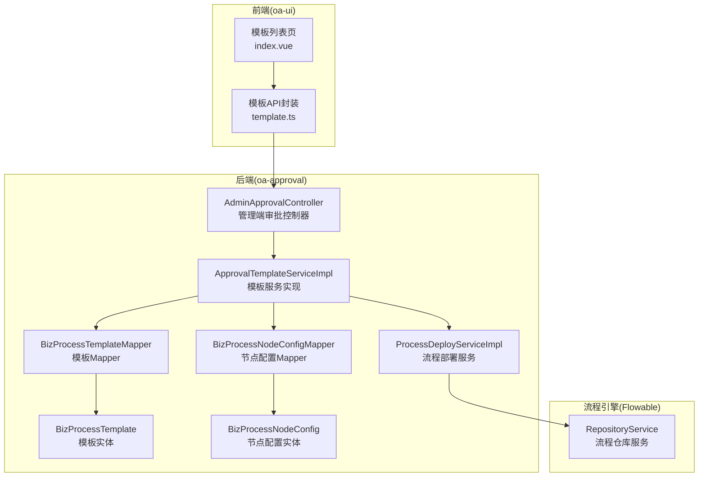
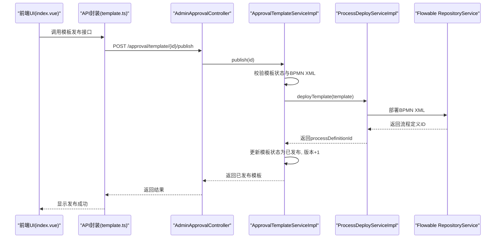
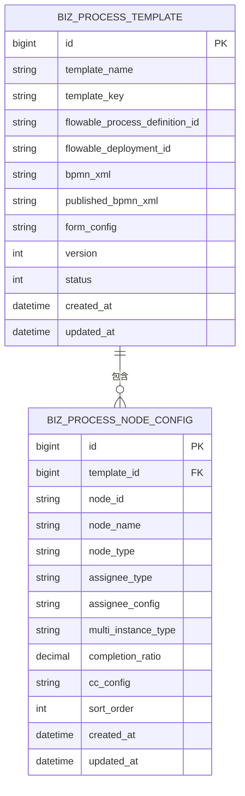
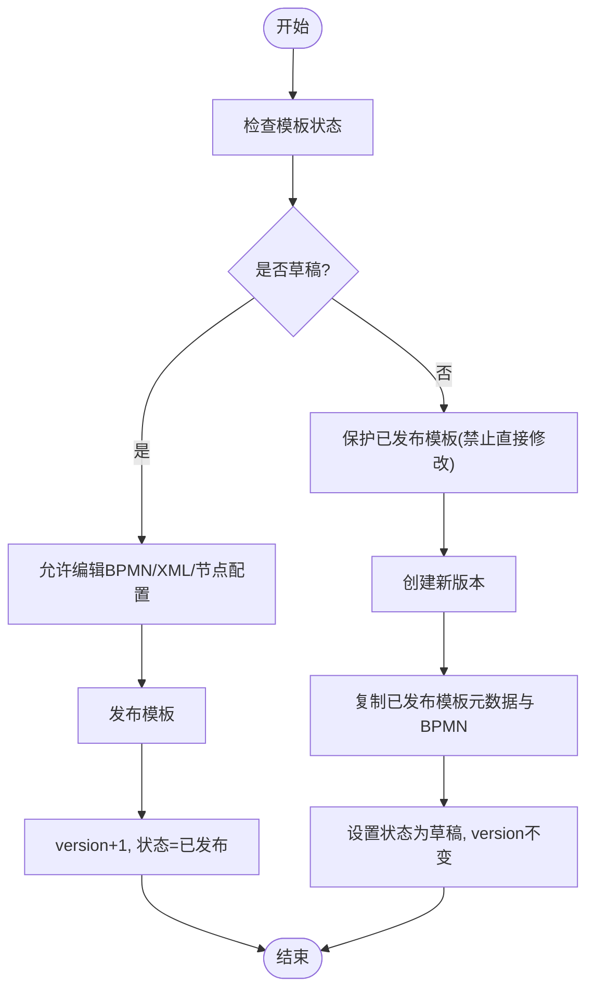
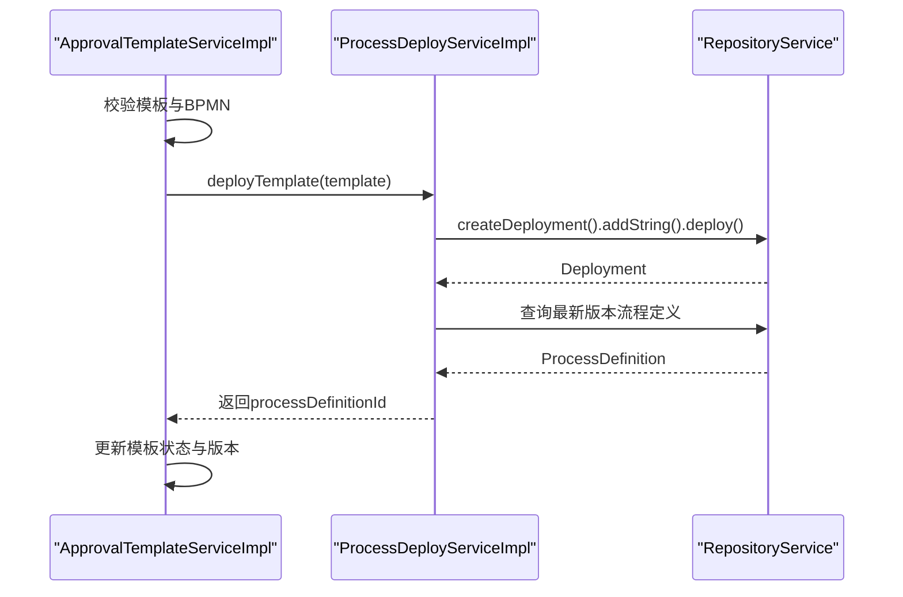
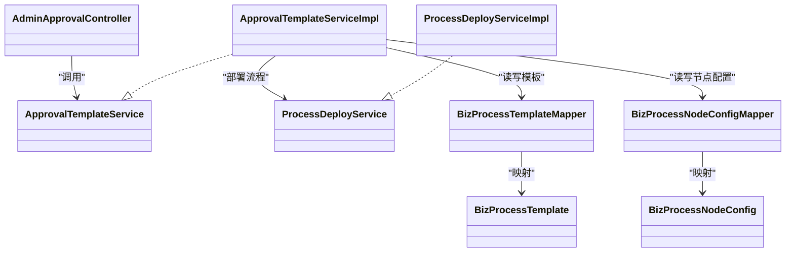

# 审批模板管理

<cite>
**本文引用的文件**
- [AdminApprovalController.java](file://oa-approval/src/main/java/com/oa/admin/approval/controller/AdminApprovalController.java)
- [BizProcessTemplate.java](file://oa-approval/src/main/java/com/oa/admin/approval/entity/BizProcessTemplate.java)
- [BizProcessNodeConfig.java](file://oa-approval/src/main/java/com/oa/admin/approval/entity/BizProcessNodeConfig.java)
- [ApprovalTemplateServiceImpl.java](file://oa-approval/src/main/java/com/oa/admin/approval/service/impl/ApprovalTemplateServiceImpl.java)
- [ApprovalTemplateService.java](file://oa-approval/src/main/java/com/oa/admin/approval/service/ApprovalTemplateService.java)
- [ProcessDeployServiceImpl.java](file://oa-approval/src/main/java/com/oa/admin/approval/service/impl/ProcessDeployServiceImpl.java)
- [ProcessDeployService.java](file://oa-approval/src/main/java/com/oa/admin/approval/service/ProcessDeployService.java)
- [BizProcessTemplateMapper.java](file://oa-approval/src/main/java/com/oa/admin/approval/mapper/BizProcessTemplateMapper.java)
- [BizProcessNodeConfigMapper.java](file://oa-approval/src/main/java/com/oa/admin/approval/mapper/BizProcessNodeConfigMapper.java)
- [FlowableConstants.java](file://oa-approval/src/main/java/com/oa/admin/approval/constant/FlowableConstants.java)
- [TemplateStatus.java](file://oa-approval/src/main/java/com/oa/admin/approval/enums/TemplateStatus.java)
- [template.ts](file://oa-ui/src/api/template.ts)
- [index.vue](file://oa-ui/src/views/approval/template/index.vue)
- [leave_request.bpmn20.xml](file://oa-app/src/main/resources/processes/leave_request.bpmn20.xml)
- [leave_request_v2.bpmn20.xml](file://oa-app/src/main/resources/processes/leave_request_v2.bpmn20.xml)
</cite>

## 目录
1. [简介](#简介)
2. [项目结构](#项目结构)
3. [核心组件](#核心组件)
4. [架构总览](#架构总览)
5. [详细组件分析](#详细组件分析)
6. [依赖关系分析](#依赖关系分析)
7. [性能考虑](#性能考虑)
8. [故障排查指南](#故障排查指南)
9. [结论](#结论)
10. [附录](#附录)

## 简介
本文件面向审批模板管理功能，系统性阐述模板设计与实现原理，涵盖模板定义、节点配置、表单绑定、版本管理、部署发布、以及前后端交互接口。重点解析 AdminApprovalController 中与模板管理相关的 API 实现，并深入说明 BizProcessTemplate 数据模型及节点配置模型的设计意图与约束。同时提供模板版本迭代与历史追溯机制、导入导出实现思路与最佳实践，帮助读者快速理解并高效使用该模块。

## 项目结构
审批模板管理位于 oa-approval 模块，采用分层架构：控制器层负责对外 API；服务层封装业务逻辑；持久层通过 MyBatis-Plus 访问数据库；前端通过独立的 oa-ui 模块调用后端接口完成可视化设计与管理。

图表来源
- [index.vue:1-198](file://oa-ui/src/views/approval/template/index.vue#L1-L198)
- [template.ts:1-51](file://oa-ui/src/api/template.ts#L1-L51)
- [AdminApprovalController.java:1-56](file://oa-approval/src/main/java/com/oa/admin/approval/controller/AdminApprovalController.java#L1-L56)
- [ApprovalTemplateServiceImpl.java:1-163](file://oa-approval/src/main/java/com/oa/admin/approval/service/impl/ApprovalTemplateServiceImpl.java#L1-L163)
- [ProcessDeployServiceImpl.java:1-82](file://oa-approval/src/main/java/com/oa/admin/approval/service/impl/ProcessDeployServiceImpl.java#L1-L82)
- [BizProcessTemplateMapper.java:1-13](file://oa-approval/src/main/java/com/oa/admin/approval/mapper/BizProcessTemplateMapper.java#L1-L13)
- [BizProcessNodeConfigMapper.java:1-11](file://oa-approval/src/main/java/com/oa/admin/approval/mapper/BizProcessNodeConfigMapper.java#L1-L11)

章节来源
- [index.vue:1-198](file://oa-ui/src/views/approval/template/index.vue#L1-L198)
- [template.ts:1-51](file://oa-ui/src/api/template.ts#L1-L51)
- [AdminApprovalController.java:1-56](file://oa-approval/src/main/java/com/oa/admin/approval/controller/AdminApprovalController.java#L1-L56)

## 核心组件
- 控制器层：AdminApprovalController 提供管理端审批相关接口（当前聚焦模板管理），负责参数校验、权限控制与响应封装。
- 服务层：ApprovalTemplateServiceImpl 负责模板的分页查询、草稿保存、发布、版本创建、撤销发布、节点配置读写、XML 读写等核心业务。
- 部署层：ProcessDeployServiceImpl 将模板 BPMN XML 部署到 Flowable 引擎，生成流程定义 ID 并返回。
- 实体层：BizProcessTemplate 与 BizProcessNodeConfig 描述模板元数据、节点配置与表单绑定信息。
- 前端：index.vue 展示模板列表与操作按钮；template.ts 提供模板 CRUD、发布、新建版本、节点配置与 XML 读写等 API。

章节来源
- [AdminApprovalController.java:1-56](file://oa-approval/src/main/java/com/oa/admin/approval/controller/AdminApprovalController.java#L1-L56)
- [ApprovalTemplateServiceImpl.java:1-163](file://oa-approval/src/main/java/com/oa/admin/approval/service/impl/ApprovalTemplateServiceImpl.java#L1-L163)
- [ProcessDeployServiceImpl.java:1-82](file://oa-approval/src/main/java/com/oa/admin/approval/service/impl/ProcessDeployServiceImpl.java#L1-L82)
- [BizProcessTemplate.java:1-29](file://oa-approval/src/main/java/com/oa/admin/approval/entity/BizProcessTemplate.java#L1-L29)
- [BizProcessNodeConfig.java:1-37](file://oa-approval/src/main/java/com/oa/admin/approval/entity/BizProcessNodeConfig.java#L1-L37)
- [index.vue:1-198](file://oa-ui/src/views/approval/template/index.vue#L1-L198)
- [template.ts:1-51](file://oa-ui/src/api/template.ts#L1-L51)

## 架构总览
审批模板管理以“模板 + 节点配置 + 表单配置 + 流程引擎部署”为核心闭环。前端通过 API 封装调用后端控制器，控制器委派服务层处理业务，服务层协调持久层与流程引擎完成模板的生命周期管理。

图表来源
- [index.vue:153-168](file://oa-ui/src/views/approval/template/index.vue#L153-L168)
- [template.ts:32-34](file://oa-ui/src/api/template.ts#L32-L34)
- [AdminApprovalController.java:1-56](file://oa-approval/src/main/java/com/oa/admin/approval/controller/AdminApprovalController.java#L1-L56)
- [ApprovalTemplateServiceImpl.java:58-81](file://oa-approval/src/main/java/com/oa/admin/approval/service/impl/ApprovalTemplateServiceImpl.java#L58-L81)
- [ProcessDeployServiceImpl.java:28-58](file://oa-approval/src/main/java/com/oa/admin/approval/service/impl/ProcessDeployServiceImpl.java#L28-L58)

## 详细组件分析

### 数据模型设计：BizProcessTemplate 与 BizProcessNodeConfig
- BizProcessTemplate 字段说明
  - 主键与基础字段：id、创建/更新时间等继承自 BaseEntity。
  - 模板元数据：templateName、templateKey、version、status。
  - 流程与表单：flowableProcessDefinitionId、flowableDeploymentId、bpmnXml、publishedBpmnXml、formConfig。
  - 状态枚举：TemplateStatus（草稿/已发布）。
- BizProcessNodeConfig 字段说明
  - 关联模板：templateId。
  - 节点标识：nodeId、nodeName。
  - 节点类型：nodeType（如用户任务、网关、开始/结束事件）。
  - 会签策略：assigneeType（固定、部门领导、角色、发起人、表达式）、assigneeConfig（JSON 配置）。
  - 多实例：multiInstanceType（none、countersign、orSign）、completionRatio。
  - 抄送：ccConfig（JSON 数组，节点完成时抄送给哪些用户）。
  - 排序：sortOrder。

图表来源
- [BizProcessTemplate.java:1-29](file://oa-approval/src/main/java/com/oa/admin/approval/entity/BizProcessTemplate.java#L1-L29)
- [BizProcessNodeConfig.java:1-37](file://oa-approval/src/main/java/com/oa/admin/approval/entity/BizProcessNodeConfig.java#L1-L37)

章节来源
- [BizProcessTemplate.java:1-29](file://oa-approval/src/main/java/com/oa/admin/approval/entity/BizProcessTemplate.java#L1-L29)
- [BizProcessNodeConfig.java:1-37](file://oa-approval/src/main/java/com/oa/admin/approval/entity/BizProcessNodeConfig.java#L1-L37)
- [TemplateStatus.java:1-26](file://oa-approval/src/main/java/com/oa/admin/approval/enums/TemplateStatus.java#L1-L26)

### 模板版本管理机制
- 版本号：模板首次发布时 version=1；每次发布都会递增。
- 已发布模板的保护：草稿保存与 XML 写入均禁止对已发布模板进行修改。
- 新建版本：基于已发布模板复制，保留元数据与已发布 BPMN，创建新的草稿版本，version 不变，状态为草稿。
- 撤销发布：将模板状态从已发布回退为草稿，允许继续编辑。

图表来源
- [ApprovalTemplateServiceImpl.java:42-104](file://oa-approval/src/main/java/com/oa/admin/approval/service/impl/ApprovalTemplateServiceImpl.java#L42-L104)
- [TemplateStatus.java:11-25](file://oa-approval/src/main/java/com/oa/admin/approval/enums/TemplateStatus.java#L11-L25)

章节来源
- [ApprovalTemplateServiceImpl.java:42-104](file://oa-approval/src/main/java/com/oa/admin/approval/service/impl/ApprovalTemplateServiceImpl.java#L42-L104)
- [TemplateStatus.java:1-26](file://oa-approval/src/main/java/com/oa/admin/approval/enums/TemplateStatus.java#L1-L26)

### 模板发布与流程引擎集成
- 发布流程：校验模板存在、状态非已发布、BPMN XML 存在；将 publishedBpmnXml 设置为当前 BPMN；调用部署服务部署到 Flowable；记录流程定义 ID；version+1；状态=已发布。
- 部署服务：根据模板 key 生成资源名，将 BPMN XML 作为字符串资源部署；查询最新版本流程定义并返回 processDefinitionId；提供从部署 ID 读取 BPMN XML 的能力。

图表来源
- [ApprovalTemplateServiceImpl.java:58-81](file://oa-approval/src/main/java/com/oa/admin/approval/service/impl/ApprovalTemplateServiceImpl.java#L58-L81)
- [ProcessDeployServiceImpl.java:28-58](file://oa-approval/src/main/java/com/oa/admin/approval/service/impl/ProcessDeployServiceImpl.java#L28-L58)

章节来源
- [ApprovalTemplateServiceImpl.java:58-81](file://oa-approval/src/main/java/com/oa/admin/approval/service/impl/ApprovalTemplateServiceImpl.java#L58-L81)
- [ProcessDeployServiceImpl.java:28-58](file://oa-approval/src/main/java/com/oa/admin/approval/service/impl/ProcessDeployServiceImpl.java#L28-L58)
- [FlowableConstants.java:1-16](file://oa-approval/src/main/java/com/oa/admin/approval/constant/FlowableConstants.java#L1-L16)

### 节点配置与表单绑定
- 节点配置：每个模板可包含多个节点配置，按排序存储；支持多种节点类型与会签策略；支持多实例与完成比例；支持节点完成后抄送给指定用户集合。
- 表单绑定：formConfig 字段用于绑定前端表单结构（JSON），模板发布后由流程引擎实例化时使用。

章节来源
- [BizProcessNodeConfig.java:1-37](file://oa-approval/src/main/java/com/oa/admin/approval/entity/BizProcessNodeConfig.java#L1-L37)
- [BizProcessTemplate.java:19-22](file://oa-approval/src/main/java/com/oa/admin/approval/entity/BizProcessTemplate.java#L19-L22)

### AdminApprovalController 中模板管理 API
- 当前控制器主要提供管理端审批相关接口，未直接暴露模板管理的 CRUD 接口。模板管理接口由前端通过独立 API 封装调用后端服务层实现。
- 若需扩展控制器中的模板管理接口，可在现有控制器基础上增加对应路由与方法，遵循现有权限注解与返回封装模式。

章节来源
- [AdminApprovalController.java:1-56](file://oa-approval/src/main/java/com/oa/admin/approval/controller/AdminApprovalController.java#L1-L56)

### 前端模板管理界面与 API
- 列表页：展示模板名称、标识、状态、版本、创建时间；提供设计流程、编辑、发布、新建版本、删除等操作。
- API 封装：提供获取/保存模板 XML、节点配置、发布、新建版本、获取/更新/删除模板等方法。
- 交互流程：点击“发布”弹窗确认后调用发布接口；点击“新建版本”调用接口创建草稿版本并跳转至设计器。

章节来源
- [index.vue:1-198](file://oa-ui/src/views/approval/template/index.vue#L1-L198)
- [template.ts:1-51](file://oa-ui/src/api/template.ts#L1-L51)

### 模板导入导出实现细节与使用指南
- 导入
  - 通过保存模板 XML 接口将 BPMN 文件内容写入模板的 bpmnXml 或 publishedBpmnXml 字段。
  - 对于已发布模板，需先创建新版本再导入 XML，避免破坏已发布流程。
  - 可结合流程引擎提供的资源读取能力，从部署 ID 获取原始 BPMN XML 以便备份或迁移。
- 导出
  - 使用部署服务从 Flowable 仓库读取 BPMN 资源，返回 XML 文本，便于下载与归档。
  - 建议同时导出模板元数据（名称、标识、表单配置）与节点配置，形成完整包。
- 最佳实践
  - 导入前先创建新版本，导入后在设计器中核对节点与连线。
  - 导出时保留模板标识与版本号，便于后续版本追踪。
  - 对于复杂流程，建议先在设计器中验证 XML 正确性再导入。

章节来源
- [ApprovalTemplateServiceImpl.java:149-161](file://oa-approval/src/main/java/com/oa/admin/approval/service/impl/ApprovalTemplateServiceImpl.java#L149-L161)
- [ProcessDeployServiceImpl.java:60-80](file://oa-approval/src/main/java/com/oa/admin/approval/service/impl/ProcessDeployServiceImpl.java#L60-L80)

### 模板配置示例与最佳实践
- 示例参考
  - BPMN 示例文件：leave_request.bpmn20.xml、leave_request_v2.bpmn20.xml，可作为模板设计与导入的参考。
- 最佳实践
  - 模板命名与标识：templateName 与 templateKey 应唯一且语义明确，便于检索与引用。
  - 节点命名：nodeId 与 nodeName 清晰描述审批环节职责，便于审计与排障。
  - 会签策略：合理设置多实例类型与完成比例，确保审批效率与合规性。
  - 抄送配置：在关键节点配置 ccConfig，确保相关人员及时获知进展。
  - 版本控制：变更频繁的流程应优先使用“新建版本”再发布，避免影响线上运行流程。

章节来源
- [leave_request.bpmn20.xml](file://oa-app/src/main/resources/processes/leave_request.bpmn20.xml)
- [leave_request_v2.bpmn20.xml](file://oa-app/src/main/resources/processes/leave_request_v2.bpmn20.xml)

## 依赖关系分析
- 组件耦合
  - ApprovalTemplateServiceImpl 依赖 ProcessDeployService 进行流程部署；依赖 BizProcessNodeConfigMapper 读写节点配置。
  - BizProcessTemplateMapper 与 BizProcessNodeConfigMapper 分别映射模板与节点配置实体。
- 外部依赖
  - Flowable RepositoryService 负责流程部署与查询。
  - Spring 注解（如权限注解）用于接口级安全控制。

图表来源
- [AdminApprovalController.java:1-56](file://oa-approval/src/main/java/com/oa/admin/approval/controller/AdminApprovalController.java#L1-L56)
- [ApprovalTemplateService.java:1-33](file://oa-approval/src/main/java/com/oa/admin/approval/service/ApprovalTemplateService.java#L1-L33)
- [ApprovalTemplateServiceImpl.java:1-163](file://oa-approval/src/main/java/com/oa/admin/approval/service/impl/ApprovalTemplateServiceImpl.java#L1-L163)
- [ProcessDeployService.java:1-14](file://oa-approval/src/main/java/com/oa/admin/approval/service/ProcessDeployService.java#L1-L14)
- [ProcessDeployServiceImpl.java:1-82](file://oa-approval/src/main/java/com/oa/admin/approval/service/impl/ProcessDeployServiceImpl.java#L1-L82)
- [BizProcessTemplateMapper.java:1-13](file://oa-approval/src/main/java/com/oa/admin/approval/mapper/BizProcessTemplateMapper.java#L1-L13)
- [BizProcessNodeConfigMapper.java:1-11](file://oa-approval/src/main/java/com/oa/admin/approval/mapper/BizProcessNodeConfigMapper.java#L1-L11)

章节来源
- [ApprovalTemplateServiceImpl.java:1-163](file://oa-approval/src/main/java/com/oa/admin/approval/service/impl/ApprovalTemplateServiceImpl.java#L1-L163)
- [ProcessDeployServiceImpl.java:1-82](file://oa-approval/src/main/java/com/oa/admin/approval/service/impl/ProcessDeployServiceImpl.java#L1-L82)

## 性能考虑
- 分页查询：模板列表采用分页查询，避免一次性加载大量数据。
- 批量写入：保存节点配置时按顺序批量插入，减少事务开销。
- 部署优化：部署流程时仅在发布阶段执行，避免频繁部署影响性能。
- 缓存策略：可对常用模板元数据与已发布 BPMN 进行缓存，降低重复读取成本（建议在实际场景中评估）。

## 故障排查指南
- 发布失败
  - 检查 BPMN XML 是否为空或无效；确认模板状态为草稿；查看流程部署错误码。
- 部署异常
  - 核对部署资源名与后缀；确认 Flowable 仓库可用；查看日志输出。
- 版本冲突
  - 已发布模板禁止直接修改；请使用“新建版本”后再编辑。
- 权限问题
  - 确认调用接口所需的管理端权限（如 admin:approval:list 等）已正确配置。

章节来源
- [ApprovalTemplateServiceImpl.java:58-81](file://oa-approval/src/main/java/com/oa/admin/approval/service/impl/ApprovalTemplateServiceImpl.java#L58-L81)
- [ProcessDeployServiceImpl.java:28-58](file://oa-approval/src/main/java/com/oa/admin/approval/service/impl/ProcessDeployServiceImpl.java#L28-L58)

## 结论
审批模板管理通过清晰的数据模型、严格的版本控制与与 Flowable 的紧密集成，实现了从设计、发布到版本演进的全生命周期管理。前端提供了直观的操作界面，后端服务层保证了业务规则与一致性。建议在生产环境中配合完善的权限控制、日志监控与备份策略，确保模板变更的安全与可追溯。

## 附录
- 常用常量
  - Flowable 常量：变量名、BPMN 文件后缀、或签条件等。
- 参考文件
  - BPMN 示例：leave_request.bpmn20.xml、leave_request_v2.bpmn20.xml。

章节来源
- [FlowableConstants.java:1-16](file://oa-approval/src/main/java/com/oa/admin/approval/constant/FlowableConstants.java#L1-L16)
- [leave_request.bpmn20.xml](file://oa-app/src/main/resources/processes/leave_request.bpmn20.xml)
- [leave_request_v2.bpmn20.xml](file://oa-app/src/main/resources/processes/leave_request_v2.bpmn20.xml)