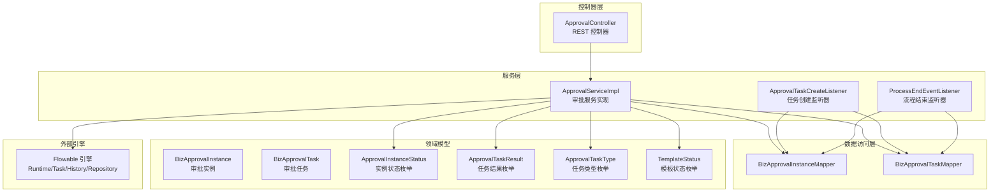
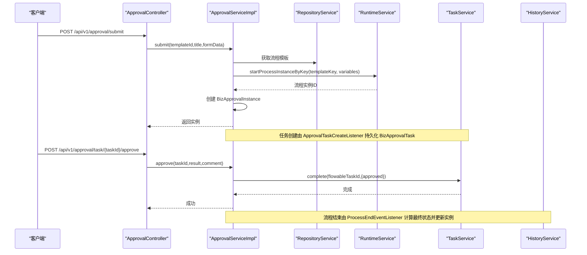
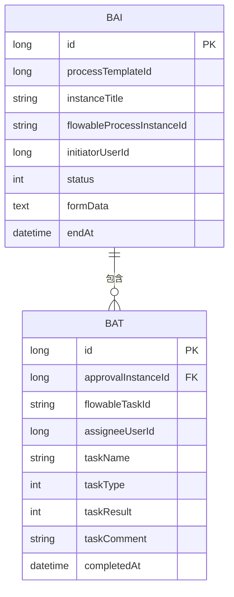
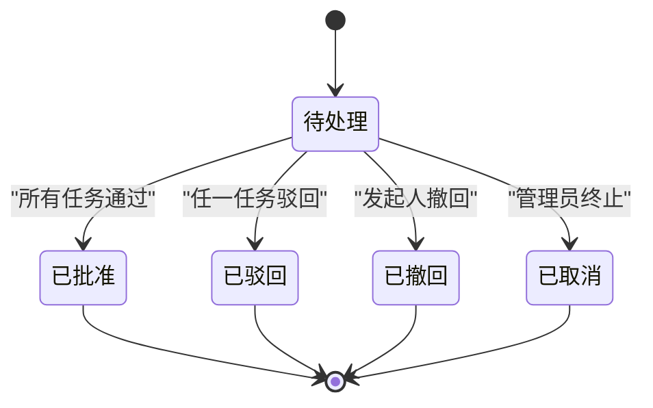
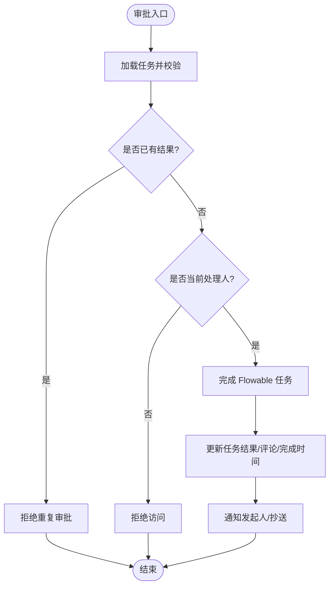
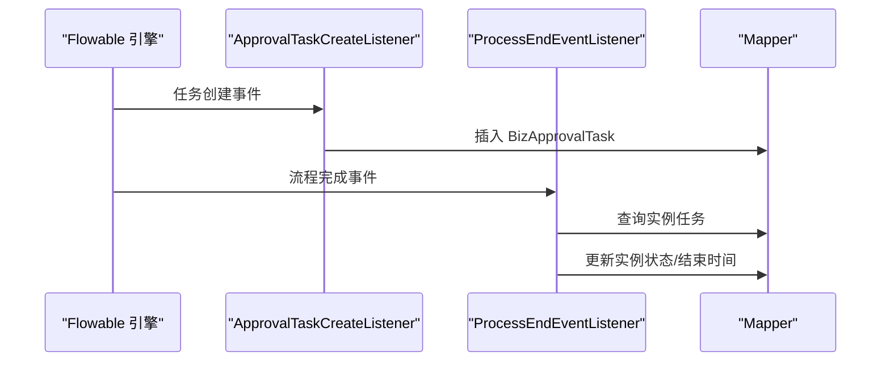
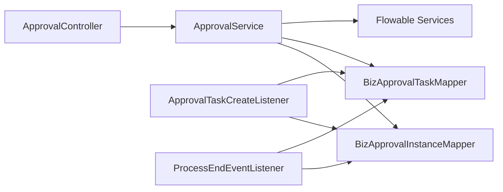

# 审批流程管理

<cite>
**本文引用的文件**
- [BizApprovalInstance.java](file://oa-approval/src/main/java/com/oa/admin/approval/entity/BizApprovalInstance.java)
- [BizApprovalTask.java](file://oa-approval/src/main/java/com/oa/admin/approval/entity/BizApprovalTask.java)
- [ApprovalInstanceStatus.java](file://oa-approval/src/main/java/com/oa/admin/approval/enums/ApprovalInstanceStatus.java)
- [ApprovalTaskResult.java](file://oa-approval/src/main/java/com/oa/admin/approval/enums/ApprovalTaskResult.java)
- [ApprovalTaskType.java](file://oa-approval/src/main/java/com/oa/admin/approval/enums/ApprovalTaskType.java)
- [ApprovalController.java](file://oa-approval/src/main/java/com/oa/admin/approval/controller/ApprovalController.java)
- [ApprovalService.java](file://oa-approval/src/main/java/com/oa/admin/approval/service/ApprovalService.java)
- [ApprovalServiceImpl.java](file://oa-approval/src/main/java/com/oa/admin/approval/service/impl/ApprovalServiceImpl.java)
- [ApprovalTaskCreateListener.java](file://oa-approval/src/main/java/com/oa/admin/approval/listener/ApprovalTaskCreateListener.java)
- [ProcessEndEventListener.java](file://oa-approval/src/main/java/com/oa/admin/approval/listener/ProcessEndEventListener.java)
- [InstanceVO.java](file://oa-approval/src/main/java/com/oa/admin/approval/dto/InstanceVO.java)
- [TaskVO.java](file://oa-approval/src/main/java/com/oa/admin/approval/dto/TaskVO.java)
- [TemplateStatus.java](file://oa-approval/src/main/java/com/oa/admin/approval/enums/TemplateStatus.java)
- [ApprovalConstants.java](file://oa-approval/src/main/java/com/oa/admin/approval/constant/ApprovalConstants.java)
- [FlowableConstants.java](file://oa-approval/src/main/java/com/oa/admin/approval/constant/FlowableConstants.java)
</cite>

## 目录
1. [简介](#简介)
2. [项目结构](#项目结构)
3. [核心组件](#核心组件)
4. [架构总览](#架构总览)
5. [详细组件分析](#详细组件分析)
6. [依赖分析](#依赖分析)
7. [性能考虑](#性能考虑)
8. [故障排查指南](#故障排查指南)
9. [结论](#结论)
10. [附录：API 接口文档](#附录api-接口文档)

## 简介
本文件面向审批流程管理功能，系统性阐述从流程发起、任务分配、审批处理到流程结束的全生命周期管理；深入解析审批实例与审批任务的数据模型设计（字段、状态枚举、关联关系）；明确审批流程状态机（待处理、处理中、已完成、已撤销等）及状态转换规则；说明并发控制机制以避免重复审批与状态冲突；并提供完整的 API 接口文档，覆盖流程发起、任务处理、流程查询等场景。

## 项目结构
审批模块采用分层架构：控制器层负责对外暴露 REST API；服务层封装业务逻辑；实体与枚举描述数据模型与状态；监听器对接 Flowable 引擎事件；常量与 DTO 提供配置与传输对象支持。

图表来源
- [ApprovalController.java:29-251](file://oa-approval/src/main/java/com/oa/admin/approval/controller/ApprovalController.java#L29-L251)
- [ApprovalServiceImpl.java:57-782](file://oa-approval/src/main/java/com/oa/admin/approval/service/impl/ApprovalServiceImpl.java#L57-L782)
- [ApprovalTaskCreateListener.java:21-88](file://oa-approval/src/main/java/com/oa/admin/approval/listener/ApprovalTaskCreateListener.java#L21-L88)
- [ProcessEndEventListener.java:30-94](file://oa-approval/src/main/java/com/oa/admin/approval/listener/ProcessEndEventListener.java#L30-L94)

章节来源
- [ApprovalController.java:29-251](file://oa-approval/src/main/java/com/oa/admin/approval/controller/ApprovalController.java#L29-L251)
- [ApprovalService.java:18-56](file://oa-approval/src/main/java/com/oa/admin/approval/service/ApprovalService.java#L18-L56)
- [ApprovalServiceImpl.java:57-782](file://oa-approval/src/main/java/com/oa/admin/approval/service/impl/ApprovalServiceImpl.java#L57-L782)

## 核心组件
- 审批实例 BizApprovalInstance：承载一次审批流程的业务上下文，包含模板、标题、发起人、状态、表单数据、结束时间等。
- 审批任务 BizApprovalTask：承载具体审批节点的任务信息，包含实例关联、Flowable 任务标识、处理人、任务名、任务类型、任务结果、评论、完成时间等。
- 状态枚举 ApprovalInstanceStatus、ApprovalTaskResult、ApprovalTaskType：统一状态与类型编码，便于跨模块一致化处理。
- 审批服务 ApprovalServiceImpl：实现提交、审批、转办、撤回、终止、统计等核心业务逻辑，并与 Flowable 引擎交互。
- 监听器 ApprovalTaskCreateListener、ProcessEndEventListener：在 Flowable 任务创建与流程结束时触发，同步业务任务与计算最终状态。

章节来源
- [BizApprovalInstance.java:16-32](file://oa-approval/src/main/java/com/oa/admin/approval/entity/BizApprovalInstance.java#L16-L32)
- [BizApprovalTask.java:16-34](file://oa-approval/src/main/java/com/oa/admin/approval/entity/BizApprovalTask.java#L16-L34)
- [ApprovalInstanceStatus.java:11-28](file://oa-approval/src/main/java/com/oa/admin/approval/enums/ApprovalInstanceStatus.java#L11-L28)
- [ApprovalTaskResult.java:11-27](file://oa-approval/src/main/java/com/oa/admin/approval/enums/ApprovalTaskResult.java#L11-L27)
- [ApprovalTaskType.java:11-26](file://oa-approval/src/main/java/com/oa/admin/approval/enums/ApprovalTaskType.java#L11-L26)
- [ApprovalServiceImpl.java:113-231](file://oa-approval/src/main/java/com/oa/admin/approval/service/impl/ApprovalServiceImpl.java#L113-L231)

## 架构总览
系统围绕 Flowable 引擎运行，业务层通过 RuntimeService 启动流程实例，TaskService 处理任务，HistoryService 查询历史，RepositoryService 获取流程定义资源。业务层在任务创建时持久化 BizApprovalTask，在流程结束时根据任务结果计算 BizApprovalInstance 的最终状态。

图表来源
- [ApprovalController.java:37-98](file://oa-approval/src/main/java/com/oa/admin/approval/controller/ApprovalController.java#L37-L98)
- [ApprovalServiceImpl.java:113-231](file://oa-approval/src/main/java/com/oa/admin/approval/service/impl/ApprovalServiceImpl.java#L113-L231)
- [ApprovalTaskCreateListener.java:25-64](file://oa-approval/src/main/java/com/oa/admin/approval/listener/ApprovalTaskCreateListener.java#L25-L64)
- [ProcessEndEventListener.java:35-72](file://oa-approval/src/main/java/com/oa/admin/approval/listener/ProcessEndEventListener.java#L35-L72)

## 详细组件分析

### 数据模型设计
- 审批实例 BizApprovalInstance
  - 关键字段：主键、流程模板ID、实例标题、Flowable 实例ID、发起人用户ID、状态、表单数据、结束时间。
  - 关联关系：与模板（BizProcessTemplate）存在外键关联；与任务（BizApprovalTask）一对多关联。
- 审批任务 BizApprovalTask
  - 关键字段：主键、实例ID、Flowable 任务ID、处理人、任务名、任务类型、任务结果、评论、完成时间。
  - 关联关系：与实例（BizApprovalInstance）多对一关联；与 Flowable 任务一一对应。

图表来源
- [BizApprovalInstance.java:16-32](file://oa-approval/src/main/java/com/oa/admin/approval/entity/BizApprovalInstance.java#L16-L32)
- [BizApprovalTask.java:16-34](file://oa-approval/src/main/java/com/oa/admin/approval/entity/BizApprovalTask.java#L16-L34)

章节来源
- [BizApprovalInstance.java:16-32](file://oa-approval/src/main/java/com/oa/admin/approval/entity/BizApprovalInstance.java#L16-L32)
- [BizApprovalTask.java:16-34](file://oa-approval/src/main/java/com/oa/admin/approval/entity/BizApprovalTask.java#L16-L34)

### 状态机设计
- 实例状态（ApprovalInstanceStatus）
  - 待处理、已批准、已驳回、已撤回、已取消。
- 任务结果（ApprovalTaskResult）
  - 已批准、已驳回、已转办、已取消。
- 任务类型（ApprovalTaskType）
  - 普通、会签、或签。

图表来源
- [ApprovalInstanceStatus.java:11-16](file://oa-approval/src/main/java/com/oa/admin/approval/enums/ApprovalInstanceStatus.java#L11-L16)
- [ApprovalTaskResult.java:11-15](file://oa-approval/src/main/java/com/oa/admin/approval/enums/ApprovalTaskResult.java#L11-L15)
- [ProcessEndEventListener.java:54-66](file://oa-approval/src/main/java/com/oa/admin/approval/listener/ProcessEndEventListener.java#L54-L66)

章节来源
- [ApprovalInstanceStatus.java:11-28](file://oa-approval/src/main/java/com/oa/admin/approval/enums/ApprovalInstanceStatus.java#L11-L28)
- [ApprovalTaskResult.java:11-27](file://oa-approval/src/main/java/com/oa/admin/approval/enums/ApprovalTaskResult.java#L11-L27)
- [ProcessEndEventListener.java:54-66](file://oa-approval/src/main/java/com/oa/admin/approval/listener/ProcessEndEventListener.java#L54-L66)

### 并发控制与一致性
- 任务审批幂等性
  - 服务端在审批前检查任务是否已有结果，若已存在则拒绝重复审批。
- 任务归属校验
  - 仅当前处理人可执行审批操作，避免越权处理。
- 转办与重分配
  - 转办时标记原任务为“已转办”，并为接收人创建新任务；重分配仅允许未完成任务变更处理人。
- 撤回与终止
  - 撤回仅限待处理且未产生任何处理记录的实例；终止仅限待处理实例。
- 事件驱动最终一致性
  - 流程结束监听器根据任务结果批量计算实例最终状态，确保状态一致性。

图表来源
- [ApprovalServiceImpl.java:161-231](file://oa-approval/src/main/java/com/oa/admin/approval/service/impl/ApprovalServiceImpl.java#L161-L231)
- [ApprovalServiceImpl.java:547-593](file://oa-approval/src/main/java/com/oa/admin/approval/service/impl/ApprovalServiceImpl.java#L547-L593)

章节来源
- [ApprovalServiceImpl.java:161-231](file://oa-approval/src/main/java/com/oa/admin/approval/service/impl/ApprovalServiceImpl.java#L161-L231)
- [ApprovalServiceImpl.java:547-593](file://oa-approval/src/main/java/com/oa/admin/approval/service/impl/ApprovalServiceImpl.java#L547-L593)
- [ApprovalServiceImpl.java:255-298](file://oa-approval/src/main/java/com/oa/admin/approval/service/impl/ApprovalServiceImpl.java#L255-L298)
- [ApprovalServiceImpl.java:654-696](file://oa-approval/src/main/java/com/oa/admin/approval/service/impl/ApprovalServiceImpl.java#L654-L696)

### 事件与监听
- 任务创建监听器
  - 在 Flowable 任务创建时，读取流程实例并持久化 BizApprovalTask，同时识别任务类型（普通/会签/或签）。
- 流程结束监听器
  - 在流程完成事件中，读取该实例下所有任务结果，决定最终实例状态（批准/驳回），并发布完成事件。

图表来源
- [ApprovalTaskCreateListener.java:25-64](file://oa-approval/src/main/java/com/oa/admin/approval/listener/ApprovalTaskCreateListener.java#L25-L64)
- [ProcessEndEventListener.java:35-72](file://oa-approval/src/main/java/com/oa/admin/approval/listener/ProcessEndEventListener.java#L35-L72)

章节来源
- [ApprovalTaskCreateListener.java:25-88](file://oa-approval/src/main/java/com/oa/admin/approval/listener/ApprovalTaskCreateListener.java#L25-L88)
- [ProcessEndEventListener.java:35-94](file://oa-approval/src/main/java/com/oa/admin/approval/listener/ProcessEndEventListener.java#L35-L94)

### API 使用与参数说明
以下为审批相关接口的使用说明与参数定义（基于控制器层暴露的接口）：

- 提交审批
  - 方法：POST
  - 路径：/api/v1/approval/submit
  - 权限：approval:submit
  - 请求体：
    - templateId: 模板ID（Long，必填）
    - title: 实例标题（String，必填）
    - formData: 表单JSON字符串（String，可选）
  - 响应：返回 BizApprovalInstance

- 审批任务处理
  - 方法：POST
  - 路径：/api/v1/approval/task/{taskId}/approve
  - 权限：approval:approve
  - 路径参数：taskId（Long，必填）
  - 请求体：
    - result: 结果码（整数，必填，见“任务结果枚举”）
    - comment: 审批意见（String，可选）

- 我的待办列表
  - 方法：GET
  - 路径：/api/v1/approval/my-todo
  - 权限：approval:todo
  - 响应：返回 BizApprovalTask 列表

- 我的已办列表
  - 方法：GET
  - 路径：/api/v1/approval/my-done
  - 权限：approval:done
  - 响应：返回 BizApprovalTask 列表

- 分页查询我的待办
  - 方法：GET
  - 路径：/api/v1/approval/my-todo/paged
  - 权限：approval:todo
  - 查询参数：
    - title: 标题关键词（String，可选）
    - page: 页码（Long，默认1）
    - pageSize: 每页条数（Long，默认10）

- 分页查询我的已办
  - 方法：GET
  - 路径：/api/v1/approval/my-done/paged
  - 权限：approval:done
  - 查询参数：
    - title: 标题关键词（String，可选）
    - page: 页码（Long，默认1）
    - pageSize: 每页条数（Long，默认10）

- 转办任务
  - 方法：POST
  - 路径：/api/v1/approval/task/{taskId}/transfer
  - 权限：approval:approve
  - 路径参数：taskId（Long，必填）
  - 请求体：
    - targetUserId: 目标处理人ID（Long，必填）
    - reason: 转办原因（String，可选）

- 撤回实例
  - 方法：POST
  - 路径：/api/v1/approval/{instanceId}/withdraw
  - 权限：approval:withdraw
  - 路径参数：instanceId（Long，必填）

- 查询实例下的所有任务
  - 方法：GET
  - 路径：/api/v1/approval/instance/{instanceId}/tasks
  - 权限：approval:instance:view
  - 路径参数：instanceId（Long，必填）
  - 响应：返回 BizApprovalTask 列表

- 我的申请记录
  - 方法：GET
  - 路径：/api/v1/approval/my-applications
  - 权限：approval:instance:view
  - 查询参数：
    - title: 标题关键词（String，可选）
    - status: 实例状态（Integer，可选）
    - page: 页码（Long，默认1）
    - pageSize: 每页条数（Long，默认10）
  - 响应：分页结果（PageResult<BizApprovalInstance>）

- 实例详情
  - 方法：GET
  - 路径：/api/v1/approval/instance/{instanceId}
  - 权限：approval:instance:view
  - 路径参数：instanceId（Long，必填）
  - 响应：BizApprovalInstance

- 实例流程图
  - 方法：GET
  - 路径：/api/v1/approval/instance/{instanceId}/diagram
  - 权限：approval:instance:view
  - 路径参数：instanceId（Long，必填）
  - 响应：InstanceDiagramVO（包含 BPMN XML 与高亮节点集合）

- 仪表盘统计
  - 方法：GET
  - 路径：/api/v1/approval/dashboard/stats
  - 权限：approval:dashboard
  - 响应：DashboardStatsVO

- 模板管理（CRUD）
  - 列表：GET /api/v1/approval/template
  - 详情：GET /api/v1/approval/template/{id}
  - 新增：POST /api/v1/approval/template
  - 修改：PUT /api/v1/approval/template/{id}
  - 删除：DELETE /api/v1/approval/template/{id}
  - 发布：POST /api/v1/approval/template/{id}/publish
  - 获取 BPMN XML：GET /api/v1/approval/template/{id}/xml
  - 保存 BPMN XML：PUT /api/v1/approval/template/{id}/xml
  - 获取节点配置：GET /api/v1/approval/template/{id}/node-config
  - 保存节点配置：PUT /api/v1/approval/template/{id}/node-config
  - 新建版本：POST /api/v1/approval/template/{id}/new-version

- 抄送管理
  - 我的抄送：GET /api/v1/approval/cc
  - 标记已读：POST /api/v1/approval/cc/{ccId}/read

章节来源
- [ApprovalController.java:37-228](file://oa-approval/src/main/java/com/oa/admin/approval/controller/ApprovalController.java#L37-L228)
- [InstanceVO.java:9-20](file://oa-approval/src/main/java/com/oa/admin/approval/dto/InstanceVO.java#L9-L20)
- [TaskVO.java:13-33](file://oa-approval/src/main/java/com/oa/admin/approval/dto/TaskVO.java#L13-L33)

## 依赖分析
- 组件耦合
  - ApprovalController 依赖 ApprovalService；ApprovalServiceImpl 依赖多个 Mapper、Flowable 服务、审计与通知服务。
  - 监听器通过 Mapper 与业务实体交互，不直接暴露于控制器。
- 外部依赖
  - Flowable 引擎：RuntimeService、TaskService、HistoryService、RepositoryService。
  - Sa-Token：权限注解校验。
  - Jackson：JSON 解析与序列化。
- 可能的循环依赖
  - 当前结构清晰，监听器与服务通过 Mapper 解耦，未见循环依赖迹象。

图表来源
- [ApprovalController.java:33-35](file://oa-approval/src/main/java/com/oa/admin/approval/controller/ApprovalController.java#L33-L35)
- [ApprovalServiceImpl.java:101-111](file://oa-approval/src/main/java/com/oa/admin/approval/service/impl/ApprovalServiceImpl.java#L101-L111)
- [ApprovalTaskCreateListener.java:22-23](file://oa-approval/src/main/java/com/oa/admin/approval/listener/ApprovalTaskCreateListener.java#L22-L23)
- [ProcessEndEventListener.java:31-33](file://oa-approval/src/main/java/com/oa/admin/approval/listener/ProcessEndEventListener.java#L31-L33)

章节来源
- [ApprovalServiceImpl.java:101-111](file://oa-approval/src/main/java/com/oa/admin/approval/service/impl/ApprovalServiceImpl.java#L101-L111)
- [ApprovalTaskCreateListener.java:22-23](file://oa-approval/src/main/java/com/oa/admin/approval/listener/ApprovalTaskCreateListener.java#L22-L23)
- [ProcessEndEventListener.java:31-33](file://oa-approval/src/main/java/com/oa/admin/approval/listener/ProcessEndEventListener.java#L31-L33)

## 性能考虑
- 分页查询
  - 待办/已办分页接口使用数据库分页，建议结合索引优化（如按处理人、创建时间、结果状态建立复合索引）。
- 批量统计
  - 仪表盘统计聚合查询可利用数据库聚合函数减少往返。
- 图形渲染
  - 流程图 XML 获取后进行本地拼接与缓存，避免重复 IO。
- 事务边界
  - 审批、转办、撤回、终止等操作均在事务内执行，保证一致性但需关注长事务风险，建议缩短事务时间与合理拆分。

## 故障排查指南
- 参数错误
  - 现象：请求参数缺失或格式错误。
  - 处理：控制器内置参数解析与异常抛出，检查必填项与类型。
- 权限不足
  - 现象：403 拒绝访问。
  - 处理：确认用户是否具备相应权限（approval:*）。
- 任务已处理
  - 现象：重复审批被拒绝。
  - 处理：检查任务是否已有结果，避免二次提交。
- 非当前处理人
  - 现象：审批被拒绝。
  - 处理：确认登录用户与任务处理人一致。
- 实例状态不符
  - 现象：撤回/终止失败。
  - 处理：仅待处理实例可撤回/终止，且未产生任何处理记录。

章节来源
- [ApprovalController.java:230-250](file://oa-approval/src/main/java/com/oa/admin/approval/controller/ApprovalController.java#L230-L250)
- [ApprovalServiceImpl.java:161-231](file://oa-approval/src/main/java/com/oa/admin/approval/service/impl/ApprovalServiceImpl.java#L161-L231)
- [ApprovalServiceImpl.java:255-298](file://oa-approval/src/main/java/com/oa/admin/approval/service/impl/ApprovalServiceImpl.java#L255-L298)
- [ApprovalServiceImpl.java:654-696](file://oa-approval/src/main/java/com/oa/admin/approval/service/impl/ApprovalServiceImpl.java#L654-L696)

## 结论
本系统通过清晰的数据模型、严格的并发控制与事件驱动的最终一致性，实现了从流程发起到结束的完整闭环。审批实例与任务的分离设计使得业务与流程解耦，配合 Flowable 的灵活编排能力，满足多样化的审批场景需求。建议在生产环境中完善索引策略、监控事务耗时与异常事件，持续优化用户体验与系统稳定性。

## 附录：API 接口文档
- 提交流程
  - 方法：POST /api/v1/approval/submit
  - 权限：approval:submit
  - 请求体字段：templateId（模板ID）、title（标题）、formData（表单JSON）
  - 返回：BizApprovalInstance

- 审批任务
  - 方法：POST /api/v1/approval/task/{taskId}/approve
  - 权限：approval:approve
  - 路径参数：taskId
  - 请求体字段：result（结果码）、comment（意见）

- 我的待办/已办
  - 方法：GET /api/v1/approval/my-todo | /api/v1/approval/my-done
  - 权限：approval:todo | approval:done
  - 返回：BizApprovalTask 列表

- 分页查询待办/已办
  - 方法：GET /api/v1/approval/my-todo/paged | /api/v1/approval/my-done/paged
  - 权限：approval:todo | approval:done
  - 查询参数：title、page、pageSize

- 转办任务
  - 方法：POST /api/v1/approval/task/{taskId}/transfer
  - 权限：approval:approve
  - 请求体字段：targetUserId、reason

- 撤回实例
  - 方法：POST /api/v1/approval/{instanceId}/withdraw
  - 权限：approval:withdraw
  - 路径参数：instanceId

- 实例任务列表
  - 方法：GET /api/v1/approval/instance/{instanceId}/tasks
  - 权限：approval:instance:view

- 我的申请记录
  - 方法：GET /api/v1/approval/my-applications
  - 权限：approval:instance:view
  - 查询参数：title、status、page、pageSize

- 实例详情
  - 方法：GET /api/v1/approval/instance/{instanceId}
  - 权限：approval:instance:view

- 实例流程图
  - 方法：GET /api/v1/approval/instance/{instanceId}/diagram
  - 权限：approval:instance:view

- 仪表盘统计
  - 方法：GET /api/v1/approval/dashboard/stats
  - 权限：approval:dashboard

- 模板管理
  - 列表/详情/新增/修改/删除：GET|POST|PUT|DELETE /api/v1/approval/template/*
  - 发布/获取XML/保存XML/节点配置/新建版本：GET|POST|PUT /api/v1/approval/template/{id}/*

- 抄送管理
  - 我的抄送：GET /api/v1/approval/cc
  - 标记已读：POST /api/v1/approval/cc/{ccId}/read

章节来源
- [ApprovalController.java:37-228](file://oa-approval/src/main/java/com/oa/admin/approval/controller/ApprovalController.java#L37-L228)
- [InstanceVO.java:9-20](file://oa-approval/src/main/java/com/oa/admin/approval/dto/InstanceVO.java#L9-L20)
- [TaskVO.java:13-33](file://oa-approval/src/main/java/com/oa/admin/approval/dto/TaskVO.java#L13-L33)