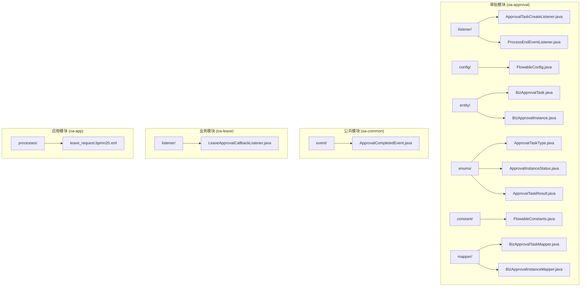
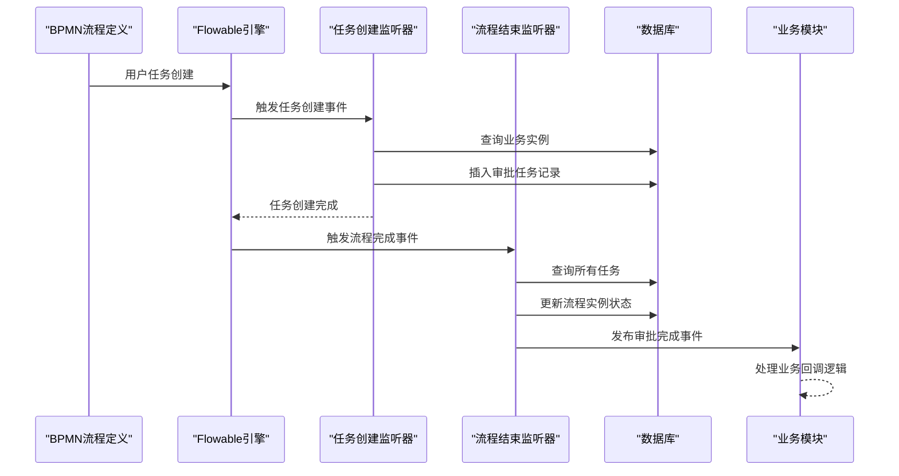
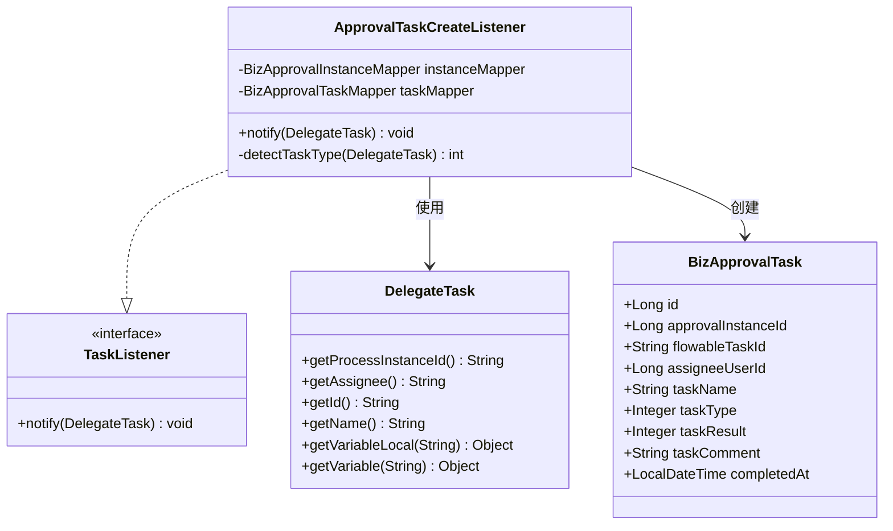
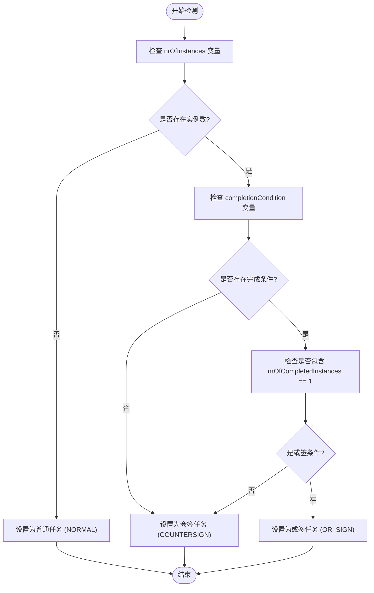
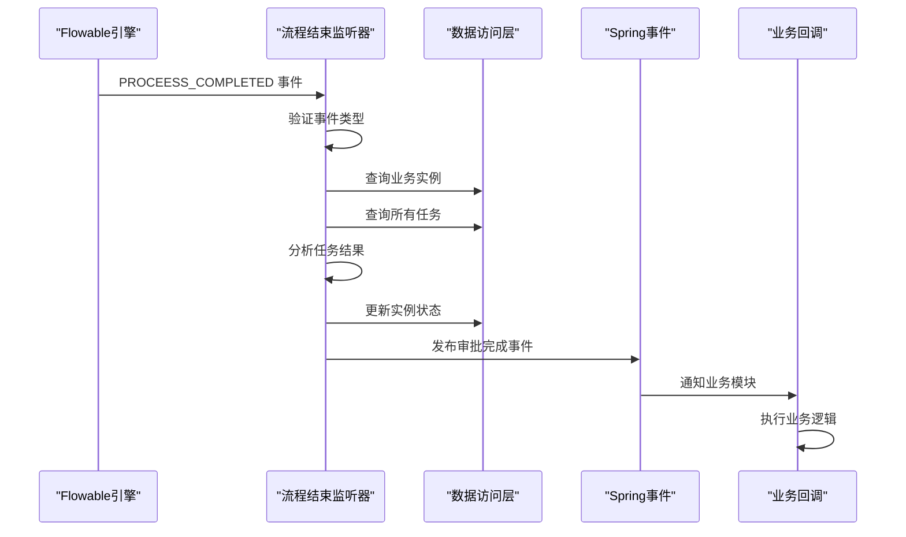
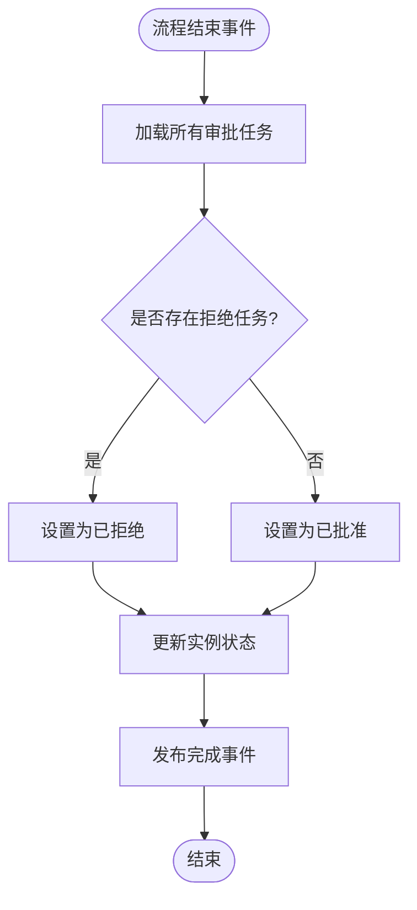
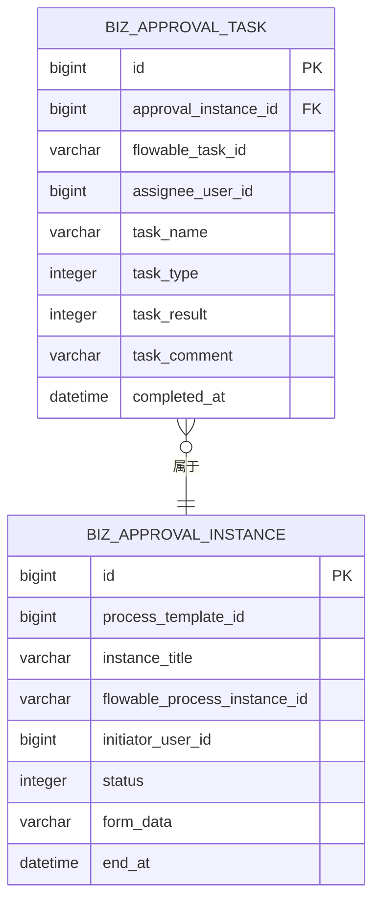
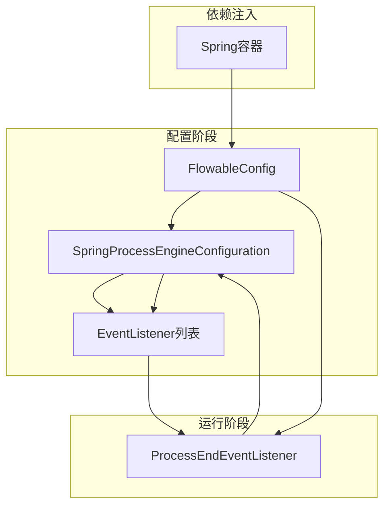
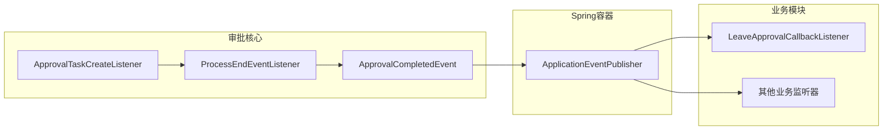

# 审批监听器机制

<cite>
**本文档引用的文件**
- [ApprovalTaskCreateListener.java](file://oa-approval/src/main/java/com/oa/admin/approval/listener/ApprovalTaskCreateListener.java)
- [ProcessEndEventListener.java](file://oa-approval/src/main/java/com/oa/admin/approval/listener/ProcessEndEventListener.java)
- [FlowableConfig.java](file://oa-approval/src/main/java/com/oa/admin/approval/config/FlowableConfig.java)
- [BizApprovalTask.java](file://oa-approval/src/main/java/com/oa/admin/approval/entity/BizApprovalTask.java)
- [BizApprovalInstance.java](file://oa-approval/src/main/java/com/oa/admin/approval/entity/BizApprovalInstance.java)
- [ApprovalTaskType.java](file://oa-approval/src/main/java/com/oa/admin/approval/enums/ApprovalTaskType.java)
- [ApprovalInstanceStatus.java](file://oa-approval/src/main/java/com/oa/admin/approval/enums/ApprovalInstanceStatus.java)
- [ApprovalTaskResult.java](file://oa-approval/src/main/java/com/oa/admin/approval/enums/ApprovalTaskResult.java)
- [FlowableConstants.java](file://oa-approval/src/main/java/com/oa/admin/approval/constant/FlowableConstants.java)
- [ApprovalCompletedEvent.java](file://oa-common/src/main/java/com/oa/admin/common/event/ApprovalCompletedEvent.java)
- [LeaveApprovalCallbackListener.java](file://oa-leave/src/main/java/com/oa/admin/leave/listener/LeaveApprovalCallbackListener.java)
- [leave_request.bpmn20.xml](file://oa-app/src/main/resources/processes/leave_request.bpmn20.xml)
- [ApprovalTaskCreateListenerTest.java](file://oa-approval/src/test/java/com/oa/admin/approval/listener/ApprovalTaskCreateListenerTest.java)
</cite>

## 目录
1. [简介](#简介)
2. [项目结构](#项目结构)
3. [核心组件](#核心组件)
4. [架构概览](#架构概览)
5. [详细组件分析](#详细组件分析)
6. [依赖分析](#依赖分析)
7. [性能考虑](#性能考虑)
8. [故障排除指南](#故障排除指南)
9. [结论](#结论)
10. [附录](#附录)

## 简介

本文件深入解析OA审批系统中的Flowable监听器机制，重点阐述两个核心监听器：任务创建监听器（ApprovalTaskCreateListener）和流程结束监听器（ProcessEndEventListener）。这些监听器实现了审批流程的自动化控制，通过事件驱动的方式确保业务状态与流程状态保持一致。

审批监听器机制采用Spring Boot与Flowable引擎的深度集成，通过监听器模式实现以下功能：
- 自动化任务创建跟踪
- 流程状态智能判定
- 业务事件通知机制
- 多实例审批任务识别

## 项目结构

审批监听器相关代码主要分布在以下模块中：



**图表来源**
- [FlowableConfig.java:1-31](file://oa-approval/src/main/java/com/oa/admin/approval/config/FlowableConfig.java#L1-L31)
- [ApprovalTaskCreateListener.java:1-89](file://oa-approval/src/main/java/com/oa/admin/approval/listener/ApprovalTaskCreateListener.java#L1-L89)
- [ProcessEndEventListener.java:1-95](file://oa-approval/src/main/java/com/oa/admin/approval/listener/ProcessEndEventListener.java#L1-L95)

**章节来源**
- [FlowableConfig.java:1-31](file://oa-approval/src/main/java/com/oa/admin/approval/config/FlowableConfig.java#L1-L31)
- [ApprovalTaskCreateListener.java:1-89](file://oa-approval/src/main/java/com/oa/admin/approval/listener/ApprovalTaskCreateListener.java#L1-L89)
- [ProcessEndEventListener.java:1-95](file://oa-approval/src/main/java/com/oa/admin/approval/listener/ProcessEndEventListener.java#L1-L95)

## 核心组件

### 任务创建监听器 (ApprovalTaskCreateListener)

ApprovalTaskCreateListener是Flowable的任务监听器，负责在用户任务创建时自动记录审批任务信息。该监听器实现了TaskListener接口，专门处理任务创建事件。

**核心功能特性：**
- 自动检测多实例审批任务类型
- 验证任务分配人信息的有效性
- 记录审批任务到数据库
- 支持普通审批、会签和或签任务类型识别

**监听器类型与执行时机：**
- 监听器类型：TaskListener
- 执行事件：任务创建 (event="create")
- 执行时机：Flowable引擎在用户任务创建时自动触发

**章节来源**
- [ApprovalTaskCreateListener.java:1-89](file://oa-approval/src/main/java/com/oa/admin/approval/listener/ApprovalTaskCreateListener.java#L1-L89)

### 流程结束监听器 (ProcessEndEventListener)

ProcessEndEventListener是Flowable的引擎事件监听器，负责在流程实例完成时进行最终状态判定和业务处理。该监听器实现了FlowableEventListener接口。

**核心功能特性：**
- 监听流程完成事件
- 基于任务结果判定最终状态
- 发布业务完成事件
- 更新流程实例状态

**监听器类型与执行时机：**
- 监听器类型：FlowableEventListener
- 监听事件：PROCESS_COMPLETED
- 执行时机：流程实例完全结束后触发

**章节来源**
- [ProcessEndEventListener.java:1-95](file://oa-approval/src/main/java/com/oa/admin/approval/listener/ProcessEndEventListener.java#L1-L95)

## 架构概览

审批监听器机制的整体架构采用事件驱动的设计模式，通过Flowable引擎与Spring框架的深度集成实现自动化审批流程控制。



**图表来源**
- [leave_request.bpmn20.xml:11-22](file://oa-app/src/main/resources/processes/leave_request.bpmn20.xml#L11-L22)
- [ApprovalTaskCreateListener.java:25-64](file://oa-approval/src/main/java/com/oa/admin/approval/listener/ApprovalTaskCreateListener.java#L25-L64)
- [ProcessEndEventListener.java:35-73](file://oa-approval/src/main/java/com/oa/admin/approval/listener/ProcessEndEventListener.java#L35-L73)

## 详细组件分析

### 任务创建监听器详细分析

#### 类结构设计



**图表来源**
- [ApprovalTaskCreateListener.java:21-87](file://oa-approval/src/main/java/com/oa/admin/approval/listener/ApprovalTaskCreateListener.java#L21-L87)
- [BizApprovalTask.java:19-34](file://oa-approval/src/main/java/com/oa/admin/approval/entity/BizApprovalTask.java#L19-L34)

#### 任务类型检测算法

监听器通过分析任务变量来智能识别多实例审批任务的类型：



**图表来源**
- [ApprovalTaskCreateListener.java:71-87](file://oa-approval/src/main/java/com/oa/admin/approval/listener/ApprovalTaskCreateListener.java#L71-L87)
- [FlowableConstants.java:11](file://oa-approval/src/main/java/com/oa/admin/approval/constant/FlowableConstants.java#L11)

**章节来源**
- [ApprovalTaskCreateListener.java:66-87](file://oa-approval/src/main/java/com/oa/admin/approval/listener/ApprovalTaskCreateListener.java#L66-L87)
- [ApprovalTaskType.java:11-26](file://oa-approval/src/main/java/com/oa/admin/approval/enums/ApprovalTaskType.java#L11-L26)

### 流程结束监听器详细分析

#### 事件处理流程



**图表来源**
- [ProcessEndEventListener.java:35-73](file://oa-approval/src/main/java/com/oa/admin/approval/listener/ProcessEndEventListener.java#L35-L73)
- [ApprovalCompletedEvent.java:10-34](file://oa-common/src/main/java/com/oa/admin/common/event/ApprovalCompletedEvent.java#L10-L34)

#### 状态判定逻辑

监听器采用"拒绝优先"的原则进行最终状态判定：



**图表来源**
- [ProcessEndEventListener.java:54-69](file://oa-approval/src/main/java/com/oa/admin/approval/listener/ProcessEndEventListener.java#L54-L69)

**章节来源**
- [ProcessEndEventListener.java:35-95](file://oa-approval/src/main/java/com/oa/admin/approval/listener/ProcessEndEventListener.java#L35-L95)
- [ApprovalInstanceStatus.java:11-28](file://oa-approval/src/main/java/com/oa/admin/approval/enums/ApprovalInstanceStatus.java#L11-L28)

### 数据模型分析

#### 审批任务实体设计



**图表来源**
- [BizApprovalTask.java:20-34](file://oa-approval/src/main/java/com/oa/admin/approval/entity/BizApprovalTask.java#L20-L34)
- [BizApprovalInstance.java:20-32](file://oa-approval/src/main/java/com/oa/admin/approval/entity/BizApprovalInstance.java#L20-L32)

**章节来源**
- [BizApprovalTask.java:1-35](file://oa-approval/src/main/java/com/oa/admin/approval/entity/BizApprovalTask.java#L1-L35)
- [BizApprovalInstance.java:1-33](file://oa-approval/src/main/java/com/oa/admin/approval/entity/BizApprovalInstance.java#L1-L33)

## 依赖分析

### 监听器注册机制

Flowable监听器通过Spring配置类进行全局注册：



**图表来源**
- [FlowableConfig.java:17-29](file://oa-approval/src/main/java/com/oa/admin/approval/config/FlowableConfig.java#L17-L29)

### 业务集成点

监听器机制通过Spring事件实现与业务模块的松耦合集成：



**图表来源**
- [ApprovalCompletedEvent.java:10-34](file://oa-common/src/main/java/com/oa/admin/common/event/ApprovalCompletedEvent.java#L10-L34)
- [LeaveApprovalCallbackListener.java:19-33](file://oa-leave/src/main/java/com/oa/admin/leave/listener/LeaveApprovalCallbackListener.java#L19-L33)

**章节来源**
- [FlowableConfig.java:17-30](file://oa-approval/src/main/java/com/oa/admin/approval/config/FlowableConfig.java#L17-L30)
- [LeaveApprovalCallbackListener.java:19-49](file://oa-leave/src/main/java/com/oa/admin/leave/listener/LeaveApprovalCallbackListener.java#L19-L49)

## 性能考虑

### 监听器性能优化策略

1. **异步处理机制**
   - 流程结束监听器建议采用异步方式处理复杂业务逻辑
   - 避免阻塞Flowable引擎的事件处理线程

2. **数据库访问优化**
   - 合理使用MyBatis-Plus的批量操作
   - 避免在监听器中执行复杂的查询操作

3. **内存管理**
   - 监听器应避免持有大量对象引用
   - 及时释放不需要的资源

### 监听器执行顺序

Flowable引擎支持多个监听器的有序执行，通过配置可以控制监听器的执行顺序。

## 故障排除指南

### 常见问题及解决方案

#### 任务创建监听器问题

**问题1：任务创建但未记录到数据库**
- 检查业务实例是否存在
- 验证assignee用户ID格式是否正确
- 确认数据库连接正常

**问题2：多实例任务类型识别错误**
- 检查BPMN流程中多实例配置
- 验证completionCondition变量设置
- 确认nrOfInstances变量传递

#### 流程结束监听器问题

**问题3：流程完成后状态更新失败**
- 检查任务结果数据完整性
- 验证业务实例状态转换逻辑
- 确认事务边界设置

**问题4：业务回调事件未触发**
- 检查Spring事件发布配置
- 验证业务监听器注册状态
- 确认事件处理方法签名正确

**章节来源**
- [ApprovalTaskCreateListenerTest.java:1-113](file://oa-approval/src/test/java/com/oa/admin/approval/listener/ApprovalTaskCreateListenerTest.java#L1-L113)

### 调试技巧

1. **启用详细日志**
   ```properties
   logging.level.com.oa.admin.approval.listener=DEBUG
   ```

2. **使用单元测试验证逻辑**
   - 利用Mockito模拟Flowable事件
   - 测试不同场景下的监听器行为
   - 验证异常情况的处理

3. **监控事件执行**
   - 在关键节点添加日志输出
   - 监控数据库操作性能
   - 跟踪事件处理时间

## 结论

审批监听器机制通过Flowable引擎与Spring框架的深度集成，实现了审批流程的自动化控制。该机制具有以下优势：

1. **事件驱动架构**：采用监听器模式实现松耦合设计
2. **智能状态管理**：自动识别多实例审批任务类型
3. **业务集成能力**：通过Spring事件实现跨模块通信
4. **可扩展性**：支持自定义监听器扩展

通过合理使用这些监听器，可以构建高度自动化的审批流程系统，提高业务处理效率和用户体验。

## 附录

### 监听器配置示例

#### BPMN流程配置
在BPMN文件中配置任务监听器：
```xml
<userTask id="task1" name="审批任务">
    <extensionElements>
        <flowable:taskListener event="create" delegateExpression="${approvalTaskCreateListener}" />
    </extensionElements>
</userTask>
```

#### Spring配置
通过配置类注册引擎监听器：
```java
@Configuration
@RequiredArgsConstructor
public class FlowableConfig implements EngineConfigurationConfigurer<SpringProcessEngineConfiguration> {
    private final ProcessEndEventListener processEndEventListener;
    
    @Override
    public void configure(SpringProcessEngineConfiguration engineConfig) {
        engineConfig.addEventListener(processEndEventListener);
    }
}
```

### 最佳实践

1. **监听器职责单一**：每个监听器只负责特定的业务逻辑
2. **异常处理**：在监听器中妥善处理异常情况
3. **性能考虑**：避免在监听器中执行耗时操作
4. **测试覆盖**：为监听器编写完整的单元测试
5. **日志记录**：添加详细的日志信息便于调试