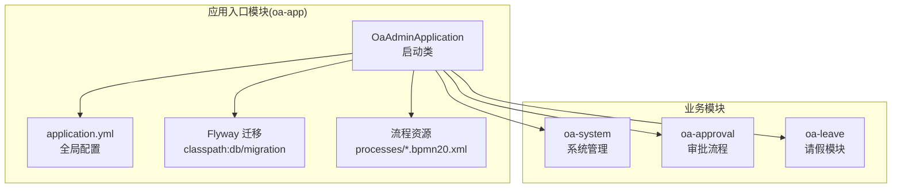
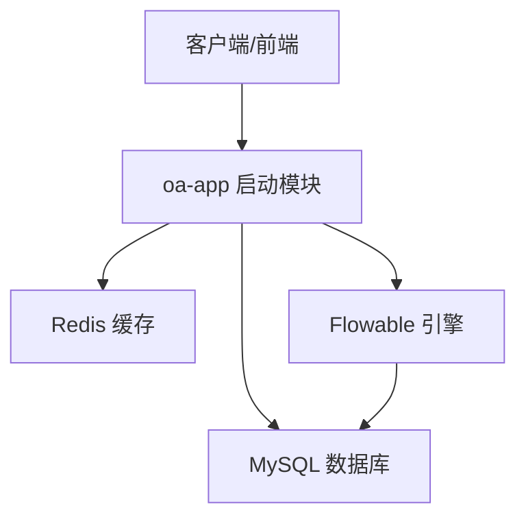
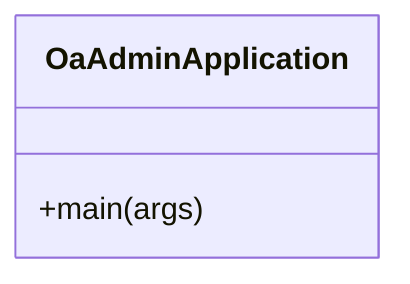
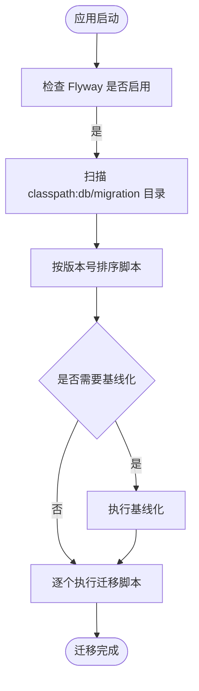
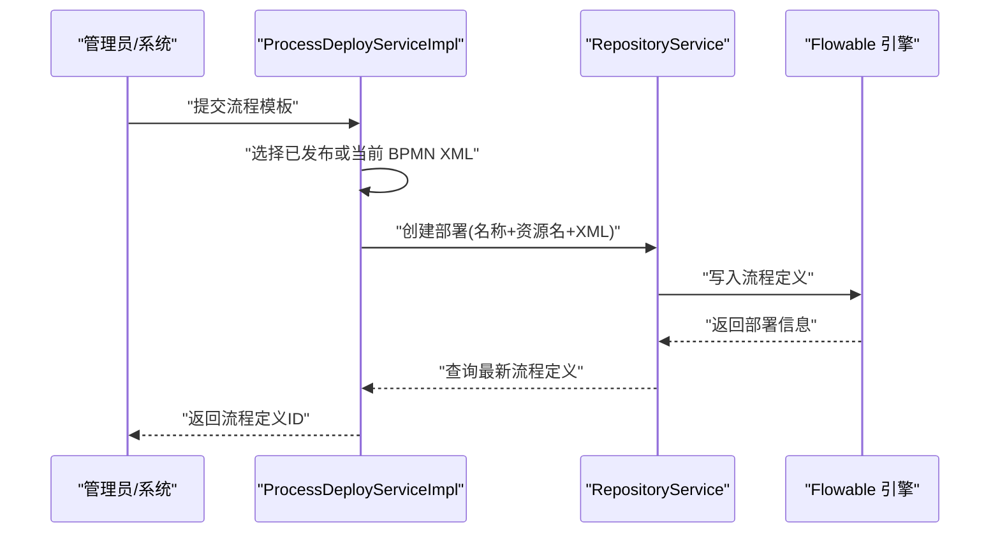
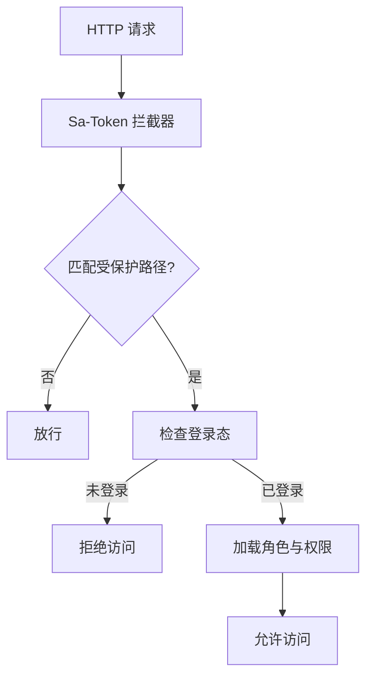
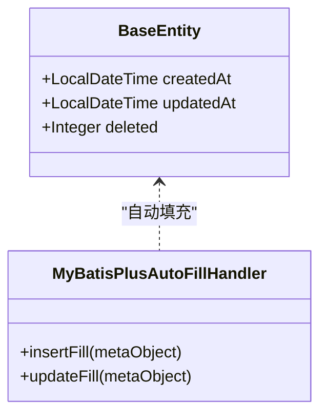
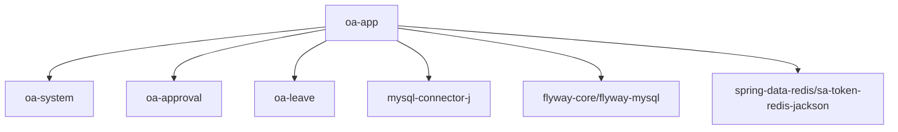

# 应用启动模块 (oa-app)

<cite>
**本文引用的文件**
- [OaAdminApplication.java](file://oa-app/src/main/java/com/oa/admin/OaAdminApplication.java)
- [application.yml](file://oa-app/src/main/resources/application.yml)
- [pom.xml](file://oa-app/pom.xml)
- [V1__init_sys_tables.sql](file://oa-app/src/main/resources/db/migration/V1__init_sys_tables.sql)
- [V2__init_biz_tables.sql](file://oa-app/src/main/resources/db/migration/V2__init_biz_tables.sql)
- [V3__seed_data.sql](file://oa-app/src/main/resources/db/migration/V3__seed_data.sql)
- [V4__phase2_flow_design.sql](file://oa-app/src/main/resources/db/migration/V4__phase2_flow_design.sql)
- [V5__phase3a_instance_enhancement.sql](file://oa-app/src/main/resources/db/migration/V5__phase3a_instance_enhancement.sql)
- [V6__phase3b_bug_fixes.sql](file://oa-app/src/main/resources/db/migration/V6__phase3b_bug_fixes.sql)
- [V7__phase3b_notification.sql](file://oa-app/src/main/resources/db/migration/V7__phase3b_notification.sql)
- [V8__leave_module.sql](file://oa-app/src/main/resources/db/migration/V8__leave_module.sql)
- [V9__leave_approval_integration.sql](file://oa-app/src/main/resources/db/migration/V9__leave_approval_integration.sql)
- [V10__leave_template_seed.sql](file://oa-app/src/main/resources/db/migration/V10__leave_template_seed.sql)
- [V11__system_management_permissions.sql](file://oa-app/src/main/resources/db/migration/V11__system_management_permissions.sql)
- [V12__leave_template_bpmn_diagram.sql](file://oa-app/src/main/resources/db/migration/V12__leave_template_bpmn_diagram.sql)
- [V13__approval_base_entity_columns.sql](file://oa-app/src/main/resources/db/migration/V13__approval_base_entity_columns.sql)
- [V14__leave_submit_permission.sql](file://oa-app/src/main/resources/db/migration/V14__leave_submit_permission.sql)
- [V15__fix_base_entity_columns.sql](file://oa-app/src/main/resources/db/migration/V15__fix_base_entity_columns.sql)
- [leave_request.bpmn20.xml](file://oa-app/src/main/resources/processes/leave_request.bpmn20.xml)
- [leave_request_v2.bpmn20.xml](file://oa-app/src/main/resources/processes/leave_request_v2.bpmn20.xml)
- [parallel_example.bpmn20.xml](file://oa-app/src/main/resources/processes/parallel_example.bpmn20.xml)
- [orsign_example.bpmn20.xml](file://oa-app/src/main/resources/processes/orsign_example.bpmn20.xml)
- [countersign_example.bpmn20.xml](file://oa-app/src/main/resources/processes/countersign_example.bpmn20.xml)
- [FlowableConfig.java](file://oa-approval/src/main/java/com/oa/admin/approval/config/FlowableConfig.java)
- [ProcessDeployServiceImpl.java](file://oa-approval/src/main/java/com/oa/admin/approval/service/impl/ProcessDeployServiceImpl.java)
- [ProcessEndEventListener.java](file://oa-approval/src/main/java/com/oa/admin/approval/listener/ProcessEndEventListener.java)
- [FlowableConstants.java](file://oa-approval/src/main/java/com/oa/admin/approval/constant/FlowableConstants.java)
- [BizProcessTemplate.java](file://oa-approval/src/main/java/com/oa/admin/approval/entity/BizProcessTemplate.java)
- [SaTokenConfig.java](file://oa-system/src/main/java/com/oa/admin/system/config/SaTokenConfig.java)
- [StpInterfaceImpl.java](file://oa-system/src/main/java/com/oa/admin/system/config/StpInterfaceImpl.java)
- [MyBatisPlusAutoFillHandler.java](file://oa-common/src/main/java/com/oa/admin/common/config/MyBatisPlusAutoFillHandler.java)
- [BaseEntity.java](file://oa-common/src/main/java/com/oa/admin/common/entity/BaseEntity.java)
</cite>

## 目录
1. [简介](#简介)
2. [项目结构](#项目结构)
3. [核心组件](#核心组件)
4. [架构总览](#架构总览)
5. [详细组件分析](#详细组件分析)
6. [依赖分析](#依赖分析)
7. [性能考虑](#性能考虑)
8. [故障排查指南](#故障排查指南)
9. [结论](#结论)
10. [附录](#附录)

## 简介
本文件为 oa-app 应用启动模块的架构文档，聚焦于系统入口点的设计与实现，涵盖 Spring Boot 启动配置、数据库迁移（Flyway）、流程文件部署与管理（Flowable）等核心能力。文档旨在帮助开发者与运维人员理解启动模块的职责边界、关键配置项以及各子模块的集成方式，并提供可操作的部署与运行指南。

## 项目结构
oa-app 作为系统入口模块，聚合了系统管理、审批、请假等业务模块，并通过 Spring Boot 自动装配完成启动配置。其核心职责包括：
- 启动 Spring Boot 应用上下文
- 配置数据源、Redis、MyBatis-Plus、Sa-Token、Flowable 等基础设施
- 执行 Flyway 数据库迁移
- 提供流程引擎事件监听与流程模板部署能力

图表来源
- [OaAdminApplication.java:11-18](file://oa-app/src/main/java/com/oa/admin/OaAdminApplication.java#L11-L18)
- [application.yml:1-59](file://oa-app/src/main/resources/application.yml#L1-L59)
- [pom.xml:14-26](file://oa-app/pom.xml#L14-L26)

章节来源
- [OaAdminApplication.java:11-18](file://oa-app/src/main/java/com/oa/admin/OaAdminApplication.java#L11-L18)
- [application.yml:1-59](file://oa-app/src/main/resources/application.yml#L1-L59)
- [pom.xml:14-26](file://oa-app/pom.xml#L14-L26)

## 核心组件
- 启动类与包扫描
  - 使用注解启用 Spring Boot 自动装配与事务管理，并指定 Mapper 接口扫描路径，覆盖系统、审批、请假模块的 Mapper 包。
  - 入口方法通过 SpringApplication 启动应用上下文。
- 数据源与连接池
  - 基于 MySQL 的 HikariCP 连接池配置，支持环境变量注入，包含连接池大小、超时、泄漏检测等参数。
- 缓存与会话
  - Redis 配置用于会话存储；Sa-Token 框架提供认证与授权拦截器。
- ORM 与自动填充
  - MyBatis-Plus 配置驼峰映射与逻辑删除字段；全局自动填充处理器统一处理创建与更新时间。
- 数据库迁移
  - Flyway 启用并指向 classpath:db/migration 目录，按版本号顺序执行 SQL 脚本，首次迁移自动基线化。
- 流程引擎
  - Flowable 引擎开启数据库模式自动更新；通过自定义配置注册事件监听器；流程模板通过 RepositoryService 部署。

章节来源
- [OaAdminApplication.java:11-18](file://oa-app/src/main/java/com/oa/admin/OaAdminApplication.java#L11-L18)
- [application.yml:4-59](file://oa-app/src/main/resources/application.yml#L4-L59)
- [MyBatisPlusAutoFillHandler.java:11-24](file://oa-common/src/main/java/com/oa/admin/common/config/MyBatisPlusAutoFillHandler.java#L11-L24)
- [BaseEntity.java:14-25](file://oa-common/src/main/java/com/oa/admin/common/entity/BaseEntity.java#L14-L25)

## 架构总览
下图展示了启动模块在整体系统中的角色与关键交互：

图表来源
- [application.yml:4-59](file://oa-app/src/main/resources/application.yml#L4-L59)
- [pom.xml:14-47](file://oa-app/pom.xml#L14-L47)

## 详细组件分析

### 启动类 OaAdminApplication
- 设计理念
  - 将多个业务模块以依赖形式聚合，集中进行基础设施配置与启动。
  - 明确 Mapper 扫描范围，确保 MyBatis-Plus 能正确发现各模块的 Mapper 接口。
  - 开启事务管理，保证数据库操作的一致性。
- 关键配置要点
  - 包扫描：系统、审批、请假模块的 Mapper 包路径。
  - 事务管理：启用注解驱动的声明式事务。
  - 启动入口：静态 main 方法调用 Spring Boot 启动器。

图表来源
- [OaAdminApplication.java:11-18](file://oa-app/src/main/java/com/oa/admin/OaAdminApplication.java#L11-L18)

章节来源
- [OaAdminApplication.java:11-18](file://oa-app/src/main/java/com/oa/admin/OaAdminApplication.java#L11-L18)

### 数据库迁移（Flyway）
- 实现机制
  - 启用 Flyway 并指定迁移脚本目录为 classpath:db/migration。
  - 版本命名采用 V<版本序号>__<描述>.sql，按序号升序执行。
  - 首次迁移自动进行基线化，避免历史表冲突。
- 迁移脚本示例
  - 初始化系统表、业务表、种子数据、流程设计、实例增强、缺陷修复、通知、请假模块、模板与权限等。
- 回滚策略
  - 代码中未显式配置回滚策略，建议生产环境谨慎变更，必要时通过新增版本脚本进行修正。

图表来源
- [application.yml:25-29](file://oa-app/src/main/resources/application.yml#L25-L29)
- [V1__init_sys_tables.sql:1-200](file://oa-app/src/main/resources/db/migration/V1__init_sys_tables.sql)
- [V2__init_biz_tables.sql:1-200](file://oa-app/src/main/resources/db/migration/V2__init_biz_tables.sql)
- [V3__seed_data.sql:1-200](file://oa-app/src/main/resources/db/migration/V3__seed_data.sql)
- [V4__phase2_flow_design.sql:1-200](file://oa-app/src/main/resources/db/migration/V4__phase2_flow_design.sql)
- [V5__phase3a_instance_enhancement.sql:1-200](file://oa-app/src/main/resources/db/migration/V5__phase3a_instance_enhancement.sql)
- [V6__phase3b_bug_fixes.sql:1-200](file://oa-app/src/main/resources/db/migration/V6__phase3b_bug_fixes.sql)
- [V7__phase3b_notification.sql:1-200](file://oa-app/src/main/resources/db/migration/V7__phase3b_notification.sql)
- [V8__leave_module.sql:1-200](file://oa-app/src/main/resources/db/migration/V8__leave_module.sql)
- [V9__leave_approval_integration.sql:1-200](file://oa-app/src/main/resources/db/migration/V9__leave_approval_integration.sql)
- [V10__leave_template_seed.sql:1-200](file://oa-app/src/main/resources/db/migration/V10__leave_template_seed.sql)
- [V11__system_management_permissions.sql:1-200](file://oa-app/src/main/resources/db/migration/V11__system_management_permissions.sql)
- [V12__leave_template_bpmn_diagram.sql:1-200](file://oa-app/src/main/resources/db/migration/V12__leave_template_bpmn_diagram.sql)
- [V13__approval_base_entity_columns.sql:1-200](file://oa-app/src/main/resources/db/migration/V13__approval_base_entity_columns.sql)
- [V14__leave_submit_permission.sql:1-200](file://oa-app/src/main/resources/db/migration/V14__leave_submit_permission.sql)
- [V15__fix_base_entity_columns.sql:1-200](file://oa-app/src/main/resources/db/migration/V15__fix_base_entity_columns.sql)

章节来源
- [application.yml:25-29](file://oa-app/src/main/resources/application.yml#L25-L29)

### 流程文件部署与管理（Flowable）
- 部署流程
  - 通过 RepositoryService 创建部署，使用模板的 key 作为资源名，将 BPMN XML 字符串写入流程引擎。
  - 查询最新版本的流程定义，返回流程定义 ID 供后续实例化使用。
- 管理与读取
  - 支持从已部署的 deployment 中读取 BPMN XML 内容，便于审计或导出。
- 事件监听
  - 在 FlowableConfig 中注册 ProcessEndEventListener，监听流程结束事件，计算最终审批状态并发布业务事件。

图表来源
- [ProcessDeployServiceImpl.java:28-58](file://oa-approval/src/main/java/com/oa/admin/approval/service/impl/ProcessDeployServiceImpl.java#L28-L58)
- [FlowableConfig.java:20-29](file://oa-approval/src/main/java/com/oa/admin/approval/config/FlowableConfig.java#L20-L29)
- [ProcessEndEventListener.java:34-62](file://oa-approval/src/main/java/com/oa/admin/approval/listener/ProcessEndEventListener.java#L34-L62)

章节来源
- [ProcessDeployServiceImpl.java:28-58](file://oa-approval/src/main/java/com/oa/admin/approval/service/impl/ProcessDeployServiceImpl.java#L28-L58)
- [FlowableConfig.java:15-29](file://oa-approval/src/main/java/com/oa/admin/approval/config/FlowableConfig.java#L15-L29)
- [ProcessEndEventListener.java:29-62](file://oa-approval/src/main/java/com/oa/admin/approval/listener/ProcessEndEventListener.java#L29-L62)

### 认证与授权（Sa-Token）
- 拦截器配置
  - 通过 SaTokenConfig 注册拦截器，对 /api/v1/** 路径进行登录校验，排除登录与注册接口。
- 权限接口实现
  - StpInterfaceImpl 根据用户角色查询权限列表与角色列表，结合状态过滤有效权限。

图表来源
- [SaTokenConfig.java:16-23](file://oa-system/src/main/java/com/oa/admin/system/config/SaTokenConfig.java#L16-L23)
- [StpInterfaceImpl.java:33-65](file://oa-system/src/main/java/com/oa/admin/system/config/StpInterfaceImpl.java#L33-L65)

章节来源
- [SaTokenConfig.java:13-24](file://oa-system/src/main/java/com/oa/admin/system/config/SaTokenConfig.java#L13-L24)
- [StpInterfaceImpl.java:26-65](file://oa-system/src/main/java/com/oa/admin/system/config/StpInterfaceImpl.java#L26-L65)

### ORM 与自动填充（MyBatis-Plus）
- 配置要点
  - 开启下划线到驼峰映射，提升字段命名一致性。
  - 定义逻辑删除字段 deleted 及其取值，实现软删除。
- 自动填充
  - MyBatisPlusAutoFillHandler 统一处理创建与更新时间字段，减少重复代码。

图表来源
- [BaseEntity.java:14-25](file://oa-common/src/main/java/com/oa/admin/common/entity/BaseEntity.java#L14-L25)
- [MyBatisPlusAutoFillHandler.java:12-24](file://oa-common/src/main/java/com/oa/admin/common/config/MyBatisPlusAutoFillHandler.java#L12-L24)

章节来源
- [application.yml:36-44](file://oa-app/src/main/resources/application.yml#L36-L44)
- [MyBatisPlusAutoFillHandler.java:11-24](file://oa-common/src/main/java/com/oa/admin/common/config/MyBatisPlusAutoFillHandler.java#L11-L24)
- [BaseEntity.java:14-25](file://oa-common/src/main/java/com/oa/admin/common/entity/BaseEntity.java#L14-L25)

## 依赖分析
- 模块依赖
  - oa-app 依赖 oa-system、oa-approval、oa-leave 三个业务模块，形成入口聚合。
- 外部依赖
  - MySQL Connector/J、Flyway（core/mysql）、Spring Data Redis、Sa-Token Redis Jackson、Lombok 等。

图表来源
- [pom.xml:14-57](file://oa-app/pom.xml#L14-L57)

章节来源
- [pom.xml:14-57](file://oa-app/pom.xml#L14-L57)

## 性能考虑
- 连接池参数
  - 通过环境变量控制最大池大小、空闲连接数、连接超时与生命周期，建议根据并发与数据库性能调优。
- 缓存与序列化
  - Redis 用于会话存储；Sa-Token 使用 JSON 序列化以降低安全风险。
- ORM 优化
  - 启用驼峰映射与逻辑删除，减少手写映射与条件判断开销。
- 流程引擎
  - 异步执行器默认关闭，避免不必要的异步任务开销；如需高并发流程，可评估开启并配合线程池配置。

## 故障排查指南
- 启动失败
  - 检查数据库连接参数与可达性，确认 JDBC 驱动存在且版本兼容。
  - 查看 Flyway 迁移日志，确认迁移脚本可被正确加载且无语法错误。
- 认证异常
  - 确认 Sa-Token 拦截器已生效，登录接口未被排除规则误拦截。
  - 检查 Redis 连接与会话存储可用性。
- 流程部署失败
  - 确认 BPMN XML 内容有效，资源名后缀符合约定。
  - 查看流程引擎日志，定位部署或查询流程定义阶段的异常。
- 数据不一致
  - 检查逻辑删除字段配置与查询条件，避免误删数据。
  - 确认自动填充处理器生效，插入/更新时间字段正确写入。

章节来源
- [application.yml:4-59](file://oa-app/src/main/resources/application.yml#L4-L59)
- [ProcessDeployServiceImpl.java:30-37](file://oa-approval/src/main/java/com/oa/admin/approval/service/impl/ProcessDeployServiceImpl.java#L30-L37)
- [ProcessEndEventListener.java:56-62](file://oa-approval/src/main/java/com/oa/admin/approval/listener/ProcessEndEventListener.java#L56-L62)

## 结论
oa-app 启动模块通过清晰的包扫描、完善的基础设施配置与模块化依赖，构建了稳定可靠的系统入口。Flyway 的版本化迁移保障了数据库演进的可控性，Flowable 的流程部署与事件监听实现了业务流程的可视化与自动化，Sa-Token 则提供了简洁高效的认证授权方案。结合合理的性能参数与故障排查策略，可确保系统在开发与生产环境中高效、安全地运行。

## 附录

### 配置文件说明（application.yml）
- 服务器端口
  - server.port：服务监听端口，默认 8080。
- 数据源与连接池
  - spring.datasource.url/username/password/driver-class-name：数据库连接信息。
  - spring.datasource.hikari.*：HikariCP 连接池参数，支持环境变量注入。
- 数据库迁移（Flyway）
  - spring.flyway.enabled：启用 Flyway。
  - spring.flyway.locations：迁移脚本位置 classpath:db/migration。
  - spring.flyway.baseline-on-migrate：首次迁移自动基线化。
  - spring.flyway.placeholder-replacement：占位符替换开关。
- 缓存（Redis）
  - spring.data.redis.host/port：Redis 地址与端口。
- ORM（MyBatis-Plus）
  - mybatis-plus.configuration.map-underscore-to-camel-case：开启驼峰映射。
  - mybatis-plus.global-config.db-config.logic-delete-field/value/not-delete-value：逻辑删除配置。
- 认证（Sa-Token）
  - sa-token.*：令牌名称、超时、并发共享、序列化等配置。
- 流程引擎（Flowable）
  - flowable.database-schema-update：数据库模式自动更新。
  - flowable.async-executor-activate：异步执行器开关。

章节来源
- [application.yml:1-59](file://oa-app/src/main/resources/application.yml#L1-L59)

### 部署指南
- 环境准备
  - 准备 MySQL 与 Redis 服务，确保网络可达。
  - 准备 Java 运行环境（推荐 JDK 17+）。
- 环境变量
  - 设置数据库连接相关变量（URL、用户名、密码），以及 Redis 主机与端口。
  - 可选：调整连接池与超时参数以适配生产环境。
- 构建与运行
  - 使用 Maven 构建项目，生成可执行 JAR。
  - 通过命令行启动应用，或使用容器编排工具部署。
- 验证
  - 访问健康检查端点与业务接口，确认认证、流程部署与数据库迁移均正常。