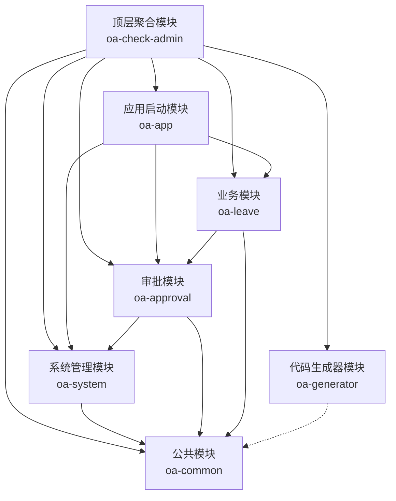
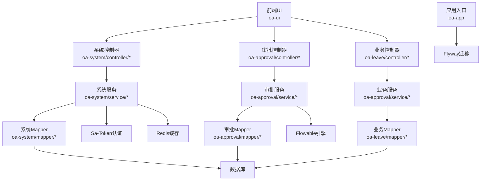
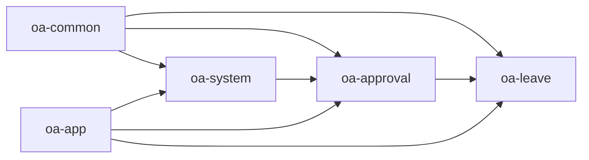
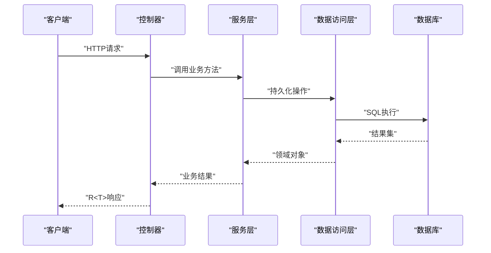
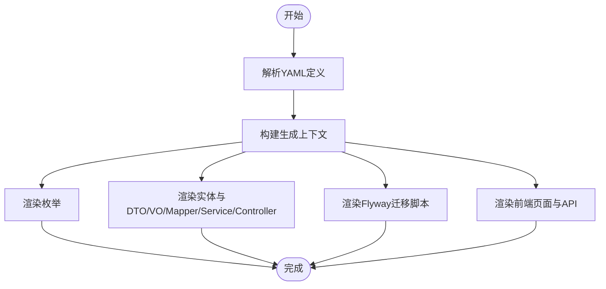
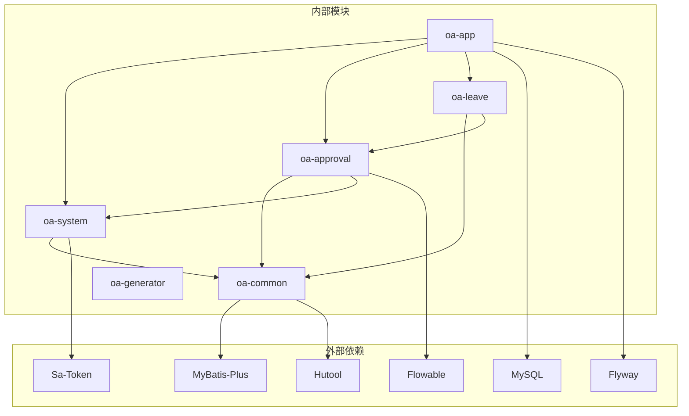

# 模块架构设计

<cite>
**本文档引用的文件**
- [pom.xml](file://pom.xml)
- [OaAdminApplication.java](file://oa-app/src/main/java/com/oa/admin/OaAdminApplication.java)
- [BaseEntity.java](file://oa-common/src/main/java/com/oa/admin/common/entity/BaseEntity.java)
- [R.java](file://oa-common/src/main/java/com/oa/admin/common/result/R.java)
- [SysUser.java](file://oa-system/src/main/java/com/oa/admin/system/entity/SysUser.java)
- [SaTokenConfig.java](file://oa-system/src/main/java/com/oa/admin/system/config/SaTokenConfig.java)
- [BizApprovalInstance.java](file://oa-approval/src/main/java/com/oa/admin/approval/entity/BizApprovalInstance.java)
- [FlowableConfig.java](file://oa-approval/src/main/java/com/oa/admin/approval/config/FlowableConfig.java)
- [LeaveRequest.java](file://oa-leave/src/main/java/com/oa/admin/leave/entity/LeaveRequest.java)
- [CodeGenerator.java](file://oa-generator/src/main/java/com/oa/admin/generator/engine/CodeGenerator.java)
- [oa-common/pom.xml](file://oa-common/pom.xml)
- [oa-system/pom.xml](file://oa-system/pom.xml)
- [oa-approval/pom.xml](file://oa-approval/pom.xml)
- [oa-leave/pom.xml](file://oa-leave/pom.xml)
- [oa-app/pom.xml](file://oa-app/pom.xml)
- [oa-generator/pom.xml](file://oa-generator/pom.xml)
</cite>

## 目录
1. [引言](#引言)
2. [项目结构](#项目结构)
3. [核心组件](#核心组件)
4. [架构总览](#架构总览)
5. [详细组件分析](#详细组件分析)
6. [依赖关系分析](#依赖关系分析)
7. [性能考虑](#性能考虑)
8. [故障排除指南](#故障排除指南)
9. [结论](#结论)

## 引言
本文件为OA审批管理系统提供模块架构设计文档，围绕Maven多模块设计理念与实现方式进行系统性阐述。文档涵盖模块划分原则、依赖关系管理、版本控制策略；明确各模块职责边界与功能定位（oa-common公共模块、oa-system系统管理模块、oa-approval审批模块、oa-leave业务模块、oa-generator代码生成器模块、oa-app应用启动模块）；解释模块间通信机制、数据传递方式与接口约定；提供模块依赖关系图与模块交互时序图；总结模块化设计带来的收益与挑战，并给出问题解决建议。

## 项目结构
本项目采用Maven聚合工程组织，顶层POM统一管理版本与依赖，子模块按功能域拆分，形成清晰的层次化结构：
- 聚合根：顶层pom.xml定义模块集合与全局版本锁定
- 公共层：oa-common提供通用实体、响应封装、异常处理等基础设施
- 领域层：oa-system负责RBAC系统管理；oa-approval负责工作流审批；oa-leave负责具体业务（如请假）
- 应用层：oa-app作为Spring Boot应用入口，聚合其他模块
- 工具层：oa-generator提供代码与数据库迁移脚本生成能力

图表来源
- [pom.xml:21-28](file://pom.xml#L21-L28)
- [oa-app/pom.xml:14-26](file://oa-app/pom.xml#L14-L26)
- [oa-system/pom.xml:14-18](file://oa-system/pom.xml#L14-L18)
- [oa-approval/pom.xml:14-22](file://oa-approval/pom.xml#L14-L22)
- [oa-leave/pom.xml:14-22](file://oa-leave/pom.xml#L14-L22)

章节来源
- [pom.xml:1-131](file://pom.xml#L1-L131)
- [oa-app/pom.xml:1-76](file://oa-app/pom.xml#L1-L76)

## 核心组件
- 公共基础层（oa-common）
  - 提供统一的实体基类、响应封装、异常处理与通用工具，确保各模块在数据模型与接口风格上的一致性
  - 关键对象：BaseEntity（统一审计字段与逻辑删除）、R（统一响应包装）

- 系统管理（oa-system）
  - 实现RBAC权限体系，包含用户、角色、部门、权限等核心实体与服务
  - 集成Sa-Token进行认证拦截与登录校验

- 审批流程（oa-approval）
  - 基于Flowable构建审批流程引擎，提供流程模板、实例、任务、抄送、通知、审计日志等能力
  - 通过事件监听器与解析器扩展流程行为

- 业务模块（oa-leave）
  - 具体业务示例，如请假申请，与审批模块解耦协作，通过关联审批实例ID打通流程闭环

- 应用入口（oa-app）
  - Spring Boot应用入口，统一扫描各模块Mapper包，整合数据库、Redis、Flyway等基础设施

- 代码生成器（oa-generator）
  - 读取YAML定义，基于FreeMarker模板批量生成后端Java代码、Mapper、Service、Controller、前端页面与API、数据库迁移脚本

章节来源
- [BaseEntity.java:1-26](file://oa-common/src/main/java/com/oa/admin/common/entity/BaseEntity.java#L1-L26)
- [R.java:1-44](file://oa-common/src/main/java/com/oa/admin/common/result/R.java#L1-L44)
- [SysUser.java:1-27](file://oa-system/src/main/java/com/oa/admin/system/entity/SysUser.java#L1-L27)
- [SaTokenConfig.java:1-25](file://oa-system/src/main/java/com/oa/admin/system/config/SaTokenConfig.java#L1-L25)
- [BizApprovalInstance.java:1-33](file://oa-approval/src/main/java/com/oa/admin/approval/entity/BizApprovalInstance.java#L1-L33)
- [FlowableConfig.java:1-31](file://oa-approval/src/main/java/com/oa/admin/approval/config/FlowableConfig.java#L1-L31)
- [LeaveRequest.java:1-48](file://oa-leave/src/main/java/com/oa/admin/leave/entity/LeaveRequest.java#L1-L48)
- [OaAdminApplication.java:1-19](file://oa-app/src/main/java/com/oa/admin/OaAdminApplication.java#L1-L19)
- [CodeGenerator.java:1-226](file://oa-generator/src/main/java/com/oa/admin/generator/engine/CodeGenerator.java#L1-L226)

## 架构总览
系统采用分层+领域驱动的模块化架构：
- 表现层：前端Vue应用（位于oa-ui目录），通过API与后端交互
- 控制层：各模块Controller接收请求，调用Service层
- 业务层：Service层编排领域逻辑，必要时跨模块协作
- 数据访问层：MyBatis-Plus Mapper访问数据库
- 基础设施层：Flowable流程引擎、Sa-Token认证、Redis缓存、Flyway迁移

图表来源
- [OaAdminApplication.java:13-13](file://oa-app/src/main/java/com/oa/admin/OaAdminApplication.java#L13-L13)
- [SaTokenConfig.java:17-22](file://oa-system/src/main/java/com/oa/admin/system/config/SaTokenConfig.java#L17-L22)
- [FlowableConfig.java:22-28](file://oa-approval/src/main/java/com/oa/admin/approval/config/FlowableConfig.java#L22-L28)

## 详细组件分析

### 模块划分原则与职责边界
- 分层原则：公共层（oa-common）向下不依赖其他模块，向上被所有业务模块复用
- 领域原则：oa-system专注RBAC，oa-approval专注流程，oa-leave专注业务场景
- 职责边界：各模块仅暴露必要的API与实体，避免交叉污染；跨模块协作通过接口或事件解耦

### 依赖关系与版本控制策略
- 版本集中管理：顶层POM使用dependencyManagement统一锁定MyBatis-Plus、Sa-Token、Flowable、Hutool、MySQL等版本
- 模块间依赖：oa-system依赖oa-common；oa-approval依赖oa-common与oa-system；oa-leave依赖oa-common与oa-approval；oa-app聚合三者并引入运行时依赖
- 外部依赖：各模块按需引入starter与运行时依赖，避免重复声明

图表来源
- [pom.xml:44-113](file://pom.xml#L44-L113)
- [oa-system/pom.xml:17-18](file://oa-system/pom.xml#L17-L18)
- [oa-approval/pom.xml:16-22](file://oa-approval/pom.xml#L16-L22)
- [oa-leave/pom.xml:15-22](file://oa-leave/pom.xml#L15-L22)
- [oa-app/pom.xml:17-26](file://oa-app/pom.xml#L17-L26)

章节来源
- [pom.xml:30-113](file://pom.xml#L30-L113)
- [oa-common/pom.xml:17-51](file://oa-common/pom.xml#L17-L51)
- [oa-system/pom.xml:14-36](file://oa-system/pom.xml#L14-L36)
- [oa-approval/pom.xml:14-40](file://oa-approval/pom.xml#L14-L40)
- [oa-leave/pom.xml:14-32](file://oa-leave/pom.xml#L14-L32)
- [oa-app/pom.xml:14-57](file://oa-app/pom.xml#L14-L57)

### 模块间通信机制与接口约定
- 统一响应：所有Controller返回R<T>，保证前后端契约一致
- 统一实体：各模块实体继承BaseEntity，确保createdAt/updatedAt/deleted等字段一致性
- 认证拦截：通过Sa-Token拦截器对/api/v1/**路径进行登录校验
- 流程集成：审批模块通过Flowable事件监听器与业务模块回调解耦

图表来源
- [R.java:21-42](file://oa-common/src/main/java/com/oa/admin/common/result/R.java#L21-L42)
- [BaseEntity.java:14-25](file://oa-common/src/main/java/com/oa/admin/common/entity/BaseEntity.java#L14-L25)
- [SaTokenConfig.java:16-22](file://oa-system/src/main/java/com/oa/admin/system/config/SaTokenConfig.java#L16-L22)

### 代码生成器模块（oa-generator）
- 输入：YAML定义文件（含模块配置、实体定义、枚举定义）
- 输出：后端Java代码（Entity/DTO/VO/Mapper/Service/ServiceImpl/Controller）、数据库迁移脚本、前端页面与API、路由片段
- 流程：解析YAML → 构建上下文 → FreeMarker渲染 → 写入目标模块 → 打印后续步骤提示

图表来源
- [CodeGenerator.java:27-63](file://oa-generator/src/main/java/com/oa/admin/generator/engine/CodeGenerator.java#L27-L63)
- [CodeGenerator.java:79-114](file://oa-generator/src/main/java/com/oa/admin/generator/engine/CodeGenerator.java#L79-L114)
- [CodeGenerator.java:116-133](file://oa-generator/src/main/java/com/oa/admin/generator/engine/CodeGenerator.java#L116-L133)
- [CodeGenerator.java:158-203](file://oa-generator/src/main/java/com/oa/admin/generator/engine/CodeGenerator.java#L158-L203)

章节来源
- [CodeGenerator.java:1-226](file://oa-generator/src/main/java/com/oa/admin/generator/engine/CodeGenerator.java#L1-L226)

## 依赖关系分析
- 模块内聚与耦合
  - oa-common高内聚、低耦合，向上被多个模块依赖
  - oa-system与oa-approval存在双向协作（系统为审批提供用户/权限数据，审批依赖系统进行鉴权）
  - oa-leave与oa-approval强相关（业务数据关联审批实例）
- 外部依赖
  - Flowable用于流程编排，Sa-Token用于认证授权，MyBatis-Plus用于数据访问，Hutool提供工具方法，MySQL/Flyway用于持久化与迁移

图表来源
- [pom.xml:44-113](file://pom.xml#L44-L113)
- [oa-approval/pom.xml:24-26](file://oa-approval/pom.xml#L24-L26)
- [oa-system/pom.xml:20-22](file://oa-system/pom.xml#L20-L22)
- [oa-app/pom.xml:28-47](file://oa-app/pom.xml#L28-L47)
- [oa-common/pom.xml:23-33](file://oa-common/pom.xml#L23-L33)

章节来源
- [pom.xml:1-131](file://pom.xml#L1-L131)
- [oa-common/pom.xml:17-51](file://oa-common/pom.xml#L17-L51)
- [oa-system/pom.xml:14-36](file://oa-system/pom.xml#L14-L36)
- [oa-approval/pom.xml:14-40](file://oa-approval/pom.xml#L14-L40)
- [oa-leave/pom.xml:14-32](file://oa-leave/pom.xml#L14-L32)
- [oa-app/pom.xml:14-57](file://oa-app/pom.xml#L14-L57)
- [oa-generator/pom.xml:16-49](file://oa-generator/pom.xml#L16-L49)

## 性能考虑
- 事务与连接池：统一在应用入口启用事务管理，结合Spring Boot默认连接池配置，避免跨模块重复配置
- 缓存策略：系统模块集成Redis缓存，提升用户会话与权限数据访问效率
- ORM优化：MyBatis-Plus自动填充与逻辑删除减少样板代码，降低出错概率
- 流程引擎：Flowable事件监听器异步化处理，避免阻塞主流程执行
- 生成器：代码生成器支持干运行（dry-run）与过滤实体，便于快速迭代与验证

## 故障排除指南
- 启动失败
  - 检查Mapper扫描路径是否包含新增模块的mapper包
  - 确认数据库连接与Flyway迁移脚本执行状态
- 权限问题
  - 核对Sa-Token拦截规则与API路径映射
  - 确认系统模块中权限种子数据已正确导入
- 流程异常
  - 查看Flowable事件监听器注册情况与日志输出
  - 核对流程模板与节点配置是否匹配业务需求
- 生成器使用
  - 使用dry-run模式预览生成内容，确认实体过滤与前端生成选项
  - 生成完成后按提示补充应用入口的Mapper扫描包与前端路由

章节来源
- [OaAdminApplication.java:13-13](file://oa-app/src/main/java/com/oa/admin/OaAdminApplication.java#L13-L13)
- [SaTokenConfig.java:16-22](file://oa-system/src/main/java/com/oa/admin/system/config/SaTokenConfig.java#L16-L22)
- [FlowableConfig.java:22-28](file://oa-approval/src/main/java/com/oa/admin/approval/config/FlowableConfig.java#L22-L28)
- [CodeGenerator.java:57-62](file://oa-generator/src/main/java/com/oa/admin/generator/engine/CodeGenerator.java#L57-L62)

## 结论
本项目通过Maven多模块架构实现了高内聚、低耦合的系统设计。公共模块承载通用能力，业务模块聚焦各自领域，应用模块统一装配与发布。配合统一响应、实体基类、认证拦截与流程引擎，系统具备良好的可维护性与扩展性。代码生成器进一步提升了开发效率与一致性。在实际落地中，应重点关注模块间接口契约、权限与流程配置、以及生成器的后续步骤执行，以确保模块化设计的价值得到充分发挥。