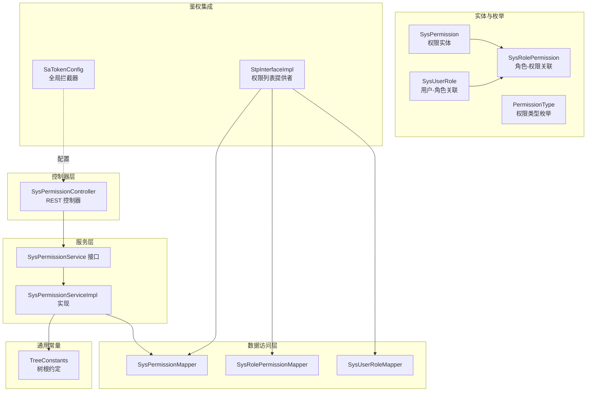
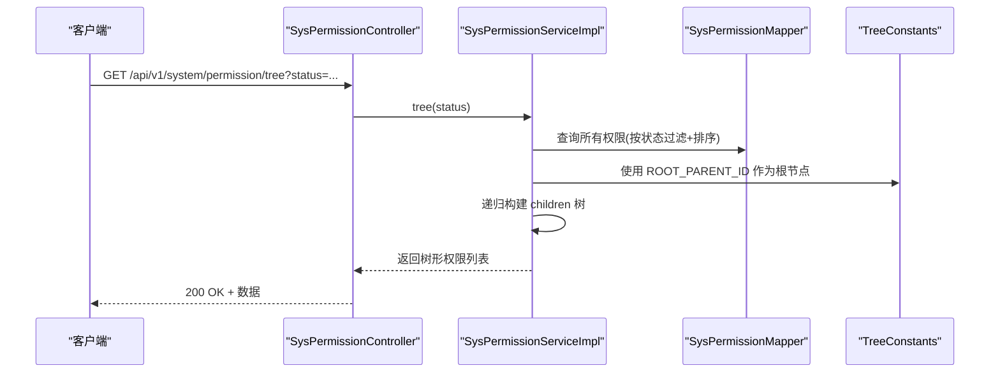
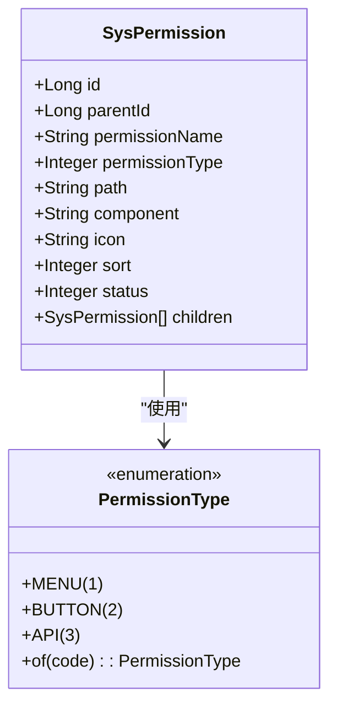
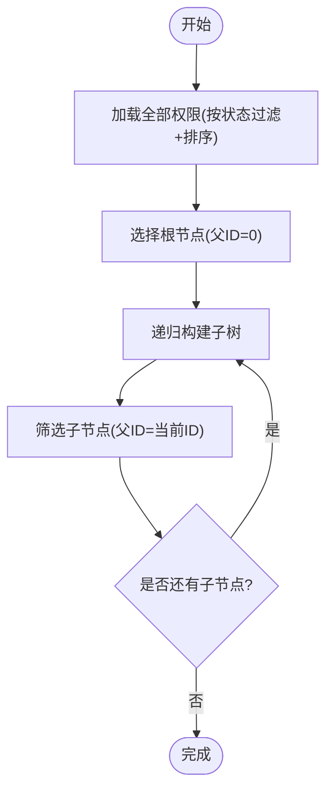
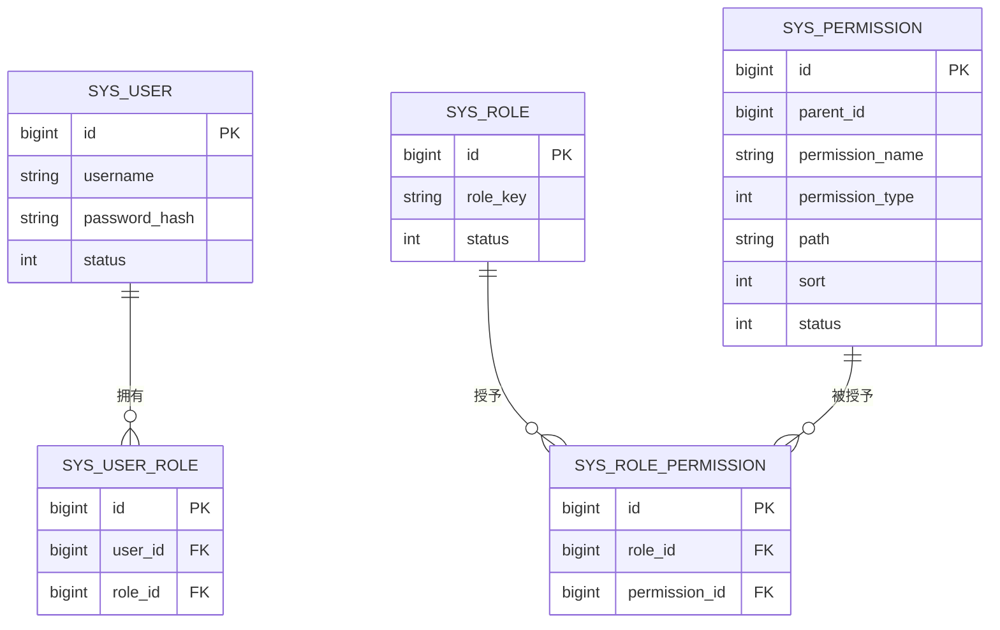
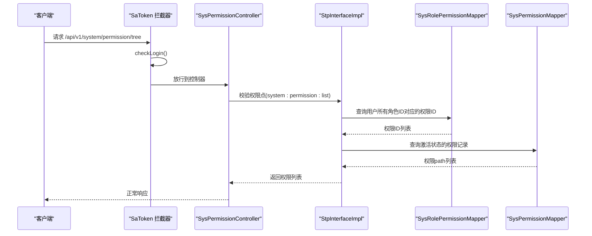
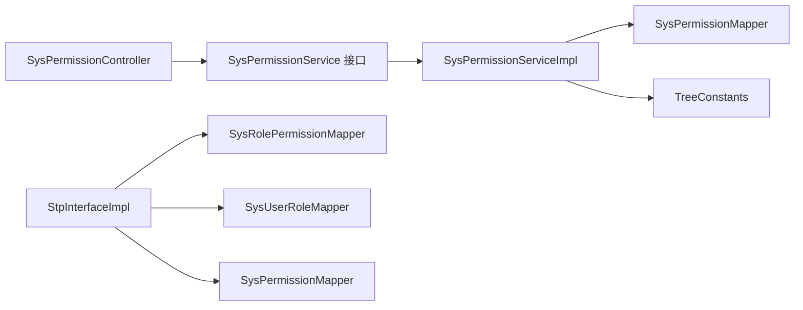

# 权限管理功能

<cite>
**本文引用的文件**
- [SysPermissionController.java](file://oa-system/src/main/java/com/oa/admin/system/controller/SysPermissionController.java)
- [SysPermissionService.java](file://oa-system/src/main/java/com/oa/admin/system/service/SysPermissionService.java)
- [SysPermissionServiceImpl.java](file://oa-system/src/main/java/com/oa/admin/system/service/impl/SysPermissionServiceImpl.java)
- [SysPermission.java](file://oa-system/src/main/java/com/oa/admin/system/entity/SysPermission.java)
- [PermissionType.java](file://oa-system/src/main/java/com/oa/admin/system/enums/PermissionType.java)
- [SysRolePermission.java](file://oa-system/src/main/java/com/oa/admin/system/entity/SysRolePermission.java)
- [SysUserRole.java](file://oa-system/src/main/java/com/oa/admin/system/entity/SysUserRole.java)
- [SysPermissionMapper.java](file://oa-system/src/main/java/com/oa/admin/system/mapper/SysPermissionMapper.java)
- [SysRolePermissionMapper.java](file://oa-system/src/main/java/com/oa/admin/system/mapper/SysRolePermissionMapper.java)
- [SysUserRoleMapper.java](file://oa-system/src/main/java/com/oa/admin/system/mapper/SysUserRoleMapper.java)
- [StpInterfaceImpl.java](file://oa-system/src/main/java/com/oa/admin/system/config/StpInterfaceImpl.java)
- [SaTokenConfig.java](file://oa-system/src/main/java/com/oa/admin/system/config/SaTokenConfig.java)
- [TreeConstants.java](file://oa-common/src/main/java/com/oa/admin/common/constant/TreeConstants.java)
- [system.ts](file://oa-ui/src/api/system.ts)
- [V11__system_management_permissions.sql](file://oa-app/src/main/resources/db/migration/V11__system_management_permissions.sql)
</cite>

## 目录
1. [简介](#简介)
2. [项目结构](#项目结构)
3. [核心组件](#核心组件)
4. [架构总览](#架构总览)
5. [详细组件分析](#详细组件分析)
6. [依赖分析](#依赖分析)
7. [性能考虑](#性能考虑)
8. [故障排除指南](#故障排除指南)
9. [结论](#结论)
10. [附录：API 接口文档](#附录api-接口文档)

## 简介
本文件系统性阐述权限管理功能的完整实现，涵盖权限类型分类（菜单权限、按钮权限、API 权限）、权限树形结构设计、权限与角色的关联关系、权限验证机制与继承规则，并对 SysPermissionController 的各接口进行逐项解析。同时提供权限数据模型设计说明、权限标识符规范、API 使用示例与常见问题排查建议。

## 项目结构
权限管理功能主要位于系统模块（oa-system），采用分层架构：
- 控制器层：SysPermissionController 提供 REST API
- 服务层：SysPermissionService 及其实现负责业务逻辑
- 数据访问层：MyBatis-Plus Mapper 负责持久化
- 实体与枚举：SysPermission、PermissionType 等
- 鉴权集成：Sa-Token 拦截器与自定义 StpInterface 实现
- 常量与工具：TreeConstants 提供树根节点约定

图表来源
- [SysPermissionController.java:1-63](file://oa-system/src/main/java/com/oa/admin/system/controller/SysPermissionController.java#L1-L63)
- [SysPermissionService.java:1-17](file://oa-system/src/main/java/com/oa/admin/system/service/SysPermissionService.java#L1-L17)
- [SysPermissionServiceImpl.java:1-41](file://oa-system/src/main/java/com/oa/admin/system/service/impl/SysPermissionServiceImpl.java#L1-L41)
- [SysPermission.java:1-35](file://oa-system/src/main/java/com/oa/admin/system/entity/SysPermission.java#L1-L35)
- [PermissionType.java:1-27](file://oa-system/src/main/java/com/oa/admin/system/enums/PermissionType.java#L1-L27)
- [SysRolePermission.java:1-19](file://oa-system/src/main/java/com/oa/admin/system/entity/SysRolePermission.java#L1-L19)
- [SysUserRole.java:1-19](file://oa-system/src/main/java/com/oa/admin/system/entity/SysUserRole.java#L1-L19)
- [SysPermissionMapper.java:1-13](file://oa-system/src/main/java/com/oa/admin/system/mapper/SysPermissionMapper.java#L1-L13)
- [SysRolePermissionMapper.java:1-13](file://oa-system/src/main/java/com/oa/admin/system/mapper/SysRolePermissionMapper.java#L1-L13)
- [SysUserRoleMapper.java:1-13](file://oa-system/src/main/java/com/oa/admin/system/mapper/SysUserRoleMapper.java#L1-L13)
- [StpInterfaceImpl.java:1-75](file://oa-system/src/main/java/com/oa/admin/system/config/StpInterfaceImpl.java#L1-L75)
- [SaTokenConfig.java:1-25](file://oa-system/src/main/java/com/oa/admin/system/config/SaTokenConfig.java#L1-L25)
- [TreeConstants.java:1-12](file://oa-common/src/main/java/com/oa/admin/common/constant/TreeConstants.java#L1-L12)

章节来源
- [SysPermissionController.java:1-63](file://oa-system/src/main/java/com/oa/admin/system/controller/SysPermissionController.java#L1-L63)
- [SysPermissionServiceImpl.java:1-41](file://oa-system/src/main/java/com/oa/admin/system/service/impl/SysPermissionServiceImpl.java#L1-L41)
- [StpInterfaceImpl.java:1-75](file://oa-system/src/main/java/com/oa/admin/system/config/StpInterfaceImpl.java#L1-L75)
- [SaTokenConfig.java:1-25](file://oa-system/src/main/java/com/oa/admin/system/config/SaTokenConfig.java#L1-L25)
- [TreeConstants.java:1-12](file://oa-common/src/main/java/com/oa/admin/common/constant/TreeConstants.java#L1-L12)

## 核心组件
- 权限实体与类型
  - 权限实体包含父级 ID、名称、类型、路径、组件、图标、排序、状态及子节点集合，支持树形结构渲染与递归构建。
  - 权限类型枚举定义三类权限：菜单、按钮、API，通过整型 code 表示并提供反查方法。
- 权限服务
  - 提供按状态过滤的列表查询与树形结构构建；树形构建基于通用树根常量与递归筛选。
- 控制器接口
  - 提供权限树、列表、详情、创建、更新、删除等标准 CRUD 接口，并在关键接口上标注权限点，由 Sa-Token 统一校验。
- 鉴权集成
  - 自定义 StpInterface 实现从用户-角色-权限三层关系中收集有效权限标识（path），供 Sa-Token 注解校验使用。
  - SaTokenConfig 全局拦截 /api/v1/** 并排除登录注册端点。

章节来源
- [SysPermission.java:1-35](file://oa-system/src/main/java/com/oa/admin/system/entity/SysPermission.java#L1-L35)
- [PermissionType.java:1-27](file://oa-system/src/main/java/com/oa/admin/system/enums/PermissionType.java#L1-L27)
- [SysPermissionService.java:1-17](file://oa-system/src/main/java/com/oa/admin/system/service/SysPermissionService.java#L1-L17)
- [SysPermissionServiceImpl.java:1-41](file://oa-system/src/main/java/com/oa/admin/system/service/impl/SysPermissionServiceImpl.java#L1-L41)
- [SysPermissionController.java:1-63](file://oa-system/src/main/java/com/oa/admin/system/controller/SysPermissionController.java#L1-L63)
- [StpInterfaceImpl.java:1-75](file://oa-system/src/main/java/com/oa/admin/system/config/StpInterfaceImpl.java#L1-L75)
- [SaTokenConfig.java:1-25](file://oa-system/src/main/java/com/oa/admin/system/config/SaTokenConfig.java#L1-L25)

## 架构总览
权限管理遵循“控制器-服务-数据访问-实体”的分层设计，配合 Sa-Token 完成统一鉴权与权限点校验。

图表来源
- [SysPermissionController.java:21-26](file://oa-system/src/main/java/com/oa/admin/system/controller/SysPermissionController.java#L21-L26)
- [SysPermissionServiceImpl.java:28-39](file://oa-system/src/main/java/com/oa/admin/system/service/impl/SysPermissionServiceImpl.java#L28-L39)
- [TreeConstants.java:6-11](file://oa-common/src/main/java/com/oa/admin/common/constant/TreeConstants.java#L6-L11)
- [SysPermissionMapper.java:1-13](file://oa-system/src/main/java/com/oa/admin/system/mapper/SysPermissionMapper.java#L1-L13)

## 详细组件分析

### 权限实体与类型设计
- 权限实体字段
  - 父级 ID：用于构建树形层级
  - 名称、路径、组件、图标、排序、状态：支撑前端渲染与后端校验
  - 子节点集合：用于树形序列化
- 权限类型枚举
  - 菜单（1）、按钮（2）、API（3）三种类型，提供 code 与反查方法，保证类型安全

图表来源
- [SysPermission.java:16-34](file://oa-system/src/main/java/com/oa/admin/system/entity/SysPermission.java#L16-L34)
- [PermissionType.java:9-26](file://oa-system/src/main/java/com/oa/admin/system/enums/PermissionType.java#L9-L26)

章节来源
- [SysPermission.java:1-35](file://oa-system/src/main/java/com/oa/admin/system/entity/SysPermission.java#L1-L35)
- [PermissionType.java:1-27](file://oa-system/src/main/java/com/oa/admin/system/enums/PermissionType.java#L1-L27)

### 权限树形结构设计
- 根节点约定：使用通用常量定义根节点父 ID 为 0
- 构建策略：先按状态过滤并排序，再以根节点为起点递归筛选子节点，形成 children 树
- 复杂度：单次构建时间复杂度近似 O(n)，空间复杂度 O(n)

图表来源
- [SysPermissionServiceImpl.java:28-39](file://oa-system/src/main/java/com/oa/admin/system/service/impl/SysPermissionServiceImpl.java#L28-L39)
- [TreeConstants.java:6-11](file://oa-common/src/main/java/com/oa/admin/common/constant/TreeConstants.java#L6-L11)

章节来源
- [SysPermissionServiceImpl.java:1-41](file://oa-system/src/main/java/com/oa/admin/system/service/impl/SysPermissionServiceImpl.java#L1-L41)
- [TreeConstants.java:1-12](file://oa-common/src/main/java/com/oa/admin/common/constant/TreeConstants.java#L1-L12)

### 权限与角色关联关系
- 用户-角色：SysUserRole 记录用户与角色的多对多映射
- 角色-权限：SysRolePermission 记录角色与权限的多对多映射
- 权限继承：用户通过角色间接获得权限，权限列表由角色聚合而来

图表来源
- [SysUserRole.java:11-18](file://oa-system/src/main/java/com/oa/admin/system/entity/SysUserRole.java#L11-L18)
- [SysRolePermission.java:11-18](file://oa-system/src/main/java/com/oa/admin/system/entity/SysRolePermission.java#L11-L18)
- [SysPermission.java:16-34](file://oa-system/src/main/java/com/oa/admin/system/entity/SysPermission.java#L16-L34)

章节来源
- [SysUserRole.java:1-19](file://oa-system/src/main/java/com/oa/admin/system/entity/SysUserRole.java#L1-L19)
- [SysRolePermission.java:1-19](file://oa-system/src/main/java/com/oa/admin/system/entity/SysRolePermission.java#L1-L19)

### 权限验证机制与继承规则
- 登录拦截：全局拦截器对 /api/v1/** 路径进行登录态校验
- 权限点校验：控制器接口使用注解声明权限点（如 system:permission:list）
- 权限列表提供：自定义 StpInterfaceImpl 依据用户-角色-权限链路聚合有效权限标识（path），供注解校验使用
- 继承规则：用户通过角色继承权限；仅当角色与权限均处于激活状态时生效

图表来源
- [SaTokenConfig.java:14-23](file://oa-system/src/main/java/com/oa/admin/system/config/SaTokenConfig.java#L14-L23)
- [SysPermissionController.java:21-26](file://oa-system/src/main/java/com/oa/admin/system/controller/SysPermissionController.java#L21-L26)
- [StpInterfaceImpl.java:33-52](file://oa-system/src/main/java/com/oa/admin/system/config/StpInterfaceImpl.java#L33-L52)

章节来源
- [SaTokenConfig.java:1-25](file://oa-system/src/main/java/com/oa/admin/system/config/SaTokenConfig.java#L1-L25)
- [StpInterfaceImpl.java:1-75](file://oa-system/src/main/java/com/oa/admin/system/config/StpInterfaceImpl.java#L1-L75)
- [SysPermissionController.java:1-63](file://oa-system/src/main/java/com/oa/admin/system/controller/SysPermissionController.java#L1-L63)

### SysPermissionController 接口实现
- 获取权限树
  - 方法：GET /api/v1/system/permission/tree
  - 参数：status（可选）
  - 权限点：system:permission:list
  - 行为：调用服务层 tree(status) 返回树形结构
- 获取权限列表
  - 方法：GET /api/v1/system/permission
  - 参数：status（可选）
  - 权限点：system:permission:list
  - 行为：调用服务层 listByStatus(status) 返回扁平列表
- 获取权限详情
  - 方法：GET /api/v1/system/permission/{id}
  - 权限点：system:permission:query
  - 行为：返回指定 ID 的权限信息
- 创建权限
  - 方法：POST /api/v1/system/permission
  - 权限点：system:permission:add
  - 行为：保存权限并返回新建对象
- 更新权限
  - 方法：PUT /api/v1/system/permission/{id}
  - 权限点：system:permission:edit
  - 行为：根据 ID 更新权限
- 删除权限
  - 方法：DELETE /api/v1/system/permission/{id}
  - 权限点：system:permission:remove
  - 行为：删除指定 ID 的权限

章节来源
- [SysPermissionController.java:21-61](file://oa-system/src/main/java/com/oa/admin/system/controller/SysPermissionController.java#L21-L61)

### 权限数据模型与路由配置
- 权限标识符设计
  - 使用 path 字段作为权限点标识，格式为“模块:资源:动作”，便于注解精确匹配
  - 初始数据中包含系统管理模块的权限点（角色、权限、部门相关）
- 路由配置
  - 前端通过 API 文件封装请求方法，与后端控制器路径保持一致
  - 后端控制器使用统一前缀 /api/v1/system/permission

章节来源
- [SysPermission.java:24-28](file://oa-system/src/main/java/com/oa/admin/system/entity/SysPermission.java#L24-L28)
- [system.ts:32-51](file://oa-ui/src/api/system.ts#L32-L51)
- [V11__system_management_permissions.sql:3-25](file://oa-app/src/main/resources/db/migration/V11__system_management_permissions.sql#L3-L25)

## 依赖分析
- 控制器依赖服务接口，服务实现依赖 Mapper 与通用常量
- 鉴权依赖用户-角色-权限三层关系映射
- 前端通过 API 文件调用后端接口

图表来源
- [SysPermissionController.java:19-20](file://oa-system/src/main/java/com/oa/admin/system/controller/SysPermissionController.java#L19-L20)
- [SysPermissionService.java:11-16](file://oa-system/src/main/java/com/oa/admin/system/service/SysPermissionService.java#L11-L16)
- [SysPermissionServiceImpl.java:17-39](file://oa-system/src/main/java/com/oa/admin/system/service/impl/SysPermissionServiceImpl.java#L17-L39)
- [SysPermissionMapper.java:10-12](file://oa-system/src/main/java/com/oa/admin/system/mapper/SysPermissionMapper.java#L10-L12)
- [TreeConstants.java:6-11](file://oa-common/src/main/java/com/oa/admin/common/constant/TreeConstants.java#L6-L11)
- [StpInterfaceImpl.java:28-51](file://oa-system/src/main/java/com/oa/admin/system/config/StpInterfaceImpl.java#L28-L51)

章节来源
- [SysPermissionController.java:1-63](file://oa-system/src/main/java/com/oa/admin/system/controller/SysPermissionController.java#L1-L63)
- [SysPermissionServiceImpl.java:1-41](file://oa-system/src/main/java/com/oa/admin/system/service/impl/SysPermissionServiceImpl.java#L1-L41)
- [StpInterfaceImpl.java:1-75](file://oa-system/src/main/java/com/oa/admin/system/config/StpInterfaceImpl.java#L1-L75)

## 性能考虑
- 树构建：单次 tree 调用为 O(n) 级别，适合中小规模权限集；若权限数量较大，建议引入缓存或懒加载子节点
- 过滤与排序：按状态过滤与排序在数据库层面完成，避免不必要的内存处理
- 鉴权查询：聚合用户权限时，先取角色 ID 再取权限 ID，最后一次性查询权限记录，减少多次往返

## 故障排除指南
- 无权限访问
  - 现象：接口返回未授权或被拦截
  - 排查：确认用户是否已分配角色；确认角色是否已授予对应权限点；确认权限与角色状态均为激活
- 权限树为空
  - 现象：树形接口返回空列表
  - 排查：检查 status 参数与数据库中权限状态；确认 TreeConstants 根节点约定是否正确
- 权限点不生效
  - 现象：注解校验失败但权限确实在角色中
  - 排查：确认 path 是否与注解一致；确认权限状态为激活；确认 Sa-Token 拦截器已启用

章节来源
- [StpInterfaceImpl.java:33-52](file://oa-system/src/main/java/com/oa/admin/system/config/StpInterfaceImpl.java#L33-L52)
- [SaTokenConfig.java:14-23](file://oa-system/src/main/java/com/oa/admin/system/config/SaTokenConfig.java#L14-L23)

## 结论
该权限管理方案以清晰的数据模型与分层架构为基础，结合 Sa-Token 实现统一鉴权与权限点校验。权限树形结构与类型枚举设计简洁高效，角色-权限继承机制明确，满足系统管理场景下的权限控制需求。建议在高并发与大规模权限场景下引入缓存与分页优化。

## 附录：API 接口文档

- 获取权限树
  - 方法：GET
  - 路径：/api/v1/system/permission/tree
  - 权限点：system:permission:list
  - 查询参数：
    - status：可选，权限状态
  - 响应：树形权限列表
  - 示例：[SysPermissionController.java:21-26](file://oa-system/src/main/java/com/oa/admin/system/controller/SysPermissionController.java#L21-L26)

- 获取权限列表
  - 方法：GET
  - 路径：/api/v1/system/permission
  - 权限点：system:permission:list
  - 查询参数：
    - status：可选，权限状态
  - 响应：权限列表
  - 示例：[SysPermissionController.java:28-33](file://oa-system/src/main/java/com/oa/admin/system/controller/SysPermissionController.java#L28-L33)

- 获取权限详情
  - 方法：GET
  - 路径：/api/v1/system/permission/{id}
  - 权限点：system:permission:query
  - 路径参数：
    - id：权限 ID
  - 响应：权限对象
  - 示例：[SysPermissionController.java:35-39](file://oa-system/src/main/java/com/oa/admin/system/controller/SysPermissionController.java#L35-L39)

- 创建权限
  - 方法：POST
  - 路径：/api/v1/system/permission
  - 权限点：system:permission:add
  - 请求体：权限对象
  - 响应：新建权限对象
  - 示例：[SysPermissionController.java:41-46](file://oa-system/src/main/java/com/oa/admin/system/controller/SysPermissionController.java#L41-L46)

- 更新权限
  - 方法：PUT
  - 路径：/api/v1/system/permission/{id}
  - 权限点：system:permission:edit
  - 路径参数：
    - id：权限 ID
  - 请求体：权限对象
  - 响应：更新后的权限对象
  - 示例：[SysPermissionController.java:48-54](file://oa-system/src/main/java/com/oa/admin/system/controller/SysPermissionController.java#L48-L54)

- 删除权限
  - 方法：DELETE
  - 路径：/api/v1/system/permission/{id}
  - 权限点：system:permission:remove
  - 路径参数：
    - id：权限 ID
  - 响应：空
  - 示例：[SysPermissionController.java:56-61](file://oa-system/src/main/java/com/oa/admin/system/controller/SysPermissionController.java#L56-L61)

- 前端调用示例（参考）
  - 获取权限树：[system.ts:33-35](file://oa-ui/src/api/system.ts#L33-L35)
  - 获取权限列表：[system.ts:37-39](file://oa-ui/src/api/system.ts#L37-L39)
  - 创建权限：[system.ts:41-43](file://oa-ui/src/api/system.ts#L41-L43)
  - 更新权限：[system.ts:45-47](file://oa-ui/src/api/system.ts#L45-L47)
  - 删除权限：[system.ts:49-51](file://oa-ui/src/api/system.ts#L49-L51)