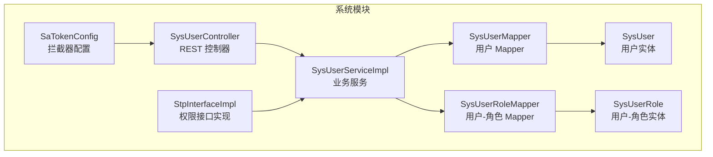
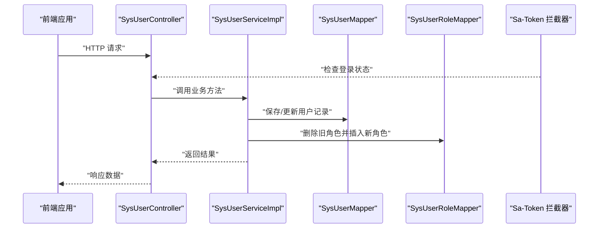
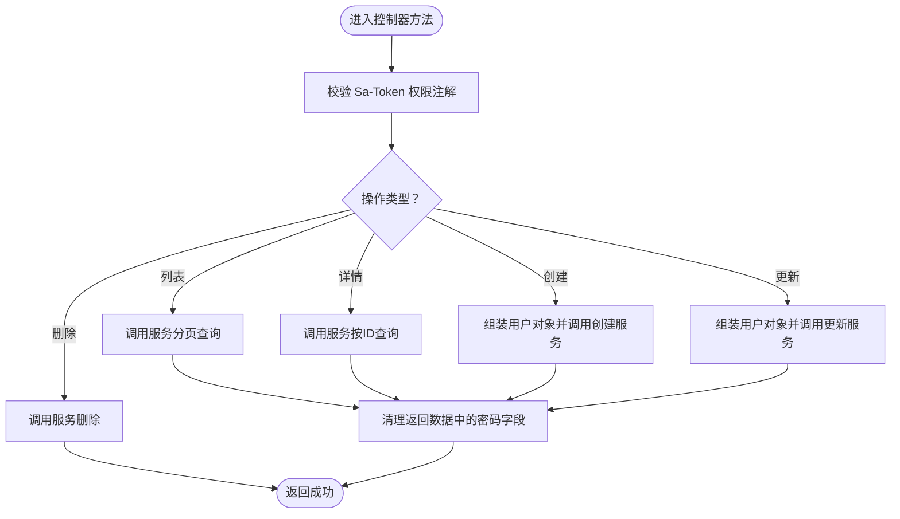
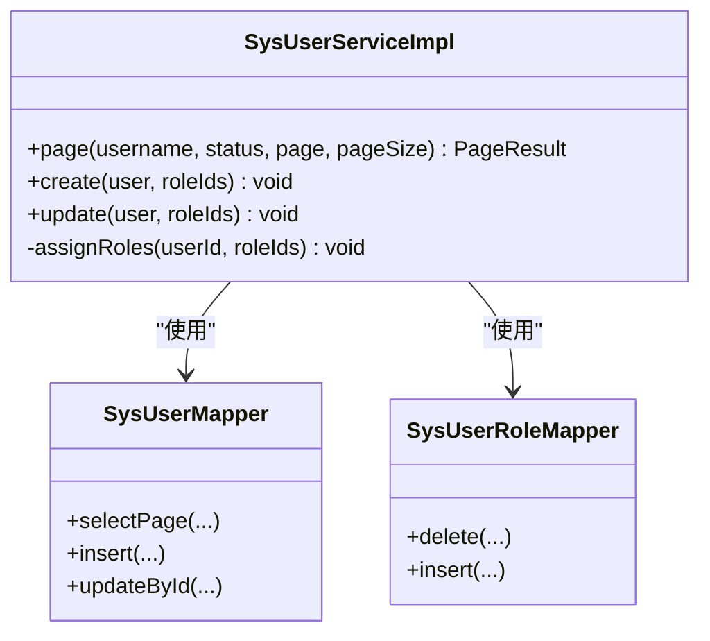
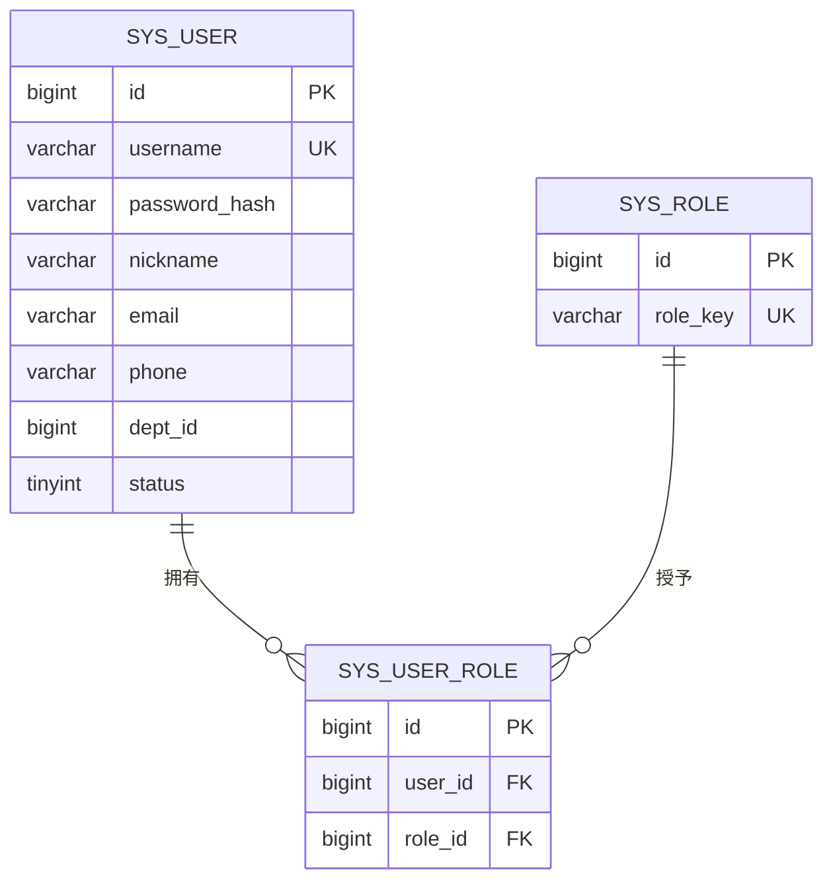
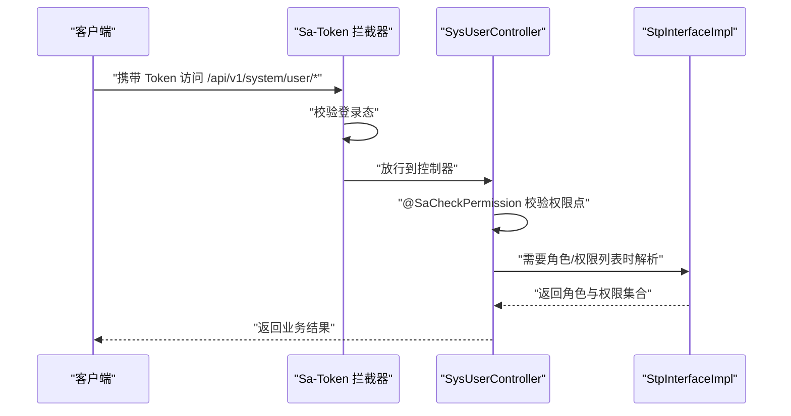
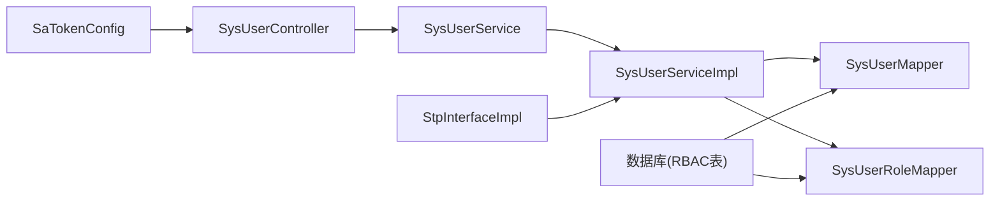

# 用户管理功能

<cite>
**本文引用的文件**
- [SysUserController.java](file://oa-system/src/main/java/com/oa/admin/system/controller/SysUserController.java)
- [SysUserService.java](file://oa-system/src/main/java/com/oa/admin/system/service/SysUserService.java)
- [SysUserServiceImpl.java](file://oa-system/src/main/java/com/oa/admin/system/service/impl/SysUserServiceImpl.java)
- [SysUser.java](file://oa-system/src/main/java/com/oa/admin/system/entity/SysUser.java)
- [SysUserRole.java](file://oa-system/src/main/java/com/oa/admin/system/entity/SysUserRole.java)
- [SysUserMapper.java](file://oa-system/src/main/java/com/oa/admin/system/mapper/SysUserMapper.java)
- [SysUserRoleMapper.java](file://oa-system/src/main/java/com/oa/admin/system/mapper/SysUserRoleMapper.java)
- [SaTokenConfig.java](file://oa-system/src/main/java/com/oa/admin/system/config/SaTokenConfig.java)
- [StpInterfaceImpl.java](file://oa-system/src/main/java/com/oa/admin/system/config/StpInterfaceImpl.java)
- [application.yml](file://oa-app/src/main/resources/application.yml)
- [V1__init_sys_tables.sql](file://oa-app/src/main/resources/db/migration/V1__init_sys_tables.sql)
- [V11__system_management_permissions.sql](file://oa-app/src/main/resources/db/migration/V11__system_management_permissions.sql)
- [user.ts](file://oa-ui/src/api/user.ts)
</cite>

## 目录
1. [简介](#简介)
2. [项目结构](#项目结构)
3. [核心组件](#核心组件)
4. [架构总览](#架构总览)
5. [详细组件分析](#详细组件分析)
6. [依赖分析](#依赖分析)
7. [性能考虑](#性能考虑)
8. [故障排查指南](#故障排查指南)
9. [结论](#结论)
10. [附录：API 接口文档与使用示例](#附录api-接口文档与使用示例)

## 简介
本文件面向“用户管理”功能，系统性阐述后端控制器、服务层、数据模型、权限控制与前端交互的完整实现。重点覆盖：
- 用户 CRUD 操作（列表、详情、创建、更新、删除）
- 用户状态管理与密码处理机制（BCrypt 哈希）
- 用户与角色的多对多关联关系维护
- 基于 Sa-Token 的权限注解与拦截器配置
- 完整的 API 接口定义与使用示例

## 项目结构
用户管理相关代码位于 oa-system 模块，采用分层架构：
- 控制器层：SysUserController 提供 REST API
- 服务层：SysUserService 接口及其实现 SysUserServiceImpl
- 数据访问层：MyBatis-Plus Mapper 接口
- 实体层：SysUser、SysUserRole 等
- 权限控制：Sa-Token 配置与自定义 StpInterface 实现

图表来源
- [SysUserController.java:1-85](file://oa-system/src/main/java/com/oa/admin/system/controller/SysUserController.java#L1-L85)
- [SysUserServiceImpl.java:1-73](file://oa-system/src/main/java/com/oa/admin/system/service/impl/SysUserServiceImpl.java#L1-L73)
- [SysUserMapper.java:1-13](file://oa-system/src/main/java/com/oa/admin/system/mapper/SysUserMapper.java#L1-L13)
- [SysUserRoleMapper.java:1-13](file://oa-system/src/main/java/com/oa/admin/system/mapper/SysUserRoleMapper.java#L1-L13)
- [SysUser.java:1-27](file://oa-system/src/main/java/com/oa/admin/system/entity/SysUser.java#L1-L27)
- [SysUserRole.java:1-19](file://oa-system/src/main/java/com/oa/admin/system/entity/SysUserRole.java#L1-L19)
- [SaTokenConfig.java:1-25](file://oa-system/src/main/java/com/oa/admin/system/config/SaTokenConfig.java#L1-L25)
- [StpInterfaceImpl.java:1-75](file://oa-system/src/main/java/com/oa/admin/system/config/StpInterfaceImpl.java#L1-L75)

章节来源
- [SysUserController.java:1-85](file://oa-system/src/main/java/com/oa/admin/system/controller/SysUserController.java#L1-L85)
- [SysUserServiceImpl.java:1-73](file://oa-system/src/main/java/com/oa/admin/system/service/impl/SysUserServiceImpl.java#L1-L73)
- [application.yml:1-59](file://oa-app/src/main/resources/application.yml#L1-L59)

## 核心组件
- SysUserController：提供 /api/v1/system/user 路径下的用户管理接口，使用 Sa-Token 注解进行权限校验。
- SysUserService/SysUserServiceImpl：封装用户分页查询、创建、更新（含密码哈希）、角色分配等业务逻辑。
- 实体与映射：SysUser、SysUserRole 及其 Mapper，支撑用户与角色的多对多关系持久化。
- 权限控制：全局拦截器强制登录，自定义 StpInterfaceImpl 将用户角色映射为角色标识与权限路径。

章节来源
- [SysUserController.java:23-83](file://oa-system/src/main/java/com/oa/admin/system/controller/SysUserController.java#L23-L83)
- [SysUserService.java:12-19](file://oa-system/src/main/java/com/oa/admin/system/service/SysUserService.java#L12-L19)
- [SysUserServiceImpl.java:27-71](file://oa-system/src/main/java/com/oa/admin/system/service/impl/SysUserServiceImpl.java#L27-L71)
- [SysUser.java:16-26](file://oa-system/src/main/java/com/oa/admin/system/entity/SysUser.java#L16-L26)
- [SysUserRole.java:13-18](file://oa-system/src/main/java/com/oa/admin/system/entity/SysUserRole.java#L13-L18)
- [SaTokenConfig.java:16-23](file://oa-system/src/main/java/com/oa/admin/system/config/SaTokenConfig.java#L16-L23)
- [StpInterfaceImpl.java:33-65](file://oa-system/src/main/java/com/oa/admin/system/config/StpInterfaceImpl.java#L33-L65)

## 架构总览
用户管理的请求流从控制器到服务层再到数据访问层，同时受 Sa-Token 全局拦截器保护，并通过自定义接口解析用户的角色与权限。

图表来源
- [SysUserController.java:23-83](file://oa-system/src/main/java/com/oa/admin/system/controller/SysUserController.java#L23-L83)
- [SysUserServiceImpl.java:38-71](file://oa-system/src/main/java/com/oa/admin/system/service/impl/SysUserServiceImpl.java#L38-L71)
- [SysUserMapper.java:10-12](file://oa-system/src/main/java/com/oa/admin/system/mapper/SysUserMapper.java#L10-L12)
- [SysUserRoleMapper.java:10-12](file://oa-system/src/main/java/com/oa/admin/system/mapper/SysUserRoleMapper.java#L10-L12)
- [SaTokenConfig.java:16-23](file://oa-system/src/main/java/com/oa/admin/system/config/SaTokenConfig.java#L16-L23)

## 详细组件分析

### 控制器层：SysUserController
- 列表查询：支持按用户名模糊匹配、状态过滤、分页参数；权限点 system:user:list。
- 详情获取：按 ID 查询用户，返回前清除敏感字段 passwordHash；权限点 system:user:query。
- 创建用户：接收用户名、昵称、密码明文、邮箱、电话、部门 ID、状态、角色 ID 列表；权限点 system:user:add。
- 更新用户：接收部分字段更新，密码为空则不更新；权限点 system:user:edit。
- 删除用户：按 ID 删除；权限点 system:user:remove。

图表来源
- [SysUserController.java:23-83](file://oa-system/src/main/java/com/oa/admin/system/controller/SysUserController.java#L23-L83)
- [SysUserServiceImpl.java:34-35](file://oa-system/src/main/java/com/oa/admin/system/service/impl/SysUserServiceImpl.java#L34-L35)

章节来源
- [SysUserController.java:23-83](file://oa-system/src/main/java/com/oa/admin/system/controller/SysUserController.java#L23-L83)

### 服务层：SysUserServiceImpl
- 分页查询：根据条件构造查询包装器，按创建时间倒序，返回前清理密码字段。
- 创建用户：对密码使用 BCrypt 哈希后保存，随后批量写入用户-角色关联。
- 更新用户：若提交了新密码则哈希后更新，否则保留原密码；可选更新角色关联。
- 角色分配：先删除旧关联，再插入新关联，保证一致性。

图表来源
- [SysUserServiceImpl.java:27-71](file://oa-system/src/main/java/com/oa/admin/system/service/impl/SysUserServiceImpl.java#L27-L71)
- [SysUserMapper.java:10-12](file://oa-system/src/main/java/com/oa/admin/system/mapper/SysUserMapper.java#L10-L12)
- [SysUserRoleMapper.java:10-12](file://oa-system/src/main/java/com/oa/admin/system/mapper/SysUserRoleMapper.java#L10-L12)

章节来源
- [SysUserServiceImpl.java:27-71](file://oa-system/src/main/java/com/oa/admin/system/service/impl/SysUserServiceImpl.java#L27-L71)

### 数据模型与关联关系
- SysUser：用户主表，包含用户名、密码哈希、昵称、邮箱、电话、部门 ID、状态等字段。
- SysUserRole：用户-角色关联表，唯一约束确保同一用户不可重复绑定相同角色。
- 关系图：

图表来源
- [SysUser.java:16-26](file://oa-system/src/main/java/com/oa/admin/system/entity/SysUser.java#L16-L26)
- [SysUserRole.java:13-18](file://oa-system/src/main/java/com/oa/admin/system/entity/SysUserRole.java#L13-L18)
- [V1__init_sys_tables.sql:18-83](file://oa-app/src/main/resources/db/migration/V1__init_sys_tables.sql#L18-L83)

章节来源
- [SysUser.java:16-26](file://oa-system/src/main/java/com/oa/admin/system/entity/SysUser.java#L16-L26)
- [SysUserRole.java:13-18](file://oa-system/src/main/java/com/oa/admin/system/entity/SysUserRole.java#L13-L18)
- [V1__init_sys_tables.sql:18-83](file://oa-app/src/main/resources/db/migration/V1__init_sys_tables.sql#L18-L83)

### 密码处理机制
- 创建时：对提交的明文密码执行 BCrypt 哈希后存入数据库。
- 更新时：若提交了新密码则哈希后更新；若未提交则保持原密码不变。
- 返回数据：所有场景在返回前均会清理 passwordHash 字段，避免敏感信息泄露。

章节来源
- [SysUserServiceImpl.java:39-58](file://oa-system/src/main/java/com/oa/admin/system/service/impl/SysUserServiceImpl.java#L39-L58)

### 用户状态管理
- 状态字段为整型（例如 1 正常、0 停用），支持在查询时作为过滤条件。
- 在创建与更新接口中均可设置或变更状态值。

章节来源
- [SysUser.java:24-26](file://oa-system/src/main/java/com/oa/admin/system/entity/SysUser.java#L24-L26)
- [SysUserController.java:25-30](file://oa-system/src/main/java/com/oa/admin/system/controller/SysUserController.java#L25-L30)
- [SysUserServiceImpl.java:28-36](file://oa-system/src/main/java/com/oa/admin/system/service/impl/SysUserServiceImpl.java#L28-L36)

### 权限控制机制
- 全局拦截：除登录注册外，所有 /api/v1/** 接口均需登录态。
- 方法级权限：控制器方法使用 @SaCheckPermission 注解声明所需权限点。
- 权限解析：自定义 StpInterfaceImpl 将用户角色映射为角色标识与权限路径，供鉴权使用。

图表来源
- [SaTokenConfig.java:16-23](file://oa-system/src/main/java/com/oa/admin/system/config/SaTokenConfig.java#L16-L23)
- [SysUserController.java:24-82](file://oa-system/src/main/java/com/oa/admin/system/controller/SysUserController.java#L24-L82)
- [StpInterfaceImpl.java:33-65](file://oa-system/src/main/java/com/oa/admin/system/config/StpInterfaceImpl.java#L33-L65)

章节来源
- [SaTokenConfig.java:16-23](file://oa-system/src/main/java/com/oa/admin/system/config/SaTokenConfig.java#L16-L23)
- [StpInterfaceImpl.java:33-65](file://oa-system/src/main/java/com/oa/admin/system/config/StpInterfaceImpl.java#L33-L65)
- [V11__system_management_permissions.sql:3-46](file://oa-app/src/main/resources/db/migration/V11__system_management_permissions.sql#L3-L46)

## 依赖分析
- 控制器依赖服务接口，服务实现依赖 Mapper 接口。
- 权限控制通过 Sa-Token 拦截器与自定义接口实现。
- 数据库层面由 Flyway 初始化系统 RBAC 表结构与初始权限数据。

图表来源
- [SysUserController.java:21-21](file://oa-system/src/main/java/com/oa/admin/system/controller/SysUserController.java#L21-L21)
- [SysUserService.java:12-19](file://oa-system/src/main/java/com/oa/admin/system/service/SysUserService.java#L12-L19)
- [SysUserServiceImpl.java:24-25](file://oa-system/src/main/java/com/oa/admin/system/service/impl/SysUserServiceImpl.java#L24-L25)
- [SysUserMapper.java:10-12](file://oa-system/src/main/java/com/oa/admin/system/mapper/SysUserMapper.java#L10-L12)
- [SysUserRoleMapper.java:10-12](file://oa-system/src/main/java/com/oa/admin/system/mapper/SysUserRoleMapper.java#L10-L12)
- [SaTokenConfig.java:16-23](file://oa-system/src/main/java/com/oa/admin/system/config/SaTokenConfig.java#L16-L23)
- [StpInterfaceImpl.java:28-31](file://oa-system/src/main/java/com/oa/admin/system/config/StpInterfaceImpl.java#L28-L31)
- [V1__init_sys_tables.sql:18-83](file://oa-app/src/main/resources/db/migration/V1__init_sys_tables.sql#L18-L83)

章节来源
- [SysUserServiceImpl.java:24-25](file://oa-system/src/main/java/com/oa/admin/system/service/impl/SysUserServiceImpl.java#L24-L25)
- [V1__init_sys_tables.sql:18-83](file://oa-app/src/main/resources/db/migration/V1__init_sys_tables.sql#L18-L83)

## 性能考虑
- 分页查询：服务层对用户表进行分页并按创建时间倒序，适合大数据量场景。
- 密码哈希：BCrypt 哈希在创建与更新时执行，建议在高并发下关注哈希成本与数据库事务开销。
- 角色批量写入：更新时先清空旧关联再批量插入，注意在角色数量较大时的事务与索引性能。
- 缓存策略：当前未见 Redis 缓存用户角色/权限，可在 StpInterfaceImpl 中引入缓存以降低频繁查询。

## 故障排查指南
- 登录态缺失：确认请求头携带 Token，且未命中排除路径（登录/注册）。
- 权限不足：检查用户是否具备对应权限点（如 system:user:list），以及角色-权限映射是否正确。
- 密码问题：创建/更新时未传密码将导致密码字段被清理或保持不变，需确保提交了有效的新密码。
- 角色分配异常：更新用户时若未传 roleIds，则不会修改角色关联；传入空数组将清空角色。

章节来源
- [SaTokenConfig.java:16-23](file://oa-system/src/main/java/com/oa/admin/system/config/SaTokenConfig.java#L16-L23)
- [StpInterfaceImpl.java:33-65](file://oa-system/src/main/java/com/oa/admin/system/config/StpInterfaceImpl.java#L33-L65)
- [SysUserServiceImpl.java:55-71](file://oa-system/src/main/java/com/oa/admin/system/service/impl/SysUserServiceImpl.java#L55-L71)

## 结论
用户管理功能以清晰的分层架构实现，结合 Sa-Token 完成统一登录与权限控制，配合 BCrypt 安全处理密码，通过用户-角色关联实现灵活的权限分配。整体设计满足企业级系统的安全与扩展需求。

## 附录：API 接口文档与使用示例

### 接口概览
- 列表查询：GET /api/v1/system/user
- 详情获取：GET /api/v1/system/user/{id}
- 用户创建：POST /api/v1/system/user
- 用户更新：PUT /api/v1/system/user/{id}
- 用户删除：DELETE /api/v1/system/user/{id}

参数与返回
- 列表查询支持分页参数与过滤条件（用户名、状态）。
- 详情返回会清理密码字段。
- 创建/更新接口支持传入角色 ID 列表，用于一次性绑定多个角色。

章节来源
- [SysUserController.java:23-83](file://oa-system/src/main/java/com/oa/admin/system/controller/SysUserController.java#L23-L83)
- [user.ts:3-21](file://oa-ui/src/api/user.ts#L3-L21)

### 使用示例（前端调用）
- 获取用户列表：传入分页与可选过滤条件
- 获取用户详情：传入用户 ID
- 创建用户：传入用户名、昵称、密码、邮箱、电话、部门 ID、状态、角色 ID 列表
- 更新用户：传入用户 ID 与部分字段（密码为空则不更新）
- 删除用户：传入用户 ID

章节来源
- [user.ts:3-21](file://oa-ui/src/api/user.ts#L3-L21)