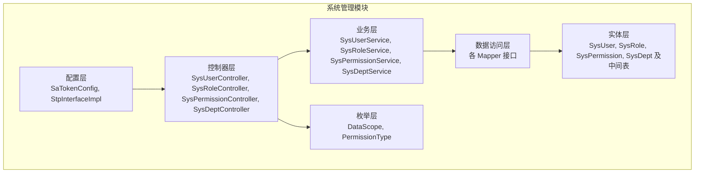
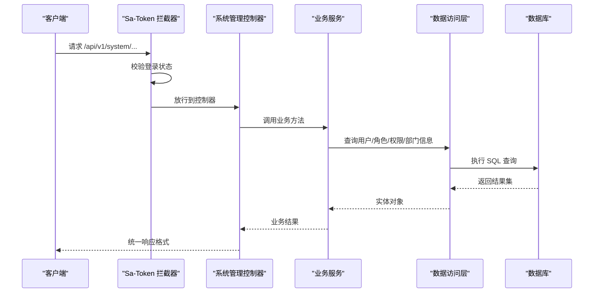
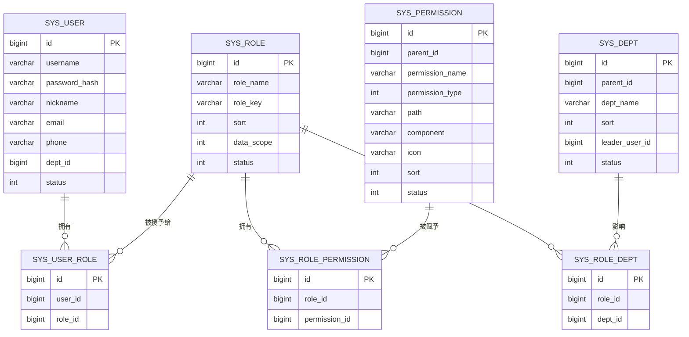
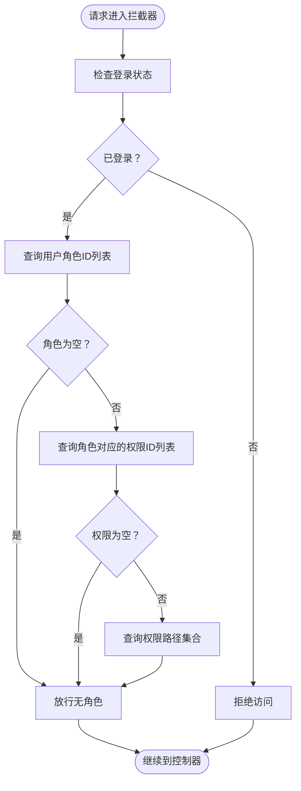
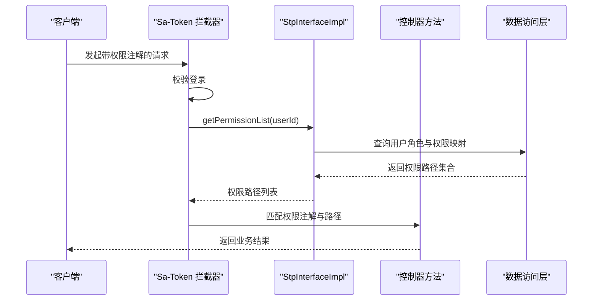
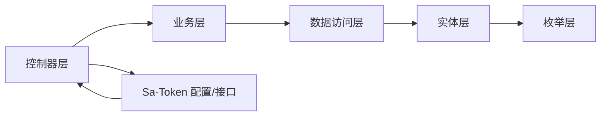

# 系统管理模块 (oa-system) 架构文档

<cite>
**本文档引用的文件**
- [SaTokenConfig.java](file://oa-system/src/main/java/com/oa/admin/system/config/SaTokenConfig.java)
- [StpInterfaceImpl.java](file://oa-system/src/main/java/com/oa/admin/system/config/StpInterfaceImpl.java)
- [SysUserController.java](file://oa-system/src/main/java/com/oa/admin/system/controller/SysUserController.java)
- [SysRoleController.java](file://oa-system/src/main/java/com/oa/admin/system/controller/SysRoleController.java)
- [SysPermissionController.java](file://oa-system/src/main/java/com/oa/admin/system/controller/SysPermissionController.java)
- [SysDeptController.java](file://oa-system/src/main/java/com/oa/admin/system/controller/SysDeptController.java)
- [SysUser.java](file://oa-system/src/main/java/com/oa/admin/system/entity/SysUser.java)
- [SysRole.java](file://oa-system/src/main/java/com/oa/admin/system/entity/SysRole.java)
- [SysPermission.java](file://oa-system/src/main/java/com/oa/admin/system/entity/SysPermission.java)
- [SysDept.java](file://oa-system/src/main/java/com/oa/admin/system/entity/SysDept.java)
- [SysUserRole.java](file://oa-system/src/main/java/com/oa/admin/system/entity/SysUserRole.java)
- [SysRolePermission.java](file://oa-system/src/main/java/com/oa/admin/system/entity/SysRolePermission.java)
- [SysRoleDept.java](file://oa-system/src/main/java/com/oa/admin/system/entity/SysRoleDept.java)
- [DataScope.java](file://oa-system/src/main/java/com/oa/admin/system/enums/DataScope.java)
- [PermissionType.java](file://oa-system/src/main/java/com/oa/admin/system/enums/PermissionType.java)
</cite>

## 目录
1. [简介](#简介)
2. [项目结构](#项目结构)
3. [核心组件](#核心组件)
4. [架构总览](#架构总览)
5. [详细组件分析](#详细组件分析)
6. [依赖关系分析](#依赖关系分析)
7. [性能考虑](#性能考虑)
8. [故障排除指南](#故障排除指南)
9. [结论](#结论)
10. [附录](#附录)

## 简介
本文件为 oa-system 系统管理模块的全面架构文档，重点阐述 RBAC 权限模型的实现架构与 Sa-Token 认证配置细节，涵盖用户(User)、角色(Role)、权限(Permission)、部门(Dept)四者之间的关联关系与数据模型设计；详解控制器职责分工、权限注解使用方式与权限验证流程，并提供完整的 API 接口文档与使用示例，帮助开发者快速理解与扩展系统管理功能。

## 项目结构
系统管理模块位于 oa-system 子模块中，采用分层架构：controller 控制器层、service 业务层、mapper 数据访问层、entity 实体层、enums 枚举层、config 配置层。权限控制通过 Sa-Token 拦截器与自定义 StpInterface 实现，统一在系统管理模块内完成认证与授权。

**图表来源**
- [SaTokenConfig.java:12-24](file://oa-system/src/main/java/com/oa/admin/system/config/SaTokenConfig.java#L12-L24)
- [StpInterfaceImpl.java:24-75](file://oa-system/src/main/java/com/oa/admin/system/config/StpInterfaceImpl.java#L24-L75)
- [SysUserController.java:17-85](file://oa-system/src/main/java/com/oa/admin/system/controller/SysUserController.java#L17-L85)
- [SysRoleController.java:17-78](file://oa-system/src/main/java/com/oa/admin/system/controller/SysRoleController.java#L17-L78)
- [SysPermissionController.java:15-63](file://oa-system/src/main/java/com/oa/admin/system/controller/SysPermissionController.java#L15-L63)
- [SysDeptController.java:16-70](file://oa-system/src/main/java/com/oa/admin/system/controller/SysDeptController.java#L16-L70)

**章节来源**
- [SaTokenConfig.java:12-24](file://oa-system/src/main/java/com/oa/admin/system/config/SaTokenConfig.java#L12-L24)
- [StpInterfaceImpl.java:24-75](file://oa-system/src/main/java/com/oa/admin/system/config/StpInterfaceImpl.java#L24-L75)
- [SysUserController.java:17-85](file://oa-system/src/main/java/com/oa/admin/system/controller/SysUserController.java#L17-L85)
- [SysRoleController.java:17-78](file://oa-system/src/main/java/com/oa/admin/system/controller/SysRoleController.java#L17-L78)
- [SysPermissionController.java:15-63](file://oa-system/src/main/java/com/oa/admin/system/controller/SysPermissionController.java#L15-L63)
- [SysDeptController.java:16-70](file://oa-system/src/main/java/com/oa/admin/system/controller/SysDeptController.java#L16-L70)

## 核心组件
- Sa-Token 配置：全局拦截器注册，对 /api/v1/** 路径启用登录校验，排除登录/注册接口。
- 自定义权限接口：基于用户-角色-权限三层映射，动态查询用户的角色列表与权限路径集合。
- 控制器层：提供用户、角色、权限、部门的增删改查与树形结构查询接口，并通过权限注解进行细粒度控制。
- 实体与中间表：用户-角色、角色-权限、角色-部门多对多关系通过中间表维护。
- 枚举类型：数据范围与权限类型定义，支撑角色数据权限与菜单/按钮/API 权限区分。

**章节来源**
- [SaTokenConfig.java:15-23](file://oa-system/src/main/java/com/oa/admin/system/config/SaTokenConfig.java#L15-L23)
- [StpInterfaceImpl.java:33-73](file://oa-system/src/main/java/com/oa/admin/system/config/StpInterfaceImpl.java#L33-L73)
- [SysUserController.java:24-83](file://oa-system/src/main/java/com/oa/admin/system/controller/SysUserController.java#L24-L83)
- [SysRoleController.java:24-76](file://oa-system/src/main/java/com/oa/admin/system/controller/SysRoleController.java#L24-L76)
- [SysPermissionController.java:22-61](file://oa-system/src/main/java/com/oa/admin/system/controller/SysPermissionController.java#L22-L61)
- [SysDeptController.java:22-68](file://oa-system/src/main/java/com/oa/admin/system/controller/SysDeptController.java#L22-L68)

## 架构总览
系统管理模块采用前后端分离架构，后端通过 Spring MVC 提供 RESTful API，Sa-Token 在拦截器层面统一处理登录状态与权限校验。权限校验由自定义 StpInterfaceImpl 基于数据库中的用户-角色-权限映射动态计算。

**图表来源**
- [SaTokenConfig.java:16-22](file://oa-system/src/main/java/com/oa/admin/system/config/SaTokenConfig.java#L16-L22)
- [StpInterfaceImpl.java:33-73](file://oa-system/src/main/java/com/oa/admin/system/config/StpInterfaceImpl.java#L33-L73)
- [SysUserController.java:24-83](file://oa-system/src/main/java/com/oa/admin/system/controller/SysUserController.java#L24-L83)
- [SysRoleController.java:24-76](file://oa-system/src/main/java/com/oa/admin/system/controller/SysRoleController.java#L24-L76)
- [SysPermissionController.java:22-61](file://oa-system/src/main/java/com/oa/admin/system/controller/SysPermissionController.java#L22-L61)
- [SysDeptController.java:22-68](file://oa-system/src/main/java/com/oa/admin/system/controller/SysDeptController.java#L22-L68)

## 详细组件分析

### RBAC 数据模型与关联关系
系统采用标准 RBAC 模型，包含用户、角色、权限、部门四个核心实体及三张中间表：

**图表来源**
- [SysUser.java:16-26](file://oa-system/src/main/java/com/oa/admin/system/entity/SysUser.java#L16-L26)
- [SysRole.java:16-25](file://oa-system/src/main/java/com/oa/admin/system/entity/SysRole.java#L16-L25)
- [SysPermission.java:19-34](file://oa-system/src/main/java/com/oa/admin/system/entity/SysPermission.java#L19-L34)
- [SysDept.java:19-30](file://oa-system/src/main/java/com/oa/admin/system/entity/SysDept.java#L19-L30)
- [SysUserRole.java:12-18](file://oa-system/src/main/java/com/oa/admin/system/entity/SysUserRole.java#L12-L18)
- [SysRolePermission.java:12-18](file://oa-system/src/main/java/com/oa/admin/system/entity/SysRolePermission.java#L12-L18)
- [SysRoleDept.java:12-18](file://oa-system/src/main/java/com/oa/admin/system/entity/SysRoleDept.java#L12-L18)

**章节来源**
- [SysUser.java:16-26](file://oa-system/src/main/java/com/oa/admin/system/entity/SysUser.java#L16-L26)
- [SysRole.java:16-25](file://oa-system/src/main/java/com/oa/admin/system/entity/SysRole.java#L16-L25)
- [SysPermission.java:19-34](file://oa-system/src/main/java/com/oa/admin/system/entity/SysPermission.java#L19-L34)
- [SysDept.java:19-30](file://oa-system/src/main/java/com/oa/admin/system/entity/SysDept.java#L19-L30)
- [SysUserRole.java:12-18](file://oa-system/src/main/java/com/oa/admin/system/entity/SysUserRole.java#L12-L18)
- [SysRolePermission.java:12-18](file://oa-system/src/main/java/com/oa/admin/system/entity/SysRolePermission.java#L12-L18)
- [SysRoleDept.java:12-18](file://oa-system/src/main/java/com/oa/admin/system/entity/SysRoleDept.java#L12-L18)

### Sa-Token 认证与权限拦截配置
- 全局拦截器：对 /api/v1/** 路径启用登录校验，排除 /api/v1/auth/login 与 /api/v1/auth/register。
- 自定义权限接口：根据用户 ID 获取其角色列表，再根据角色列表获取权限 ID 列表，最终返回权限路径集合（用于路由与接口级权限控制）。

**图表来源**
- [SaTokenConfig.java:16-22](file://oa-system/src/main/java/com/oa/admin/system/config/SaTokenConfig.java#L16-L22)
- [StpInterfaceImpl.java:33-73](file://oa-system/src/main/java/com/oa/admin/system/config/StpInterfaceImpl.java#L33-L73)

**章节来源**
- [SaTokenConfig.java:15-23](file://oa-system/src/main/java/com/oa/admin/system/config/SaTokenConfig.java#L15-L23)
- [StpInterfaceImpl.java:33-73](file://oa-system/src/main/java/com/oa/admin/system/config/StpInterfaceImpl.java#L33-L73)

### 用户管理控制器（SysUserController）
- 职责：提供用户分页查询、详情查询、新增、修改、删除接口。
- 权限注解：list/query/add/edit/remove 分别绑定 system:user:list、system:user:query、system:user:add、system:user:edit、system:user:remove。
- 安全处理：返回用户信息时移除密码字段。

**章节来源**
- [SysUserController.java:23-83](file://oa-system/src/main/java/com/oa/admin/system/controller/SysUserController.java#L23-L83)

### 角色管理控制器（SysRoleController）
- 职责：提供角色分页查询、详情查询、新增、修改、删除接口。
- 权限注解：list/query/add/edit/remove 分别绑定 system:role:list、system:role:query、system:role:add、system:role:edit、system:role:remove。
- 角色权限分配：支持为角色批量分配权限与设置数据范围（全部/部门/自定义）。

**章节来源**
- [SysRoleController.java:23-76](file://oa-system/src/main/java/com/oa/admin/system/controller/SysRoleController.java#L23-L76)

### 权限管理控制器（SysPermissionController）
- 职责：提供权限树形结构查询、权限列表查询、详情查询、新增、修改、删除接口。
- 权限注解：tree/list/query/add/edit/remove 分别绑定 system:permission:list、system:permission:query、system:permission:add、system:permission:edit、system:permission:remove。
- 数据结构：支持父子级权限组织，前端可据此渲染菜单树。

**章节来源**
- [SysPermissionController.java:21-61](file://oa-system/src/main/java/com/oa/admin/system/controller/SysPermissionController.java#L21-L61)

### 部门管理控制器（SysDeptController）
- 职责：提供部门树形结构查询、部门列表查询、详情查询、新增、修改、删除接口。
- 权限注解：tree/list/query/add/edit/remove 分别绑定 system:dept:list、system:dept:query、system:dept:add、system:dept:edit、system:dept:remove。
- 数据结构：支持父子级部门组织，配合角色数据范围实现数据权限控制。

**章节来源**
- [SysDeptController.java:22-68](file://oa-system/src/main/java/com/oa/admin/system/controller/SysDeptController.java#L22-L68)

### 权限注解与验证流程
- 注解使用：在控制器方法上使用 @SaCheckPermission 指定权限标识，如 system:user:list。
- 验证流程：拦截器先检查登录，再调用自定义 StpInterfaceImpl 的 getPermissionList 获取当前用户有效权限路径，匹配请求路径是否具备对应权限。

**图表来源**
- [SysUserController.java:24-35](file://oa-system/src/main/java/com/oa/admin/system/controller/SysUserController.java#L24-L35)
- [SysRoleController.java:40-41](file://oa-system/src/main/java/com/oa/admin/system/controller/SysRoleController.java#L40-L41)
- [SysPermissionController.java:42-43](file://oa-system/src/main/java/com/oa/admin/system/controller/SysPermissionController.java#L42-L43)
- [SysDeptController.java:49-50](file://oa-system/src/main/java/com/oa/admin/system/controller/SysDeptController.java#L49-L50)
- [StpInterfaceImpl.java:33-52](file://oa-system/src/main/java/com/oa/admin/system/config/StpInterfaceImpl.java#L33-L52)

## 依赖关系分析
- 控制器依赖业务服务，业务服务依赖数据访问层，数据访问层依赖实体与枚举。
- Sa-Token 配置与自定义权限接口贯穿整个控制器层，形成统一的认证与授权入口。
- 中间表实体（用户-角色、角色-权限、角色-部门）作为多对多关系的桥梁，支撑权限与数据范围控制。

**图表来源**
- [SysUserController.java:17-21](file://oa-system/src/main/java/com/oa/admin/system/controller/SysUserController.java#L17-L21)
- [SysRoleController.java:17-21](file://oa-system/src/main/java/com/oa/admin/system/controller/SysRoleController.java#L17-L21)
- [SysPermissionController.java:15-19](file://oa-system/src/main/java/com/oa/admin/system/controller/SysPermissionController.java#L15-L19)
- [SysDeptController.java:16-20](file://oa-system/src/main/java/com/oa/admin/system/controller/SysDeptController.java#L16-L20)
- [SaTokenConfig.java:12-24](file://oa-system/src/main/java/com/oa/admin/system/config/SaTokenConfig.java#L12-L24)
- [StpInterfaceImpl.java:24-31](file://oa-system/src/main/java/com/oa/admin/system/config/StpInterfaceImpl.java#L24-L31)

**章节来源**
- [SysUserController.java:17-21](file://oa-system/src/main/java/com/oa/admin/system/controller/SysUserController.java#L17-L21)
- [SysRoleController.java:17-21](file://oa-system/src/main/java/com/oa/admin/system/controller/SysRoleController.java#L17-L21)
- [SysPermissionController.java:15-19](file://oa-system/src/main/java/com/oa/admin/system/controller/SysPermissionController.java#L15-L19)
- [SysDeptController.java:16-20](file://oa-system/src/main/java/com/oa/admin/system/controller/SysDeptController.java#L16-L20)
- [SaTokenConfig.java:12-24](file://oa-system/src/main/java/com/oa/admin/system/config/SaTokenConfig.java#L12-L24)
- [StpInterfaceImpl.java:24-31](file://oa-system/src/main/java/com/oa/admin/system/config/StpInterfaceImpl.java#L24-L31)

## 性能考虑
- 缓存策略：建议在 StpInterfaceImpl 中引入权限路径缓存，减少频繁查询数据库带来的压力。
- 分页查询：控制器层普遍支持分页参数，建议结合索引优化查询性能。
- 复杂权限树：权限树与部门树查询应避免 N+1 查询，优先使用批量查询与一次性加载。
- 并发控制：角色权限分配与数据范围设置涉及多表写入，建议使用事务保证一致性。

## 故障排除指南
- 登录失败或权限异常：检查 Sa-Token 拦截器是否正确注册，确认登录接口未被拦截。
- 权限不生效：确认权限注解与权限路径一致，检查 StpInterfaceImpl 是否正确返回权限路径集合。
- 数据范围异常：核对角色数据范围枚举与中间表配置，确保部门数据范围与用户所在部门一致。
- 接口报错：查看业务层异常处理与统一响应包装，定位具体错误码与提示信息。

**章节来源**
- [SaTokenConfig.java:15-23](file://oa-system/src/main/java/com/oa/admin/system/config/SaTokenConfig.java#L15-L23)
- [StpInterfaceImpl.java:33-73](file://oa-system/src/main/java/com/oa/admin/system/config/StpInterfaceImpl.java#L33-L73)

## 结论
系统管理模块以清晰的分层架构与标准 RBAC 模型为基础，结合 Sa-Token 的统一认证与授权机制，实现了用户、角色、权限、部门的完整管理体系。通过权限注解与自定义权限接口，系统在保证安全性的前提下提供了灵活的扩展能力。建议后续引入缓存与事务优化，进一步提升性能与稳定性。

## 附录

### API 接口文档

#### 用户管理
- 获取用户分页列表
  - 方法：GET
  - 路径：/api/v1/system/user
  - 权限：system:user:list
  - 参数：username（字符串，可选）、status（整数，可选）、page（长整型，默认1）、pageSize（长整型，默认20）
- 获取用户详情
  - 方法：GET
  - 路径：/api/v1/system/user/{id}
  - 权限：system:user:query
- 新增用户
  - 方法：POST
  - 路径：/api/v1/system/user
  - 权限：system:user:add
  - 请求体字段：username、nickname、password、email、phone、deptId（可选）、status（可选）、roleIds（数组，可选）
- 修改用户
  - 方法：PUT
  - 路径：/api/v1/system/user/{id}
  - 权限：system:user:edit
  - 请求体字段：username、nickname、password、email、phone、deptId（可选）、status（可选）、roleIds（数组，可选）
- 删除用户
  - 方法：DELETE
  - 路径：/api/v1/system/user/{id}
  - 权限：system:user:remove

**章节来源**
- [SysUserController.java:23-83](file://oa-system/src/main/java/com/oa/admin/system/controller/SysUserController.java#L23-L83)

#### 角色管理
- 获取角色分页列表
  - 方法：GET
  - 路径：/api/v1/system/role
  - 权限：system:role:list
  - 参数：roleName（字符串，可选）、status（整数，可选）、page（长整型，默认1）、pageSize（长整型，默认20）
- 获取角色详情
  - 方法：GET
  - 路径：/api/v1/system/role/{id}
  - 权限：system:role:query
- 新增角色
  - 方法：POST
  - 路径：/api/v1/system/role
  - 权限：system:role:add
  - 请求体字段：roleName、roleKey、sort、dataScope、status
- 修改角色
  - 方法：PUT
  - 路径：/api/v1/system/role/{id}
  - 权限：system:role:edit
  - 请求体字段：roleName、roleKey、sort、dataScope、status
- 删除角色
  - 方法：DELETE
  - 路径：/api/v1/system/role/{id}
  - 权限：system:role:remove
- 为角色分配权限
  - 方法：POST
  - 路径：/api/v1/system/role/{id}/permissions
  - 权限：system:role:edit
  - 请求体字段：permissionIds（数组）
- 设置角色数据范围
  - 方法：POST
  - 路径：/api/v1/system/role/{id}/data-scope
  - 权限：system:role:edit
  - 请求体字段：dataScope（整数，1=全部，2=部门，3=自定义）、deptIds（数组）

**章节来源**
- [SysRoleController.java:23-76](file://oa-system/src/main/java/com/oa/admin/system/controller/SysRoleController.java#L23-L76)

#### 权限管理
- 获取权限树
  - 方法：GET
  - 路径：/api/v1/system/permission/tree
  - 权限：system:permission:list
  - 参数：status（整数，可选）
- 获取权限列表
  - 方法：GET
  - 路径：/api/v1/system/permission
  - 权限：system:permission:list
  - 参数：status（整数，可选）
- 获取权限详情
  - 方法：GET
  - 路径：/api/v1/system/permission/{id}
  - 权限：system:permission:query
- 新增权限
  - 方法：POST
  - 路径：/api/v1/system/permission
  - 权限：system:permission:add
  - 请求体字段：parentId、permissionName、permissionType（1=菜单，2=按钮，3=接口）、path、component、icon、sort、status
- 修改权限
  - 方法：PUT
  - 路径：/api/v1/system/permission/{id}
  - 权限：system:permission:edit
  - 请求体字段：parentId、permissionName、permissionType、path、component、icon、sort、status
- 删除权限
  - 方法：DELETE
  - 路径：/api/v1/system/permission/{id}
  - 权限：system:permission:remove

**章节来源**
- [SysPermissionController.java:21-61](file://oa-system/src/main/java/com/oa/admin/system/controller/SysPermissionController.java#L21-L61)

#### 部门管理
- 获取部门树
  - 方法：GET
  - 路径：/api/v1/system/dept/tree
  - 权限：system:dept:list
  - 参数：status（整数，可选）
- 获取部门列表
  - 方法：GET
  - 路径：/api/v1/system/dept
  - 权限：system:dept:list
  - 参数：status（整数，可选）
- 获取部门详情
  - 方法：GET
  - 路径：/api/v1/system/dept/{id}
  - 权限：system:dept:query
- 新增部门
  - 方法：POST
  - 路径：/api/v1/system/dept
  - 权限：system:dept:add
  - 请求体字段：parentId、deptName、sort、leaderUserId、status
- 修改部门
  - 方法：PUT
  - 路径：/api/v1/system/dept/{id}
  - 权限：system:dept:edit
  - 请求体字段：parentId、deptName、sort、leaderUserId、status
- 删除部门
  - 方法：DELETE
  - 路径：/api/v1/system/dept/{id}
  - 权限：system:dept:remove

**章节来源**
- [SysDeptController.java:22-68](file://oa-system/src/main/java/com/oa/admin/system/controller/SysDeptController.java#L22-L68)

### 使用示例
- 用户管理示例
  - 新增用户并分配角色：向 /api/v1/system/user 发送 POST 请求，携带用户名、昵称、密码、邮箱、电话、部门ID、状态与角色ID数组。
  - 修改用户并更新角色：向 /api/v1/system/user/{id} 发送 PUT 请求，携带更新字段与新的角色ID数组。
- 角色管理示例
  - 为角色分配权限：向 /api/v1/system/role/{id}/permissions 发送 POST 请求，携带权限ID数组。
  - 设置角色数据范围：向 /api/v1/system/role/{id}/data-scope 发送 POST 请求，携带数据范围代码与部门ID数组。
- 权限管理示例
  - 新增菜单权限：向 /api/v1/system/permission 发送 POST 请求，设置 permissionType=1，填写 path 与 component。
  - 新增按钮权限：向 /api/v1/system/permission 发送 POST 请求，设置 permissionType=2。
  - 新增接口权限：向 /api/v1/system/permission 发送 POST 请求，设置 permissionType=3。
- 部门管理示例
  - 新增部门：向 /api/v1/system/dept 发送 POST 请求，设置 parentId、deptName、sort、leaderUserId、status。