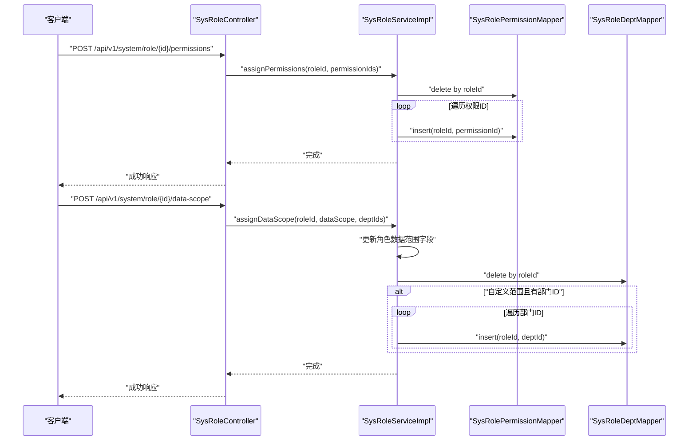
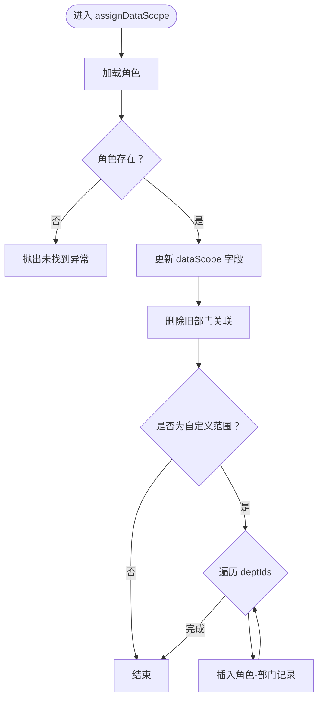
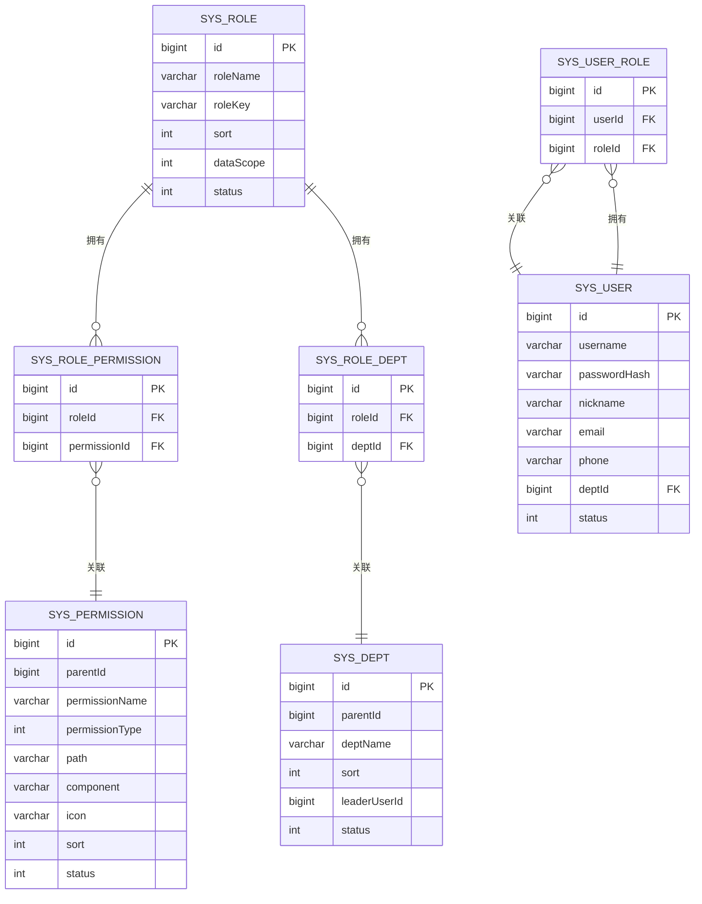
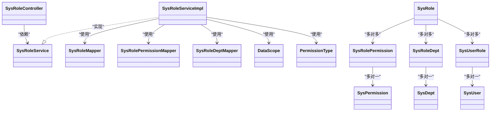

# 角色管理功能

<cite>
**本文引用的文件**
- [SysRoleController.java](file://oa-system/src/main/java/com/oa/admin/system/controller/SysRoleController.java)
- [SysRoleService.java](file://oa-system/src/main/java/com/oa/admin/system/service/SysRoleService.java)
- [SysRoleServiceImpl.java](file://oa-system/src/main/java/com/oa/admin/system/service/impl/SysRoleServiceImpl.java)
- [SysRole.java](file://oa-system/src/main/java/com/oa/admin/system/entity/SysRole.java)
- [SysRolePermission.java](file://oa-system/src/main/java/com/oa/admin/system/entity/SysRolePermission.java)
- [SysRoleDept.java](file://oa-system/src/main/java/com/oa/admin/system/entity/SysRoleDept.java)
- [SysUserRole.java](file://oa-system/src/main/java/com/oa/admin/system/entity/SysUserRole.java)
- [SysPermission.java](file://oa-system/src/main/java/com/oa/admin/system/entity/SysPermission.java)
- [SysDept.java](file://oa-system/src/main/java/com/oa/admin/system/entity/SysDept.java)
- [SysUser.java](file://oa-system/src/main/java/com/oa/admin/system/entity/SysUser.java)
- [SysRoleMapper.java](file://oa-system/src/main/java/com/oa/admin/system/mapper/SysRoleMapper.java)
- [SysRolePermissionMapper.java](file://oa-system/src/main/java/com/oa/admin/system/mapper/SysRolePermissionMapper.java)
- [SysRoleDeptMapper.java](file://oa-system/src/main/java/com/oa/admin/system/mapper/SysRoleDeptMapper.java)
- [DataScope.java](file://oa-system/src/main/java/com/oa/admin/system/enums/DataScope.java)
- [PermissionType.java](file://oa-system/src/main/java/com/oa/admin/system/enums/PermissionType.java)
</cite>

## 目录
1. [简介](#简介)
2. [项目结构](#项目结构)
3. [核心组件](#核心组件)
4. [架构总览](#架构总览)
5. [详细组件分析](#详细组件分析)
6. [依赖关系分析](#依赖关系分析)
7. [性能考虑](#性能考虑)
8. [故障排查指南](#故障排查指南)
9. [结论](#结论)
10. [附录：API 接口文档](#附录api-接口文档)

## 简介
本文件面向“角色管理”功能，系统性阐述其架构设计与实现细节，覆盖角色 CRUD 操作、角色与权限的多对多关联、角色与部门的数据权限范围控制、角色与用户的关联关系，以及后端控制器 API 的职责与调用方式。同时提供数据模型说明、权限控制机制、典型使用场景与排错建议。

## 项目结构
角色管理位于系统模块（oa-system）中，采用典型的分层架构：
- 控制层：SysRoleController 提供 REST API
- 服务层：SysRoleService 定义业务契约；SysRoleServiceImpl 实现具体逻辑
- 数据访问层：各 Mapper 负责与数据库交互
- 数据模型层：SysRole 及其关联实体描述角色、权限、部门、用户之间的关系

```mermaid
graph TB
subgraph "系统模块(oa-system)"
C["SysRoleController<br/>REST 控制器"]
S["SysRoleServiceImpl<br/>业务实现"]
M1["SysRoleMapper"]
M2["SysRolePermissionMapper"]
M3["SysRoleDeptMapper"]
E1["SysRole"]
E2["SysRolePermission"]
E3["SysRoleDept"]
E4["SysUserRole"]
E5["SysPermission"]
E6["SysDept"]
E7["SysUser"]
end
C --> S
S --> M1
S --> M2
S --> M3
E1 <- --> E2
E1 <- --> E3
E1 <- --> E4
E5 <- --> E2
E6 <- --> E3
E7 <- --> E4
```

图表来源
- [SysRoleController.java:1-78](file://oa-system/src/main/java/com/oa/admin/system/controller/SysRoleController.java#L1-L78)
- [SysRoleServiceImpl.java:1-79](file://oa-system/src/main/java/com/oa/admin/system/service/impl/SysRoleServiceImpl.java#L1-L79)
- [SysRoleMapper.java:1-13](file://oa-system/src/main/java/com/oa/admin/system/mapper/SysRoleMapper.java#L1-L13)
- [SysRolePermissionMapper.java:1-13](file://oa-system/src/main/java/com/oa/admin/system/mapper/SysRolePermissionMapper.java#L1-L13)
- [SysRoleDeptMapper.java:1-13](file://oa-system/src/main/java/com/oa/admin/system/mapper/SysRoleDeptMapper.java#L1-L13)
- [SysRole.java:1-26](file://oa-system/src/main/java/com/oa/admin/system/entity/SysRole.java#L1-L26)
- [SysRolePermission.java:1-19](file://oa-system/src/main/java/com/oa/admin/system/entity/SysRolePermission.java#L1-L19)
- [SysRoleDept.java:1-19](file://oa-system/src/main/java/com/oa/admin/system/entity/SysRoleDept.java#L1-L19)
- [SysUserRole.java:1-19](file://oa-system/src/main/java/com/oa/admin/system/entity/SysUserRole.java#L1-L19)
- [SysPermission.java:1-35](file://oa-system/src/main/java/com/oa/admin/system/entity/SysPermission.java#L1-L35)
- [SysDept.java:1-31](file://oa-system/src/main/java/com/oa/admin/system/entity/SysDept.java#L1-L31)
- [SysUser.java:1-27](file://oa-system/src/main/java/com/oa/admin/system/entity/SysUser.java#L1-L27)

章节来源
- [SysRoleController.java:1-78](file://oa-system/src/main/java/com/oa/admin/system/controller/SysRoleController.java#L1-L78)
- [SysRoleServiceImpl.java:1-79](file://oa-system/src/main/java/com/oa/admin/system/service/impl/SysRoleServiceImpl.java#L1-L79)

## 核心组件
- 控制器：SysRoleController 提供角色列表、详情、创建、更新、删除、分配权限、分配数据范围等接口，并通过注解进行权限校验。
- 服务层：SysRoleService 抽象角色业务；SysRoleServiceImpl 实现分页查询、权限重置写入、数据范围策略与部门集合写入。
- 映射器：SysRoleMapper、SysRolePermissionMapper、SysRoleDeptMapper 负责持久化操作。
- 数据模型：SysRole、SysRolePermission、SysRoleDept、SysUserRole、SysPermission、SysDept、SysUser 构成角色管理的数据结构基础。

章节来源
- [SysRoleController.java:1-78](file://oa-system/src/main/java/com/oa/admin/system/controller/SysRoleController.java#L1-L78)
- [SysRoleService.java:1-20](file://oa-system/src/main/java/com/oa/admin/system/service/SysRoleService.java#L1-L20)
- [SysRoleServiceImpl.java:1-79](file://oa-system/src/main/java/com/oa/admin/system/service/impl/SysRoleServiceImpl.java#L1-L79)
- [SysRoleMapper.java:1-13](file://oa-system/src/main/java/com/oa/admin/system/mapper/SysRoleMapper.java#L1-L13)
- [SysRolePermissionMapper.java:1-13](file://oa-system/src/main/java/com/oa/admin/system/mapper/SysRolePermissionMapper.java#L1-L13)
- [SysRoleDeptMapper.java:1-13](file://oa-system/src/main/java/com/oa/admin/system/mapper/SysRoleDeptMapper.java#L1-L13)

## 架构总览
角色管理遵循“控制器-服务-映射器-实体”的分层设计，事务边界在服务层明确，权限与数据范围变更通过批量删除+插入的方式保证一致性。



图表来源
- [SysRoleController.java:61-76](file://oa-system/src/main/java/com/oa/admin/system/controller/SysRoleController.java#L61-L76)
- [SysRoleServiceImpl.java:42-77](file://oa-system/src/main/java/com/oa/admin/system/service/impl/SysRoleServiceImpl.java#L42-L77)
- [SysRolePermissionMapper.java:1-13](file://oa-system/src/main/java/com/oa/admin/system/mapper/SysRolePermissionMapper.java#L1-L13)
- [SysRoleDeptMapper.java:1-13](file://oa-system/src/main/java/com/oa/admin/system/mapper/SysRoleDeptMapper.java#L1-L13)

## 详细组件分析

### 控制器：SysRoleController
- 路由前缀：/api/v1/system/role
- 权限注解：基于 Sa-Token 注解进行接口级权限校验
- 主要接口
  - GET / → 列表查询（支持按角色名模糊、状态过滤、分页）
  - GET /{id} → 获取角色详情
  - POST / → 创建角色
  - PUT /{id} → 更新角色
  - DELETE /{id} → 删除角色
  - POST /{id}/permissions → 为角色分配权限（传入 permissionIds 数组）
  - POST /{id}/data-scope → 设置角色数据范围与部门集合（传入 dataScope 与 deptIds）

章节来源
- [SysRoleController.java:23-76](file://oa-system/src/main/java/com/oa/admin/system/controller/SysRoleController.java#L23-L76)

### 服务层：SysRoleService 与 SysRoleServiceImpl
- 分页查询：根据角色名、状态进行条件查询，按排序字段升序排列，返回 PageResult 结果集
- 分配权限：先清空该角色旧权限，再批量写入新权限集合
- 分配数据范围：
  - 更新角色的 dataScope 字段
  - 清空旧部门关联
  - 当数据范围为“自定义”时，批量写入新的部门集合



图表来源
- [SysRoleServiceImpl.java:57-77](file://oa-system/src/main/java/com/oa/admin/system/service/impl/SysRoleServiceImpl.java#L57-L77)
- [DataScope.java:1-27](file://oa-system/src/main/java/com/oa/admin/system/enums/DataScope.java#L1-L27)

章节来源
- [SysRoleService.java:12-19](file://oa-system/src/main/java/com/oa/admin/system/service/SysRoleService.java#L12-L19)
- [SysRoleServiceImpl.java:32-77](file://oa-system/src/main/java/com/oa/admin/system/service/impl/SysRoleServiceImpl.java#L32-L77)

### 数据模型与关系
- 角色实体（SysRole）包含角色标识、键值、排序、数据范围类型、状态等字段
- 角色-权限（SysRolePermission）：多对多中间表
- 角色-部门（SysRoleDept）：用于数据权限范围控制
- 用户-角色（SysUserRole）：用户与角色的多对多关联
- 权限实体（SysPermission）：菜单、按钮、接口等权限类型
- 部门实体（SysDept）：组织架构树形结构
- 用户实体（SysUser）：用户基本信息与部门归属



图表来源
- [SysRole.java:1-26](file://oa-system/src/main/java/com/oa/admin/system/entity/SysRole.java#L1-L26)
- [SysRolePermission.java:1-19](file://oa-system/src/main/java/com/oa/admin/system/entity/SysRolePermission.java#L1-L19)
- [SysRoleDept.java:1-19](file://oa-system/src/main/java/com/oa/admin/system/entity/SysRoleDept.java#L1-L19)
- [SysUserRole.java:1-19](file://oa-system/src/main/java/com/oa/admin/system/entity/SysUserRole.java#L1-L19)
- [SysPermission.java:1-35](file://oa-system/src/main/java/com/oa/admin/system/entity/SysPermission.java#L1-L35)
- [SysDept.java:1-31](file://oa-system/src/main/java/com/oa/admin/system/entity/SysDept.java#L1-L31)
- [SysUser.java:1-27](file://oa-system/src/main/java/com/oa/admin/system/entity/SysUser.java#L1-L27)

章节来源
- [SysRole.java:1-26](file://oa-system/src/main/java/com/oa/admin/system/entity/SysRole.java#L1-L26)
- [SysRolePermission.java:1-19](file://oa-system/src/main/java/com/oa/admin/system/entity/SysRolePermission.java#L1-L19)
- [SysRoleDept.java:1-19](file://oa-system/src/main/java/com/oa/admin/system/entity/SysRoleDept.java#L1-L19)
- [SysUserRole.java:1-19](file://oa-system/src/main/java/com/oa/admin/system/entity/SysUserRole.java#L1-L19)
- [SysPermission.java:1-35](file://oa-system/src/main/java/com/oa/admin/system/entity/SysPermission.java#L1-L35)
- [SysDept.java:1-31](file://oa-system/src/main/java/com/oa/admin/system/entity/SysDept.java#L1-L31)
- [SysUser.java:1-27](file://oa-system/src/main/java/com/oa/admin/system/entity/SysUser.java#L1-L27)

### 权限与数据范围控制机制
- 权限类型：菜单、按钮、接口，由枚举统一管理
- 数据范围类型：全部、本部门、自定义，由枚举统一管理
- 控制要点：
  - 分配权限时先清空旧权限，再写入新集合，确保与前端选择一致
  - 分配数据范围时，若为“自定义”，则写入部门集合；否则不写入部门记录
  - 通过 Sa-Token 注解在接口层面进行权限校验，避免越权操作

章节来源
- [PermissionType.java:1-27](file://oa-system/src/main/java/com/oa/admin/system/enums/PermissionType.java#L1-L27)
- [DataScope.java:1-27](file://oa-system/src/main/java/com/oa/admin/system/enums/DataScope.java#L1-L27)
- [SysRoleController.java:24-76](file://oa-system/src/main/java/com/oa/admin/system/controller/SysRoleController.java#L24-L76)
- [SysRoleServiceImpl.java:42-77](file://oa-system/src/main/java/com/oa/admin/system/service/impl/SysRoleServiceImpl.java#L42-L77)

## 依赖关系分析
- 控制器依赖服务接口
- 服务实现依赖映射器与枚举
- 实体之间通过外键形成清晰的多对多与一对多关系
- 权限与数据范围通过中间表解耦，便于扩展



图表来源
- [SysRoleController.java:1-78](file://oa-system/src/main/java/com/oa/admin/system/controller/SysRoleController.java#L1-L78)
- [SysRoleService.java:1-20](file://oa-system/src/main/java/com/oa/admin/system/service/SysRoleService.java#L1-L20)
- [SysRoleServiceImpl.java:1-79](file://oa-system/src/main/java/com/oa/admin/system/service/impl/SysRoleServiceImpl.java#L1-L79)
- [SysRoleMapper.java:1-13](file://oa-system/src/main/java/com/oa/admin/system/mapper/SysRoleMapper.java#L1-L13)
- [SysRolePermissionMapper.java:1-13](file://oa-system/src/main/java/com/oa/admin/system/mapper/SysRolePermissionMapper.java#L1-L13)
- [SysRoleDeptMapper.java:1-13](file://oa-system/src/main/java/com/oa/admin/system/mapper/SysRoleDeptMapper.java#L1-L13)
- [SysRole.java:1-26](file://oa-system/src/main/java/com/oa/admin/system/entity/SysRole.java#L1-L26)
- [SysRolePermission.java:1-19](file://oa-system/src/main/java/com/oa/admin/system/entity/SysRolePermission.java#L1-L19)
- [SysRoleDept.java:1-19](file://oa-system/src/main/java/com/oa/admin/system/entity/SysRoleDept.java#L1-L19)
- [SysUserRole.java:1-19](file://oa-system/src/main/java/com/oa/admin/system/entity/SysUserRole.java#L1-L19)
- [SysPermission.java:1-35](file://oa-system/src/main/java/com/oa/admin/system/entity/SysPermission.java#L1-L35)
- [SysDept.java:1-31](file://oa-system/src/main/java/com/oa/admin/system/entity/SysDept.java#L1-L31)
- [SysUser.java:1-27](file://oa-system/src/main/java/com/oa/admin/system/entity/SysUser.java#L1-L27)
- [DataScope.java:1-27](file://oa-system/src/main/java/com/oa/admin/system/enums/DataScope.java#L1-L27)
- [PermissionType.java:1-27](file://oa-system/src/main/java/com/oa/admin/system/enums/PermissionType.java#L1-L27)

## 性能考虑
- 批量写入：分配权限与数据范围时采用“清空+批量插入”，减少重复扫描成本
- 分页查询：在服务层构建条件并分页，避免一次性加载全量数据
- 事务边界：权限与数据范围变更置于同一事务，保证一致性
- 建议：
  - 大规模权限或部门集合写入时，可评估分批提交以降低锁竞争
  - 对高频查询添加索引（如角色名、状态、排序字段），提升分页效率

## 故障排查指南
- 未找到角色：设置数据范围时若角色不存在会抛出业务异常
- 权限未生效：确认已调用“分配权限”接口并传入完整权限 ID 列表
- 数据范围异常：确认 dataScope 与 deptIds 的组合正确（仅在“自定义”时需要提供部门集合）
- 权限校验失败：检查调用接口所需的权限点是否已在系统中配置并授权给当前用户

章节来源
- [SysRoleServiceImpl.java:60-63](file://oa-system/src/main/java/com/oa/admin/system/service/impl/SysRoleServiceImpl.java#L60-L63)
- [SysRoleController.java:24-76](file://oa-system/src/main/java/com/oa/admin/system/controller/SysRoleController.java#L24-L76)

## 结论
角色管理功能通过清晰的分层设计与严格的事务控制，实现了角色 CRUD、权限分配与数据范围控制的完整闭环。配合 Sa-Token 的权限注解，能够有效保障接口安全。建议在生产环境中结合索引优化与批量写入策略，进一步提升大规模数据下的性能表现。

## 附录：API 接口文档

- 列表查询
  - 方法：GET
  - 路径：/api/v1/system/role
  - 权限点：system:role:list
  - 查询参数：
    - roleName：角色名（模糊匹配）
    - status：状态（可选）
    - page：页码（默认 1）
    - pageSize：每页大小（默认 20）
  - 返回：分页结果（PageResult）

- 角色详情
  - 方法：GET
  - 路径：/api/v1/system/role/{id}
  - 权限点：system:role:query
  - 路径参数：id（角色ID）
  - 返回：角色对象

- 创建角色
  - 方法：POST
  - 路径：/api/v1/system/role
  - 权限点：system:role:add
  - 请求体：角色对象（不含ID）
  - 返回：创建后的角色对象

- 更新角色
  - 方法：PUT
  - 路径：/api/v1/system/role/{id}
  - 权限点：system:role:edit
  - 路径参数：id（角色ID）
  - 请求体：角色对象（包含ID）
  - 返回：更新后的角色对象

- 删除角色
  - 方法：DELETE
  - 路径：/api/v1/system/role/{id}
  - 权限点：system:role:remove
  - 路径参数：id（角色ID）
  - 返回：成功响应

- 分配权限
  - 方法：POST
  - 路径：/api/v1/system/role/{id}/permissions
  - 权限点：system:role:edit
  - 路径参数：id（角色ID）
  - 请求体：{"permissionIds": [1,2,3]}
  - 返回：成功响应

- 分配数据范围
  - 方法：POST
  - 路径：/api/v1/system/role/{id}/data-scope
  - 权限点：system:role:edit
  - 路径参数：id（角色ID）
  - 请求体：
    - dataScope：整数（1=全部，2=本部门，3=自定义）
    - deptIds：数组（当 dataScope=3 时必填）
  - 返回：成功响应

使用示例（说明性步骤）
- 新建角色：向“创建角色”接口发送角色对象，获取返回的新角色ID
- 分配权限：向“分配权限”接口发送角色ID与权限ID数组
- 设置数据范围：
  - 若为“全部”或“本部门”，请求体仅包含 dataScope
  - 若为“自定义”，请求体包含 dataScope 与 deptIds 数组
- 列表查询：调用“列表查询”接口，传入角色名、状态、分页参数获取结果

章节来源
- [SysRoleController.java:23-76](file://oa-system/src/main/java/com/oa/admin/system/controller/SysRoleController.java#L23-L76)