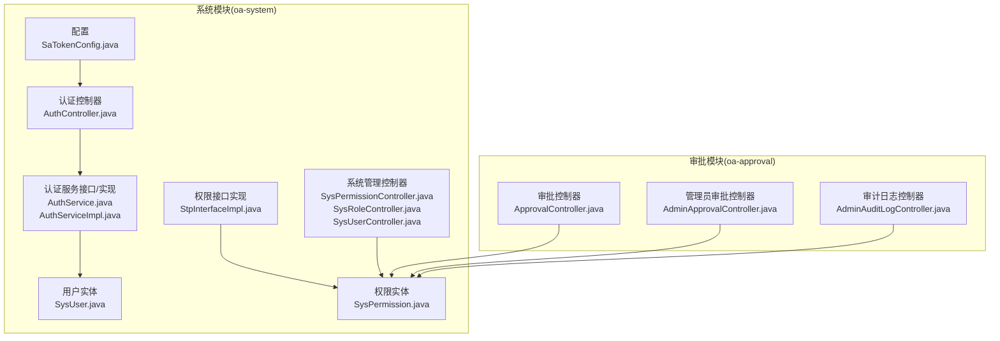
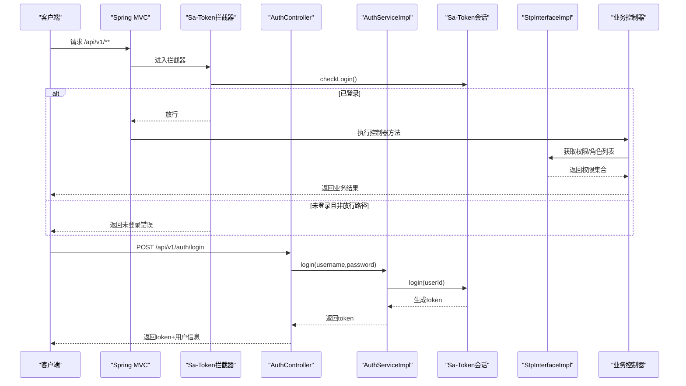
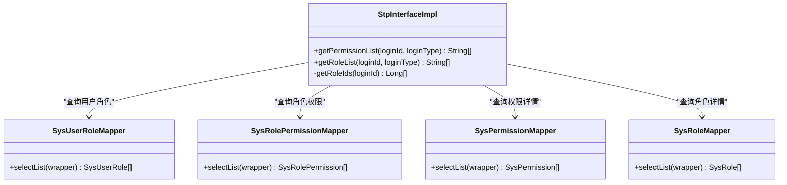
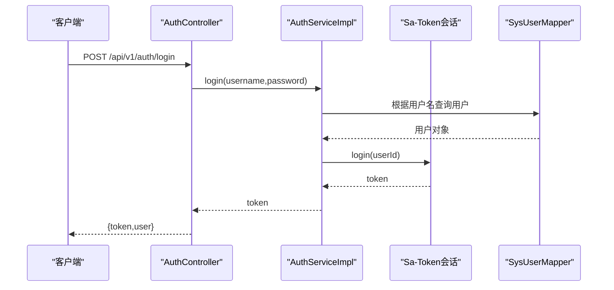
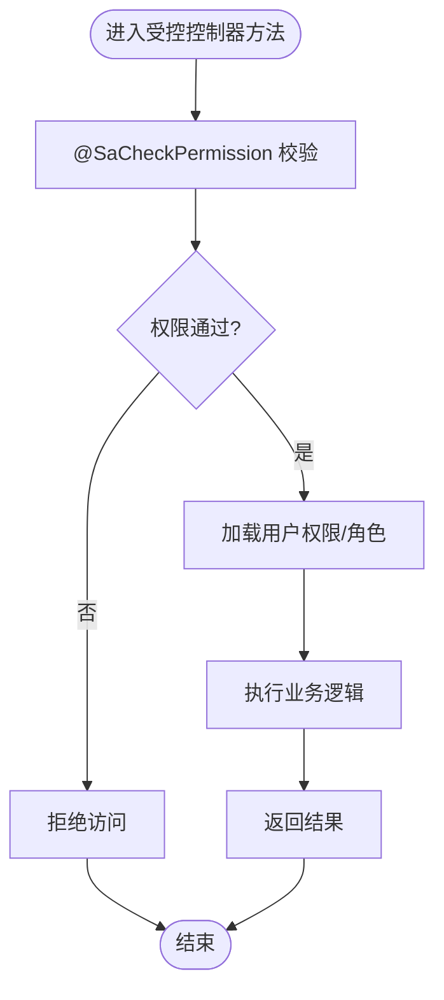
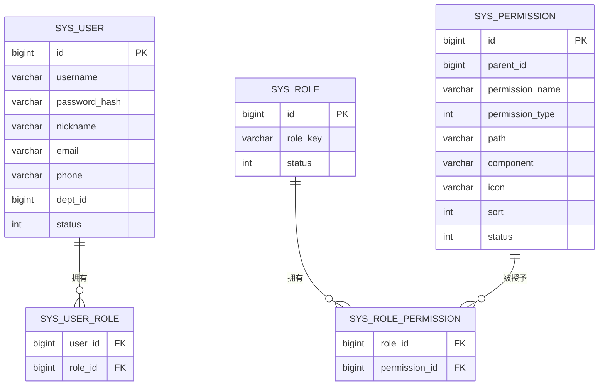
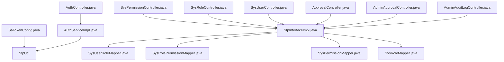

# 认证配置与权限拦截

<cite>
**本文档引用的文件**
- [SaTokenConfig.java](file://oa-system/src/main/java/com/oa/admin/system/config/SaTokenConfig.java)
- [StpInterfaceImpl.java](file://oa-system/src/main/java/com/oa/admin/system/config/StpInterfaceImpl.java)
- [AuthService.java](file://oa-system/src/main/java/com/oa/admin/system/service/AuthService.java)
- [AuthServiceImpl.java](file://oa-system/src/main/java/com/oa/admin/system/service/impl/AuthServiceImpl.java)
- [AuthController.java](file://oa-system/src/main/java/com/oa/admin/system/controller/AuthController.java)
- [SysUser.java](file://oa-system/src/main/java/com/oa/admin/system/entity/SysUser.java)
- [SysPermission.java](file://oa-system/src/main/java/com/oa/admin/system/entity/SysPermission.java)
- [SysPermissionController.java](file://oa-system/src/main/java/com/oa/admin/system/controller/SysPermissionController.java)
- [SysRoleController.java](file://oa-system/src/main/java/com/oa/admin/system/controller/SysRoleController.java)
- [SysUserController.java](file://oa-system/src/main/java/com/oa/admin/system/controller/SysUserController.java)
- [AdminApprovalController.java](file://oa-approval/src/main/java/com/oa/admin/approval/controller/AdminApprovalController.java)
- [ApprovalController.java](file://oa-approval/src/main/java/com/oa/admin/approval/controller/ApprovalController.java)
- [AdminAuditLogController.java](file://oa-approval/src/main/java/com/oa/admin/approval/controller/AdminAuditLogController.java)
</cite>

## 目录
1. [简介](#简介)
2. [项目结构](#项目结构)
3. [核心组件](#核心组件)
4. [架构总览](#架构总览)
5. [详细组件分析](#详细组件分析)
6. [依赖关系分析](#依赖关系分析)
7. [性能考虑](#性能考虑)
8. [故障排除指南](#故障排除指南)
9. [结论](#结论)

## 简介
本文件围绕 Sa-Token 认证框架在系统中的配置与权限拦截展开，重点覆盖以下方面：
- 基于 Spring MVC 的全局拦截器配置，实现登录态校验与放行路径设置
- 权限接口实现，包括用户权限加载、角色权限获取与权限验证逻辑
- 控制器层权限注解的使用方式与典型场景
- 完整的认证流程（登录、登出、当前用户信息获取）
- 细粒度权限控制在审批模块与系统管理模块中的落地实践

## 项目结构
本项目采用多模块分层架构，认证与权限相关的核心代码集中在 oa-system 模块，审批相关业务在 oa-approval 模块。认证与权限拦截的关键配置位于系统模块的 config 包中，控制器层通过注解实现细粒度权限控制。

图表来源
- [SaTokenConfig.java:12-24](file://oa-system/src/main/java/com/oa/admin/system/config/SaTokenConfig.java#L12-L24)
- [StpInterfaceImpl.java:24-75](file://oa-system/src/main/java/com/oa/admin/system/config/StpInterfaceImpl.java#L24-L75)
- [AuthController.java:14-38](file://oa-system/src/main/java/com/oa/admin/system/controller/AuthController.java#L14-L38)
- [AuthServiceImpl.java:18-53](file://oa-system/src/main/java/com/oa/admin/system/service/impl/AuthServiceImpl.java#L18-L53)
- [SysUser.java:13-27](file://oa-system/src/main/java/com/oa/admin/system/entity/SysUser.java#L13-L27)
- [SysPermission.java:16-35](file://oa-system/src/main/java/com/oa/admin/system/entity/SysPermission.java#L16-L35)
- [SysPermissionController.java:15-63](file://oa-system/src/main/java/com/oa/admin/system/controller/SysPermissionController.java#L15-L63)
- [SysRoleController.java:17-78](file://oa-system/src/main/java/com/oa/admin/system/controller/SysRoleController.java#L17-L78)
- [SysUserController.java:17-85](file://oa-system/src/main/java/com/oa/admin/system/controller/SysUserController.java#L17-L85)
- [ApprovalController.java:1-200](file://oa-approval/src/main/java/com/oa/admin/approval/controller/ApprovalController.java#L1-L200)
- [AdminApprovalController.java:1-100](file://oa-approval/src/main/java/com/oa/admin/approval/controller/AdminApprovalController.java#L1-L100)
- [AdminAuditLogController.java:1-100](file://oa-approval/src/main/java/com/oa/admin/approval/controller/AdminAuditLogController.java#L1-L100)

章节来源
- [SaTokenConfig.java:12-24](file://oa-system/src/main/java/com/oa/admin/system/config/SaTokenConfig.java#L12-L24)
- [StpInterfaceImpl.java:24-75](file://oa-system/src/main/java/com/oa/admin/system/config/StpInterfaceImpl.java#L24-L75)
- [AuthController.java:14-38](file://oa-system/src/main/java/com/oa/admin/system/controller/AuthController.java#L14-L38)
- [AuthServiceImpl.java:18-53](file://oa-system/src/main/java/com/oa/admin/system/service/impl/AuthServiceImpl.java#L18-L53)
- [SysUser.java:13-27](file://oa-system/src/main/java/com/oa/admin/system/entity/SysUser.java#L13-L27)
- [SysPermission.java:16-35](file://oa-system/src/main/java/com/oa/admin/system/entity/SysPermission.java#L16-L35)
- [SysPermissionController.java:15-63](file://oa-system/src/main/java/com/oa/admin/system/controller/SysPermissionController.java#L15-L63)
- [SysRoleController.java:17-78](file://oa-system/src/main/java/com/oa/admin/system/controller/SysRoleController.java#L17-L78)
- [SysUserController.java:17-85](file://oa-system/src/main/java/com/oa/admin/system/controller/SysUserController.java#L17-L85)

## 核心组件
- 全局拦截器：通过实现 WebMvcConfigurer 接口注册 Sa-Token 拦截器，对 /api/v1/** 路径进行登录态校验，并放行登录与注册接口。
- 权限接口实现：实现 StpInterface 接口，提供用户权限列表与角色列表的查询，基于用户-角色-权限三层映射关系从数据库加载有效权限。
- 认证服务：提供登录、登出、当前用户信息获取能力，登录成功后通过 Sa-Token 生成会话标识。
- 控制器层注解：在系统管理与审批模块的多个控制器方法上使用 @SaCheckPermission 注解，实现细粒度权限控制。

章节来源
- [SaTokenConfig.java:12-24](file://oa-system/src/main/java/com/oa/admin/system/config/SaTokenConfig.java#L12-L24)
- [StpInterfaceImpl.java:24-75](file://oa-system/src/main/java/com/oa/admin/system/config/StpInterfaceImpl.java#L24-L75)
- [AuthService.java:8-16](file://oa-system/src/main/java/com/oa/admin/system/service/AuthService.java#L8-L16)
- [AuthServiceImpl.java:18-53](file://oa-system/src/main/java/com/oa/admin/system/service/impl/AuthServiceImpl.java#L18-L53)

## 架构总览
下图展示了认证与权限拦截的整体架构，包括请求进入、拦截器校验、权限接口加载以及控制器注解授权的交互过程。

图表来源
- [SaTokenConfig.java:15-23](file://oa-system/src/main/java/com/oa/admin/system/config/SaTokenConfig.java#L15-L23)
- [AuthController.java:20-25](file://oa-system/src/main/java/com/oa/admin/system/controller/AuthController.java#L20-L25)
- [AuthServiceImpl.java:24-35](file://oa-system/src/main/java/com/oa/admin/system/service/impl/AuthServiceImpl.java#L24-L35)
- [StpInterfaceImpl.java:33-65](file://oa-system/src/main/java/com/oa/admin/system/config/StpInterfaceImpl.java#L33-L65)

## 详细组件分析

### Sa-Token 全局拦截器配置
- 功能概述：注册 SaInterceptor 拦截器，对 /api/v1/** 路径进行统一登录态校验；放行 /api/v1/auth/login 与 /api/v1/auth/register。
- 关键点：
  - 使用 StpUtil.checkLogin() 进行登录态校验
  - 通过 addPathPatterns 与 excludePathPatterns 精准控制拦截范围
- 配置位置参考：[SaTokenConfig.java:15-23](file://oa-system/src/main/java/com/oa/admin/system/config/SaTokenConfig.java#L15-L23)

章节来源
- [SaTokenConfig.java:12-24](file://oa-system/src/main/java/com/oa/admin/system/config/SaTokenConfig.java#L12-L24)

### 权限接口实现（StpInterfaceImpl）
- 功能概述：实现 StpInterface 接口，提供用户权限列表与角色列表的加载逻辑。
- 数据流：
  - 通过用户 ID 查询其关联的角色 ID 列表
  - 通过角色 ID 查询其关联的权限 ID 列表
  - 通过权限 ID 查询有效的权限记录，返回权限路径集合
  - 角色列表同样基于有效状态过滤
- 复杂度分析：
  - 权限加载涉及三次数据库查询，查询次数与角色数、权限数线性相关
  - 建议在角色或权限变更频繁时，结合缓存策略降低查询压力
- 关键实现参考：
  - 权限列表加载：[StpInterfaceImpl.java:33-52](file://oa-system/src/main/java/com/oa/admin/system/config/StpInterfaceImpl.java#L33-L52)
  - 角色列表加载：[StpInterfaceImpl.java:54-65](file://oa-system/src/main/java/com/oa/admin/system/config/StpInterfaceImpl.java#L54-L65)
  - 用户角色映射查询：[StpInterfaceImpl.java:67-73](file://oa-system/src/main/java/com/oa/admin/system/config/StpInterfaceImpl.java#L67-L73)

图表来源
- [StpInterfaceImpl.java:24-75](file://oa-system/src/main/java/com/oa/admin/system/config/StpInterfaceImpl.java#L24-L75)
- [SysUserRoleMapper.java](file://oa-system/src/main/java/com/oa/admin/system/mapper/SysUserRoleMapper.java)
- [SysRolePermissionMapper.java](file://oa-system/src/main/java/com/oa/admin/system/mapper/SysRolePermissionMapper.java)
- [SysPermissionMapper.java](file://oa-system/src/main/java/com/oa/admin/system/mapper/SysPermissionMapper.java)
- [SysRoleMapper.java](file://oa-system/src/main/java/com/oa/admin/system/mapper/SysRoleMapper.java)

章节来源
- [StpInterfaceImpl.java:24-75](file://oa-system/src/main/java/com/oa/admin/system/config/StpInterfaceImpl.java#L24-L75)

### 认证服务与控制器
- 认证服务接口定义了登录、登出、获取当前用户的能力：[AuthService.java:8-16](file://oa-system/src/main/java/com/oa/admin/system/service/AuthService.java#L8-L16)
- 登录流程：
  - 校验用户名与密码
  - 通过 Sa-Token 的 StpUtil.login(userId) 建立会话
  - 返回当前会话的 token
- 当前用户信息：
  - 通过 Sa-Token 获取当前登录用户 ID
  - 查询用户实体并清除敏感字段后返回
- 关键实现参考：
  - 登录实现：[AuthServiceImpl.java:24-35](file://oa-system/src/main/java/com/oa/admin/system/service/impl/AuthServiceImpl.java#L24-L35)
  - 登出实现：[AuthServiceImpl.java:38-40](file://oa-system/src/main/java/com/oa/admin/system/service/impl/AuthServiceImpl.java#L38-L40)
  - 当前用户实现：[AuthServiceImpl.java:42-51](file://oa-system/src/main/java/com/oa/admin/system/service/impl/AuthServiceImpl.java#L42-L51)
  - 认证控制器：[AuthController.java:20-36](file://oa-system/src/main/java/com/oa/admin/system/controller/AuthController.java#L20-L36)

图表来源
- [AuthController.java:20-25](file://oa-system/src/main/java/com/oa/admin/system/controller/AuthController.java#L20-L25)
- [AuthServiceImpl.java:24-35](file://oa-system/src/main/java/com/oa/admin/system/service/impl/AuthServiceImpl.java#L24-L35)

章节来源
- [AuthService.java:8-16](file://oa-system/src/main/java/com/oa/admin/system/service/AuthService.java#L8-L16)
- [AuthServiceImpl.java:18-53](file://oa-system/src/main/java/com/oa/admin/system/service/impl/AuthServiceImpl.java#L18-L53)
- [AuthController.java:14-38](file://oa-system/src/main/java/com/oa/admin/system/controller/AuthController.java#L14-L38)

### 权限注解使用与控制器实现
- 在系统管理模块的多个控制器中广泛使用 @SaCheckPermission 注解，对不同操作（增删改查、分配权限、数据范围设置等）进行权限校验。
- 典型注解使用场景：
  - 系统权限管理：列出树形权限、查询权限、新增/编辑/删除权限
  - 系统角色管理：列出角色、查询角色、新增/编辑/删除角色、分配权限、设置数据范围
  - 系统用户管理：列出用户、查询用户、新增/编辑/删除用户
- 审批模块也大量使用 @SaCheckPermission 对审批操作进行细粒度控制，如提交、审批、待办、已办、实例查看、模板管理等。
- 参考实现：
  - 系统权限控制器：[SysPermissionController.java:21-61](file://oa-system/src/main/java/com/oa/admin/system/controller/SysPermissionController.java#L21-L61)
  - 系统角色控制器：[SysRoleController.java:23-76](file://oa-system/src/main/java/com/oa/admin/system/controller/SysRoleController.java#L23-L76)
  - 系统用户控制器：[SysUserController.java:23-83](file://oa-system/src/main/java/com/oa/admin/system/controller/SysUserController.java#L23-L83)
  - 审批控制器（部分示例）：[ApprovalController.java:36-174](file://oa-approval/src/main/java/com/oa/admin/approval/controller/ApprovalController.java#L36-L174)
  - 管理员审批控制器（部分示例）：[AdminApprovalController.java:20-49](file://oa-approval/src/main/java/com/oa/admin/approval/controller/AdminApprovalController.java#L20-L49)
  - 审计日志控制器：[AdminAuditLogController.java:19-19](file://oa-approval/src/main/java/com/oa/admin/approval/controller/AdminAuditLogController.java#L19-L19)

图表来源
- [SysPermissionController.java:21-33](file://oa-system/src/main/java/com/oa/admin/system/controller/SysPermissionController.java#L21-L33)
- [SysRoleController.java:46-52](file://oa-system/src/main/java/com/oa/admin/system/controller/SysRoleController.java#L46-L52)
- [SysUserController.java:59-76](file://oa-system/src/main/java/com/oa/admin/system/controller/SysUserController.java#L59-L76)

章节来源
- [SysPermissionController.java:15-63](file://oa-system/src/main/java/com/oa/admin/system/controller/SysPermissionController.java#L15-L63)
- [SysRoleController.java:17-78](file://oa-system/src/main/java/com/oa/admin/system/controller/SysRoleController.java#L17-L78)
- [SysUserController.java:17-85](file://oa-system/src/main/java/com/oa/admin/system/controller/SysUserController.java#L17-L85)
- [ApprovalController.java:36-174](file://oa-approval/src/main/java/com/oa/admin/approval/controller/ApprovalController.java#L36-L174)
- [AdminApprovalController.java:20-49](file://oa-approval/src/main/java/com/oa/admin/approval/controller/AdminApprovalController.java#L20-L49)
- [AdminAuditLogController.java:19-19](file://oa-approval/src/main/java/com/oa/admin/approval/controller/AdminAuditLogController.java#L19-L19)

### 实体模型与权限关系
- 用户实体包含基础字段与状态字段，用于登录态与权限过滤
- 权限实体包含权限名称、类型、路径、组件、图标、排序与状态等字段，其中 path 字段用于权限匹配
- 权限接口实现通过用户-角色-权限三层映射关系加载有效权限

图表来源
- [SysUser.java:16-26](file://oa-system/src/main/java/com/oa/admin/system/entity/SysUser.java#L16-L26)
- [SysPermission.java:19-34](file://oa-system/src/main/java/com/oa/admin/system/entity/SysPermission.java#L19-L34)
- [StpInterfaceImpl.java:39-51](file://oa-system/src/main/java/com/oa/admin/system/config/StpInterfaceImpl.java#L39-L51)

章节来源
- [SysUser.java:13-27](file://oa-system/src/main/java/com/oa/admin/system/entity/SysUser.java#L13-L27)
- [SysPermission.java:16-35](file://oa-system/src/main/java/com/oa/admin/system/entity/SysPermission.java#L16-L35)
- [StpInterfaceImpl.java:33-65](file://oa-system/src/main/java/com/oa/admin/system/config/StpInterfaceImpl.java#L33-L65)

## 依赖关系分析
- 拦截器依赖 Sa-Token 提供的 StpUtil 进行登录态校验
- 权限接口实现依赖用户、角色、权限、用户-角色、角色-权限等 Mapper 进行数据加载
- 控制器层广泛使用 @SaCheckPermission 注解，依赖权限接口实现进行权限判定
- 认证控制器依赖认证服务实现登录、登出与当前用户查询

图表来源
- [SaTokenConfig.java:12-24](file://oa-system/src/main/java/com/oa/admin/system/config/SaTokenConfig.java#L12-L24)
- [AuthController.java:14-38](file://oa-system/src/main/java/com/oa/admin/system/controller/AuthController.java#L14-L38)
- [AuthServiceImpl.java:18-53](file://oa-system/src/main/java/com/oa/admin/system/service/impl/AuthServiceImpl.java#L18-L53)
- [StpInterfaceImpl.java:24-75](file://oa-system/src/main/java/com/oa/admin/system/config/StpInterfaceImpl.java#L24-L75)
- [SysPermissionController.java:15-63](file://oa-system/src/main/java/com/oa/admin/system/controller/SysPermissionController.java#L15-L63)
- [SysRoleController.java:17-78](file://oa-system/src/main/java/com/oa/admin/system/controller/SysRoleController.java#L17-L78)
- [SysUserController.java:17-85](file://oa-system/src/main/java/com/oa/admin/system/controller/SysUserController.java#L17-L85)
- [ApprovalController.java:1-200](file://oa-approval/src/main/java/com/oa/admin/approval/controller/ApprovalController.java#L1-L200)
- [AdminApprovalController.java:1-100](file://oa-approval/src/main/java/com/oa/admin/approval/controller/AdminApprovalController.java#L1-L100)
- [AdminAuditLogController.java:1-100](file://oa-approval/src/main/java/com/oa/admin/approval/controller/AdminAuditLogController.java#L1-L100)

章节来源
- [SaTokenConfig.java:12-24](file://oa-system/src/main/java/com/oa/admin/system/config/SaTokenConfig.java#L12-L24)
- [AuthServiceImpl.java:18-53](file://oa-system/src/main/java/com/oa/admin/system/service/impl/AuthServiceImpl.java#L18-L53)
- [StpInterfaceImpl.java:24-75](file://oa-system/src/main/java/com/oa/admin/system/config/StpInterfaceImpl.java#L24-L75)

## 性能考虑
- 权限加载查询次数：每次权限加载涉及用户-角色-权限三层查询，建议在高并发场景引入缓存（如 Redis）缓存用户权限与角色列表，减少数据库压力
- 登录态校验：拦截器对每个请求进行 checkLogin，建议结合 Token 存储策略（内存/Redis）优化会话查询性能
- 分页与过滤：系统管理控制器普遍支持分页与状态过滤，合理利用分页可降低单次查询负载
- 密码校验：登录时使用 BCrypt 校验，建议在网关层或认证服务层增加失败次数限制与账户锁定策略

## 故障排除指南
- 未登录访问受保护接口
  - 现象：返回未登录错误
  - 排查：确认是否命中拦截器放行规则；检查 Token 是否正确携带
  - 参考：[SaTokenConfig.java:15-23](file://oa-system/src/main/java/com/oa/admin/system/config/SaTokenConfig.java#L15-L23)
- 登录失败
  - 现象：用户名不存在或密码不正确
  - 排查：确认用户名与密码；检查用户状态是否为激活；确认密码哈希匹配
  - 参考：[AuthServiceImpl.java:24-35](file://oa-system/src/main/java/com/oa/admin/system/service/impl/AuthServiceImpl.java#L24-L35)
- 权限不足
  - 现象：@SaCheckPermission 校验失败
  - 排查：确认用户是否具备所需权限；检查权限路径是否正确；确认权限状态为激活
  - 参考：[StpInterfaceImpl.java:33-52](file://oa-system/src/main/java/com/oa/admin/system/config/StpInterfaceImpl.java#L33-L52)
- 当前用户查询异常
  - 现象：获取当前用户时报 UNAUTHORIZED
  - 排查：确认会话是否存在；确认用户记录是否仍存在
  - 参考：[AuthServiceImpl.java:42-51](file://oa-system/src/main/java/com/oa/admin/system/service/impl/AuthServiceImpl.java#L42-L51)

章节来源
- [SaTokenConfig.java:12-24](file://oa-system/src/main/java/com/oa/admin/system/config/SaTokenConfig.java#L12-L24)
- [AuthServiceImpl.java:18-53](file://oa-system/src/main/java/com/oa/admin/system/service/impl/AuthServiceImpl.java#L18-L53)
- [StpInterfaceImpl.java:24-75](file://oa-system/src/main/java/com/oa/admin/system/config/StpInterfaceImpl.java#L24-L75)

## 结论
本项目基于 Sa-Token 实现了完善的认证与权限拦截体系：通过全局拦截器统一校验登录态，通过权限接口实现加载用户权限与角色，结合控制器层的权限注解实现了细粒度的权限控制。配合合理的缓存策略与安全策略，可在保证安全性的同时提升系统性能与可维护性。