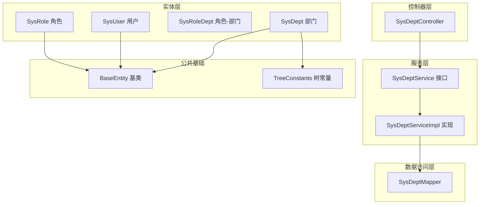
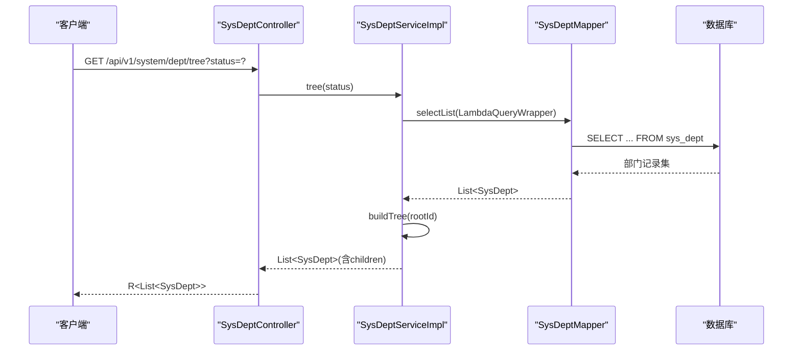
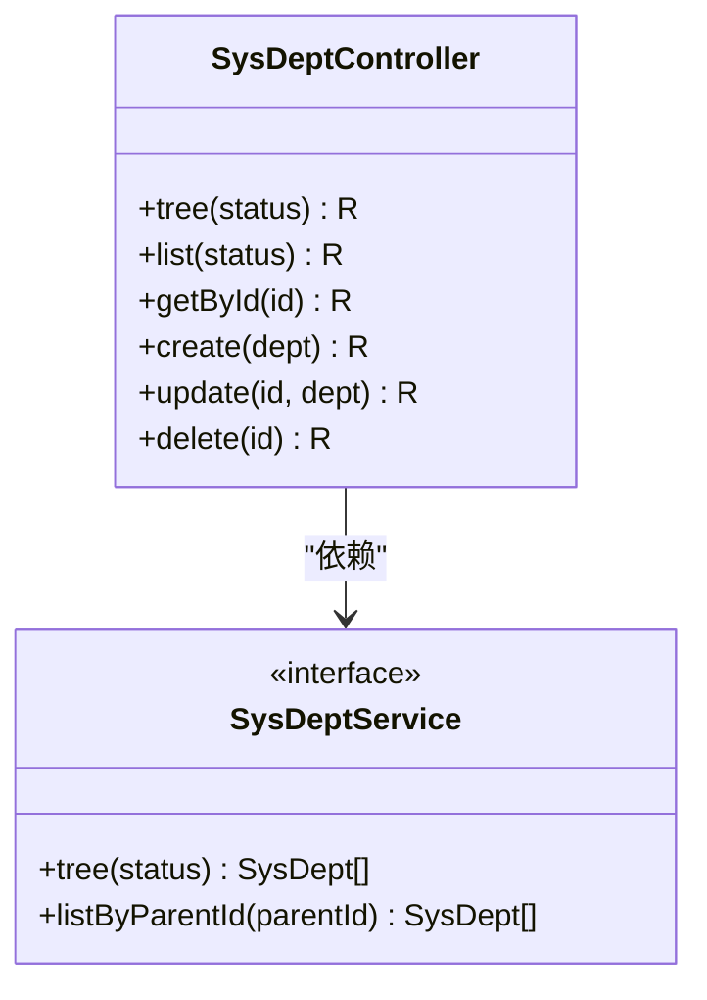
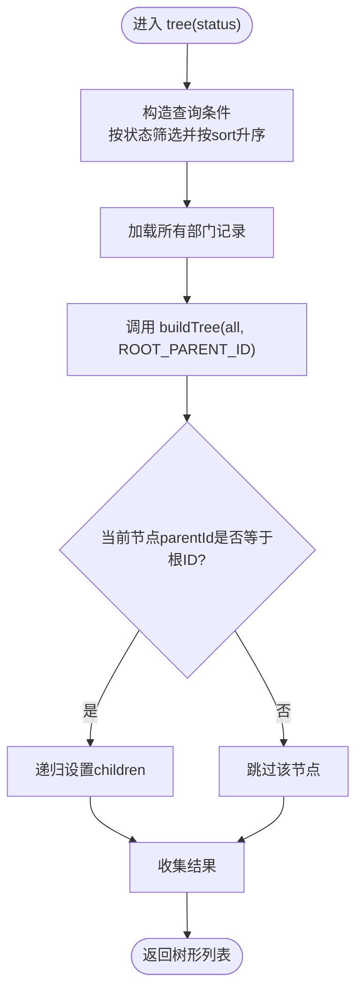
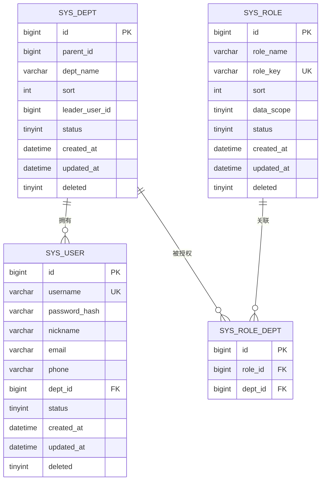
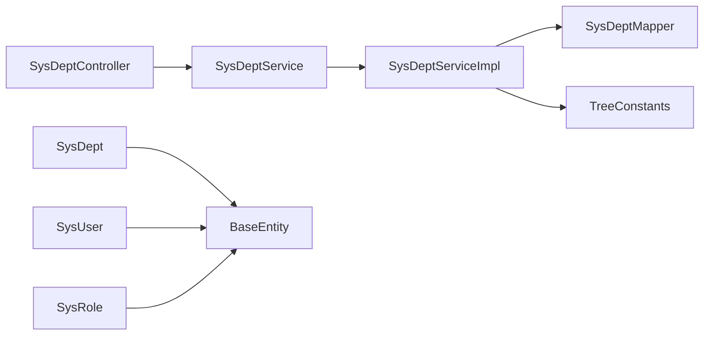

# 部门管理功能

<cite>
**本文引用的文件**
- [SysDeptController.java](file://oa-system/src/main/java/com/oa/admin/system/controller/SysDeptController.java)
- [SysDeptService.java](file://oa-system/src/main/java/com/oa/admin/system/service/SysDeptService.java)
- [SysDeptServiceImpl.java](file://oa-system/src/main/java/com/oa/admin/system/service/impl/SysDeptServiceImpl.java)
- [SysDeptMapper.java](file://oa-system/src/main/java/com/oa/admin/system/mapper/SysDeptMapper.java)
- [SysDept.java](file://oa-system/src/main/java/com/oa/admin/system/entity/SysDept.java)
- [SysUser.java](file://oa-system/src/main/java/com/oa/admin/system/entity/SysUser.java)
- [SysRoleDept.java](file://oa-system/src/main/java/com/oa/admin/system/entity/SysRoleDept.java)
- [SysRole.java](file://oa-system/src/main/java/com/oa/admin/system/entity/SysRole.java)
- [BaseEntity.java](file://oa-common/src/main/java/com/oa/admin/common/entity/BaseEntity.java)
- [TreeConstants.java](file://oa-common/src/main/java/com/oa/admin/common/constant/TreeConstants.java)
- [V1__init_sys_tables.sql](file://oa-app/src/main/resources/db/migration/V1__init_sys_tables.sql)
- [DataScope.java](file://oa-system/src/main/java/com/oa/admin/system/enums/DataScope.java)
</cite>

## 目录
1. [简介](#简介)
2. [项目结构](#项目结构)
3. [核心组件](#核心组件)
4. [架构总览](#架构总览)
5. [详细组件分析](#详细组件分析)
6. [依赖关系分析](#依赖关系分析)
7. [性能考虑](#性能考虑)
8. [故障排查指南](#故障排查指南)
9. [结论](#结论)
10. [附录：API 接口文档与使用示例](#附录api-接口文档与使用示例)

## 简介
本文件面向“部门管理”功能，系统性阐述其架构设计、数据模型、树形结构实现、权限控制与 CRUD 操作流程，并提供完整 API 文档与使用示例。重点覆盖以下方面：
- 部门树形结构设计与递归构建
- 部门 CRUD 操作与权限校验
- 部门层级关系与排序字段
- 部门状态管理与逻辑删除
- 部门与用户的关联关系（用户归属部门）
- 部门与角色的关联关系（用于自定义数据范围）

## 项目结构
部门管理功能位于系统模块（oa-system）中，采用典型的分层架构：
- 控制器层：SysDeptController 提供 REST API
- 服务层：SysDeptService 定义业务接口；SysDeptServiceImpl 实现树形构建与查询
- 数据访问层：SysDeptMapper 基于 MyBatis-Plus
- 实体层：SysDept、SysUser、SysRoleDept 等
- 公共常量与基类：TreeConstants、BaseEntity

图表来源
- [SysDeptController.java:1-70](file://oa-system/src/main/java/com/oa/admin/system/controller/SysDeptController.java#L1-L70)
- [SysDeptService.java:1-17](file://oa-system/src/main/java/com/oa/admin/system/service/SysDeptService.java#L1-L17)
- [SysDeptServiceImpl.java:1-44](file://oa-system/src/main/java/com/oa/admin/system/service/impl/SysDeptServiceImpl.java#L1-L44)
- [SysDeptMapper.java:1-13](file://oa-system/src/main/java/com/oa/admin/system/mapper/SysDeptMapper.java#L1-L13)
- [SysDept.java:1-31](file://oa-system/src/main/java/com/oa/admin/system/entity/SysDept.java#L1-L31)
- [SysUser.java:1-27](file://oa-system/src/main/java/com/oa/admin/system/entity/SysUser.java#L1-L27)
- [SysRoleDept.java:1-19](file://oa-system/src/main/java/com/oa/admin/system/entity/SysRoleDept.java#L1-L19)
- [SysRole.java:1-26](file://oa-system/src/main/java/com/oa/admin/system/entity/SysRole.java#L1-L26)
- [BaseEntity.java:1-26](file://oa-common/src/main/java/com/oa/admin/common/entity/BaseEntity.java#L1-L26)
- [TreeConstants.java:1-12](file://oa-common/src/main/java/com/oa/admin/common/constant/TreeConstants.java#L1-L12)

章节来源
- [SysDeptController.java:1-70](file://oa-system/src/main/java/com/oa/admin/system/controller/SysDeptController.java#L1-L70)
- [SysDeptService.java:1-17](file://oa-system/src/main/java/com/oa/admin/system/service/SysDeptService.java#L1-L17)
- [SysDeptServiceImpl.java:1-44](file://oa-system/src/main/java/com/oa/admin/system/service/impl/SysDeptServiceImpl.java#L1-L44)
- [SysDeptMapper.java:1-13](file://oa-system/src/main/java/com/oa/admin/system/mapper/SysDeptMapper.java#L1-L13)
- [SysDept.java:1-31](file://oa-system/src/main/java/com/oa/admin/system/entity/SysDept.java#L1-L31)
- [SysUser.java:1-27](file://oa-system/src/main/java/com/oa/admin/system/entity/SysUser.java#L1-L27)
- [SysRoleDept.java:1-19](file://oa-system/src/main/java/com/oa/admin/system/entity/SysRoleDept.java#L1-L19)
- [SysRole.java:1-26](file://oa-system/src/main/java/com/oa/admin/system/entity/SysRole.java#L1-L26)
- [BaseEntity.java:1-26](file://oa-common/src/main/java/com/oa/admin/common/entity/BaseEntity.java#L1-L26)
- [TreeConstants.java:1-12](file://oa-common/src/main/java/com/oa/admin/common/constant/TreeConstants.java#L1-L12)

## 核心组件
- 控制器：SysDeptController 提供部门树形查询、列表查询、详情查询、新增、修改、删除等接口，并通过注解进行权限校验。
- 服务：SysDeptService 定义树形构建与按父级查询；SysDeptServiceImpl 实现树形构建算法与子节点过滤。
- 数据访问：SysDeptMapper 继承 MyBatis-Plus 基类，提供通用 CRUD 能力。
- 实体：SysDept 扩展 BaseEntity，包含 id、parentId、deptName、sort、leaderUserId、status 及 children 字段；SysUser 与 SysRoleDept 支持部门-用户与部门-角色关联。

章节来源
- [SysDeptController.java:1-70](file://oa-system/src/main/java/com/oa/admin/system/controller/SysDeptController.java#L1-L70)
- [SysDeptService.java:1-17](file://oa-system/src/main/java/com/oa/admin/system/service/SysDeptService.java#L1-L17)
- [SysDeptServiceImpl.java:1-44](file://oa-system/src/main/java/com/oa/admin/system/service/impl/SysDeptServiceImpl.java#L1-L44)
- [SysDeptMapper.java:1-13](file://oa-system/src/main/java/com/oa/admin/system/mapper/SysDeptMapper.java#L1-L13)
- [SysDept.java:1-31](file://oa-system/src/main/java/com/oa/admin/system/entity/SysDept.java#L1-L31)
- [SysUser.java:1-27](file://oa-system/src/main/java/com/oa/admin/system/entity/SysUser.java#L1-L27)
- [SysRoleDept.java:1-19](file://oa-system/src/main/java/com/oa/admin/system/entity/SysRoleDept.java#L1-L19)
- [BaseEntity.java:1-26](file://oa-common/src/main/java/com/oa/admin/common/entity/BaseEntity.java#L1-L26)

## 架构总览
部门管理遵循“控制器-服务-数据访问-实体”的分层设计，结合 MyBatis-Plus 与 Sa-Token 权限框架，实现：
- 树形结构的递归构建
- 权限范围控制（基于角色数据范围）
- 基于排序字段的有序输出
- 逻辑删除与时间戳填充

图表来源
- [SysDeptController.java:22-27](file://oa-system/src/main/java/com/oa/admin/system/controller/SysDeptController.java#L22-L27)
- [SysDeptServiceImpl.java:20-34](file://oa-system/src/main/java/com/oa/admin/system/service/impl/SysDeptServiceImpl.java#L20-L34)
- [SysDeptMapper.java:1-13](file://oa-system/src/main/java/com/oa/admin/system/mapper/SysDeptMapper.java#L1-L13)

## 详细组件分析

### 控制器：SysDeptController
- 路由前缀：/api/v1/system/dept
- 权限注解：使用 Sa-Token 的 @SaCheckPermission 对各接口进行细粒度权限控制
- 主要接口：
  - GET /tree：获取部门树形结构，支持可选状态筛选
  - GET /：获取部门列表，支持可选状态筛选并按排序字段升序排列
  - GET /{id}：按 ID 获取部门详情
  - POST /：创建部门
  - PUT /{id}：更新部门
  - DELETE /{id}：删除部门（逻辑删除）

图表来源
- [SysDeptController.java:1-70](file://oa-system/src/main/java/com/oa/admin/system/controller/SysDeptController.java#L1-L70)
- [SysDeptService.java:1-17](file://oa-system/src/main/java/com/oa/admin/system/service/SysDeptService.java#L1-L17)

章节来源
- [SysDeptController.java:1-70](file://oa-system/src/main/java/com/oa/admin/system/controller/SysDeptController.java#L1-L70)

### 服务层：SysDeptService 与 SysDeptServiceImpl
- tree(status)：根据状态筛选后，调用 buildTree 构建树形结构
- buildTree(all, parentId)：递归过滤 parentId 匹配的节点并设置 children
- listByParentId(parentId)：按父级 ID 查询子部门并按排序字段升序排列

图表来源
- [SysDeptServiceImpl.java:20-34](file://oa-system/src/main/java/com/oa/admin/system/service/impl/SysDeptServiceImpl.java#L20-L34)
- [TreeConstants.java:6-11](file://oa-common/src/main/java/com/oa/admin/common/constant/TreeConstants.java#L6-L11)

章节来源
- [SysDeptService.java:1-17](file://oa-system/src/main/java/com/oa/admin/system/service/SysDeptService.java#L1-L17)
- [SysDeptServiceImpl.java:1-44](file://oa-system/src/main/java/com/oa/admin/system/service/impl/SysDeptServiceImpl.java#L1-L44)
- [TreeConstants.java:1-12](file://oa-common/src/main/java/com/oa/admin/common/constant/TreeConstants.java#L1-L12)

### 数据访问层：SysDeptMapper
- 继承 MyBatis-Plus BaseMapper，提供通用 CRUD 能力
- 与实体 SysDept 映射到 sys_dept 表

章节来源
- [SysDeptMapper.java:1-13](file://oa-system/src/main/java/com/oa/admin/system/mapper/SysDeptMapper.java#L1-L13)
- [SysDept.java:1-31](file://oa-system/src/main/java/com/oa/admin/system/entity/SysDept.java#L1-L31)

### 实体与数据模型
- SysDept：部门实体，包含 id、parentId、deptName、sort、leaderUserId、status、children
- SysUser：用户实体，包含 deptId 关联部门
- SysRoleDept：角色-部门关联，用于自定义数据范围
- BaseEntity：统一的创建/更新时间与逻辑删除字段

图表来源
- [V1__init_sys_tables.sql:5-32](file://oa-app/src/main/resources/db/migration/V1__init_sys_tables.sql#L5-L32)
- [SysDept.java:1-31](file://oa-system/src/main/java/com/oa/admin/system/entity/SysDept.java#L1-L31)
- [SysUser.java:1-27](file://oa-system/src/main/java/com/oa/admin/system/entity/SysUser.java#L1-L27)
- [SysRoleDept.java:1-19](file://oa-system/src/main/java/com/oa/admin/system/entity/SysRoleDept.java#L1-L19)
- [SysRole.java:1-26](file://oa-system/src/main/java/com/oa/admin/system/entity/SysRole.java#L1-L26)

章节来源
- [SysDept.java:1-31](file://oa-system/src/main/java/com/oa/admin/system/entity/SysDept.java#L1-L31)
- [SysUser.java:1-27](file://oa-system/src/main/java/com/oa/admin/system/entity/SysUser.java#L1-L27)
- [SysRoleDept.java:1-19](file://oa-system/src/main/java/com/oa/admin/system/entity/SysRoleDept.java#L1-L19)
- [SysRole.java:1-26](file://oa-system/src/main/java/com/oa/admin/system/entity/SysRole.java#L1-L26)
- [BaseEntity.java:1-26](file://oa-common/src/main/java/com/oa/admin/common/entity/BaseEntity.java#L1-L26)
- [V1__init_sys_tables.sql:5-32](file://oa-app/src/main/resources/db/migration/V1__init_sys_tables.sql#L5-L32)

### 权限范围控制机制
- 角色数据范围枚举：ALL（全部）、DEPT（本部门）、CUSTOM（自定义）
- 自定义数据范围通过 sys_role_dept 将角色与部门建立多对多关联
- 在业务层可结合当前用户的角色数据范围进行数据过滤（例如仅允许看到本部门或指定部门集合）

章节来源
- [DataScope.java:1-27](file://oa-system/src/main/java/com/oa/admin/system/enums/DataScope.java#L1-L27)
- [SysRoleDept.java:1-19](file://oa-system/src/main/java/com/oa/admin/system/entity/SysRoleDept.java#L1-L19)
- [SysRole.java:1-26](file://oa-system/src/main/java/com/oa/admin/system/entity/SysRole.java#L1-L26)

## 依赖关系分析
- 控制器依赖服务接口，服务实现依赖 Mapper 与工具常量
- 实体继承 BaseEntity，统一时间戳与逻辑删除
- 树形构建依赖 TreeConstants 中的根节点标识

图表来源
- [SysDeptController.java:1-70](file://oa-system/src/main/java/com/oa/admin/system/controller/SysDeptController.java#L1-L70)
- [SysDeptService.java:1-17](file://oa-system/src/main/java/com/oa/admin/system/service/SysDeptService.java#L1-L17)
- [SysDeptServiceImpl.java:1-44](file://oa-system/src/main/java/com/oa/admin/system/service/impl/SysDeptServiceImpl.java#L1-L44)
- [SysDeptMapper.java:1-13](file://oa-system/src/main/java/com/oa/admin/system/mapper/SysDeptMapper.java#L1-L13)
- [SysDept.java:1-31](file://oa-system/src/main/java/com/oa/admin/system/entity/SysDept.java#L1-L31)
- [SysUser.java:1-27](file://oa-system/src/main/java/com/oa/admin/system/entity/SysUser.java#L1-L27)
- [SysRole.java:1-26](file://oa-system/src/main/java/com/oa/admin/system/entity/SysRole.java#L1-L26)
- [BaseEntity.java:1-26](file://oa-common/src/main/java/com/oa/admin/common/entity/BaseEntity.java#L1-L26)
- [TreeConstants.java:1-12](file://oa-common/src/main/java/com/oa/admin/common/constant/TreeConstants.java#L1-L12)

章节来源
- [SysDeptController.java:1-70](file://oa-system/src/main/java/com/oa/admin/system/controller/SysDeptController.java#L1-L70)
- [SysDeptServiceImpl.java:1-44](file://oa-system/src/main/java/com/oa/admin/system/service/impl/SysDeptServiceImpl.java#L1-L44)
- [TreeConstants.java:1-12](file://oa-common/src/main/java/com/oa/admin/common/constant/TreeConstants.java#L1-L12)

## 性能考虑
- 树形构建为内存过滤，建议在数据量较大时配合分页或限制层级深度
- 查询时按 sort 升序排列，减少前端排序开销
- 建议为 parent_id、dept_id、deleted 等常用过滤字段建立索引（数据库已具备）
- 使用逻辑删除避免全表扫描

## 故障排查指南
- 树形为空：检查是否存在 parentId=0 的根节点，确认 TreeConstants.ROOT_PARENT_ID 是否正确
- 子节点缺失：确认 buildTree 过滤条件与 parentId 匹配逻辑
- 权限拒绝：核对请求头携带的 Token 是否具备对应权限标识
- 删除异常：确认使用逻辑删除策略，避免物理删除导致关联数据不一致

## 结论
部门管理功能以清晰的分层架构实现，结合树形结构与权限控制，满足组织架构管理与数据范围控制需求。通过统一的实体基类与数据库索引设计，保证了数据一致性与查询效率。

## 附录：API 接口文档与使用示例

- 路由前缀：/api/v1/system/dept
- 权限标识：
  - 列表查询：system:dept:list
  - 部门详情：system:dept:query
  - 新增：system:dept:add
  - 修改：system:dept:edit
  - 删除：system:dept:remove

接口一览
- GET /tree
  - 功能：获取部门树形结构
  - 参数：status（可选，整型）
  - 返回：R<List<SysDept>>，包含 children 的树形结构
  - 示例请求：GET /api/v1/system/dept/tree?status=1
  - 示例响应：R.ok([...])

- GET /
  - 功能：获取部门列表
  - 参数：status（可选，整型）
  - 返回：R<List<SysDept>>，按 sort 升序排列
  - 示例请求：GET /api/v1/system/dept?status=1
  - 示例响应：R.ok([...])

- GET /{id}
  - 功能：按 ID 获取部门详情
  - 参数：id（路径参数，长整型）
  - 返回：R<SysDept>
  - 示例请求：GET /api/v1/system/dept/123
  - 示例响应：R.ok({...})

- POST /
  - 功能：创建部门
  - 请求体：SysDept（除 id 外）
  - 返回：R<SysDept>
  - 示例请求：POST /api/v1/system/dept
  - 示例响应：R.ok({...})

- PUT /{id}
  - 功能：更新部门
  - 参数：id（路径参数，长整型），请求体：SysDept（包含 id）
  - 返回：R<SysDept>
  - 示例请求：PUT /api/v1/system/dept/123
  - 示例响应：R.ok({...})

- DELETE /{id}
  - 功能：删除部门（逻辑删除）
  - 参数：id（路径参数，长整型）
  - 返回：R<Void>
  - 示例请求：DELETE /api/v1/system/dept/123
  - 示例响应：R.ok()

章节来源
- [SysDeptController.java:22-68](file://oa-system/src/main/java/com/oa/admin/system/controller/SysDeptController.java#L22-L68)