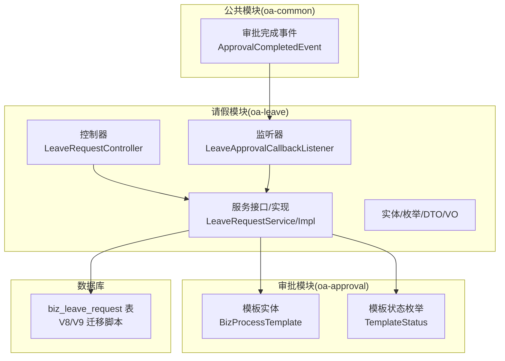
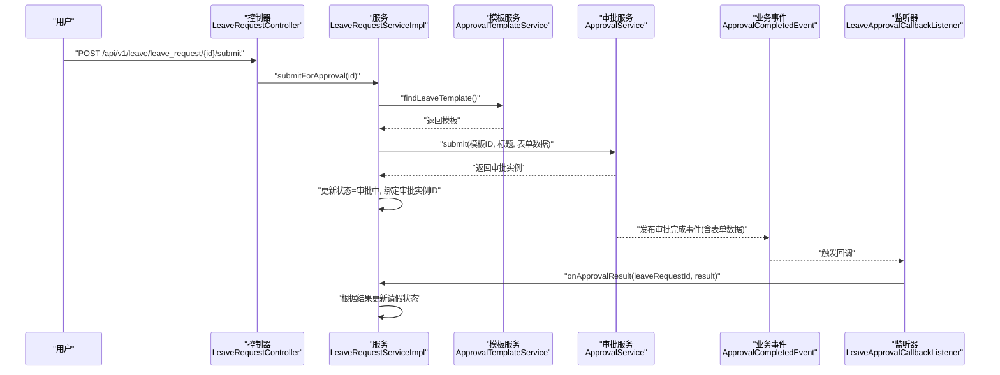
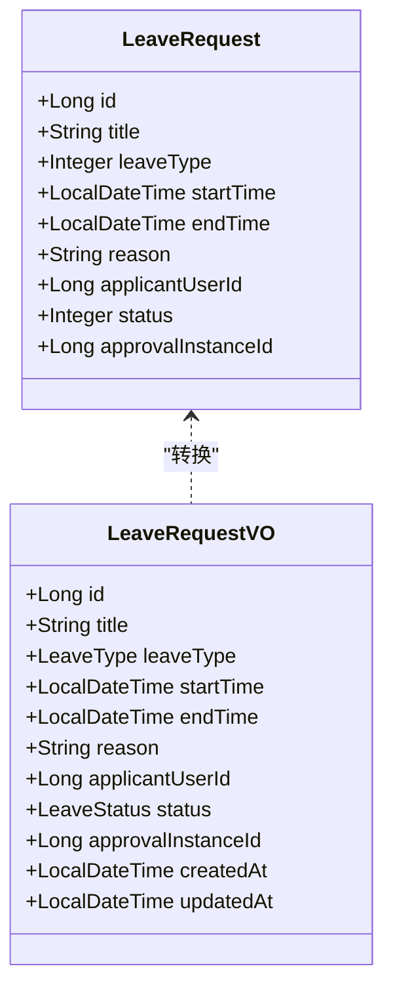
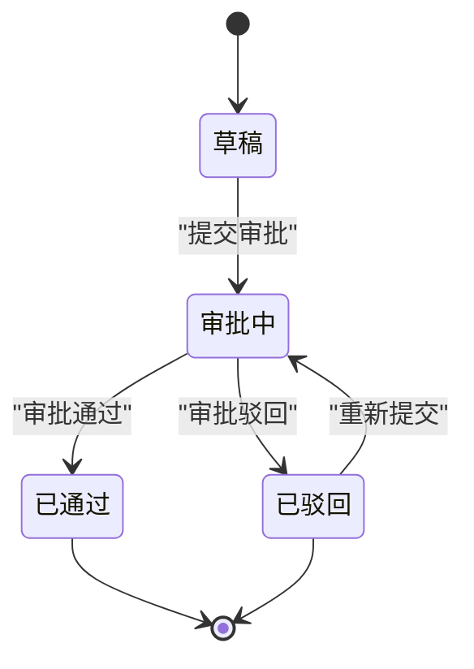
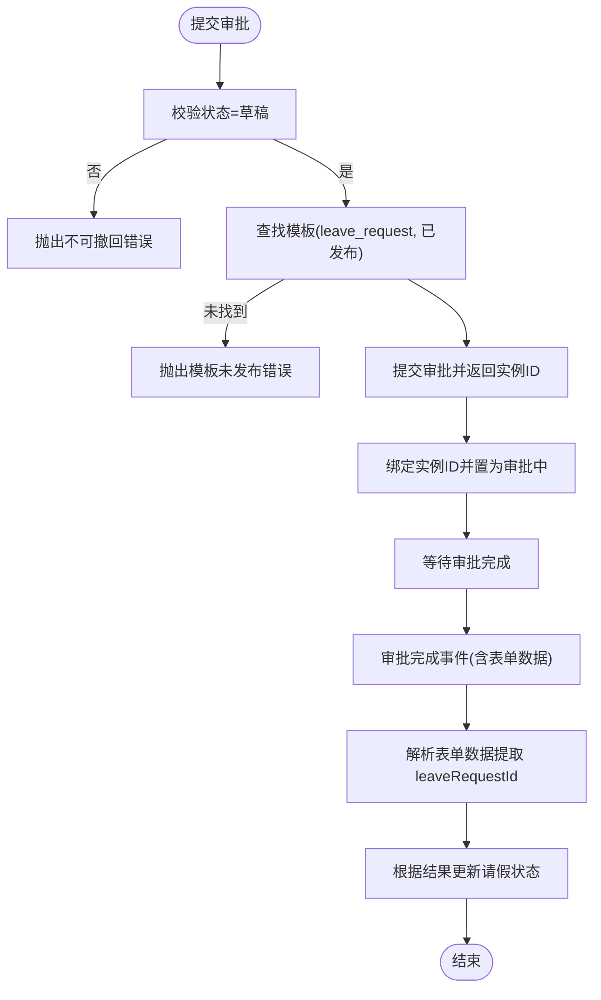
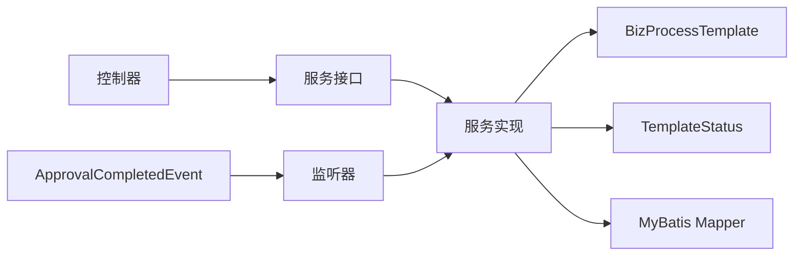

# 请假业务模块 (oa-leave)

<cite>
**本文引用的文件**
- [LeaveRequest.java](file://oa-leave/src/main/java/com/oa/admin/leave/entity/LeaveRequest.java)
- [LeaveType.java](file://oa-leave/src/main/java/com/oa/admin/leave/enums/LeaveType.java)
- [LeaveStatus.java](file://oa-leave/src/main/java/com/oa/admin/leave/enums/LeaveStatus.java)
- [LeaveRequestController.java](file://oa-leave/src/main/java/com/oa/admin/leave/controller/LeaveRequestController.java)
- [LeaveRequestService.java](file://oa-leave/src/main/java/com/oa/admin/leave/service/LeaveRequestService.java)
- [LeaveRequestServiceImpl.java](file://oa-leave/src/main/java/com/oa/admin/leave/service/impl/LeaveRequestServiceImpl.java)
- [LeaveApprovalCallbackListener.java](file://oa-leave/src/main/java/com/oa/admin/leave/listener/LeaveApprovalCallbackListener.java)
- [LeaveRequestCreateDTO.java](file://oa-leave/src/main/java/com/oa/admin/leave/dto/LeaveRequestCreateDTO.java)
- [LeaveRequestUpdateDTO.java](file://oa-leave/src/main/java/com/oa/admin/leave/dto/LeaveRequestUpdateDTO.java)
- [LeaveRequestVO.java](file://oa-leave/src/main/java/com/oa/admin/leave/vo/LeaveRequestVO.java)
- [V8__leave_module.sql](file://oa-app/src/main/resources/db/migration/V8__leave_module.sql)
- [V9__leave_approval_integration.sql](file://oa-app/src/main/resources/db/migration/V9__leave_approval_integration.sql)
- [BizProcessTemplate.java](file://oa-approval/src/main/java/com/oa/admin/approval/entity/BizProcessTemplate.java)
- [TemplateStatus.java](file://oa-approval/src/main/java/com/oa/admin/approval/enums/TemplateStatus.java)
- [ApprovalCompletedEvent.java](file://oa-common/src/main/java/com/oa/admin/common/event/ApprovalCompletedEvent.java)
</cite>

## 目录
1. [简介](#简介)
2. [项目结构](#项目结构)
3. [核心组件](#核心组件)
4. [架构总览](#架构总览)
5. [详细组件分析](#详细组件分析)
6. [依赖分析](#依赖分析)
7. [性能考虑](#性能考虑)
8. [故障排查指南](#故障排查指南)
9. [结论](#结论)
10. [附录：API 接口文档与业务示例](#附录api-接口文档与业务示例)

## 简介
本文件为 oa-leave 请假业务模块的架构与实现文档，覆盖领域模型设计、请假类型与状态枚举、请假与审批流程的集成方式（业务数据与审批实例关联、审批回调与状态同步）、请假申请的完整业务流程，以及面向前端的 API 接口说明与典型业务示例。该模块采用分层架构：控制器层负责对外暴露 REST API；服务层封装业务规则与流程编排；持久层映射数据库表；事件监听器实现与审批系统的解耦回调。

## 项目结构
请假模块位于独立子工程中，包含控制器、服务、实体、枚举、DTO、VO 与监听器等标准分层结构，并通过数据库迁移脚本定义业务表结构及与审批系统的集成字段。

图表来源
- [LeaveRequestController.java:1-68](file://oa-leave/src/main/java/com/oa/admin/leave/controller/LeaveRequestController.java#L1-L68)
- [LeaveRequestServiceImpl.java:1-185](file://oa-leave/src/main/java/com/oa/admin/leave/service/impl/LeaveRequestServiceImpl.java#L1-L185)
- [LeaveApprovalCallbackListener.java:1-49](file://oa-leave/src/main/java/com/oa/admin/leave/listener/LeaveApprovalCallbackListener.java#L1-L49)
- [BizProcessTemplate.java:1-29](file://oa-approval/src/main/java/com/oa/admin/approval/entity/BizProcessTemplate.java#L1-L29)
- [TemplateStatus.java:1-26](file://oa-approval/src/main/java/com/oa/admin/approval/enums/TemplateStatus.java#L1-L26)
- [ApprovalCompletedEvent.java:1-35](file://oa-common/src/main/java/com/oa/admin/common/event/ApprovalCompletedEvent.java#L1-L35)
- [V8__leave_module.sql:1-20](file://oa-app/src/main/resources/db/migration/V8__leave_module.sql#L1-L20)
- [V9__leave_approval_integration.sql:1-5](file://oa-app/src/main/resources/db/migration/V9__leave_approval_integration.sql#L1-L5)

章节来源
- [LeaveRequestController.java:1-68](file://oa-leave/src/main/java/com/oa/admin/leave/controller/LeaveRequestController.java#L1-L68)
- [LeaveRequestServiceImpl.java:1-185](file://oa-leave/src/main/java/com/oa/admin/leave/service/impl/LeaveRequestServiceImpl.java#L1-L185)
- [V8__leave_module.sql:1-20](file://oa-app/src/main/resources/db/migration/V8__leave_module.sql#L1-L20)
- [V9__leave_approval_integration.sql:1-5](file://oa-app/src/main/resources/db/migration/V9__leave_approval_integration.sql#L1-L5)

## 核心组件
- 实体与数据模型
  - LeaveRequest：请假申请实体，包含标题、类型、起止时间、原因、申请人、状态、关联审批实例 ID 等字段。
  - 数据库表 biz_leave_request 由迁移脚本定义，含索引优化查询。
- 枚举设计
  - LeaveType：请假类型（年假、病假、事假），提供 code 与 label 映射。
  - LeaveStatus：请假状态（草稿、审批中、已通过、已驳回、已取消）。
- 控制器
  - 提供列表、详情、创建、更新、删除、提交审批、重新提交等接口。
- 服务层
  - 封装业务规则：草稿校验、模板查找、提交审批、状态同步、VO 转换。
- 监听器
  - 订阅审批完成事件，解析表单数据中的 leaveRequestId 并调用服务更新请假状态。
- DTO/VO
  - Create/Update DTO 用于接收请求参数；VO 用于响应展示。

章节来源
- [LeaveRequest.java:1-48](file://oa-leave/src/main/java/com/oa/admin/leave/entity/LeaveRequest.java#L1-L48)
- [LeaveType.java:1-40](file://oa-leave/src/main/java/com/oa/admin/leave/enums/LeaveType.java#L1-L40)
- [LeaveStatus.java:1-42](file://oa-leave/src/main/java/com/oa/admin/leave/enums/LeaveStatus.java#L1-L42)
- [LeaveRequestController.java:1-68](file://oa-leave/src/main/java/com/oa/admin/leave/controller/LeaveRequestController.java#L1-L68)
- [LeaveRequestService.java:1-42](file://oa-leave/src/main/java/com/oa/admin/leave/service/LeaveRequestService.java#L1-L42)
- [LeaveRequestServiceImpl.java:1-185](file://oa-leave/src/main/java/com/oa/admin/leave/service/impl/LeaveRequestServiceImpl.java#L1-L185)
- [LeaveApprovalCallbackListener.java:1-49](file://oa-leave/src/main/java/com/oa/admin/leave/listener/LeaveApprovalCallbackListener.java#L1-L49)
- [LeaveRequestCreateDTO.java:1-29](file://oa-leave/src/main/java/com/oa/admin/leave/dto/LeaveRequestCreateDTO.java#L1-L29)
- [LeaveRequestUpdateDTO.java:1-29](file://oa-leave/src/main/java/com/oa/admin/leave/dto/LeaveRequestUpdateDTO.java#L1-L29)
- [LeaveRequestVO.java:1-45](file://oa-leave/src/main/java/com/oa/admin/leave/vo/LeaveRequestVO.java#L1-L45)

## 架构总览
请假模块与审批系统通过“模板+实例+事件”的方式解耦集成：
- 业务侧在提交审批时选择“leave_request”模板并传入业务数据（包含 leaveRequestId）。
- 审批完成后发布 ApprovalCompletedEvent，监听器提取业务 ID 并调用服务更新请假状态。
- 服务层在事务内更新状态，确保一致性。

图表来源
- [LeaveRequestController.java:56-60](file://oa-leave/src/main/java/com/oa/admin/leave/controller/LeaveRequestController.java#L56-L60)
- [LeaveRequestServiceImpl.java:96-151](file://oa-leave/src/main/java/com/oa/admin/leave/service/impl/LeaveRequestServiceImpl.java#L96-L151)
- [BizProcessTemplate.java:1-29](file://oa-approval/src/main/java/com/oa/admin/approval/entity/BizProcessTemplate.java#L1-L29)
- [TemplateStatus.java:1-26](file://oa-approval/src/main/java/com/oa/admin/approval/enums/TemplateStatus.java#L1-L26)
- [ApprovalCompletedEvent.java:1-35](file://oa-common/src/main/java/com/oa/admin/common/event/ApprovalCompletedEvent.java#L1-L35)
- [LeaveApprovalCallbackListener.java:24-33](file://oa-leave/src/main/java/com/oa/admin/leave/listener/LeaveApprovalCallbackListener.java#L24-L33)

## 详细组件分析

### 领域模型与数据结构
- 实体字段与约束
  - 主键自增 id
  - 标题、请假类型、起止时间、原因、申请人 ID、状态、关联审批实例 ID、创建/更新时间
  - 数据库层面提供申请人与状态索引，便于查询与统计
- VO 层转换
  - 将枚举 code 转为前端可读 label，保证对外输出一致

图表来源
- [LeaveRequest.java:1-48](file://oa-leave/src/main/java/com/oa/admin/leave/entity/LeaveRequest.java#L1-L48)
- [LeaveRequestVO.java:1-45](file://oa-leave/src/main/java/com/oa/admin/leave/vo/LeaveRequestVO.java#L1-L45)

章节来源
- [LeaveRequest.java:1-48](file://oa-leave/src/main/java/com/oa/admin/leave/entity/LeaveRequest.java#L1-L48)
- [LeaveRequestVO.java:1-45](file://oa-leave/src/main/java/com/oa/admin/leave/vo/LeaveRequestVO.java#L1-L45)
- [V8__leave_module.sql:1-20](file://oa-app/src/main/resources/db/migration/V8__leave_module.sql#L1-L20)
- [V9__leave_approval_integration.sql:1-5](file://oa-app/src/main/resources/db/migration/V9__leave_approval_integration.sql#L1-L5)

### 请假类型与业务含义
- 年假：带薪假期，通常有年度配额与使用限制，审批流程相对简化。
- 病假：因健康原因申请，需提供合理证明，流程侧重合规性。
- 事假：个人事务，一般不带薪或按公司政策折算，流程偏灵活。
- 枚举设计：提供 code 与 label 的双向映射，支持 JSON 序列化/反序列化。

章节来源
- [LeaveType.java:1-40](file://oa-leave/src/main/java/com/oa/admin/leave/enums/LeaveType.java#L1-L40)

### 状态流转逻辑
- 草稿 → 审批中：提交审批时校验状态必须为草稿。
- 审批中 → 已通过/已驳回：审批完成后由监听器根据结果更新。
- 已通过：流程结束，业务生效。
- 已驳回：允许重新编辑后再次提交。
- 已取消：预留状态，可在业务需要时使用。

图表来源
- [LeaveStatus.java:1-42](file://oa-leave/src/main/java/com/oa/admin/leave/enums/LeaveStatus.java#L1-L42)
- [LeaveRequestServiceImpl.java:96-151](file://oa-leave/src/main/java/com/oa/admin/leave/service/impl/LeaveRequestServiceImpl.java#L96-L151)

章节来源
- [LeaveStatus.java:1-42](file://oa-leave/src/main/java/com/oa/admin/leave/enums/LeaveStatus.java#L1-L42)
- [LeaveRequestServiceImpl.java:96-151](file://oa-leave/src/main/java/com/oa/admin/leave/service/impl/LeaveRequestServiceImpl.java#L96-L151)

### 请假与审批流程集成
- 模板绑定
  - 服务端通过模板 key="leave_request" 且状态为已发布的模板发起审批。
- 表单数据约定
  - 提交审批时将业务主键（leaveRequestId）写入表单数据，以便回调时定位业务记录。
- 回调与状态同步
  - 监听 ApprovalCompletedEvent，解析表单数据提取 leaveRequestId，调用服务更新请假状态。
- 异常处理
  - 未找到模板或模板未发布时抛出业务异常；非法状态变更同样抛出异常。

图表来源
- [LeaveRequestServiceImpl.java:96-164](file://oa-leave/src/main/java/com/oa/admin/leave/service/impl/LeaveRequestServiceImpl.java#L96-L164)
- [LeaveApprovalCallbackListener.java:24-47](file://oa-leave/src/main/java/com/oa/admin/leave/listener/LeaveApprovalCallbackListener.java#L24-L47)
- [ApprovalCompletedEvent.java:1-35](file://oa-common/src/main/java/com/oa/admin/common/event/ApprovalCompletedEvent.java#L1-L35)

章节来源
- [LeaveRequestServiceImpl.java:96-164](file://oa-leave/src/main/java/com/oa/admin/leave/service/impl/LeaveRequestServiceImpl.java#L96-L164)
- [LeaveApprovalCallbackListener.java:24-47](file://oa-leave/src/main/java/com/oa/admin/leave/listener/LeaveApprovalCallbackListener.java#L24-L47)
- [ApprovalCompletedEvent.java:1-35](file://oa-common/src/main/java/com/oa/admin/common/event/ApprovalCompletedEvent.java#L1-L35)

### 业务规则与边界
- 创建：默认状态为草稿，申请人 ID 来源于登录上下文。
- 更新：仅允许在草稿状态下修改；驳回后需重新编辑再提交。
- 删除：直接移除记录。
- 查询：支持按标题、类型、申请人、状态等条件分页查询。

章节来源
- [LeaveRequestServiceImpl.java:62-94](file://oa-leave/src/main/java/com/oa/admin/leave/service/impl/LeaveRequestServiceImpl.java#L62-L94)
- [LeaveRequestController.java:25-54](file://oa-leave/src/main/java/com/oa/admin/leave/controller/LeaveRequestController.java#L25-L54)

## 依赖分析
- 内部依赖
  - 控制器依赖服务接口；服务实现依赖模板与审批服务、Mapper、VO 转换。
  - 监听器依赖服务与 ObjectMapper。
- 外部依赖
  - 审批模板与状态枚举来自审批模块。
  - 事件来源于公共模块。
  - 数据持久化依赖 MyBatis Plus 与数据库迁移脚本。

图表来源
- [LeaveRequestController.java:1-68](file://oa-leave/src/main/java/com/oa/admin/leave/controller/LeaveRequestController.java#L1-L68)
- [LeaveRequestServiceImpl.java:1-185](file://oa-leave/src/main/java/com/oa/admin/leave/service/impl/LeaveRequestServiceImpl.java#L1-L185)
- [LeaveApprovalCallbackListener.java:1-49](file://oa-leave/src/main/java/com/oa/admin/leave/listener/LeaveApprovalCallbackListener.java#L1-L49)
- [BizProcessTemplate.java:1-29](file://oa-approval/src/main/java/com/oa/admin/approval/entity/BizProcessTemplate.java#L1-L29)
- [TemplateStatus.java:1-26](file://oa-approval/src/main/java/com/oa/admin/approval/enums/TemplateStatus.java#L1-L26)
- [ApprovalCompletedEvent.java:1-35](file://oa-common/src/main/java/com/oa/admin/common/event/ApprovalCompletedEvent.java#L1-L35)

章节来源
- [LeaveRequestServiceImpl.java:1-185](file://oa-leave/src/main/java/com/oa/admin/leave/service/impl/LeaveRequestServiceImpl.java#L1-L185)
- [LeaveApprovalCallbackListener.java:1-49](file://oa-leave/src/main/java/com/oa/admin/leave/listener/LeaveApprovalCallbackListener.java#L1-L49)

## 性能考虑
- 查询优化
  - 为申请人与状态建立索引，提升分页与筛选效率。
- 事务边界
  - 提交审批与状态更新均在事务内执行，保证一致性。
- 事件驱动
  - 使用事件解耦审批完成与业务状态更新，降低耦合度与响应延迟。
- DTO/VO 分离
  - 控制输出字段与输入参数，减少不必要的序列化开销。

## 故障排查指南
- 提交审批时报“模板未发布”
  - 检查模板 key 是否为 leave_request，状态是否为已发布，版本是否正确。
- 提交审批时报“不可撤回”
  - 确认当前请假状态为草稿；若为其他状态则无法提交。
- 审批完成后状态未更新
  - 检查审批完成事件是否发布、监听器是否注册、表单数据中是否包含 leaveRequestId。
- 查询不到数据
  - 核对查询条件与索引使用情况，确认数据是否存在。

章节来源
- [LeaveRequestServiceImpl.java:103-105](file://oa-leave/src/main/java/com/oa/admin/leave/service/impl/LeaveRequestServiceImpl.java#L103-L105)
- [LeaveRequestServiceImpl.java:160-163](file://oa-leave/src/main/java/com/oa/admin/leave/service/impl/LeaveRequestServiceImpl.java#L160-L163)
- [LeaveApprovalCallbackListener.java:24-47](file://oa-leave/src/main/java/com/oa/admin/leave/listener/LeaveApprovalCallbackListener.java#L24-L47)

## 结论
请假模块通过清晰的领域模型、严格的业务规则与事件驱动的审批集成，实现了从申请到审批完成的闭环管理。模块设计具备良好的扩展性与可维护性，未来可在模板策略、通知机制、报表统计等方面进一步增强。

## 附录：API 接口文档与业务示例

### API 接口清单
- GET /api/v1/leave/leave_request
  - 权限：leave:leave_request:list
  - 功能：分页查询请假申请
  - 参数：标题、类型、申请人、状态（支持组合查询）
- GET /api/v1/leave/leave_request/{id}
  - 权限：leave:leave_request:query
  - 功能：获取请假申请详情
- POST /api/v1/leave/leave_request
  - 权限：leave:leave_request:add
  - 功能：创建请假申请（默认草稿）
- PUT /api/v1/leave/leave_request/{id}
  - 权限：leave:leave_request:edit
  - 功能：更新请假申请（仅草稿可更新）
- DELETE /api/v1/leave/leave_request/{id}
  - 权限：leave:leave_request:remove
  - 功能：删除请假申请
- POST /api/v1/leave/leave_request/{id}/submit
  - 权限：leave:leave_request:submit
  - 功能：提交请假审批（要求状态为草稿）
- POST /api/v1/leave/leave_request/{id}/resubmit
  - 权限：leave:leave_request:edit
  - 功能：驳回后的重新编辑与提交（仅已驳回可重提）

章节来源
- [LeaveRequestController.java:25-67](file://oa-leave/src/main/java/com/oa/admin/leave/controller/LeaveRequestController.java#L25-L67)

### 典型业务示例
- 新建并提交请假
  - 步骤：创建 → 填写标题、类型、起止时间、原因 → 提交审批 → 等待审批完成 → 查看状态
  - 关键点：提交前状态必须为草稿；提交时会绑定审批实例 ID 并置为审批中
- 驳回后重新编辑
  - 步骤：编辑内容 → 重新提交 → 审批完成后更新状态
  - 关键点：仅当状态为已驳回时允许重新编辑并提交
- 查询与筛选
  - 示例：按申请人、请假类型、状态进行分页查询，支持标题模糊匹配

章节来源
- [LeaveRequestServiceImpl.java:62-136](file://oa-leave/src/main/java/com/oa/admin/leave/service/impl/LeaveRequestServiceImpl.java#L62-L136)
- [LeaveRequestController.java:25-67](file://oa-leave/src/main/java/com/oa/admin/leave/controller/LeaveRequestController.java#L25-L67)