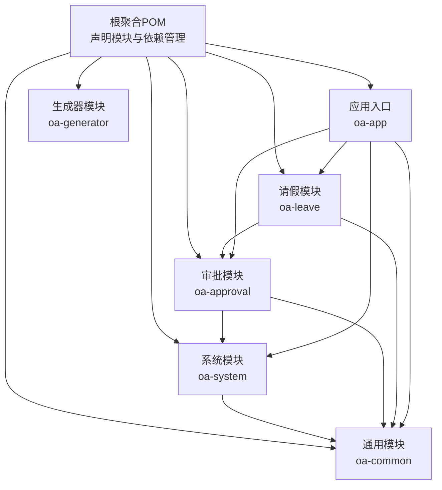
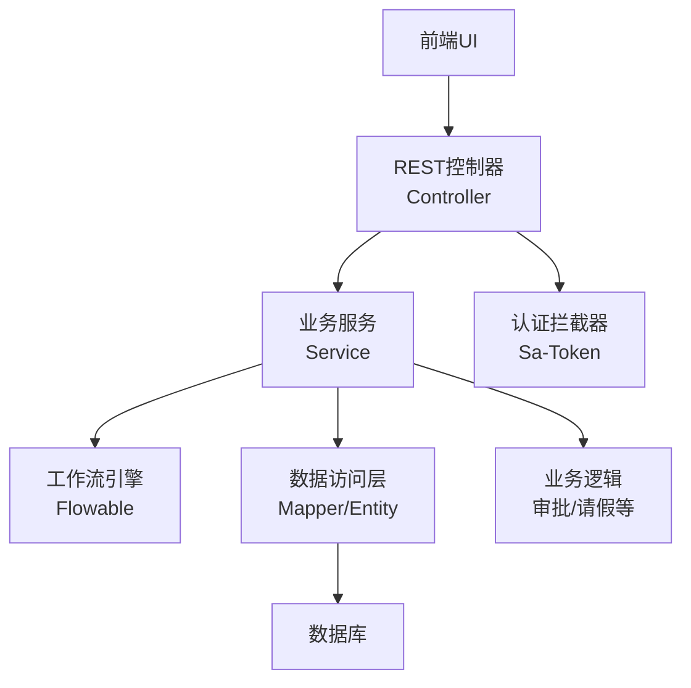
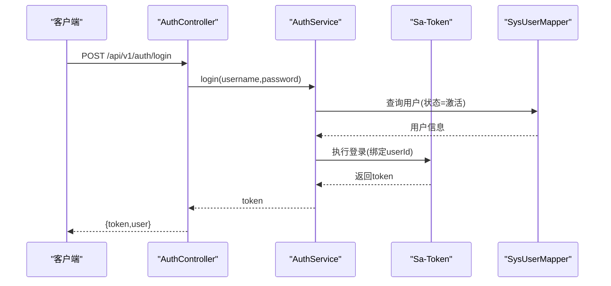
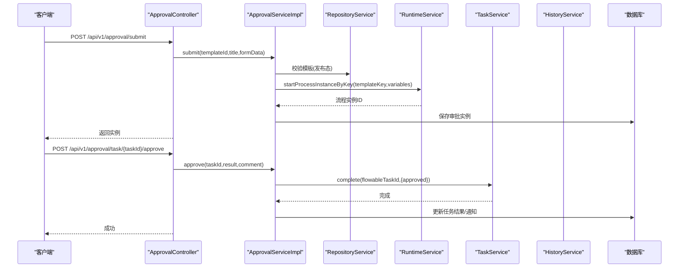
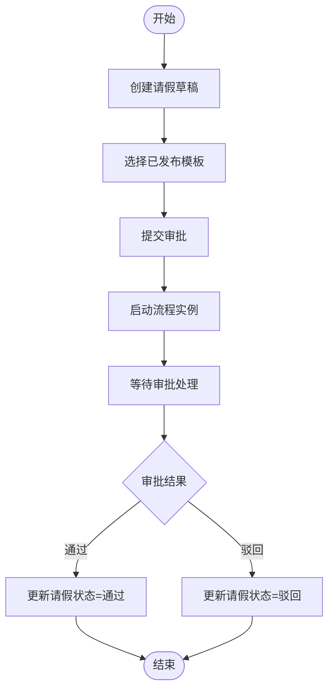
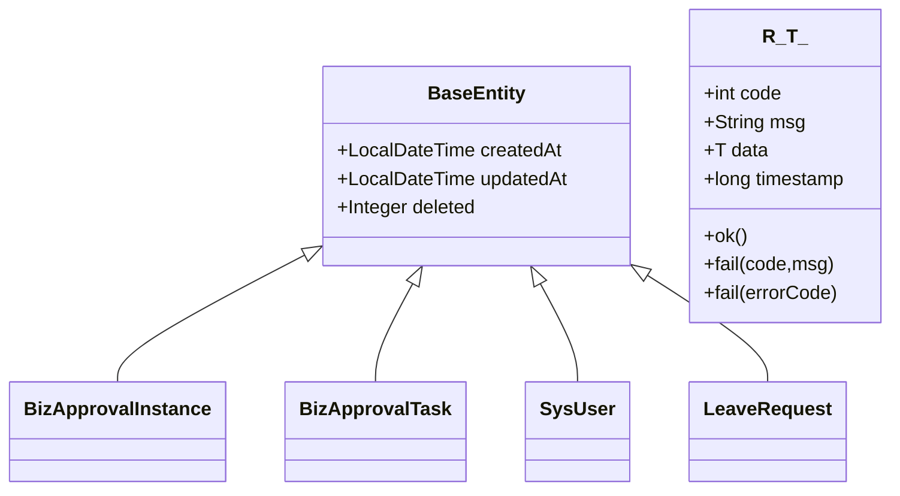
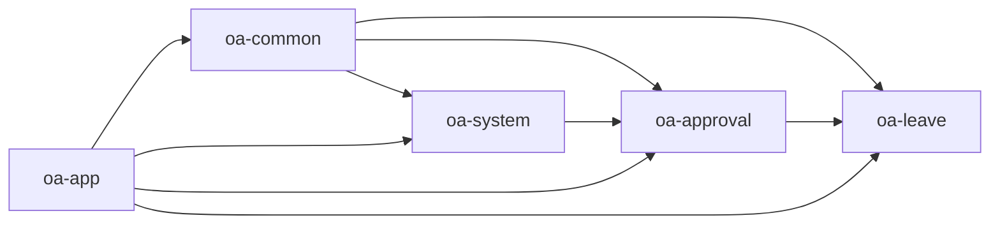

# 系统架构

<cite>
**本文引用的文件**
- [根聚合POM](file://pom.xml)
- [应用入口类](file://oa-app/src/main/java/com/oa/admin/OaAdminApplication.java)
- [应用配置文件](file://oa-app/src/main/resources/application.yml)
- [通用模块POM](file://oa-common/pom.xml)
- [系统模块POM](file://oa-system/pom.xml)
- [审批模块POM](file://oa-approval/pom.xml)
- [请假模块POM](file://oa-leave/pom.xml)
- [生成器模块POM](file://oa-generator/pom.xml)
- [Flowable配置](file://oa-approval/src/main/java/com/oa/admin/approval/config/FlowableConfig.java)
- [Sa-Token配置](file://oa-system/src/main/java/com/oa/admin/system/config/SaTokenConfig.java)
- [MyBatis-Plus自动填充处理器](file://oa-common/src/main/java/com/oa/admin/common/config/MyBatisPlusAutoFillHandler.java)
- [基础实体类](file://oa-common/src/main/java/com/oa/admin/common/entity/BaseEntity.java)
- [统一响应包装类](file://oa-common/src/main/java/com/oa/admin/common/result/R.java)
- [审批服务实现](file://oa-approval/src/main/java/com/oa/admin/approval/service/impl/ApprovalServiceImpl.java)
- [请假服务实现](file://oa-leave/src/main/java/com/oa/admin/leave/service/impl/LeaveRequestServiceImpl.java)
- [审批控制器](file://oa-approval/src/main/java/com/oa/admin/approval/controller/ApprovalController.java)
- [系统认证控制器](file://oa-system/src/main/java/com/oa/admin/system/controller/AuthController.java)
- [请假控制器](file://oa-leave/src/main/java/com/oa/admin/leave/controller/LeaveRequestController.java)
</cite>

## 目录
1. [引言](#引言)
2. [项目结构](#项目结构)
3. [核心组件](#核心组件)
4. [架构总览](#架构总览)
5. [详细组件分析](#详细组件分析)
6. [依赖分析](#依赖分析)
7. [性能考虑](#性能考虑)
8. [故障排查指南](#故障排查指南)
9. [结论](#结论)
10. [附录](#附录)

## 引言
本系统是一个基于Spring Boot的OA审批管理平台，采用分层架构与模块化设计，结合Flowable工作流引擎实现审批流程编排，使用Sa-Token进行认证授权，MyBatis-Plus作为ORM框架，并通过Flyway进行数据库版本治理。系统以Maven多模块组织代码，清晰划分表现层（API）、业务层（Service）、数据访问层（Mapper/Entity），并提供通用工具与基础设施模块，确保高内聚低耦合与可扩展性。

## 项目结构
系统采用Maven聚合工程，顶层POM声明所有子模块，各模块按功能域拆分：通用模块（oa-common）承载公共能力；系统模块（oa-system）负责RBAC与认证；审批模块（oa-approval）承载审批流程与工作流；请假模块（oa-leave）承载具体业务场景；应用入口（oa-app）整合运行环境；生成器模块（oa-generator）提供代码与模板生成能力。

**图表来源**
- [根聚合POM:21-28](file://pom.xml#L21-L28)
- [通用模块POM:17-51](file://oa-common/pom.xml#L17-L51)
- [系统模块POM:14-36](file://oa-system/pom.xml#L14-L36)
- [审批模块POM:14-46](file://oa-approval/pom.xml#L14-L46)
- [请假模块POM:14-26](file://oa-leave/pom.xml#L14-L26)
- [生成器模块POM:16-49](file://oa-generator/pom.xml#L16-L49)

**章节来源**
- [根聚合POM:21-28](file://pom.xml#L21-L28)
- [通用模块POM:17-51](file://oa-common/pom.xml#L17-L51)
- [系统模块POM:14-36](file://oa-system/pom.xml#L14-L36)
- [审批模块POM:14-46](file://oa-approval/pom.xml#L14-L46)
- [请假模块POM:14-26](file://oa-leave/pom.xml#L14-L26)
- [生成器模块POM:16-49](file://oa-generator/pom.xml#L16-L49)

## 核心组件
- 分层架构
  - 表现层：REST控制器（Controller）负责HTTP请求接入与权限校验，返回统一响应包装。
  - 业务层：Service实现具体业务逻辑，协调工作流引擎与数据访问层。
  - 数据访问层：Mapper/Entity+MyBatis-Plus实现数据持久化，配合通用自动填充与逻辑删除。
- 模块化设计
  - 通用模块提供基础实体、异常、响应封装与公共配置。
  - 系统模块提供认证鉴权与RBAC能力。
  - 审批模块承载工作流编排、任务处理与通知。
  - 业务模块（如请假）基于审批模板发起流程实例。
  - 应用入口模块整合运行环境与数据库迁移。
- 技术选型与架构考量
  - Spring Boot：统一容器与自动配置，简化开发与部署。
  - MyBatis-Plus：增强ORM能力，自动填充、逻辑删除、分页插件等提升开发效率。
  - Sa-Token：轻量级认证框架，支持会话共享、并发登录控制与接口拦截。
  - Flowable：企业级工作流引擎，支持BPMN建模与流程实例执行。
  - Flyway：数据库版本治理，保证Schema一致性与可追溯性。

**章节来源**
- [应用入口类:11-18](file://oa-app/src/main/java/com/oa/admin/OaAdminApplication.java#L11-L18)
- [应用配置文件:1-59](file://oa-app/src/main/resources/application.yml#L1-L59)
- [通用模块POM:17-51](file://oa-common/pom.xml#L17-L51)
- [系统模块POM:14-36](file://oa-system/pom.xml#L14-L36)
- [审批模块POM:14-46](file://oa-approval/pom.xml#L14-L46)
- [请假模块POM:14-26](file://oa-leave/pom.xml#L14-L26)

## 架构总览
系统采用前后端分离架构，前端通过HTTP API与后端交互。后端以控制器为入口，经由Service层调用工作流引擎与数据访问层，最终落库并返回统一响应格式。认证通过拦截器在进入业务前完成，权限通过注解进行细粒度控制。

**图表来源**
- [审批控制器:29-32](file://oa-approval/src/main/java/com/oa/admin/approval/controller/ApprovalController.java#L29-L32)
- [系统认证控制器:14-17](file://oa-system/src/main/java/com/oa/admin/system/controller/AuthController.java#L14-L17)
- [请假控制器:18-21](file://oa-leave/src/main/java/com/oa/admin/leave/controller/LeaveRequestController.java#L18-L21)
- [审批服务实现:60-61](file://oa-approval/src/main/java/com/oa/admin/approval/service/impl/ApprovalServiceImpl.java#L60-L61)
- [请假服务实现:33-36](file://oa-leave/src/main/java/com/oa/admin/leave/service/impl/LeaveRequestServiceImpl.java#L33-L36)

## 详细组件分析

### 认证与授权（Sa-Token）
- 配置拦截器对受保护路径进行登录校验，排除注册/登录等公开接口。
- 登录成功后生成令牌，后续请求通过令牌识别身份。
- 控制器方法上使用权限注解进行细粒度权限控制。

**图表来源**
- [Sa-Token配置:13-24](file://oa-system/src/main/java/com/oa/admin/system/config/SaTokenConfig.java#L13-L24)
- [系统认证控制器:20-25](file://oa-system/src/main/java/com/oa/admin/system/controller/AuthController.java#L20-L25)
- [系统认证服务实现:24-35](file://oa-system/src/main/java/com/oa/admin/system/service/impl/AuthServiceImpl.java#L24-L35)

**章节来源**
- [Sa-Token配置:13-24](file://oa-system/src/main/java/com/oa/admin/system/config/SaTokenConfig.java#L13-L24)
- [系统认证控制器:20-25](file://oa-system/src/main/java/com/oa/admin/system/controller/AuthController.java#L20-L25)
- [系统认证服务实现:24-35](file://oa-system/src/main/java/com/oa/admin/system/service/impl/AuthServiceImpl.java#L24-L35)

### 工作流与审批（Flowable）
- 通过配置类注册事件监听器，扩展流程结束后的业务处理。
- Service层封装提交、审批、转办、撤回、终止等操作，协调Flowable引擎与本地数据。
- 控制器提供审批相关API，配合权限注解进行访问控制。

**图表来源**
- [Flowable配置:17-29](file://oa-approval/src/main/java/com/oa/admin/approval/config/FlowableConfig.java#L17-L29)
- [审批控制器:37-53](file://oa-approval/src/main/java/com/oa/admin/approval/controller/ApprovalController.java#L37-L53)
- [审批服务实现:122-168](file://oa-approval/src/main/java/com/oa/admin/approval/service/impl/ApprovalServiceImpl.java#L122-L168)
- [审批服务实现:170-240](file://oa-approval/src/main/java/com/oa/admin/approval/service/impl/ApprovalServiceImpl.java#L170-L240)

**章节来源**
- [Flowable配置:17-29](file://oa-approval/src/main/java/com/oa/admin/approval/config/FlowableConfig.java#L17-L29)
- [审批控制器:37-53](file://oa-approval/src/main/java/com/oa/admin/approval/controller/ApprovalController.java#L37-L53)
- [审批服务实现:122-168](file://oa-approval/src/main/java/com/oa/admin/approval/service/impl/ApprovalServiceImpl.java#L122-L168)
- [审批服务实现:170-240](file://oa-approval/src/main/java/com/oa/admin/approval/service/impl/ApprovalServiceImpl.java#L170-L240)

### 业务流程：请假审批
- 业务侧创建请假草稿，选择已发布模板后提交到审批服务。
- 审批服务启动流程实例并将业务主键写入表单数据。
- 审批完成后回调业务侧更新请假状态。

**图表来源**
- [请假服务实现:90-130](file://oa-leave/src/main/java/com/oa/admin/leave/service/impl/LeaveRequestServiceImpl.java#L90-L130)
- [审批服务实现:122-168](file://oa-approval/src/main/java/com/oa/admin/approval/service/impl/ApprovalServiceImpl.java#L122-L168)

**章节来源**
- [请假服务实现:90-130](file://oa-leave/src/main/java/com/oa/admin/leave/service/impl/LeaveRequestServiceImpl.java#L90-L130)
- [审批服务实现:122-168](file://oa-approval/src/main/java/com/oa/admin/approval/service/impl/ApprovalServiceImpl.java#L122-L168)

### 数据模型与实体基类
- 基础实体包含创建/更新时间与逻辑删除字段，配合自动填充处理器实现无感记录。
- 统一响应包装类提供标准返回结构，便于前端处理。

**图表来源**
- [基础实体类:14-25](file://oa-common/src/main/java/com/oa/admin/common/entity/BaseEntity.java#L14-L25)
- [统一响应包装类:11-43](file://oa-common/src/main/java/com/oa/admin/common/result/R.java#L11-L43)

**章节来源**
- [基础实体类:14-25](file://oa-common/src/main/java/com/oa/admin/common/entity/BaseEntity.java#L14-L25)
- [统一响应包装类:11-43](file://oa-common/src/main/java/com/oa/admin/common/result/R.java#L11-L43)

## 依赖分析
模块间依赖遵循“业务模块依赖通用与系统/审批模块”的原则，避免循环依赖，保持清晰的层次关系。

**图表来源**
- [根聚合POM:21-28](file://pom.xml#L21-L28)
- [系统模块POM:17-18](file://oa-system/pom.xml#L17-L18)
- [审批模块POM:17-22](file://oa-approval/pom.xml#L17-L22)
- [请假模块POM:17-22](file://oa-leave/pom.xml#L17-L22)

**章节来源**
- [根聚合POM:21-28](file://pom.xml#L21-L28)
- [系统模块POM:17-18](file://oa-system/pom.xml#L17-L18)
- [审批模块POM:17-22](file://oa-approval/pom.xml#L17-L22)
- [请假模块POM:17-22](file://oa-leave/pom.xml#L17-L22)

## 性能考虑
- 连接池与数据库优化：Hikari连接池参数可调，建议根据QPS与事务时长调整最大池大小与空闲超时。
- ORM与分页：MyBatis-Plus分页插件与条件构造器减少SQL负担，注意避免N+1查询。
- 缓存与会话：Redis用于Sa-Token会话存储，建议合理设置过期策略与序列化方式。
- 工作流并发：Flowable异步执行器默认关闭，适合中小规模并发；高并发场景可评估启用并行任务与独立队列。
- 监控与日志：开启必要的审计日志与慢查询监控，结合APM工具定位瓶颈。

## 故障排查指南
- 认证失败
  - 检查用户名是否存在且状态为激活，确认密码哈希匹配。
  - 排查拦截器是否正确拦截受保护路径。
- 权限不足
  - 确认用户角色是否具备相应权限点，检查控制器上的权限注解。
- 审批流程异常
  - 查看流程实例状态与历史活动，核对模板是否发布且版本正确。
  - 关注任务完成变量传递与监听器触发情况。
- 数据不一致
  - 检查自动填充与逻辑删除是否生效，确认事务边界与回滚策略。

**章节来源**
- [系统认证服务实现:30-32](file://oa-system/src/main/java/com/oa/admin/system/service/impl/AuthServiceImpl.java#L30-L32)
- [Sa-Token配置:17-22](file://oa-system/src/main/java/com/oa/admin/system/config/SaTokenConfig.java#L17-L22)
- [审批服务实现:125-131](file://oa-approval/src/main/java/com/oa/admin/approval/service/impl/ApprovalServiceImpl.java#L125-L131)
- [MyBatis-Plus自动填充处理器:12-24](file://oa-common/src/main/java/com/oa/admin/common/config/MyBatisPlusAutoFillHandler.java#L12-L24)

## 结论
该OA审批管理系统通过清晰的分层与模块化设计，结合Flowable工作流与Sa-Token认证，实现了可扩展、可维护的企业级审批平台。Maven多模块组织确保了职责分离与复用最大化；统一响应与自动填充等通用能力提升了开发效率与数据一致性。建议在生产环境中进一步完善缓存策略、异步化处理与监控告警体系，以支撑更高并发与更复杂的业务场景。

## 附录
- 配置要点
  - 数据源与连接池：通过环境变量与application.yml配置，确保连接池参数与数据库规格匹配。
  - Flyway迁移：初始化脚本位于资源目录，首次启动自动执行，后续变更需规范迁移脚本命名。
  - Sa-Token：令牌名称、超时与序列化策略可根据安全要求调整。
  - Flowable：数据库schema更新策略与异步执行器配置影响性能与可靠性。

**章节来源**
- [应用配置文件:4-59](file://oa-app/src/main/resources/application.yml#L4-L59)
- [应用入口类:11-18](file://oa-app/src/main/java/com/oa/admin/OaAdminApplication.java#L11-L18)