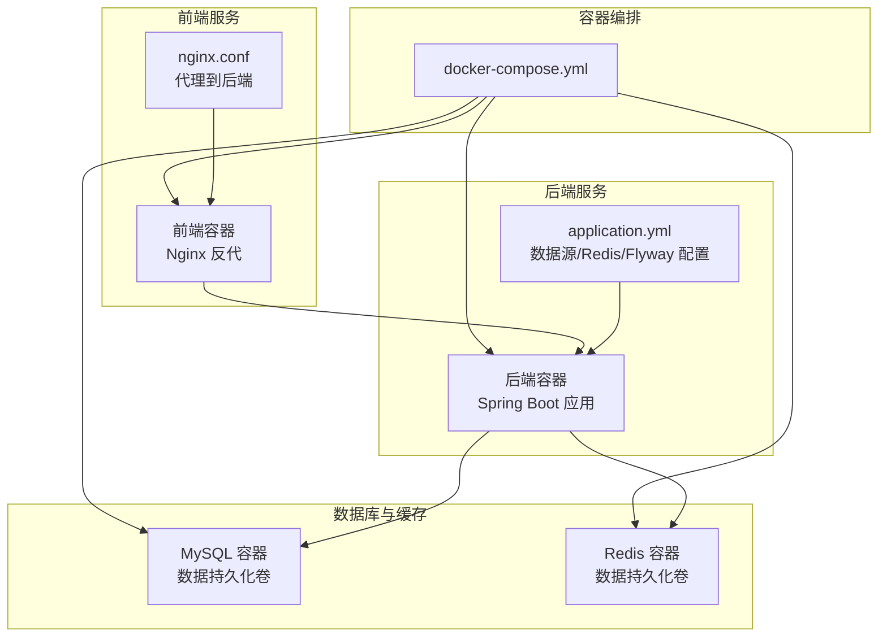
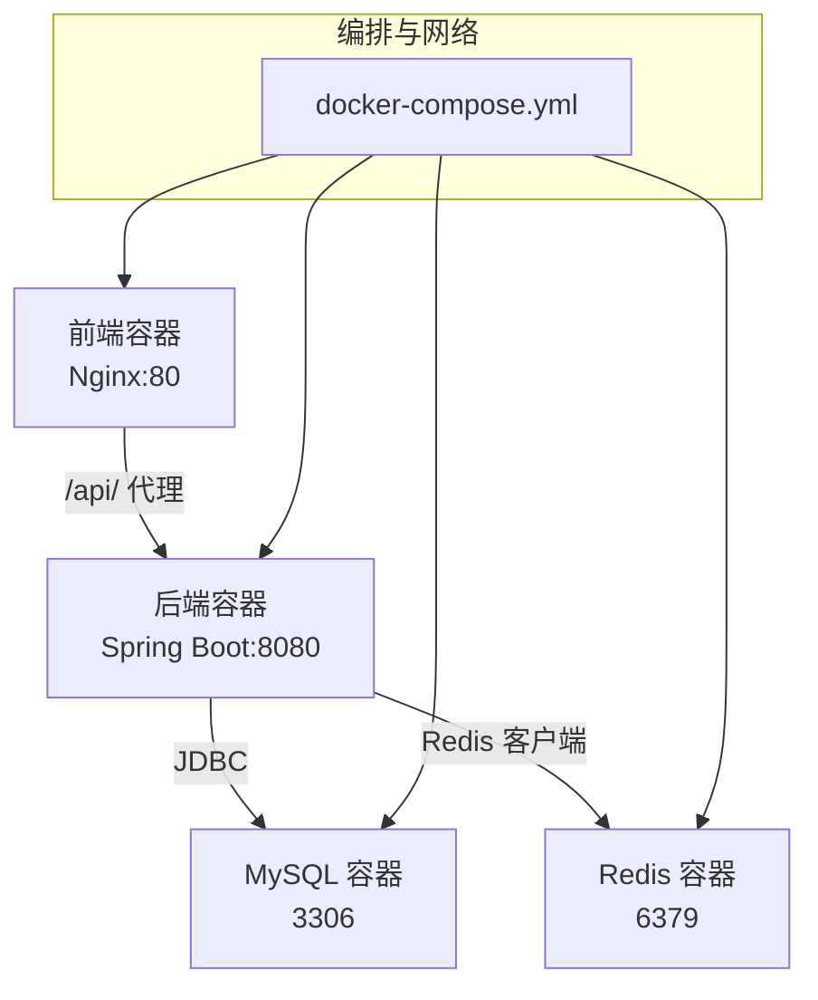
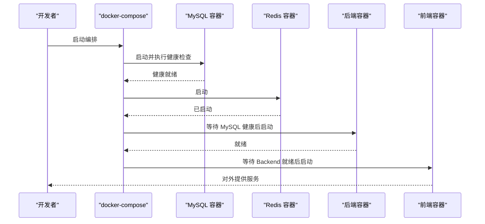

# Docker容器化部署

<cite>
**本文引用的文件**
- [docker-compose.yml](file://docker-compose.yml)
- [Dockerfile（后端）](file://Dockerfile)
- [Dockerfile（前端）](file://oa-ui/Dockerfile)
- [application.yml（后端配置）](file://oa-app/src/main/resources/application.yml)
- [nginx.conf（前端反向代理）](file://oa-ui/nginx.conf)
- [.dockerignore](file://.dockerignore)
- [init.sh（初始化脚本）](file://init.sh)
- [pom.xml（项目聚合配置）](file://pom.xml)
- [package.json（前端包配置）](file://oa-ui/package.json)
</cite>

## 目录
1. [简介](#简介)
2. [项目结构](#项目结构)
3. [核心组件](#核心组件)
4. [架构总览](#架构总览)
5. [详细组件分析](#详细组件分析)
6. [依赖关系分析](#依赖关系分析)
7. [性能与资源优化](#性能与资源优化)
8. [故障排查指南](#故障排查指南)
9. [结论](#结论)
10. [附录：部署策略与最佳实践](#附录部署策略与最佳实践)

## 简介
本文件面向使用 Docker 进行容器化部署的团队与个人，系统性说明本项目的容器化架构与运维要点。内容涵盖 docker-compose.yml 中各服务的配置参数、容器间依赖与健康检查、环境变量与敏感信息管理、本地与生产部署策略、网络与数据持久化、日志与故障排查、以及容器重启策略与资源限制建议。

## 项目结构
本项目采用多模块 Maven 聚合工程，后端为 Spring Boot 应用，前端为 Vue 3 + Vite 构建并通过 Nginx 提供静态服务。容器编排通过 docker-compose.yml 统一管理，包含 MySQL、Redis、后端应用与前端 Nginx 四个服务，并通过命名卷实现数据持久化。

图表来源
- [docker-compose.yml:1-66](file://docker-compose.yml#L1-L66)
- [Dockerfile（后端）:1-22](file://Dockerfile#L1-L22)
- [Dockerfile（前端）:1-15](file://oa-ui/Dockerfile#L1-L15)
- [application.yml（后端配置）:1-59](file://oa-app/src/main/resources/application.yml#L1-L59)
- [nginx.conf（前端反向代理）:1-18](file://oa-ui/nginx.conf#L1-L18)

章节来源
- [docker-compose.yml:1-66](file://docker-compose.yml#L1-L66)
- [Dockerfile（后端）:1-22](file://Dockerfile#L1-L22)
- [Dockerfile（前端）:1-15](file://oa-ui/Dockerfile#L1-L15)
- [application.yml（后端配置）:1-59](file://oa-app/src/main/resources/application.yml#L1-L59)
- [nginx.conf（前端反向代理）:1-18](file://oa-ui/nginx.conf#L1-L18)

## 核心组件
- MySQL 数据库服务
  - 基础镜像：mysql:8.0
  - 端口映射：宿主 13306 -> 容器 3306
  - 数据卷：mysql_data（命名卷）
  - 环境变量：根密码、数据库名、字符集、时区
  - 命令：设置字符集与排序规则
  - 健康检查：基于 mysqladmin ping
- Redis 缓存服务
  - 基础镜像：redis:7-alpine
  - 端口映射：宿主 16379 -> 容器 6379
  - 数据卷：redis_data（命名卷）
- 后端服务（Spring Boot）
  - 构建：多阶段构建（Maven 构建 + JRE 运行）
  - 端口映射：宿主 18080 -> 容器 8080
  - 依赖：MySQL（健康检查通过）、Redis（启动即满足）
  - 环境变量：数据源连接串、用户名、密码、Redis 主机与端口、时区
- 前端服务（Nginx）
  - 构建：多阶段构建（Node 构建 + Nginx 运行）
  - 端口映射：宿主 180 -> 容器 80
  - 依赖：后端服务
  - 反向代理：将 /api/ 请求转发至后端 8080

章节来源
- [docker-compose.yml:1-66](file://docker-compose.yml#L1-L66)
- [Dockerfile（后端）:1-22](file://Dockerfile#L1-L22)
- [Dockerfile（前端）:1-15](file://oa-ui/Dockerfile#L1-L15)
- [application.yml（后端配置）:1-59](file://oa-app/src/main/resources/application.yml#L1-L59)
- [nginx.conf（前端反向代理）:1-18](file://oa-ui/nginx.conf#L1-L18)

## 架构总览
下图展示容器间的依赖关系与通信路径，强调后端对数据库与缓存的依赖，以及前端通过 Nginx 反向代理访问后端 API 的流程。

图表来源
- [docker-compose.yml:1-66](file://docker-compose.yml#L1-L66)
- [nginx.conf（前端反向代理）:11-16](file://oa-ui/nginx.conf#L11-L16)
- [application.yml（后端配置）:4-35](file://oa-app/src/main/resources/application.yml#L4-L35)

## 详细组件分析

### MySQL 服务
- 配置要点
  - 环境变量：根密码、数据库名、字符集、时区
  - 命令：设置服务器字符集与排序规则
  - 健康检查：定期执行 mysqladmin ping
  - 端口映射：13306:3306
  - 数据卷：mysql_data
- 依赖与启动顺序
  - 后端服务通过 depends_on + service_healthy 等待数据库健康
- 故障排查
  - 检查健康检查状态与日志
  - 校验字符集与时区一致性
  - 确认数据卷权限与磁盘空间

章节来源
- [docker-compose.yml:2-21](file://docker-compose.yml#L2-L21)
- [application.yml（后端配置）:5-8](file://oa-app/src/main/resources/application.yml#L5-L8)

### Redis 服务
- 配置要点
  - 端口映射：16379:6379
  - 数据卷：redis_data
  - 无额外环境变量
- 依赖与启动顺序
  - 后端服务在启动阶段即可连接（service_started）

章节来源
- [docker-compose.yml:22-30](file://docker-compose.yml#L22-L30)

### 后端服务（Spring Boot）
- 构建与运行
  - 多阶段构建：Maven 构建产物复制至最小化 JRE 镜像
  - 暴露端口：8080
- 连接配置
  - 数据源：JDBC URL、用户名、密码（来自环境变量）
  - Redis：主机与端口（来自环境变量）
  - Flyway：启用并指定迁移目录
- 依赖与启动顺序
  - depends_on 指定 MySQL 健康检查通过后才启动，Redis 启动即满足
- 日志与可观测性
  - 默认标准输出日志，可结合 docker logs 查看
  - 建议在生产环境接入集中式日志收集

章节来源
- [Dockerfile（后端）:1-22](file://Dockerfile#L1-L22)
- [docker-compose.yml:31-51](file://docker-compose.yml#L31-L51)
- [application.yml（后端配置）:4-35](file://oa-app/src/main/resources/application.yml#L4-L35)

### 前端服务（Nginx）
- 构建与运行
  - 多阶段构建：Node 安装依赖与打包，Nginx 提供静态服务
  - 暴露端口：80
- 反向代理
  - 将 /api/ 请求转发至后端 8080
  - 设置必要的请求头以保留客户端信息
- 依赖与启动顺序
  - 依赖后端服务，确保后端可用后再对外提供服务

章节来源
- [Dockerfile（前端）:1-15](file://oa-ui/Dockerfile#L1-L15)
- [docker-compose.yml:52-62](file://docker-compose.yml#L52-L62)
- [nginx.conf（前端反向代理）:1-18](file://oa-ui/nginx.conf#L1-L18)

## 依赖关系分析
- 服务启动顺序
  - MySQL（健康检查通过）
  - Redis（启动即满足）
  - 后端（等待 MySQL 健康，可选等待 Redis）
  - 前端（等待后端）
- 网络与通信
  - 容器间通过服务名互联（如 mysql、redis、backend）
  - 前端通过 Nginx 反向代理访问后端 API
- 数据持久化
  - 使用命名卷 mysql_data 与 redis_data 保持数据不丢失

图表来源
- [docker-compose.yml:37-61](file://docker-compose.yml#L37-L61)

章节来源
- [docker-compose.yml:37-61](file://docker-compose.yml#L37-L61)

## 性能与资源优化
- 连接池与数据库性能
  - HikariCP 连接池参数可在环境变量中调整（最大池大小、空闲超时、最大生存时间等），以适配并发与资源约束
- 缓存层优化
  - Redis 作为缓存与会话存储，建议根据业务量调整内存与持久化策略
- 前端静态资源
  - Nginx 默认配置已开启单页应用路由回退，确保刷新与直连路由正常
- 容器资源限制
  - 建议在生产环境中为各容器设置 CPU/内存限制与重启策略，避免资源争用

章节来源
- [application.yml（后端配置）:10-24](file://oa-app/src/main/resources/application.yml#L10-L24)
- [nginx.conf（前端反向代理）:7-16](file://oa-ui/nginx.conf#L7-L16)

## 故障排查指南
- 健康检查失败
  - 检查 MySQL 健康检查命令与容器日志
  - 确认字符集与时区配置一致
- 数据库连接异常
  - 校验 JDBC URL、用户名、密码是否正确
  - 确认容器网络与服务名解析
- Redis 连接异常
  - 检查 Redis 端口映射与防火墙
- 前端无法访问后端 API
  - 检查 Nginx 代理配置与后端容器就绪状态
- 日志查看
  - 使用 docker compose logs -f 查看实时日志
  - 使用 docker compose logs <服务名> 查看特定服务日志
- 初始化与端口冲突
  - 使用 init.sh 脚本交互式修改端口与数据库名，避免冲突

章节来源
- [docker-compose.yml:16-20](file://docker-compose.yml#L16-L20)
- [application.yml（后端配置）:5-8](file://oa-app/src/main/resources/application.yml#L5-L8)
- [nginx.conf（前端反向代理）:11-16](file://oa-ui/nginx.conf#L11-L16)
- [init.sh（初始化脚本）:48-94](file://init.sh#L48-L94)

## 结论
本项目的容器化方案通过 docker-compose 实现了数据库、缓存、后端与前端的一体化编排，配合健康检查与命名卷保障了稳定性与可维护性。建议在生产环境中进一步完善资源限制、日志采集与监控告警体系，并通过环境变量与密钥管理工具安全地处理敏感信息。

## 附录：部署策略与最佳实践

### 环境变量与敏感信息管理
- 建议使用独立的 .env 文件或编排平台的密钥管理功能注入敏感值（如数据库密码、Redis 密码）
- 在 docker-compose.yml 中使用变量占位，避免将明文写入仓库
- 后端 application.yml 中的敏感字段通过环境变量注入，避免硬编码

章节来源
- [docker-compose.yml:6-48](file://docker-compose.yml#L6-L48)
- [application.yml（后端配置）:5-8](file://oa-app/src/main/resources/application.yml#L5-L8)

### 本地开发 vs 生产环境
- 本地开发
  - 使用默认端口映射与健康检查
  - 使用 docker compose up -d 快速启动
  - 使用 init.sh 修改端口与数据库名以避免冲突
- 生产环境
  - 使用独立网络与 DNS 解析
  - 配置资源限制与重启策略
  - 使用外部负载均衡与 SSL 终止
  - 集中式日志与指标监控

章节来源
- [docker-compose.yml:1-66](file://docker-compose.yml#L1-L66)
- [init.sh（初始化脚本）:229-236](file://init.sh#L229-L236)

### 容器网络与数据卷
- 网络
  - 使用默认桥接网络，容器通过服务名互访
  - 如需隔离，可自定义网络并在 compose 中声明
- 数据卷
  - 使用命名卷 mysql_data 与 redis_data，确保数据持久化
  - 建议定期备份与快照策略

章节来源
- [docker-compose.yml:63-66](file://docker-compose.yml#L63-L66)

### 端口映射最佳实践
- 避免与宿主已有服务冲突
- 前端与后端端口分离，便于调试与扩展
- 生产环境建议通过反向代理统一暴露 80/443

章节来源
- [docker-compose.yml:11-12](file://docker-compose.yml#L11-L12)
- [docker-compose.yml:26-27](file://docker-compose.yml#L26-L27)
- [docker-compose.yml:49-50](file://docker-compose.yml#L49-L50)
- [docker-compose.yml:60-61](file://docker-compose.yml#L60-L61)

### 日志查看与故障排查
- 实时日志
  - docker compose logs -f
  - docker compose logs -t -n 100 <服务名>
- 分析步骤
  - 先检查数据库与缓存健康状态
  - 再检查后端连接与业务日志
  - 最后检查前端代理与静态资源

章节来源
- [docker-compose.yml:16-20](file://docker-compose.yml#L16-L20)

### 重启策略与资源限制
- 重启策略
  - unless-stopped：容器退出后自动重启，适合数据库与缓存
- 资源限制
  - 建议为后端容器设置 CPU/内存上限，防止资源争用
  - 前端容器通常资源占用较低，可按需限制

章节来源
- [docker-compose.yml](file://docker-compose.yml#L5)
- [docker-compose.yml](file://docker-compose.yml#L25)
- [docker-compose.yml](file://docker-compose.yml#L36)
- [docker-compose.yml](file://docker-compose.yml#L58)