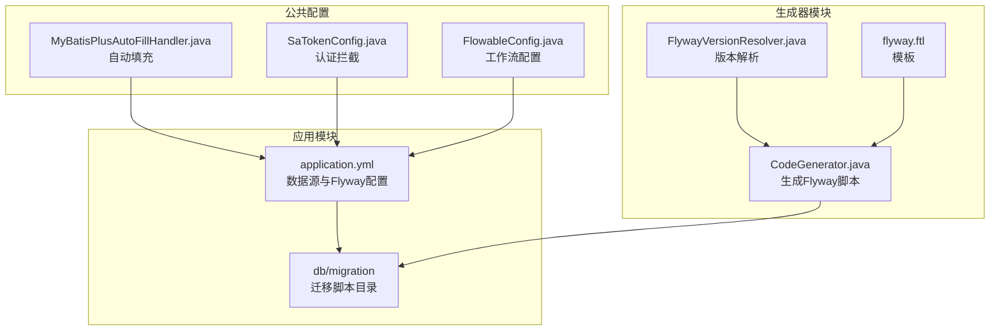
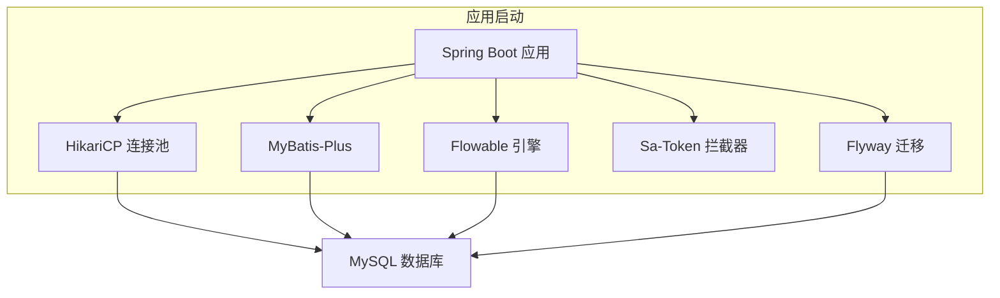
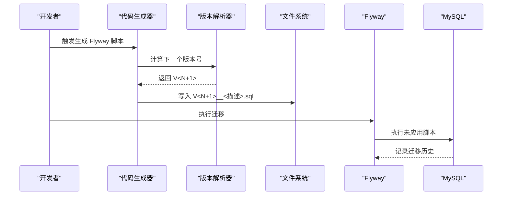
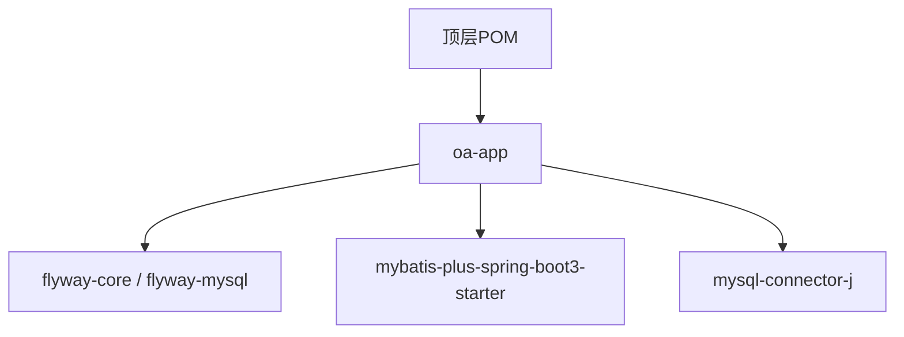

# 数据库维护管理

<cite>
**本文档引用的文件**
- [application.yml](file://oa-app/src/main/resources/application.yml)
- [pom.xml](file://pom.xml)
- [V1__init_sys_tables.sql](file://oa-app/src/main/resources/db/migration/V1__init_sys_tables.sql)
- [V2__init_biz_tables.sql](file://oa-app/src/main/resources/db/migration/V2__init_biz_tables.sql)
- [V3__seed_data.sql](file://oa-app/src/main/resources/db/migration/V3__seed_data.sql)
- [V4__phase2_flow_design.sql](file://oa-app/src/main/resources/db/migration/V4__phase2_flow_design.sql)
- [V5__phase3a_instance_enhancement.sql](file://oa-app/src/main/resources/db/migration/V5__phase3a_instance_enhancement.sql)
- [V6__phase3b_bug_fixes.sql](file://oa-app/src/main/resources/db/migration/V6__phase3b_bug_fixes.sql)
- [V7__phase3b_notification.sql](file://oa-app/src/main/resources/db/migration/V7__phase3b_notification.sql)
- [V8__leave_module.sql](file://oa-app/src/main/resources/db/migration/V8__leave_module.sql)
- [FlywayVersionResolver.java](file://oa-generator/src/main/java/com/oa/admin/generator/engine/FlywayVersionResolver.java)
- [CodeGenerator.java](file://oa-generator/src/main/java/com/oa/admin/generator/engine/CodeGenerator.java)
- [flyway.ftl](file://oa-generator/src/main/resources/templates/flyway.ftl)
- [MyBatisPlusAutoFillHandler.java](file://oa-common/src/main/java/com/oa/admin/common/config/MyBatisPlusAutoFillHandler.java)
- [SaTokenConfig.java](file://oa-system/src/main/java/com/oa/admin/system/config/SaTokenConfig.java)
- [FlowableConfig.java](file://oa-approval/src/main/java/com/oa/admin/approval/config/FlowableConfig.java)
- [oa-app/pom.xml](file://oa-app/pom.xml)
</cite>

## 目录
1. [简介](#简介)
2. [项目结构](#项目结构)
3. [核心组件](#核心组件)
4. [架构总览](#架构总览)
5. [详细组件分析](#详细组件分析)
6. [依赖关系分析](#依赖关系分析)
7. [性能考虑](#性能考虑)
8. [故障排查指南](#故障排查指南)
9. [结论](#结论)
10. [附录](#附录)

## 简介
本文件面向数据库维护与管理工作，围绕本项目的数据库迁移、版本管理、脚本规范、备份恢复、性能监控与优化、连接池与事务管理、升级降级回滚、故障排查与安全配置等方面进行系统化说明。项目采用 Flyway 进行数据库迁移，结合 HikariCP 连接池、MyBatis-Plus 自动填充、Flowable 工作流引擎以及 Spring Boot 配置，形成完整的数据库生命周期管理体系。

## 项目结构
本项目为多模块 Maven 工程，数据库相关的核心配置与迁移脚本主要位于应用模块的资源目录中，Flyway 迁移脚本按版本号顺序组织，遵循 V<版本>__<描述>.sql 的命名规范；同时，项目提供了代码生成器以自动化生成 Flyway 脚本与业务实体代码。

**图表来源**
- [application.yml:4-29](file://oa-app/src/main/resources/application.yml#L4-L29)
- [CodeGenerator.java:116-133](file://oa-generator/src/main/java/com/oa/admin/generator/engine/CodeGenerator.java#L116-L133)
- [FlywayVersionResolver.java:17-34](file://oa-generator/src/main/java/com/oa/admin/generator/engine/FlywayVersionResolver.java#L17-L34)
- [flyway.ftl:1-21](file://oa-generator/src/main/resources/templates/flyway.ftl#L1-L21)
- [MyBatisPlusAutoFillHandler.java:11-24](file://oa-common/src/main/java/com/oa/admin/common/config/MyBatisPlusAutoFillHandler.java#L11-L24)
- [SaTokenConfig.java:12-24](file://oa-system/src/main/java/com/oa/admin/system/config/SaTokenConfig.java#L12-L24)
- [FlowableConfig.java:15-30](file://oa-approval/src/main/java/com/oa/admin/approval/config/FlowableConfig.java#L15-L30)

**章节来源**
- [application.yml:4-29](file://oa-app/src/main/resources/application.yml#L4-L29)
- [pom.xml:21-28](file://pom.xml#L21-L28)

## 核心组件
- 数据库连接池：基于 HikariCP，默认启用，支持连接池大小、空闲超时、最大存活时间、预编译语句缓存等参数。
- 迁移管理：Flyway 启用，扫描 classpath:db/migration 目录，自动执行未应用的迁移脚本，并在首次运行时进行基线初始化。
- ORM 自动填充：MyBatis-Plus 元对象处理器统一处理创建与更新时间字段。
- 安全与认证：Sa-Token 拦截器保护 API 路由，排除登录注册接口。
- 工作流数据库：Flowable 配置允许数据库模式自动更新。

**章节来源**
- [application.yml:10-29](file://oa-app/src/main/resources/application.yml#L10-L29)
- [MyBatisPlusAutoFillHandler.java:11-24](file://oa-common/src/main/java/com/oa/admin/common/config/MyBatisPlusAutoFillHandler.java#L11-L24)
- [SaTokenConfig.java:12-24](file://oa-system/src/main/java/com/oa/admin/system/config/SaTokenConfig.java#L12-L24)
- [FlowableConfig.java:15-30](file://oa-approval/src/main/java/com/oa/admin/approval/config/FlowableConfig.java#L15-L30)

## 架构总览
下图展示了数据库层与各模块之间的交互关系，包括迁移执行、连接池使用、ORM 填充、认证拦截与工作流引擎。

**图表来源**
- [application.yml:4-29](file://oa-app/src/main/resources/application.yml#L4-L29)
- [pom.xml:44-113](file://pom.xml#L44-L113)

## 详细组件分析

### Flyway 数据库迁移与版本管理
- 迁移位置与启用：配置启用 Flyway 并指定迁移脚本位置为 classpath:db/migration，首次迁移时自动创建基线。
- 版本命名规范：V<版本号>__<描述>.sql，版本号为整数递增，描述建议体现模块与变更内容。
- 生成器集成：代码生成器根据实体定义生成 Flyway 脚本，自动计算下一个版本号并写入对应文件名。
- 迁移脚本示例：
  - 初始化系统表与业务表
  - 种子数据与权限配置
  - 流程设计增强与节点配置
  - 通知系统与请假模块表结构

**图表来源**
- [CodeGenerator.java:116-133](file://oa-generator/src/main/java/com/oa/admin/generator/engine/CodeGenerator.java#L116-L133)
- [FlywayVersionResolver.java:17-34](file://oa-generator/src/main/java/com/oa/admin/generator/engine/FlywayVersionResolver.java#L17-L34)
- [flyway.ftl:1-21](file://oa-generator/src/main/resources/templates/flyway.ftl#L1-L21)

**章节来源**
- [application.yml:25-29](file://oa-app/src/main/resources/application.yml#L25-L29)
- [CodeGenerator.java:116-133](file://oa-generator/src/main/java/com/oa/admin/generator/engine/CodeGenerator.java#L116-L133)
- [FlywayVersionResolver.java:17-34](file://oa-generator/src/main/java/com/oa/admin/generator/engine/FlywayVersionResolver.java#L17-L34)
- [flyway.ftl:1-21](file://oa-generator/src/main/resources/templates/flyway.ftl#L1-L21)

### 数据库迁移脚本编写规范与命名约定
- 命名格式：V<版本号>__<模块或功能描述>.sql，版本号为连续整数，描述简洁明确。
- 文件内容：
  - 使用注释块说明版本目的与涉及模块。
  - 创建表时统一设置字符集与排序规则，添加必要索引。
  - 修改表结构时使用 ALTER 语句，避免破坏性变更。
  - 插入种子数据时注意幂等性与外键约束。
- 示例参考：
  - 系统表初始化与关联关系
  - 业务审批表与审计日志
  - 权限菜单与按钮/API 权限
  - 流程节点配置与通知表

**章节来源**
- [V1__init_sys_tables.sql:1-84](file://oa-app/src/main/resources/db/migration/V1__init_sys_tables.sql#L1-L84)
- [V2__init_biz_tables.sql:1-74](file://oa-app/src/main/resources/db/migration/V2__init_biz_tables.sql#L1-L74)
- [V3__seed_data.sql:1-90](file://oa-app/src/main/resources/db/migration/V3__seed_data.sql#L1-L90)
- [V4__phase2_flow_design.sql:1-32](file://oa-app/src/main/resources/db/migration/V4__phase2_flow_design.sql#L1-L32)
- [V5__phase3a_instance_enhancement.sql:1-4](file://oa-app/src/main/resources/db/migration/V5__phase3a_instance_enhancement.sql#L1-L4)
- [V6__phase3b_bug_fixes.sql:1-4](file://oa-app/src/main/resources/db/migration/V6__phase3b_bug_fixes.sql#L1-L4)
- [V7__phase3b_notification.sql:1-16](file://oa-app/src/main/resources/db/migration/V7__phase3b_notification.sql#L1-L16)
- [V8__leave_module.sql:1-20](file://oa-app/src/main/resources/db/migration/V8__leave_module.sql#L1-L20)

### 数据库备份与恢复流程
- 备份策略（建议）：
  - 全量备份：定期执行逻辑导出（mysqldump 或类似工具），保留迁移脚本与业务数据。
  - 增量备份：结合二进制日志（binlog）进行增量恢复。
  - 归档与校验：备份文件异地存储，定期验证恢复流程。
- 恢复流程（建议）：
  - 停止应用写入，锁定关键表。
  - 恢复到目标时间点，确保 Flyway 历史表与迁移脚本一致。
  - 启动应用，确认迁移执行与服务可用性。
- 注意事项：
  - 回滚前务必备份当前状态。
  - 恢复后检查索引完整性与权限配置。

[本节为通用流程说明，不直接分析具体文件]

### 数据库性能监控与优化指导
- 连接池优化：
  - 合理设置最大池大小与最小空闲连接，避免过度连接导致上下文切换开销。
  - 启用连接测试查询与泄漏检测阈值，及时发现连接泄漏。
  - 开启预编译语句缓存，减少 SQL 解析成本。
- 索引优化：
  - 为高频查询字段建立合适索引，避免全表扫描。
  - 定期评估复合索引的使用情况，清理冗余索引。
- SQL 优化：
  - 使用 EXPLAIN 分析慢查询，关注覆盖索引与回表情况。
  - 避免 SELECT *，仅选择必要列。
- 缓存与异步：
  - 对热点数据引入 Redis 缓存，降低数据库压力。
  - 将非关键写入异步化，减少事务持续时间。

**章节来源**
- [application.yml:10-23](file://oa-app/src/main/resources/application.yml#L10-L23)

### 数据库连接池配置与事务管理最佳实践
- 连接池配置要点：
  - 池名称、最大池大小、最小空闲、连接超时、空闲超时、最大生存时间。
  - 预编译语句缓存参数，提升高频 SQL 性能。
  - 泄漏检测阈值，便于定位长时间占用连接的问题。
- 事务管理：
  - 使用 Spring 声明式事务，合理划分事务边界，避免长事务锁竞争。
  - 在高并发场景下，优先使用读写分离与只读事务。
  - 对批量写入使用批处理与分页提交，降低锁持有时间。

**章节来源**
- [application.yml:10-23](file://oa-app/src/main/resources/application.yml#L10-L23)

### 数据库升级与降级回滚操作
- 升级流程：
  - 在开发环境验证迁移脚本，确保幂等与兼容性。
  - 提交新版本脚本至版本控制，生成下一个版本号。
  - 在生产环境执行迁移，观察 Flyway 历史表与日志。
- 降级与回滚：
  - Flyway 支持回滚到指定版本（需谨慎使用），建议配合备份与灰度发布。
  - 对破坏性变更（如删除列）应先做数据迁移与兼容处理。
  - 回滚后验证业务功能与索引完整性。

**章节来源**
- [application.yml:25-29](file://oa-app/src/main/resources/application.yml#L25-L29)
- [CodeGenerator.java:116-133](file://oa-generator/src/main/java/com/oa/admin/generator/engine/CodeGenerator.java#L116-L133)

### 数据库故障排查与性能调优实用技巧
- 常见问题定位：
  - 连接池耗尽：检查最大池大小与活跃连接数，排查泄漏。
  - 迁移失败：核对脚本语法与依赖顺序，查看 Flyway 历史表。
  - 慢查询：使用 EXPLAIN 分析执行计划，补充缺失索引。
- 调优建议：
  - 分析慢查询日志，识别热点 SQL。
  - 优化事务隔离级别与锁粒度，减少死锁概率。
  - 结合监控指标（QPS、TPS、连接数、锁等待）进行容量规划。

[本节为通用指导，不直接分析具体文件]

### 数据库安全配置与访问控制策略
- 认证与授权：
  - 使用强密码与最小权限原则，区分开发、测试、生产数据库账号。
  - 对敏感数据进行加密存储，传输层启用 SSL/TLS。
- 访问控制：
  - 限制数据库端口暴露，仅允许内网访问。
  - 使用堡垒机与审计日志，追踪所有数据库操作。
- 防护措施：
  - 定期更新数据库补丁，关闭不必要的服务与协议。
  - 对 SQL 注入与命令注入进行防护，避免直接拼接 SQL。

[本节为通用安全指导，不直接分析具体文件]

## 依赖关系分析
- 模块依赖：顶层 POM 统一管理依赖版本，应用模块引入 Flyway、MySQL Connector、MyBatis-Plus 等。
- 运行时依赖：应用模块的 pom.xml 明确声明 Flyway 核心与 MySQL 扩展依赖，确保迁移能力。

**图表来源**
- [pom.xml:44-113](file://pom.xml#L44-L113)
- [oa-app/pom.xml:41-47](file://oa-app/pom.xml#L41-L47)

**章节来源**
- [pom.xml:44-113](file://pom.xml#L44-L113)
- [oa-app/pom.xml:41-47](file://oa-app/pom.xml#L41-L47)

## 性能考虑
- 连接池参数直接影响吞吐与延迟，应结合业务峰值 QPS 与平均响应时间进行压测调参。
- Flyway 迁移脚本应保持幂等与可重复执行，避免在生产环境造成阻塞。
- ORM 层自动填充减少样板代码，但需确保字段存在且类型匹配，避免运行时异常。

[本节提供通用性能建议，不直接分析具体文件]

## 故障排查指南
- 迁移失败排查：
  - 检查迁移脚本语法与依赖顺序，确认 Flyway 历史表记录。
  - 查看应用日志中的 Flyway 错误信息与堆栈。
- 连接池问题：
  - 关注连接泄漏检测阈值触发日志，定位长时间占用连接的线程。
  - 调整最大池大小与连接超时，缓解高峰期压力。
- 权限与索引：
  - 核对用户权限与表级权限，确保迁移与业务查询具备相应权限。
  - 对慢查询补充索引，避免全表扫描。

**章节来源**
- [application.yml:10-29](file://oa-app/src/main/resources/application.yml#L10-L29)

## 结论
本项目通过 Flyway 实现数据库迁移的规范化与可追溯性，结合 HikariCP、MyBatis-Plus、Flowable 与 Sa-Token 等组件，构建了从连接池、ORM、安全到工作流的完整数据库运行体系。建议在生产环境中严格执行迁移脚本评审、备份与回滚演练、性能压测与监控告警，确保数据库稳定与高效运行。

[本节为总结性内容，不直接分析具体文件]

## 附录
- 迁移脚本清单（按版本顺序）：
  - V1__init_sys_tables.sql：系统 RBAC 表初始化
  - V2__init_biz_tables.sql：业务审批表初始化
  - V3__seed_data.sql：种子数据与权限初始化
  - V4__phase2_flow_design.sql：流程设计增强与节点配置
  - V5__phase3a_instance_enhancement.sql：实例查询索引增强
  - V6__phase3b_bug_fixes.sql：节点配置 CC 字段
  - V7__phase3b_notification.sql：通知系统表
  - V8__leave_module.sql：请假模块表结构

**章节来源**
- [V1__init_sys_tables.sql:1-84](file://oa-app/src/main/resources/db/migration/V1__init_sys_tables.sql#L1-L84)
- [V2__init_biz_tables.sql:1-74](file://oa-app/src/main/resources/db/migration/V2__init_biz_tables.sql#L1-L74)
- [V3__seed_data.sql:1-90](file://oa-app/src/main/resources/db/migration/V3__seed_data.sql#L1-L90)
- [V4__phase2_flow_design.sql:1-32](file://oa-app/src/main/resources/db/migration/V4__phase2_flow_design.sql#L1-L32)
- [V5__phase3a_instance_enhancement.sql:1-4](file://oa-app/src/main/resources/db/migration/V5__phase3a_instance_enhancement.sql#L1-L4)
- [V6__phase3b_bug_fixes.sql:1-4](file://oa-app/src/main/resources/db/migration/V6__phase3b_bug_fixes.sql#L1-L4)
- [V7__phase3b_notification.sql:1-16](file://oa-app/src/main/resources/db/migration/V7__phase3b_notification.sql#L1-L16)
- [V8__leave_module.sql:1-20](file://oa-app/src/main/resources/db/migration/V8__leave_module.sql#L1-L20)