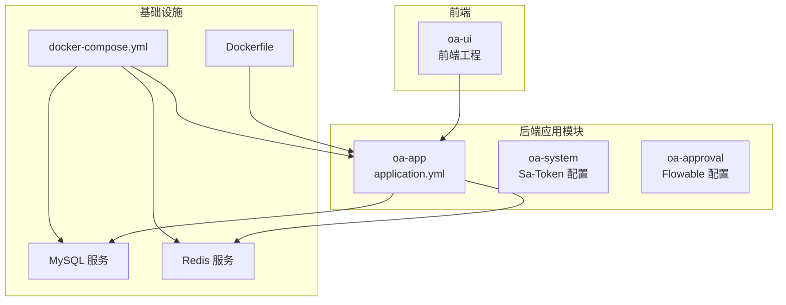
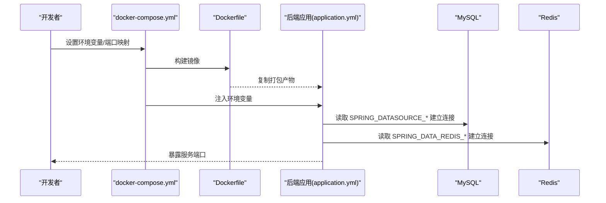
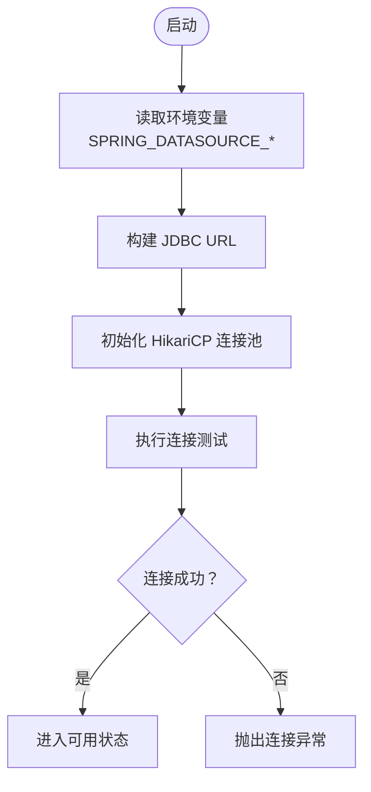
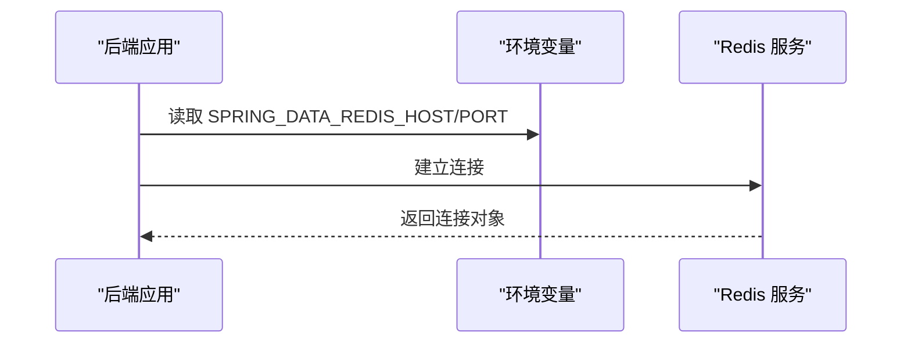
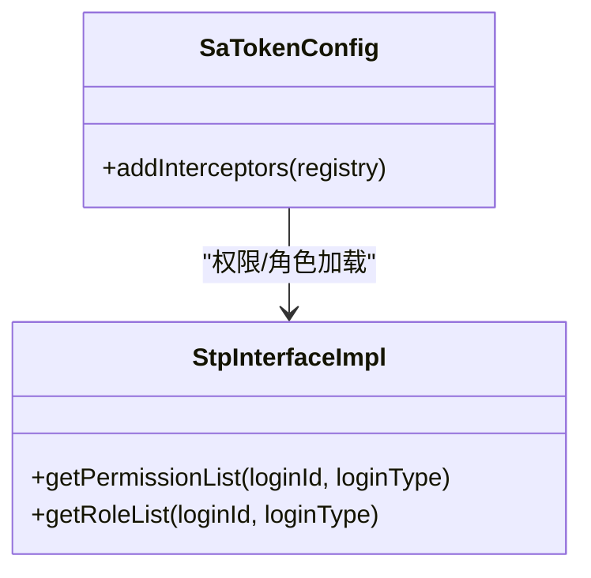
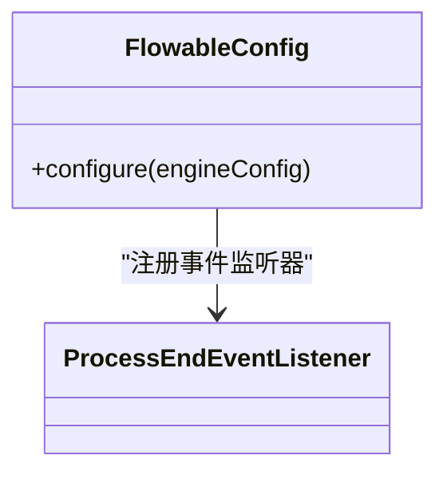
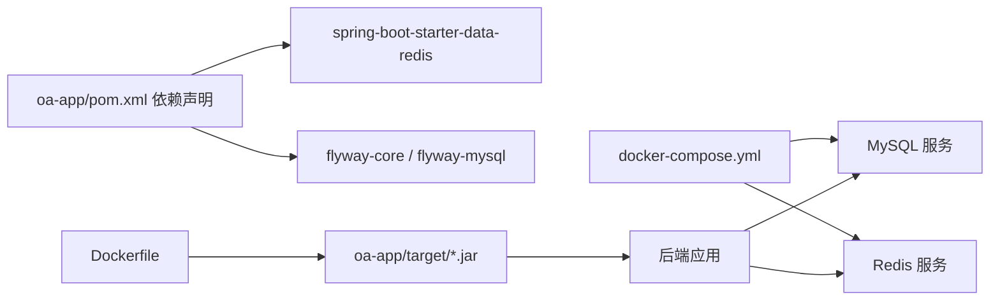

# 环境配置管理

<cite>
**本文引用的文件**
- [application.yml](file://oa-app/src/main/resources/application.yml)
- [init.sh](file://init.sh)
- [docker-compose.yml](file://docker-compose.yml)
- [Dockerfile](file://Dockerfile)
- [pom.xml](file://oa-app/pom.xml)
- [SaTokenConfig.java](file://oa-system/src/main/java/com/oa/admin/system/config/SaTokenConfig.java)
- [StpInterfaceImpl.java](file://oa-system/src/main/java/com/oa/admin/system/config/StpInterfaceImpl.java)
- [FlowableConfig.java](file://oa-approval/src/main/java/com/oa/admin/approval/config/FlowableConfig.java)
- [config.yaml](file://openspec/config.yaml)
</cite>

## 目录
1. [简介](#简介)
2. [项目结构](#项目结构)
3. [核心组件](#核心组件)
4. [架构总览](#架构总览)
5. [详细组件分析](#详细组件分析)
6. [依赖关系分析](#依赖关系分析)
7. [性能考虑](#性能考虑)
8. [故障排查指南](#故障排查指南)
9. [结论](#结论)
10. [附录](#附录)

## 简介
本文件系统性梳理并说明本项目的环境配置管理方案，覆盖以下方面：
- application.yml 配置项详解：数据库连接、Redis、JWT（Sa-Token）、MyBatis-Plus、Flowable 等
- 环境差异与切换：开发、测试、生产环境的配置差异与切换方法
- 环境变量使用规范与安全配置建议
- init.sh 初始化脚本功能说明与使用方法
- 配置文件版本管理与变更控制流程
- 配置热更新与动态配置管理策略
- 配置验证与常见问题排查

## 项目结构
本项目采用多模块 Maven 结构，配置集中于后端应用模块的资源目录中，并通过 Docker Compose 统一编排数据库与缓存服务。

图表来源
- [docker-compose.yml:1-66](file://docker-compose.yml#L1-L66)
- [Dockerfile:1-22](file://Dockerfile#L1-L22)
- [application.yml:1-59](file://oa-app/src/main/resources/application.yml#L1-L59)

章节来源
- [docker-compose.yml:1-66](file://docker-compose.yml#L1-L66)
- [Dockerfile:1-22](file://Dockerfile#L1-L22)
- [application.yml:1-59](file://oa-app/src/main/resources/application.yml#L1-L59)

## 核心组件
本节对关键配置组件进行深入解析，涵盖数据源、缓存、认证授权、ORM、工作流引擎等。

- 数据源与连接池
  - 数据库地址、用户名、密码通过环境变量注入，支持默认值与可调参数
  - HikariCP 连接池参数可调，包含最大池大小、空闲超时、生命周期、泄漏检测阈值等
  - 启用 SQL 预处理缓存优化
- Flyway 迁移
  - 开启自动迁移，基线迁移启用，迁移脚本位于 classpath:db/migration
- Redis 缓存
  - 主机与端口通过环境变量注入，默认本地直连
- ORM 与逻辑删除
  - MyBatis-Plus 开启下划线转驼峰映射，配置逻辑删除字段与值
- 认证与会话（Sa-Token）
  - 默认令牌名、超时时间、并发共享、序列化方式等
- 工作流引擎（Flowable）
  - 数据库模式更新策略、异步执行器开关

章节来源
- [application.yml:4-59](file://oa-app/src/main/resources/application.yml#L4-L59)
- [pom.xml:36-75](file://oa-app/pom.xml#L36-L75)

## 架构总览
下图展示配置在整体运行时的交互关系：容器编排提供数据库与缓存，后端应用读取环境变量与配置文件，完成启动与业务运行。

图表来源
- [docker-compose.yml:42-48](file://docker-compose.yml#L42-L48)
- [Dockerfile:14-21](file://Dockerfile#L14-L21)
- [application.yml:4-35](file://oa-app/src/main/resources/application.yml#L4-L35)

## 详细组件分析

### 数据库连接配置
- 关键点
  - JDBC URL、用户名、密码均来自环境变量，便于在不同环境切换
  - HikariCP 参数可调，满足高并发场景下的连接复用与健康监控
  - 启用预处理语句缓存，提升查询性能
- 安全建议
  - 生产环境必须通过环境变量注入敏感信息，避免硬编码
  - 使用只读账号或最小权限原则，限制 DDL 权限
- 变更控制
  - 连接池参数变更需结合压测评估，避免过度配置导致资源浪费

图表来源
- [application.yml:5-23](file://oa-app/src/main/resources/application.yml#L5-L23)
- [docker-compose.yml:43-45](file://docker-compose.yml#L43-L45)

章节来源
- [application.yml:5-23](file://oa-app/src/main/resources/application.yml#L5-L23)
- [docker-compose.yml:43-45](file://docker-compose.yml#L43-L45)

### Redis 缓存配置
- 关键点
  - 主机与端口通过环境变量注入，便于容器网络互通
  - 默认直连本地，容器编排时通过服务名访问
- 安全建议
  - 生产环境建议开启认证与网络隔离，避免暴露到公网
  - 对热点键设置合理过期策略，防止内存膨胀

图表来源
- [application.yml:32-35](file://oa-app/src/main/resources/application.yml#L32-L35)
- [docker-compose.yml:46-47](file://docker-compose.yml#L46-L47)

章节来源
- [application.yml:32-35](file://oa-app/src/main/resources/application.yml#L32-L35)
- [docker-compose.yml:46-47](file://docker-compose.yml#L46-L47)

### JWT 令牌配置（Sa-Token）
- 关键点
  - 令牌名称、超时时间、主动刷新间隔、并发共享、UUID 风格令牌等
  - 显式指定 JSON 序列化以降低安全风险
- 安全建议
  - 生产环境建议缩短超时时间，启用主动刷新
  - 严格区分接口权限，避免跨域与明文传输

图表来源
- [SaTokenConfig.java:12-24](file://oa-system/src/main/java/com/oa/admin/system/config/SaTokenConfig.java#L12-L24)
- [StpInterfaceImpl.java:24-74](file://oa-system/src/main/java/com/oa/admin/system/config/StpInterfaceImpl.java#L24-L74)

章节来源
- [application.yml:45-54](file://oa-app/src/main/resources/application.yml#L45-L54)
- [SaTokenConfig.java:12-24](file://oa-system/src/main/java/com/oa/admin/system/config/SaTokenConfig.java#L12-L24)
- [StpInterfaceImpl.java:24-74](file://oa-system/src/main/java/com/oa/admin/system/config/StpInterfaceImpl.java#L24-L74)

### ORM 与逻辑删除
- 关键点
  - 下划线转驼峰映射，提升字段命名一致性
  - 配置逻辑删除字段与值，统一软删除策略
- 最佳实践
  - 所有实体统一继承基础模型，避免遗漏软删除字段

章节来源
- [application.yml:36-44](file://oa-app/src/main/resources/application.yml#L36-L44)

### 工作流引擎（Flowable）
- 关键点
  - 数据库模式自动更新，异步执行器关闭
  - 自定义事件监听器注册，扩展流程结束事件处理
- 注意事项
  - 生产环境建议开启异步执行器并配合消息中间件

图表来源
- [FlowableConfig.java:15-30](file://oa-approval/src/main/java/com/oa/admin/approval/config/FlowableConfig.java#L15-L30)

章节来源
- [application.yml:56-59](file://oa-app/src/main/resources/application.yml#L56-L59)
- [FlowableConfig.java:15-30](file://oa-approval/src/main/java/com/oa/admin/approval/config/FlowableConfig.java#L15-L30)

### Flyway 数据迁移
- 关键点
  - 自动迁移启用，基线迁移开启，脚本路径 classpath:db/migration
- 变更控制
  - 迁移脚本按版本号顺序命名，禁止修改已上线版本内容

章节来源
- [application.yml:25-29](file://oa-app/src/main/resources/application.yml#L25-L29)

## 依赖关系分析
后端应用模块依赖 Spring Boot Starter Data Redis、Flyway 等组件；Dockerfile 将打包产物复制到运行时镜像；docker-compose 提供数据库与缓存服务。

图表来源
- [pom.xml:36-47](file://oa-app/pom.xml#L36-L47)
- [Dockerfile:14-21](file://Dockerfile#L14-L21)
- [docker-compose.yml:1-66](file://docker-compose.yml#L1-L66)

章节来源
- [pom.xml:36-75](file://oa-app/pom.xml#L36-L75)
- [Dockerfile:14-21](file://Dockerfile#L14-L21)
- [docker-compose.yml:1-66](file://docker-compose.yml#L1-L66)

## 性能考虑
- 连接池参数
  - 根据 QPS 与事务时长调整最大池大小与空闲超时，避免频繁创建销毁连接
  - 启用泄漏检测阈值，定位长时间占用连接的代码路径
- 缓存策略
  - 对热点数据设置短 TTL，对冷数据设置长 TTL 或禁用缓存
  - 使用批量查询减少网络往返
- ORM 优化
  - 合理分页，避免一次性加载大结果集
  - 使用选择性字段查询，减少序列化开销

## 故障排查指南
- 数据库连接失败
  - 检查环境变量是否正确注入，确认容器网络可达
  - 查看连接池日志与泄漏检测阈值触发情况
- Redis 连接异常
  - 确认主机与端口映射，检查容器健康状态
  - 如启用认证，请补充密码
- 启动阶段 Flyway 迁移报错
  - 检查迁移脚本完整性与版本号顺序
  - 确认数据库用户具备 DDL 权限
- 权限拦截异常
  - 检查 Sa-Token 配置与拦截器注册
  - 核验用户角色与权限数据是否正确

章节来源
- [application.yml:5-23](file://oa-app/src/main/resources/application.yml#L5-L23)
- [application.yml:32-35](file://oa-app/src/main/resources/application.yml#L32-L35)
- [application.yml:25-29](file://oa-app/src/main/resources/application.yml#L25-L29)
- [SaTokenConfig.java:12-24](file://oa-system/src/main/java/com/oa/admin/system/config/SaTokenConfig.java#L12-L24)

## 结论
本项目的配置管理遵循“环境变量优先、配置文件兜底”的原则，结合 Docker Compose 实现快速部署与环境隔离。通过合理的连接池与缓存策略、严格的权限控制与迁移管理，能够在开发、测试与生产环境中稳定运行。建议持续完善配置热更新与动态配置能力，进一步提升运维效率与安全性。

## 附录

### 环境差异与切换方法
- 开发环境
  - 使用本地直连 MySQL 与 Redis，端口映射为宿主可访问
  - application.yml 中的默认值适用于本地开发
- 测试环境
  - 通过 CI/CD 注入环境变量，使用独立数据库与缓存实例
- 生产环境
  - 通过容器编排与密钥管理服务注入敏感信息
  - 关闭调试输出，启用主动刷新与严格权限控制

章节来源
- [docker-compose.yml:1-66](file://docker-compose.yml#L1-L66)
- [application.yml:4-59](file://oa-app/src/main/resources/application.yml#L4-L59)

### 环境变量使用规范与安全配置
- 规范
  - 所有敏感信息通过环境变量注入，禁止写入配置文件
  - 使用统一前缀（如 SPRING_DATASOURCE_、SPRING_DATA_REDIS_）便于识别
- 安全
  - 生产环境启用数据库与 Redis 认证
  - 限制容器网络访问，仅开放必要端口
  - 定期轮换密钥与证书

章节来源
- [application.yml:5-8](file://oa-app/src/main/resources/application.yml#L5-L8)
- [application.yml:32-35](file://oa-app/src/main/resources/application.yml#L32-L35)
- [docker-compose.yml:6-10](file://docker-compose.yml#L6-L10)

### init.sh 初始化脚本功能说明与使用方法
- 功能
  - 替换包名与模块结构，适配新项目命名
  - 更新 POM 文件与 application.yml、docker-compose.yml 中的关键参数
  - 写入初始化标记文件，保证幂等性
- 使用
  - 执行脚本后根据提示输入项目参数，确认后自动更新
  - 使用 --force 强制重新初始化

章节来源
- [init.sh:1-238](file://init.sh#L1-L238)
- [docker-compose.yml:171-184](file://docker-compose.yml#L171-L184)
- [application.yml:161-169](file://oa-app/src/main/resources/application.yml#L161-L169)

### 配置文件版本管理与变更控制流程
- 版本管理
  - 使用 Git 管理配置文件，分支策略与提交信息规范化
- 变更控制
  - 所有配置变更需走评审流程，生产变更需双人复核
  - 迁移脚本与配置变更同步发布，确保回滚路径清晰

章节来源
- [config.yaml:1-21](file://openspec/config.yaml#L1-L21)

### 配置热更新与动态配置管理
- 当前现状
  - Spring Boot 默认不支持配置热更新，需重启生效
- 建议方案
  - 引入 Spring Cloud Config 或 Apollo 等集中式配置中心
  - 对非敏感配置（如开关、阈值）提供受控的动态刷新接口

[本节为通用指导，无需特定文件来源]

### 配置验证与错误排查
- 启动验证
  - 检查数据库与 Redis 健康状态与连接日志
  - 核验 Flyway 迁移状态与版本号
- 运行期验证
  - 通过健康检查端点与日志定位异常
  - 使用慢查询与连接池指标监控性能瓶颈

章节来源
- [docker-compose.yml:16-20](file://docker-compose.yml#L16-L20)
- [application.yml:25-29](file://oa-app/src/main/resources/application.yml#L25-L29)