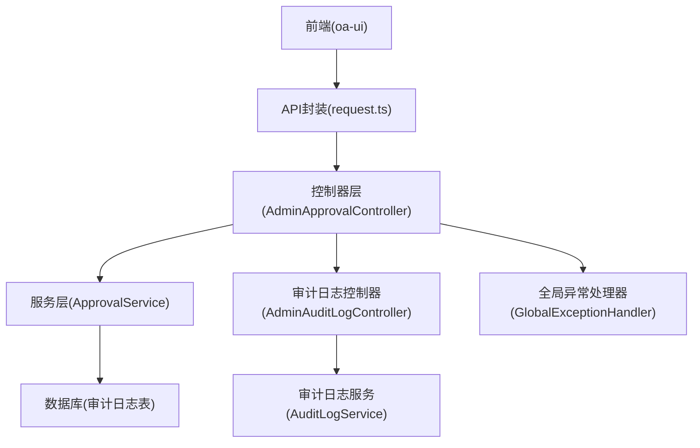
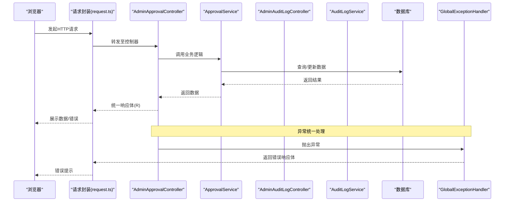
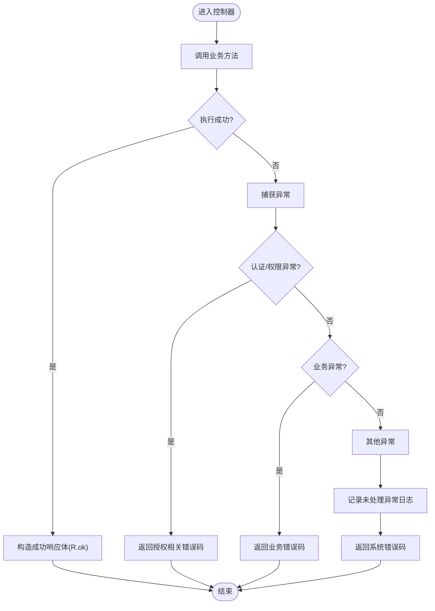
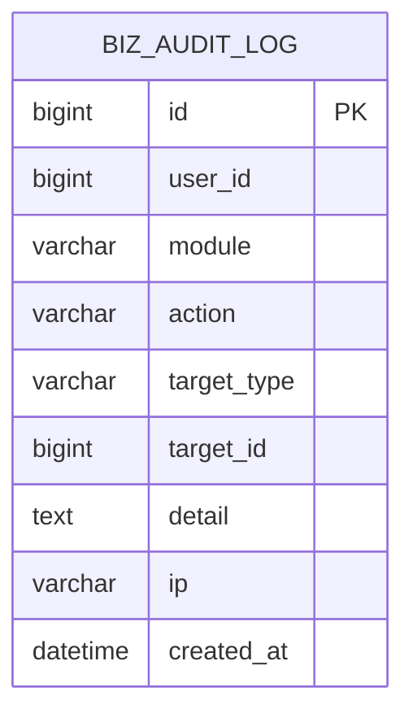
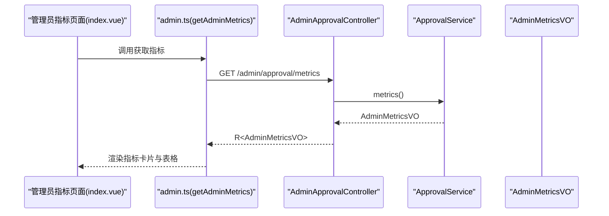
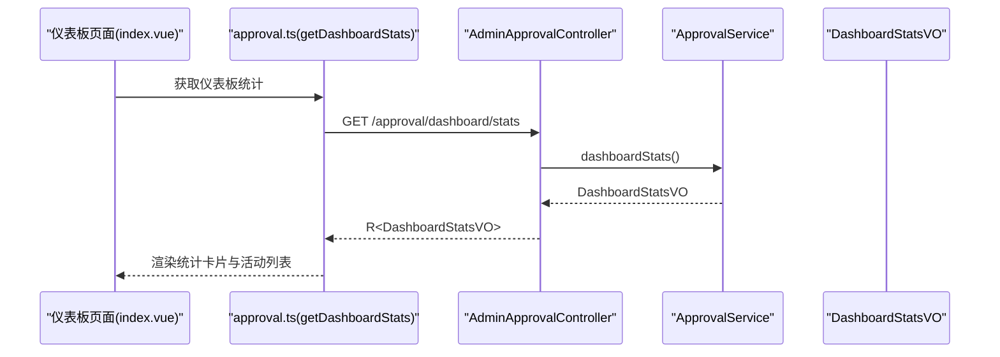
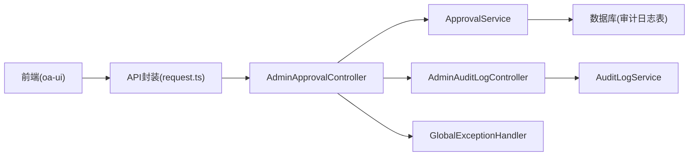

# 监控告警系统实施指南

<cite>
**本文档引用的文件**
- [GlobalExceptionHandler.java](file://oa-common/src/main/java/com/oa/admin/common/exception/GlobalExceptionHandler.java)
- [BusinessException.java](file://oa-common/src/main/java/com/oa/admin/common/exception/BusinessException.java)
- [R.java](file://oa-common/src/main/java/com/oa/admin/common/result/R.java)
- [ErrorCode.java](file://oa-common/src/main/java/com/oa/admin/common/result/ErrorCode.java)
- [AdminApprovalController.java](file://oa-approval/src/main/java/com/oa/admin/approval/controller/AdminApprovalController.java)
- [AdminMetricsVO.java](file://oa-approval/src/main/java/com/oa/admin/approval/dto/AdminMetricsVO.java)
- [DashboardStatsVO.java](file://oa-approval/src/main/java/com/oa/admin/approval/dto/DashboardStatsVO.java)
- [AuditLogService.java](file://oa-approval/src/main/java/com/oa/admin/approval/service/AuditLogService.java)
- [BizAuditLog.java](file://oa-approval/src/main/java/com/oa/admin/approval/entity/BizAuditLog.java)
- [AuditLogServiceImpl.java](file://oa-approval/src/main/java/com/oa/admin/approval/service/impl/AuditLogServiceImpl.java)
- [AdminAuditLogController.java](file://oa-approval/src/main/java/com/oa/admin/approval/controller/AdminAuditLogController.java)
- [ApprovalService.java](file://oa-approval/src/main/java/com/oa/admin/approval/service/ApprovalService.java)
- [index.vue（管理员指标）](file://oa-ui/src/views/admin/metrics/index.vue)
- [index.vue（仪表板）](file://oa-ui/src/views/dashboard/index.vue)
- [approval.ts（API）](file://oa-ui/src/api/approval.ts)
- [admin.ts（API）](file://oa-ui/src/api/admin.ts)
- [request.ts（请求封装）](file://oa-ui/src/utils/request.ts)
- [V2__init_biz_tables.sql](file://oa-app/src/main/resources/db/migration/V2__init_biz_tables.sql)
- [V5__phase3a_instance_enhancement.sql](file://oa-app/src/main/resources/db/migration/V5__phase3a_instance_enhancement.sql)
- [V6__phase3b_bug_fixes.sql](file://oa-app/src/main/resources/db/migration/V6__phase3b_bug_fixes.sql)
</cite>

## 目录
1. [简介](#简介)
2. [项目结构](#项目结构)
3. [核心组件](#核心组件)
4. [架构概览](#架构概览)
5. [详细组件分析](#详细组件分析)
6. [依赖关系分析](#依赖关系分析)
7. [性能考虑](#性能考虑)
8. [故障排查指南](#故障排查指南)
9. [结论](#结论)
10. [附录](#附录)

## 简介
本指南面向在本OA审批管理系统中构建监控告警体系的工程团队，目标是提供一套可落地的应用级监控指标采集与展示、日志系统配置与聚合策略、异常处理与错误监控机制、告警规则与通知渠道配置、以及性能与业务监控的综合方案。文档基于现有代码库进行分析，结合前端可视化组件与后端服务接口，给出实施步骤与最佳实践。

## 项目结构
系统采用前后端分离架构，后端由多个模块组成（oa-approval、oa-system、oa-common等），前端位于oa-ui目录，数据库迁移脚本位于oa-app/resources/db/migration。监控相关能力主要体现在：
- 统一异常处理与返回体规范
- 审计日志实体与查询接口
- 管理员指标与仪表板数据模型
- 前端指标与仪表板页面及API封装

图表来源
- [AdminApprovalController.java:15-56](file://oa-approval/src/main/java/com/oa/admin/approval/controller/AdminApprovalController.java#L15-L56)
- [AdminAuditLogController.java:14-35](file://oa-approval/src/main/java/com/oa/admin/approval/controller/AdminAuditLogController.java#L14-L35)
- [GlobalExceptionHandler.java:19-74](file://oa-common/src/main/java/com/oa/admin/common/exception/GlobalExceptionHandler.java#L19-L74)
- [request.ts:1-42](file://oa-ui/src/utils/request.ts#L1-L42)

章节来源
- [AdminApprovalController.java:15-56](file://oa-approval/src/main/java/com/oa/admin/approval/controller/AdminApprovalController.java#L15-L56)
- [AdminAuditLogController.java:14-35](file://oa-approval/src/main/java/com/oa/admin/approval/controller/AdminAuditLogController.java#L14-L35)
- [GlobalExceptionHandler.java:19-74](file://oa-common/src/main/java/com/oa/admin/common/exception/GlobalExceptionHandler.java#L19-L74)
- [request.ts:1-42](file://oa-ui/src/utils/request.ts#L1-L42)

## 核心组件
- 统一响应体与错误码：统一返回体R与错误码ErrorCode，便于前端识别与告警触发。
- 全局异常处理器：集中捕获未处理异常并记录日志，保证系统可观测性。
- 审计日志：记录用户行为轨迹，支持按模块、动作、目标类型/ID、时间范围查询。
- 指标与仪表板：管理员指标（实例总数、审批中、已通过、已驳回、平均耗时、模板维度统计）与个人仪表板（待办、已办、模板数、抄送未读、最近活动）。
- 前端可视化：基于Element Plus组件展示统计数据与表格。

章节来源
- [R.java:9-44](file://oa-common/src/main/java/com/oa/admin/common/result/R.java#L9-L44)
- [ErrorCode.java:11-44](file://oa-common/src/main/java/com/oa/admin/common/result/ErrorCode.java#L11-L44)
- [GlobalExceptionHandler.java:19-74](file://oa-common/src/main/java/com/oa/admin/common/exception/GlobalExceptionHandler.java#L19-L74)
- [BizAuditLog.java:14-28](file://oa-approval/src/main/java/com/oa/admin/approval/entity/BizAuditLog.java#L14-L28)
- [AdminMetricsVO.java:11-33](file://oa-approval/src/main/java/com/oa/admin/approval/dto/AdminMetricsVO.java#L11-L33)
- [DashboardStatsVO.java:14-25](file://oa-approval/src/main/java/com/oa/admin/approval/dto/DashboardStatsVO.java#L14-L25)
- [index.vue（管理员指标）:1-61](file://oa-ui/src/views/admin/metrics/index.vue#L1-L61)
- [index.vue（仪表板）:1-86](file://oa-ui/src/views/dashboard/index.vue#L1-L86)

## 架构概览
下图展示了从浏览器到后端服务再到数据库的日志与指标采集路径，以及异常处理与统一返回体的作用点。

图表来源
- [request.ts:1-42](file://oa-ui/src/utils/request.ts#L1-L42)
- [AdminApprovalController.java:15-56](file://oa-approval/src/main/java/com/oa/admin/approval/controller/AdminApprovalController.java#L15-L56)
- [ApprovalService.java:18-57](file://oa-approval/src/main/java/com/oa/admin/approval/service/ApprovalService.java#L18-L57)
- [AdminAuditLogController.java:14-35](file://oa-approval/src/main/java/com/oa/admin/approval/controller/AdminAuditLogController.java#L14-L35)
- [AuditLogService.java:10-17](file://oa-approval/src/main/java/com/oa/admin/approval/service/AuditLogService.java#L10-L17)
- [GlobalExceptionHandler.java:19-74](file://oa-common/src/main/java/com/oa/admin/common/exception/GlobalExceptionHandler.java#L19-L74)

## 详细组件分析

### 统一异常处理与错误监控
- 全局异常处理器集中捕获认证、参数校验、业务异常与通用异常，并通过统一响应体返回，同时记录未处理异常日志，为后续告警提供基础。
- 建议在生产环境接入日志聚合平台（如ELK/EFK），将错误日志标准化输出，结合错误码与堆栈信息建立告警规则。

图表来源
- [GlobalExceptionHandler.java:23-72](file://oa-common/src/main/java/com/oa/admin/common/exception/GlobalExceptionHandler.java#L23-L72)
- [R.java:21-42](file://oa-common/src/main/java/com/oa/admin/common/result/R.java#L21-L42)
- [ErrorCode.java:11-44](file://oa-common/src/main/java/com/oa/admin/common/result/ErrorCode.java#L11-L44)

章节来源
- [GlobalExceptionHandler.java:19-74](file://oa-common/src/main/java/com/oa/admin/common/exception/GlobalExceptionHandler.java#L19-L74)
- [BusinessException.java:9-23](file://oa-common/src/main/java/com/oa/admin/common/exception/BusinessException.java#L9-L23)
- [R.java:9-44](file://oa-common/src/main/java/com/oa/admin/common/result/R.java#L9-L44)
- [ErrorCode.java:11-44](file://oa-common/src/main/java/com/oa/admin/common/result/ErrorCode.java#L11-L44)

### 审计日志系统与日志聚合策略
- 审计日志实体包含用户ID、模块、动作、目标类型/ID、详情、IP与创建时间等字段，支持多维过滤查询。
- 建议对审计日志表建立复合索引以优化查询性能，并在日志聚合平台中建立仪表板，按模块/动作/用户维度统计事件趋势。

图表来源
- [BizAuditLog.java:14-28](file://oa-approval/src/main/java/com/oa/admin/approval/entity/BizAuditLog.java#L14-L28)
- [V2__init_biz_tables.sql:60-73](file://oa-app/src/main/resources/db/migration/V2__init_biz_tables.sql#L60-L73)

章节来源
- [BizAuditLog.java:14-28](file://oa-approval/src/main/java/com/oa/admin/approval/entity/BizAuditLog.java#L14-L28)
- [AuditLogService.java:10-17](file://oa-approval/src/main/java/com/oa/admin/approval/service/AuditLogService.java#L10-L17)
- [AuditLogServiceImpl.java:19-67](file://oa-approval/src/main/java/com/oa/admin/approval/service/impl/AuditLogServiceImpl.java#L19-L67)
- [AdminAuditLogController.java:14-35](file://oa-approval/src/main/java/com/oa/admin/approval/controller/AdminAuditLogController.java#L14-L35)
- [V2__init_biz_tables.sql:60-73](file://oa-app/src/main/resources/db/migration/V2__init_biz_tables.sql#L60-L73)

### 应用级监控指标采集与展示
- 管理员指标：包含总实例数、审批中、已通过、已驳回、已撤回、平均耗时、模板维度统计等，用于全局运营视图。
- 仪表板指标：包含待办任务、已办任务、审批模板数量、抄送未读数量与最近审批动态，用于个人工作台。
- 前端通过API封装统一访问后端接口，控制器返回统一响应体，前端负责渲染与交互。

图表来源
- [index.vue（管理员指标）:49-60](file://oa-ui/src/views/admin/metrics/index.vue#L49-L60)
- [admin.ts（API）:79-81](file://oa-ui/src/api/admin.ts#L79-L81)
- [AdminApprovalController.java:50-54](file://oa-approval/src/main/java/com/oa/admin/approval/controller/AdminApprovalController.java#L50-L54)
- [ApprovalService.java:55-56](file://oa-approval/src/main/java/com/oa/admin/approval/service/ApprovalService.java#L55-L56)
- [AdminMetricsVO.java:11-33](file://oa-approval/src/main/java/com/oa/admin/approval/dto/AdminMetricsVO.java#L11-L33)

章节来源
- [AdminApprovalController.java:50-54](file://oa-approval/src/main/java/com/oa/admin/approval/controller/AdminApprovalController.java#L50-L54)
- [AdminMetricsVO.java:11-33](file://oa-approval/src/main/java/com/oa/admin/approval/dto/AdminMetricsVO.java#L11-L33)
- [index.vue（管理员指标）:1-61](file://oa-ui/src/views/admin/metrics/index.vue#L1-L61)
- [admin.ts（API）:79-81](file://oa-ui/src/api/admin.ts#L79-L81)

### 仪表板数据流
- 仪表板页面通过API获取统计数据与最近活动，控制器返回DashboardStatsVO，前端渲染统计卡片与动态列表。

图表来源
- [index.vue（仪表板）:54-76](file://oa-ui/src/views/dashboard/index.vue#L54-L76)
- [approval.ts（API）:56-58](file://oa-ui/src/api/approval.ts#L56-L58)
- [AdminApprovalController.java:50-54](file://oa-approval/src/main/java/com/oa/admin/approval/controller/AdminApprovalController.java#L50-L54)
- [ApprovalService.java:38-39](file://oa-approval/src/main/java/com/oa/admin/approval/service/ApprovalService.java#L38-L39)
- [DashboardStatsVO.java:14-25](file://oa-approval/src/main/java/com/oa/admin/approval/dto/DashboardStatsVO.java#L14-L25)

章节来源
- [index.vue（仪表板）:1-86](file://oa-ui/src/views/dashboard/index.vue#L1-L86)
- [approval.ts（API）:56-58](file://oa-ui/src/api/approval.ts#L56-L58)
- [DashboardStatsVO.java:14-25](file://oa-approval/src/main/java/com/oa/admin/approval/dto/DashboardStatsVO.java#L14-L25)

## 依赖关系分析
- 控制器依赖服务层；服务层依赖数据访问层与实体；前端通过API封装调用控制器；异常处理器独立于业务逻辑，提供横切关注点。
- 审计日志查询依赖数据库索引；管理员指标与仪表板数据来源于业务统计。

图表来源
- [request.ts:1-42](file://oa-ui/src/utils/request.ts#L1-L42)
- [AdminApprovalController.java:15-56](file://oa-approval/src/main/java/com/oa/admin/approval/controller/AdminApprovalController.java#L15-L56)
- [AdminAuditLogController.java:14-35](file://oa-approval/src/main/java/com/oa/admin/approval/controller/AdminAuditLogController.java#L14-L35)
- [ApprovalService.java:18-57](file://oa-approval/src/main/java/com/oa/admin/approval/service/ApprovalService.java#L18-L57)
- [AuditLogService.java:10-17](file://oa-approval/src/main/java/com/oa/admin/approval/service/AuditLogService.java#L10-L17)
- [GlobalExceptionHandler.java:19-74](file://oa-common/src/main/java/com/oa/admin/common/exception/GlobalExceptionHandler.java#L19-L74)

章节来源
- [request.ts:1-42](file://oa-ui/src/utils/request.ts#L1-L42)
- [AdminApprovalController.java:15-56](file://oa-approval/src/main/java/com/oa/admin/approval/controller/AdminApprovalController.java#L15-L56)
- [AdminAuditLogController.java:14-35](file://oa-approval/src/main/java/com/oa/admin/approval/controller/AdminAuditLogController.java#L14-L35)
- [ApprovalService.java:18-57](file://oa-approval/src/main/java/com/oa/admin/approval/service/ApprovalService.java#L18-L57)
- [AuditLogService.java:10-17](file://oa-approval/src/main/java/com/oa/admin/approval/service/AuditLogService.java#L10-L17)
- [GlobalExceptionHandler.java:19-74](file://oa-common/src/main/java/com/oa/admin/common/exception/GlobalExceptionHandler.java#L19-L74)

## 性能考虑
- 数据库索引优化：针对审计日志与审批实例查询场景，建议使用复合索引提升查询效率。
- 前端分页与缓存：API层已支持分页参数，前端应合理设置分页大小与缓存策略，避免一次性加载大量数据。
- 日志聚合：将错误日志与审计日志标准化输出到日志聚合平台，结合时间序列数据库进行指标计算与可视化。
- 监控指标：基于管理员指标与仪表板数据，建立关键指标阈值告警，如平均耗时、审批积压、异常错误率等。

章节来源
- [V2__init_biz_tables.sql:60-73](file://oa-app/src/main/resources/db/migration/V2__init_biz_tables.sql#L60-L73)
- [V5__phase3a_instance_enhancement.sql:1-3](file://oa-app/src/main/resources/db/migration/V5__phase3a_instance_enhancement.sql#L1-L3)
- [V6__phase3b_bug_fixes.sql:1-3](file://oa-app/src/main/resources/db/migration/V6__phase3b_bug_fixes.sql#L1-L3)
- [approval.ts（API）:40-42](file://oa-ui/src/api/approval.ts#L40-L42)
- [admin.ts（API）:79-81](file://oa-ui/src/api/admin.ts#L79-L81)

## 故障排查指南
- 统一错误响应：前端通过响应拦截器解析统一响应体，当code不为200时弹出错误提示；对于特定错误码（如令牌过期）自动跳转登录页。
- 异常定位：全局异常处理器会记录未处理异常日志，配合错误码快速定位问题类型与发生位置。
- 审计日志查询：通过审计日志控制器提供的查询接口，按模块、动作、目标类型/ID、时间范围筛选，辅助定位问题根因。

章节来源
- [request.ts:18-39](file://oa-ui/src/utils/request.ts#L18-L39)
- [GlobalExceptionHandler.java:67-72](file://oa-common/src/main/java/com/oa/admin/common/exception/GlobalExceptionHandler.java#L67-L72)
- [AdminAuditLogController.java:20-33](file://oa-approval/src/main/java/com/oa/admin/approval/controller/AdminAuditLogController.java#L20-L33)
- [AuditLogServiceImpl.java:34-67](file://oa-approval/src/main/java/com/oa/admin/approval/service/impl/AuditLogServiceImpl.java#L34-L67)

## 结论
本指南基于现有代码库梳理了监控告警体系的关键环节：统一异常处理与错误码、审计日志与查询、管理员指标与仪表板展示。建议在此基础上完善日志聚合、指标计算与告警规则配置，并结合数据库索引优化与前端分页策略，形成完整的应用级监控闭环。

## 附录
- 告警规则配置建议
  - 系统错误率：基于全局异常处理器记录的系统错误日志，设定错误率阈值告警。
  - 业务异常率：基于业务异常码分布，对高频业务错误建立阈值与趋势告警。
  - 性能指标：基于管理员指标中的平均耗时、实例积压等，设定阈值与同比/环比告警。
  - 日志审计：对敏感模块与动作（如删除、修改）建立实时告警。
- 通知渠道设置
  - 邮件/企业微信/钉钉机器人：将日志聚合平台与IM工具对接，实现多通道通知。
  - 分级告警：根据错误级别与影响面设置不同通知级别与接收人。
- 可视化与报表
  - 使用日志聚合平台的仪表板功能，结合数据库指标与业务指标，生成日报/周报/月报。
  - 对关键指标建立看板，支持自定义时间范围与筛选条件。
- 扩展性与高可用
  - 日志聚合：采用分布式日志收集与存储，支持水平扩展。
  - 监控系统：Prometheus/Grafana或云监控服务，结合告警规则与通知通道。
  - 数据库：对高频查询建立索引与物化视图，必要时引入缓存与只读副本。