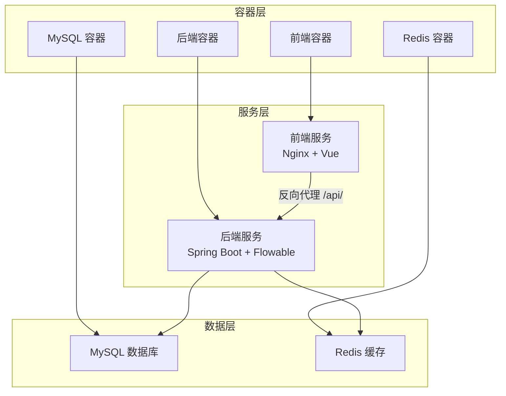
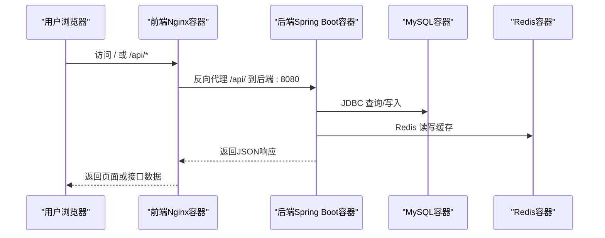
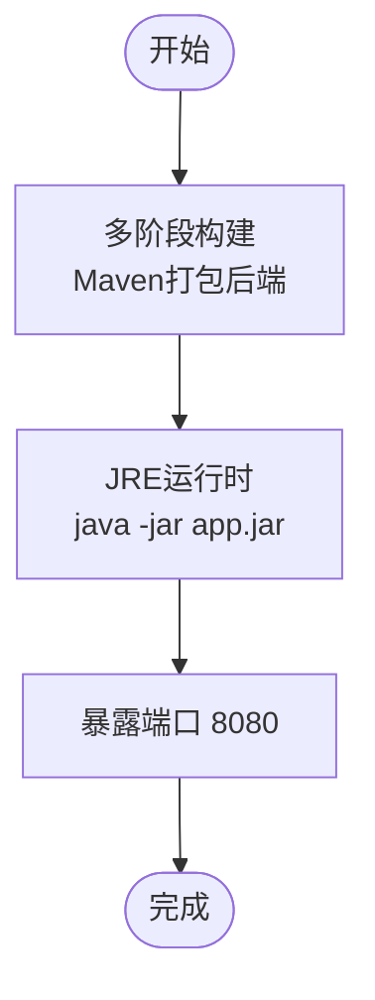
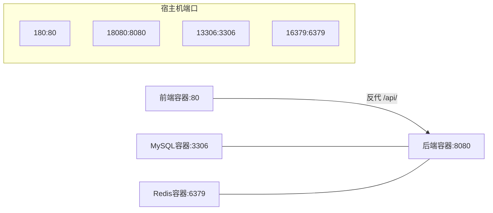
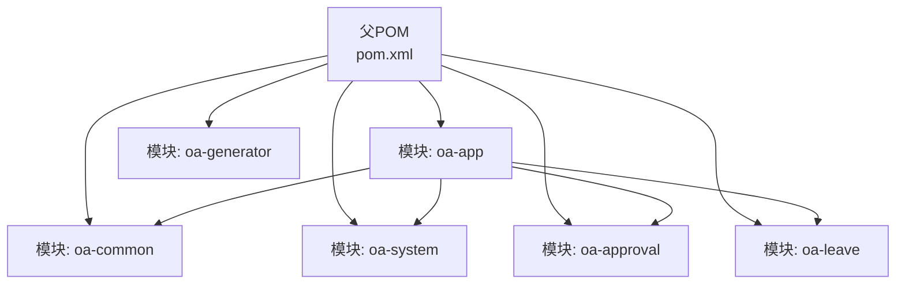

# 部署运维

<cite>
**本文引用的文件**
- [Dockerfile](file://Dockerfile)
- [docker-compose.yml](file://docker-compose.yml)
- [init.sh](file://init.sh)
- [application.yml](file://oa-app/src/main/resources/application.yml)
- [Dockerfile（前端）](file://oa-ui/Dockerfile)
- [nginx.conf（前端）](file://oa-ui/nginx.conf)
- [SaTokenConfig.java](file://oa-system/src/main/java/com/oa/admin/system/config/SaTokenConfig.java)
- [pom.xml](file://pom.xml)
- [leave-request.yaml](file://generators/leave-request.yaml)
- [.gitignore](file://.gitignore)
- [ProcessDeployService.java](file://oa-approval/src/main/java/com/oa/admin/approval/service/ProcessDeployService.java)
</cite>

## 目录
1. [简介](#简介)
2. [项目结构](#项目结构)
3. [核心组件](#核心组件)
4. [架构总览](#架构总览)
5. [详细组件分析](#详细组件分析)
6. [依赖关系分析](#依赖关系分析)
7. [性能考量](#性能考量)
8. [故障排查指南](#故障排查指南)
9. [结论](#结论)
10. [附录](#附录)

## 简介
本文件面向运维工程师，提供OA审批管理系统的容器化部署与运维实践指南。内容覆盖镜像构建、容器编排、网络与端口配置、环境变量与敏感信息管理、数据库迁移与版本控制、高可用与容灾、监控告警与日志、性能分析、发布策略（滚动更新/蓝绿/金丝雀）、CI/CD流水线建议以及故障排查与应急响应。

## 项目结构
系统采用多模块Maven工程，后端基于Spring Boot 3.5 + Flowable 7 + Sa-Token鉴权，前端使用Vue + Nginx，数据库采用MySQL 8，缓存采用Redis。容器化通过Docker Compose一键拉起：MySQL、Redis、后端Java应用、前端Nginx。

图表来源
- [docker-compose.yml:1-66](file://docker-compose.yml#L1-L66)
- [Dockerfile:1-22](file://Dockerfile#L1-L22)
- [Dockerfile（前端）:1-15](file://oa-ui/Dockerfile#L1-L15)
- [nginx.conf（前端）:1-18](file://oa-ui/nginx.conf#L1-L18)

章节来源
- [docker-compose.yml:1-66](file://docker-compose.yml#L1-L66)
- [Dockerfile:1-22](file://Dockerfile#L1-L22)
- [Dockerfile（前端）:1-15](file://oa-ui/Dockerfile#L1-L15)
- [nginx.conf（前端）:1-18](file://oa-ui/nginx.conf#L1-L18)

## 核心组件
- 后端镜像构建：多阶段构建，先用Maven构建，再以最小JRE运行，暴露8080端口。
- 前端镜像构建：Node构建产物，Nginx静态分发，反向代理/api/到后端。
- 数据库与缓存：MySQL 8 + Redis 7，持久化卷，健康检查。
- 应用配置：Flyway自动迁移，MyBatis-Plus逻辑删除，Sa-Token鉴权拦截，Flowable流程引擎。
- 网络与端口：后端8080、前端80、MySQL 3306、Redis 6379，均映射到宿主机可配置端口。

章节来源
- [Dockerfile:1-22](file://Dockerfile#L1-L22)
- [docker-compose.yml:1-66](file://docker-compose.yml#L1-L66)
- [application.yml:1-59](file://oa-app/src/main/resources/application.yml#L1-L59)
- [Dockerfile（前端）:1-15](file://oa-ui/Dockerfile#L1-L15)
- [nginx.conf（前端）:1-18](file://oa-ui/nginx.conf#L1-L18)

## 架构总览
下图展示容器化部署的端到端交互：前端Nginx作为入口，反向代理API请求至后端；后端连接MySQL与Redis；数据库与缓存由Compose管理并持久化。

图表来源
- [docker-compose.yml:1-66](file://docker-compose.yml#L1-L66)
- [nginx.conf（前端）:11-16](file://oa-ui/nginx.conf#L11-L16)
- [application.yml:4-35](file://oa-app/src/main/resources/application.yml#L4-L35)

## 详细组件分析

### 镜像构建与运行时配置
- 后端镜像
  - 多阶段：Builder阶段使用Maven 3.9 + JDK 17构建，跳过测试；Runtime阶段使用Eclipse Temurin JRE Jammy运行。
  - 入口命令：java -jar app.jar，暴露8080端口。
- 前端镜像
  - 多阶段：Node 22构建产物，Nginx alpine运行，复制dist与nginx.conf，监听80端口。
- 初始化脚本
  - 提供交互式初始化，替换包名、端口、数据库名与密码、模块目录重命名、更新父POM模块引用、更新前端包名、写入完成标记。

图表来源
- [Dockerfile:1-22](file://Dockerfile#L1-L22)
- [Dockerfile（前端）:1-15](file://oa-ui/Dockerfile#L1-L15)

章节来源
- [Dockerfile:1-22](file://Dockerfile#L1-L22)
- [Dockerfile（前端）:1-15](file://oa-ui/Dockerfile#L1-L15)
- [init.sh:1-238](file://init.sh#L1-L238)

### 容器编排与网络配置
- Compose服务
  - mysql：MySQL 8，持久化卷，健康检查，字符集utf8mb4，root密码从环境变量注入。
  - redis：Redis 7，持久化卷。
  - backend：基于根Dockerfile构建，依赖mysql健康与redis启动，设置数据库与Redis连接参数，映射端口。
  - frontend：基于oa-ui/Dockerfile构建，依赖backend，映射80端口。
- 端口映射
  - MySQL: 3306 → 宿主可配置端口
  - Redis: 6379 → 宿主可配置端口
  - 后端: 8080 → 宿主可配置端口
  - 前端: 80 → 宿主可配置端口
- 网络与代理
  - 前端Nginx通过proxy_pass将/api/转发至后端8080。

图表来源
- [docker-compose.yml:1-66](file://docker-compose.yml#L1-L66)
- [nginx.conf（前端）:11-16](file://oa-ui/nginx.conf#L11-L16)

章节来源
- [docker-compose.yml:1-66](file://docker-compose.yml#L1-L66)
- [nginx.conf（前端）:1-18](file://oa-ui/nginx.conf#L1-L18)

### 环境变量与敏感信息管理
- 关键环境变量
  - 数据库：SPRING_DATASOURCE_URL、SPRING_DATASOURCE_USERNAME、SPRING_DATASOURCE_PASSWORD
  - Redis：SPRING_DATA_REDIS_HOST、SPRING_DATA_REDIS_PORT
  - 时区：TZ
  - HikariCP池参数：HIKARI_MAX_POOL_SIZE、HIKARI_MIN_IDLE、HIKARI_CONNECTION_TIMEOUT、HIKARI_IDLE_TIMEOUT、HIKARI_MAX_LIFETIME、HIKARI_LEAK_DETECTION
- 敏感信息安全
  - 使用Compose环境变量注入数据库密码，避免硬编码在镜像或配置文件中。
  - .gitignore排除.env、.env.*、密钥文件等，防止误提交。
  - 建议在生产使用Secrets管理（如Kubernetes Secret或外部密管），并在CI中注入。

章节来源
- [application.yml:4-59](file://oa-app/src/main/resources/application.yml#L4-L59)
- [docker-compose.yml:42-48](file://docker-compose.yml#L42-L48)
- [.gitignore:20-29](file://.gitignore#L20-L29)

### 数据库迁移与版本控制
- 迁移启用：Flyway开启，位置class-path:db/migration，基线迁移启用。
- 版本命名：采用VX__描述.sql，按顺序演进。
- 运行流程：容器启动时，后端应用启动后由Flyway自动执行未执行的迁移脚本。
- 建议
  - 迁移脚本必须幂等且可重复执行。
  - 生产变更前先在测试环境验证迁移。
  - 对大表DDL变更采用“影子表/在线DDL”策略，必要时配合灰度发布。

章节来源
- [application.yml:25-29](file://oa-app/src/main/resources/application.yml#L25-L29)

### 高可用性与容灾
- 高可用
  - 多实例：后端服务横向扩展，结合反向代理（Nginx/HAProxy）做负载均衡。
  - 数据持久化：MySQL与Redis使用命名卷，避免数据丢失。
  - 健康检查：MySQL配置健康检查，确保后端启动前数据库可用。
- 容灾
  - 数据备份：定期快照/逻辑备份，异地存储。
  - 灾备演练：定期进行切换演练，验证RTO/RPO目标。
  - 网络隔离：生产与开发网络隔离，限制访问。

章节来源
- [docker-compose.yml:16-20](file://docker-compose.yml#L16-L20)

### 监控告警、日志与性能分析
- 监控
  - JVM指标：启用Micrometer与Prometheus（建议在Spring Boot中集成），采集GC、堆内存、线程数、Hikari连接池状态。
  - 应用指标：业务指标（审批量、平均处理时长、失败率）。
- 日志
  - 统一输出：容器标准输出，集中收集至ELK/Fluentd/Loki。
  - 分层：后端应用日志、Nginx访问/错误日志、MySQL慢查询日志。
- 性能分析
  - 拓扑：前端Nginx → 后端服务 → MySQL/Redis。
  - 关键指标：P95/P99延迟、错误率、连接池利用率、数据库锁等待、Redis命中率。

章节来源
- [application.yml:10-24](file://oa-app/src/main/resources/application.yml#L10-L24)

### 发布策略与CI/CD
- 滚动更新
  - Compose：停止旧容器，拉起新容器，健康检查通过后切换流量。
- 蓝绿发布
  - 两套后端实例，通过反向代理切换指向；验证通过后再切另一组。
- 金丝雀
  - 将少量流量导入新版本，逐步扩大比例，观察指标与日志。
- CI/CD建议
  - 触发：push到分支/打标签。
  - 步骤：构建镜像 → 推送仓库 → 健康检查 → 发布（滚动/蓝绿/金丝雀）→ 回滚策略。
  - 安全：镜像扫描、密钥注入、只读根文件系统、最小权限。

章节来源
- [docker-compose.yml:3-20](file://docker-compose.yml#L3-L20)

### 流程引擎与模板部署
- 流程引擎：Flowable集成，支持流程定义部署、实例启动、任务处理。
- 模板部署：提供ProcessDeployService接口用于部署流程模板与获取XML。
- 建议
  - 模板版本化管理，变更前冻结旧版本。
  - 部署前校验XML合法性与节点配置。

章节来源
- [ProcessDeployService.java:1-13](file://oa-approval/src/main/java/com/oa/admin/approval/service/ProcessDeployService.java#L1-L13)

## 依赖关系分析

图表来源
- [pom.xml:21-28](file://pom.xml#L21-L28)

章节来源
- [pom.xml:1-131](file://pom.xml#L1-L131)

## 性能考量
- 数据库连接池
  - HikariCP参数：最大池大小、空闲超时、最大生命周期、泄漏检测阈值，需根据QPS与事务特性调优。
- 缓存策略
  - Redis用于会话与热点数据，注意键空间过期策略与内存上限。
- 前端性能
  - Nginx静态资源缓存、Gzip压缩、HTTP/2。
- 后端优化
  - 合理的线程池与异步任务；对耗时操作使用消息队列或异步处理。

章节来源
- [application.yml:10-24](file://oa-app/src/main/resources/application.yml#L10-L24)
- [nginx.conf（前端）:1-18](file://oa-ui/nginx.conf#L1-L18)

## 故障排查指南
- 启动失败
  - 检查MySQL健康状态与日志；确认数据库密码与URL正确；确认Redis可达。
- 数据库迁移失败
  - 查看Flyway元数据表与日志；核对SQL语法与依赖对象是否存在。
- 接口异常
  - 检查后端日志与Nginx错误日志；确认鉴权拦截是否生效（Sa-Token）。
- 性能问题
  - 观察Hikari连接池状态、数据库慢查询、Redis命中率与延迟。
- 安全与合规
  - 确认敏感信息未提交至仓库；密钥轮换与最小权限原则。

章节来源
- [docker-compose.yml:16-20](file://docker-compose.yml#L16-L20)
- [application.yml:25-29](file://oa-app/src/main/resources/application.yml#L25-L29)
- [SaTokenConfig.java:12-24](file://oa-system/src/main/java/com/oa/admin/system/config/SaTokenConfig.java#L12-L24)
- [.gitignore:20-29](file://.gitignore#L20-L29)

## 结论
本方案以Docker Compose实现快速部署，结合Flyway与多阶段构建提升可维护性与安全性。建议在生产环境中完善高可用、监控告警、日志体系与CI/CD流水线，并制定严格的发布与回滚策略，确保系统稳定与可追溯。

## 附录

### 环境变量清单
- 数据库
  - SPRING_DATASOURCE_URL
  - SPRING_DATASOURCE_USERNAME
  - SPRING_DATASOURCE_PASSWORD
- 缓存
  - SPRING_DATA_REDIS_HOST
  - SPRING_DATA_REDIS_PORT
- 连接池
  - HIKARI_MAX_POOL_SIZE
  - HIKARI_MIN_IDLE
  - HIKARI_CONNECTION_TIMEOUT
  - HIKARI_IDLE_TIMEOUT
  - HIKARI_MAX_LIFETIME
  - HIKARI_LEAK_DETECTION
- 其他
  - TZ

章节来源
- [application.yml:4-59](file://oa-app/src/main/resources/application.yml#L4-L59)
- [docker-compose.yml:42-48](file://docker-compose.yml#L42-L48)

### 初始化与端口映射示例
- 初始化脚本会交互式修改包名、模块目录、POM与配置中的端口与数据库名/密码，并更新docker-compose.yml中的端口映射。
- 默认端口映射（可在脚本中调整）
  - 前端: 80 → 宿主可配置端口
  - 后端: 8080 → 宿主可配置端口
  - MySQL: 3306 → 宿主可配置端口
  - Redis: 6379 → 宿主可配置端口

章节来源
- [init.sh:48-184](file://init.sh#L48-L184)
- [docker-compose.yml:11-12](file://docker-compose.yml#L11-L12)
- [docker-compose.yml:26-27](file://docker-compose.yml#L26-L27)
- [docker-compose.yml:49-50](file://docker-compose.yml#L49-L50)
- [docker-compose.yml:61-61](file://docker-compose.yml#L61-L61)

### 生成器与实体定义参考
- 生成器配置示例：定义枚举、实体字段、索引等，便于自动生成CRUD与Flyway脚本。
- 建议
  - 在生成前统一命名规范与字段约束，保证迁移一致性。

章节来源
- [leave-request.yaml:1-74](file://generators/leave-request.yaml#L1-L74)