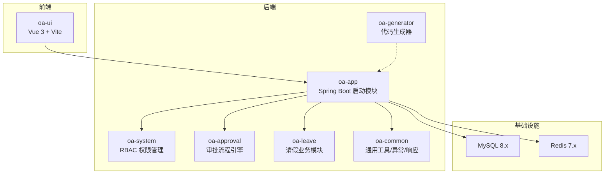
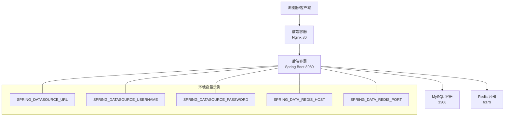
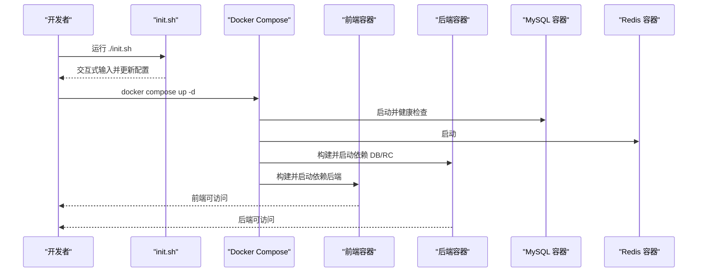
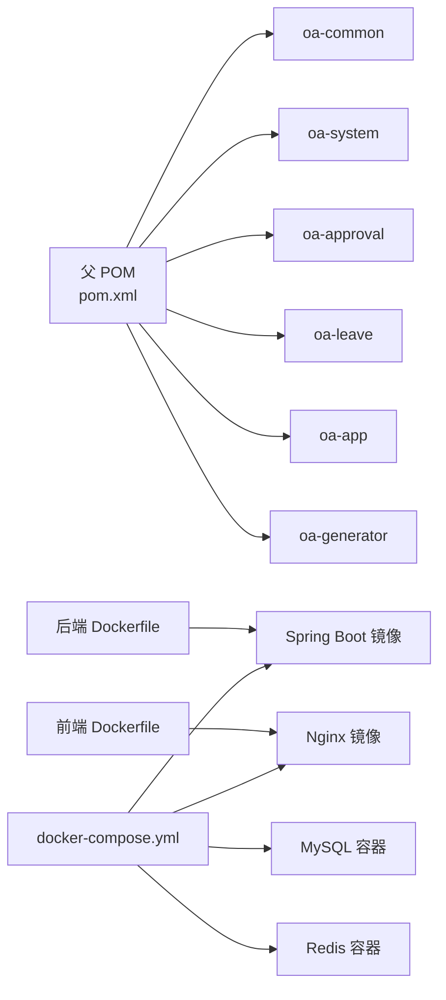

# 快速开始

<cite>
**本文引用的文件**
- [README.md](file://README.md)
- [init.sh](file://init.sh)
- [docker-compose.yml](file://docker-compose.yml)
- [Dockerfile（后端）](file://Dockerfile)
- [Dockerfile（前端）](file://oa-ui/Dockerfile)
- [application.yml](file://oa-app/src/main/resources/application.yml)
- [V3__seed_data.sql](file://oa-app/src/main/resources/db/migration/V3__seed_data.sql)
- [pom.xml](file://pom.xml)
- [package.json（前端）](file://oa-ui/package.json)
</cite>

## 目录
1. [简介](#简介)
2. [项目结构](#项目结构)
3. [核心组件](#核心组件)
4. [架构总览](#架构总览)
5. [详细组件分析](#详细组件分析)
6. [依赖关系分析](#依赖关系分析)
7. [性能与资源建议](#性能与资源建议)
8. [故障排除指南](#故障排除指南)
9. [结论](#结论)
10. [附录：一键启动与配置清单](#附录一键启动与配置清单)

## 简介
本指南面向首次接触 OA 审批管理系统的新用户，帮助你在最短时间内完成环境准备、一键启动与基础使用。系统采用前后端分离架构，后端基于 Spring Boot 3.5 + Java 17/21，前端基于 Vue 3 + TypeScript + Vite，使用 Docker Compose 一键拉起 MySQL、Redis、后端与前端服务，并内置默认管理员账号用于首次登录。

## 项目结构
该仓库为多模块 Maven 工程，包含公共模块、系统管理、审批流程、请假模块、启动模块与代码生成器模块；前端位于独立的 oa-ui 子目录并通过 Dockerfile 构建 Nginx 镜像对外提供静态页面。

图表来源
- [pom.xml:21-28](file://pom.xml#L21-L28)
- [docker-compose.yml:1-66](file://docker-compose.yml#L1-L66)

章节来源
- [README.md:48-61](file://README.md#L48-L61)
- [pom.xml:21-28](file://pom.xml#L21-L28)

## 核心组件
- 后端启动模块：负责打包与运行 Spring Boot 应用，加载数据库迁移与配置。
- 系统管理模块：实现 RBAC 权限体系（用户/角色/权限/部门），支持数据权限与审计日志。
- 审批模块：集成 Flowable 引擎，提供模板管理、发起审批、待办/已办、抄送等能力。
- 请假模块：演示业务与审批联动，包含请假申请实体与监听回调。
- 通用模块：统一响应、异常处理、自动填充时间戳等。
- 代码生成器：基于 YAML 定义生成后端 CRUD 代码与 Flyway 迁移脚本。
- 前端模块：Vue 3 + Element Plus + Pinia，提供登录、仪表盘、系统管理、审批与请假页面。

章节来源
- [README.md:63-86](file://README.md#L63-L86)
- [README.md:137-222](file://README.md#L137-L222)

## 架构总览
系统通过 Docker Compose 将 MySQL、Redis、后端与前端容器编排，后端通过环境变量读取数据库与缓存配置，前端通过反向代理访问后端 API。

图表来源
- [docker-compose.yml:42-48](file://docker-compose.yml#L42-L48)
- [application.yml:4-34](file://oa-app/src/main/resources/application.yml#L4-L34)

章节来源
- [README.md:118-129](file://README.md#L118-L129)
- [docker-compose.yml:1-66](file://docker-compose.yml#L1-L66)
- [application.yml:1-59](file://oa-app/src/main/resources/application.yml#L1-L59)

## 详细组件分析

### 一键启动流程
- Fork 仓库并克隆到本地。
- 执行初始化脚本进行交互式配置（包名、端口、数据库名/密码、MySQL/Redis 端口）。
- 使用 Docker Compose 启动所有服务。
- 访问前端与后端地址，使用默认管理员账号登录。

图表来源
- [init.sh:220-238](file://init.sh#L220-L238)
- [docker-compose.yml:31-61](file://docker-compose.yml#L31-L61)

章节来源
- [README.md:29-46](file://README.md#L29-L46)
- [init.sh:220-238](file://init.sh#L220-L238)

### init.sh 交互式配置说明
init.sh 提供以下交互项与作用：
- Group ID：Maven 组 ID，用于替换父 POM 与模块 artifactId 前缀。
- Artifact ID：项目根 artifactId，同时用于重命名模块目录（如从 oa-common 变更为 {artifactId}-common）。
- Package name：Java 包名，用于重命名源码包结构与更新应用入口类中的 MapperScan。
- Backend port：后端服务端口（默认 8080），在 application.yml 中生效。
- Frontend port：前端服务端口（默认 80），在 docker-compose.yml 中映射。
- Database name：数据库名（默认 oa_admin），在 application.yml 与 docker-compose.yml 中生效。
- Database password：数据库密码（默认 changeme），在 application.yml 与 docker-compose.yml 中生效。
- MySQL port：MySQL 映射端口（默认 3306），在 docker-compose.yml 中映射。
- Redis port：Redis 映射端口（默认 6379），在 docker-compose.yml 中映射。

执行后会：
- 替换 Java 源码包结构与测试包结构中的旧包名。
- 更新各模块 pom.xml 的 groupId/artifactId。
- 更新后端 application.yml 的数据库名/密码/端口。
- 更新 docker-compose.yml 的数据库名/密码/端口映射。
- 重命名模块目录以匹配新的 artifactId。
- 更新父 POM 中的模块引用。
- 更新前端 package.json 的 name 字段。

章节来源
- [init.sh:49-94](file://init.sh#L49-L94)
- [init.sh:96-136](file://init.sh#L96-L136)
- [init.sh:147-157](file://init.sh#L147-L157)
- [init.sh:159-169](file://init.sh#L159-L169)
- [init.sh:171-184](file://init.sh#L171-L184)
- [init.sh:193-210](file://init.sh#L193-L210)
- [init.sh:212-218](file://init.sh#L212-L218)
- [init.sh:220-238](file://init.sh#L220-L238)

### 默认账号与首次登录
- 默认管理员账号：用户名 admin，初始密码为 BCrypt 哈希后的 admin123。
- 首次登录后请立即修改密码，以符合生产安全规范。
- 若需要重置密码或新增用户，请在系统管理模块中操作。

章节来源
- [V3__seed_data.sql:5-7](file://oa-app/src/main/resources/db/migration/V3__seed_data.sql#L5-L7)
- [README.md:45](file://README.md#L45)

### 前后端端口与访问
- 前端：默认映射到宿主机 80 端口，访问地址为 http://localhost。
- 后端：默认映射到宿主机 8080 端口，访问地址为 http://localhost:8080。
- 初始化脚本可自定义前端与后端端口，init.sh 会在完成后提示最终访问地址。

章节来源
- [README.md:42-46](file://README.md#L42-L46)
- [init.sh:229-235](file://init.sh#L229-L235)
- [docker-compose.yml:50-61](file://docker-compose.yml#L50-L61)

### 数据库与缓存配置
- 数据库：MySQL 8.x，默认数据库名为 oa_admin，root 用户，密码可在初始化时设置。
- 缓存：Redis 7.x，默认端口 6379。
- 后端通过环境变量读取数据库与缓存配置，便于 Docker 部署时灵活替换。

章节来源
- [docker-compose.yml:2-15](file://docker-compose.yml#L2-L15)
- [docker-compose.yml:42-48](file://docker-compose.yml#L42-L48)
- [application.yml:4-34](file://oa-app/src/main/resources/application.yml#L4-L34)

### 安全与权限
- 会话管理：Sa-Token 单设备登录、令牌超时与主动刷新策略。
- 接口级权限：@SaCheckPermission 与 @SaCheckRole 注解保护接口。
- 密码加密：BCrypt 加密存储。
- 审计日志：记录关键操作。

章节来源
- [README.md:80-85](file://README.md#L80-L85)
- [application.yml:45-54](file://oa-app/src/main/resources/application.yml#L45-L54)

### 审批流程与模板
- 模板管理：支持 JSON 表单配置与 BPMN 流程设计。
- 发起审批：支持“我的申请”、“我的待办”、“我的已办”、“抄送给我”。
- 示例模板：内置“请假审批”模板，演示流程与表单联动。

章节来源
- [README.md:72-79](file://README.md#L72-L79)
- [V3__seed_data.sql:81-89](file://oa-app/src/main/resources/db/migration/V3__seed_data.sql#L81-L89)

## 依赖关系分析
- 后端构建：使用 Maven 多模块工程，父 POM 锁定依赖版本，后端镜像基于 Eclipse Temurin 17 JRE 运行。
- 前端构建：使用 Node 22 Alpine 构建，产物由 Nginx 提供静态服务。
- Docker Compose：定义 MySQL、Redis、后端与前端服务及其依赖关系与端口映射。

图表来源
- [pom.xml:21-28](file://pom.xml#L21-L28)
- [Dockerfile（后端）:1-22](file://Dockerfile#L1-L22)
- [Dockerfile（前端）:1-15](file://oa-ui/Dockerfile#L1-L15)
- [docker-compose.yml:1-66](file://docker-compose.yml#L1-L66)

章节来源
- [pom.xml:1-131](file://pom.xml#L1-L131)
- [Dockerfile（后端）:1-22](file://Dockerfile#L1-L22)
- [Dockerfile（前端）:1-15](file://oa-ui/Dockerfile#L1-L15)
- [docker-compose.yml:1-66](file://docker-compose.yml#L1-L66)

## 性能与资源建议
- 内存与 CPU：建议至少 4 核 CPU、8GB 内存以上，以便同时运行 MySQL、Redis、后端与前端。
- 磁盘：MySQL 与 Redis 数据卷持久化，建议挂载到稳定磁盘。
- 网络：Docker 默认桥接网络，若需外网访问，可按需调整端口映射与防火墙规则。
- 生产部署：建议使用官方 JDK 21 运行后端（尽管构建使用 17），并启用 HTTPS、限流与日志审计。

[本节为通用建议，无需特定文件来源]

## 故障排除指南
- 初始化脚本无法执行
  - 确认脚本具有可执行权限：chmod +x ./init.sh。
  - 确认 Bash 环境可用（macOS/Linux）。
- 端口冲突
  - 修改 init.sh 中的前端/后端端口或 docker-compose.yml 中的映射端口。
- 数据库未就绪
  - 等待 MySQL 健康检查通过（约 30 秒），或检查 root 密码是否与 application.yml 一致。
- 前端无法访问
  - 确认前端容器已启动且端口映射正常；检查浏览器控制台与网络面板。
- 后端无法连接数据库
  - 检查 SPRING_DATASOURCE_URL、用户名与密码是否与 docker-compose.yml 一致。
- 初始密码无效
  - 首次登录后务必修改密码；确认数据库中 admin 用户的密码哈希未被篡改。
- 权限不足导致接口失败
  - 确认登录后具备相应菜单/按钮/API 权限；必要时在系统管理模块重新授权。

章节来源
- [init.sh:220-238](file://init.sh#L220-L238)
- [docker-compose.yml:16-20](file://docker-compose.yml#L16-L20)
- [application.yml:4-8](file://oa-app/src/main/resources/application.yml#L4-L8)
- [V3__seed_data.sql:5-7](file://oa-app/src/main/resources/db/migration/V3__seed_data.sql#L5-L7)

## 结论
通过本快速开始指南，你可以在本地完成环境准备、一键启动与基础使用。建议在开发阶段遵循安全最佳实践（修改默认密码、限制权限、启用审计），并在生产环境中使用官方 JDK 21 与更严格的运维策略。

[本节为总结性内容，无需特定文件来源]

## 附录：一键启动与配置清单

### 环境准备清单
- 操作系统：macOS / Linux（Windows 建议使用 WSL2）
- Java：Java 21+（推荐使用官方 JDK 21 运行时）
- Node.js：18+（前端构建使用 Node 22 镜像，开发机建议 18+）
- Docker：安装 Docker Engine
- Docker Compose：安装 Docker Compose v2

章节来源
- [README.md:22-27](file://README.md#L22-L27)
- [Dockerfile（前端）](file://oa-ui/Dockerfile#L2)
- [pom.xml:31-33](file://pom.xml#L31-L33)

### 一键启动步骤
- Fork 并 clone 仓库到本地。
- 进入项目根目录，执行初始化脚本进行交互式配置。
- 使用 Docker Compose 启动所有服务。
- 访问前端与后端地址，使用默认管理员账号登录并修改密码。

章节来源
- [README.md:29-46](file://README.md#L29-L46)
- [init.sh:220-238](file://init.sh#L220-L238)

### init.sh 配置项详解
- Group ID：Maven 组 ID，用于替换父 POM 与模块 artifactId 前缀。
- Artifact ID：项目根 artifactId，同时用于重命名模块目录。
- Package name：Java 包名，用于重命名源码包结构与更新应用入口类。
- Backend port：后端服务端口（默认 8080），在 application.yml 中生效。
- Frontend port：前端服务端口（默认 80），在 docker-compose.yml 中映射。
- Database name：数据库名（默认 oa_admin），在 application.yml 与 docker-compose.yml 中生效。
- Database password：数据库密码（默认 changeme），在 application.yml 与 docker-compose.yml 中生效。
- MySQL port：MySQL 映射端口（默认 3306），在 docker-compose.yml 中映射。
- Redis port：Redis 映射端口（默认 6379），在 docker-compose.yml 中映射。

章节来源
- [init.sh:49-94](file://init.sh#L49-L94)
- [init.sh:159-169](file://init.sh#L159-L169)
- [init.sh:171-184](file://init.sh#L171-L184)

### 默认账号与安全建议
- 默认管理员账号：用户名 admin，初始密码为 BCrypt 哈希后的 admin123。
- 首次登录后请立即修改密码。
- 建议在生产环境中启用 HTTPS、限制登录尝试次数、开启审计日志与接口级权限校验。

章节来源
- [V3__seed_data.sql:5-7](file://oa-app/src/main/resources/db/migration/V3__seed_data.sql#L5-L7)
- [README.md:45](file://README.md#L45)
- [README.md:80-85](file://README.md#L80-L85)