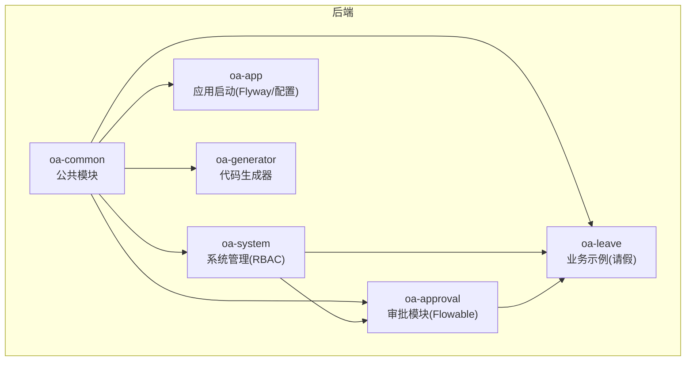
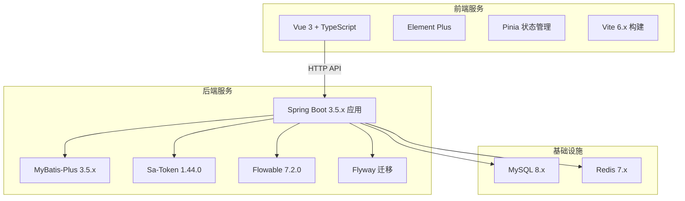
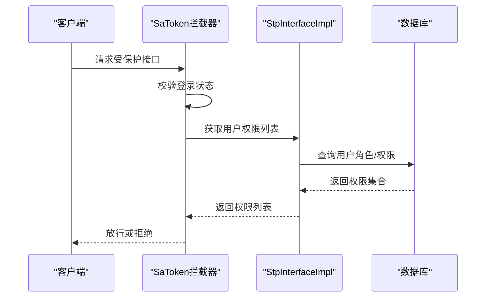
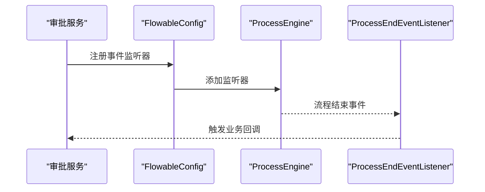
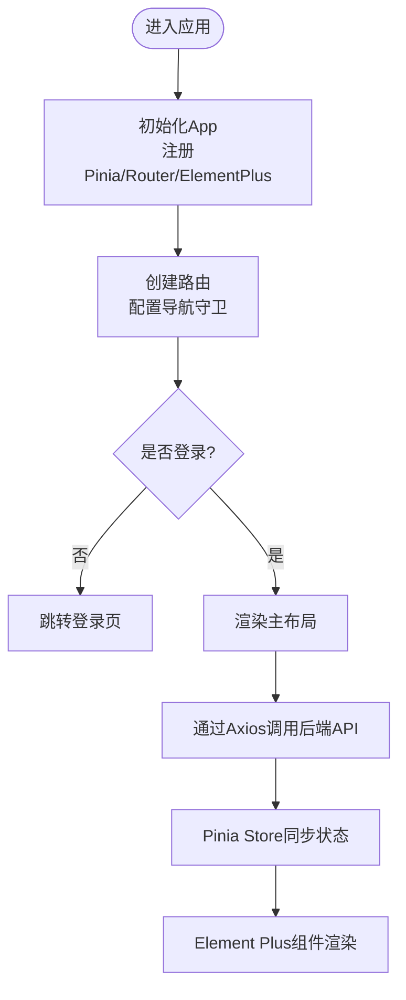
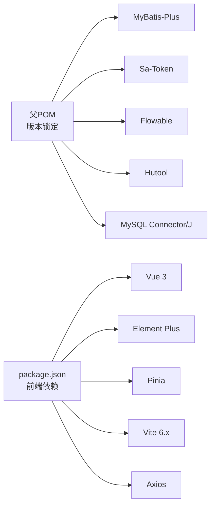

# 技术栈概览

<cite>
**本文档引用的文件**
- [pom.xml](file://pom.xml)
- [application.yml](file://oa-app/src/main/resources/application.yml)
- [docker-compose.yml](file://docker-compose.yml)
- [Dockerfile](file://Dockerfile)
- [SaTokenConfig.java](file://oa-system/src/main/java/com/oa/admin/system/config/SaTokenConfig.java)
- [StpInterfaceImpl.java](file://oa-system/src/main/java/com/oa/admin/system/config/StpInterfaceImpl.java)
- [FlowableConfig.java](file://oa-approval/src/main/java/com/oa/admin/approval/config/FlowableConfig.java)
- [MyBatisPlusAutoFillHandler.java](file://oa-common/src/main/java/com/oa/admin/common/config/MyBatisPlusAutoFillHandler.java)
- [BizApprovalInstance.java](file://oa-approval/src/main/java/com/oa/admin/approval/entity/BizApprovalInstance.java)
- [SysUser.java](file://oa-system/src/main/java/com/oa/admin/system/entity/SysUser.java)
- [package.json](file://oa-ui/package.json)
- [vite.config.ts](file://oa-ui/vite.config.ts)
- [tsconfig.json](file://oa-ui/tsconfig.json)
- [main.ts](file://oa-ui/src/main.ts)
- [index.ts](file://oa-ui/src/router/index.ts)
- [user.ts](file://oa-ui/src/stores/user.ts)
- [README.md](file://README.md)
</cite>

## 目录
1. [引言](#引言)
2. [项目结构](#项目结构)
3. [核心组件](#核心组件)
4. [架构总览](#架构总览)
5. [详细组件分析](#详细组件分析)
6. [依赖关系分析](#依赖关系分析)
7. [性能考虑](#性能考虑)
8. [故障排除指南](#故障排除指南)
9. [结论](#结论)

## 引言
本技术栈概览面向OA审批管理系统，系统采用前后端分离架构：后端基于Java 21 + Spring Boot 3.5.x + MyBatis-Plus + Sa-Token + Flowable，前端基于Vue 3 + TypeScript + Element Plus + Pinia，基础设施采用MySQL 8.x + Redis 7.x + Docker编排。本文档旨在解释各技术选型的原因与优势、版本兼容性、性能特点与扩展性，并阐明技术栈间的协同工作机制，帮助开发者快速理解并高效开展二次开发。

## 项目结构
项目采用多模块Maven聚合工程组织，按领域拆分模块，便于职责清晰与独立演进：
- oa-common：公共基础模块（统一响应、异常、自动填充等）
- oa-system：系统管理模块（RBAC：用户、角色、权限、部门）
- oa-approval：审批模块（Flowable引擎集成）
- oa-leave：示例业务模块（请假）
- oa-app：应用启动模块（配置、Flyway迁移、入口）
- oa-generator：代码生成器模块（基于YAML定义生成后端CRUD）

图表来源
- [pom.xml:21-28](file://pom.xml#L21-L28)

章节来源
- [pom.xml:1-131](file://pom.xml#L1-L131)
- [README.md:48-61](file://README.md#L48-L61)

## 核心组件
本节概述后端与前端的核心技术组件及其职责边界：

- 后端核心
  - Spring Boot 3.5.x：提供应用启动、自动配置、Web MVC、Actuator等能力
  - MyBatis-Plus 3.5.x：简化数据访问层开发，提供通用CRUD、逻辑删除、自动填充等
  - Sa-Token 1.44.0：轻量级Java权限认证框架，提供会话管理、接口鉴权、角色权限
  - Flowable 7.2.0：开源工作流引擎，支撑审批流程建模、执行与监控
  - Flyway：数据库版本管理，自动化迁移
  - Hutool：常用工具集，提升开发效率
  - MySQL 8.x + Redis 7.x：持久化与缓存存储

- 前端核心
  - Vue 3 + TypeScript：渐进式框架与强类型语言，提供良好开发体验
  - Element Plus：桌面端UI组件库，提供丰富的业务组件
  - Pinia：状态管理，替代Vuex，API简洁直观
  - Vite 6.x：构建工具，提供快速热更新与打包能力

章节来源
- [pom.xml:30-112](file://pom.xml#L30-L112)
- [package.json:15-36](file://oa-ui/package.json#L15-L36)
- [README.md:5-19](file://README.md#L5-L19)

## 架构总览
系统采用前后端分离架构，通过Docker进行统一编排，后端提供RESTful API，前端通过Axios调用接口并使用Pinia进行状态管理。

图表来源
- [docker-compose.yml:1-66](file://docker-compose.yml#L1-L66)
- [application.yml:4-59](file://oa-app/src/main/resources/application.yml#L4-L59)
- [pom.xml:36-112](file://pom.xml#L36-L112)
- [package.json:15-36](file://oa-ui/package.json#L15-L36)

## 详细组件分析

### 后端技术栈详解

#### Spring Boot 3.5.x + Java 21
- 版本选择理由
  - Java 21提供长期支持与性能优化，配合Spring Boot 3.5.x获得最佳生态适配
  - 项目在父POM中锁定JDK 17，但实际运行环境可使用Java 21（容器镜像基于Temurin 17 JRE）
- 协同机制
  - 自动配置启用MyBatis-Plus、Sa-Token、Flowable等starter
  - 通过application.yml集中管理数据源、Redis、Flyway、MyBatis-Plus、Sa-Token、Flowable等配置

章节来源
- [pom.xml:30-42](file://pom.xml#L30-L42)
- [application.yml:1-59](file://oa-app/src/main/resources/application.yml#L1-L59)
- [Dockerfile:17-21](file://Dockerfile#L17-L21)

#### MyBatis-Plus 3.5.x
- 选型优势
  - 提供通用Mapper、自动分页、逻辑删除、字段自动填充，显著减少DAO层样板代码
- 协同机制
  - 与Spring Boot自动装配结合，无需XML配置
  - 通过全局配置开启下划线转驼峰映射，统一命名风格
  - 自动填充处理器统一维护createdAt/updatedAt时间戳

章节来源
- [pom.xml:68-78](file://pom.xml#L68-L78)
- [application.yml:36-44](file://oa-app/src/main/resources/application.yml#L36-L44)
- [MyBatisPlusAutoFillHandler.java:11-24](file://oa-common/src/main/java/com/oa/admin/common/config/MyBatisPlusAutoFillHandler.java#L11-L24)

#### Sa-Token 1.44.0（RBAC鉴权）
- 选型优势
  - 轻量、易用、功能完备，支持会话管理、接口鉴权、角色权限、单设备登录
- 协同机制
  - 通过拦截器对/api/v1/**路径进行登录校验，开放登录/注册接口
  - 自定义StpInterface实现，从数据库加载用户的角色与权限列表
  - 配合Spring Security风格注解（如@SaCheckPermission）实现细粒度控制

图表来源
- [SaTokenConfig.java:15-23](file://oa-system/src/main/java/com/oa/admin/system/config/SaTokenConfig.java#L15-L23)
- [StpInterfaceImpl.java:26-74](file://oa-system/src/main/java/com/oa/admin/system/config/StpInterfaceImpl.java#L26-L74)

章节来源
- [pom.xml:80-90](file://pom.xml#L80-L90)
- [SaTokenConfig.java:1-25](file://oa-system/src/main/java/com/oa/admin/system/config/SaTokenConfig.java#L1-L25)
- [StpInterfaceImpl.java:1-75](file://oa-system/src/main/java/com/oa/admin/system/config/StpInterfaceImpl.java#L1-L75)

#### Flowable 7.2.0（审批引擎）
- 选型优势
  - 开源工作流引擎，支持BPMN 2.0标准，具备完善的流程建模、执行、监控能力
- 协同机制
  - 通过Spring Boot Starter自动装配，集成到应用生命周期
  - 自定义事件监听器（如流程结束事件）实现业务回调
  - 与审批实体（实例、任务、抄送、审计日志）协同，驱动业务流转

图表来源
- [FlowableConfig.java:17-29](file://oa-approval/src/main/java/com/oa/admin/approval/config/FlowableConfig.java#L17-L29)

章节来源
- [pom.xml:92-97](file://pom.xml#L92-L97)
- [FlowableConfig.java:1-31](file://oa-approval/src/main/java/com/oa/admin/approval/config/FlowableConfig.java#L1-L31)

#### 数据库与缓存
- MySQL 8.x
  - 使用Flyway进行数据库迁移，支持基线迁移与占位符替换关闭
  - HikariCP连接池参数优化，支持连接泄漏检测
- Redis 7.x
  - Sa-Token集成Redis实现分布式会话与共享令牌
  - 通过环境变量配置主机与端口，支持Docker部署

章节来源
- [application.yml:25-59](file://oa-app/src/main/resources/application.yml#L25-L59)
- [docker-compose.yml:2-30](file://docker-compose.yml#L2-L30)

### 前端技术栈详解

#### Vue 3 + TypeScript + Element Plus + Pinia
- 选型优势
  - Vue 3提供更好的组合式API与Tree-shaking；TypeScript增强类型安全
  - Element Plus提供丰富的企业级组件；Pinia替代Vuex，API更简洁
- 协同机制
  - Vite提供快速开发与构建能力，自动导入Element Plus组件
  - 路由采用history模式，结合本地token进行页面级鉴权
  - Pinia Store统一管理用户登录态与基本信息

图表来源
- [main.ts:1-14](file://oa-ui/src/main.ts#L1-L14)
- [index.ts:124-131](file://oa-ui/src/router/index.ts#L124-L131)
- [user.ts:6-31](file://oa-ui/src/stores/user.ts#L6-L31)

章节来源
- [package.json:15-36](file://oa-ui/package.json#L15-L36)
- [vite.config.ts:12-39](file://oa-ui/vite.config.ts#L12-L39)
- [tsconfig.json:1-24](file://oa-ui/tsconfig.json#L1-L24)
- [main.ts:1-14](file://oa-ui/src/main.ts#L1-L14)
- [index.ts:1-134](file://oa-ui/src/router/index.ts#L1-L134)
- [user.ts:1-32](file://oa-ui/src/stores/user.ts#L1-L32)

#### 前端构建与部署
- Vite配置
  - 自动导入Element Plus组件，减少重复引入
  - 代理/dev-server将/api请求转发至后端8080端口
- Dockerfile
  - Node 22构建产物，Nginx运行静态资源，暴露80端口

章节来源
- [vite.config.ts:12-39](file://oa-ui/vite.config.ts#L12-L39)
- [oa-ui/Dockerfile:1-15](file://oa-ui/Dockerfile#L1-L15)

### 基础设施与部署
- Docker Compose编排
  - MySQL 8.0 + Redis 7-alpine + 后端Spring Boot + 前端Nginx
  - 环境变量注入数据库与Redis连接信息，支持健康检查
- 多阶段构建
  - 后端：Maven构建 + JRE运行时镜像
  - 前端：Node构建 + Nginx运行时镜像

章节来源
- [docker-compose.yml:1-66](file://docker-compose.yml#L1-L66)
- [Dockerfile:1-22](file://Dockerfile#L1-L22)
- [oa-ui/Dockerfile:1-15](file://oa-ui/Dockerfile#L1-L15)

## 依赖关系分析
后端依赖通过Maven统一管理，版本在父POM中锁定，确保一致性与可追溯性。前端依赖通过package.json声明，构建工具链通过Vite配置。

图表来源
- [pom.xml:36-112](file://pom.xml#L36-L112)
- [package.json:15-36](file://oa-ui/package.json#L15-L36)

章节来源
- [pom.xml:36-112](file://pom.xml#L36-L112)
- [package.json:15-36](file://oa-ui/package.json#L15-L36)

## 性能考虑
- 数据库层
  - HikariCP连接池参数优化，合理设置最大连接数、空闲超时与泄漏检测阈值
  - Flyway启用基线迁移，避免生产环境误操作
- 缓存层
  - Sa-Token使用Redis存储会话，支持分布式共享与并发控制
- 应用层
  - Spring Boot 3.5.x + Java 21在JIT与GC方面持续优化，适合高并发场景
  - 前端Vite提供快速热更新与按需打包，降低首屏加载时间
- 扩展性
  - 多模块架构便于功能扩展与团队协作
  - Flowable支持复杂流程编排，满足审批策略演进

## 故障排除指南
- 启动失败（数据库/缓存不可达）
  - 检查docker-compose中MySQL/Redis健康检查与端口映射
  - 确认环境变量SPRING_DATASOURCE_URL/SPRING_DATA_REDIS_HOST/PORT
- 登录鉴权问题
  - 确认Sa-Token拦截器生效与StpInterfaceImpl权限查询逻辑
  - 检查用户角色与权限数据是否正确
- 审批流程异常
  - 查看Flowable事件监听器是否正确注册
  - 检查流程图设计与节点配置
- 前端无法访问后端API
  - 检查Vite代理配置与跨域设置
  - 确认路由守卫与本地token状态

章节来源
- [docker-compose.yml:42-48](file://docker-compose.yml#L42-L48)
- [SaTokenConfig.java:15-23](file://oa-system/src/main/java/com/oa/admin/system/config/SaTokenConfig.java#L15-L23)
- [StpInterfaceImpl.java:33-74](file://oa-system/src/main/java/com/oa/admin/system/config/StpInterfaceImpl.java#L33-L74)
- [FlowableConfig.java:17-29](file://oa-approval/src/main/java/com/oa/admin/approval/config/FlowableConfig.java#L17-L29)
- [vite.config.ts:30-38](file://oa-ui/vite.config.ts#L30-L38)

## 结论
该技术栈在RBAC与审批流程两大核心领域形成完整闭环：后端以Spring Boot为核心，结合MyBatis-Plus、Sa-Token与Flowable实现高内聚的功能模块；前端以Vue 3 + TypeScript + Element Plus + Pinia构建现代化用户体验；基础设施通过Docker实现一键部署与弹性扩展。整体方案兼顾开发效率、运行性能与可维护性，适合企业级OA审批系统的快速落地与长期演进。