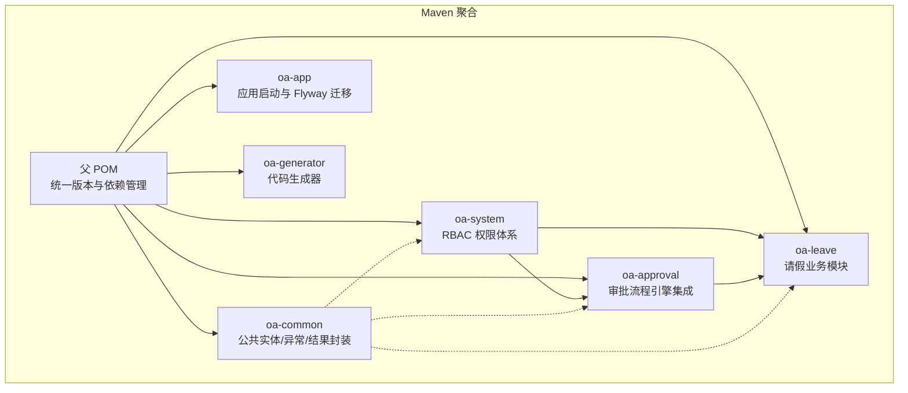
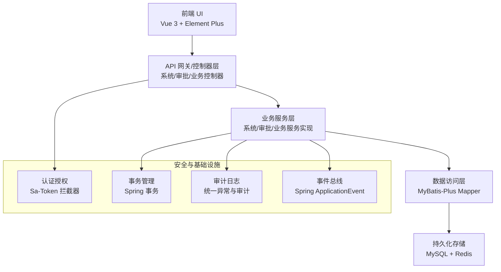
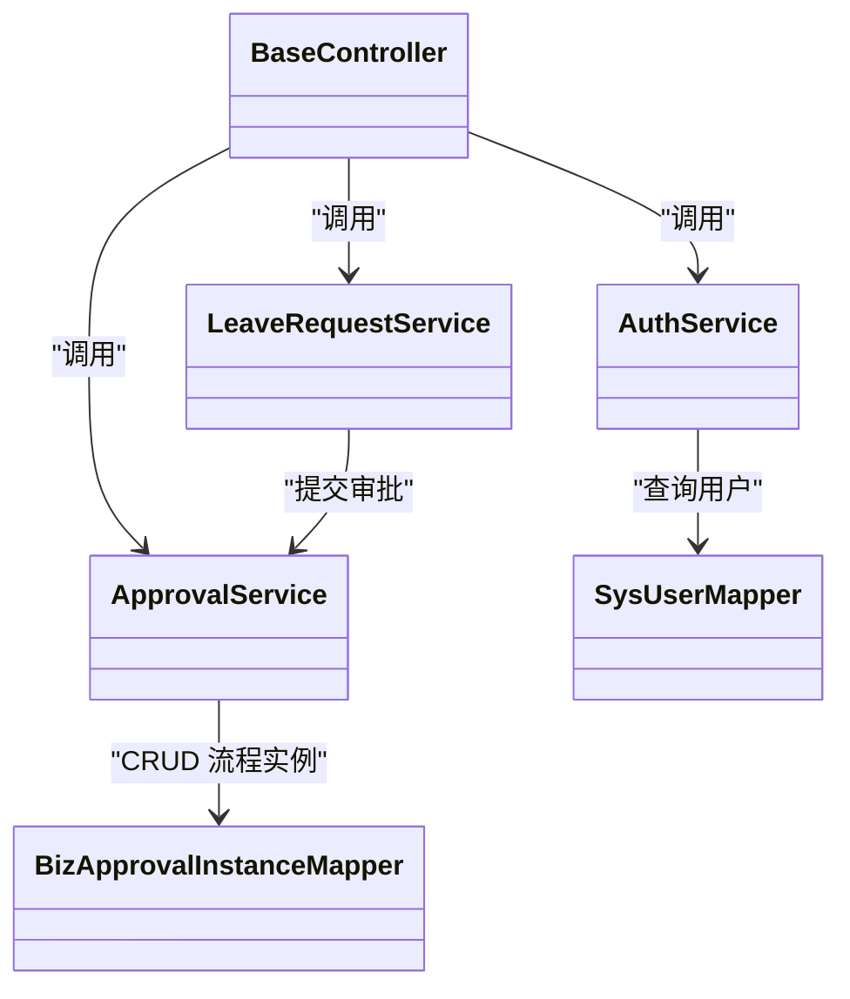
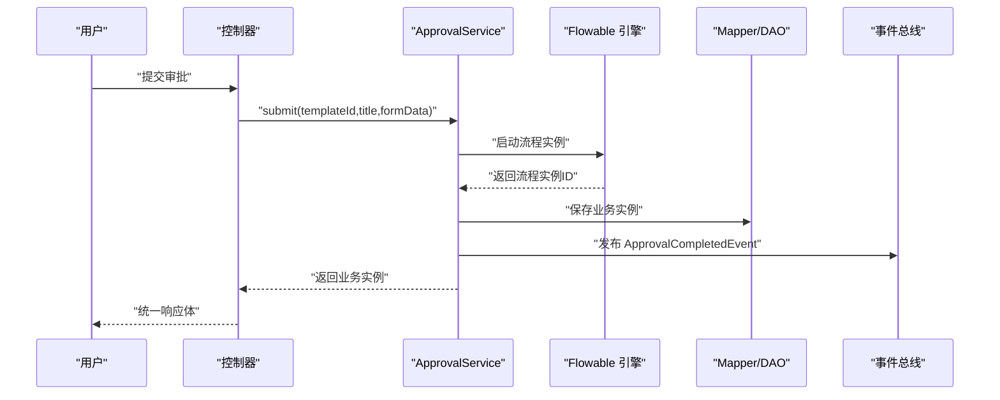
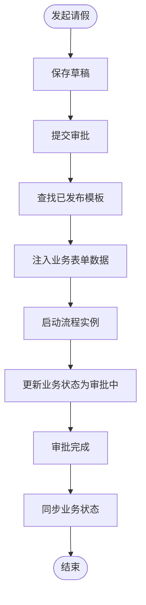
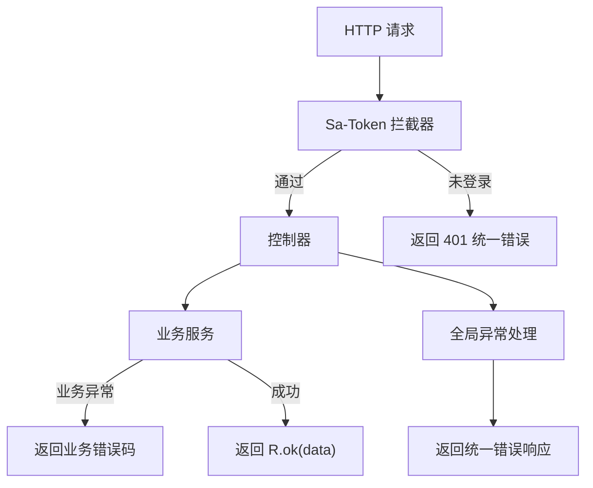
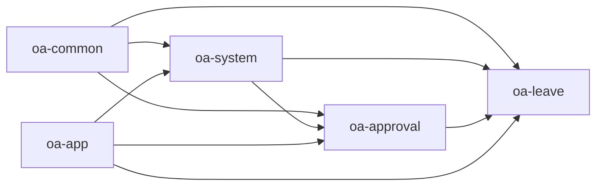

# 架构设计理念

<cite>
**本文引用的文件**
- [pom.xml](file://pom.xml)
- [OaAdminApplication.java](file://oa-app/src/main/java/com/oa/admin/OaAdminApplication.java)
- [README.md](file://README.md)
- [MyBatisPlusAutoFillHandler.java](file://oa-common/src/main/java/com/oa/admin/common/config/MyBatisPlusAutoFillHandler.java)
- [ApprovalCompletedEvent.java](file://oa-common/src/main/java/com/oa/admin/common/event/ApprovalCompletedEvent.java)
- [FlowableConfig.java](file://oa-approval/src/main/java/com/oa/admin/approval/config/FlowableConfig.java)
- [SaTokenConfig.java](file://oa-system/src/main/java/com/oa/admin/system/config/SaTokenConfig.java)
- [GlobalExceptionHandler.java](file://oa-common/src/main/java/com/oa/admin/common/exception/GlobalExceptionHandler.java)
- [R.java](file://oa-common/src/main/java/com/oa/admin/common/result/R.java)
- [ApprovalTaskCreateListener.java](file://oa-approval/src/main/java/com/oa/admin/approval/listener/ApprovalTaskCreateListener.java)
- [ApprovalServiceImpl.java](file://oa-approval/src/main/java/com/oa/admin/approval/service/impl/ApprovalServiceImpl.java)
- [AuthServiceImpl.java](file://oa-system/src/main/java/com/oa/admin/system/service/impl/AuthServiceImpl.java)
- [LeaveRequestServiceImpl.java](file://oa-leave/src/main/java/com/oa/admin/leave/service/impl/LeaveRequestServiceImpl.java)
- [BaseEntity.java](file://oa-common/src/main/java/com/oa/admin/common/entity/BaseEntity.java)
- [CodeGenerator.java](file://oa-generator/src/main/java/com/oa/admin/generator/engine/CodeGenerator.java)
</cite>

## 目录
1. [引言](#引言)
2. [项目结构](#项目结构)
3. [核心组件](#核心组件)
4. [架构总览](#架构总览)
5. [详细组件分析](#详细组件分析)
6. [依赖分析](#依赖分析)
7. [性能考量](#性能考量)
8. [故障排查指南](#故障排查指南)
9. [结论](#结论)
10. [附录](#附录)

## 引言
本项目以“RBAC 权限管理 + 审批流引擎”为核心目标，采用模块化与分层架构设计，结合 Spring Boot、MyBatis-Plus、Flowable、Sa-Token 等技术栈，构建一个可扩展、可维护、可演进的审批管理底座。本文档面向架构师与高级开发者，深入解析模块化设计思想、Maven 多模块优势、分层架构职责边界、微服务化与单体架构取舍、可扩展性与可维护性设计、性能优化策略以及设计模式的应用。

## 项目结构
项目采用 Maven 聚合工程，父 POM 统一管理版本与依赖，子模块按领域拆分：公共基础、系统管理（RBAC）、审批模块（Flowable 集成）、请假业务模块、应用启动模块、代码生成器模块。整体结构清晰、职责明确、便于独立开发与测试。

图表来源
- [pom.xml:21-28](file://pom.xml#L21-L28)
- [README.md:48-61](file://README.md#L48-L61)

章节来源
- [pom.xml:21-28](file://pom.xml#L21-L28)
- [README.md:48-61](file://README.md#L48-L61)

## 核心组件
- 公共模块（oa-common）：提供 BaseEntity、统一响应体 R、全局异常处理、自动填充处理器等横切能力，确保各模块一致的基础设施。
- 系统模块（oa-system）：实现 RBAC 权限体系，包含用户、角色、权限、部门等实体与服务，提供认证拦截与登录登出能力。
- 审批模块（oa-approval）：集成 Flowable 引擎，负责流程实例、任务、抄送、审计日志、通知等审批生命周期管理，并提供事件发布机制。
- 业务模块（oa-leave）：围绕请假场景，封装业务逻辑并与审批模块解耦协作，通过模板与表单数据驱动审批流程。
- 应用模块（oa-app）：Spring Boot 启动入口，扫描各模块 Mapper，执行 Flyway 数据库迁移。
- 代码生成器（oa-generator）：基于 YAML 定义自动生成后端 CRUD 代码与 Flyway 迁移脚本，降低重复劳动，提升一致性。

章节来源
- [BaseEntity.java:14-25](file://oa-common/src/main/java/com/oa/admin/common/entity/BaseEntity.java#L14-L25)
- [R.java:11-43](file://oa-common/src/main/java/com/oa/admin/common/result/R.java#L11-L43)
- [GlobalExceptionHandler.java:21-73](file://oa-common/src/main/java/com/oa/admin/common/exception/GlobalExceptionHandler.java#L21-L73)
- [MyBatisPlusAutoFillHandler.java:12-24](file://oa-common/src/main/java/com/oa/admin/common/config/MyBatisPlusAutoFillHandler.java#L12-L24)
- [SaTokenConfig.java:13-24](file://oa-system/src/main/java/com/oa/admin/system/config/SaTokenConfig.java#L13-L24)
- [FlowableConfig.java:17-30](file://oa-approval/src/main/java/com/oa/admin/approval/config/FlowableConfig.java#L17-L30)
- [ApprovalTaskCreateListener.java:21-64](file://oa-approval/src/main/java/com/oa/admin/approval/listener/ApprovalTaskCreateListener.java#L21-L64)
- [ApprovalServiceImpl.java:60-121](file://oa-approval/src/main/java/com/oa/admin/approval/service/impl/ApprovalServiceImpl.java#L60-L121)
- [LeaveRequestServiceImpl.java:34-42](file://oa-leave/src/main/java/com/oa/admin/leave/service/impl/LeaveRequestServiceImpl.java#L34-L42)
- [OaAdminApplication.java:13-18](file://oa-app/src/main/java/com/oa/admin/OaAdminApplication.java#L13-L18)
- [CodeGenerator.java:22-63](file://oa-generator/src/main/java/com/oa/admin/generator/engine/CodeGenerator.java#L22-L63)

## 架构总览
系统采用“单体架构 + 微服务化思维”的混合模式：以单体形态提供完整能力，同时通过模块边界清晰、依赖方向可控，为未来向微服务演进预留空间。分层架构遵循“表现层-业务层-数据访问层-基础设施层”的职责划分，配合事件驱动与策略式扩展点，实现高内聚、低耦合。

图表来源
- [README.md:6-19](file://README.md#L6-L19)
- [SaTokenConfig.java:13-24](file://oa-system/src/main/java/com/oa/admin/system/config/SaTokenConfig.java#L13-L24)
- [GlobalExceptionHandler.java:21-73](file://oa-common/src/main/java/com/oa/admin/common/exception/GlobalExceptionHandler.java#L21-L73)
- [ApprovalCompletedEvent.java:10-34](file://oa-common/src/main/java/com/oa/admin/common/event/ApprovalCompletedEvent.java#L10-L34)

## 详细组件分析

### 模块化设计与职责边界
- 模块划分原则：按业务域与横切关注点分离。oa-common 提供横切能力；oa-system 负责权限；oa-approval 负责流程；oa-leave 负责具体业务；oa-app 负责启动与迁移；oa-generator 负责自动化生成。
- 依赖方向：上层模块依赖下层模块，避免反向依赖；公共能力由 oa-common 下沉，其他模块只感知接口与契约。
- 版本与依赖管理：父 POM 使用 dependencyManagement 锁定版本，保证一致性并简化升级成本。

章节来源
- [pom.xml:44-113](file://pom.xml#L44-L113)
- [README.md:48-61](file://README.md#L48-L61)

### 分层架构设计
- 表现层：控制器接收请求，进行参数校验与鉴权，调用业务服务，返回统一响应体。
- 业务层：封装领域业务规则，协调多个聚合与外部系统（如 Flowable），保证事务边界与幂等性。
- 数据访问层：基于 MyBatis-Plus，统一实体基类与自动填充，屏蔽 SQL 细节，提升开发效率。
- 基础设施层：认证授权（Sa-Token）、异常处理（全局）、审计日志、事件发布、数据库迁移（Flyway）。

图表来源
- [AuthServiceImpl.java:20-52](file://oa-system/src/main/java/com/oa/admin/system/service/impl/AuthServiceImpl.java#L20-L52)
- [ApprovalServiceImpl.java:60-121](file://oa-approval/src/main/java/com/oa/admin/approval/service/impl/ApprovalServiceImpl.java#L60-L121)
- [LeaveRequestServiceImpl.java:34-42](file://oa-leave/src/main/java/com/oa/admin/leave/service/impl/LeaveRequestServiceImpl.java#L34-L42)

章节来源
- [R.java:11-43](file://oa-common/src/main/java/com/oa/admin/common/result/R.java#L11-L43)
- [GlobalExceptionHandler.java:21-73](file://oa-common/src/main/java/com/oa/admin/common/exception/GlobalExceptionHandler.java#L21-L73)
- [BaseEntity.java:14-25](file://oa-common/src/main/java/com/oa/admin/common/entity/BaseEntity.java#L14-L25)

### 审批流程引擎集成与事件驱动
- Flowable 集成：通过配置类注册事件监听器，捕获流程结束事件；任务创建监听器将 Flowable 任务映射为业务任务，确保业务与流程的一致性。
- 事件发布：审批完成后发布 ApprovalCompletedEvent，业务模块可订阅该事件进行状态同步或后续处理。
- 流程生命周期：提交、审批、撤回、终止、转办、重新指派等操作均在业务服务中编排，保证领域语义清晰。

图表来源
- [ApprovalServiceImpl.java:122-168](file://oa-approval/src/main/java/com/oa/admin/approval/service/impl/ApprovalServiceImpl.java#L122-L168)
- [ApprovalTaskCreateListener.java:21-64](file://oa-approval/src/main/java/com/oa/admin/approval/listener/ApprovalTaskCreateListener.java#L21-L64)
- [FlowableConfig.java:17-30](file://oa-approval/src/main/java/com/oa/admin/approval/config/FlowableConfig.java#L17-L30)
- [ApprovalCompletedEvent.java:10-34](file://oa-common/src/main/java/com/oa/admin/common/event/ApprovalCompletedEvent.java#L10-L34)

章节来源
- [FlowableConfig.java:17-30](file://oa-approval/src/main/java/com/oa/admin/approval/config/FlowableConfig.java#L17-L30)
- [ApprovalTaskCreateListener.java:21-89](file://oa-approval/src/main/java/com/oa/admin/approval/listener/ApprovalTaskCreateListener.java#L21-L89)
- [ApprovalCompletedEvent.java:10-34](file://oa-common/src/main/java/com/oa/admin/common/event/ApprovalCompletedEvent.java#L10-L34)

### 请假业务与审批联动
- 业务服务通过模板键定位流程模板，将业务数据以 JSON 形式注入流程变量，实现“低代码表单 + 流程引擎”的组合。
- 通过回调监听或事件订阅，将审批结果同步到业务实体状态，保障数据一致性。
- 使用延迟代理对象解决循环依赖问题，同时保持构造器注入的依赖注入最佳实践。

图表来源
- [LeaveRequestServiceImpl.java:96-151](file://oa-leave/src/main/java/com/oa/admin/leave/service/impl/LeaveRequestServiceImpl.java#L96-L151)
- [ApprovalServiceImpl.java:122-168](file://oa-approval/src/main/java/com/oa/admin/approval/service/impl/ApprovalServiceImpl.java#L122-L168)

章节来源
- [LeaveRequestServiceImpl.java:34-42](file://oa-leave/src/main/java/com/oa/admin/leave/service/impl/LeaveRequestServiceImpl.java#L34-L42)
- [LeaveRequestServiceImpl.java:96-151](file://oa-leave/src/main/java/com/oa/admin/leave/service/impl/LeaveRequestServiceImpl.java#L96-L151)

### 安全与统一响应
- 认证拦截：通过 Sa-Token 拦截器对受保护接口进行登录校验，排除登录/注册等公开接口。
- 统一响应：R 封装 code/msg/data/timestamp，前后端约定一致的数据格式。
- 全局异常：集中处理未登录、权限不足、业务异常、参数校验异常等，保证错误信息标准化输出。

图表来源
- [SaTokenConfig.java:13-24](file://oa-system/src/main/java/com/oa/admin/system/config/SaTokenConfig.java#L13-L24)
- [R.java:11-43](file://oa-common/src/main/java/com/oa/admin/common/result/R.java#L11-L43)
- [GlobalExceptionHandler.java:21-73](file://oa-common/src/main/java/com/oa/admin/common/exception/GlobalExceptionHandler.java#L21-L73)

章节来源
- [SaTokenConfig.java:13-24](file://oa-system/src/main/java/com/oa/admin/system/config/SaTokenConfig.java#L13-L24)
- [R.java:11-43](file://oa-common/src/main/java/com/oa/admin/common/result/R.java#L11-L43)
- [GlobalExceptionHandler.java:21-73](file://oa-common/src/main/java/com/oa/admin/common/exception/GlobalExceptionHandler.java#L21-L73)

### 设计模式的应用
- 观察者模式：通过 Spring ApplicationEvent 与 @EventListener 实现事件发布与订阅，审批完成事件驱动业务模块状态同步。
- 策略模式：流程节点配置（如会签/或签）通过变量与条件表达式策略化配置，监听器根据变量检测任务类型，实现不同策略的任务处理。
- 模板方法：业务服务中对流程变量注入、实例状态更新、审计日志记录等步骤进行模板化编排，保证一致性与可扩展性。

章节来源
- [ApprovalCompletedEvent.java:10-34](file://oa-common/src/main/java/com/oa/admin/common/event/ApprovalCompletedEvent.java#L10-L34)
- [ApprovalTaskCreateListener.java:71-87](file://oa-approval/src/main/java/com/oa/admin/approval/listener/ApprovalTaskCreateListener.java#L71-L87)
- [ApprovalServiceImpl.java:122-168](file://oa-approval/src/main/java/com/oa/admin/approval/service/impl/ApprovalServiceImpl.java#L122-L168)

## 依赖分析
- 依赖方向：系统模块依赖公共模块；审批模块依赖公共模块；业务模块依赖系统与审批模块；应用模块依赖系统/审批/业务模块的 Mapper 扫描。
- 外部依赖：MyBatis-Plus、Sa-Token、Flowable、Hutool、MySQL、Redis、Flyway 等，均由父 POM 统一版本管理。
- 循环依赖规避：业务模块使用 ObjectProvider 延迟获取自身代理，避免构造器注入导致的循环依赖问题。

图表来源
- [pom.xml:44-113](file://pom.xml#L44-L113)
- [OaAdminApplication.java:13-18](file://oa-app/src/main/java/com/oa/admin/OaAdminApplication.java#L13-L18)
- [LeaveRequestServiceImpl.java:34-42](file://oa-leave/src/main/java/com/oa/admin/leave/service/impl/LeaveRequestServiceImpl.java#L34-L42)

章节来源
- [pom.xml:44-113](file://pom.xml#L44-L113)
- [OaAdminApplication.java:13-18](file://oa-app/src/main/java/com/oa/admin/OaAdminApplication.java#L13-L18)
- [LeaveRequestServiceImpl.java:34-42](file://oa-leave/src/main/java/com/oa/admin/leave/service/impl/LeaveRequestServiceImpl.java#L34-L42)

## 性能考量
- ORM 与分页：使用 MyBatis-Plus 分页插件与 Lambda 条件构造器，减少 N+1 查询风险，合理使用 select 列与排序字段。
- 事务边界：业务服务中对跨聚合的操作进行显式事务控制，避免长事务与锁竞争。
- 缓存与会话：结合 Sa-Token 与 Redis 实现会话与令牌缓存，降低鉴权开销。
- 事件异步化：对于非关键路径的通知与审计，可引入消息队列异步化，减轻主流程压力。
- 监听器与事件：Flowable 事件监听器应避免重 IO 操作，必要时异步化处理。

## 故障排查指南
- 统一错误响应：通过全局异常处理器集中处理各类异常，前端依据 code/msg 进行提示与降级。
- 审计日志：所有关键操作均记录审计日志，便于问题追踪与复盘。
- 参数校验：对入参进行严格校验，异常时返回明确的错误信息与字段提示。
- 会话与权限：确认 Sa-Token 拦截器是否正确排除公开接口，检查登录状态与权限标识。

章节来源
- [GlobalExceptionHandler.java:21-73](file://oa-common/src/main/java/com/oa/admin/common/exception/GlobalExceptionHandler.java#L21-L73)
- [R.java:11-43](file://oa-common/src/main/java/com/oa/admin/common/result/R.java#L11-L43)
- [SaTokenConfig.java:13-24](file://oa-system/src/main/java/com/oa/admin/system/config/SaTokenConfig.java#L13-L24)

## 结论
本项目以模块化与分层架构为基础，结合 Flowable 与 Sa-Token 等成熟框架，构建了 RBAC 与审批流一体化的后台管理平台模板。通过公共模块下沉横切能力、业务模块与流程引擎解耦协作、事件驱动与统一响应与异常处理，实现了高内聚、低耦合、易扩展与易维护的目标。在当前阶段，单体架构具备快速迭代与部署的优势；随着业务复杂度提升，可在现有模块边界基础上逐步引入微服务化策略，保持演进的连续性与稳定性。

## 附录
- 启动与部署：通过 init.sh 初始化项目，docker-compose 一键拉起后端与前端服务。
- 代码生成器：基于 YAML 定义自动生成 CRUD 与 Flyway 迁移脚本，减少重复工作量。
- 前后端约定：RESTful API、统一响应体、分页格式、认证头等规范详见 README。

章节来源
- [README.md:20-46](file://README.md#L20-L46)
- [README.md:141-151](file://README.md#L141-L151)
- [README.md:87-93](file://README.md#L87-L93)