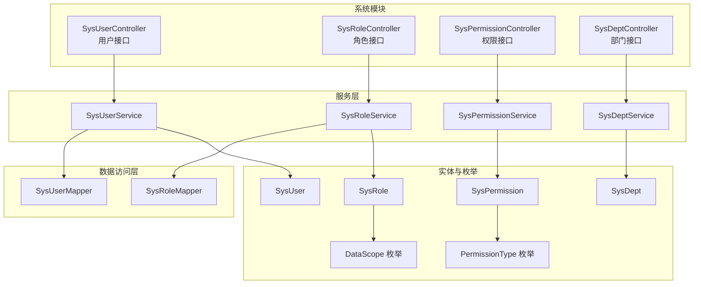
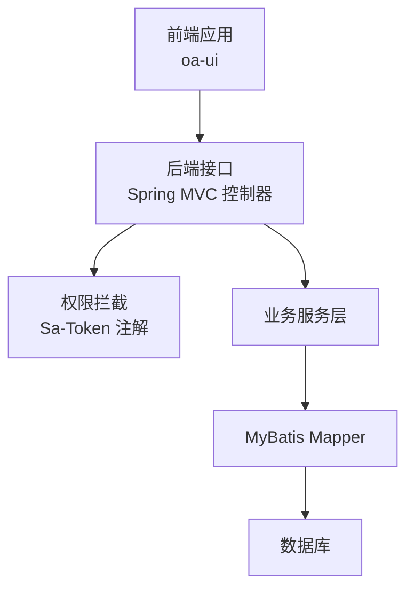
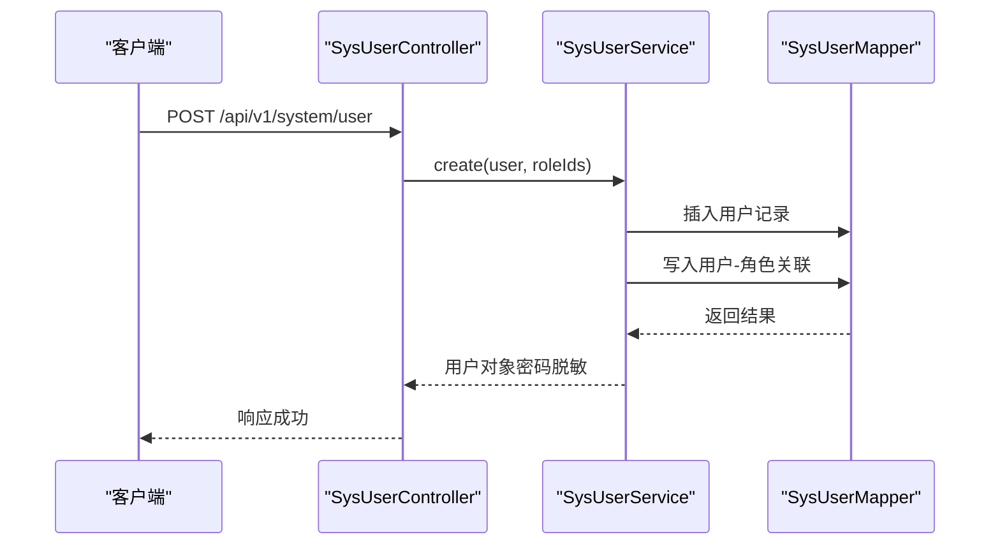
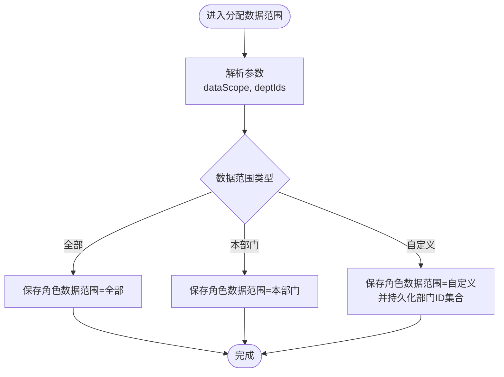
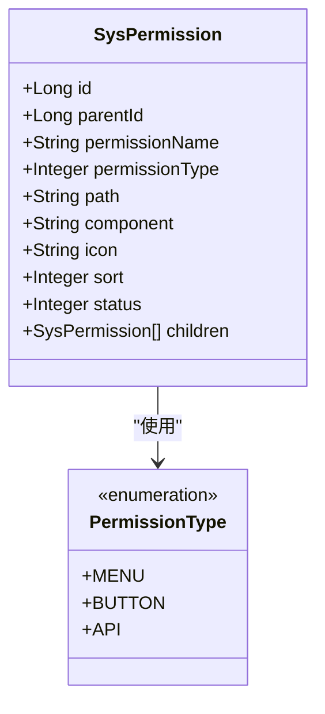
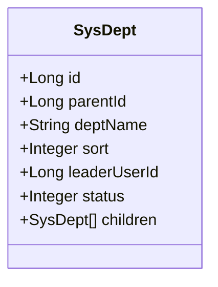
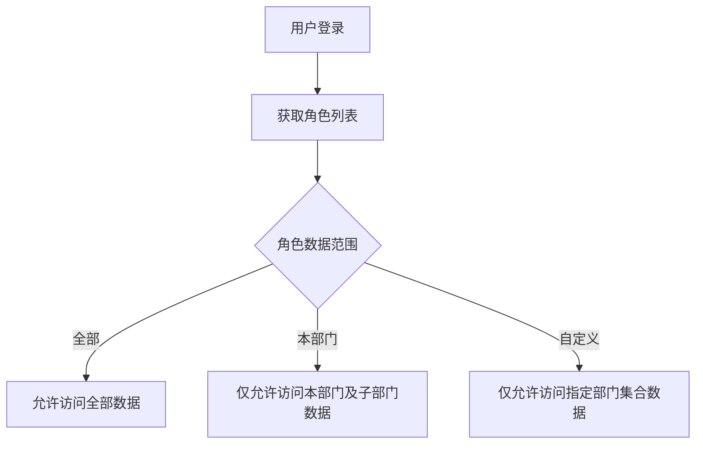
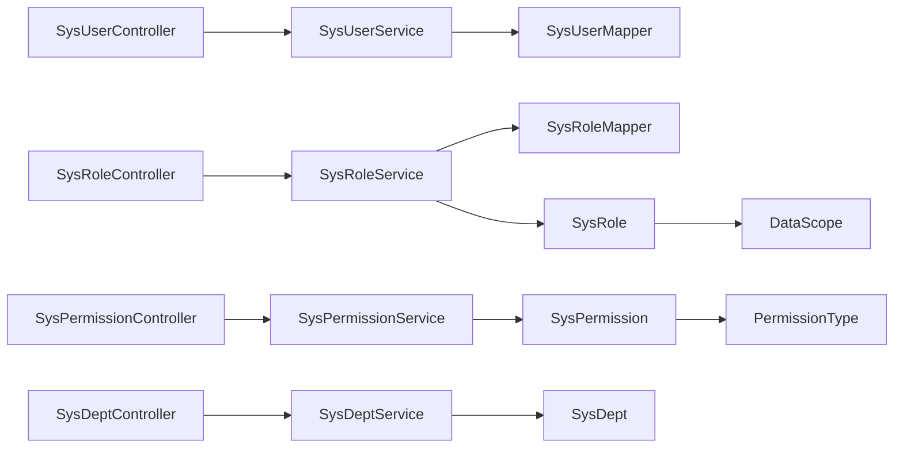

# RBAC权限管理

<cite>
**本文引用的文件**
- [SysUserController.java](file://oa-system/src/main/java/com/oa/admin/system/controller/SysUserController.java)
- [SysRoleController.java](file://oa-system/src/main/java/com/oa/admin/system/controller/SysRoleController.java)
- [SysPermissionController.java](file://oa-system/src/main/java/com/oa/admin/system/controller/SysPermissionController.java)
- [SysDeptController.java](file://oa-system/src/main/java/com/oa/admin/system/controller/SysDeptController.java)
- [SysUserService.java](file://oa-system/src/main/java/com/oa/admin/system/service/SysUserService.java)
- [SysRoleService.java](file://oa-system/src/main/java/com/oa/admin/system/service/SysRoleService.java)
- [SysPermissionService.java](file://oa-system/src/main/java/com/oa/admin/system/service/SysPermissionService.java)
- [SysDeptService.java](file://oa-system/src/main/java/com/oa/admin/system/service/SysDeptService.java)
- [SysUserMapper.java](file://oa-system/src/main/java/com/oa/admin/system/mapper/SysUserMapper.java)
- [SysRoleMapper.java](file://oa-system/src/main/java/com/oa/admin/system/mapper/SysRoleMapper.java)
- [SysUser.java](file://oa-system/src/main/java/com/oa/admin/system/entity/SysUser.java)
- [SysRole.java](file://oa-system/src/main/java/com/oa/admin/system/entity/SysRole.java)
- [SysPermission.java](file://oa-system/src/main/java/com/oa/admin/system/entity/SysPermission.java)
- [SysDept.java](file://oa-system/src/main/java/com/oa/admin/system/entity/SysDept.java)
- [DataScope.java](file://oa-system/src/main/java/com/oa/admin/system/enums/DataScope.java)
- [PermissionType.java](file://oa-system/src/main/java/com/oa/admin/system/enums/PermissionType.java)
- [SaTokenConfig.java](file://oa-system/src/main/java/com/oa/admin/system/config/SaTokenConfig.java)
- [StpInterfaceImpl.java](file://oa-system/src/main/java/com/oa/admin/system/config/StpInterfaceImpl.java)
- [application.yml](file://oa-app/src/main/resources/application.yml)
</cite>

## 目录
1. [简介](#简介)
2. [项目结构](#项目结构)
3. [核心组件](#核心组件)
4. [架构总览](#架构总览)
5. [详细组件分析](#详细组件分析)
6. [依赖分析](#依赖分析)
7. [性能考虑](#性能考虑)
8. [故障排查指南](#故障排查指南)
9. [结论](#结论)
10. [附录](#附录)

## 简介
本文件面向RBAC权限管理系统，围绕用户管理、角色管理、权限管理（菜单/按钮/API三级权限树）、部门管理（树形组织架构）与数据权限（全部/本部门/自定义）五大核心模块，系统性阐述实现原理、业务逻辑、数据模型设计与API接口规范，并补充权限验证机制、安全控制策略与最佳实践。目标是帮助开发者快速理解并高效落地RBAC权限体系。

## 项目结构
RBAC相关能力集中在 oa-system 模块中，采用典型的分层架构：控制器层（Controller）负责HTTP接口与权限注解校验；服务层（Service）封装业务流程；数据访问层（Mapper/Entity）映射数据库表结构。前端通过 oa-ui 提供管理界面，后端通过 Sa-Token 实现会话与权限拦截。

图表来源
- [SysUserController.java:17-84](file://oa-system/src/main/java/com/oa/admin/system/controller/SysUserController.java#L17-L84)
- [SysRoleController.java:17-77](file://oa-system/src/main/java/com/oa/admin/system/controller/SysRoleController.java#L17-L77)
- [SysPermissionController.java:15-62](file://oa-system/src/main/java/com/oa/admin/system/controller/SysPermissionController.java#L15-L62)
- [SysDeptController.java:16-69](file://oa-system/src/main/java/com/oa/admin/system/controller/SysDeptController.java#L16-L69)
- [SysUserService.java:12-19](file://oa-system/src/main/java/com/oa/admin/system/service/SysUserService.java#L12-L19)
- [SysRoleService.java:12-19](file://oa-system/src/main/java/com/oa/admin/system/service/SysRoleService.java#L12-L19)
- [SysPermissionService.java:11-16](file://oa-system/src/main/java/com/oa/admin/system/service/SysPermissionService.java#L11-L16)
- [SysDeptService.java:11-16](file://oa-system/src/main/java/com/oa/admin/system/service/SysDeptService.java#L11-L16)
- [SysUserMapper.java:10-12](file://oa-system/src/main/java/com/oa/admin/system/mapper/SysUserMapper.java#L10-L12)
- [SysRoleMapper.java:10-12](file://oa-system/src/main/java/com/oa/admin/system/mapper/SysRoleMapper.java#L10-L12)
- [SysUser.java:13-26](file://oa-system/src/main/java/com/oa/admin/system/entity/SysUser.java#L13-L26)
- [SysRole.java:13-25](file://oa-system/src/main/java/com/oa/admin/system/entity/SysRole.java#L13-L25)
- [SysPermission.java:16-34](file://oa-system/src/main/java/com/oa/admin/system/entity/SysPermission.java#L16-L34)
- [SysDept.java:16-30](file://oa-system/src/main/java/com/oa/admin/system/entity/SysDept.java#L16-L30)
- [DataScope.java:11-26](file://oa-system/src/main/java/com/oa/admin/system/enums/DataScope.java#L11-L26)
- [PermissionType.java:11-26](file://oa-system/src/main/java/com/oa/admin/system/enums/PermissionType.java#L11-L26)

章节来源
- [SysUserController.java:17-84](file://oa-system/src/main/java/com/oa/admin/system/controller/SysUserController.java#L17-L84)
- [SysRoleController.java:17-77](file://oa-system/src/main/java/com/oa/admin/system/controller/SysRoleController.java#L17-L77)
- [SysPermissionController.java:15-62](file://oa-system/src/main/java/com/oa/admin/system/controller/SysPermissionController.java#L15-L62)
- [SysDeptController.java:16-69](file://oa-system/src/main/java/com/oa/admin/system/controller/SysDeptController.java#L16-L69)

## 核心组件
- 用户管理：提供用户CRUD与角色分配，支持分页查询、按状态过滤、密码字段脱敏返回。
- 角色管理：提供角色CRUD与权限分配、数据范围配置（全部/本部门/自定义）。
- 权限管理：以树形结构呈现菜单/按钮/API三层权限，支持按状态筛选与树形查询。
- 部门管理：提供树形组织架构，支持按父节点查询与排序。
- 数据权限：通过角色维度的数据范围策略，结合部门ID集合实现灵活的数据可见性控制。

章节来源
- [SysUserService.java:12-19](file://oa-system/src/main/java/com/oa/admin/system/service/SysUserService.java#L12-L19)
- [SysRoleService.java:12-19](file://oa-system/src/main/java/com/oa/admin/system/service/SysRoleService.java#L12-L19)
- [SysPermissionService.java:11-16](file://oa-system/src/main/java/com/oa/admin/system/service/SysPermissionService.java#L11-L16)
- [SysDeptService.java:11-16](file://oa-system/src/main/java/com/oa/admin/system/service/SysDeptService.java#L11-L16)

## 架构总览
系统采用前后端分离，后端基于Spring Boot + MyBatis-Plus，前端基于Vue3 + TypeScript。权限控制由 Sa-Token 统一拦截，控制器层通过注解声明所需权限点，服务层执行业务逻辑，数据层通过Mapper访问数据库。

图表来源
- [SaTokenConfig.java](file://oa-system/src/main/java/com/oa/admin/system/config/SaTokenConfig.java)
- [StpInterfaceImpl.java](file://oa-system/src/main/java/com/oa/admin/system/config/StpInterfaceImpl.java)
- [SysUserController.java:23-31](file://oa-system/src/main/java/com/oa/admin/system/controller/SysUserController.java#L23-L31)
- [SysRoleController.java:39-44](file://oa-system/src/main/java/com/oa/admin/system/controller/SysRoleController.java#L39-L44)

## 详细组件分析

### 用户管理（CRUD与角色分配）
- 接口规范
  - 列表查询：GET /api/v1/system/user?page=&pageSize=&username=&status=
  - 单条查询：GET /api/v1/system/user/{id}
  - 新增：POST /api/v1/system/user（body含用户名、昵称、密码、邮箱、电话、部门ID、状态、角色ID列表）
  - 更新：PUT /api/v1/system/user/{id}（同上，更新时可传入角色ID列表）
  - 删除：DELETE /api/v1/system/user/{id}
- 权限点：system:user:list、system:user:query、system:user:add、system:user:edit、system:user:remove
- 业务逻辑
  - 新增/更新时接收角色ID列表，服务层完成用户与角色的关联写入。
  - 查询单条用户时对密码字段进行脱敏处理。
  - 分页查询支持按用户名模糊与状态过滤。
- 数据模型
  - 用户实体包含基础信息与部门ID、状态等字段。
- 安全控制
  - 控制器方法均标注对应权限注解，未授权请求被拦截。

图表来源
- [SysUserController.java:41-57](file://oa-system/src/main/java/com/oa/admin/system/controller/SysUserController.java#L41-L57)
- [SysUserService.java:16-18](file://oa-system/src/main/java/com/oa/admin/system/service/SysUserService.java#L16-L18)
- [SysUserMapper.java:10-12](file://oa-system/src/main/java/com/oa/admin/system/mapper/SysUserMapper.java#L10-L12)
- [SysUser.java:13-26](file://oa-system/src/main/java/com/oa/admin/system/entity/SysUser.java#L13-L26)

章节来源
- [SysUserController.java:23-83](file://oa-system/src/main/java/com/oa/admin/system/controller/SysUserController.java#L23-L83)
- [SysUserService.java:12-19](file://oa-system/src/main/java/com/oa/admin/system/service/SysUserService.java#L12-L19)
- [SysUser.java:13-26](file://oa-system/src/main/java/com/oa/admin/system/entity/SysUser.java#L13-L26)

### 角色管理（CRUD与权限分配）
- 接口规范
  - 列表查询：GET /api/v1/system/role?page=&pageSize=&roleName=&status=
  - 单条查询：GET /api/v1/system/role/{id}
  - 新增：POST /api/v1/system/role
  - 更新：PUT /api/v1/system/role/{id}
  - 删除：DELETE /api/v1/system/role/{id}
  - 分配权限：POST /api/v1/system/role/{id}/permissions（body: permissionIds）
  - 分配数据范围：POST /api/v1/system/role/{id}/data-scope（body: dataScope, deptIds）
- 权限点：system:role:list、system:role:query、system:role:add、system:role:edit、system:role:remove
- 业务逻辑
  - 权限分配：根据角色ID与权限ID列表，批量建立角色-权限关联。
  - 数据范围：设置角色的数据可见范围（全部/本部门/自定义），并持久化部门ID集合。
- 数据模型
  - 角色实体包含角色名、角色键、排序、数据范围与状态；数据范围取值来自枚举。

图表来源
- [SysRoleController.java:61-76](file://oa-system/src/main/java/com/oa/admin/system/controller/SysRoleController.java#L61-L76)
- [SysRole.java:22-24](file://oa-system/src/main/java/com/oa/admin/system/entity/SysRole.java#L22-L24)
- [DataScope.java:11-26](file://oa-system/src/main/java/com/oa/admin/system/enums/DataScope.java#L11-L26)

章节来源
- [SysRoleController.java:23-76](file://oa-system/src/main/java/com/oa/admin/system/controller/SysRoleController.java#L23-L76)
- [SysRoleService.java:12-19](file://oa-system/src/main/java/com/oa/admin/system/service/SysRoleService.java#L12-L19)
- [SysRole.java:13-25](file://oa-system/src/main/java/com/oa/admin/system/entity/SysRole.java#L13-L25)
- [DataScope.java:11-26](file://oa-system/src/main/java/com/oa/admin/system/enums/DataScope.java#L11-L26)

### 权限管理（菜单/按钮/API三级权限树）
- 接口规范
  - 树形查询：GET /api/v1/system/permission/tree?status=
  - 列表查询：GET /api/v1/system/permission?status=
  - 单条查询：GET /api/v1/system/permission/{id}
  - 新增/更新/删除：POST/PUT/DELETE /api/v1/system/permission/{id}
- 权限点：system:permission:list、system:permission:query、system:permission:add、system:permission:edit、system:permission:remove
- 业务逻辑
  - 树形结构：权限实体包含父子关系与子节点集合，服务层构建树形结构返回。
  - 类型枚举：菜单、按钮、API三类权限，用于前端路由与按钮级权限控制。
- 数据模型
  - 权限实体包含父ID、名称、类型、路径、组件、图标、排序、状态及子节点集合。

图表来源
- [SysPermission.java:16-34](file://oa-system/src/main/java/com/oa/admin/system/entity/SysPermission.java#L16-L34)
- [PermissionType.java:11-26](file://oa-system/src/main/java/com/oa/admin/system/enums/PermissionType.java#L11-L26)

章节来源
- [SysPermissionController.java:21-61](file://oa-system/src/main/java/com/oa/admin/system/controller/SysPermissionController.java#L21-L61)
- [SysPermissionService.java:11-16](file://oa-system/src/main/java/com/oa/admin/system/service/SysPermissionService.java#L11-L16)
- [SysPermission.java:16-34](file://oa-system/src/main/java/com/oa/admin/system/entity/SysPermission.java#L16-L34)
- [PermissionType.java:11-26](file://oa-system/src/main/java/com/oa/admin/system/enums/PermissionType.java#L11-L26)

### 部门管理（树形组织架构）
- 接口规范
  - 树形查询：GET /api/v1/system/dept/tree?status=
  - 列表查询：GET /api/v1/system/dept?status=
  - 单条查询：GET /api/v1/system/dept/{id}
  - 新增/更新/删除：POST/PUT/DELETE /api/v1/system/dept/{id}
- 权限点：system:dept:list、system:dept:query、system:dept:add、system:dept:edit、system:dept:remove
- 业务逻辑
  - 树形结构：部门实体包含父子关系与子节点集合，支持按父ID查询与排序。
  - 可选字段：负责人用户ID、排序、状态等。
- 数据模型
  - 部门实体包含ID、父ID、部门名称、排序、负责人ID、状态与子节点集合。

图表来源
- [SysDept.java:16-30](file://oa-system/src/main/java/com/oa/admin/system/entity/SysDept.java#L16-L30)

章节来源
- [SysDeptController.java:22-68](file://oa-system/src/main/java/com/oa/admin/system/controller/SysDeptController.java#L22-L68)
- [SysDeptService.java:11-16](file://oa-system/src/main/java/com/oa/admin/system/service/SysDeptService.java#L11-L16)
- [SysDept.java:16-30](file://oa-system/src/main/java/com/oa/admin/system/entity/SysDept.java#L16-L30)

### 数据权限（全部/本部门/自定义）
- 设计要点
  - 角色维度：每个角色绑定一种数据范围策略。
  - 全部：该角色可查看所有数据。
  - 本部门：仅能查看所在部门及其子部门的数据。
  - 自定义：允许指定多个部门ID，仅能查看这些部门的数据。
- 实现方式
  - 角色实体包含数据范围字段，服务层在分配数据范围时持久化策略与部门集合。
  - 前端与后端在查询数据时，结合当前用户所属部门与角色数据范围进行过滤。

图表来源
- [SysRole.java:22-24](file://oa-system/src/main/java/com/oa/admin/system/entity/SysRole.java#L22-L24)
- [DataScope.java:11-26](file://oa-system/src/main/java/com/oa/admin/system/enums/DataScope.java#L11-L26)

章节来源
- [SysRole.java:13-25](file://oa-system/src/main/java/com/oa/admin/system/entity/SysRole.java#L13-L25)
- [DataScope.java:11-26](file://oa-system/src/main/java/com/oa/admin/system/enums/DataScope.java#L11-L26)

## 依赖分析
- 控制器到服务：各Controller直接依赖对应Service接口，职责清晰。
- 服务到Mapper：Service通过Mapper访问数据库，遵循分层原则。
- 实体与枚举：角色与权限分别使用数据范围与类型枚举，增强可读性与一致性。
- 权限拦截：Sa-Token 在控制器方法上通过注解声明权限点，统一拦截未授权访问。

图表来源
- [SysUserController.java:20-21](file://oa-system/src/main/java/com/oa/admin/system/controller/SysUserController.java#L20-L21)
- [SysRoleController.java:20-21](file://oa-system/src/main/java/com/oa/admin/system/controller/SysRoleController.java#L20-L21)
- [SysPermissionController.java:19-20](file://oa-system/src/main/java/com/oa/admin/system/controller/SysPermissionController.java#L19-L20)
- [SysDeptController.java:19-20](file://oa-system/src/main/java/com/oa/admin/system/controller/SysDeptController.java#L19-L20)
- [SysUserService.java:12-19](file://oa-system/src/main/java/com/oa/admin/system/service/SysUserService.java#L12-L19)
- [SysRoleService.java:12-19](file://oa-system/src/main/java/com/oa/admin/system/service/SysRoleService.java#L12-L19)
- [SysPermissionService.java:11-16](file://oa-system/src/main/java/com/oa/admin/system/service/SysPermissionService.java#L11-L16)
- [SysDeptService.java:11-16](file://oa-system/src/main/java/com/oa/admin/system/service/SysDeptService.java#L11-L16)
- [SysUserMapper.java:10-12](file://oa-system/src/main/java/com/oa/admin/system/mapper/SysUserMapper.java#L10-L12)
- [SysRoleMapper.java:10-12](file://oa-system/src/main/java/com/oa/admin/system/mapper/SysRoleMapper.java#L10-L12)
- [SysRole.java:13-25](file://oa-system/src/main/java/com/oa/admin/system/entity/SysRole.java#L13-L25)
- [SysPermission.java:16-34](file://oa-system/src/main/java/com/oa/admin/system/entity/SysPermission.java#L16-L34)
- [SysDept.java:16-30](file://oa-system/src/main/java/com/oa/admin/system/entity/SysDept.java#L16-L30)
- [DataScope.java:11-26](file://oa-system/src/main/java/com/oa/admin/system/enums/DataScope.java#L11-L26)
- [PermissionType.java:11-26](file://oa-system/src/main/java/com/oa/admin/system/enums/PermissionType.java#L11-L26)

章节来源
- [SysUserController.java:17-84](file://oa-system/src/main/java/com/oa/admin/system/controller/SysUserController.java#L17-L84)
- [SysRoleController.java:17-77](file://oa-system/src/main/java/com/oa/admin/system/controller/SysRoleController.java#L17-L77)
- [SysPermissionController.java:15-62](file://oa-system/src/main/java/com/oa/admin/system/controller/SysPermissionController.java#L15-L62)
- [SysDeptController.java:16-69](file://oa-system/src/main/java/com/oa/admin/system/controller/SysDeptController.java#L16-L69)

## 性能考虑
- 分页查询：用户与角色列表查询默认分页，避免一次性加载大量数据。
- 树形构建：权限与部门树形结构在服务层一次性构建，减少多次往返。
- 缓存策略：建议对常用字典（如权限类型、数据范围枚举）进行本地缓存，降低重复解析成本。
- 批量操作：角色权限分配与数据范围设置建议采用批量写入，减少事务次数。
- 索引优化：在用户-角色、角色-权限、部门-用户等关联表上建立合适索引，提升查询效率。

## 故障排查指南
- 权限不足
  - 现象：接口返回未授权或被拦截。
  - 排查：确认当前登录用户是否具备对应权限点；检查角色是否正确分配了权限与数据范围。
- 密码字段异常
  - 现象：用户详情返回包含密码字段。
  - 排查：确保控制器在返回单条用户时对密码字段进行脱敏处理。
- 树形数据不完整
  - 现象：权限树或部门树缺少子节点。
  - 排查：确认服务层树形构建逻辑是否正确；检查数据库父子关系字段是否正确。
- 数据范围不生效
  - 现象：用户能查看非预期数据。
  - 排查：核对角色数据范围策略与部门ID集合；确认业务查询是否按数据范围进行过滤。

章节来源
- [SysUserController.java:33-39](file://oa-system/src/main/java/com/oa/admin/system/controller/SysUserController.java#L33-L39)
- [SysRoleController.java:61-76](file://oa-system/src/main/java/com/oa/admin/system/controller/SysRoleController.java#L61-L76)
- [SysPermissionController.java:21-26](file://oa-system/src/main/java/com/oa/admin/system/controller/SysPermissionController.java#L21-L26)
- [SysDeptController.java:22-27](file://oa-system/src/main/java/com/oa/admin/system/controller/SysDeptController.java#L22-L27)

## 结论
本RBAC权限体系以清晰的分层架构与明确的权限注解为基础，结合角色维度的数据范围策略，实现了用户、角色、权限、部门与数据权限的完整闭环。通过树形权限与组织架构的设计，满足多层级业务场景下的精细化权限控制需求。建议在生产环境中配合缓存、索引与批量写入等优化手段，持续提升系统性能与稳定性。

## 附录
- 权限验证机制
  - Sa-Token 注解：在控制器方法上使用权限注解声明所需权限点，未授权请求被统一拦截。
  - 自定义接口：可通过实现接口扩展认证与授权逻辑。
- 安全控制策略
  - 最小权限原则：为角色分配最小必要权限点。
  - 数据范围隔离：优先使用“本部门”或“自定义”范围，避免“全部”范围导致越权。
  - 密码与敏感字段脱敏：返回用户详情时对密码等敏感字段进行脱敏。
- 使用示例与配置
  - 登录与鉴权：参考 Sa-Token 配置与接口实现。
  - 接口调用：按照各模块接口规范构造请求，注意权限点与参数格式。
  - 前端集成：前端页面按权限树渲染菜单与按钮，依据数据范围控制数据展示。

章节来源
- [SaTokenConfig.java](file://oa-system/src/main/java/com/oa/admin/system/config/SaTokenConfig.java)
- [StpInterfaceImpl.java](file://oa-system/src/main/java/com/oa/admin/system/config/StpInterfaceImpl.java)
- [application.yml](file://oa-app/src/main/resources/application.yml)