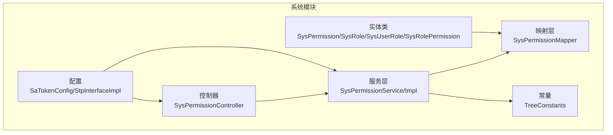
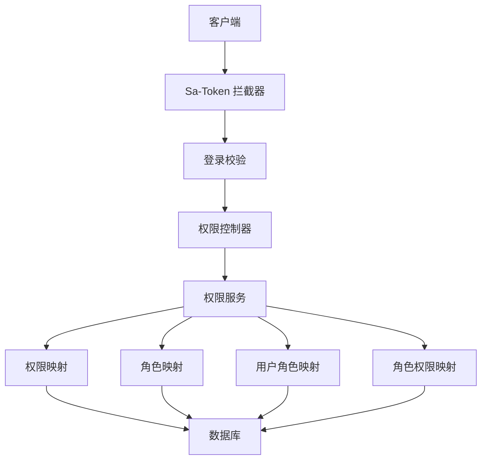
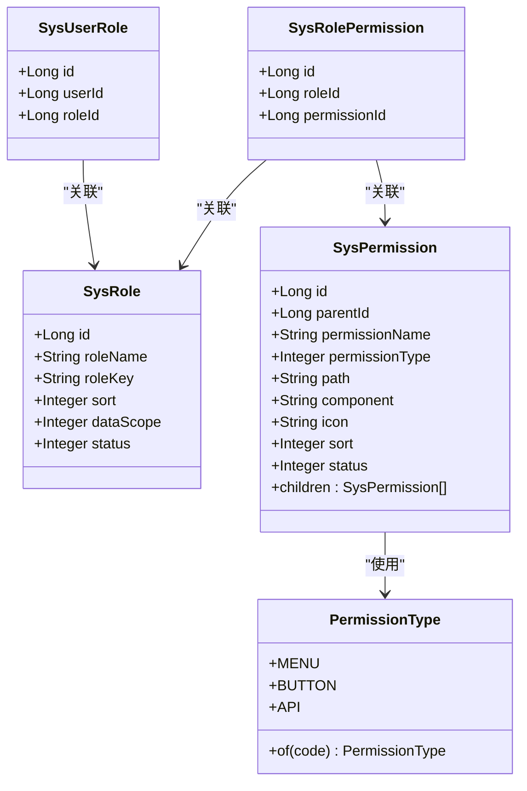
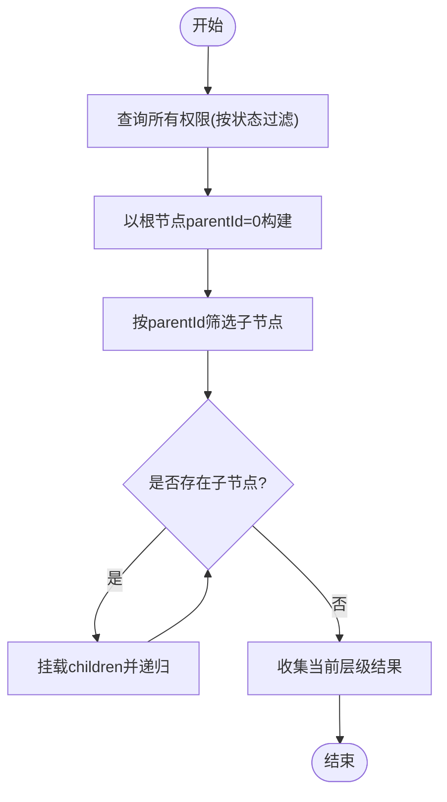
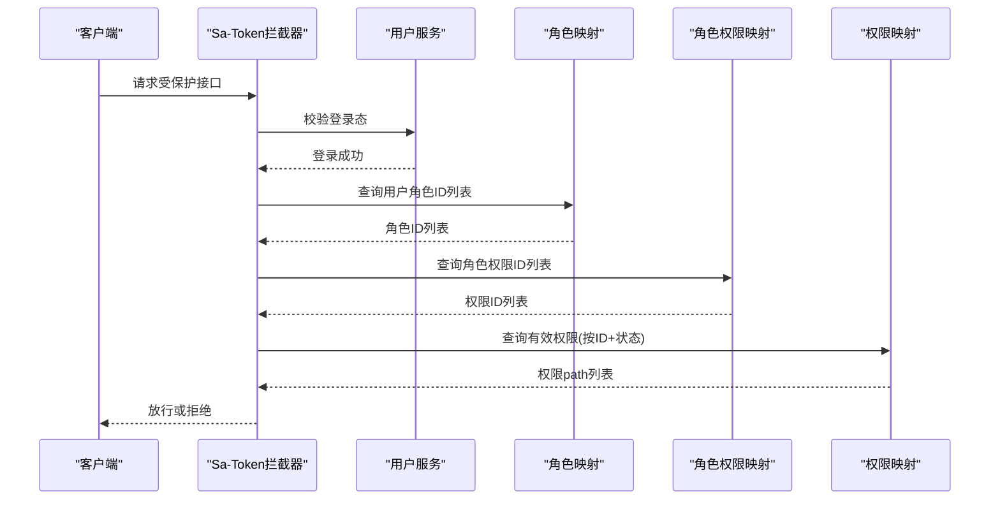
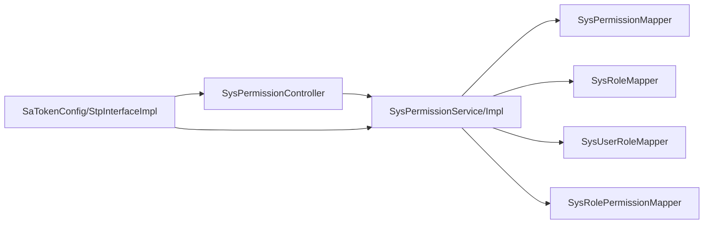

# 权限管理

<cite>
**本文引用的文件**
- [SysPermission.java](file://oa-system/src/main/java/com/oa/admin/system/entity/SysPermission.java)
- [PermissionType.java](file://oa-system/src/main/java/com/oa/admin/system/enums/PermissionType.java)
- [SysPermissionController.java](file://oa-system/src/main/java/com/oa/admin/system/controller/SysPermissionController.java)
- [SysPermissionService.java](file://oa-system/src/main/java/com/oa/admin/system/service/SysPermissionService.java)
- [SysPermissionServiceImpl.java](file://oa-system/src/main/java/com/oa/admin/system/service/impl/SysPermissionServiceImpl.java)
- [SysPermissionMapper.java](file://oa-system/src/main/java/com/oa/admin/system/mapper/SysPermissionMapper.java)
- [TreeConstants.java](file://oa-common/src/main/java/com/oa/admin/common/constant/TreeConstants.java)
- [SysRolePermission.java](file://oa-system/src/main/java/com/oa/admin/system/entity/SysRolePermission.java)
- [SysUserRole.java](file://oa-system/src/main/java/com/oa/admin/system/entity/SysUserRole.java)
- [SysRole.java](file://oa-system/src/main/java/com/oa/admin/system/entity/SysRole.java)
- [SysRoleMapper.java](file://oa-system/src/main/java/com/oa/admin/system/mapper/SysRoleMapper.java)
- [SysRolePermissionMapper.java](file://oa-system/src/main/java/com/oa/admin/system/mapper/SysRolePermissionMapper.java)
- [SysUserRoleMapper.java](file://oa-system/src/main/java/com/oa/admin/system/mapper/SysUserRoleMapper.java)
- [StpInterfaceImpl.java](file://oa-system/src/main/java/com/oa/admin/system/config/StpInterfaceImpl.java)
- [SaTokenConfig.java](file://oa-system/src/main/java/com/oa/admin/system/config/SaTokenConfig.java)
</cite>

## 目录
1. [简介](#简介)
2. [项目结构](#项目结构)
3. [核心组件](#核心组件)
4. [架构总览](#架构总览)
5. [详细组件分析](#详细组件分析)
6. [依赖分析](#依赖分析)
7. [性能考虑](#性能考虑)
8. [故障排查指南](#故障排查指南)
9. [结论](#结论)
10. [附录](#附录)

## 简介
本文件面向权限管理功能，系统性阐述基于三级权限树（菜单权限、按钮权限、API权限）的设计与实现。内容涵盖权限类型枚举、权限树构建、权限继承关系、权限验证机制、数据模型、角色关联、用户继承、以及权限缓存策略与最佳实践。同时提供API接口规范、权限注解使用方法、权限验证流程图与动态构建权限树的实现要点。

## 项目结构
权限管理模块位于 oa-system 子模块，围绕“权限-角色-用户”三层关系组织，采用 MyBatis-Plus 进行数据访问，结合 Sa-Token 实现统一鉴权拦截与权限校验。

图表来源
- [SysPermissionController.java:1-63](file://oa-system/src/main/java/com/oa/admin/system/controller/SysPermissionController.java#L1-L63)
- [SysPermissionService.java:1-17](file://oa-system/src/main/java/com/oa/admin/system/service/SysPermissionService.java#L1-L17)
- [SysPermissionServiceImpl.java:1-41](file://oa-system/src/main/java/com/oa/admin/system/service/impl/SysPermissionServiceImpl.java#L1-L41)
- [SysPermissionMapper.java:1-13](file://oa-system/src/main/java/com/oa/admin/system/mapper/SysPermissionMapper.java#L1-L13)
- [TreeConstants.java:1-12](file://oa-common/src/main/java/com/oa/admin/common/constant/TreeConstants.java#L1-L12)
- [StpInterfaceImpl.java:1-75](file://oa-system/src/main/java/com/oa/admin/system/config/StpInterfaceImpl.java#L1-L75)
- [SaTokenConfig.java:1-25](file://oa-system/src/main/java/com/oa/admin/system/config/SaTokenConfig.java#L1-L25)

章节来源
- [SysPermissionController.java:1-63](file://oa-system/src/main/java/com/oa/admin/system/controller/SysPermissionController.java#L1-L63)
- [SysPermissionService.java:1-17](file://oa-system/src/main/java/com/oa/admin/system/service/SysPermissionService.java#L1-L17)
- [SysPermissionServiceImpl.java:1-41](file://oa-system/src/main/java/com/oa/admin/system/service/impl/SysPermissionServiceImpl.java#L1-L41)
- [SysPermissionMapper.java:1-13](file://oa-system/src/main/java/com/oa/admin/system/mapper/SysPermissionMapper.java#L1-L13)
- [TreeConstants.java:1-12](file://oa-common/src/main/java/com/oa/admin/common/constant/TreeConstants.java#L1-L12)
- [StpInterfaceImpl.java:1-75](file://oa-system/src/main/java/com/oa/admin/system/config/StpInterfaceImpl.java#L1-L75)
- [SaTokenConfig.java:1-25](file://oa-system/src/main/java/com/oa/admin/system/config/SaTokenConfig.java#L1-L25)

## 核心组件
- 权限实体与类型：SysPermission 定义权限节点字段；PermissionType 提供菜单/按钮/API 的枚举值。
- 权限树构建：通过 Service 层对全量权限按 parentId 组织为树形结构，根节点由 TreeConstants.ROOT_PARENT_ID 指定。
- 角色与用户：SysRole、SysUserRole、SysRolePermission 构成角色-权限-用户的多对多关系。
- 鉴权集成：SaTokenConfig 注册全局拦截器；StpInterfaceImpl 将用户角色映射为权限集合（以 path 表达）。

章节来源
- [SysPermission.java:1-35](file://oa-system/src/main/java/com/oa/admin/system/entity/SysPermission.java#L1-L35)
- [PermissionType.java:1-27](file://oa-system/src/main/java/com/oa/admin/system/enums/PermissionType.java#L1-L27)
- [SysPermissionService.java:1-17](file://oa-system/src/main/java/com/oa/admin/system/service/SysPermissionService.java#L1-L17)
- [SysPermissionServiceImpl.java:1-41](file://oa-system/src/main/java/com/oa/admin/system/service/impl/SysPermissionServiceImpl.java#L1-L41)
- [TreeConstants.java:1-12](file://oa-common/src/main/java/com/oa/admin/common/constant/TreeConstants.java#L1-L12)
- [SysRole.java:1-26](file://oa-system/src/main/java/com/oa/admin/system/entity/SysRole.java#L1-L26)
- [SysUserRole.java:1-19](file://oa-system/src/main/java/com/oa/admin/system/entity/SysUserRole.java#L1-L19)
- [SysRolePermission.java:1-19](file://oa-system/src/main/java/com/oa/admin/system/entity/SysRolePermission.java#L1-L19)
- [SaTokenConfig.java:1-25](file://oa-system/src/main/java/com/oa/admin/system/config/SaTokenConfig.java#L1-L25)
- [StpInterfaceImpl.java:1-75](file://oa-system/src/main/java/com/oa/admin/system/config/StpInterfaceImpl.java#L1-L75)

## 架构总览
权限管理采用“控制器-服务-数据访问-鉴权”的分层架构，权限树在服务层构建，鉴权在 Sa-Token 中间件中完成，权限路径以字符串形式存储于 path 字段，便于快速匹配。

图表来源
- [SaTokenConfig.java:1-25](file://oa-system/src/main/java/com/oa/admin/system/config/SaTokenConfig.java#L1-L25)
- [StpInterfaceImpl.java:1-75](file://oa-system/src/main/java/com/oa/admin/system/config/StpInterfaceImpl.java#L1-L75)
- [SysPermissionController.java:1-63](file://oa-system/src/main/java/com/oa/admin/system/controller/SysPermissionController.java#L1-L63)
- [SysPermissionService.java:1-17](file://oa-system/src/main/java/com/oa/admin/system/service/SysPermissionService.java#L1-L17)
- [SysPermissionMapper.java:1-13](file://oa-system/src/main/java/com/oa/admin/system/mapper/SysPermissionMapper.java#L1-L13)
- [SysRoleMapper.java:1-13](file://oa-system/src/main/java/com/oa/admin/system/mapper/SysRoleMapper.java#L1-L13)
- [SysUserRoleMapper.java:1-13](file://oa-system/src/main/java/com/oa/admin/system/mapper/SysUserRoleMapper.java#L1-L13)
- [SysRolePermissionMapper.java:1-13](file://oa-system/src/main/java/com/oa/admin/system/mapper/SysRolePermissionMapper.java#L1-L13)

## 详细组件分析

### 数据模型与权限类型
- 权限类型枚举：定义三类权限类型，分别对应菜单、按钮与 API。
- 权限实体：包含父节点、名称、类型、前端路由 path、组件、图标、排序、状态及子节点列表，支持树形渲染。
- 角色实体：包含角色名、角色键、数据范围（全部/部门/自定义）、排序与状态。
- 关联实体：用户-角色、角色-权限均为中间表，支持多对多扩展。

图表来源
- [SysPermission.java:1-35](file://oa-system/src/main/java/com/oa/admin/system/entity/SysPermission.java#L1-L35)
- [PermissionType.java:1-27](file://oa-system/src/main/java/com/oa/admin/system/enums/PermissionType.java#L1-L27)
- [SysRole.java:1-26](file://oa-system/src/main/java/com/oa/admin/system/entity/SysRole.java#L1-L26)
- [SysUserRole.java:1-19](file://oa-system/src/main/java/com/oa/admin/system/entity/SysUserRole.java#L1-L19)
- [SysRolePermission.java:1-19](file://oa-system/src/main/java/com/oa/admin/system/entity/SysRolePermission.java#L1-L19)

章节来源
- [SysPermission.java:1-35](file://oa-system/src/main/java/com/oa/admin/system/entity/SysPermission.java#L1-L35)
- [PermissionType.java:1-27](file://oa-system/src/main/java/com/oa/admin/system/enums/PermissionType.java#L1-L27)
- [SysRole.java:1-26](file://oa-system/src/main/java/com/oa/admin/system/entity/SysRole.java#L1-L26)
- [SysUserRole.java:1-19](file://oa-system/src/main/java/com/oa/admin/system/entity/SysUserRole.java#L1-L19)
- [SysRolePermission.java:1-19](file://oa-system/src/main/java/com/oa/admin/system/entity/SysRolePermission.java#L1-L19)

### 权限树结构与构建
- 全量查询：按状态过滤并按排序字段升序排列。
- 树构建：以 ROOT_PARENT_ID 为根，递归筛选 parentId 匹配的节点并挂载 children。
- 前端消费：返回的树形结构可直接用于菜单渲染与权限树展示。

图表来源
- [SysPermissionServiceImpl.java:28-39](file://oa-system/src/main/java/com/oa/admin/system/service/impl/SysPermissionServiceImpl.java#L28-L39)
- [TreeConstants.java:6-7](file://oa-common/src/main/java/com/oa/admin/common/constant/TreeConstants.java#L6-L7)

章节来源
- [SysPermissionService.java:11-16](file://oa-system/src/main/java/com/oa/admin/system/service/SysPermissionService.java#L11-L16)
- [SysPermissionServiceImpl.java:28-39](file://oa-system/src/main/java/com/oa/admin/system/service/impl/SysPermissionServiceImpl.java#L28-L39)
- [TreeConstants.java:6-7](file://oa-common/src/main/java/com/oa/admin/common/constant/TreeConstants.java#L6-L7)

### 权限继承与验证机制
- 用户-角色-权限链路：用户通过 SysUserRole 获取角色列表，再通过 SysRolePermission 获取权限 ID 列表，最后通过 SysPermission 查询有效权限并取其 path。
- Sa-Token 集成：全局拦截器对 /api/v1/** 路径进行登录校验；权限校验通过 StpInterfaceImpl.getPermissionList 返回的 path 列表进行匹配。
- 权限类型与路径：API 权限以 path 字符串表达，适合细粒度匹配；菜单/按钮权限同样以 path 表达，便于前端路由与按钮显隐控制。

图表来源
- [SaTokenConfig.java:16-22](file://oa-system/src/main/java/com/oa/admin/system/config/SaTokenConfig.java#L16-L22)
- [StpInterfaceImpl.java:33-52](file://oa-system/src/main/java/com/oa/admin/system/config/StpInterfaceImpl.java#L33-L52)
- [SysUserRoleMapper.java:1-13](file://oa-system/src/main/java/com/oa/admin/system/mapper/SysUserRoleMapper.java#L1-L13)
- [SysRolePermissionMapper.java:1-13](file://oa-system/src/main/java/com/oa/admin/system/mapper/SysRolePermissionMapper.java#L1-L13)
- [SysPermissionMapper.java:1-13](file://oa-system/src/main/java/com/oa/admin/system/mapper/SysPermissionMapper.java#L1-L13)

章节来源
- [StpInterfaceImpl.java:33-73](file://oa-system/src/main/java/com/oa/admin/system/config/StpInterfaceImpl.java#L33-L73)
- [SaTokenConfig.java:16-22](file://oa-system/src/main/java/com/oa/admin/system/config/SaTokenConfig.java#L16-L22)

### API 接口规范
- 权限树查询
  - 方法与路径：GET /api/v1/system/permission/tree
  - 权限注解：@SaCheckPermission("system:permission:list")
  - 参数：status（可选）
  - 返回：权限树（List<SysPermission>），children 字段承载子节点
- 权限列表
  - 方法与路径：GET /api/v1/system/permission
  - 权限注解：@SaCheckPermission("system:permission:list")
  - 参数：status（可选）
  - 返回：按排序的权限列表
- 单条权限
  - 方法与路径：GET /api/v1/system/permission/{id}
  - 权限注解：@SaCheckPermission("system:permission:query")
  - 返回：单个权限对象
- 新增权限
  - 方法与路径：POST /api/v1/system/permission
  - 权限注解：@SaCheckPermission("system:permission:add")
  - 返回：新增权限对象
- 更新权限
  - 方法与路径：PUT /api/v1/system/permission/{id}
  - 权限注解：@SaCheckPermission("system:permission:edit")
  - 返回：更新后的权限对象
- 删除权限
  - 方法与路径：DELETE /api/v1/system/permission/{id}
  - 权限注解：@SaCheckPermission("system:permission:remove")
  - 返回：空响应

章节来源
- [SysPermissionController.java:21-61](file://oa-system/src/main/java/com/oa/admin/system/controller/SysPermissionController.java#L21-L61)

### 权限注解与使用方法
- 登录拦截：通过 SaTokenConfig 注册 SaInterceptor，对 /api/v1/** 路径进行登录态校验，默认排除登录/注册接口。
- 权限校验：在控制器方法上使用 @SaCheckPermission 指定权限标识，如 "system:permission:list"，框架自动根据当前用户权限集合进行匹配。
- 自定义权限解析：StpInterfaceImpl.getPermissionList 返回的是权限 path 列表，因此 API 权限需以 path 字符串表达，便于精确匹配。

章节来源
- [SaTokenConfig.java:16-22](file://oa-system/src/main/java/com/oa/admin/system/config/SaTokenConfig.java#L16-L22)
- [SysPermissionController.java:22-58](file://oa-system/src/main/java/com/oa/admin/system/controller/SysPermissionController.java#L22-L58)
- [StpInterfaceImpl.java:33-52](file://oa-system/src/main/java/com/oa/admin/system/config/StpInterfaceImpl.java#L33-L52)

### 权限与角色、用户的继承关系
- 用户-角色：SysUserRole 记录用户与角色的绑定关系。
- 角色-权限：SysRolePermission 记录角色与权限的绑定关系。
- 权限继承：用户通过角色间接获得权限；角色可叠加多个权限，形成权限集合。
- 数据范围：角色实体包含 dataScope 字段，用于控制数据级权限（全部/部门/自定义），可在业务层结合权限 path 使用。

章节来源
- [SysUserRole.java:1-19](file://oa-system/src/main/java/com/oa/admin/system/entity/SysUserRole.java#L1-L19)
- [SysRolePermission.java:1-19](file://oa-system/src/main/java/com/oa/admin/system/entity/SysRolePermission.java#L1-L19)
- [SysRole.java:22-23](file://oa-system/src/main/java/com/oa/admin/system/entity/SysRole.java#L22-L23)

### 权限缓存策略
- 当前实现未见显式缓存层，鉴权时会实时查询用户角色与权限映射并回放权限 path。
- 性能建议：
  - 在 StpInterfaceImpl 中引入短期缓存（如基于用户ID的本地缓存或Redis缓存），减少重复查询。
  - 缓存失效策略：用户角色变更、角色权限变更、权限状态变更时主动失效。
  - 对高频接口可考虑在网关层做轻量缓存或预热。

[本节为通用优化建议，不涉及具体文件实现]

## 依赖分析
权限管理模块内部耦合清晰，职责分离明确：控制器仅负责参数与返回封装；服务层承担业务逻辑与树构建；映射层负责数据持久化；鉴权配置贯穿请求生命周期。

图表来源
- [SysPermissionController.java:1-63](file://oa-system/src/main/java/com/oa/admin/system/controller/SysPermissionController.java#L1-L63)
- [SysPermissionService.java:1-17](file://oa-system/src/main/java/com/oa/admin/system/service/SysPermissionService.java#L1-L17)
- [SysPermissionServiceImpl.java:1-41](file://oa-system/src/main/java/com/oa/admin/system/service/impl/SysPermissionServiceImpl.java#L1-L41)
- [SysPermissionMapper.java:1-13](file://oa-system/src/main/java/com/oa/admin/system/mapper/SysPermissionMapper.java#L1-L13)
- [SysRoleMapper.java:1-13](file://oa-system/src/main/java/com/oa/admin/system/mapper/SysRoleMapper.java#L1-L13)
- [SysUserRoleMapper.java:1-13](file://oa-system/src/main/java/com/oa/admin/system/mapper/SysUserRoleMapper.java#L1-L13)
- [SysRolePermissionMapper.java:1-13](file://oa-system/src/main/java/com/oa/admin/system/mapper/SysRolePermissionMapper.java#L1-L13)
- [SaTokenConfig.java:1-25](file://oa-system/src/main/java/com/oa/admin/system/config/SaTokenConfig.java#L1-L25)
- [StpInterfaceImpl.java:1-75](file://oa-system/src/main/java/com/oa/admin/system/config/StpInterfaceImpl.java#L1-L75)

章节来源
- [SysPermissionController.java:1-63](file://oa-system/src/main/java/com/oa/admin/system/controller/SysPermissionController.java#L1-L63)
- [SysPermissionService.java:1-17](file://oa-system/src/main/java/com/oa/admin/system/service/SysPermissionService.java#L1-L17)
- [SysPermissionServiceImpl.java:1-41](file://oa-system/src/main/java/com/oa/admin/system/service/impl/SysPermissionServiceImpl.java#L1-L41)
- [SysPermissionMapper.java:1-13](file://oa-system/src/main/java/com/oa/admin/system/mapper/SysPermissionMapper.java#L1-L13)
- [SysRoleMapper.java:1-13](file://oa-system/src/main/java/com/oa/admin/system/mapper/SysRoleMapper.java#L1-L13)
- [SysUserRoleMapper.java:1-13](file://oa-system/src/main/java/com/oa/admin/system/mapper/SysUserRoleMapper.java#L1-L13)
- [SysRolePermissionMapper.java:1-13](file://oa-system/src/main/java/com/oa/admin/system/mapper/SysRolePermissionMapper.java#L1-L13)
- [SaTokenConfig.java:1-25](file://oa-system/src/main/java/com/oa/admin/system/config/SaTokenConfig.java#L1-L25)
- [StpInterfaceImpl.java:1-75](file://oa-system/src/main/java/com/oa/admin/system/config/StpInterfaceImpl.java#L1-L75)

## 性能考虑
- 树构建复杂度：O(n) 线性扫描 + 递归筛选，n 为权限总数；若权限层级较深且数量较大，建议在服务层增加内存缓存。
- 鉴权查询：每次请求均需查询用户角色与权限映射，建议引入短期缓存与失效策略。
- 分页与过滤：列表查询已支持按状态过滤与排序，建议在大数据量场景下增加分页参数。
- 并发与一致性：缓存与数据库写入需保证最终一致，推荐使用分布式锁或消息队列保障缓存一致性。

[本节为通用性能建议，不涉及具体文件实现]

## 故障排查指南
- 登录后仍提示无权限
  - 检查 SaTokenConfig 是否正确注册拦截器并排除登录接口。
  - 检查 StpInterfaceImpl.getPermissionList 返回的 path 列表是否包含目标权限。
- 权限树为空或异常
  - 检查 TreeConstants.ROOT_PARENT_ID 是否与数据一致。
  - 检查 SysPermissionServiceImpl.buildTree 的筛选条件与 parentId 关系。
- API 无法访问
  - 检查控制器方法上的 @SaCheckPermission 注解是否正确配置。
  - 确认权限实体的 path 字段是否正确设置，且状态为有效。

章节来源
- [SaTokenConfig.java:16-22](file://oa-system/src/main/java/com/oa/admin/system/config/SaTokenConfig.java#L16-L22)
- [StpInterfaceImpl.java:33-52](file://oa-system/src/main/java/com/oa/admin/system/config/StpInterfaceImpl.java#L33-L52)
- [SysPermissionServiceImpl.java:34-39](file://oa-system/src/main/java/com/oa/admin/system/service/impl/SysPermissionServiceImpl.java#L34-L39)

## 结论
该权限管理方案以清晰的数据模型与分层架构为基础，通过 Sa-Token 实现统一鉴权，配合服务层的树形构建与角色-权限映射，实现了菜单、按钮与 API 的三级权限控制。建议在生产环境中引入权限缓存与失效策略，以提升性能与一致性。

## 附录
- 最佳实践
  - 权限标识设计：采用冒号分隔的层级命名（如 system:user:list），便于前端与后端统一识别。
  - API 权限路径：统一使用 path 字段表达，确保与前端路由一致。
  - 角色数据范围：合理使用 dataScope 控制数据可见性，避免越权访问。
  - 缓存策略：短期缓存 + 失效事件，保证权限变更的及时生效。
  - 安全加固：对敏感接口增加更严格的权限注解与参数校验。

[本节为通用最佳实践建议，不涉及具体文件实现]