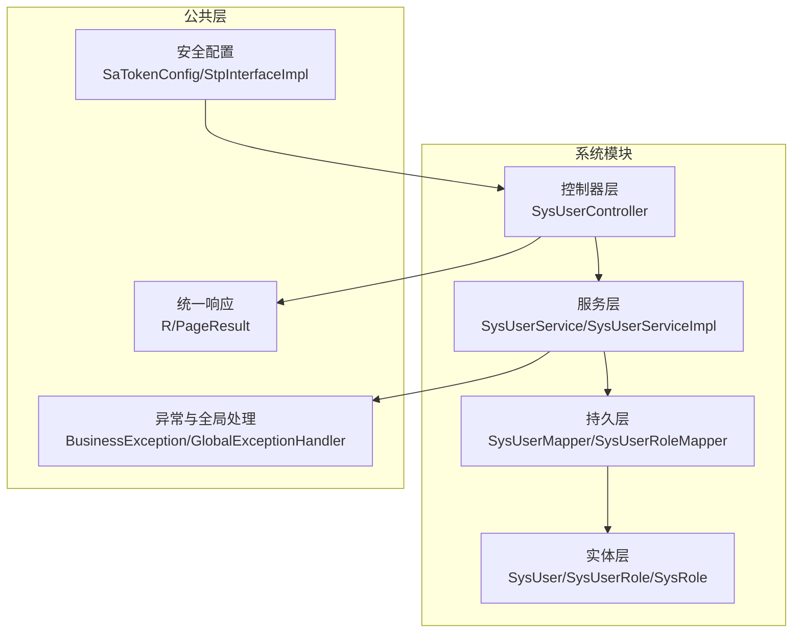
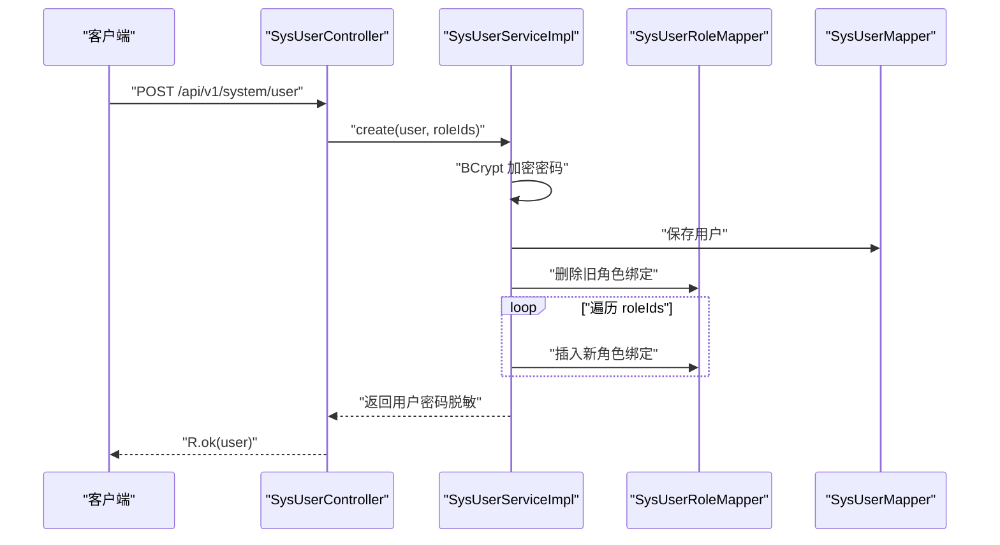
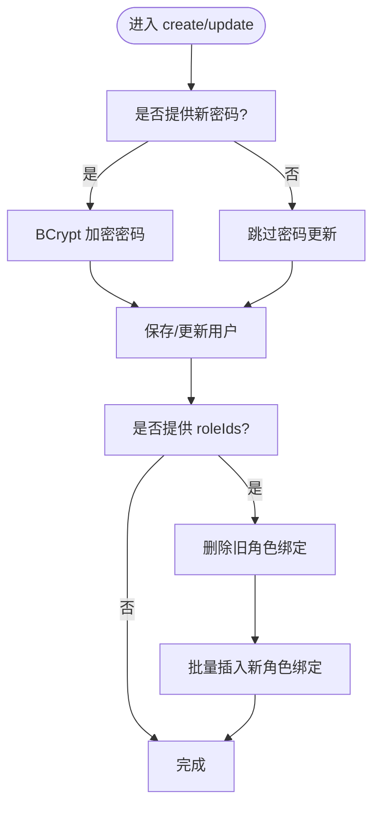
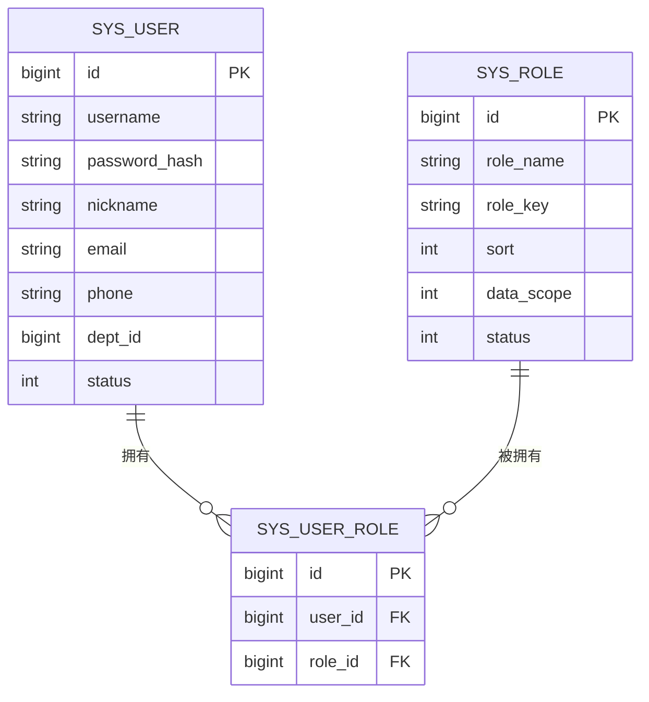
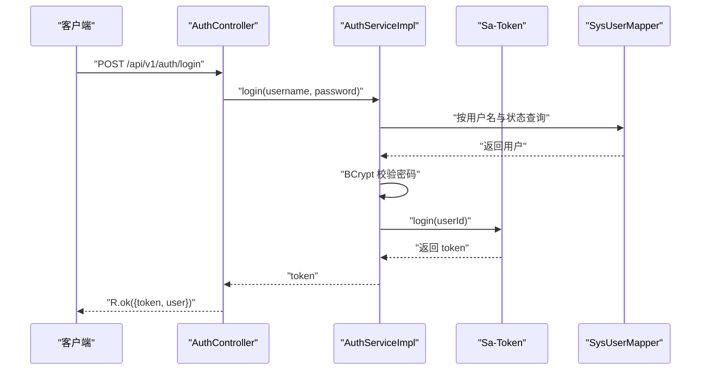
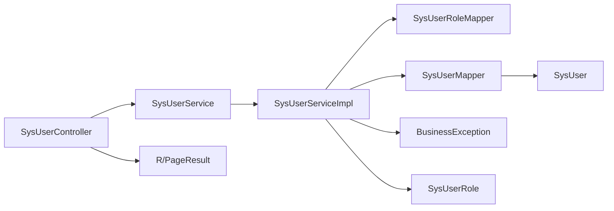

# 用户管理

<cite>
**本文引用的文件**
- [SysUserController.java](file://oa-system/src/main/java/com/oa/admin/system/controller/SysUserController.java)
- [SysUserService.java](file://oa-system/src/main/java/com/oa/admin/system/service/SysUserService.java)
- [SysUserServiceImpl.java](file://oa-system/src/main/java/com/oa/admin/system/service/impl/SysUserServiceImpl.java)
- [SysUser.java](file://oa-system/src/main/java/com/oa/admin/system/entity/SysUser.java)
- [SysUserRole.java](file://oa-system/src/main/java/com/oa/admin/system/entity/SysUserRole.java)
- [SysUserRoleMapper.java](file://oa-system/src/main/java/com/oa/admin/system/mapper/SysUserRoleMapper.java)
- [SysUserMapper.java](file://oa-system/src/main/java/com/oa/admin/system/mapper/SysUserMapper.java)
- [BaseEntity.java](file://oa-common/src/main/java/com/oa/admin/common/entity/BaseEntity.java)
- [R.java](file://oa-common/src/main/java/com/oa/admin/common/result/R.java)
- [PageResult.java](file://oa-common/src/main/java/com/oa/admin/common/result/PageResult.java)
- [ErrorCode.java](file://oa-common/src/main/java/com/oa/admin/common/result/ErrorCode.java)
- [BusinessException.java](file://oa-common/src/main/java/com/oa/admin/common/exception/BusinessException.java)
- [GlobalExceptionHandler.java](file://oa-common/src/main/java/com/oa/admin/common/exception/GlobalExceptionHandler.java)
- [SaTokenConfig.java](file://oa-system/src/main/java/com/oa/admin/system/config/SaTokenConfig.java)
- [StpInterfaceImpl.java](file://oa-system/src/main/java/com/oa/admin/system/config/StpInterfaceImpl.java)
- [AuthController.java](file://oa-system/src/main/java/com/oa/admin/system/controller/AuthController.java)
- [AuthServiceImpl.java](file://oa-system/src/main/java/com/oa/admin/system/service/impl/AuthServiceImpl.java)
</cite>

## 目录
1. [简介](#简介)
2. [项目结构](#项目结构)
3. [核心组件](#核心组件)
4. [架构总览](#架构总览)
5. [详细组件分析](#详细组件分析)
6. [依赖分析](#依赖分析)
7. [性能考虑](#性能考虑)
8. [故障排查指南](#故障排查指南)
9. [结论](#结论)
10. [附录：API 接口规范与最佳实践](#附录api-接口规范与最佳实践)

## 简介
本文件面向“用户管理”功能，系统性梳理用户 CRUD 的完整实现，覆盖以下能力：
- 用户列表查询（分页、筛选）
- 用户详情获取（脱敏返回）
- 用户创建（密码加密、角色绑定）
- 用户更新（可选密码更新、角色重绑）
- 用户删除（软删/物理删由后端策略决定）

同时，文档详细说明：
- 用户实体模型设计与字段含义
- 数据验证与安全处理（密码加密、敏感信息脱敏）
- 角色关联机制（多对多中间表）
- 权限控制注解使用（基于 Sa-Token）
- 业务逻辑处理流程与错误处理机制
- 完整的 API 接口规范（HTTP 方法、路径、请求参数、响应格式）
- 实际开发中的最佳实践与常见问题解决方案

## 项目结构
用户管理模块位于 oa-system 子模块中，采用典型的分层架构：
- 控制器层：负责接收请求、鉴权与返回统一响应包装
- 服务层：封装业务逻辑（分页查询、创建/更新、角色分配）
- 持久层：MyBatis-Plus Mapper 负责数据库访问
- 实体层：用户、角色、用户-角色中间表等
- 公共层：统一响应包装、分页结果、异常与全局异常处理

图表来源
- [SysUserController.java:17-84](file://oa-system/src/main/java/com/oa/admin/system/controller/SysUserController.java#L17-L84)
- [SysUserServiceImpl.java:22-72](file://oa-system/src/main/java/com/oa/admin/system/service/impl/SysUserServiceImpl.java#L22-L72)
- [SysUserMapper.java:10-12](file://oa-system/src/main/java/com/oa/admin/system/mapper/SysUserMapper.java#L10-L12)
- [SysUserRoleMapper.java:10-12](file://oa-system/src/main/java/com/oa/admin/system/mapper/SysUserRoleMapper.java#L10-L12)
- [SysUser.java:13-26](file://oa-system/src/main/java/com/oa/admin/system/entity/SysUser.java#L13-L26)
- [SysUserRole.java:11-18](file://oa-system/src/main/java/com/oa/admin/system/entity/SysUserRole.java#L11-L18)
- [R.java](file://oa-common/src/main/java/com/oa/admin/common/result/R.java)
- [PageResult.java](file://oa-common/src/main/java/com/oa/admin/common/result/PageResult.java)
- [BusinessException.java](file://oa-common/src/main/java/com/oa/admin/common/exception/BusinessException.java)
- [GlobalExceptionHandler.java](file://oa-common/src/main/java/com/oa/admin/common/exception/GlobalExceptionHandler.java)
- [SaTokenConfig.java](file://oa-system/src/main/java/com/oa/admin/system/config/SaTokenConfig.java)
- [StpInterfaceImpl.java](file://oa-system/src/main/java/com/oa/admin/system/config/StpInterfaceImpl.java)

章节来源
- [SysUserController.java:17-84](file://oa-system/src/main/java/com/oa/admin/system/controller/SysUserController.java#L17-L84)
- [SysUserServiceImpl.java:22-72](file://oa-system/src/main/java/com/oa/admin/system/service/impl/SysUserServiceImpl.java#L22-L72)
- [SysUser.java:13-26](file://oa-system/src/main/java/com/oa/admin/system/entity/SysUser.java#L13-L26)
- [SysUserRole.java:11-18](file://oa-system/src/main/java/com/oa/admin/system/entity/SysUserRole.java#L11-L18)
- [SysUserMapper.java:10-12](file://oa-system/src/main/java/com/oa/admin/system/mapper/SysUserMapper.java#L10-L12)
- [SysUserRoleMapper.java:10-12](file://oa-system/src/main/java/com/oa/admin/system/mapper/SysUserRoleMapper.java#L10-L12)
- [R.java](file://oa-common/src/main/java/com/oa/admin/common/result/R.java)
- [PageResult.java](file://oa-common/src/main/java/com/oa/admin/common/result/PageResult.java)
- [BusinessException.java](file://oa-common/src/main/java/com/oa/admin/common/exception/BusinessException.java)
- [GlobalExceptionHandler.java](file://oa-common/src/main/java/com/oa/admin/common/exception/GlobalExceptionHandler.java)
- [SaTokenConfig.java](file://oa-system/src/main/java/com/oa/admin/system/config/SaTokenConfig.java)
- [StpInterfaceImpl.java](file://oa-system/src/main/java/com/oa/admin/system/config/StpInterfaceImpl.java)

## 核心组件
- 控制器：SysUserController 提供 /api/v1/system/user 的完整 CRUD 接口，并通过 Sa-Token 注解进行权限校验。
- 服务：SysUserService 定义接口；SysUserServiceImpl 实现分页、创建、更新、角色分配等逻辑。
- 实体：SysUser 用户实体；SysUserRole 用户-角色中间表；SysRole 角色实体。
- 持久层：SysUserMapper、SysUserRoleMapper 基于 MyBatis-Plus。
- 统一响应：R<T> 包装成功/失败响应；PageResult 封装分页数据。
- 异常处理：BusinessException 自定义业务异常；GlobalExceptionHandler 统一转换。

章节来源
- [SysUserController.java:17-84](file://oa-system/src/main/java/com/oa/admin/system/controller/SysUserController.java#L17-L84)
- [SysUserService.java:12-19](file://oa-system/src/main/java/com/oa/admin/system/service/SysUserService.java#L12-L19)
- [SysUserServiceImpl.java:22-72](file://oa-system/src/main/java/com/oa/admin/system/service/impl/SysUserServiceImpl.java#L22-L72)
- [SysUser.java:13-26](file://oa-system/src/main/java/com/oa/admin/system/entity/SysUser.java#L13-L26)
- [SysUserRole.java:11-18](file://oa-system/src/main/java/com/oa/admin/system/entity/SysUserRole.java#L11-L18)
- [SysUserMapper.java:10-12](file://oa-system/src/main/java/com/oa/admin/system/mapper/SysUserMapper.java#L10-L12)
- [SysUserRoleMapper.java:10-12](file://oa-system/src/main/java/com/oa/admin/system/mapper/SysUserRoleMapper.java#L10-L12)
- [R.java](file://oa-common/src/main/java/com/oa/admin/common/result/R.java)
- [PageResult.java](file://oa-common/src/main/java/com/oa/admin/common/result/PageResult.java)
- [BusinessException.java](file://oa-common/src/main/java/com/oa/admin/common/exception/BusinessException.java)
- [GlobalExceptionHandler.java](file://oa-common/src/main/java/com/oa/admin/common/exception/GlobalExceptionHandler.java)

## 架构总览
用户管理遵循“控制器-服务-持久层-实体”的分层设计，配合 Sa-Token 进行权限控制与登录态管理，统一响应包装与异常处理。

图表来源
- [SysUserController.java:41-57](file://oa-system/src/main/java/com/oa/admin/system/controller/SysUserController.java#L41-L57)
- [SysUserServiceImpl.java:38-58](file://oa-system/src/main/java/com/oa/admin/system/service/impl/SysUserServiceImpl.java#L38-L58)
- [SysUserRoleMapper.java:10-12](file://oa-system/src/main/java/com/oa/admin/system/mapper/SysUserRoleMapper.java#L10-L12)
- [SysUserMapper.java:10-12](file://oa-system/src/main/java/com/oa/admin/system/mapper/SysUserMapper.java#L10-L12)

## 详细组件分析

### 控制器层：SysUserController
- 列表查询：GET /api/v1/system/user，支持按用户名模糊、状态精确过滤，分页参数 page/pageSize，默认每页 20 条。
- 详情获取：GET /api/v1/system/user/{id}，返回用户信息并脱敏密码字段。
- 创建用户：POST /api/v1/system/user，接收 username、nickname、password、email、phone、deptId、status、roleIds 等字段。
- 更新用户：PUT /api/v1/system/user/{id}，支持更新上述字段，密码为空则不更新。
- 删除用户：DELETE /api/v1/system/user/{id}。
- 权限注解：所有接口均使用 @SaCheckPermission 标注所需权限点，如 system:user:list、system:user:add、system:user:edit、system:user:remove。

章节来源
- [SysUserController.java:23-83](file://oa-system/src/main/java/com/oa/admin/system/controller/SysUserController.java#L23-L83)

### 服务层：SysUserService 与 SysUserServiceImpl
- 分页查询：根据条件构造查询包装器，按创建时间倒序，返回 PageResult 并对记录集合进行密码脱敏。
- 创建用户：对密码进行 BCrypt 加密，保存用户后清空密码，再调用角色分配逻辑。
- 更新用户：若提交了新密码则加密更新，否则保留原密码；更新用户信息后按需重新绑定角色。
- 角色分配：先删除旧的角色绑定，再批量插入新的角色绑定。

图表来源
- [SysUserServiceImpl.java:38-71](file://oa-system/src/main/java/com/oa/admin/system/service/impl/SysUserServiceImpl.java#L38-L71)

章节来源
- [SysUserService.java:12-19](file://oa-system/src/main/java/com/oa/admin/system/service/SysUserService.java#L12-L19)
- [SysUserServiceImpl.java:27-71](file://oa-system/src/main/java/com/oa/admin/system/service/impl/SysUserServiceImpl.java#L27-L71)

### 实体层与映射
- SysUser：用户主表，包含 id、username、passwordHash、nickname、email、phone、deptId、status 等字段，继承 BaseEntity。
- SysUserRole：用户-角色中间表，包含 id、userId、roleId。
- SysRole：角色表，包含 id、roleName、roleKey、sort、dataScope、status。
- Mapper：SysUserMapper、SysUserRoleMapper、SysRoleMapper 基于 MyBatis-Plus。

图表来源
- [SysUser.java:13-26](file://oa-system/src/main/java/com/oa/admin/system/entity/SysUser.java#L13-L26)
- [SysUserRole.java:11-18](file://oa-system/src/main/java/com/oa/admin/system/entity/SysUserRole.java#L11-L18)
- [SysRole.java:13-25](file://oa-system/src/main/java/com/oa/admin/system/entity/SysRole.java#L13-L25)

章节来源
- [SysUser.java:13-26](file://oa-system/src/main/java/com/oa/admin/system/entity/SysUser.java#L13-L26)
- [SysUserRole.java:11-18](file://oa-system/src/main/java/com/oa/admin/system/entity/SysUserRole.java#L11-L18)
- [SysRole.java:13-25](file://oa-system/src/main/java/com/oa/admin/system/entity/SysRole.java#L13-L25)
- [SysUserMapper.java:10-12](file://oa-system/src/main/java/com/oa/admin/system/mapper/SysUserMapper.java#L10-L12)
- [SysUserRoleMapper.java:10-12](file://oa-system/src/main/java/com/oa/admin/system/mapper/SysUserRoleMapper.java#L10-L12)
- [SysRoleMapper.java:10-12](file://oa-system/src/main/java/com/oa/admin/system/mapper/SysRoleMapper.java#L10-L12)

### 安全与权限控制
- 登录认证：AuthController 提供 /api/v1/auth/login、/api/v1/auth/logout、/api/v1/auth/me。
- 密码校验：AuthServiceImpl 使用 BCrypt 校验密码，仅激活状态用户可登录。
- 登录态：使用 Sa-Token 的 StpUtil.login 与 logout，StpInterfaceImpl 可扩展权限接口。
- 权限注解：SysUserController 所有接口使用 @SaCheckPermission 校验具体权限点。

图表来源
- [AuthController.java:20-36](file://oa-system/src/main/java/com/oa/admin/system/controller/AuthController.java#L20-L36)
- [AuthServiceImpl.java:23-51](file://oa-system/src/main/java/com/oa/admin/system/service/impl/AuthServiceImpl.java#L23-L51)
- [SaTokenConfig.java](file://oa-system/src/main/java/com/oa/admin/system/config/SaTokenConfig.java)
- [StpInterfaceImpl.java](file://oa-system/src/main/java/com/oa/admin/system/config/StpInterfaceImpl.java)

章节来源
- [AuthController.java:14-37](file://oa-system/src/main/java/com/oa/admin/system/controller/AuthController.java#L14-L37)
- [AuthServiceImpl.java:18-53](file://oa-system/src/main/java/com/oa/admin/system/service/impl/AuthServiceImpl.java#L18-L53)
- [SaTokenConfig.java](file://oa-system/src/main/java/com/oa/admin/system/config/SaTokenConfig.java)
- [StpInterfaceImpl.java](file://oa-system/src/main/java/com/oa/admin/system/config/StpInterfaceImpl.java)

## 依赖分析
- 控制器依赖服务接口与统一响应包装。
- 服务实现依赖 Mapper 与实体，事务性地处理用户与角色绑定。
- 实体继承 BaseEntity，统一审计字段。
- 异常体系由 BusinessException 与 GlobalExceptionHandler 支撑。

图表来源
- [SysUserController.java:17-84](file://oa-system/src/main/java/com/oa/admin/system/controller/SysUserController.java#L17-L84)
- [SysUserService.java:12-19](file://oa-system/src/main/java/com/oa/admin/system/service/SysUserService.java#L12-L19)
- [SysUserServiceImpl.java:22-72](file://oa-system/src/main/java/com/oa/admin/system/service/impl/SysUserServiceImpl.java#L22-L72)
- [SysUserMapper.java:10-12](file://oa-system/src/main/java/com/oa/admin/system/mapper/SysUserMapper.java#L10-L12)
- [SysUserRoleMapper.java:10-12](file://oa-system/src/main/java/com/oa/admin/system/mapper/SysUserRoleMapper.java#L10-L12)
- [SysUser.java:13-26](file://oa-system/src/main/java/com/oa/admin/system/entity/SysUser.java#L13-L26)
- [SysUserRole.java:11-18](file://oa-system/src/main/java/com/oa/admin/system/entity/SysUserRole.java#L11-L18)
- [R.java](file://oa-common/src/main/java/com/oa/admin/common/result/R.java)
- [PageResult.java](file://oa-common/src/main/java/com/oa/admin/common/result/PageResult.java)
- [BusinessException.java](file://oa-common/src/main/java/com/oa/admin/common/exception/BusinessException.java)

章节来源
- [SysUserController.java:17-84](file://oa-system/src/main/java/com/oa/admin/system/controller/SysUserController.java#L17-L84)
- [SysUserServiceImpl.java:22-72](file://oa-system/src/main/java/com/oa/admin/system/service/impl/SysUserServiceImpl.java#L22-L72)
- [SysUser.java:13-26](file://oa-system/src/main/java/com/oa/admin/system/entity/SysUser.java#L13-L26)
- [SysUserRole.java:11-18](file://oa-system/src/main/java/com/oa/admin/system/entity/SysUserRole.java#L11-L18)
- [R.java](file://oa-common/src/main/java/com/oa/admin/common/result/R.java)
- [PageResult.java](file://oa-common/src/main/java/com/oa/admin/common/result/PageResult.java)
- [BusinessException.java](file://oa-common/src/main/java/com/oa/admin/common/exception/BusinessException.java)

## 性能考虑
- 分页查询：默认每页 20 条，建议前端传入合理 page/pageSize，避免超大分页导致数据库压力。
- 密码加密：BCrypt 加密成本较高，建议批量导入或后台任务处理，避免高并发场景下的瞬时峰值。
- 角色绑定：删除旧绑定后再批量插入，注意 roleIds 较大时的批量插入性能，必要时使用批处理优化。
- 缓存策略：可对常用用户信息与角色权限进行缓存，降低重复查询开销。

## 故障排查指南
- 登录失败：检查用户名是否存在且状态为激活，确认密码是否正确，查看 BusinessException 对应的错误码。
- 权限不足：确认当前登录用户是否具备 system:user:* 权限点，检查 Sa-Token 的登录态与权限接口实现。
- 参数缺失：创建/更新接口要求的字段未传或类型不符，服务层会抛出业务异常，需在前端补齐。
- 数据库异常：角色绑定失败可能由于外键约束或重复主键，检查 sys_user_role 表索引与唯一性约束。

章节来源
- [AuthServiceImpl.java:23-51](file://oa-system/src/main/java/com/oa/admin/system/service/impl/AuthServiceImpl.java#L23-L51)
- [BusinessException.java](file://oa-common/src/main/java/com/oa/admin/common/exception/BusinessException.java)
- [GlobalExceptionHandler.java](file://oa-common/src/main/java/com/oa/admin/common/exception/GlobalExceptionHandler.java)

## 结论
用户管理模块以清晰的分层架构实现了完整的 CRUD 能力，结合 Sa-Token 的权限控制与统一响应包装，提供了良好的可维护性与安全性。通过密码加密、角色绑定与分页查询等关键特性，满足企业级用户管理需求。建议在生产环境中进一步完善参数校验、缓存与批量操作优化，确保高并发与大数据量场景下的稳定性。

## 附录：API 接口规范与最佳实践

### API 接口规范
- 获取用户列表
  - 方法：GET
  - 路径：/api/v1/system/user
  - 查询参数：
    - username：字符串，模糊匹配用户名
    - status：整数，精确匹配状态
    - page：整数，页码，默认 1
    - pageSize：整数，每页条数，默认 20
  - 响应：R<PageResult<SysUser>>
  - 权限：system:user:list

- 获取用户详情
  - 方法：GET
  - 路径：/api/v1/system/user/{id}
  - 路径参数：id（长整型）
  - 响应：R<SysUser>（密码字段已脱敏）
  - 权限：system:user:query

- 创建用户
  - 方法：POST
  - 路径：/api/v1/system/user
  - 请求体：Map<String,Object>
    - username：字符串
    - nickname：字符串
    - password：字符串（将被加密存储）
    - email：字符串
    - phone：字符串
    - deptId：长整型（部门 ID）
    - status：整数（状态）
    - roleIds：数组（角色 ID 列表）
  - 响应：R<SysUser>（密码字段已脱敏）
  - 权限：system:user:add

- 更新用户
  - 方法：PUT
  - 路径：/api/v1/system/user/{id}
  - 路径参数：id（长整型）
  - 请求体：Map<String,Object>
    - username、nickname、email、phone、deptId、status、roleIds 同上
    - password：可选，若提供则更新并加密
  - 响应：R<SysUser>（密码字段已脱敏）
  - 权限：system:user:edit

- 删除用户
  - 方法：DELETE
  - 路径：/api/v1/system/user/{id}
  - 路径参数：id（长整型）
  - 响应：R<Void>
  - 权限：system:user:remove

- 登录
  - 方法：POST
  - 路径：/api/v1/auth/login
  - 请求体：Map<String,String>
    - username：字符串
    - password：字符串
  - 响应：R<Map<String,Object>>（包含 token 与 user）

- 登出
  - 方法：POST
  - 路径：/api/v1/auth/logout
  - 响应：R<Void>

- 当前用户
  - 方法：GET
  - 路径：/api/v1/auth/me
  - 响应：R<SysUser>

章节来源
- [SysUserController.java:23-83](file://oa-system/src/main/java/com/oa/admin/system/controller/SysUserController.java#L23-L83)
- [AuthController.java:20-36](file://oa-system/src/main/java/com/oa/admin/system/controller/AuthController.java#L20-L36)

### 最佳实践
- 参数校验：在控制器层增加 DTO 与 JSR-303 校验，减少脏数据进入服务层。
- 密码安全：始终使用 BCrypt 加密存储；禁止明文或弱加密；提供强制修改密码策略。
- 角色管理：角色变更采用“先清后增”，保证一致性；对 roleIds 做去重与边界检查。
- 分页与排序：默认按创建时间倒序；提供更丰富的排序与过滤维度。
- 错误处理：统一使用 R 与 ErrorCode，前端友好提示；异常日志记录便于追踪。
- 权限设计：细化权限点，避免超级权限；定期审计权限分配。

### 常见问题与解决方案
- 无法登录：确认用户状态为激活，密码正确；检查 BCrypt 校验逻辑与数据库存储格式。
- 无权限访问：检查当前用户是否具备对应 system:user:* 权限；核对 Sa-Token 登录态。
- 密码未更新：更新接口若未传 password，则不会修改密码；需显式传入新密码。
- 角色未生效：确认 roleIds 是否为空或非法；检查中间表插入是否成功。