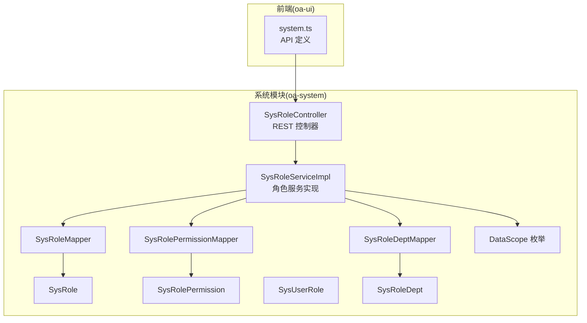
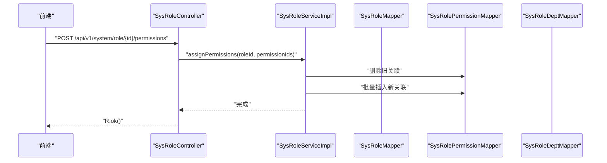
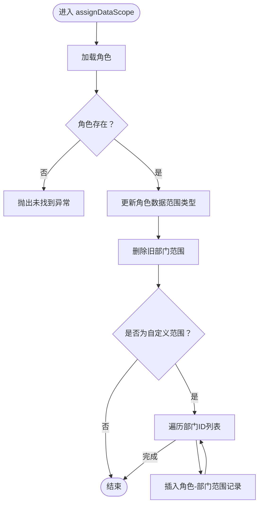
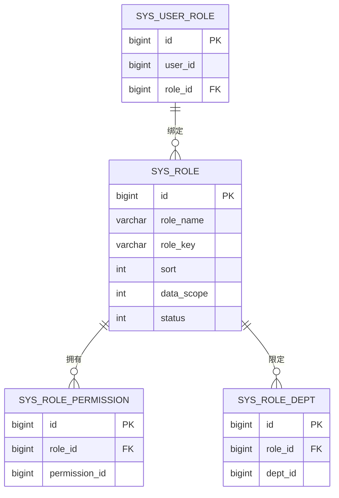
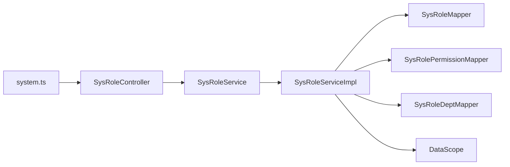

# 角色管理

<cite>
**本文引用的文件**
- [SysRoleController.java](file://oa-system/src/main/java/com/oa/admin/system/controller/SysRoleController.java)
- [SysRoleService.java](file://oa-system/src/main/java/com/oa/admin/system/service/SysRoleService.java)
- [SysRoleServiceImpl.java](file://oa-system/src/main/java/com/oa/admin/system/service/impl/SysRoleServiceImpl.java)
- [SysRole.java](file://oa-system/src/main/java/com/oa/admin/system/entity/SysRole.java)
- [SysRolePermission.java](file://oa-system/src/main/java/com/oa/admin/system/entity/SysRolePermission.java)
- [SysUserRole.java](file://oa-system/src/main/java/com/oa/admin/system/entity/SysUserRole.java)
- [SysRoleDept.java](file://oa-system/src/main/java/com/oa/admin/system/entity/SysRoleDept.java)
- [DataScope.java](file://oa-system/src/main/java/com/oa/admin/system/enums/DataScope.java)
- [SysRoleMapper.java](file://oa-system/src/main/java/com/oa/admin/system/mapper/SysRoleMapper.java)
- [SysRolePermissionMapper.java](file://oa-system/src/main/java/com/oa/admin/system/mapper/SysRolePermissionMapper.java)
- [SysRoleDeptMapper.java](file://oa-system/src/main/java/com/oa/admin/system/mapper/SysRoleDeptMapper.java)
- [system.ts](file://oa-ui/src/api/system.ts)
- [V1__init_sys_tables.sql](file://oa-app/src/main/resources/db/migration/V1__init_sys_tables.sql)
</cite>

## 目录
1. [简介](#简介)
2. [项目结构](#项目结构)
3. [核心组件](#核心组件)
4. [架构总览](#架构总览)
5. [详细组件分析](#详细组件分析)
6. [依赖分析](#依赖分析)
7. [性能考虑](#性能考虑)
8. [故障排查指南](#故障排查指南)
9. [结论](#结论)
10. [附录](#附录)

## 简介
本文件系统性阐述角色管理功能的完整实现，覆盖角色的增删改查（CRUD）、角色与权限的关联赋权、角色数据权限范围配置、角色与用户的绑定关系，以及前后端接口规范与权限控制策略。通过控制器、服务层、实体与映射层的协同，构建出可扩展的角色权限体系，支撑业务系统的安全访问控制。

## 项目结构
角色管理位于系统模块（oa-system）中，采用分层架构：控制器负责HTTP接口与权限注解；服务层封装业务逻辑；实体与映射层负责数据持久化；前端通过统一API模块调用后端接口。

**图表来源**
- [SysRoleController.java:1-78](file://oa-system/src/main/java/com/oa/admin/system/controller/SysRoleController.java#L1-L78)
- [SysRoleServiceImpl.java:1-79](file://oa-system/src/main/java/com/oa/admin/system/service/impl/SysRoleServiceImpl.java#L1-L79)
- [SysRole.java:1-26](file://oa-system/src/main/java/com/oa/admin/system/entity/SysRole.java#L1-L26)
- [SysRolePermission.java:1-19](file://oa-system/src/main/java/com/oa/admin/system/entity/SysRolePermission.java#L1-L19)
- [SysUserRole.java:1-19](file://oa-system/src/main/java/com/oa/admin/system/entity/SysUserRole.java#L1-L19)
- [SysRoleDept.java:1-19](file://oa-system/src/main/java/com/oa/admin/system/entity/SysRoleDept.java#L1-L19)
- [DataScope.java:1-27](file://oa-system/src/main/java/com/oa/admin/system/enums/DataScope.java#L1-L27)
- [system.ts:1-73](file://oa-ui/src/api/system.ts#L1-L73)

**章节来源**
- [SysRoleController.java:1-78](file://oa-system/src/main/java/com/oa/admin/system/controller/SysRoleController.java#L1-L78)
- [SysRoleServiceImpl.java:1-79](file://oa-system/src/main/java/com/oa/admin/system/service/impl/SysRoleServiceImpl.java#L1-L79)
- [system.ts:1-73](file://oa-ui/src/api/system.ts#L1-L73)

## 核心组件
- 控制器：提供角色列表、详情、创建、更新、删除、权限赋值、数据范围配置等接口，并通过权限注解进行访问控制。
- 服务层：实现分页查询、角色与权限的批量替换、角色数据范围与部门范围的配置。
- 实体与映射：角色主表、角色-权限关联表、角色-部门范围表、用户-角色关联表及数据范围枚举。
- 前端API：统一的角色与权限相关请求封装，便于页面组件调用。

**章节来源**
- [SysRoleController.java:23-76](file://oa-system/src/main/java/com/oa/admin/system/controller/SysRoleController.java#L23-L76)
- [SysRoleService.java:12-19](file://oa-system/src/main/java/com/oa/admin/system/service/SysRoleService.java#L12-L19)
- [SysRoleServiceImpl.java:32-77](file://oa-system/src/main/java/com/oa/admin/system/service/impl/SysRoleServiceImpl.java#L32-L77)
- [SysRole.java:16-25](file://oa-system/src/main/java/com/oa/admin/system/entity/SysRole.java#L16-L25)
- [SysRolePermission.java:11-18](file://oa-system/src/main/java/com/oa/admin/system/entity/SysRolePermission.java#L11-L18)
- [SysUserRole.java:11-18](file://oa-system/src/main/java/com/oa/admin/system/entity/SysUserRole.java#L11-L18)
- [SysRoleDept.java:11-18](file://oa-system/src/main/java/com/oa/admin/system/entity/SysRoleDept.java#L11-L18)
- [DataScope.java:11-26](file://oa-system/src/main/java/com/oa/admin/system/enums/DataScope.java#L11-L26)
- [system.ts:3-30](file://oa-ui/src/api/system.ts#L3-L30)

## 架构总览
角色管理遵循“控制器-服务-数据访问”的分层设计，结合MyBatis-Plus与Spring事务管理，确保数据一致性与可维护性。权限控制通过注解式鉴权在接口层生效，避免越权访问。

**图表来源**
- [SysRoleController.java:61-66](file://oa-system/src/main/java/com/oa/admin/system/controller/SysRoleController.java#L61-L66)
- [SysRoleServiceImpl.java:44-55](file://oa-system/src/main/java/com/oa/admin/system/service/impl/SysRoleServiceImpl.java#L44-L55)
- [SysRolePermissionMapper.java:10-12](file://oa-system/src/main/java/com/oa/admin/system/mapper/SysRolePermissionMapper.java#L10-L12)

## 详细组件分析

### 控制器层：SysRoleController
- 接口职责
  - 列表查询：支持按角色名模糊、状态过滤、分页排序。
  - 详情获取：按ID查询角色。
  - 创建角色：接收角色对象并保存。
  - 更新角色：按ID更新角色信息。
  - 删除角色：按ID删除角色。
  - 权限赋值：为角色批量赋予权限（替换式）。
  - 数据范围配置：设置角色数据范围类型与部门范围。
- 权限控制：所有写操作均标注对应权限点，读取类接口也限制到具备相应权限的用户。

**章节来源**
- [SysRoleController.java:23-76](file://oa-system/src/main/java/com/oa/admin/system/controller/SysRoleController.java#L23-L76)

### 服务层：SysRoleServiceImpl
- 分页查询：根据条件构造查询包装器，支持角色名模糊匹配、状态精确匹配与排序。
- 权限赋值：先清空旧关联，再批量插入新关联，保证赋值的原子性与一致性。
- 数据范围配置：更新角色的数据范围类型；当为自定义范围时，清空旧部门范围并批量插入新的部门范围。

**图表来源**
- [SysRoleServiceImpl.java:57-77](file://oa-system/src/main/java/com/oa/admin/system/service/impl/SysRoleServiceImpl.java#L57-L77)

**章节来源**
- [SysRoleServiceImpl.java:32-77](file://oa-system/src/main/java/com/oa/admin/system/service/impl/SysRoleServiceImpl.java#L32-L77)

### 实体模型与数据权限
- 角色实体（SysRole）
  - 字段：主键、角色名、角色键、排序、数据范围类型、状态。
  - 数据范围类型：全量、仅本部门、自定义部门集合。
- 角色-权限关联（SysRolePermission）
  - 多对多中间表，存储角色与权限的绑定关系。
- 角色-部门范围（SysRoleDept）
  - 当数据范围为自定义时，记录角色可访问的部门集合。
- 用户-角色关联（SysUserRole）
  - 记录用户与角色的绑定关系，用于权限继承与计算。

**图表来源**
- [SysRole.java:16-25](file://oa-system/src/main/java/com/oa/admin/system/entity/SysRole.java#L16-L25)
- [SysRolePermission.java:13-18](file://oa-system/src/main/java/com/oa/admin/system/entity/SysRolePermission.java#L13-L18)
- [SysRoleDept.java:13-18](file://oa-system/src/main/java/com/oa/admin/system/entity/SysRoleDept.java#L13-L18)
- [SysUserRole.java:13-18](file://oa-system/src/main/java/com/oa/admin/system/entity/SysUserRole.java#L13-L18)
- [V1__init_sys_tables.sql:33-86](file://oa-app/src/main/resources/db/migration/V1__init_sys_tables.sql#L33-L86)

**章节来源**
- [SysRole.java:16-25](file://oa-system/src/main/java/com/oa/admin/system/entity/SysRole.java#L16-L25)
- [SysRolePermission.java:13-18](file://oa-system/src/main/java/com/oa/admin/system/entity/SysRolePermission.java#L13-L18)
- [SysRoleDept.java:13-18](file://oa-system/src/main/java/com/oa/admin/system/entity/SysRoleDept.java#L13-L18)
- [SysUserRole.java:13-18](file://oa-system/src/main/java/com/oa/admin/system/entity/SysUserRole.java#L13-L18)
- [V1__init_sys_tables.sql:33-86](file://oa-app/src/main/resources/db/migration/V1__init_sys_tables.sql#L33-L86)

### 数据权限枚举：DataScope
- 枚举值：全量（1）、仅本部门（2）、自定义（3）。
- 提供从代码到枚举的转换方法，便于服务层判断与处理。

**章节来源**
- [DataScope.java:11-26](file://oa-system/src/main/java/com/oa/admin/system/enums/DataScope.java#L11-L26)

### 前端API：system.ts
- 角色相关接口：列表、详情、创建、更新、删除、权限赋值、数据范围配置。
- 权限树与列表、部门树与列表等辅助接口，支撑角色配置界面。

**章节来源**
- [system.ts:3-30](file://oa-ui/src/api/system.ts#L3-L30)

## 依赖分析
- 控制器依赖服务接口，服务实现依赖映射接口与实体。
- 服务层通过事务管理保证权限与部门范围的原子性更新。
- 前端API与后端控制器路径一一对应，便于联调与测试。

**图表来源**
- [SysRoleController.java:20-21](file://oa-system/src/main/java/com/oa/admin/system/controller/SysRoleController.java#L20-L21)
- [SysRoleService.java:12-19](file://oa-system/src/main/java/com/oa/admin/system/service/SysRoleService.java#L12-L19)
- [SysRoleServiceImpl.java:26-30](file://oa-system/src/main/java/com/oa/admin/system/service/impl/SysRoleServiceImpl.java#L26-L30)
- [SysRoleMapper.java:10-12](file://oa-system/src/main/java/com/oa/admin/system/mapper/SysRoleMapper.java#L10-L12)
- [SysRolePermissionMapper.java:10-12](file://oa-system/src/main/java/com/oa/admin/system/mapper/SysRolePermissionMapper.java#L10-L12)
- [SysRoleDeptMapper.java:10-12](file://oa-system/src/main/java/com/oa/admin/system/mapper/SysRoleDeptMapper.java#L10-L12)
- [DataScope.java:11-26](file://oa-system/src/main/java/com/oa/admin/system/enums/DataScope.java#L11-L26)
- [system.ts:3-30](file://oa-ui/src/api/system.ts#L3-L30)

**章节来源**
- [SysRoleController.java:20-21](file://oa-system/src/main/java/com/oa/admin/system/controller/SysRoleController.java#L20-L21)
- [SysRoleServiceImpl.java:26-30](file://oa-system/src/main/java/com/oa/admin/system/service/impl/SysRoleServiceImpl.java#L26-L30)
- [system.ts:3-30](file://oa-ui/src/api/system.ts#L3-L30)

## 性能考虑
- 分页查询：建议在角色名与状态字段建立索引，提升模糊匹配与过滤效率。
- 批量写入：权限与部门范围的批量插入建议使用批处理或合并SQL，减少往返次数。
- 缓存策略：角色与权限的静态映射可在应用启动时缓存，降低频繁查询开销。
- 事务边界：权限与部门范围更新在同一事务内执行，避免中间状态不一致。

## 故障排查指南
- 权限不足：若出现403，请确认当前登录用户是否具备对应权限点（如system:role:list、system:role:add等）。
- 角色不存在：数据范围配置时若角色不存在会抛出未找到错误，需检查角色ID。
- 关联数据清理：权限赋值采用替换策略，若出现权限未生效，检查旧关联是否已正确清理。
- 前端调用：确认前端API路径与后端控制器路径一致，参数格式符合要求。

**章节来源**
- [SysRoleController.java:24-25](file://oa-system/src/main/java/com/oa/admin/system/controller/SysRoleController.java#L24-L25)
- [SysRoleServiceImpl.java:61-63](file://oa-system/src/main/java/com/oa/admin/system/service/impl/SysRoleServiceImpl.java#L61-L63)
- [system.ts:3-30](file://oa-ui/src/api/system.ts#L3-L30)

## 结论
该角色管理模块以清晰的分层设计实现了角色CRUD、权限赋值与数据范围配置，结合注解式权限控制与事务保障，满足企业级权限管理需求。通过合理的实体关系与前端API封装，既保证了功能完整性，又提升了开发与维护效率。

## 附录

### API 接口规范（后端）
- 获取角色列表
  - 方法：GET
  - 路径：/api/v1/system/role
  - 权限点：system:role:list
  - 查询参数：roleName（字符串，可选）、status（整数，可选）、page（整数，默认1）、pageSize（整数，默认20）
- 获取角色详情
  - 方法：GET
  - 路径：/api/v1/system/role/{id}
  - 权限点：system:role:query
- 创建角色
  - 方法：POST
  - 路径：/api/v1/system/role
  - 权限点：system:role:add
  - 请求体：SysRole 对象
- 更新角色
  - 方法：PUT
  - 路径：/api/v1/system/role/{id}
  - 权限点：system:role:edit
  - 请求体：SysRole 对象（包含id）
- 删除角色
  - 方法：DELETE
  - 路径：/api/v1/system/role/{id}
  - 权限点：system:role:remove
- 为角色赋权限
  - 方法：POST
  - 路径：/api/v1/system/role/{id}/permissions
  - 权限点：system:role:edit
  - 请求体：{ permissionIds: [1,2,3] }
- 配置角色数据范围
  - 方法：POST
  - 路径：/api/v1/system/role/{id}/data-scope
  - 权限点：system:role:edit
  - 请求体：{ dataScope: 1|2|3, deptIds?: [10,20] }

**章节来源**
- [SysRoleController.java:23-76](file://oa-system/src/main/java/com/oa/admin/system/controller/SysRoleController.java#L23-L76)

### 前端调用示例（system.ts）
- 获取角色列表：getRoleList({ roleName, status, page, pageSize })
- 获取角色详情：getRole(id)
- 创建角色：createRole(data)
- 更新角色：updateRole(id, data)
- 删除角色：deleteRole(id)
- 赋权限：assignPermissions(roleId, permissionIds[])
- 配置数据范围：assignDataScope(roleId, dataScope, deptIds[])

**章节来源**
- [system.ts:3-30](file://oa-ui/src/api/system.ts#L3-L30)

### 角色体系与权限分配最佳实践
- 角色命名规范：使用语义化名称与角色键，便于权限识别与系统集成。
- 权限最小化：优先授予必要权限，避免过度授权。
- 数据范围策略：
  - 全量：适用于超级管理员或审计类角色。
  - 仅本部门：适用于普通审核员或部门负责人。
  - 自定义：适用于跨部门协作但有明确范围的角色。
- 清晰的权限树：通过权限树接口维护权限层级，确保角色赋权的一致性。
- 变更审计：对角色与权限的变更进行日志记录，便于追踪与回溯。