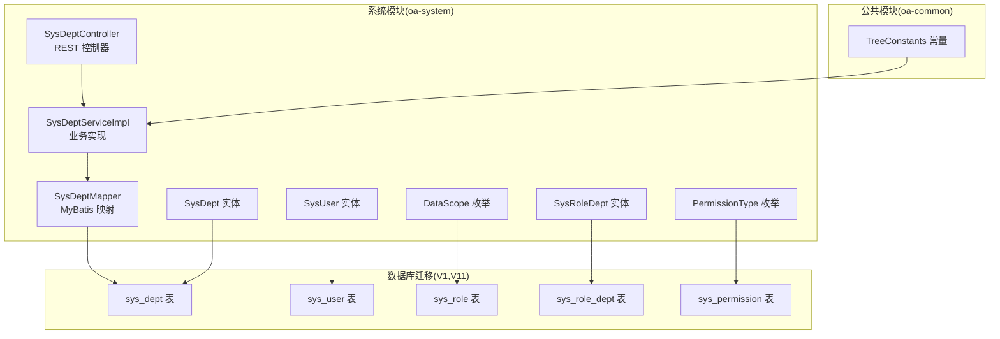
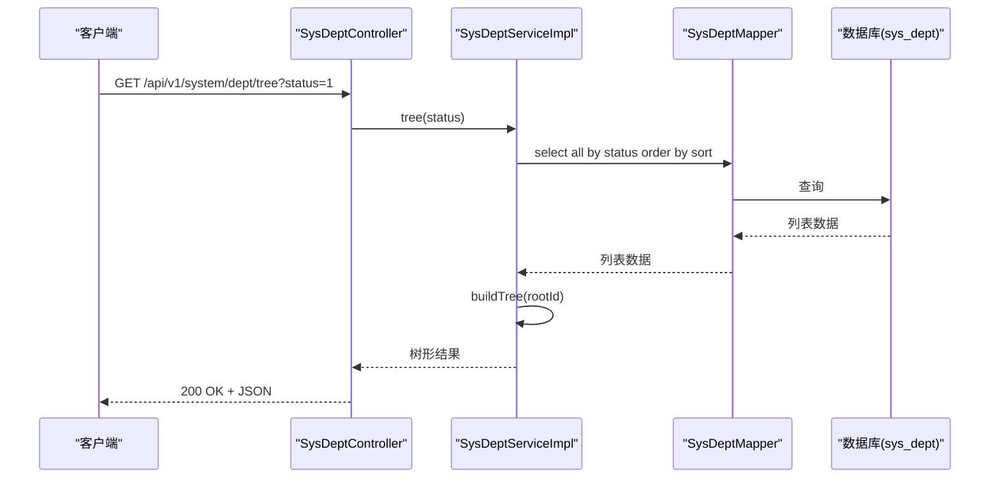
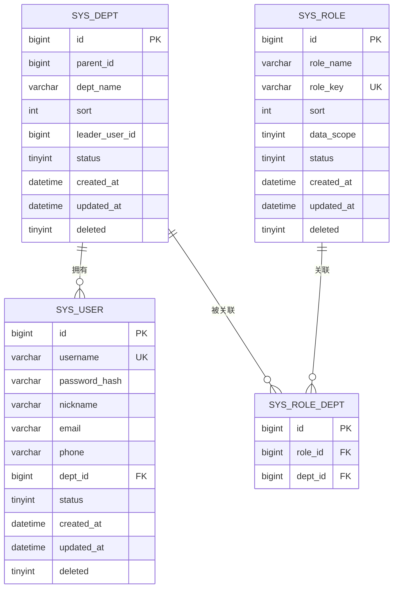
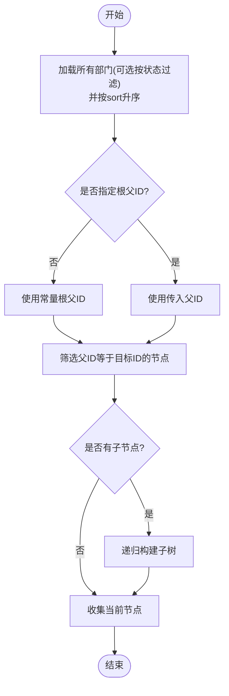
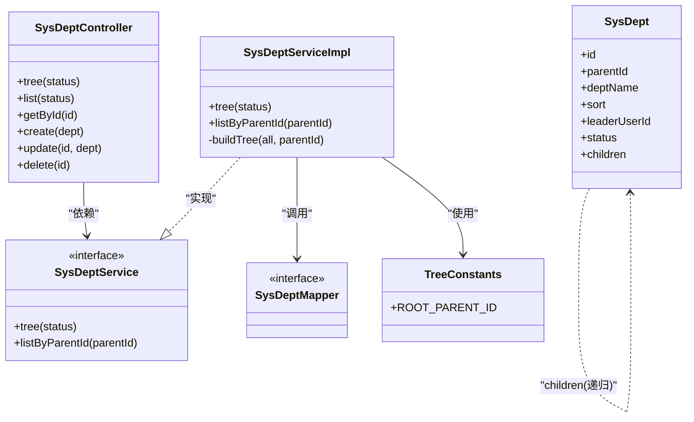

# 部门管理

<cite>
**本文引用的文件**
- [SysDeptController.java](file://oa-system/src/main/java/com/oa/admin/system/controller/SysDeptController.java)
- [SysDeptService.java](file://oa-system/src/main/java/com/oa/admin/system/service/SysDeptService.java)
- [SysDeptServiceImpl.java](file://oa-system/src/main/java/com/oa/admin/system/service/impl/SysDeptServiceImpl.java)
- [SysDeptMapper.java](file://oa-system/src/main/java/com/oa/admin/system/mapper/SysDeptMapper.java)
- [SysDept.java](file://oa-system/src/main/java/com/oa/admin/system/entity/SysDept.java)
- [SysUser.java](file://oa-system/src/main/java/com/oa/admin/system/entity/SysUser.java)
- [SysRoleDept.java](file://oa-system/src/main/java/com/oa/admin/system/entity/SysRoleDept.java)
- [DataScope.java](file://oa-system/src/main/java/com/oa/admin/system/enums/DataScope.java)
- [PermissionType.java](file://oa-system/src/main/java/com/oa/admin/system/enums/PermissionType.java)
- [TreeConstants.java](file://oa-common/src/main/java/com/oa/admin/common/constant/TreeConstants.java)
- [V1__init_sys_tables.sql](file://oa-app/src/main/resources/db/migration/V1__init_sys_tables.sql)
- [V11__system_management_permissions.sql](file://oa-app/src/main/resources/db/migration/V11__system_management_permissions.sql)
</cite>

## 目录
1. [简介](#简介)
2. [项目结构](#项目结构)
3. [核心组件](#核心组件)
4. [架构总览](#架构总览)
5. [详细组件分析](#详细组件分析)
6. [依赖分析](#依赖分析)
7. [性能考虑](#性能考虑)
8. [故障排查指南](#故障排查指南)
9. [结论](#结论)
10. [附录](#附录)

## 简介
本文件面向“部门管理”功能，系统性阐述树形组织架构的完整实现方案，涵盖部门实体模型、父子关系处理、层级排序、状态管理、树形结构构建、递归查询算法、部门移动与合并、部门与用户的角色关联以及部门数据权限的继承机制。文档同时提供API接口规范、树形序列化处理、批量操作建议与最佳实践，并通过图示展示关键流程。

## 项目结构
部门管理位于系统模块（oa-system），采用分层架构：控制器（Controller）负责HTTP接口与权限校验；服务（Service）封装业务逻辑；映射器（Mapper）对接数据库；实体（Entity）描述数据模型；通用常量与枚举提供跨模块共享能力。

图表来源
- [SysDeptController.java:16-69](file://oa-system/src/main/java/com/oa/admin/system/controller/SysDeptController.java#L16-L69)
- [SysDeptServiceImpl.java:17-43](file://oa-system/src/main/java/com/oa/admin/system/service/impl/SysDeptServiceImpl.java#L17-L43)
- [SysDeptMapper.java:10-12](file://oa-system/src/main/java/com/oa/admin/system/mapper/SysDeptMapper.java#L10-L12)
- [SysDept.java:19-30](file://oa-system/src/main/java/com/oa/admin/system/entity/SysDept.java#L19-L30)
- [SysUser.java:16-26](file://oa-system/src/main/java/com/oa/admin/system/entity/SysUser.java#L16-L26)
- [SysRoleDept.java:12-18](file://oa-system/src/main/java/com/oa/admin/system/entity/SysRoleDept.java#L12-L18)
- [DataScope.java:11-26](file://oa-system/src/main/java/com/oa/admin/system/enums/DataScope.java#L11-L26)
- [PermissionType.java:11-26](file://oa-system/src/main/java/com/oa/admin/system/enums/PermissionType.java#L11-L26)
- [TreeConstants.java:6-11](file://oa-common/src/main/java/com/oa/admin/common/constant/TreeConstants.java#L6-L11)
- [V1__init_sys_tables.sql:5-16](file://oa-app/src/main/resources/db/migration/V1__init_sys_tables.sql#L5-L16)
- [V1__init_sys_tables.sql:18-32](file://oa-app/src/main/resources/db/migration/V1__init_sys_tables.sql#L18-L32)
- [V1__init_sys_tables.sql:34-45](file://oa-app/src/main/resources/db/migration/V1__init_sys_tables.sql#L34-L45)
- [V1__init_sys_tables.sql:78-83](file://oa-app/src/main/resources/db/migration/V1__init_sys_tables.sql#L78-L83)
- [V11__system_management_permissions.sql:3-25](file://oa-app/src/main/resources/db/migration/V11__system_management_permissions.sql#L3-L25)

章节来源
- [SysDeptController.java:16-69](file://oa-system/src/main/java/com/oa/admin/system/controller/SysDeptController.java#L16-L69)
- [SysDeptServiceImpl.java:17-43](file://oa-system/src/main/java/com/oa/admin/system/service/impl/SysDeptServiceImpl.java#L17-L43)
- [SysDept.java:19-30](file://oa-system/src/main/java/com/oa/admin/system/entity/SysDept.java#L19-L30)
- [V1__init_sys_tables.sql:5-16](file://oa-app/src/main/resources/db/migration/V1__init_sys_tables.sql#L5-L16)

## 核心组件
- 控制器：提供树形列表、平铺列表、详情、创建、更新、删除等标准CRUD接口，并通过注解进行权限校验。
- 服务层：实现树形结构构建、按父节点查询、通用列表查询等。
- 实体模型：部门实体包含父子关系、排序、状态、负责人等字段；用户实体包含所属部门字段；角色-部门关联用于自定义数据范围。
- 数据库：部门表支持父ID索引、排序字段、状态字段；角色表包含数据范围枚举；角色-部门关联表支持多对多。

章节来源
- [SysDeptController.java:22-68](file://oa-system/src/main/java/com/oa/admin/system/controller/SysDeptController.java#L22-L68)
- [SysDeptService.java:11-16](file://oa-system/src/main/java/com/oa/admin/system/service/SysDeptService.java#L11-L16)
- [SysDeptServiceImpl.java:20-42](file://oa-system/src/main/java/com/oa/admin/system/service/impl/SysDeptServiceImpl.java#L20-L42)
- [SysDept.java:21-29](file://oa-system/src/main/java/com/oa/admin/system/entity/SysDept.java#L21-L29)
- [SysUser.java:24](file://oa-system/src/main/java/com/oa/admin/system/entity/SysUser.java#L24)
- [SysRoleDept.java:14-17](file://oa-system/src/main/java/com/oa/admin/system/entity/SysRoleDept.java#L14-L17)
- [DataScope.java:11-14](file://oa-system/src/main/java/com/oa/admin/system/enums/DataScope.java#L11-L14)
- [V1__init_sys_tables.sql:5-16](file://oa-app/src/main/resources/db/migration/V1__init_sys_tables.sql#L5-L16)

## 架构总览
部门管理遵循典型的分层架构：Web层（控制器）+ 业务层（服务）+ 数据访问层（Mapper）+ 持久化层（数据库）。权限控制通过注解在控制器层生效，树形结构由服务层递归构建。

图表来源
- [SysDeptController.java:22-27](file://oa-system/src/main/java/com/oa/admin/system/controller/SysDeptController.java#L22-L27)
- [SysDeptServiceImpl.java:20-34](file://oa-system/src/main/java/com/oa/admin/system/service/impl/SysDeptServiceImpl.java#L20-L34)
- [SysDeptMapper.java:10-12](file://oa-system/src/main/java/com/oa/admin/system/mapper/SysDeptMapper.java#L10-L12)
- [V1__init_sys_tables.sql:5-16](file://oa-app/src/main/resources/db/migration/V1__init_sys_tables.sql#L5-L16)

## 详细组件分析

### 部门实体模型与数据库设计
- 实体字段：主键、父ID、名称、排序、负责人、状态、子节点集合（仅用于序列化返回，不落库）。
- 数据库表：部门表包含父ID索引、排序字段、状态字段、软删除字段；用户表包含dept_id外键；角色-部门关联表支持自定义数据范围。

图表来源
- [SysDept.java:21-29](file://oa-system/src/main/java/com/oa/admin/system/entity/SysDept.java#L21-L29)
- [SysUser.java:18-25](file://oa-system/src/main/java/com/oa/admin/system/entity/SysUser.java#L18-L25)
- [SysRoleDept.java:14-17](file://oa-system/src/main/java/com/oa/admin/system/entity/SysRoleDept.java#L14-L17)
- [V1__init_sys_tables.sql:5-16](file://oa-app/src/main/resources/db/migration/V1__init_sys_tables.sql#L5-L16)
- [V1__init_sys_tables.sql:18-32](file://oa-app/src/main/resources/db/migration/V1__init_sys_tables.sql#L18-L32)
- [V1__init_sys_tables.sql:34-45](file://oa-app/src/main/resources/db/migration/V1__init_sys_tables.sql#L34-L45)
- [V1__init_sys_tables.sql:78-83](file://oa-app/src/main/resources/db/migration/V1__init_sys_tables.sql#L78-L83)

章节来源
- [SysDept.java:19-30](file://oa-system/src/main/java/com/oa/admin/system/entity/SysDept.java#L19-L30)
- [SysUser.java:16-26](file://oa-system/src/main/java/com/oa/admin/system/entity/SysUser.java#L16-L26)
- [SysRoleDept.java:12-18](file://oa-system/src/main/java/com/oa/admin/system/entity/SysRoleDept.java#L12-L18)
- [V1__init_sys_tables.sql:5-16](file://oa-app/src/main/resources/db/migration/V1__init_sys_tables.sql#L5-L16)

### 树形结构构建与递归查询
- 根节点标识：使用常量表示根节点父ID。
- 构建算法：先按状态过滤并按排序升序获取全量部门，再以根ID为父ID筛选一级节点，递归为每个节点挂载子节点。
- 查询策略：支持按父ID查询子节点列表，配合排序字段保证展示顺序稳定。

图表来源
- [SysDeptServiceImpl.java:20-34](file://oa-system/src/main/java/com/oa/admin/system/service/impl/SysDeptServiceImpl.java#L20-L34)
- [TreeConstants.java:7](file://oa-common/src/main/java/com/oa/admin/common/constant/TreeConstants.java#L7)

章节来源
- [SysDeptServiceImpl.java:20-34](file://oa-system/src/main/java/com/oa/admin/system/service/impl/SysDeptServiceImpl.java#L20-L34)
- [TreeConstants.java:6-11](file://oa-common/src/main/java/com/oa/admin/common/constant/TreeConstants.java#L6-L11)

### 部门CRUD与API规范
- 获取树形列表：GET /api/v1/system/dept/tree?status=1
- 获取平铺列表：GET /api/v1/system/dept?status=1
- 获取单个部门：GET /api/v1/system/dept/{id}
- 新增部门：POST /api/v1/system/dept
- 更新部门：PUT /api/v1/system/dept/{id}
- 删除部门：DELETE /api/v1/system/dept/{id}

权限要求（基于迁移脚本中的权限标识）：
- system:dept:list
- system:dept:query
- system:dept:add
- system:dept:edit
- system:dept:remove

章节来源
- [SysDeptController.java:22-68](file://oa-system/src/main/java/com/oa/admin/system/controller/SysDeptController.java#L22-L68)
- [V11__system_management_permissions.sql:14-18](file://oa-app/src/main/resources/db/migration/V11__system_management_permissions.sql#L14-L18)

### 部门层级关系与排序机制
- 父子关系：通过parentId字段维护层级；根节点父ID使用常量标识。
- 排序机制：数据库层存储sort字段，服务层在查询时按sort升序排列，确保树形展示顺序一致。
- 状态管理：status字段控制启用/停用，树构建时可按状态过滤。

章节来源
- [SysDept.java:22-26](file://oa-system/src/main/java/com/oa/admin/system/entity/SysDept.java#L22-L26)
- [SysDeptServiceImpl.java:22-26](file://oa-system/src/main/java/com/oa/admin/system/service/impl/SysDeptServiceImpl.java#L22-L26)
- [TreeConstants.java:7](file://oa-common/src/main/java/com/oa/admin/common/constant/TreeConstants.java#L7)

### 部门移动与合并操作
- 移动：更新目标部门的parentId即可完成移动；若需要保持原有子树结构，需递归更新其所有子孙节点的路径信息（建议在事务中执行）。
- 合并：将源部门下的用户与子部门迁移至目标部门后，删除源部门；注意检查是否存在角色-部门关联或业务数据绑定。

说明：以上为通用实现建议，具体实现需结合业务规则与事务边界进行设计。

### 部门与用户的角色关联
- 用户-角色：用户表包含dept_id字段，便于快速定位用户所属部门；用户-角色关联表维护用户与角色的多对多关系。
- 角色-部门：角色-部门关联表用于支持“自定义数据范围”，即角色仅能访问指定部门及其子部门的数据。

章节来源
- [SysUser.java:24](file://oa-system/src/main/java/com/oa/admin/system/entity/SysUser.java#L24)
- [SysRoleDept.java:14-17](file://oa-system/src/main/java/com/oa/admin/system/entity/SysRoleDept.java#L14-L17)
- [V1__init_sys_tables.sql:63-69](file://oa-app/src/main/resources/db/migration/V1__init_sys_tables.sql#L63-L69)
- [V1__init_sys_tables.sql:78-83](file://oa-app/src/main/resources/db/migration/V1__init_sys_tables.sql#L78-L83)

### 部门数据权限继承机制
- 数据范围枚举：全部数据、本部门、自定义部门三类。
- 继承策略：当角色数据范围为“本部门”时，系统在查询数据时自动附加当前用户所在部门及其子部门的过滤条件；当为“自定义部门”时，从角色-部门关联表读取允许访问的部门集合，形成继承链路。

章节来源
- [DataScope.java:11-14](file://oa-system/src/main/java/com/oa/admin/system/enums/DataScope.java#L11-L14)
- [SysRoleDept.java:14-17](file://oa-system/src/main/java/com/oa/admin/system/entity/SysRoleDept.java#L14-L17)
- [V1__init_sys_tables.sql:39](file://oa-app/src/main/resources/db/migration/V1__init_sys_tables.sql#L39)

### 树形序列化与前端展示
- 实体中children字段为非持久化字段，仅用于序列化输出树形结构。
- 前端接收树形JSON后，可直接渲染为树组件；若需扁平化，可通过遍历收集所有节点。

章节来源
- [SysDept.java:28-29](file://oa-system/src/main/java/com/oa/admin/system/entity/SysDept.java#L28-L29)

### 批量操作与最佳实践
- 批量移动：选择多个部门，统一更新parentId；建议在事务中执行并记录审计日志。
- 批量合并：合并前进行依赖检查（用户、子部门、角色-部门关联、业务数据），确认无冲突后再执行。
- 最佳实践：
  - 严格使用parentId索引进行查询；
  - 在更新排序或层级时，确保一致性约束；
  - 对于大规模树形数据，优先使用分页或懒加载策略；
  - 权限校验前置到控制器层，避免越权操作。

## 依赖分析
- 控制器依赖服务接口与权限注解；
- 服务实现依赖Mapper与常量；
- 实体依赖MyBatis注解与基础实体基类；
- 数据库层面依赖索引与唯一约束保障查询效率与数据一致性。

图表来源
- [SysDeptController.java:19-68](file://oa-system/src/main/java/com/oa/admin/system/controller/SysDeptController.java#L19-L68)
- [SysDeptService.java:11-16](file://oa-system/src/main/java/com/oa/admin/system/service/SysDeptService.java#L11-L16)
- [SysDeptServiceImpl.java:18-43](file://oa-system/src/main/java/com/oa/admin/system/service/impl/SysDeptServiceImpl.java#L18-L43)
- [SysDeptMapper.java:10-12](file://oa-system/src/main/java/com/oa/admin/system/mapper/SysDeptMapper.java#L10-L12)
- [SysDept.java:21-29](file://oa-system/src/main/java/com/oa/admin/system/entity/SysDept.java#L21-L29)
- [TreeConstants.java:7](file://oa-common/src/main/java/com/oa/admin/common/constant/TreeConstants.java#L7)

章节来源
- [SysDeptController.java:19-68](file://oa-system/src/main/java/com/oa/admin/system/controller/SysDeptController.java#L19-L68)
- [SysDeptServiceImpl.java:18-43](file://oa-system/src/main/java/com/oa/admin/system/service/impl/SysDeptServiceImpl.java#L18-L43)

## 性能考虑
- 查询优化：为parentId建立索引，避免全表扫描；按sort字段排序时建议在数据库层完成。
- 递归构建：一次性拉取全量数据后在内存中构建树，适合中小型组织规模；超大规模建议分页或延迟加载。
- 缓存策略：树形结构相对稳定，可考虑缓存热点部门树，降低重复计算开销。
- 并发控制：移动/合并操作需加锁或使用乐观锁，防止并发修改导致的树形不一致。

## 故障排查指南
- 权限不足：控制器方法均标注权限注解，若出现403，请确认当前用户具备对应权限标识。
- 树形异常：检查parentId与sort字段是否正确；确认根节点父ID使用常量值。
- 数据不一致：移动/合并后若出现用户归属或数据权限异常，核查用户dept_id与角色-部门关联是否同步更新。

章节来源
- [SysDeptController.java:22-68](file://oa-system/src/main/java/com/oa/admin/system/controller/SysDeptController.java#L22-L68)
- [TreeConstants.java:7](file://oa-common/src/main/java/com/oa/admin/common/constant/TreeConstants.java#L7)
- [V11__system_management_permissions.sql:14-18](file://oa-app/src/main/resources/db/migration/V11__system_management_permissions.sql#L14-L18)

## 结论
本实现以简洁的实体模型与服务层递归算法为核心，结合数据库索引与排序字段，提供了完整的树形组织架构管理能力。通过权限注解与角色-部门关联，实现了灵活的数据权限控制。建议在生产环境中配合缓存、分页与事务控制，确保性能与一致性。

## 附录
- 数据库初始化与权限授权脚本路径：
  - [V1__init_sys_tables.sql](file://oa-app/src/main/resources/db/migration/V1__init_sys_tables.sql)
  - [V11__system_management_permissions.sql](file://oa-app/src/main/resources/db/migration/V11__system_management_permissions.sql)