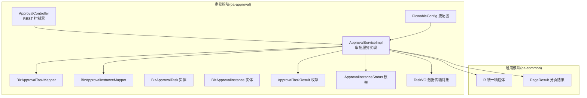
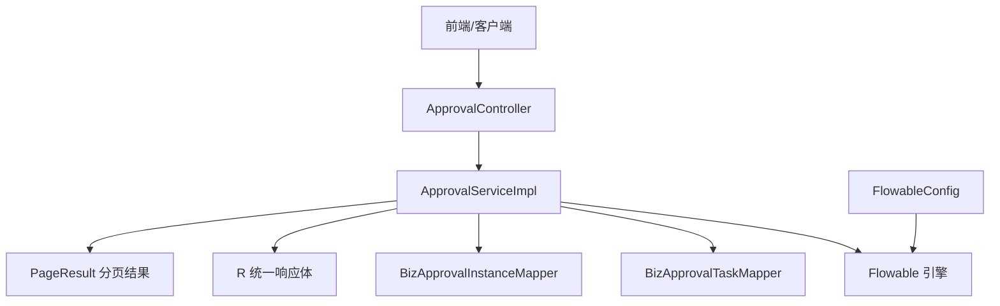
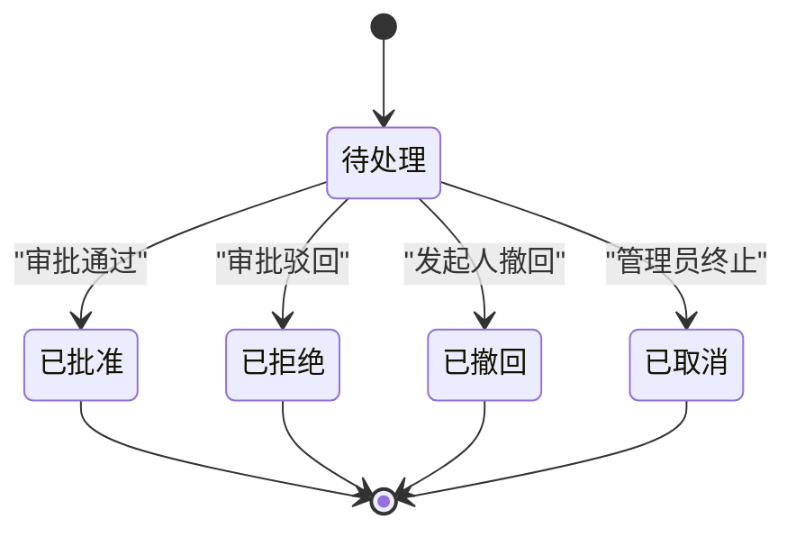
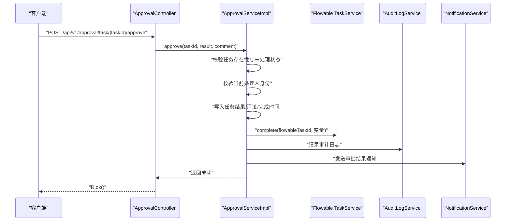
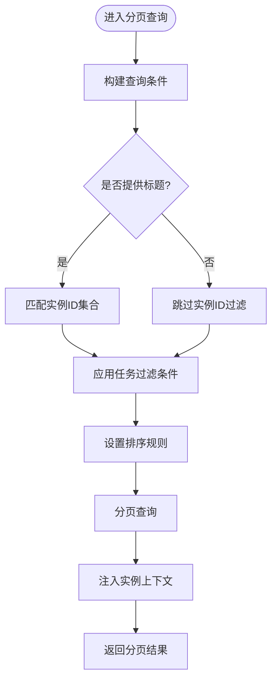
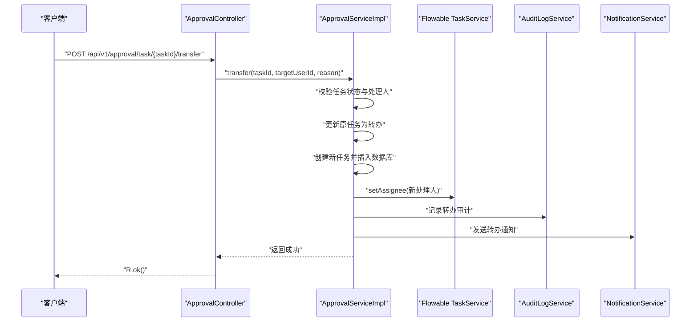
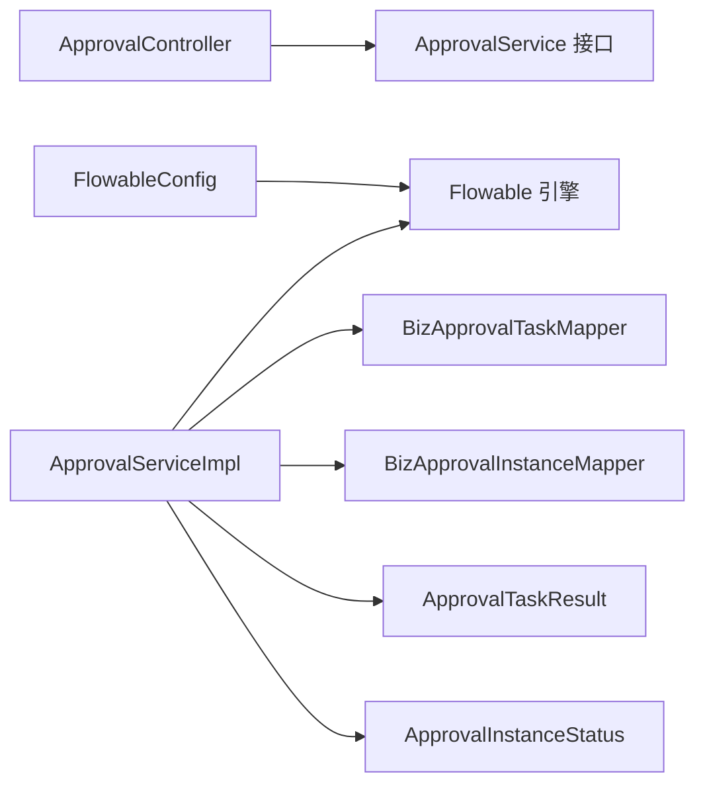
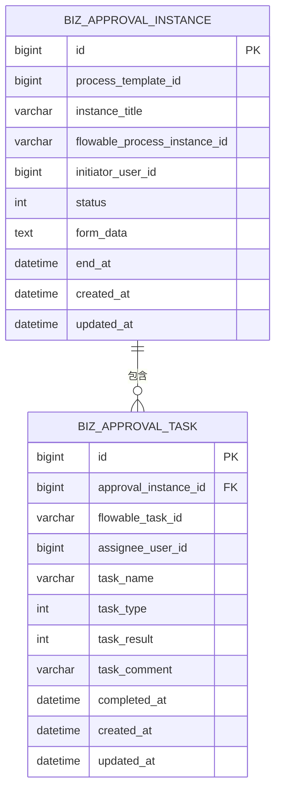

# 任务处理系统

<cite>
**本文档引用的文件**
- [ApprovalController.java](file://oa-approval/src/main/java/com/oa/admin/approval/controller/ApprovalController.java)
- [ApprovalServiceImpl.java](file://oa-approval/src/main/java/com/oa/admin/approval/service/impl/ApprovalServiceImpl.java)
- [ApprovalService.java](file://oa-approval/src/main/java/com/oa/admin/approval/service/ApprovalService.java)
- [BizApprovalTask.java](file://oa-approval/src/main/java/com/oa/admin/approval/entity/BizApprovalTask.java)
- [BizApprovalInstance.java](file://oa-approval/src/main/java/com/oa/admin/approval/entity/BizApprovalInstance.java)
- [ApprovalTaskResult.java](file://oa-approval/src/main/java/com/oa/admin/approval/enums/ApprovalTaskResult.java)
- [ApprovalInstanceStatus.java](file://oa-approval/src/main/java/com/oa/admin/approval/enums/ApprovalInstanceStatus.java)
- [TaskVO.java](file://oa-approval/src/main/java/com/oa/admin/approval/dto/TaskVO.java)
- [BizApprovalTaskMapper.java](file://oa-approval/src/main/java/com/oa/admin/approval/mapper/BizApprovalTaskMapper.java)
- [BizApprovalInstanceMapper.java](file://oa-approval/src/main/java/com/oa/admin/approval/mapper/BizApprovalInstanceMapper.java)
- [ApprovalConstants.java](file://oa-approval/src/main/java/com/oa/admin/approval/constant/ApprovalConstants.java)
- [FlowableConstants.java](file://oa-approval/src/main/java/com/oa/admin/approval/constant/FlowableConstants.java)
- [FlowableConfig.java](file://oa-approval/src/main/java/com/oa/admin/approval/config/FlowableConfig.java)
- [R.java](file://oa-common/src/main/java/com/oa/admin/common/result/R.java)
- [PageResult.java](file://oa-common/src/main/java/com/oa/admin/common/result/PageResult.java)
</cite>

## 目录
1. [简介](#简介)
2. [项目结构](#项目结构)
3. [核心组件](#核心组件)
4. [架构总览](#架构总览)
5. [详细组件分析](#详细组件分析)
6. [依赖关系分析](#依赖关系分析)
7. [性能考虑](#性能考虑)
8. [故障排查指南](#故障排查指南)
9. [结论](#结论)
10. [附录：API 接口文档](#附录api-接口文档)

## 简介
本系统是一个基于 Flowable 的企业级审批工作流平台，提供完整的任务生命周期管理能力，包括任务创建、分配、执行、转办、撤回与完成状态更新。系统通过统一的控制器暴露 REST API，后端服务层结合 Flowable 引擎驱动业务流程，配合审计日志与通知服务，确保审批过程可追踪、可监控。

## 项目结构
系统采用多模块分层架构：
- oa-approval：审批核心模块，包含控制器、服务、实体、枚举、映射器、配置与监听器
- oa-common：通用工具与返回体封装
- 其他模块（如 oa-system、oa-leave）提供用户认证、系统管理与业务扩展

**图表来源**
- [ApprovalController.java:29-252](file://oa-approval/src/main/java/com/oa/admin/approval/controller/ApprovalController.java#L29-L252)
- [ApprovalServiceImpl.java:60-783](file://oa-approval/src/main/java/com/oa/admin/approval/service/impl/ApprovalServiceImpl.java#L60-L783)
- [BizApprovalTaskMapper.java:10-13](file://oa-approval/src/main/java/com/oa/admin/approval/mapper/BizApprovalTaskMapper.java#L10-L13)
- [BizApprovalInstanceMapper.java:10-13](file://oa-approval/src/main/java/com/oa/admin/approval/mapper/BizApprovalInstanceMapper.java#L10-L13)
- [FlowableConfig.java:15-31](file://oa-approval/src/main/java/com/oa/admin/approval/config/FlowableConfig.java#L15-L31)
- [R.java:9-44](file://oa-common/src/main/java/com/oa/admin/common/result/R.java#L9-L44)
- [PageResult.java:9-23](file://oa-common/src/main/java/com/oa/admin/common/result/PageResult.java#L9-L23)

**章节来源**
- [ApprovalController.java:29-252](file://oa-approval/src/main/java/com/oa/admin/approval/controller/ApprovalController.java#L29-L252)
- [ApprovalServiceImpl.java:60-783](file://oa-approval/src/main/java/com/oa/admin/approval/service/impl/ApprovalServiceImpl.java#L60-L783)
- [FlowableConfig.java:15-31](file://oa-approval/src/main/java/com/oa/admin/approval/config/FlowableConfig.java#L15-L31)
- [R.java:9-44](file://oa-common/src/main/java/com/oa/admin/common/result/R.java#L9-L44)
- [PageResult.java:9-23](file://oa-common/src/main/java/com/oa/admin/common/result/PageResult.java#L9-L23)

## 核心组件
- 控制器层：提供审批相关 REST 接口，包括提交、审批、我的待办/已办、分页查询、转办、撤回、实例详情与流程图等
- 服务层：实现审批业务逻辑，协调 Flowable 引擎、持久化与通知/审计
- 持久层：MyBatis-Plus 映射器访问数据库表 biz_approval_task 与 biz_approval_instance
- 实体与枚举：描述审批任务与实例的状态、类型及结果
- 配置与监听：集成 Flowable 并注册事件监听器

**章节来源**
- [ApprovalController.java:29-252](file://oa-approval/src/main/java/com/oa/admin/approval/controller/ApprovalController.java#L29-L252)
- [ApprovalService.java:18-57](file://oa-approval/src/main/java/com/oa/admin/approval/service/ApprovalService.java#L18-L57)
- [ApprovalServiceImpl.java:60-783](file://oa-approval/src/main/java/com/oa/admin/approval/service/impl/ApprovalServiceImpl.java#L60-L783)
- [BizApprovalTask.java:16-35](file://oa-approval/src/main/java/com/oa/admin/approval/entity/BizApprovalTask.java#L16-L35)
- [BizApprovalInstance.java:16-33](file://oa-approval/src/main/java/com/oa/admin/approval/entity/BizApprovalInstance.java#L16-L33)
- [ApprovalTaskResult.java:9-28](file://oa-approval/src/main/java/com/oa/admin/approval/enums/ApprovalTaskResult.java#L9-L28)
- [ApprovalInstanceStatus.java:9-29](file://oa-approval/src/main/java/com/oa/admin/approval/enums/ApprovalInstanceStatus.java#L9-L29)

## 架构总览
系统采用“控制器-服务-持久层”三层架构，配合 Flowable 工作流引擎驱动业务流程。控制器负责权限校验与请求参数解析，服务层负责业务编排与状态变更，持久层负责数据读写，通用模块提供统一响应与分页封装。

**图表来源**
- [ApprovalController.java:29-252](file://oa-approval/src/main/java/com/oa/admin/approval/controller/ApprovalController.java#L29-L252)
- [ApprovalServiceImpl.java:60-783](file://oa-approval/src/main/java/com/oa/admin/approval/service/impl/ApprovalServiceImpl.java#L60-L783)
- [FlowableConfig.java:15-31](file://oa-approval/src/main/java/com/oa/admin/approval/config/FlowableConfig.java#L15-L31)
- [R.java:9-44](file://oa-common/src/main/java/com/oa/admin/common/result/R.java#L9-L44)
- [PageResult.java:9-23](file://oa-common/src/main/java/com/oa/admin/common/result/PageResult.java#L9-L23)

## 详细组件分析

### 审批任务生命周期管理
- 任务创建：提交时根据模板启动流程实例，创建审批实例并记录初始状态
- 任务分配：Flowable 根据流程定义自动分配任务给候选人或指定处理人
- 任务执行：审批人完成审批，系统更新任务结果并推进流程
- 完成状态更新：流程结束后更新实例状态，支持撤回与终止等操作

**图表来源**
- [ApprovalInstanceStatus.java:11-16](file://oa-approval/src/main/java/com/oa/admin/approval/enums/ApprovalInstanceStatus.java#L11-L16)
- [ApprovalTaskResult.java:11-15](file://oa-approval/src/main/java/com/oa/admin/approval/enums/ApprovalTaskResult.java#L11-L15)

**章节来源**
- [ApprovalServiceImpl.java:113-159](file://oa-approval/src/main/java/com/oa/admin/approval/service/impl/ApprovalServiceImpl.java#L113-L159)
- [ApprovalServiceImpl.java:161-231](file://oa-approval/src/main/java/com/oa/admin/approval/service/impl/ApprovalServiceImpl.java#L161-L231)
- [ApprovalServiceImpl.java:255-298](file://oa-approval/src/main/java/com/oa/admin/approval/service/impl/ApprovalServiceImpl.java#L255-L298)

### approve 接口实现
该接口用于处理审批结果，包括：
- 参数校验：审批结果必须为合法枚举值
- 权限校验：仅当前任务处理人可操作
- 任务状态更新：写入审批结果、评论与完成时间
- 流程推进：向 Flowable 提交变量并完成任务
- 审计与通知：记录审计日志并向发起人发送通知
- 抄送触发：根据节点配置触发抄送

**图表来源**
- [ApprovalController.java:46-53](file://oa-approval/src/main/java/com/oa/admin/approval/controller/ApprovalController.java#L46-L53)
- [ApprovalServiceImpl.java:161-231](file://oa-approval/src/main/java/com/oa/admin/approval/service/impl/ApprovalServiceImpl.java#L161-L231)

**章节来源**
- [ApprovalController.java:46-53](file://oa-approval/src/main/java/com/oa/admin/approval/controller/ApprovalController.java#L46-L53)
- [ApprovalServiceImpl.java:161-231](file://oa-approval/src/main/java/com/oa/admin/approval/service/impl/ApprovalServiceImpl.java#L161-L231)

### 任务分页查询、筛选与排序
- 我的待办分页：按创建时间倒序，支持标题模糊匹配
- 我的已办分页：按完成时间倒序，支持标题模糊匹配
- 筛选条件：标题模糊匹配、状态过滤（实例级别）
- 排序机制：分别以创建时间与完成时间降序排列
- 数据增强：将实例信息注入到任务视图对象中，便于前端展示摘要

**图表来源**
- [ApprovalServiceImpl.java:451-478](file://oa-approval/src/main/java/com/oa/admin/approval/service/impl/ApprovalServiceImpl.java#L451-L478)
- [ApprovalServiceImpl.java:481-508](file://oa-approval/src/main/java/com/oa/admin/approval/service/impl/ApprovalServiceImpl.java#L481-L508)
- [ApprovalServiceImpl.java:510-545](file://oa-approval/src/main/java/com/oa/admin/approval/service/impl/ApprovalServiceImpl.java#L510-L545)

**章节来源**
- [ApprovalServiceImpl.java:451-508](file://oa-approval/src/main/java/com/oa/admin/approval/service/impl/ApprovalServiceImpl.java#L451-L508)
- [TaskVO.java:13-34](file://oa-approval/src/main/java/com/oa/admin/approval/dto/TaskVO.java#L13-L34)

### 转办与撤回
- 转办：校验任务未处理且当前处理人为本人，标记原任务为转办并创建新任务，同时在 Flowable 中重新指派
- 撤回：仅限发起人且实例处于待处理状态，清理未完成任务并删除流程实例

**图表来源**
- [ApprovalController.java:85-92](file://oa-approval/src/main/java/com/oa/admin/approval/controller/ApprovalController.java#L85-L92)
- [ApprovalServiceImpl.java:547-593](file://oa-approval/src/main/java/com/oa/admin/approval/service/impl/ApprovalServiceImpl.java#L547-L593)

**章节来源**
- [ApprovalController.java:85-92](file://oa-approval/src/main/java/com/oa/admin/approval/controller/ApprovalController.java#L85-L92)
- [ApprovalServiceImpl.java:547-593](file://oa-approval/src/main/java/com/oa/admin/approval/service/impl/ApprovalServiceImpl.java#L547-L593)

### 并发控制、事务管理与异常恢复
- 事务管理：服务方法普遍使用事务注解，保证数据库与流程引擎的一致性
- 并发控制：通过数据库唯一约束与业务前置检查（如任务未处理、处理人匹配）避免竞态
- 异常恢复：统一异常处理返回标准错误码；流程终止与撤回场景清理孤儿任务

**章节来源**
- [ApprovalServiceImpl.java:113-159](file://oa-approval/src/main/java/com/oa/admin/approval/service/impl/ApprovalServiceImpl.java#L113-L159)
- [ApprovalServiceImpl.java:161-231](file://oa-approval/src/main/java/com/oa/admin/approval/service/impl/ApprovalServiceImpl.java#L161-L231)
- [ApprovalServiceImpl.java:255-298](file://oa-approval/src/main/java/com/oa/admin/approval/service/impl/ApprovalServiceImpl.java#L255-L298)
- [ApprovalServiceImpl.java:547-593](file://oa-approval/src/main/java/com/oa/admin/approval/service/impl/ApprovalServiceImpl.java#L547-L593)

## 依赖关系分析
- 控制器依赖服务接口与权限注解
- 服务实现依赖 Flowable 引擎、映射器、枚举与工具类
- 实体与映射器构成数据层契约
- 配置类注册 Flowable 事件监听器

**图表来源**
- [ApprovalController.java:33-35](file://oa-approval/src/main/java/com/oa/admin/approval/controller/ApprovalController.java#L33-L35)
- [ApprovalServiceImpl.java:101-112](file://oa-approval/src/main/java/com/oa/admin/approval/service/impl/ApprovalServiceImpl.java#L101-L112)
- [FlowableConfig.java:17-29](file://oa-approval/src/main/java/com/oa/admin/approval/config/FlowableConfig.java#L17-L29)

**章节来源**
- [ApprovalController.java:33-35](file://oa-approval/src/main/java/com/oa/admin/approval/controller/ApprovalController.java#L33-L35)
- [ApprovalServiceImpl.java:101-112](file://oa-approval/src/main/java/com/oa/admin/approval/service/impl/ApprovalServiceImpl.java#L101-L112)
- [FlowableConfig.java:17-29](file://oa-approval/src/main/java/com/oa/admin/approval/config/FlowableConfig.java#L17-L29)

## 性能考虑
- 分页查询：对高频查询接口使用分页，避免一次性加载大量数据
- 查询优化：针对标题过滤先查询实例 ID 再回填任务查询，减少无关扫描
- 批量读取：任务视图增强阶段使用批量查询实例集合，降低 N+1 查询风险
- 日志与通知：异步化处理可进一步降低主流程延迟

[本节为通用指导，无需列出具体文件来源]

## 故障排查指南
- 参数错误：控制器对数值字段进行严格解析，非法输入会抛出参数错误
- 权限不足：基于权限注解校验，非处理人或无权限用户会被拒绝
- 任务已处理：重复审批会触发已处理错误
- 实例状态不符：撤回与终止仅在特定状态下允许
- 流程异常：流程删除失败会记录告警，不影响其他流程

**章节来源**
- [ApprovalController.java:230-250](file://oa-approval/src/main/java/com/oa/admin/approval/controller/ApprovalController.java#L230-L250)
- [ApprovalServiceImpl.java:161-231](file://oa-approval/src/main/java/com/oa/admin/approval/service/impl/ApprovalServiceImpl.java#L161-L231)
- [ApprovalServiceImpl.java:255-298](file://oa-approval/src/main/java/com/oa/admin/approval/service/impl/ApprovalServiceImpl.java#L255-L298)
- [ApprovalServiceImpl.java:654-696](file://oa-approval/src/main/java/com/oa/admin/approval/service/impl/ApprovalServiceImpl.java#L654-L696)

## 结论
本系统通过清晰的分层设计与 Flowable 引擎集成，实现了从任务创建到完成的全生命周期管理。统一的响应体与分页封装提升了前后端协作效率，完善的权限与异常处理保障了系统的安全性与稳定性。建议在高并发场景下引入异步通知与缓存策略，持续优化用户体验。

[本节为总结性内容，无需列出具体文件来源]

## 附录：API 接口文档

### 认证与权限
- 使用权限注解进行细粒度权限控制，调用前需完成登录与授权
- 常见权限键：
  - 审批提交：approval:submit
  - 审批操作：approval:approve
  - 我的待办：approval:todo
  - 我的已办：approval:done
  - 撤回：approval:withdraw
  - 实例查看：approval:instance:view
  - 仪表盘：approval:dashboard
  - 模板管理：approval:template:list/create/edit/delete/publish
  - 抄送：approval:cc

[本小节为概念性说明，不直接分析具体文件]

### 接口列表与说明

- 提交审批
  - 方法与路径：POST /api/v1/approval/submit
  - 权限：approval:submit
  - 请求体参数：
    - templateId: 模板ID（必填）
    - title: 申请标题（必填）
    - formData: 表单JSON字符串（可选）
  - 返回：审批实例信息
  - 失败场景：模板不存在、模板未发布、参数错误

- 审批任务
  - 方法与路径：POST /api/v1/approval/task/{taskId}/approve
  - 权限：approval:approve
  - 路径参数：taskId（必填）
  - 请求体参数：
    - result: 审批结果（1=通过, 2=驳回），必填
    - comment: 审批意见（可选）
  - 返回：空
  - 失败场景：任务不存在、已处理、非当前处理人、参数错误

- 我的待办
  - 方法与路径：GET /api/v1/approval/my-todo
  - 权限：approval:todo
  - 返回：任务列表（未完成）
  - 失败场景：无权限

- 我的已办
  - 方法与路径：GET /api/v1/approval/my-done
  - 权限：approval:done
  - 返回：任务列表（已完成）
  - 失败场景：无权限

- 我的待办（分页）
  - 方法与路径：GET /api/v1/approval/my-todo/paged
  - 权限：approval:todo
  - 查询参数：
    - title: 标题关键字（可选）
    - page: 页码，默认1
    - pageSize: 每页条数，默认10
  - 返回：分页任务视图（含实例摘要）
  - 失败场景：无权限

- 我的已办（分页）
  - 方法与路径：GET /api/v1/approval/my-done/paged
  - 权限：approval:done
  - 查询参数：
    - title: 标题关键字（可选）
    - page: 页码，默认1
    - pageSize: 每页条数，默认10
  - 返回：分页任务视图（含实例摘要）
  - 失败场景：无权限

- 转办
  - 方法与路径：POST /api/v1/approval/task/{taskId}/transfer
  - 权限：approval:approve
  - 路径参数：taskId（必填）
  - 请求体参数：
    - targetUserId: 目标处理人ID（必填）
    - reason: 转办原因（可选）
  - 返回：空
  - 失败场景：任务不存在/已处理、非当前处理人、目标无效

- 撤回
  - 方法与路径：POST /api/v1/approval/{instanceId}/withdraw
  - 权限：approval:withdraw
  - 路径参数：instanceId（必填）
  - 返回：空
  - 失败场景：实例不存在、非发起人、实例状态不允许撤回

- 实例任务列表
  - 方法与路径：GET /api/v1/approval/instance/{instanceId}/tasks
  - 权限：approval:instance:view
  - 返回：实例内所有任务（按创建时间升序）
  - 失败场景：实例不存在

- 我的申请
  - 方法与路径：GET /api/v1/approval/my-applications
  - 权限：approval:instance:view
  - 查询参数：
    - title: 标题关键字（可选）
    - status: 状态（可选）
    - page: 页码，默认1
    - pageSize: 每页条数，默认10
  - 返回：分页实例列表
  - 失败场景：无权限

- 实例详情
  - 方法与路径：GET /api/v1/approval/instance/{instanceId}
  - 权限：approval:instance:view
  - 返回：实例详情
  - 失败场景：实例不存在

- 实例流程图
  - 方法与路径：GET /api/v1/approval/instance/{instanceId}/diagram
  - 权限：approval:instance:view
  - 返回：包含已完成节点与当前节点的流程图XML
  - 失败场景：实例不存在

- 仪表盘统计
  - 方法与路径：GET /api/v1/approval/dashboard/stats
  - 权限：approval:dashboard
  - 返回：待办/已办数量、模板数量、未读抄送数量、最近活动
  - 失败场景：无权限

- 模板管理（CRUD）
  - 列表：GET /api/v1/approval/template（权限：approval:template:list）
  - 详情：GET /api/v1/approval/template/{id}（权限：approval:template:list）
  - 创建：POST /api/v1/approval/template（权限：approval:template:create）
  - 更新：PUT /api/v1/approval/template/{id}（权限：approval:template:edit）
  - 删除：DELETE /api/v1/approval/template/{id}（权限：approval:template:delete）
  - 发布：POST /api/v1/approval/template/{id}/publish（权限：approval:template:publish）
  - 获取XML：GET /api/v1/approval/template/{id}/xml（权限：approval:template:edit）
  - 保存XML：PUT /api/v1/approval/template/{id}/xml（权限：approval:template:edit）
  - 节点配置：GET/PUT /api/v1/approval/template/{id}/node-config（权限：approval:template:edit）
  - 新版本：POST /api/v1/approval/template/{id}/new-version（权限：approval:template:create）

- 抄送
  - 我的抄送：GET /api/v1/approval/cc（权限：approval:cc）
  - 标记已读：POST /api/v1/approval/cc/{ccId}/read（权限：approval:cc）

**章节来源**
- [ApprovalController.java:37-228](file://oa-approval/src/main/java/com/oa/admin/approval/controller/ApprovalController.java#L37-L228)
- [ApprovalService.java:18-57](file://oa-approval/src/main/java/com/oa/admin/approval/service/ApprovalService.java#L18-L57)

### 响应格式
- 成功：R.ok(data)
- 失败：R.fail(code, msg)
- 分页：PageResult(list, total, page, pageSize)

**章节来源**
- [R.java:9-44](file://oa-common/src/main/java/com/oa/admin/common/result/R.java#L9-L44)
- [PageResult.java:9-23](file://oa-common/src/main/java/com/oa/admin/common/result/PageResult.java#L9-L23)

### 数据模型

**图表来源**
- [BizApprovalInstance.java:16-33](file://oa-approval/src/main/java/com/oa/admin/approval/entity/BizApprovalInstance.java#L16-L33)
- [BizApprovalTask.java:16-35](file://oa-approval/src/main/java/com/oa/admin/approval/entity/BizApprovalTask.java#L16-L35)