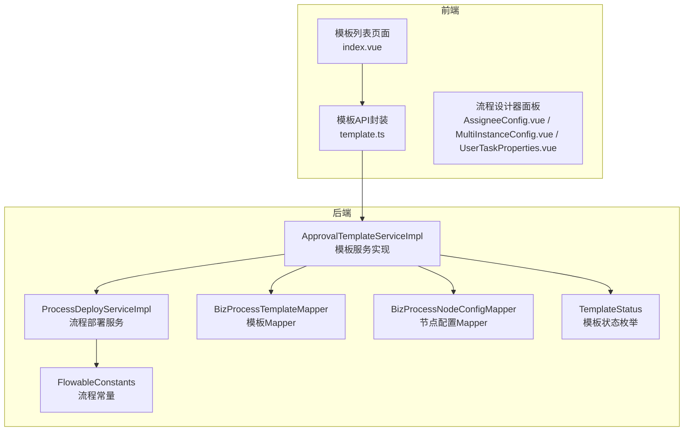
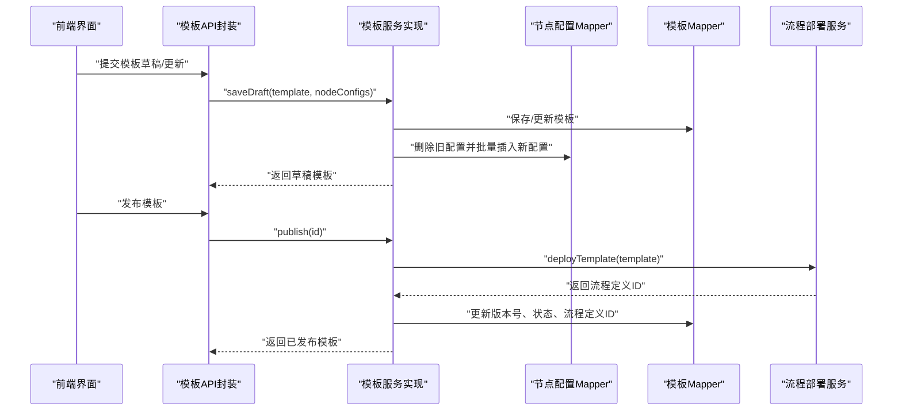
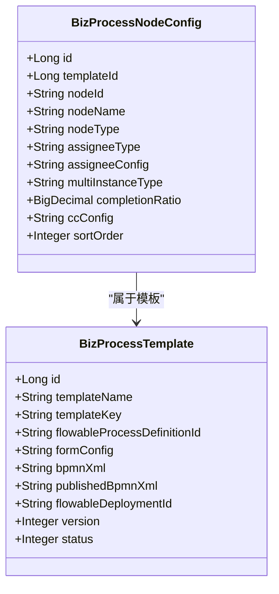
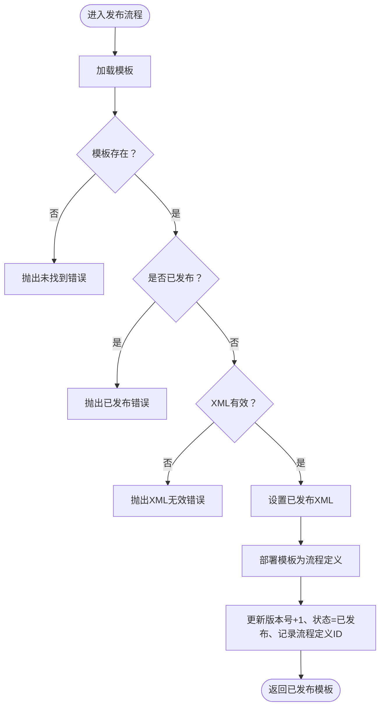
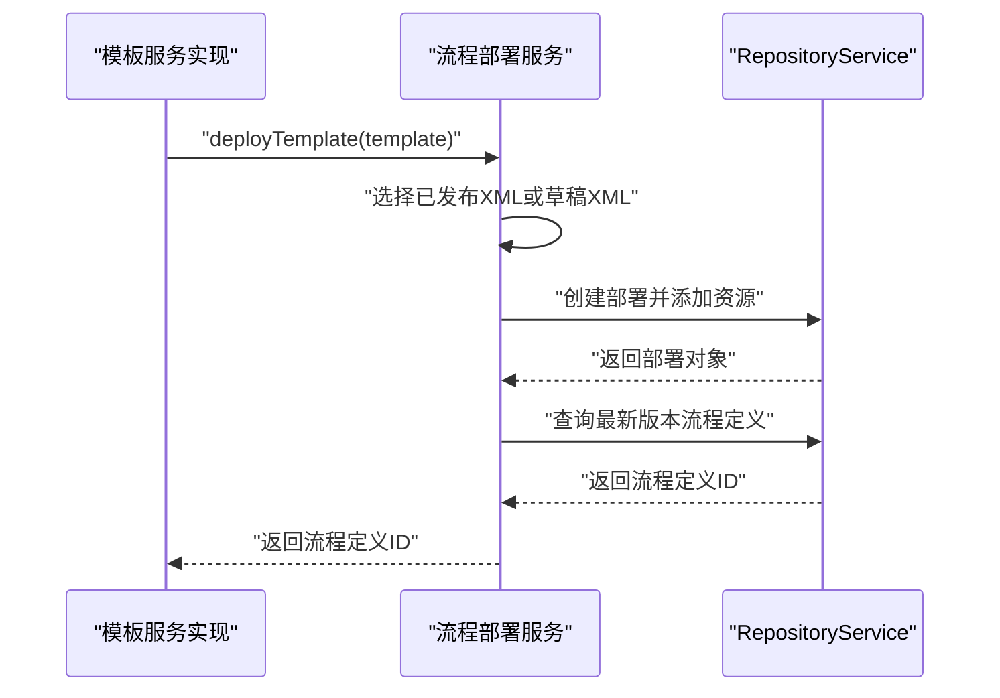
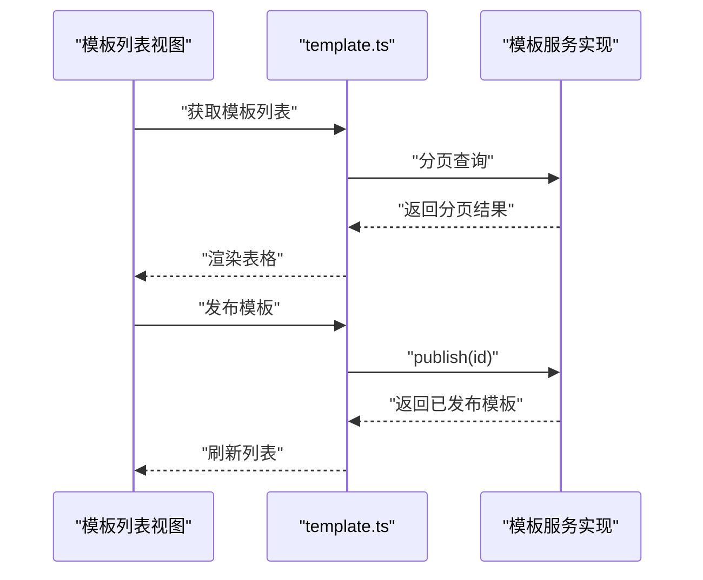
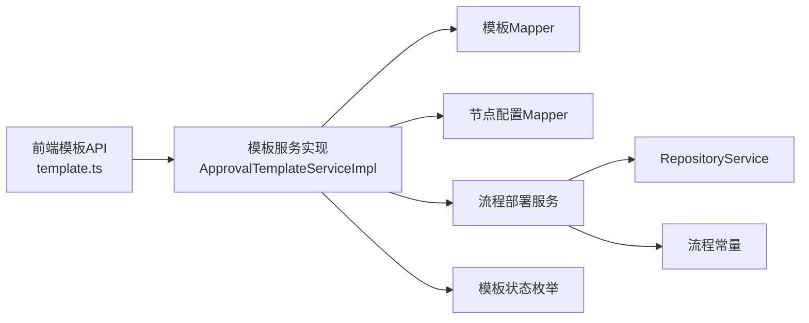

# 审批模板管理

<cite>
**本文档引用的文件**
- [BizProcessTemplate.java](file://oa-approval/src/main/java/com/oa/admin/approval/entity/BizProcessTemplate.java)
- [BizProcessNodeConfig.java](file://oa-approval/src/main/java/com/oa/admin/approval/entity/BizProcessNodeConfig.java)
- [ApprovalTemplateService.java](file://oa-approval/src/main/java/com/oa/admin/approval/service/ApprovalTemplateService.java)
- [ApprovalTemplateServiceImpl.java](file://oa-approval/src/main/java/com/oa/admin/approval/service/impl/ApprovalTemplateServiceImpl.java)
- [ProcessDeployService.java](file://oa-approval/src/main/java/com/oa/admin/approval/service/ProcessDeployService.java)
- [ProcessDeployServiceImpl.java](file://oa-approval/src/main/java/com/oa/admin/approval/service/impl/ProcessDeployServiceImpl.java)
- [TemplateStatus.java](file://oa-approval/src/main/java/com/oa/admin/approval/enums/TemplateStatus.java)
- [FlowableConstants.java](file://oa-approval/src/main/java/com/oa/admin/approval/constant/FlowableConstants.java)
- [BizProcessTemplateMapper.java](file://oa-approval/src/main/java/com/oa/admin/approval/mapper/BizProcessTemplateMapper.java)
- [BizProcessNodeConfigMapper.java](file://oa-approval/src/main/java/com/oa/admin/approval/mapper/BizProcessNodeConfigMapper.java)
- [template.ts](file://oa-ui/src/api/template.ts)
- [index.vue](file://oa-ui/src/views/approval/template/index.vue)
- [AssigneeConfig.vue](file://oa-ui/src/views/approval/template/designer/components/panels/AssigneeConfig.vue)
- [MultiInstanceConfig.vue](file://oa-ui/src/views/approval/template/designer/components/panels/MultiInstanceConfig.vue)
- [UserTaskProperties.vue](file://oa-ui/src/views/approval/template/designer/components/panels/UserTaskProperties.vue)
- [leave_request.bpmn20.xml](file://oa-app/src/main/resources/processes/leave_request.bpmn20.xml)
</cite>

## 目录
1. [简介](#简介)
2. [项目结构](#项目结构)
3. [核心组件](#核心组件)
4. [架构总览](#架构总览)
5. [详细组件分析](#详细组件分析)
6. [依赖关系分析](#依赖关系分析)
7. [性能考虑](#性能考虑)
8. [故障排除指南](#故障排除指南)
9. [结论](#结论)
10. [附录](#附录)

## 简介
本文件面向审批模板管理功能，系统性阐述模板的全生命周期：从创建草稿、编辑节点配置、发布上线、版本控制到XML配置管理；详解JSON表单字段配置语法、节点配置参数、模板状态管理与版本继承机制；提供模板CRUD操作的API接口说明、权限控制策略与最佳实践，并给出完整的模板设计指南（表单字段类型、验证规则、条件显示与动态配置），解释模板与流程定义的关系及如何通过模板实现可复用的审批业务逻辑。

## 项目结构
审批模板管理涉及后端服务层、持久层与前端界面三层协作：
- 后端：模板实体与节点配置实体、服务接口与实现、流程部署服务、状态枚举与常量、MyBatis映射器
- 前端：模板列表与表单、流程设计器面板（节点属性、会签/或签配置、处理人配置等）、API封装

**图表来源**
- [index.vue:1-198](file://oa-ui/src/views/approval/template/index.vue#L1-L198)
- [template.ts:1-51](file://oa-ui/src/api/template.ts#L1-L51)
- [ApprovalTemplateServiceImpl.java:1-163](file://oa-approval/src/main/java/com/oa/admin/approval/service/impl/ApprovalTemplateServiceImpl.java#L1-L163)
- [ProcessDeployServiceImpl.java:1-82](file://oa-approval/src/main/java/com/oa/admin/approval/service/impl/ProcessDeployServiceImpl.java#L1-L82)
- [BizProcessTemplateMapper.java:1-13](file://oa-approval/src/main/java/com/oa/admin/approval/mapper/BizProcessTemplateMapper.java#L1-L13)
- [BizProcessNodeConfigMapper.java:1-11](file://oa-approval/src/main/java/com/oa/admin/approval/mapper/BizProcessNodeConfigMapper.java#L1-L11)
- [TemplateStatus.java:1-26](file://oa-approval/src/main/java/com/oa/admin/approval/enums/TemplateStatus.java#L1-L26)
- [FlowableConstants.java:1-16](file://oa-approval/src/main/java/com/oa/admin/approval/constant/FlowableConstants.java#L1-L16)

**章节来源**
- [index.vue:1-198](file://oa-ui/src/views/approval/template/index.vue#L1-L198)
- [template.ts:1-51](file://oa-ui/src/api/template.ts#L1-L51)
- [ApprovalTemplateServiceImpl.java:1-163](file://oa-approval/src/main/java/com/oa/admin/approval/service/impl/ApprovalTemplateServiceImpl.java#L1-L163)
- [ProcessDeployServiceImpl.java:1-82](file://oa-approval/src/main/java/com/oa/admin/approval/service/impl/ProcessDeployServiceImpl.java#L1-L82)

## 核心组件
- 模板实体：存储模板基本信息、表单配置JSON、BPMN XML、已发布XML、版本号与状态
- 节点配置实体：描述流程节点的处理人类型/配置、多实例类型与完成比例、抄送配置、排序等
- 模板服务接口与实现：提供分页查询、草稿保存、发布、新建版本、取消发布、节点配置读写、XML读写等能力
- 流程部署服务：负责将模板XML部署为流程定义，返回流程定义ID
- 状态枚举：定义草稿与已发布两种状态码
- 前端API与界面：封装模板CRUD、发布、新建版本、XML与节点配置读写；提供流程设计器面板

**章节来源**
- [BizProcessTemplate.java:1-29](file://oa-approval/src/main/java/com/oa/admin/approval/entity/BizProcessTemplate.java#L1-L29)
- [BizProcessNodeConfig.java:1-37](file://oa-approval/src/main/java/com/oa/admin/approval/entity/BizProcessNodeConfig.java#L1-L37)
- [ApprovalTemplateService.java:1-33](file://oa-approval/src/main/java/com/oa/admin/approval/service/ApprovalTemplateService.java#L1-L33)
- [ApprovalTemplateServiceImpl.java:1-163](file://oa-approval/src/main/java/com/oa/admin/approval/service/impl/ApprovalTemplateServiceImpl.java#L1-L163)
- [ProcessDeployService.java:1-14](file://oa-approval/src/main/java/com/oa/admin/approval/service/ProcessDeployService.java#L1-L14)
- [ProcessDeployServiceImpl.java:1-82](file://oa-approval/src/main/java/com/oa/admin/approval/service/impl/ProcessDeployServiceImpl.java#L1-L82)
- [TemplateStatus.java:1-26](file://oa-approval/src/main/java/com/oa/admin/approval/enums/TemplateStatus.java#L1-L26)

## 架构总览
审批模板管理采用“模板+节点配置+流程引擎”的架构模式：
- 模板层：维护模板元数据与表单配置JSON
- 节点配置层：维护每个流程节点的处理人解析策略、多实例与抄送等属性
- 部署层：将模板XML部署为流程定义，生成流程定义ID用于后续实例化
- 前端层：提供模板列表、表单编辑、流程设计与发布操作

**图表来源**
- [template.ts:1-51](file://oa-ui/src/api/template.ts#L1-L51)
- [ApprovalTemplateServiceImpl.java:42-81](file://oa-approval/src/main/java/com/oa/admin/approval/service/impl/ApprovalTemplateServiceImpl.java#L42-L81)
- [ProcessDeployServiceImpl.java:28-58](file://oa-approval/src/main/java/com/oa/admin/approval/service/impl/ProcessDeployServiceImpl.java#L28-L58)

## 详细组件分析

### 模板实体与节点配置实体
- 模板实体包含：主键、模板名称、模板Key、流程定义ID、表单配置JSON、草稿XML、已发布XML、部署ID、版本号、状态
- 节点配置实体包含：模板ID、节点ID/名称、节点类型、处理人类型/配置、多实例类型/完成比例、抄送配置、排序

**图表来源**
- [BizProcessTemplate.java:13-28](file://oa-approval/src/main/java/com/oa/admin/approval/entity/BizProcessTemplate.java#L13-L28)
- [BizProcessNodeConfig.java:15-36](file://oa-approval/src/main/java/com/oa/admin/approval/entity/BizProcessNodeConfig.java#L15-L36)

**章节来源**
- [BizProcessTemplate.java:1-29](file://oa-approval/src/main/java/com/oa/admin/approval/entity/BizProcessTemplate.java#L1-L29)
- [BizProcessNodeConfig.java:1-37](file://oa-approval/src/main/java/com/oa/admin/approval/entity/BizProcessNodeConfig.java#L1-L37)

### 模板服务接口与实现
- 分页查询：支持按模板名与状态过滤，按创建时间倒序
- 草稿保存：若为已发布模板则拒绝覆盖；状态置为草稿
- 发布：校验XML有效性，设置已发布XML，调用部署服务，返回流程定义ID，版本+1，状态置为已发布
- 新建版本：仅对已发布模板生效，复制基础信息与已发布XML，版本号不变，状态置为草稿
- 取消发布：将状态置为草稿
- 节点配置：提供读取与批量写入，写入时重置ID并按顺序排序
- XML读写：仅草稿态允许修改XML

**图表来源**
- [ApprovalTemplateServiceImpl.java:58-81](file://oa-approval/src/main/java/com/oa/admin/approval/service/impl/ApprovalTemplateServiceImpl.java#L58-L81)
- [ProcessDeployServiceImpl.java:28-58](file://oa-approval/src/main/java/com/oa/admin/approval/service/impl/ProcessDeployServiceImpl.java#L28-L58)

**章节来源**
- [ApprovalTemplateService.java:13-32](file://oa-approval/src/main/java/com/oa/admin/approval/service/ApprovalTemplateService.java#L13-L32)
- [ApprovalTemplateServiceImpl.java:32-161](file://oa-approval/src/main/java/com/oa/admin/approval/service/impl/ApprovalTemplateServiceImpl.java#L32-L161)

### 流程部署服务
- 将模板XML部署为流程定义，返回流程定义ID
- 支持从已发布XML或当前草稿XML中选择
- 提供从部署ID读取XML的能力

**图表来源**
- [ProcessDeployServiceImpl.java:28-58](file://oa-approval/src/main/java/com/oa/admin/approval/service/impl/ProcessDeployServiceImpl.java#L28-L58)

**章节来源**
- [ProcessDeployService.java:8-13](file://oa-approval/src/main/java/com/oa/admin/approval/service/ProcessDeployService.java#L8-L13)
- [ProcessDeployServiceImpl.java:1-82](file://oa-approval/src/main/java/com/oa/admin/approval/service/impl/ProcessDeployServiceImpl.java#L1-L82)

### 前端模板管理与API
- 列表页面：展示模板名称、标识、状态、版本、创建时间，提供设计流程、编辑、发布、新建版本、删除等操作
- 表单配置：支持JSON格式的表单字段配置输入框
- API封装：提供模板XML读写、节点配置读写、发布、新建版本、CRUD等HTTP接口

**图表来源**
- [index.vue:114-191](file://oa-ui/src/views/approval/template/index.vue#L114-L191)
- [template.ts:16-50](file://oa-ui/src/api/template.ts#L16-L50)

**章节来源**
- [index.vue:1-198](file://oa-ui/src/views/approval/template/index.vue#L1-L198)
- [template.ts:1-51](file://oa-ui/src/api/template.ts#L1-L51)

### 节点配置参数详解
- 节点类型：支持用户任务、排他网关、并行网关、开始事件、结束事件
- 处理人类型：支持固定人员、部门领导、角色、发起人、表达式
- 多实例类型：支持none、countersign（会签）、orSign（或签）
- 抄送配置：JSON数组形式的用户ID列表
- 排序：按顺序存储，保证流程绘制顺序一致

**章节来源**
- [BizProcessNodeConfig.java:24-35](file://oa-approval/src/main/java/com/oa/admin/approval/entity/BizProcessNodeConfig.java#L24-L35)

### 模板状态管理与版本控制
- 状态枚举：草稿（1）、已发布（2）
- 版本控制：发布后版本号+1；新建版本时复制模板基础信息与已发布XML，保持版本号不变，状态置为草稿
- 草稿态限制：草稿态可编辑XML；已发布态禁止编辑XML

**章节来源**
- [TemplateStatus.java:11-25](file://oa-approval/src/main/java/com/oa/admin/approval/enums/TemplateStatus.java#L11-L25)
- [ApprovalTemplateServiceImpl.java:76-104](file://oa-approval/src/main/java/com/oa/admin/approval/service/impl/ApprovalTemplateServiceImpl.java#L76-L104)

### JSON表单字段配置语法
- 字段数组：fields[]
- 字段示例：name、type、label、required、validators、condition、options等
- 类型建议：文本、多行文本、数字、日期、单选、多选、附件等
- 验证规则：必填、长度、格式、自定义表达式
- 条件显示：基于其他字段值显示/隐藏
- 动态配置：根据上下文动态生成选项或启用/禁用

**章节来源**
- [index.vue:84-86](file://oa-ui/src/views/approval/template/index.vue#L84-L86)

### 模板与流程定义的关系
- 模板通过BPMN XML描述流程结构与节点属性
- 发布后由流程引擎部署为流程定义，模板记录流程定义ID
- 已发布XML作为部署资源，草稿XML用于编辑与预览
- 通过模板Key命名部署资源，便于识别与检索

**章节来源**
- [BizProcessTemplate.java:21-27](file://oa-approval/src/main/java/com/oa/admin/approval/entity/BizProcessTemplate.java#L21-L27)
- [ProcessDeployServiceImpl.java:39-57](file://oa-approval/src/main/java/com/oa/admin/approval/service/impl/ProcessDeployServiceImpl.java#L39-L57)
- [FlowableConstants.java:9-10](file://oa-approval/src/main/java/com/oa/admin/approval/constant/FlowableConstants.java#L9-L10)

## 依赖关系分析
- 模板服务实现依赖流程部署服务与节点配置Mapper
- 流程部署服务依赖Flowable RepositoryService
- 前端通过API封装调用后端服务

**图表来源**
- [template.ts:1-51](file://oa-ui/src/api/template.ts#L1-L51)
- [ApprovalTemplateServiceImpl.java:29-30](file://oa-approval/src/main/java/com/oa/admin/approval/service/impl/ApprovalTemplateServiceImpl.java#L29-L30)
- [ProcessDeployServiceImpl.java:26](file://oa-approval/src/main/java/com/oa/admin/approval/service/impl/ProcessDeployServiceImpl.java#L26)
- [FlowableConstants.java:1-16](file://oa-approval/src/main/java/com/oa/admin/approval/constant/FlowableConstants.java#L1-L16)

**章节来源**
- [BizProcessTemplateMapper.java:1-13](file://oa-approval/src/main/java/com/oa/admin/approval/mapper/BizProcessTemplateMapper.java#L1-L13)
- [BizProcessNodeConfigMapper.java:1-11](file://oa-approval/src/main/java/com/oa/admin/approval/mapper/BizProcessNodeConfigMapper.java#L1-L11)

## 性能考虑
- 分页查询：后端使用MyBatis Plus分页，避免一次性加载大量模板
- 批量节点配置：写入时重置ID并按顺序插入，减少重复查询
- 部署优化：部署前优先使用已发布XML，减少解析开销
- 前端缓存：列表与表单配置在页面内缓存，减少重复请求

## 故障排除指南
- 模板未找到：检查模板ID是否存在，确认数据库记录
- 已发布模板无法修改：发布后禁止修改XML，需新建版本后再编辑
- XML无效：确保BPMN内容符合规范，部署前进行基本校验
- 部署失败：检查流程引擎连接与资源命名，确认模板Key唯一且合法
- 权限不足：确认具备相应管理权限，如“admin:approval:list”、“admin:approval:terminate”等

**章节来源**
- [ApprovalTemplateServiceImpl.java:62-70](file://oa-approval/src/main/java/com/oa/admin/approval/service/impl/ApprovalTemplateServiceImpl.java#L62-L70)
- [ProcessDeployServiceImpl.java:32-51](file://oa-approval/src/main/java/com/oa/admin/approval/service/impl/ProcessDeployServiceImpl.java#L32-L51)

## 结论
审批模板管理通过“模板+节点配置+流程引擎”的解耦设计，实现了模板的全生命周期管理与可复用的审批业务逻辑。草稿/发布双态与版本控制机制保障了变更的可控性，JSON表单配置与节点属性配置提供了灵活的业务适配能力。前后端协同的API与界面设计提升了开发与运维效率。

## 附录

### API接口说明（后端）
- GET /api/v1/admin/approval/instances：管理员查看审批实例（分页）
- POST /api/v1/admin/approval/instances/{instanceId}/terminate：终止实例
- POST /api/v1/admin/approval/tasks/{taskId}/reassign：重新指派任务
- GET /api/v1/admin/approval/metrics：获取统计指标

**章节来源**
- [AdminApprovalController.java:21-54](file://oa-approval/src/main/java/com/oa/admin/approval/controller/AdminApprovalController.java#L21-L54)

### 模板管理API（前端）
- GET /approval/template/{id}/xml：获取模板XML
- PUT /approval/template/{id}/xml：保存模板XML（草稿态）
- GET /approval/template/{id}/node-config：获取节点配置
- PUT /approval/template/{id}/node-config：保存节点配置
- POST /approval/template/{id}/publish：发布模板
- POST /approval/template/{id}/new-version：新建版本
- GET /approval/template/{id}：获取模板详情
- PUT /approval/template/{id}：更新模板
- DELETE /approval/template/{id}：删除模板

**章节来源**
- [template.ts:16-50](file://oa-ui/src/api/template.ts#L16-L50)

### 权限控制策略
- 使用注解鉴权：如“admin:approval:list”、“admin:approval:terminate”等
- 前端按钮显隐：根据模板状态与权限动态控制操作按钮

**章节来源**
- [AdminApprovalController.java:21-54](file://oa-approval/src/main/java/com/oa/admin/approval/controller/AdminApprovalController.java#L21-L54)
- [index.vue:20-58](file://oa-ui/src/views/approval/template/index.vue#L20-L58)

### 最佳实践
- 表单设计：字段命名清晰、验证规则明确、条件显示合理
- 节点配置：处理人解析策略与组织架构匹配，多实例类型与业务需求一致
- 版本管理：发布前充分测试，变更时新建版本，保留历史版本
- 部署命名：模板Key语义化，避免冲突
- 前端交互：提供撤销、预览、导出XML等辅助能力

### 示例参考
- BPMN流程示例：请假流程XML文件可作为模板设计参考

**章节来源**
- [leave_request.bpmn20.xml](file://oa-app/src/main/resources/processes/leave_request.bpmn20.xml)