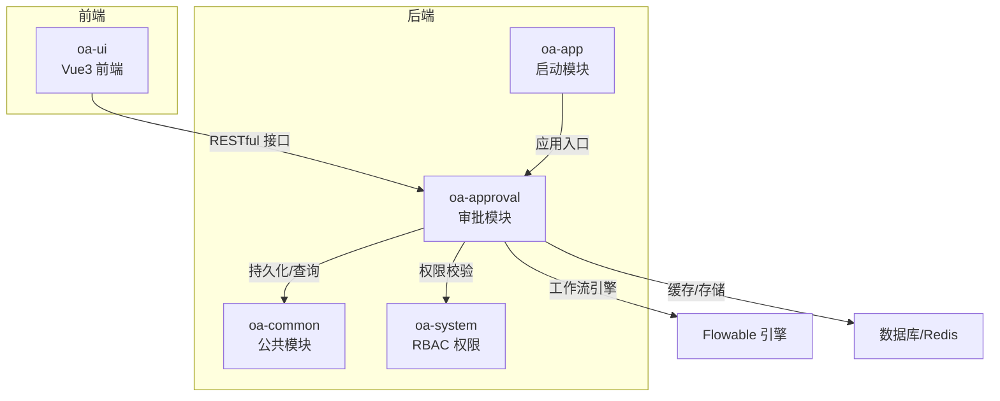
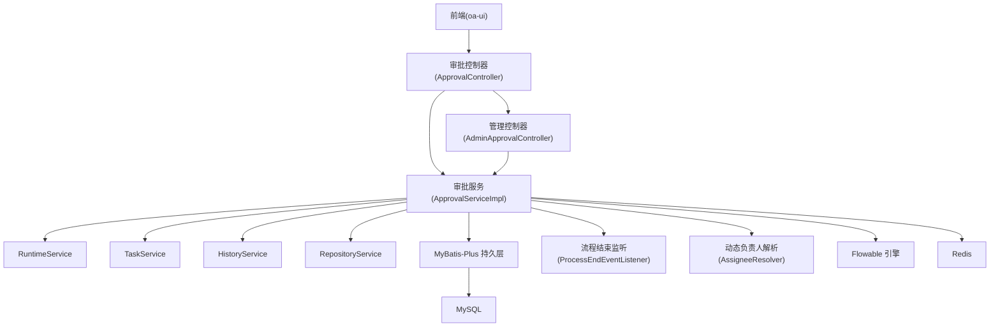
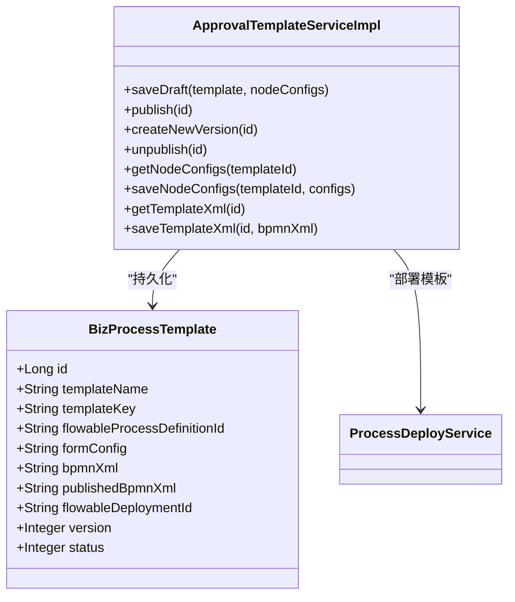
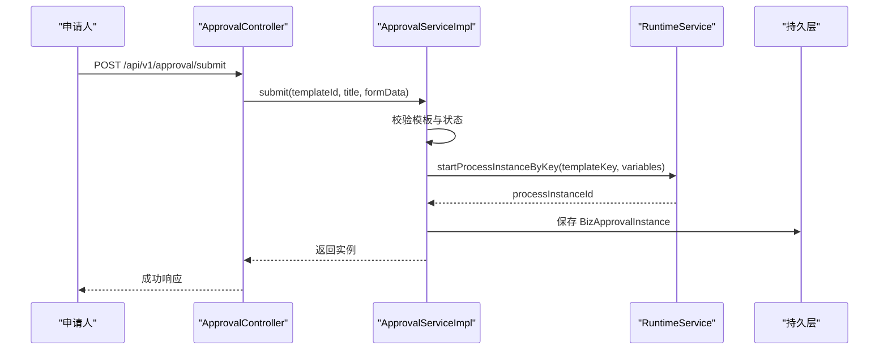
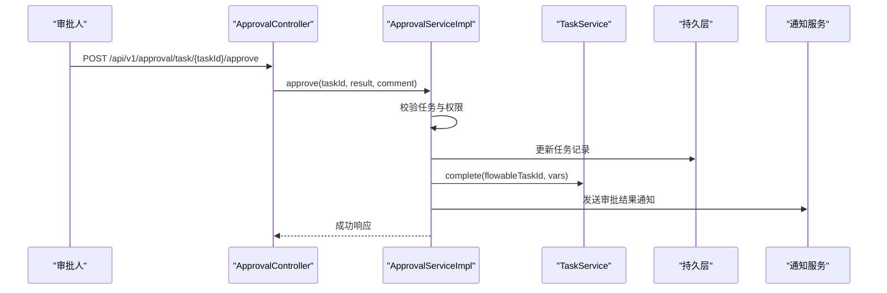
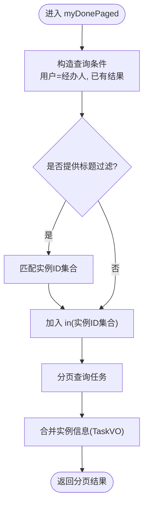
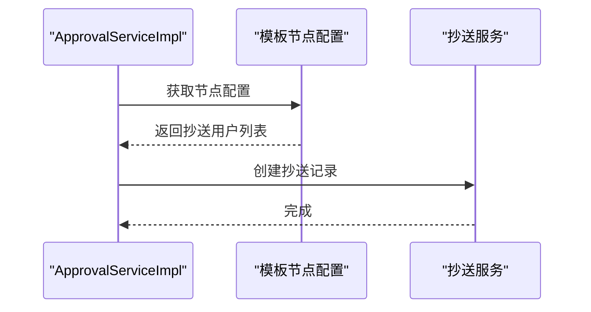
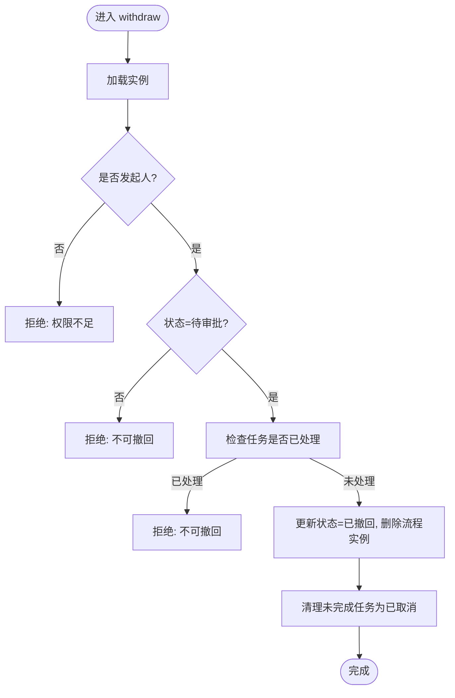
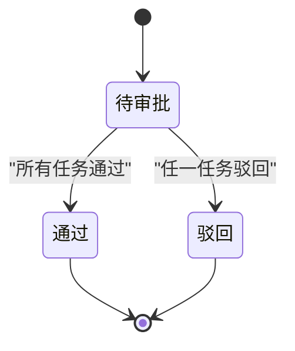
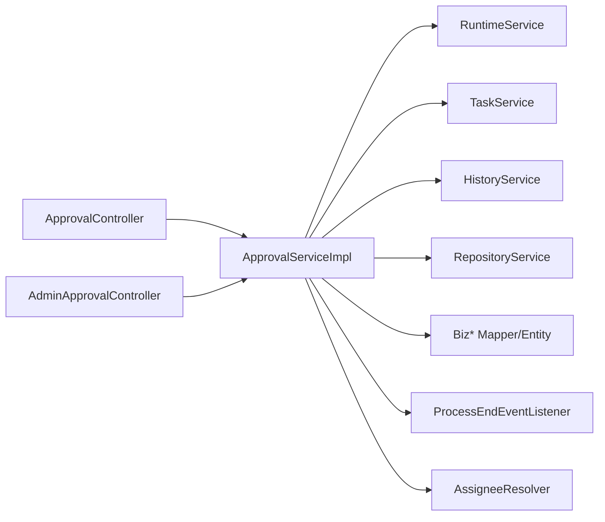

# 审批流引擎

<cite>
**本文引用的文件**
- [README.md](file://README.md)
- [FlowableConfig.java](file://oa-approval/src/main/java/com/oa/admin/approval/config/FlowableConfig.java)
- [ApprovalController.java](file://oa-approval/src/main/java/com/oa/admin/approval/controller/ApprovalController.java)
- [AdminApprovalController.java](file://oa-approval/src/main/java/com/oa/admin/approval/controller/AdminApprovalController.java)
- [ApprovalServiceImpl.java](file://oa-approval/src/main/java/com/oa/admin/approval/service/impl/ApprovalServiceImpl.java)
- [ApprovalTemplateServiceImpl.java](file://oa-approval/src/main/java/com/oa/admin/approval/service/impl/ApprovalTemplateServiceImpl.java)
- [ProcessEndEventListener.java](file://oa-approval/src/main/java/com/oa/admin/approval/listener/ProcessEndEventListener.java)
- [AssigneeResolver.java](file://oa-approval/src/main/java/com/oa/admin/approval/resolver/AssigneeResolver.java)
- [BizProcessTemplate.java](file://oa-approval/src/main/java/com/oa/admin/approval/entity/BizProcessTemplate.java)
- [BizApprovalInstance.java](file://oa-approval/src/main/java/com/oa/admin/approval/entity/BizApprovalInstance.java)
- [BizApprovalTask.java](file://oa-approval/src/main/java/com/oa/admin/approval/entity/BizApprovalTask.java)
- [ApprovalInstanceStatus.java](file://oa-approval/src/main/java/com/oa/admin/approval/enums/ApprovalInstanceStatus.java)
- [ApprovalTaskResult.java](file://oa-approval/src/main/java/com/oa/admin/approval/enums/ApprovalTaskResult.java)
- [ApprovalTaskType.java](file://oa-approval/src/main/java/com/oa/admin/approval/enums/ApprovalTaskType.java)
- [TaskVO.java](file://oa-approval/src/main/java/com/oa/admin/approval/dto/TaskVO.java)
- [InstanceVO.java](file://oa-approval/src/main/java/com/oa/admin/approval/dto/InstanceVO.java)
</cite>

## 目录
1. [简介](#简介)
2. [项目结构](#项目结构)
3. [核心组件](#核心组件)
4. [架构总览](#架构总览)
5. [详细组件分析](#详细组件分析)
6. [依赖关系分析](#依赖关系分析)
7. [性能考量](#性能考量)
8. [故障排查指南](#故障排查指南)
9. [结论](#结论)
10. [附录：API 接口与使用示例](#附录api-接口与使用示例)

## 简介
本项目基于 Flowable 工作流引擎，提供完整的审批流能力，包括审批模板管理（含表单字段 JSON 配置）、发起审批、我的申请、我的待办（通过/驳回+审批意见）、我的已办（历史记录）、抄送记录和撤回等七大核心功能。系统采用 Spring Boot + MyBatis-Plus + Sa-Token 架构，统一 RESTful 接口风格，支持 RBAC 权限控制与审计日志。

## 项目结构
- 后端模块
  - oa-common：公共基础（统一响应、异常、实体基类）
  - oa-system：RBAC 权限体系（用户/角色/权限/部门）
  - oa-approval：审批模块（Flowable 集成、模板、实例、任务、抄送、监听器、解析器）
  - oa-app：启动模块（配置、Flyway 迁移、入口）
  - oa-ui：前端（Vue 3 + TypeScript + Vite）
- 前端页面路由涵盖登录、仪表盘、系统管理、审批模板、我的申请、我的待办、我的已办、抄送等

章节来源
- [README.md: 48-108:48-108](file://README.md#L48-L108)

## 核心组件
- 控制层
  - 审批控制器：提供提交、审批、待办/已办分页、转办、撤回、实例详情、流程图、仪表盘统计、模板 CRUD、抄送等接口
  - 管理端控制器：提供管理员视角的实例列表、终止、重分配任务、指标统计
- 服务层
  - 审批服务：封装 Flowable 与业务实体的交互，实现提交、审批、转办、撤回、终止、统计、流程图渲染等
  - 模板服务：模板草稿/发布/版本管理、XML 编辑、节点配置管理
- 监听器与解析器
  - 流程结束事件监听：根据任务结果计算实例最终状态并发布完成事件
  - 动态负责人解析器：从组织架构动态解析部门领导、逐级上级等
- 数据模型
  - BizProcessTemplate：模板元数据（名称、key、formConfig、bpmn、发布版等）
  - BizApprovalInstance：审批实例（标题、发起人、状态、表单数据、流程实例ID）
  - BizApprovalTask：审批任务（任务名、类型、结果、评论、完成时间）

章节来源
- [ApprovalController.java: 29-251:29-251](file://oa-approval/src/main/java/com/oa/admin/approval/controller/ApprovalController.java#L29-L251)
- [AdminApprovalController.java: 15-55:15-55](file://oa-approval/src/main/java/com/oa/admin/approval/controller/AdminApprovalController.java#L15-L55)
- [ApprovalServiceImpl.java: 57-791:57-791](file://oa-approval/src/main/java/com/oa/admin/approval/service/impl/ApprovalServiceImpl.java#L57-L791)
- [ApprovalTemplateServiceImpl.java: 25-162:25-162](file://oa-approval/src/main/java/com/oa/admin/approval/service/impl/ApprovalTemplateServiceImpl.java#L25-L162)
- [ProcessEndEventListener.java: 26-79:26-79](file://oa-approval/src/main/java/com/oa/admin/approval/listener/ProcessEndEventListener.java#L26-L79)
- [AssigneeResolver.java: 19-61:19-61](file://oa-approval/src/main/java/com/oa/admin/approval/resolver/AssigneeResolver.java#L19-L61)
- [BizProcessTemplate.java: 13-28:13-28](file://oa-approval/src/main/java/com/oa/admin/approval/entity/BizProcessTemplate.java#L13-L28)
- [BizApprovalInstance.java: 16-32:16-32](file://oa-approval/src/main/java/com/oa/admin/approval/entity/BizApprovalInstance.java#L16-L32)
- [BizApprovalTask.java: 16-34:16-34](file://oa-approval/src/main/java/com/oa/admin/approval/entity/BizApprovalTask.java#L16-L34)

## 架构总览
审批系统围绕 Flowable 引擎构建，后端通过 Spring Boot 与 Flowable 集成，使用 MyBatis-Plus 持久化业务实体；前端通过 RESTful API 与后端交互；权限通过 Sa-Token 注解进行接口级校验。

图表来源
- [FlowableConfig.java: 15-30:15-30](file://oa-approval/src/main/java/com/oa/admin/approval/config/FlowableConfig.java#L15-L30)
- [ProcessEndEventListener.java: 26-79:26-79](file://oa-approval/src/main/java/com/oa/admin/approval/listener/ProcessEndEventListener.java#L26-L79)
- [AssigneeResolver.java: 19-61:19-61](file://oa-approval/src/main/java/com/oa/admin/approval/resolver/AssigneeResolver.java#L19-L61)
- [ApprovalController.java: 29-251:29-251](file://oa-approval/src/main/java/com/oa/admin/approval/controller/ApprovalController.java#L29-L251)
- [AdminApprovalController.java: 15-55:15-55](file://oa-approval/src/main/java/com/oa/admin/approval/controller/AdminApprovalController.java#L15-L55)

## 详细组件分析

### 审批模板管理（表单字段 JSON 配置）
- 功能要点
  - 模板草稿保存、发布、版本管理（新建版本、取消发布）
  - BPMN XML 编辑与持久化（仅草稿可用）
  - 节点配置管理（节点 ID/名称、抄送配置等）
  - 表单字段 JSON 配置（模板 formConfig 字段用于驱动前端表单渲染）
- 设计原则
  - 草稿与发布分离，确保发布稳定性
  - 节点配置与模板解耦，便于可视化设计器扩展
- 复杂度与性能
  - XML 读写与部署涉及 IO，建议在发布前做格式校验
  - 节点配置批量删除/插入，注意事务一致性

图表来源
- [BizProcessTemplate.java: 13-28:13-28](file://oa-approval/src/main/java/com/oa/admin/approval/entity/BizProcessTemplate.java#L13-L28)
- [ApprovalTemplateServiceImpl.java: 25-162:25-162](file://oa-approval/src/main/java/com/oa/admin/approval/service/impl/ApprovalTemplateServiceImpl.java#L25-L162)

章节来源
- [ApprovalTemplateServiceImpl.java: 42-161:42-161](file://oa-approval/src/main/java/com/oa/admin/approval/service/impl/ApprovalTemplateServiceImpl.java#L42-L161)
- [BizProcessTemplate.java: 13-28:13-28](file://oa-approval/src/main/java/com/oa/admin/approval/entity/BizProcessTemplate.java#L13-L28)

### 发起审批
- 流程步骤
  - 校验模板存在且已发布
  - 解析表单 JSON 作为流程变量
  - 启动流程实例，创建审批实例记录
  - 写入审计日志
- 关键点
  - 表单字段 JSON 作为流程变量注入 Flowable
  - 实例状态初始为“待审批”
- 复杂度
  - JSON 解析失败不影响流程启动，但可能影响后续变量使用

图表来源
- [ApprovalController.java: 37-44:37-44](file://oa-approval/src/main/java/com/oa/admin/approval/controller/ApprovalController.java#L37-L44)
- [ApprovalServiceImpl.java: 122-168:122-168](file://oa-approval/src/main/java/com/oa/admin/approval/service/impl/ApprovalServiceImpl.java#L122-L168)

章节来源
- [ApprovalController.java: 37-44:37-44](file://oa-approval/src/main/java/com/oa/admin/approval/controller/ApprovalController.java#L37-L44)
- [ApprovalServiceImpl.java: 122-168:122-168](file://oa-approval/src/main/java/com/oa/admin/approval/service/impl/ApprovalServiceImpl.java#L122-L168)

### 我的待办（通过/驳回+审批意见）
- 流程步骤
  - 校验任务存在且未处理
  - 校验当前用户为任务负责人
  - 更新本地任务记录（结果、评论、完成时间）
  - 完成 Flowable 任务，并设置流程变量（是否通过）
  - 写入审计日志
  - 通知发起人审批结果
  - 若节点配置了抄送，则触发抄送
- 关键点
  - 任务结果枚举化，避免非法值
  - 通过/驳回分别触发不同通知
  - 抄送按节点维度配置

图表来源
- [ApprovalController.java: 46-53:46-53](file://oa-approval/src/main/java/com/oa/admin/approval/controller/ApprovalController.java#L46-L53)
- [ApprovalServiceImpl.java: 170-240:170-240](file://oa-approval/src/main/java/com/oa/admin/approval/service/impl/ApprovalServiceImpl.java#L170-L240)

章节来源
- [ApprovalController.java: 46-53:46-53](file://oa-approval/src/main/java/com/oa/admin/approval/controller/ApprovalController.java#L46-L53)
- [ApprovalServiceImpl.java: 170-240:170-240](file://oa-approval/src/main/java/com/oa/admin/approval/service/impl/ApprovalServiceImpl.java#L170-L240)

### 我的已办（历史记录）
- 查询逻辑
  - 基于当前用户与已处理任务过滤
  - 支持标题模糊匹配与分页
  - 将任务与实例信息合并返回（TaskVO）
- 性能
  - 使用一次性查询实例集合，减少多次查询

图表来源
- [ApprovalServiceImpl.java: 489-517:489-517](file://oa-approval/src/main/java/com/oa/admin/approval/service/impl/ApprovalServiceImpl.java#L489-L517)
- [TaskVO.java: 13-33:13-33](file://oa-approval/src/main/java/com/oa/admin/approval/dto/TaskVO.java#L13-L33)

章节来源
- [ApprovalServiceImpl.java: 489-517:489-517](file://oa-approval/src/main/java/com/oa/admin/approval/service/impl/ApprovalServiceImpl.java#L489-L517)
- [TaskVO.java: 13-33:13-33](file://oa-approval/src/main/java/com/oa/admin/approval/dto/TaskVO.java#L13-L33)

### 抄送记录
- 触发机制
  - 审批节点完成后，若节点配置了抄送用户列表，则创建抄送记录
  - 抄送记录支持标记已读
- 查询与标记
  - 查询“我”的抄送列表
  - 标记某条抄送为已读

图表来源
- [ApprovalServiceImpl.java: 604-617:604-617](file://oa-approval/src/main/java/com/oa/admin/approval/service/impl/ApprovalServiceImpl.java#L604-L617)

章节来源
- [ApprovalController.java: 217-228:217-228](file://oa-approval/src/main/java/com/oa/admin/approval/controller/ApprovalController.java#L217-L228)
- [ApprovalServiceImpl.java: 604-617:604-617](file://oa-approval/src/main/java/com/oa/admin/approval/service/impl/ApprovalServiceImpl.java#L604-L617)

### 撤回
- 规则
  - 仅“发起人”可撤回
  - 仅“待审批”状态可撤回
  - 任一节点已处理则不可撤回
- 执行
  - 更新实例状态为“已撤回”，删除流程实例
  - 清理未完成的任务为“已取消”

图表来源
- [ApprovalServiceImpl.java: 264-307:264-307](file://oa-approval/src/main/java/com/oa/admin/approval/service/impl/ApprovalServiceImpl.java#L264-L307)

章节来源
- [ApprovalController.java: 94-99:94-99](file://oa-approval/src/main/java/com/oa/admin/approval/controller/ApprovalController.java#L94-L99)
- [ApprovalServiceImpl.java: 264-307:264-307](file://oa-approval/src/main/java/com/oa/admin/approval/service/impl/ApprovalServiceImpl.java#L264-L307)

### 管理端能力
- 管理员可查看所有实例、终止待审批实例、重分配任务、查看指标
- 终止实例会更新状态并清理未完成任务，同时通知发起人

章节来源
- [AdminApprovalController.java: 21-54:21-54](file://oa-approval/src/main/java/com/oa/admin/approval/controller/AdminApprovalController.java#L21-L54)
- [ApprovalServiceImpl.java: 663-705:663-705](file://oa-approval/src/main/java/com/oa/admin/approval/service/impl/ApprovalServiceImpl.java#L663-L705)

### 流程定义规范与状态流转
- 流程定义
  - BPMN XML 由模板维护，发布后部署到 Flowable
  - 节点可通过 UEL 表达式调用 AssigneeResolver 动态解析负责人
- 状态机
  - 实例状态：待审批 → 通过/驳回（由最终任务决定）
  - 任务结果：通过、驳回、转办、取消
- 监听器
  - 流程结束事件监听器根据任务结果更新实例状态并发布完成事件

图表来源
- [ProcessEndEventListener.java: 34-62:34-62](file://oa-approval/src/main/java/com/oa/admin/approval/listener/ProcessEndEventListener.java#L34-L62)
- [ApprovalInstanceStatus.java: 11-18:11-18](file://oa-approval/src/main/java/com/oa/admin/approval/enums/ApprovalInstanceStatus.java#L11-L18)
- [ApprovalTaskResult.java: 11-15:11-15](file://oa-approval/src/main/java/com/oa/admin/approval/enums/ApprovalTaskResult.java#L11-L15)

章节来源
- [ProcessEndEventListener.java: 34-62:34-62](file://oa-approval/src/main/java/com/oa/admin/approval/listener/ProcessEndEventListener.java#L34-L62)
- [AssigneeResolver.java: 19-61:19-61](file://oa-approval/src/main/java/com/oa/admin/approval/resolver/AssigneeResolver.java#L19-L61)
- [BizApprovalInstance.java: 26-27:26-27](file://oa-approval/src/main/java/com/oa/admin/approval/entity/BizApprovalInstance.java#L26-L27)
- [BizApprovalTask.java: 28-29:28-29](file://oa-approval/src/main/java/com/oa/admin/approval/entity/BizApprovalTask.java#L28-L29)

## 依赖关系分析
- 组件耦合
  - 控制器依赖服务层；服务层依赖 Flowable 四大 Service 与持久层
  - 监听器与解析器以组件形式注入，降低耦合
- 外部依赖
  - Flowable 引擎（Spring Boot Starter）
  - Sa-Token（接口权限）
  - MyBatis-Plus（ORM）
  - Redis（可选缓存）

图表来源
- [ApprovalController.java: 29-251:29-251](file://oa-approval/src/main/java/com/oa/admin/approval/controller/ApprovalController.java#L29-L251)
- [AdminApprovalController.java: 15-55:15-55](file://oa-approval/src/main/java/com/oa/admin/approval/controller/AdminApprovalController.java#L15-L55)
- [ApprovalServiceImpl.java: 57-791:57-791](file://oa-approval/src/main/java/com/oa/admin/approval/service/impl/ApprovalServiceImpl.java#L57-L791)
- [ProcessEndEventListener.java: 26-79:26-79](file://oa-approval/src/main/java/com/oa/admin/approval/listener/ProcessEndEventListener.java#L26-L79)
- [AssigneeResolver.java: 19-61:19-61](file://oa-approval/src/main/java/com/oa/admin/approval/resolver/AssigneeResolver.java#L19-L61)

章节来源
- [FlowableConfig.java: 15-30:15-30](file://oa-approval/src/main/java/com/oa/admin/approval/config/FlowableConfig.java#L15-L30)
- [ApprovalServiceImpl.java: 57-791:57-791](file://oa-approval/src/main/java/com/oa/admin/approval/service/impl/ApprovalServiceImpl.java#L57-L791)

## 性能考量
- 查询优化
  - 分页查询配合索引（实例ID、任务负责人、创建时间等）
  - 合并任务与实例信息时使用一次批量查询
- 事务与锁
  - 审批、转办、撤回等关键操作使用事务保证一致性
- 监听器与事件
  - 流程结束监听器在事件回调中计算最终状态，避免重复扫描
- 缓存
  - 可对常用模板、节点配置进行缓存（建议结合 Redis）

## 故障排查指南
- 常见错误与定位
  - 参数错误：模板不存在、模板未发布、任务不存在或已处理、权限不足、不可撤回/终止
  - JSON 解析失败：表单字段非合法 JSON，系统会忽略并继续流程
  - 流程删除失败：实例状态非待审批或已终止
- 日志与审计
  - 审计日志记录提交、审批、转办、撤回、终止等关键动作
  - 监听器日志输出流程完成与最终状态

章节来源
- [ApprovalServiceImpl.java: 122-168:122-168](file://oa-approval/src/main/java/com/oa/admin/approval/service/impl/ApprovalServiceImpl.java#L122-L168)
- [ApprovalServiceImpl.java: 170-240:170-240](file://oa-approval/src/main/java/com/oa/admin/approval/service/impl/ApprovalServiceImpl.java#L170-L240)
- [ApprovalServiceImpl.java: 264-307:264-307](file://oa-approval/src/main/java/com/oa/admin/approval/service/impl/ApprovalServiceImpl.java#L264-L307)
- [ApprovalServiceImpl.java: 663-705:663-705](file://oa-approval/src/main/java/com/oa/admin/approval/service/impl/ApprovalServiceImpl.java#L663-L705)

## 结论
本审批流引擎以 Flowable 为核心，结合模板化表单与动态负责人解析，提供了从模板设计到流程执行、从任务处理到结果通知的完整闭环。通过清晰的职责划分与事件驱动机制，系统具备良好的扩展性与可维护性。建议在生产环境中完善监控与告警、引入缓存与异步通知，并持续优化流程图渲染与查询性能。

## 附录：API 接口与使用示例

- 统一约定
  - 基础路径：/api/v1
  - 认证头：satoken: {token}
  - 响应体：{ "code": 200, "msg": "success", "data": {...}, "timestamp": 1234567890 }
  - 分页：{ "code": 200, "data": { "list": [...], "total": 100, "page": 1, "pageSize": 20 } }

- 审批相关
  - 提交审批
    - POST /api/v1/approval/submit
    - 请求体字段：templateId, title, formData(JSON)
    - 返回：审批实例
  - 审批任务（通过/驳回）
    - POST /api/v1/approval/task/{taskId}/approve
    - 请求体字段：result(1=通过, 2=驳回), comment
    - 返回：空
  - 我的待办（列表）
    - GET /api/v1/approval/my-todo
    - 返回：任务列表
  - 我的待办（分页）
    - GET /api/v1/approval/my-todo/paged?page=&pageSize=&title=
    - 返回：分页任务列表(TaskVO)
  - 我的已办（分页）
    - GET /api/v1/approval/my-done/paged?page=&pageSize=&title=
    - 返回：分页任务列表(TaskVO)
  - 转办
    - POST /api/v1/approval/task/{taskId}/transfer
    - 请求体字段：targetUserId, reason
    - 返回：空
  - 撤回
    - POST /api/v1/approval/{instanceId}/withdraw
    - 返回：空
  - 实例任务列表
    - GET /api/v1/approval/instance/{instanceId}/tasks
    - 返回：该实例的任务列表
  - 我的申请
    - GET /api/v1/approval/my-applications?page=&pageSize=&title=&status=
    - 返回：分页实例列表
  - 实例详情
    - GET /api/v1/approval/instance/{instanceId}
    - 返回：实例详情
  - 实例流程图
    - GET /api/v1/approval/instance/{instanceId}/diagram
    - 返回：bpmnXml、已完成节点ID、当前节点ID
  - 仪表盘统计
    - GET /api/v1/approval/dashboard/stats
    - 返回：待办数、已办数、模板数、未读抄送数、近期活动

- 模板相关
  - 列表
    - GET /api/v1/approval/template?page=&pageSize=&templateName=&status=
    - 返回：分页模板列表
  - 详情
    - GET /api/v1/approval/template/{id}
    - 返回：模板详情
  - 新增
    - POST /api/v1/approval/template
    - 请求体：模板对象
    - 返回：新增模板
  - 修改
    - PUT /api/v1/approval/template/{id}
    - 请求体：模板对象
    - 返回：更新后的模板
  - 删除
    - DELETE /api/v1/approval/template/{id}
    - 返回：空
  - 发布
    - POST /api/v1/approval/template/{id}/publish
    - 返回：发布后的模板
  - 取消发布
    - POST /api/v1/approval/template/{id}/unpublish
    - 返回：取消后的模板
  - 获取 BPMN XML
    - GET /api/v1/approval/template/{id}/xml
    - 返回：bpmnXml
  - 保存 BPMN XML
    - PUT /api/v1/approval/template/{id}/xml
    - 请求体：{ "bpmnXml": "..." }
    - 返回：空
  - 节点配置
    - GET /api/v1/approval/template/{id}/node-config
    - 返回：节点配置列表
    - PUT /api/v1/approval/template/{id}/node-config
    - 请求体：节点配置数组
    - 返回：空
  - 新建版本
    - POST /api/v1/approval/template/{id}/new-version
    - 返回：新版本草稿

- 抄送相关
  - 我的抄送
    - GET /api/v1/approval/cc
    - 返回：抄送列表(CcVO)
  - 标记已读
    - POST /api/v1/approval/cc/{ccId}/read
    - 返回：空

- 管理端
  - 实例列表
    - GET /api/v1/admin/approval/instances?page=&pageSize=&title=&status=&templateId=&initiatorUserId=&startTime=&endTime=
    - 返回：分页实例列表(InstanceVO)
  - 终止实例
    - POST /api/v1/admin/approval/instances/{instanceId}/terminate
    - 返回：空
  - 重分配任务
    - POST /api/v1/admin/approval/tasks/{taskId}/reassign?targetUserId=...
    - 返回：空
  - 指标
    - GET /api/v1/admin/approval/metrics
    - 返回：指标统计

章节来源
- [ApprovalController.java: 37-251:37-251](file://oa-approval/src/main/java/com/oa/admin/approval/controller/ApprovalController.java#L37-L251)
- [AdminApprovalController.java: 21-54:21-54](file://oa-approval/src/main/java/com/oa/admin/approval/controller/AdminApprovalController.java#L21-L54)
- [InstanceVO.java: 9-20:9-20](file://oa-approval/src/main/java/com/oa/admin/approval/dto/InstanceVO.java#L9-L20)
- [TaskVO.java: 13-33:13-33](file://oa-approval/src/main/java/com/oa/admin/approval/dto/TaskVO.java#L13-L33)