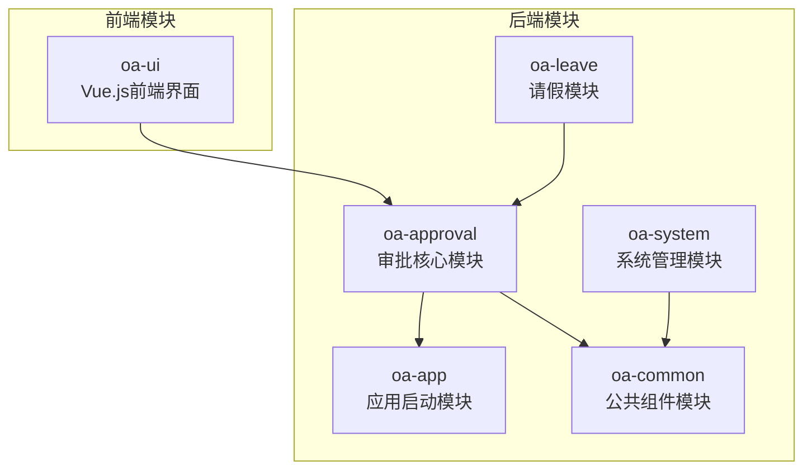
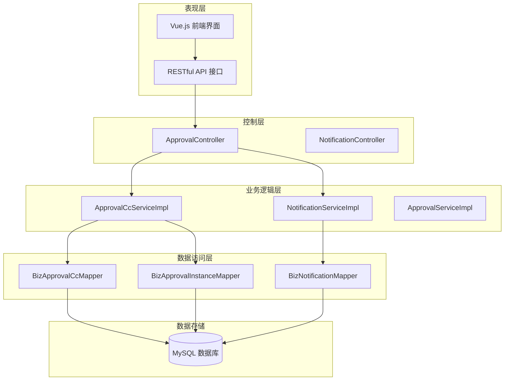
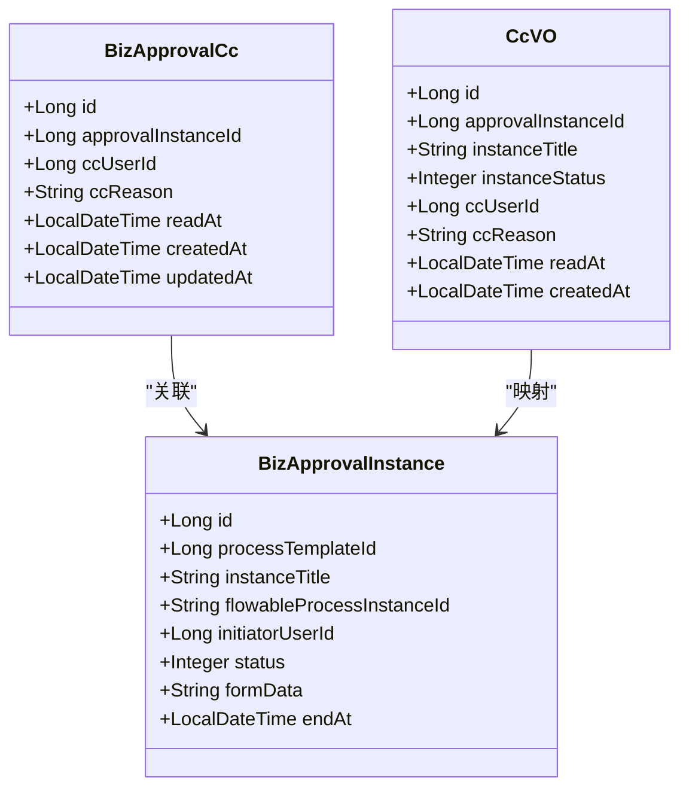
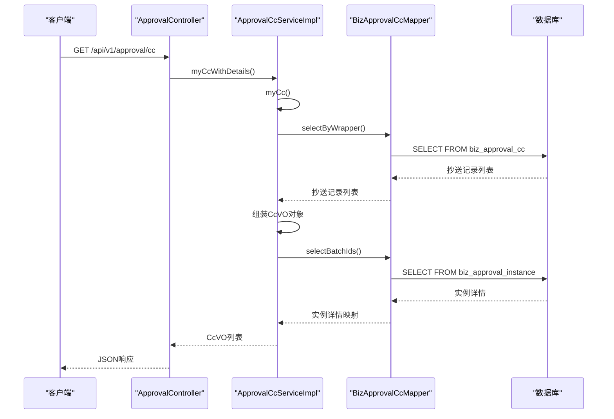
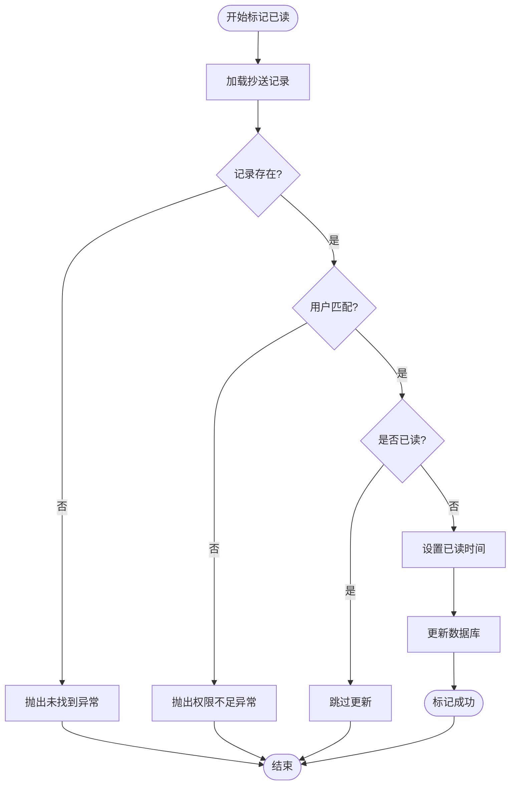
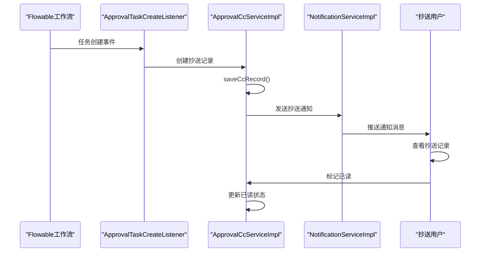
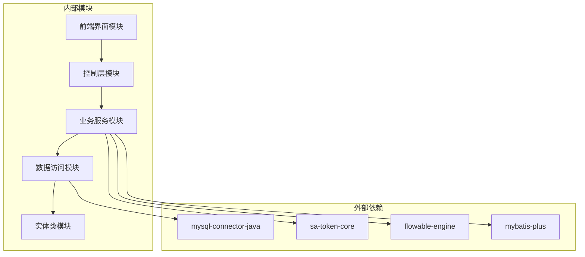

# 抄送管理系统

<cite>
**本文档引用的文件**
- [BizApprovalCc.java](file://oa-approval/src/main/java/com/oa/admin/approval/entity/BizApprovalCc.java)
- [ApprovalCcService.java](file://oa-approval/src/main/java/com/oa/admin/approval/service/ApprovalCcService.java)
- [ApprovalCcServiceImpl.java](file://oa-approval/src/main/java/com/oa/admin/approval/service/impl/ApprovalCcServiceImpl.java)
- [BizApprovalCcMapper.java](file://oa-approval/src/main/java/com/oa/admin/approval/mapper/BizApprovalCcMapper.java)
- [CcVO.java](file://oa-approval/src/main/java/com/oa/admin/approval/dto/CcVO.java)
- [ApprovalController.java](file://oa-approval/src/main/java/com/oa/admin/approval/controller/ApprovalController.java)
- [NotificationService.java](file://oa-approval/src/main/java/com/oa/admin/approval/service/NotificationService.java)
- [NotificationServiceImpl.java](file://oa-approval/src/main/java/com/oa/admin/approval/service/impl/NotificationServiceImpl.java)
- [NotificationType.java](file://oa-approval/src/main/java/com/oa/admin/approval/enums/NotificationType.java)
- [BizApprovalInstance.java](file://oa-approval/src/main/java/com/oa/admin/approval/entity/BizApprovalInstance.java)
- [V2__init_biz_tables.sql](file://oa-app/src/main/resources/db/migration/V2__init_biz_tables.sql)
- [index.vue](file://oa-ui/src/views/approval/cc/index.vue)
- [approval.ts](file://oa-ui/src/api/approval.ts)
- [approval.ts 类型定义](file://oa-ui/src/types/approval.ts)
- [ApprovalCcServiceTest.java](file://oa-approval/src/test/java/com/oa/admin/approval/service/ApprovalCcServiceTest.java)
</cite>

## 目录
1. [简介](#简介)
2. [项目结构](#项目结构)
3. [核心组件](#核心组件)
4. [架构概览](#架构概览)
5. [详细组件分析](#详细组件分析)
6. [依赖关系分析](#依赖关系分析)
7. [性能考虑](#性能考虑)
8. [故障排除指南](#故障排除指南)
9. [结论](#结论)
10. [附录：API接口说明](#附录api接口说明)

## 简介

抄送管理系统是OA审批流程中的重要组成部分，负责处理审批流程中的抄送功能。该系统实现了抄送人选择、抄送通知机制、抄送状态管理和抄送记录的完整生命周期管理。

系统基于Flowable工作流引擎构建，采用分层架构设计，包含数据访问层、业务逻辑层、控制层和用户界面层。核心功能包括：
- 抄送记录的创建和查询
- 抄送状态的标记已读
- 抄送通知的推送机制
- 权限控制和数据安全
- 与主审批流程的深度集成

## 项目结构

项目采用多模块架构，抄送管理功能主要分布在以下模块中：



**图表来源**
- [ApprovalController.java:1-252](file://oa-approval/src/main/java/com/oa/admin/approval/controller/ApprovalController.java#L1-L252)
- [BizApprovalCc.java:1-29](file://oa-approval/src/main/java/com/oa/admin/approval/entity/BizApprovalCc.java#L1-L29)

**章节来源**
- [ApprovalController.java:1-252](file://oa-approval/src/main/java/com/oa/admin/approval/controller/ApprovalController.java#L1-L252)
- [BizApprovalCc.java:1-29](file://oa-approval/src/main/java/com/oa/admin/approval/entity/BizApprovalCc.java#L1-L29)

## 核心组件

抄送管理系统的核心组件包括数据模型、服务层、控制器和前端界面：

### 数据模型层
- **BizApprovalCc**: 抄送记录实体，包含抄送实例ID、抄送用户ID、抄送原因和已读时间
- **CcVO**: 抄送视图对象，用于前端展示，包含实例标题和状态信息
- **BizApprovalInstance**: 审批实例实体，与抄送记录建立关联关系

### 服务层
- **ApprovalCcService**: 抄送服务接口，定义抄送功能的核心方法
- **ApprovalCcServiceImpl**: 抄送服务实现，处理业务逻辑和数据操作
- **NotificationService**: 通知服务接口，支持批量通知发送
- **NotificationServiceImpl**: 通知服务实现，处理系统通知逻辑

### 控制器层
- **ApprovalController**: 审批控制器，提供RESTful API接口
- **NotificationController**: 通知控制器，处理通知相关请求

**章节来源**
- [BizApprovalCc.java:1-29](file://oa-approval/src/main/java/com/oa/admin/approval/entity/BizApprovalCc.java#L1-L29)
- [CcVO.java:1-26](file://oa-approval/src/main/java/com/oa/admin/approval/dto/CcVO.java#L1-L26)
- [ApprovalCcService.java:1-22](file://oa-approval/src/main/java/com/oa/admin/approval/service/ApprovalCcService.java#L1-L22)
- [ApprovalCcServiceImpl.java:1-103](file://oa-approval/src/main/java/com/oa/admin/approval/service/impl/ApprovalCcServiceImpl.java#L1-L103)

## 架构概览

抄送管理系统采用分层架构设计，确保关注点分离和代码可维护性：



**图表来源**
- [ApprovalController.java:29-252](file://oa-approval/src/main/java/com/oa/admin/approval/controller/ApprovalController.java#L29-L252)
- [ApprovalCcServiceImpl.java:27-103](file://oa-approval/src/main/java/com/oa/admin/approval/service/impl/ApprovalCcServiceImpl.java#L27-L103)
- [NotificationServiceImpl.java:23-94](file://oa-approval/src/main/java/com/oa/admin/approval/service/impl/NotificationServiceImpl.java#L23-L94)

系统采用以下设计原则：
- **单一职责原则**: 每个组件专注于特定的功能领域
- **依赖倒置原则**: 上层组件不依赖于下层的具体实现
- **开闭原则**: 对扩展开放，对修改封闭
- **接口隔离原则**: 客户端不应该依赖它不需要的接口

## 详细组件分析

### 抄送实体模型



**图表来源**
- [BizApprovalCc.java:16-28](file://oa-approval/src/main/java/com/oa/admin/approval/entity/BizApprovalCc.java#L16-L28)
- [CcVO.java:13-26](file://oa-approval/src/main/java/com/oa/admin/approval/dto/CcVO.java#L13-L26)
- [BizApprovalInstance.java:16-32](file://oa-approval/src/main/java/com/oa/admin/approval/entity/BizApprovalInstance.java#L16-L32)

#### 数据模型特性
- **主键设计**: 使用自增ID作为主键，确保数据唯一性
- **索引优化**: 在抄送用户ID和已读时间字段上建立复合索引
- **时间戳管理**: 自动记录创建和更新时间，便于审计追踪
- **JSON格式化**: 支持日期时间的统一格式化输出

**章节来源**
- [BizApprovalCc.java:16-28](file://oa-approval/src/main/java/com/oa/admin/approval/entity/BizApprovalCc.java#L16-L28)
- [V2__init_biz_tables.sql:49-58](file://oa-app/src/main/resources/db/migration/V2__init_biz_tables.sql#L49-L58)

### 抄送服务实现



**图表来源**
- [ApprovalController.java:217-221](file://oa-approval/src/main/java/com/oa/admin/approval/controller/ApprovalController.java#L217-L221)
- [ApprovalCcServiceImpl.java:42-71](file://oa-approval/src/main/java/com/oa/admin/approval/service/impl/ApprovalCcServiceImpl.java#L42-L71)

#### 核心业务流程
1. **查询抄送记录**: 获取当前登录用户的抄送记录
2. **批量查询实例**: 通过实例ID集合批量查询审批实例详情
3. **组装返回数据**: 将抄送记录与实例详情组合成CcVO对象
4. **排序和过滤**: 按创建时间降序排列

**章节来源**
- [ApprovalCcServiceImpl.java:33-71](file://oa-approval/src/main/java/com/oa/admin/approval/service/impl/ApprovalCcServiceImpl.java#L33-L71)

### 已读状态管理



**图表来源**
- [ApprovalCcServiceImpl.java:74-87](file://oa-approval/src/main/java/com/oa/admin/approval/service/impl/ApprovalCcServiceImpl.java#L74-L87)

#### 权限控制机制
- **身份验证**: 使用Sa-Token进行用户身份验证
- **数据隔离**: 确保用户只能操作自己的抄送记录
- **异常处理**: 提供明确的错误码和错误信息

**章节来源**
- [ApprovalCcServiceImpl.java:74-87](file://oa-approval/src/main/java/com/oa/admin/approval/service/impl/ApprovalCcServiceImpl.java#L74-L87)
- [ApprovalCcServiceTest.java:86-141](file://oa-approval/src/test/java/com/oa/admin/approval/service/ApprovalCcServiceTest.java#L86-L141)

### 抄送通知机制



**图表来源**
- [ApprovalTaskCreateListener.java:25-64](file://oa-approval/src/main/java/com/oa/admin/approval/listener/ApprovalTaskCreateListener.java#L25-L64)
- [NotificationType.java:11-20](file://oa-approval/src/main/java/com/oa/admin/approval/enums/NotificationType.java#L11-L20)

#### 通知类型定义
系统支持多种通知类型，包括：
- **pending_task**: 待处理任务通知
- **approved**: 审批通过通知
- **rejected**: 审批拒绝通知
- **cc_received**: 抄送接收通知
- **task_transferred**: 任务转办通知
- **instance_terminated**: 实例终止通知

**章节来源**
- [NotificationType.java:11-20](file://oa-approval/src/main/java/com/oa/admin/approval/enums/NotificationType.java#L11-L20)

### 前端交互界面

```mermaid
graph LR
subgraph "前端界面"
CC_INDEX[抄送列表页面]
CC_TABLE[抄送表格组件]
READ_BUTTON[标记已读按钮]
VIEW_BUTTON[查看详情按钮]
end
subgraph "API调用"
GET_CC[GET /approval/cc]
POST_READ[POST /approval/cc/{ccId}/read]
end
subgraph "状态管理"
LOADING[加载状态]
DATA[抄送数据]
MESSAGE[提示消息]
end
CC_INDEX --> CC_TABLE
CC_TABLE --> READ_BUTTON
CC_TABLE --> VIEW_BUTTON
READ_BUTTON --> POST_READ
VIEW_BUTTON --> CC_INDEX
CC_INDEX --> GET_CC
GET_CC --> DATA
POST_READ --> MESSAGE
GET_CC --> LOADING
```

**图表来源**
- [index.vue:1-61](file://oa-ui/src/views/approval/cc/index.vue#L1-L61)
- [approval.ts:32-38](file://oa-ui/src/api/approval.ts#L32-L38)

**章节来源**
- [index.vue:1-61](file://oa-ui/src/views/approval/cc/index.vue#L1-L61)
- [approval.ts:32-38](file://oa-ui/src/api/approval.ts#L32-L38)

## 依赖关系分析

抄送管理系统各组件之间的依赖关系如下：



**图表来源**
- [ApprovalCcServiceImpl.java:3-15](file://oa-approval/src/main/java/com/oa/admin/approval/service/impl/ApprovalCcServiceImpl.java#L3-L15)
- [NotificationServiceImpl.java:3-15](file://oa-approval/src/main/java/com/oa/admin/approval/service/impl/NotificationServiceImpl.java#L3-L15)

### 关键依赖特性
- **轻量级框架**: 使用Spring Boot简化配置和部署
- **ORM框架**: MyBatis-Plus提供强大的数据访问能力
- **安全框架**: Sa-Token提供完善的认证授权机制
- **工作流引擎**: Flowable支持复杂的业务流程建模

**章节来源**
- [ApprovalCcServiceImpl.java:3-15](file://oa-approval/src/main/java/com/oa/admin/approval/service/impl/ApprovalCcServiceImpl.java#L3-L15)
- [NotificationServiceImpl.java:3-15](file://oa-approval/src/main/java/com/oa/admin/approval/service/impl/NotificationServiceImpl.java#L3-L15)

## 性能考虑

### 数据库优化
- **索引策略**: 在biz_approval_cc表的cc_user_id和read_at字段建立复合索引，提高查询性能
- **批量操作**: 使用selectBatchIds进行批量实例查询，减少数据库往返次数
- **分页查询**: 支持大数据量的分页查询，避免内存溢出

### 缓存策略
- **会话缓存**: 利用Sa-Token的会话管理机制，减少重复的身份验证
- **查询缓存**: 对常用的查询结果进行短期缓存
- **静态资源**: 前端静态资源使用CDN加速

### 并发控制
- **乐观锁**: 使用版本号或时间戳防止并发更新冲突
- **事务管理**: 合理的事务边界设计，确保数据一致性
- **连接池**: 配置合适的数据库连接池参数

## 故障排除指南

### 常见问题及解决方案

#### 抄送记录查询异常
**问题描述**: 用户无法看到自己的抄送记录
**可能原因**:
- 用户身份验证失败
- 数据库连接异常
- 查询条件错误

**解决步骤**:
1. 检查用户登录状态
2. 验证数据库连接配置
3. 确认查询条件的正确性

#### 已读状态更新失败
**问题描述**: 标记已读功能无效
**可能原因**:
- 权限验证失败
- 数据不存在
- 并发更新冲突

**解决步骤**:
1. 验证用户权限
2. 检查抄送记录是否存在
3. 处理并发更新情况

#### 通知推送失败
**问题描述**: 抄送通知没有到达用户
**可能原因**:
- 通知服务配置错误
- 用户设备离线
- 网络连接问题

**解决步骤**:
1. 检查通知服务配置
2. 验证用户设备状态
3. 网络连通性测试

**章节来源**
- [ApprovalCcServiceTest.java:86-165](file://oa-approval/src/test/java/com/oa/admin/approval/service/ApprovalCcServiceTest.java#L86-L165)

### 调试工具和技巧
- **日志分析**: 使用SLF4J记录关键业务流程
- **性能监控**: 监控数据库查询时间和API响应时间
- **单元测试**: 充分的单元测试覆盖关键业务逻辑

## 结论

抄送管理系统通过精心设计的架构和完善的业务逻辑，为OA审批流程提供了可靠的抄送功能。系统具有以下优势：

1. **架构清晰**: 分层设计确保了代码的可维护性和可扩展性
2. **功能完整**: 覆盖了抄送的全生命周期管理
3. **性能优秀**: 通过合理的数据库设计和缓存策略保证了系统性能
4. **安全可靠**: 完善的权限控制和异常处理机制
5. **用户体验**: 友好的前端界面和及时的通知推送

未来可以考虑的改进方向：
- 增加抄送统计分析功能
- 优化移动端用户体验
- 扩展通知渠道支持
- 增强搜索和筛选功能

## 附录：API接口说明

### 抄送查询接口

**获取我的抄送列表**
- **方法**: GET
- **路径**: `/api/v1/approval/cc`
- **权限**: `approval:cc`
- **响应**: `R<List<CcVO>>`
- **说明**: 获取当前登录用户的所有抄送记录，包含实例标题和状态信息

**获取抄送详情**
- **方法**: GET
- **路径**: `/api/v1/approval/cc/{ccId}`
- **权限**: `approval:cc`
- **参数**: `ccId` (路径参数)
- **响应**: `R<CcVO>`
- **说明**: 获取指定抄送记录的详细信息

### 标记已读接口

**标记抄送已读**
- **方法**: POST
- **路径**: `/api/v1/approval/cc/{ccId}/read`
- **权限**: `approval:cc`
- **参数**: `ccId` (路径参数)
- **响应**: `R<Void>`
- **说明**: 将指定抄送记录标记为已读状态

### 抄送统计接口

**抄送统计信息**
- **方法**: GET
- **路径**: `/api/v1/approval/cc/stats`
- **权限**: `approval:cc`
- **响应**: `R<Statistics>`
- **说明**: 获取抄送相关的统计数据，如未读数量、总数量等

### 前端API调用示例

**JavaScript API封装**
```typescript
// 获取我的抄送列表
export function getMyCc() {
  return request.get<never, ApprovalCc[]>('/approval/cc')
}

// 标记抄送已读
export function markCcRead(ccId: number) {
  return request.post<never, void>(`/approval/cc/${ccId}/read`)
}
```

**前端组件使用**
```vue
<template>
  <el-table :data="ccList" v-loading="loading">
    <el-table-column label="操作" width="160">
      <template #default="{ row }">
        <el-button v-if="!row.readAt" @click="handleMarkRead(row.id)">标记已读</el-button>
      </template>
    </el-table-column>
  </el-table>
</template>
```

**章节来源**
- [ApprovalController.java:217-228](file://oa-approval/src/main/java/com/oa/admin/approval/controller/ApprovalController.java#L217-L228)
- [approval.ts:32-38](file://oa-ui/src/api/approval.ts#L32-L38)
- [index.vue:30-57](file://oa-ui/src/views/approval/cc/index.vue#L30-L57)

### 错误码说明

| 错误码 | 描述 | 说明 |
|--------|------|------|
| 401 | UNAUTHORIZED | 未认证或认证失败 |
| 403 | FORBIDDEN | 权限不足，无法访问资源 |
| 404 | NOT_FOUND | 请求的资源不存在 |
| 422 | VALIDATION_ERROR | 参数验证失败 |
| 500 | INTERNAL_ERROR | 服务器内部错误 |

### 数据模型定义

**抄送记录实体**
```typescript
interface ApprovalCc {
  id: number
  approvalInstanceId: number
  instanceTitle?: string
  instanceStatus?: number
  ccUserId: number
  ccReason: string
  readAt: string | null
  createdAt: string
  updatedAt: string
}
```

**章节来源**
- [approval.ts 类型定义:59-69](file://oa-ui/src/types/approval.ts#L59-L69)
- [CcVO.java:13-26](file://oa-approval/src/main/java/com/oa/admin/approval/dto/CcVO.java#L13-L26)