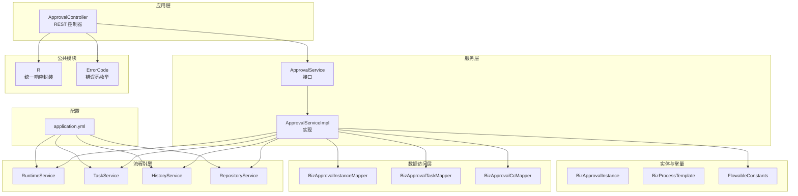
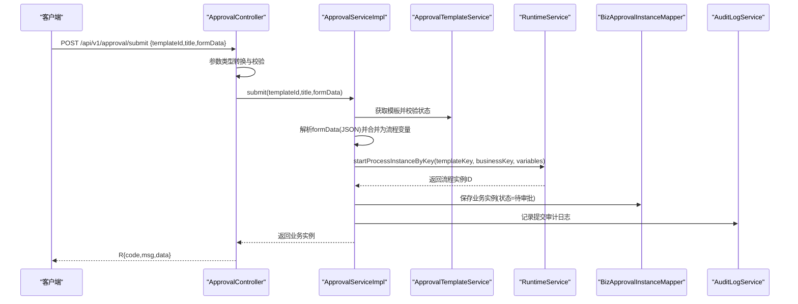
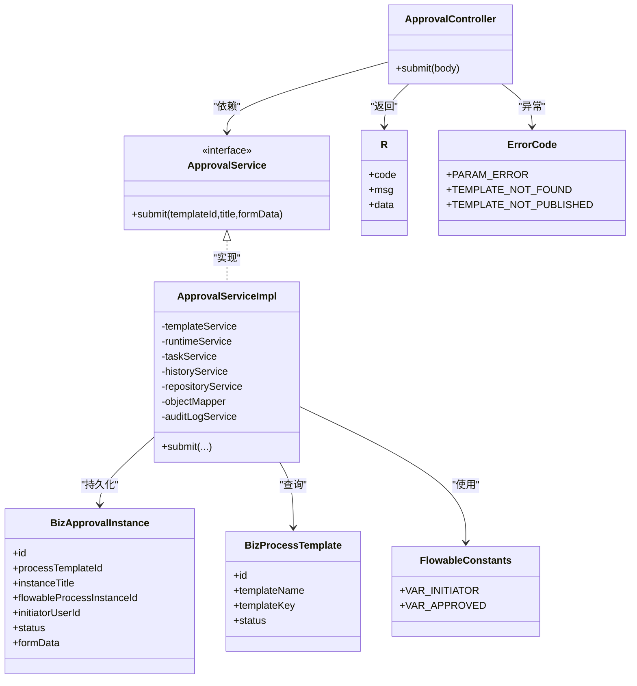

# 流程发起与提交

<cite>
**本文引用的文件**
- [ApprovalController.java](file://oa-approval/src/main/java/com/oa/admin/approval/controller/ApprovalController.java)
- [ApprovalServiceImpl.java](file://oa-approval/src/main/java/com/oa/admin/approval/service/impl/ApprovalServiceImpl.java)
- [ApprovalService.java](file://oa-approval/src/main/java/com/oa/admin/approval/service/ApprovalService.java)
- [BizApprovalInstance.java](file://oa-approval/src/main/java/com/oa/admin/approval/entity/BizApprovalInstance.java)
- [BizProcessTemplate.java](file://oa-approval/src/main/java/com/oa/admin/approval/entity/BizProcessTemplate.java)
- [FlowableConstants.java](file://oa-approval/src/main/java/com/oa/admin/approval/constant/FlowableConstants.java)
- [R.java](file://oa-common/src/main/java/com/oa/admin/common/result/R.java)
- [ErrorCode.java](file://oa-common/src/main/java/com/oa/admin/common/result/ErrorCode.java)
- [application.yml](file://oa-app/src/main/resources/application.yml)
- [ApprovalServiceTest.java](file://oa-approval/src/test/java/com/oa/admin/approval/service/ApprovalServiceTest.java)
</cite>

## 目录
1. [简介](#简介)
2. [项目结构](#项目结构)
3. [核心组件](#核心组件)
4. [架构总览](#架构总览)
5. [组件详解](#组件详解)
6. [依赖关系分析](#依赖关系分析)
7. [性能考量](#性能考量)
8. [故障排查指南](#故障排查指南)
9. [结论](#结论)
10. [附录](#附录)

## 简介
本文件围绕“流程发起与提交”功能，系统性阐述从模板选择、表单数据解析、流程实例创建到初始任务分配的完整链路；深入解释 submit 接口的实现原理（JSON 表单解析、业务数据绑定、流程引擎集成）；覆盖流程实例状态管理、数据持久化策略与异常处理机制；提供 API 使用示例（请求参数、响应格式、错误码）；并说明权限控制、数据校验规则与性能优化策略。

## 项目结构
本项目采用多模块分层架构，审批相关的核心逻辑集中在 oa-approval 模块，公共结果封装与错误码在 oa-common 模块，应用配置在 oa-app 模块。前端交互通过 API 调用后端控制器，控制器调用服务层，服务层与数据库映射器交互，并与流程引擎进行集成。

图表来源
- [ApprovalController.java:37-44](file://oa-approval/src/main/java/com/oa/admin/approval/controller/ApprovalController.java#L37-L44)
- [ApprovalServiceImpl.java:101-111](file://oa-approval/src/main/java/com/oa/admin/approval/service/impl/ApprovalServiceImpl.java#L101-L111)
- [BizApprovalInstance.java:16-32](file://oa-approval/src/main/java/com/oa/admin/approval/entity/BizApprovalInstance.java#L16-L32)
- [BizProcessTemplate.java:13-28](file://oa-approval/src/main/java/com/oa/admin/approval/entity/BizProcessTemplate.java#L13-L28)
- [FlowableConstants.java:6-15](file://oa-approval/src/main/java/com/oa/admin/approval/constant/FlowableConstants.java#L6-L15)
- [R.java:9-43](file://oa-common/src/main/java/com/oa/admin/common/result/R.java#L9-L43)
- [ErrorCode.java:11-44](file://oa-common/src/main/java/com/oa/admin/common/result/ErrorCode.java#L11-L44)
- [application.yml:56-59](file://oa-app/src/main/resources/application.yml#L56-L59)

章节来源
- [ApprovalController.java:29-44](file://oa-approval/src/main/java/com/oa/admin/approval/controller/ApprovalController.java#L29-L44)
- [application.yml:1-59](file://oa-app/src/main/resources/application.yml#L1-L59)

## 核心组件
- 控制器：提供 /api/v1/approval/submit 接口，负责接收请求体、参数校验与权限检查，并返回统一响应。
- 服务实现：执行模板校验、表单 JSON 解析、流程引擎启动、实例持久化、审计日志记录等。
- 实体模型：业务实例、流程模板等，承载持久化字段与状态。
- 常量与工具：流程变量键名、BPMN 文件后缀、条件表达式等。
- 统一响应与错误码：标准化返回结构与错误语义。

章节来源
- [ApprovalController.java:37-44](file://oa-approval/src/main/java/com/oa/admin/approval/controller/ApprovalController.java#L37-L44)
- [ApprovalServiceImpl.java:113-159](file://oa-approval/src/main/java/com/oa/admin/approval/service/impl/ApprovalServiceImpl.java#L113-L159)
- [BizApprovalInstance.java:16-32](file://oa-approval/src/main/java/com/oa/admin/approval/entity/BizApprovalInstance.java#L16-L32)
- [BizProcessTemplate.java:13-28](file://oa-approval/src/main/java/com/oa/admin/approval/entity/BizProcessTemplate.java#L13-L28)
- [FlowableConstants.java:6-15](file://oa-approval/src/main/java/com/oa/admin/approval/constant/FlowableConstants.java#L6-L15)
- [R.java:9-43](file://oa-common/src/main/java/com/oa/admin/common/result/R.java#L9-L43)
- [ErrorCode.java:11-44](file://oa-common/src/main/java/com/oa/admin/common/result/ErrorCode.java#L11-L44)

## 架构总览
下图展示“流程发起与提交”的端到端调用序列，涵盖权限校验、参数解析、模板与表单校验、流程引擎启动、实例持久化与审计日志。

图表来源
- [ApprovalController.java:37-44](file://oa-approval/src/main/java/com/oa/admin/approval/controller/ApprovalController.java#L37-L44)
- [ApprovalServiceImpl.java:113-159](file://oa-approval/src/main/java/com/oa/admin/approval/service/impl/ApprovalServiceImpl.java#L113-L159)
- [R.java:21-31](file://oa-common/src/main/java/com/oa/admin/common/result/R.java#L21-L31)

## 组件详解

### 提交接口 submit 的实现原理
- 请求入口与权限控制
  - 控制器方法使用权限注解，要求具备“approval:submit”权限。
  - 从请求体中提取 templateId、title、formData 字段，并进行基础类型转换与空值校验。
- 模板与状态校验
  - 通过模板服务查询模板，若不存在或未发布则抛出相应业务异常。
- 表单数据解析与变量绑定
  - 若 formData 非空且非空白，尝试按 JSON 解析为 Map 并作为流程变量注入。
  - 固定注入流程变量：发起人标识（initiator）。
- 启动流程实例
  - 使用流程引擎的运行时服务以模板键启动流程实例，业务键为当前用户 ID。
- 业务实例持久化
  - 创建业务实例记录，填充模板 ID、标题、流程实例 ID、发起人、初始状态（待审批）、原始表单数据。
- 审计与通知
  - 记录提交审计日志；后续流程推进中会触发通知与抄送（见服务实现中的其他逻辑）。

章节来源
- [ApprovalController.java:37-44](file://oa-approval/src/main/java/com/oa/admin/approval/controller/ApprovalController.java#L37-L44)
- [ApprovalServiceImpl.java:113-159](file://oa-approval/src/main/java/com/oa/admin/approval/service/impl/ApprovalServiceImpl.java#L113-L159)
- [FlowableConstants.java:6-8](file://oa-approval/src/main/java/com/oa/admin/approval/constant/FlowableConstants.java#L6-L8)

### JSON 表单数据解析与业务数据绑定
- 解析策略
  - 使用对象映射器将字符串形式的 JSON 表单解析为键值对集合，作为流程变量传入引擎。
  - 若解析失败，记录告警并忽略该字段，保证流程仍可启动。
- 变量命名规范
  - 发起人变量键固定为“initiator”，便于监听器与脚本引用。
- 业务数据持久化
  - 将原始 formData 字符串存入业务实例，用于后续展示摘要与审计溯源。

章节来源
- [ApprovalServiceImpl.java:126-137](file://oa-approval/src/main/java/com/oa/admin/approval/service/impl/ApprovalServiceImpl.java#L126-L137)
- [BizApprovalInstance.java:24-28](file://oa-approval/src/main/java/com/oa/admin/approval/entity/BizApprovalInstance.java#L24-L28)

### 流程引擎集成
- 启动流程
  - 通过运行时服务以模板键启动流程实例，业务键为用户 ID，变量集合包含表单字段与发起人。
- 查询与渲染
  - 通过历史服务与任务服务查询已完成节点与当前活动任务，结合流程定义资源渲染流程图。
- 事件与监听
  - 通过监听器与流程变量驱动后续任务分配、抄送与通知。

章节来源
- [ApprovalServiceImpl.java:139-143](file://oa-approval/src/main/java/com/oa/admin/approval/service/impl/ApprovalServiceImpl.java#L139-L143)
- [ApprovalServiceImpl.java:338-389](file://oa-approval/src/main/java/com/oa/admin/approval/service/impl/ApprovalServiceImpl.java#L338-L389)

### 流程实例状态管理
- 状态枚举
  - 待审批、已批准、已拒绝、已撤回、已取消。
- 初始状态
  - 新建业务实例时状态设为“待审批”。
- 状态变更点
  - 审批通过/驳回、撤回、终止等操作会更新实例状态并记录审计日志。

章节来源
- [ApprovalServiceImpl.java:150-151](file://oa-approval/src/main/java/com/oa/admin/approval/service/impl/ApprovalServiceImpl.java#L150-L151)
- [ApprovalServiceImpl.java:257-298](file://oa-approval/src/main/java/com/oa/admin/approval/service/impl/ApprovalServiceImpl.java#L257-L298)
- [ApprovalServiceImpl.java:655-696](file://oa-approval/src/main/java/com/oa/admin/approval/service/impl/ApprovalServiceImpl.java#L655-L696)

### 数据持久化策略
- 业务实例持久化
  - 在流程启动成功后写入业务实例表，确保即使流程引擎异常，也能保留业务上下文。
- 分页与查询
  - 支持按标题模糊、状态精确过滤、分页查询我的申请列表。
- 关联查询优化
  - 批量加载关联实例信息，减少 N+1 查询风险。

章节来源
- [ApprovalServiceImpl.java:151-152](file://oa-approval/src/main/java/com/oa/admin/approval/service/impl/ApprovalServiceImpl.java#L151-L152)
- [ApprovalServiceImpl.java:309-326](file://oa-approval/src/main/java/com/oa/admin/approval/service/impl/ApprovalServiceImpl.java#L309-L326)
- [ApprovalServiceImpl.java:510-545](file://oa-approval/src/main/java/com/oa/admin/approval/service/impl/ApprovalServiceImpl.java#L510-L545)

### 异常处理机制
- 参数校验
  - 缺失或类型不正确时返回参数错误。
- 资源不存在
  - 模板、实例、任务不存在时返回对应错误。
- 权限控制
  - 非法操作（如越权审批、转办）返回禁止访问。
- 业务约束
  - 已处理任务、不可撤回状态、不可终止状态等均抛出明确错误。
- 统一响应
  - 所有异常最终由统一响应封装返回标准结构。

章节来源
- [ApprovalController.java:230-250](file://oa-approval/src/main/java/com/oa/admin/approval/controller/ApprovalController.java#L230-L250)
- [ApprovalServiceImpl.java:117-122](file://oa-approval/src/main/java/com/oa/admin/approval/service/impl/ApprovalServiceImpl.java#L117-L122)
- [ApprovalServiceImpl.java:171-182](file://oa-approval/src/main/java/com/oa/admin/approval/service/impl/ApprovalServiceImpl.java#L171-L182)
- [R.java:33-42](file://oa-common/src/main/java/com/oa/admin/common/result/R.java#L33-L42)
- [ErrorCode.java:11-44](file://oa-common/src/main/java/com/oa/admin/common/result/ErrorCode.java#L11-L44)

### API 使用示例

- 接口定义
  - 方法：POST
  - 路径：/api/v1/approval/submit
  - 权限：approval:submit
- 请求参数
  - templateId: 模板 ID（数字）
  - title: 审批标题（字符串）
  - formData: JSON 字符串，表示表单字段集合
- 响应格式
  - 成功：R{code=200, msg="success", data=业务实例}
  - 失败：R{code=错误码, msg=错误描述}
- 错误码
  - 参数错误、模板不存在、模板未发布、系统异常等

章节来源
- [ApprovalController.java:37-44](file://oa-approval/src/main/java/com/oa/admin/approval/controller/ApprovalController.java#L37-L44)
- [R.java:9-43](file://oa-common/src/main/java/com/oa/admin/common/result/R.java#L9-L43)
- [ErrorCode.java:11-44](file://oa-common/src/main/java/com/oa/admin/common/result/ErrorCode.java#L11-L44)

### 权限控制与数据校验规则
- 权限控制
  - 使用注解式鉴权，确保仅具备“approval:submit”权限的用户可提交审批。
- 数据校验
  - 控制器层进行基础类型转换与空值校验；服务层对模板存在性与发布状态进行二次校验。
- 审计与通知
  - 提交、审批、撤回、终止等关键动作均记录审计日志，并触发通知。

章节来源
- [ApprovalController.java:37-44](file://oa-approval/src/main/java/com/oa/admin/approval/controller/ApprovalController.java#L37-L44)
- [ApprovalServiceImpl.java:117-122](file://oa-approval/src/main/java/com/oa/admin/approval/service/impl/ApprovalServiceImpl.java#L117-L122)
- [ApprovalServiceImpl.java:154-156](file://oa-approval/src/main/java/com/oa/admin/approval/service/impl/ApprovalServiceImpl.java#L154-L156)

### 性能优化策略
- JSON 解析容错
  - 表单解析失败时仅记录告警并跳过，避免阻塞流程启动。
- 批量查询与去重
  - 图表渲染时对已完成节点与当前节点进行去重，降低前端渲染压力。
- 分页查询
  - 我的应用列表支持分页，避免一次性加载过多数据。
- 连接池与缓存
  - 应用配置启用连接池与 Redis，提升数据库与缓存访问效率。

章节来源
- [ApprovalServiceImpl.java:134-136](file://oa-approval/src/main/java/com/oa/admin/approval/service/impl/ApprovalServiceImpl.java#L134-L136)
- [ApprovalServiceImpl.java:350-354](file://oa-approval/src/main/java/com/oa/admin/approval/service/impl/ApprovalServiceImpl.java#L350-L354)
- [application.yml:10-24](file://oa-app/src/main/resources/application.yml#L10-L24)
- [application.yml:32-35](file://oa-app/src/main/resources/application.yml#L32-L35)

## 依赖关系分析

图表来源
- [ApprovalController.java:33-35](file://oa-approval/src/main/java/com/oa/admin/approval/controller/ApprovalController.java#L33-L35)
- [ApprovalService.java:18-20](file://oa-approval/src/main/java/com/oa/admin/approval/service/ApprovalService.java#L18-L20)
- [ApprovalServiceImpl.java:101-111](file://oa-approval/src/main/java/com/oa/admin/approval/service/impl/ApprovalServiceImpl.java#L101-L111)
- [BizApprovalInstance.java:16-32](file://oa-approval/src/main/java/com/oa/admin/approval/entity/BizApprovalInstance.java#L16-L32)
- [BizProcessTemplate.java:13-28](file://oa-approval/src/main/java/com/oa/admin/approval/entity/BizProcessTemplate.java#L13-L28)
- [FlowableConstants.java:6-15](file://oa-approval/src/main/java/com/oa/admin/approval/constant/FlowableConstants.java#L6-L15)
- [R.java:9-43](file://oa-common/src/main/java/com/oa/admin/common/result/R.java#L9-L43)
- [ErrorCode.java:11-44](file://oa-common/src/main/java/com/oa/admin/common/result/ErrorCode.java#L11-L44)

## 性能考量
- JSON 解析失败降级：解析异常不影响流程启动，仅记录日志。
- 去重与分页：图表渲染与分页查询减少冗余数据传输。
- 连接池与缓存：数据库连接池与 Redis 提升并发能力。
- 事务边界：提交流程在单事务内完成，保证一致性与原子性。

章节来源
- [ApprovalServiceImpl.java:134-136](file://oa-approval/src/main/java/com/oa/admin/approval/service/impl/ApprovalServiceImpl.java#L134-L136)
- [application.yml:10-24](file://oa-app/src/main/resources/application.yml#L10-L24)
- [application.yml:32-35](file://oa-app/src/main/resources/application.yml#L32-L35)

## 故障排查指南
- 提交失败
  - 检查模板是否存在且已发布；确认请求体字段类型与格式正确。
- 流程未启动
  - 查看流程引擎配置是否正确；核对模板键与流程定义是否一致。
- 审计日志缺失
  - 确认审计服务可用；检查日志级别与输出路径。
- 单元测试参考
  - 可参考服务层测试用例定位问题场景与期望行为。

章节来源
- [ApprovalServiceTest.java:140-172](file://oa-approval/src/test/java/com/oa/admin/approval/service/ApprovalServiceTest.java#L140-L172)
- [ApprovalServiceTest.java:250-278](file://oa-approval/src/test/java/com/oa/admin/approval/service/ApprovalServiceTest.java#L250-L278)
- [ApprovalServiceTest.java:683-706](file://oa-approval/src/test/java/com/oa/admin/approval/service/ApprovalServiceTest.java#L683-L706)

## 结论
“流程发起与提交”功能通过清晰的分层设计与严格的校验机制，实现了从模板选择、表单解析到流程引擎启动的完整闭环。统一响应与错误码体系提升了可观测性与可维护性；权限控制与审计日志保障了安全与合规；分页与去重等策略兼顾性能与用户体验。建议在生产环境中结合监控与日志进一步完善可观测性，并持续优化模板与流程设计以提升审批效率。

## 附录

### API 定义与示例

- 提交审批
  - 方法：POST
  - 路径：/api/v1/approval/submit
  - 权限：approval:submit
  - 请求体字段：
    - templateId: 数字，模板 ID
    - title: 字符串，审批标题
    - formData: 字符串，JSON 表单
  - 成功响应：R{code=200, msg="success", data=业务实例}
  - 失败响应：R{code=错误码, msg=错误描述}

章节来源
- [ApprovalController.java:37-44](file://oa-approval/src/main/java/com/oa/admin/approval/controller/ApprovalController.java#L37-L44)
- [R.java:21-31](file://oa-common/src/main/java/com/oa/admin/common/result/R.java#L21-L31)
- [ErrorCode.java:11-44](file://oa-common/src/main/java/com/oa/admin/common/result/ErrorCode.java#L11-L44)