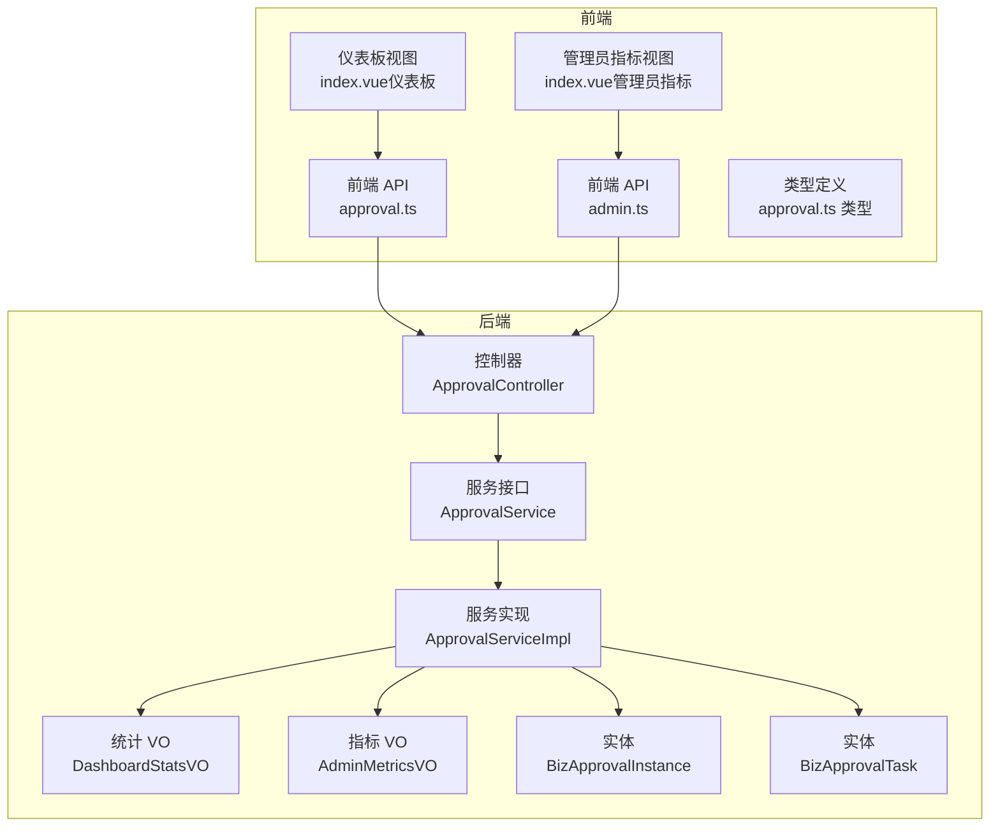
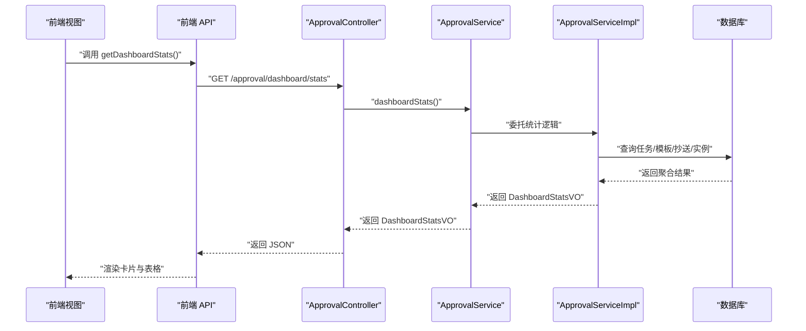
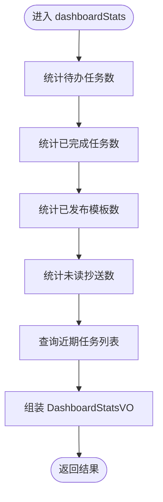
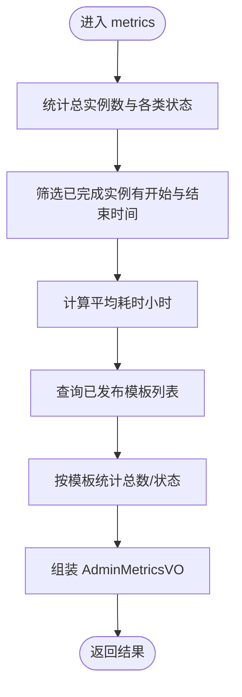
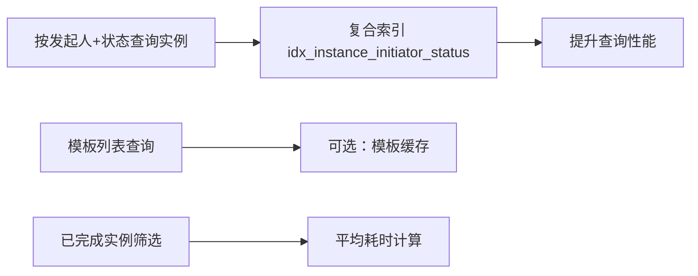
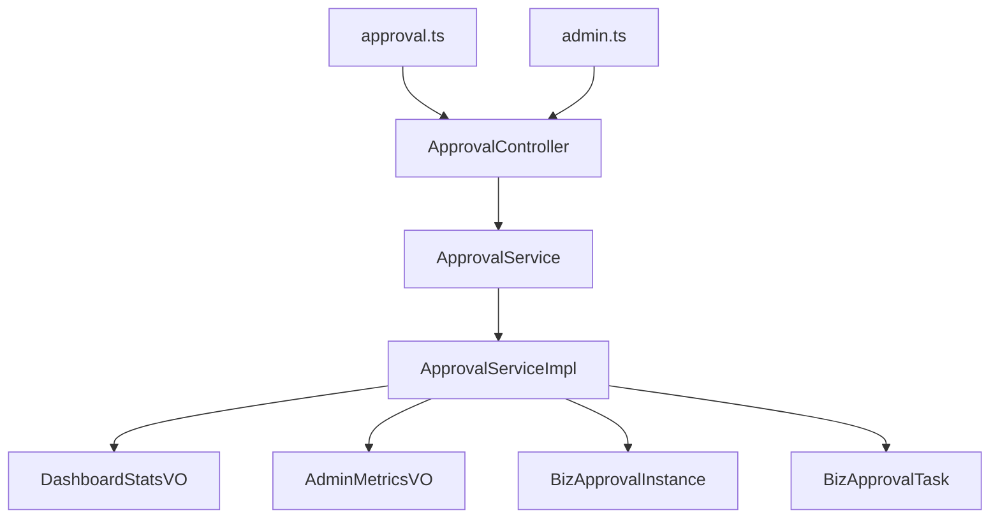

# 流程监控仪表板

<cite>
**本文档引用的文件**
- [ApprovalController.java](file://oa-approval/src/main/java/com/oa/admin/approval/controller/ApprovalController.java)
- [ApprovalService.java](file://oa-approval/src/main/java/com/oa/admin/approval/service/ApprovalService.java)
- [ApprovalServiceImpl.java](file://oa-approval/src/main/java/com/oa/admin/approval/service/impl/ApprovalServiceImpl.java)
- [DashboardStatsVO.java](file://oa-approval/src/main/java/com/oa/admin/approval/dto/DashboardStatsVO.java)
- [AdminMetricsVO.java](file://oa-approval/src/main/java/com/oa/admin/approval/dto/AdminMetricsVO.java)
- [BizApprovalInstance.java](file://oa-approval/src/main/java/com/oa/admin/approval/entity/BizApprovalInstance.java)
- [BizApprovalTask.java](file://oa-approval/src/main/java/com/oa/admin/approval/entity/BizApprovalTask.java)
- [approval.ts](file://oa-ui/src/api/approval.ts)
- [index.vue（仪表板）](file://oa-ui/src/views/dashboard/index.vue)
- [index.vue（管理员指标）](file://oa-ui/src/views/admin/metrics/index.vue)
- [admin.ts](file://oa-ui/src/api/admin.ts)
- [approval.ts 类型定义](file://oa-ui/src/types/approval.ts)
- [V5__phase3a_instance_enhancement.sql](file://oa-app/src/main/resources/db/migration/V5__phase3a_instance_enhancement.sql)
</cite>

## 目录
1. [简介](#简介)
2. [项目结构](#项目结构)
3. [核心组件](#核心组件)
4. [架构概览](#架构概览)
5. [详细组件分析](#详细组件分析)
6. [依赖分析](#依赖分析)
7. [性能考虑](#性能考虑)
8. [故障排除指南](#故障排除指南)
9. [结论](#结论)
10. [附录](#附录)

## 简介
本文件面向流程监控仪表板功能，系统性阐述以下内容：
- 仪表板统计数据的计算逻辑：待办数量统计、流程时效分析、审批效率指标与趋势分析
- dashboardStats 接口的实现原理：数据聚合算法、性能优化策略与缓存机制
- 统计维度设计：按部门、按流程类型、按时间段的统计分析思路
- 数据展示方案：图表组件集成、实时更新机制与数据导出功能
- 监控指标选择标准、阈值设置与预警机制

## 项目结构
该功能由后端服务与前端界面协同完成：
- 后端提供 REST 接口与业务服务，负责数据聚合与统计计算
- 前端通过 API 调用获取数据，并以卡片与表格形式展示

**图表来源**
- [ApprovalController.java:129-133](file://oa-approval/src/main/java/com/oa/admin/approval/controller/ApprovalController.java#L129-L133)
- [ApprovalService.java:38-55](file://oa-approval/src/main/java/com/oa/admin/approval/service/ApprovalService.java#L38-L55)
- [ApprovalServiceImpl.java:723-781](file://oa-approval/src/main/java/com/oa/admin/approval/service/impl/ApprovalServiceImpl.java#L723-L781)
- [DashboardStatsVO.java:18-24](file://oa-approval/src/main/java/com/oa/admin/approval/dto/DashboardStatsVO.java#L18-L24)
- [AdminMetricsVO.java:13-31](file://oa-approval/src/main/java/com/oa/admin/approval/dto/AdminMetricsVO.java#L13-L31)
- [BizApprovalInstance.java:16-32](file://oa-approval/src/main/java/com/oa/admin/approval/entity/BizApprovalInstance.java#L16-L32)
- [BizApprovalTask.java:16-34](file://oa-approval/src/main/java/com/oa/admin/approval/entity/BizApprovalTask.java#L16-L34)
- [approval.ts:56-58](file://oa-ui/src/api/approval.ts#L56-L58)
- [admin.ts:79-81](file://oa-ui/src/api/admin.ts#L79-L81)
- [index.vue（仪表板）:54-76](file://oa-ui/src/views/dashboard/index.vue#L54-L76)
- [index.vue（管理员指标）:1-60](file://oa-ui/src/views/admin/metrics/index.vue#L1-L60)

**章节来源**
- [ApprovalController.java:129-133](file://oa-approval/src/main/java/com/oa/admin/approval/controller/ApprovalController.java#L129-L133)
- [approval.ts:56-58](file://oa-ui/src/api/approval.ts#L56-L58)
- [index.vue（仪表板）:54-76](file://oa-ui/src/views/dashboard/index.vue#L54-L76)

## 核心组件
- 控制器层：提供 /approval/dashboard/stats 接口，返回 DashboardStatsVO
- 服务层：定义 dashboardStats 与 metrics 方法，分别用于用户侧仪表板与管理员指标
- 数据传输对象：DashboardStatsVO（用户侧）、AdminMetricsVO（管理员侧）
- 实体模型：BizApprovalInstance（流程实例）、BizApprovalTask（审批任务）
- 前端 API：封装请求路径，调用后端接口
- 前端视图：以卡片与表格展示统计数据

关键职责划分：
- DashboardStatsVO：包含待办数、已完成数、模板数、未读抄送数与最近活动列表
- AdminMetricsVO：包含总实例数、审批中/已通过/已驳回/已撤回数量、平均耗时、按模板的统计明细

**章节来源**
- [ApprovalController.java:129-133](file://oa-approval/src/main/java/com/oa/admin/approval/controller/ApprovalController.java#L129-L133)
- [ApprovalService.java:38-55](file://oa-approval/src/main/java/com/oa/admin/approval/service/ApprovalService.java#L38-L55)
- [DashboardStatsVO.java:18-24](file://oa-approval/src/main/java/com/oa/admin/approval/dto/DashboardStatsVO.java#L18-L24)
- [AdminMetricsVO.java:13-31](file://oa-approval/src/main/java/com/oa/admin/approval/dto/AdminMetricsVO.java#L13-L31)
- [BizApprovalInstance.java:16-32](file://oa-approval/src/main/java/com/oa/admin/approval/entity/BizApprovalInstance.java#L16-L32)
- [BizApprovalTask.java:16-34](file://oa-approval/src/main/java/com/oa/admin/approval/entity/BizApprovalTask.java#L16-L34)

## 架构概览
仪表板数据流从前端发起，经控制器到服务实现，最终聚合数据库中的流程实例与任务数据。

**图表来源**
- [approval.ts:56-58](file://oa-ui/src/api/approval.ts#L56-L58)
- [ApprovalController.java:129-133](file://oa-approval/src/main/java/com/oa/admin/approval/controller/ApprovalController.java#L129-L133)
- [ApprovalService.java:38-38](file://oa-approval/src/main/java/com/oa/admin/approval/service/ApprovalService.java#L38-L38)
- [ApprovalServiceImpl.java:723-781](file://oa-approval/src/main/java/com/oa/admin/approval/service/impl/ApprovalServiceImpl.java#L723-L781)

## 详细组件分析

### dashboardStats 接口实现原理
- 接口路径：/approval/dashboard/stats
- 返回类型：DashboardStatsVO
- 主要统计项：
  - 待办数量：基于任务表统计未完成任务数
  - 已完成数量：基于任务表统计已完成任务数
  - 模板数量：基于模板表统计已发布模板数
  - 未读抄送数：基于抄送表统计未读抄送数
  - 最近活动：取近期完成的任务列表

**图表来源**
- [ApprovalController.java:129-133](file://oa-approval/src/main/java/com/oa/admin/approval/controller/ApprovalController.java#L129-L133)
- [ApprovalService.java:38-38](file://oa-approval/src/main/java/com/oa/admin/approval/service/ApprovalService.java#L38-L38)
- [ApprovalServiceImpl.java:723-781](file://oa-approval/src/main/java/com/oa/admin/approval/service/impl/ApprovalServiceImpl.java#L723-L781)
- [DashboardStatsVO.java:18-24](file://oa-approval/src/main/java/com/oa/admin/approval/dto/DashboardStatsVO.java#L18-L24)

**章节来源**
- [ApprovalController.java:129-133](file://oa-approval/src/main/java/com/oa/admin/approval/controller/ApprovalController.java#L129-L133)
- [ApprovalService.java:38-38](file://oa-approval/src/main/java/com/oa/admin/approval/service/ApprovalService.java#L38-L38)
- [ApprovalServiceImpl.java:723-781](file://oa-approval/src/main/java/com/oa/admin/approval/service/impl/ApprovalServiceImpl.java#L723-L781)
- [DashboardStatsVO.java:18-24](file://oa-approval/src/main/java/com/oa/admin/approval/dto/DashboardStatsVO.java#L18-L24)

### 管理员指标接口实现原理（metrics）
- 接口路径：/admin/approval/metrics
- 返回类型：AdminMetricsVO
- 主要统计项：
  - 总实例数、审批中、已通过、已驳回、已撤回
  - 平均耗时（小时）：对已完成实例的时长进行平均计算
  - 按模板统计：对每个已发布模板的实例总数、审批中、已通过、已驳回进行统计

**图表来源**
- [ApprovalServiceImpl.java:723-781](file://oa-approval/src/main/java/com/oa/admin/approval/service/impl/ApprovalServiceImpl.java#L723-L781)
- [AdminMetricsVO.java:13-31](file://oa-approval/src/main/java/com/oa/admin/approval/dto/AdminMetricsVO.java#L13-L31)
- [BizApprovalInstance.java:16-32](file://oa-approval/src/main/java/com/oa/admin/approval/entity/BizApprovalInstance.java#L16-L32)

**章节来源**
- [ApprovalServiceImpl.java:723-781](file://oa-approval/src/main/java/com/oa/admin/approval/service/impl/ApprovalServiceImpl.java#L723-L781)
- [AdminMetricsVO.java:13-31](file://oa-approval/src/main/java/com/oa/admin/approval/dto/AdminMetricsVO.java#L13-L31)
- [BizApprovalInstance.java:16-32](file://oa-approval/src/main/java/com/oa/admin/approval/entity/BizApprovalInstance.java#L16-L32)

### 数据聚合算法与性能优化
- 聚合策略
  - 使用条件计数与分组统计，避免一次性加载全量数据
  - 对已完成实例计算时长时，仅筛选具有开始与结束时间的记录
- 性能优化
  - 数据库层面：为实例表添加复合索引，加速按发起人与状态的查询
  - 服务层面：按需查询模板列表与实例统计，减少不必要的 JOIN
- 缓存机制
  - 当前实现未见显式缓存；建议在高频访问场景下引入短期缓存（如 Redis），并设置合理过期时间

**图表来源**
- [V5__phase3a_instance_enhancement.sql:1-3](file://oa-app/src/main/resources/db/migration/V5__phase3a_instance_enhancement.sql#L1-L3)
- [ApprovalServiceImpl.java:723-781](file://oa-approval/src/main/java/com/oa/admin/approval/service/impl/ApprovalServiceImpl.java#L723-L781)

**章节来源**
- [V5__phase3a_instance_enhancement.sql:1-3](file://oa-app/src/main/resources/db/migration/V5__phase3a_instance_enhancement.sql#L1-L3)
- [ApprovalServiceImpl.java:723-781](file://oa-approval/src/main/java/com/oa/admin/approval/service/impl/ApprovalServiceImpl.java#L723-L781)

### 统计维度设计
- 按流程类型（模板）统计
  - 以模板为维度，统计各模板下的实例总数、审批中、已通过、已驳回数量
  - 便于识别高风险或低效模板
- 按时间段统计
  - 可扩展在服务层增加时间范围参数，对实例创建时间或完成时间进行过滤
  - 用于趋势分析与同比/环比对比
- 按部门统计
  - 可通过实例发起人关联部门信息进行分组统计
  - 需要在实体与查询中补充部门字段或关联表

**章节来源**
- [AdminMetricsVO.java:22-31](file://oa-approval/src/main/java/com/oa/admin/approval/dto/AdminMetricsVO.java#L22-L31)
- [ApprovalServiceImpl.java:748-770](file://oa-approval/src/main/java/com/oa/admin/approval/service/impl/ApprovalServiceImpl.java#L748-L770)

### 数据展示方案
- 卡片式统计
  - 总实例数、审批中、已通过、已驳回、已撤回、平均耗时
- 表格式明细
  - 按模板展示总数与状态分布
- 图表组件集成
  - 建议使用折线图展示趋势、柱状图对比模板、饼图展示状态占比
- 实时更新机制
  - 前端可采用定时轮询或 WebSocket 推送，结合缓存控制刷新频率
- 数据导出
  - 支持导出当前视图的统计数据为 Excel 或 CSV

**章节来源**
- [index.vue（仪表板）:54-76](file://oa-ui/src/views/dashboard/index.vue#L54-L76)
- [index.vue（管理员指标）:1-60](file://oa-ui/src/views/admin/metrics/index.vue#L1-L60)
- [approval.ts 类型定义:107-113](file://oa-ui/src/types/approval.ts#L107-L113)

### 监控指标、阈值与预警
- 指标选择
  - 审批中时长、平均耗时、通过率、驳回率、模板使用率
- 阈值设置
  - 平均耗时超过 X 小时、审批中超过 Y 天、驳回率超过 Z%
- 预警机制
  - 后端可定期扫描并记录异常指标，前端以颜色标识与弹窗提醒

[本节为通用实践建议，不直接分析具体文件]

## 依赖分析
- 控制器依赖服务接口，服务实现依赖实体与模板服务
- 前端 API 依赖后端接口路径
- 数据库索引提升查询性能

**图表来源**
- [ApprovalController.java:129-133](file://oa-approval/src/main/java/com/oa/admin/approval/controller/ApprovalController.java#L129-L133)
- [ApprovalService.java:38-55](file://oa-approval/src/main/java/com/oa/admin/approval/service/ApprovalService.java#L38-L55)
- [ApprovalServiceImpl.java:723-781](file://oa-approval/src/main/java/com/oa/admin/approval/service/impl/ApprovalServiceImpl.java#L723-L781)
- [DashboardStatsVO.java:18-24](file://oa-approval/src/main/java/com/oa/admin/approval/dto/DashboardStatsVO.java#L18-L24)
- [AdminMetricsVO.java:13-31](file://oa-approval/src/main/java/com/oa/admin/approval/dto/AdminMetricsVO.java#L13-L31)
- [BizApprovalInstance.java:16-32](file://oa-approval/src/main/java/com/oa/admin/approval/entity/BizApprovalInstance.java#L16-L32)
- [BizApprovalTask.java:16-34](file://oa-approval/src/main/java/com/oa/admin/approval/entity/BizApprovalTask.java#L16-L34)
- [approval.ts:56-58](file://oa-ui/src/api/approval.ts#L56-L58)
- [admin.ts:79-81](file://oa-ui/src/api/admin.ts#L79-L81)

**章节来源**
- [ApprovalController.java:129-133](file://oa-approval/src/main/java/com/oa/admin/approval/controller/ApprovalController.java#L129-L133)
- [ApprovalService.java:38-55](file://oa-approval/src/main/java/com/oa/admin/approval/service/ApprovalService.java#L38-L55)
- [ApprovalServiceImpl.java:723-781](file://oa-approval/src/main/java/com/oa/admin/approval/service/impl/ApprovalServiceImpl.java#L723-L781)
- [approval.ts:56-58](file://oa-ui/src/api/approval.ts#L56-L58)
- [admin.ts:79-81](file://oa-ui/src/api/admin.ts#L79-L81)

## 性能考虑
- 查询优化
  - 利用复合索引加速按发起人与状态的过滤
  - 分页与条件裁剪，避免全表扫描
- 计算优化
  - 对已完成实例进行筛选后再计算平均耗时
  - 模板统计按已发布模板列表进行，减少无关数据
- 缓存策略
  - 引入短期缓存降低数据库压力，设定合理过期时间
- 前端优化
  - 避免频繁刷新，采用定时轮询或增量更新

**章节来源**
- [V5__phase3a_instance_enhancement.sql:1-3](file://oa-app/src/main/resources/db/migration/V5__phase3a_instance_enhancement.sql#L1-L3)
- [ApprovalServiceImpl.java:723-781](file://oa-approval/src/main/java/com/oa/admin/approval/service/impl/ApprovalServiceImpl.java#L723-L781)

## 故障排除指南
- dashboardStats 接口返回空数据
  - 检查任务/模板/抄送/实例表是否为空或权限不足
  - 确认前端 API 路径与控制器映射一致
- 平均耗时异常
  - 核查已完成实例的开始/结束时间是否完整
  - 检查时长计算逻辑与单位换算
- 性能问题
  - 确认复合索引是否生效
  - 评估查询条件与分页参数

**章节来源**
- [approval.ts:56-58](file://oa-ui/src/api/approval.ts#L56-L58)
- [ApprovalController.java:129-133](file://oa-approval/src/main/java/com/oa/admin/approval/controller/ApprovalController.java#L129-L133)
- [ApprovalServiceImpl.java:723-781](file://oa-approval/src/main/java/com/oa/admin/approval/service/impl/ApprovalServiceImpl.java#L723-L781)

## 结论
流程监控仪表板通过清晰的分层架构与合理的数据聚合策略，实现了用户侧与管理员侧的多维统计。后续可在缓存、图表化展示与实时更新方面进一步增强用户体验，并建立完善的阈值与预警体系以支撑主动治理。

## 附录
- 前端视图与 API 的对应关系
  - 仪表板视图：index.vue（仪表板） → approval.ts → /approval/dashboard/stats
  - 管理员指标视图：index.vue（管理员指标） → admin.ts → /admin/approval/metrics

**章节来源**
- [index.vue（仪表板）:54-76](file://oa-ui/src/views/dashboard/index.vue#L54-L76)
- [index.vue（管理员指标）:1-60](file://oa-ui/src/views/admin/metrics/index.vue#L1-L60)
- [approval.ts:56-58](file://oa-ui/src/api/approval.ts#L56-L58)
- [admin.ts:79-81](file://oa-ui/src/api/admin.ts#L79-L81)