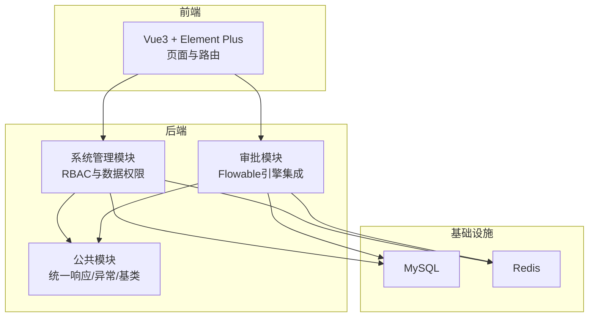
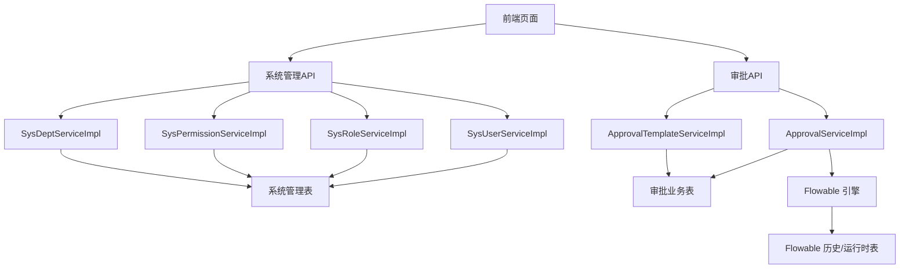
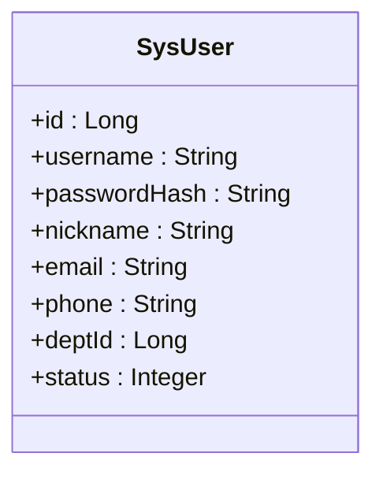
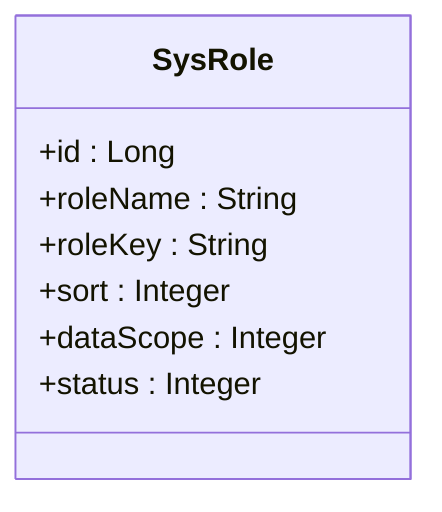
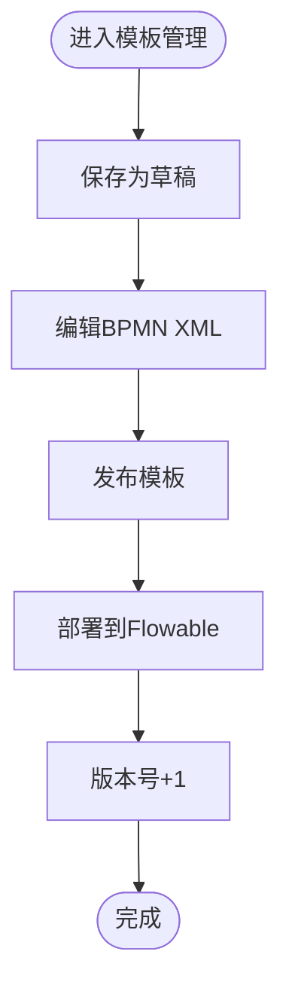
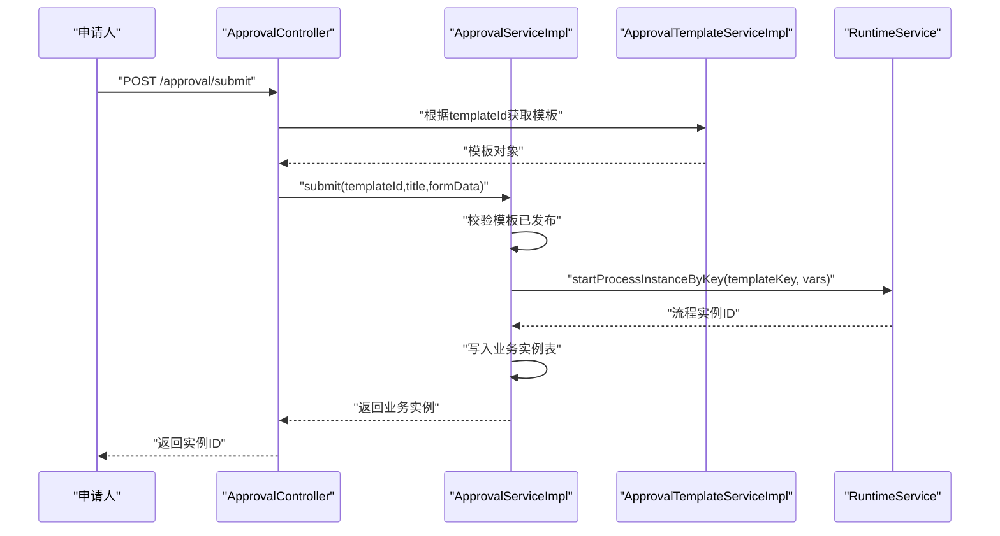
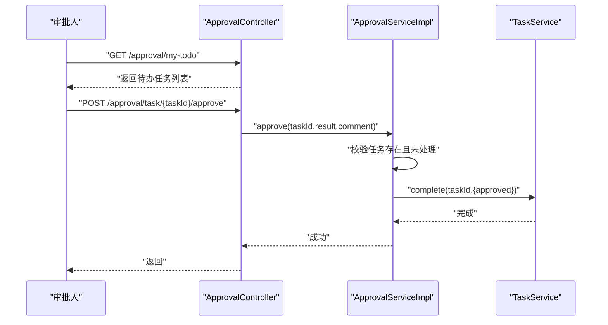
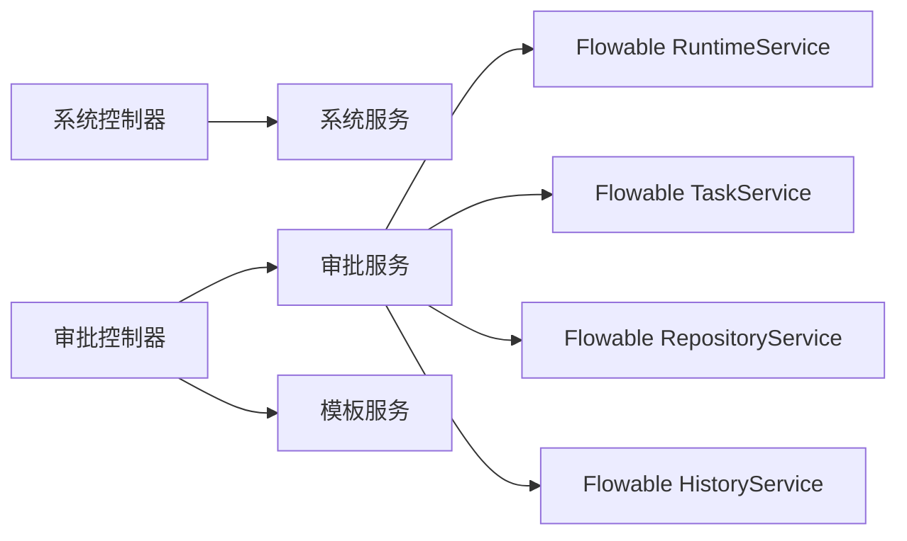
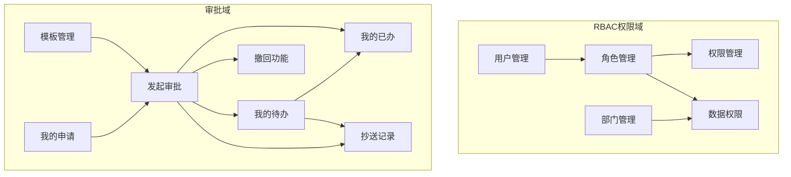

# 核心特性

<cite>
**本文引用的文件**
- [README.md](file://README.md)
- [SysUserController.java](file://oa-system/src/main/java/com/oa/admin/system/controller/SysUserController.java)
- [SysRoleController.java](file://oa-system/src/main/java/com/oa/admin/system/controller/SysRoleController.java)
- [SysPermissionController.java](file://oa-system/src/main/java/com/oa/admin/system/controller/SysPermissionController.java)
- [SysDeptController.java](file://oa-system/src/main/java/com/oa/admin/system/controller/SysDeptController.java)
- [SysUserServiceImpl.java](file://oa-system/src/main/java/com/oa/admin/system/service/impl/SysUserServiceImpl.java)
- [SysRoleServiceImpl.java](file://oa-system/src/main/java/com/oa/admin/system/service/impl/SysRoleServiceImpl.java)
- [SysPermissionServiceImpl.java](file://oa-system/src/main/java/com/oa/admin/system/service/impl/SysPermissionServiceImpl.java)
- [SysDeptServiceImpl.java](file://oa-system/src/main/java/com/oa/admin/system/service/impl/SysDeptServiceImpl.java)
- [SysUser.java](file://oa-system/src/main/java/com/oa/admin/system/entity/SysUser.java)
- [SysRole.java](file://oa-system/src/main/java/com/oa/admin/system/entity/SysRole.java)
- [ApprovalController.java](file://oa-approval/src/main/java/com/oa/admin/approval/controller/ApprovalController.java)
- [AdminApprovalController.java](file://oa-approval/src/main/java/com/oa/admin/approval/controller/AdminApprovalController.java)
- [ApprovalServiceImpl.java](file://oa-approval/src/main/java/com/oa/admin/approval/service/impl/ApprovalServiceImpl.java)
- [ApprovalTemplateServiceImpl.java](file://oa-approval/src/main/java/com/oa/admin/approval/service/impl/ApprovalTemplateServiceImpl.java)
- [BizProcessTemplate.java](file://oa-approval/src/main/java/com/oa/admin/approval/entity/BizProcessTemplate.java)
</cite>

## 目录
1. [简介](#简介)
2. [项目结构](#项目结构)
3. [核心组件](#核心组件)
4. [架构总览](#架构总览)
5. [详细组件分析](#详细组件分析)
6. [依赖分析](#依赖分析)
7. [性能考虑](#性能考虑)
8. [故障排查指南](#故障排查指南)
9. [结论](#结论)
10. [附录](#附录)

## 简介
本文件面向OA审批管理系统的核心特性，系统性阐述RBAC权限管理的五大功能模块与审批流引擎的七大核心功能，并给出功能间协作关系与数据流转过程，帮助用户快速建立对系统能力边界的全景认知。

## 项目结构
系统采用多模块分层设计：公共模块提供统一响应、异常与基础实体；系统管理模块负责RBAC（用户、角色、权限、部门）与数据权限；审批模块集成Flowable引擎，提供模板、实例、任务、抄送等审批能力；前端Vue3应用提供页面与路由；Docker编排一键部署MySQL、Redis与前后端服务。

章节来源
- [README.md:48-61](file://README.md#L48-L61)

## 核心组件
- RBAC权限管理（系统管理模块）
  - 用户管理：CRUD、角色分配、密码加密
  - 角色管理：CRUD、权限分配、数据权限范围
  - 权限管理：菜单/按钮/API三级树形权限
  - 部门管理：树形组织架构
  - 数据权限：全部/本部门/自定义范围
- 审批流引擎（审批模块）
  - 模板管理：草稿/发布/版本管理、节点配置、XML编辑
  - 发起审批：提交实例、写入业务表、触发流程
  - 我的申请：按申请人分页查询
  - 我的待办：按处理人筛选、分页、审批操作
  - 我的已办：历史记录查看
  - 抄送记录：按用户查看抄送、标记已读
  - 撤回功能：仅限首审批人未处理时可撤回

章节来源
- [README.md:63-86](file://README.md#L63-L86)
- [SysUserController.java:17-85](file://oa-system/src/main/java/com/oa/admin/system/controller/SysUserController.java#L17-L85)
- [SysRoleController.java:17-78](file://oa-system/src/main/java/com/oa/admin/system/controller/SysRoleController.java#L17-L78)
- [SysPermissionController.java:15-63](file://oa-system/src/main/java/com/oa/admin/system/controller/SysPermissionController.java#L15-L63)
- [SysDeptController.java:16-70](file://oa-system/src/main/java/com/oa/admin/system/controller/SysDeptController.java#L16-L70)
- [ApprovalController.java:29-252](file://oa-approval/src/main/java/com/oa/admin/approval/controller/ApprovalController.java#L29-L252)

## 架构总览
系统以“控制器-服务-持久层”三层与“领域模型-枚举-常量-DTO”四层协同工作，RBAC与审批两大子域通过统一鉴权与审计日志串联，前端通过REST接口访问后端，后端通过Flowable运行时服务驱动流程执行。

图表来源
- [SysUserController.java:17-85](file://oa-system/src/main/java/com/oa/admin/system/controller/SysUserController.java#L17-L85)
- [SysRoleController.java:17-78](file://oa-system/src/main/java/com/oa/admin/system/controller/SysRoleController.java#L17-L78)
- [SysPermissionController.java:15-63](file://oa-system/src/main/java/com/oa/admin/system/controller/SysPermissionController.java#L15-L63)
- [SysDeptController.java:16-70](file://oa-system/src/main/java/com/oa/admin/system/controller/SysDeptController.java#L16-L70)
- [ApprovalController.java:29-252](file://oa-approval/src/main/java/com/oa/admin/approval/controller/ApprovalController.java#L29-L252)
- [ApprovalServiceImpl.java:57-792](file://oa-approval/src/main/java/com/oa/admin/approval/service/impl/ApprovalServiceImpl.java#L57-L792)
- [ApprovalTemplateServiceImpl.java:25-163](file://oa-approval/src/main/java/com/oa/admin/approval/service/impl/ApprovalTemplateServiceImpl.java#L25-L163)

## 详细组件分析

### RBAC权限管理五大模块

#### 用户管理
- 功能要点
  - 列表/详情/新增/更新/删除，支持状态过滤与分页
  - 新增/更新时对密码进行哈希处理
  - 更新时重新绑定用户的角色集合
- 业务价值
  - 统一身份入口与安全凭证管理，支撑后续权限校验
- 使用场景
  - HR入职/异动/停用员工信息与角色变更
- 数据模型与关系
  - 用户实体包含用户名、昵称、邮箱、电话、部门ID、状态等字段
  - 用户-角色多对多通过关联表维护

图表来源
- [SysUser.java:13-27](file://oa-system/src/main/java/com/oa/admin/system/entity/SysUser.java#L13-L27)

章节来源
- [SysUserController.java:23-83](file://oa-system/src/main/java/com/oa/admin/system/controller/SysUserController.java#L23-L83)
- [SysUserServiceImpl.java:27-71](file://oa-system/src/main/java/com/oa/admin/system/service/impl/SysUserServiceImpl.java#L27-L71)

#### 角色管理
- 功能要点
  - 角色列表/详情/新增/更新/删除
  - 权限分配：清空后批量写入
  - 数据权限范围分配：全部/本部门/自定义部门集合
- 业务价值
  - 将权限与组织范围解耦，便于集中治理
- 使用场景
  - 为不同岗位/职级配置统一权限集与可见范围
- 数据模型与关系
  - 角色实体包含角色名、角色键、排序、数据范围、状态
  - 角色-权限、角色-部门通过关联表维护

图表来源
- [SysRole.java:13-26](file://oa-system/src/main/java/com/oa/admin/system/entity/SysRole.java#L13-L26)

章节来源
- [SysRoleController.java:23-76](file://oa-system/src/main/java/com/oa/admin/system/controller/SysRoleController.java#L23-L76)
- [SysRoleServiceImpl.java:44-77](file://oa-system/src/main/java/com/oa/admin/system/service/impl/SysRoleServiceImpl.java#L44-L77)

#### 权限管理（菜单/按钮/API三级树）
- 功能要点
  - 树形结构展示，支持按状态过滤
  - 列表/详情/新增/更新/删除
- 业务价值
  - 形成统一的资源授权清单，支撑接口级与页面级权限控制
- 使用场景
  - 新增/调整菜单、按钮、API接口的访问控制点
- 数据模型与关系
  - 权限实体具备父子关系，构建树形结构

章节来源
- [SysPermissionController.java:21-61](file://oa-system/src/main/java/com/oa/admin/system/controller/SysPermissionController.java#L21-L61)
- [SysPermissionServiceImpl.java:28-39](file://oa-system/src/main/java/com/oa/admin/system/service/impl/SysPermissionServiceImpl.java#L28-L39)

#### 部门管理（树形组织架构）
- 功能要点
  - 树形/列表两种视图，支持按状态过滤
  - 子节点按排序字段升序排列
- 业务价值
  - 提供组织维度的数据权限边界
- 使用场景
  - 维护公司/部门/小组的层级关系

章节来源
- [SysDeptController.java:22-68](file://oa-system/src/main/java/com/oa/admin/system/controller/SysDeptController.java#L22-L68)
- [SysDeptServiceImpl.java:20-34](file://oa-system/src/main/java/com/oa/admin/system/service/impl/SysDeptServiceImpl.java#L20-L34)

#### 数据权限（全部/本部门/自定义）
- 功能要点
  - 通过角色设置数据范围，结合角色-部门关联实现“本部门/自定义”
- 业务价值
  - 控制用户在查询/统计/操作时可见的数据边界
- 使用场景
  - 部门经理只能看本部门数据；HR可跨部门但受控于策略

章节来源
- [SysRoleController.java:68-76](file://oa-system/src/main/java/com/oa/admin/system/controller/SysRoleController.java#L68-L76)
- [SysRoleServiceImpl.java:57-77](file://oa-system/src/main/java/com/oa/admin/system/service/impl/SysRoleServiceImpl.java#L57-L77)

### 审批流引擎七大核心功能

#### 模板管理
- 功能要点
  - 草稿保存、发布（校验BPMN XML）、版本管理（新建版本）
  - 节点配置（动态候选/条件/会签等）与XML编辑
- 业务价值
  - 以“模板即资产”的方式沉淀可复用的审批规则
- 使用场景
  - 设计/修订/上线请假/采购等流程模板

图表来源
- [ApprovalTemplateServiceImpl.java:42-81](file://oa-approval/src/main/java/com/oa/admin/approval/service/impl/ApprovalTemplateServiceImpl.java#L42-L81)
- [ApprovalTemplateServiceImpl.java:84-104](file://oa-approval/src/main/java/com/oa/admin/approval/service/impl/ApprovalTemplateServiceImpl.java#L84-L104)
- [ApprovalTemplateServiceImpl.java:144-161](file://oa-approval/src/main/java/com/oa/admin/approval/service/impl/ApprovalTemplateServiceImpl.java#L144-L161)

章节来源
- [ApprovalController.java:135-215](file://oa-approval/src/main/java/com/oa/admin/approval/controller/ApprovalController.java#L135-L215)
- [ApprovalTemplateServiceImpl.java:25-163](file://oa-approval/src/main/java/com/oa/admin/approval/service/impl/ApprovalTemplateServiceImpl.java#L25-L163)
- [BizProcessTemplate.java:13-29](file://oa-approval/src/main/java/com/oa/admin/approval/entity/BizProcessTemplate.java#L13-L29)

#### 发起审批
- 功能要点
  - 校验模板状态为已发布
  - 写入业务实例表，携带表单JSON变量
  - 启动流程实例，返回业务实例
- 业务价值
  - 将业务数据与流程引擎解耦，实现“业务即数据、流程即规则”
- 使用场景
  - 员工提交请假/报销/采购等申请

图表来源
- [ApprovalController.java:37-44](file://oa-approval/src/main/java/com/oa/admin/approval/controller/ApprovalController.java#L37-L44)
- [ApprovalServiceImpl.java:122-168](file://oa-approval/src/main/java/com/oa/admin/approval/service/impl/ApprovalServiceImpl.java#L122-L168)
- [ApprovalTemplateServiceImpl.java:25-40](file://oa-approval/src/main/java/com/oa/admin/approval/service/impl/ApprovalTemplateServiceImpl.java#L25-L40)

章节来源
- [ApprovalController.java:37-44](file://oa-approval/src/main/java/com/oa/admin/approval/controller/ApprovalController.java#L37-L44)
- [ApprovalServiceImpl.java:122-168](file://oa-approval/src/main/java/com/oa/admin/approval/service/impl/ApprovalServiceImpl.java#L122-L168)

#### 我的申请
- 功能要点
  - 按申请人分页查询，支持标题/状态过滤
- 业务价值
  - 个人视角追踪自己发起的审批进度
- 使用场景
  - 查看历史申请、重新打开或撤回

章节来源
- [ApprovalController.java:108-115](file://oa-approval/src/main/java/com/oa/admin/approval/controller/ApprovalController.java#L108-L115)
- [ApprovalServiceImpl.java:318-335](file://oa-approval/src/main/java/com/oa/admin/approval/service/impl/ApprovalServiceImpl.java#L318-L335)

#### 我的待办
- 功能要点
  - 按处理人筛选未完成任务，支持分页
  - 审批操作：同意/驳回，记录结果与意见
- 业务价值
  - 将审批责任明确到人，提升处理时效
- 使用场景
  - 部门领导/财务/HR等审批节点

图表来源
- [ApprovalController.java:55-59](file://oa-approval/src/main/java/com/oa/admin/approval/controller/ApprovalController.java#L55-L59)
- [ApprovalController.java:46-53](file://oa-approval/src/main/java/com/oa/admin/approval/controller/ApprovalController.java#L46-L53)
- [ApprovalServiceImpl.java:170-240](file://oa-approval/src/main/java/com/oa/admin/approval/service/impl/ApprovalServiceImpl.java#L170-L240)

章节来源
- [ApprovalController.java:55-59](file://oa-approval/src/main/java/com/oa/admin/approval/controller/ApprovalController.java#L55-L59)
- [ApprovalController.java:46-53](file://oa-approval/src/main/java/com/oa/admin/approval/controller/ApprovalController.java#L46-L53)
- [ApprovalServiceImpl.java:170-240](file://oa-approval/src/main/java/com/oa/admin/approval/service/impl/ApprovalServiceImpl.java#L170-L240)

#### 我的已办
- 功能要点
  - 按处理人筛选已完成任务，支持分页
- 业务价值
  - 形成审批轨迹，便于复盘与审计
- 使用场景
  - 查询历史审批记录

章节来源
- [ApprovalController.java:76-83](file://oa-approval/src/main/java/com/oa/admin/approval/controller/ApprovalController.java#L76-L83)
- [ApprovalServiceImpl.java:253-262](file://oa-approval/src/main/java/com/oa/admin/approval/service/impl/ApprovalServiceImpl.java#L253-L262)

#### 抄送记录
- 功能要点
  - 查看抄送给我（Cc）的任务，支持标记已读
- 业务价值
  - 促进跨部门协同与信息透明
- 使用场景
  - 人事/财务/法务等需要旁观审批过程的岗位

章节来源
- [ApprovalController.java:217-228](file://oa-approval/src/main/java/com/oa/admin/approval/controller/ApprovalController.java#L217-L228)
- [ApprovalServiceImpl.java:604-617](file://oa-approval/src/main/java/com/oa/admin/approval/service/impl/ApprovalServiceImpl.java#L604-L617)

#### 撤回功能
- 功能要点
  - 仅限首审批人未处理时可撤回
  - 标记业务实例为“已撤回”，删除流程实例并清理未处理任务
- 业务价值
  - 保护申请人权益，允许在早期阶段修正错误
- 使用场景
  - 发起人发现表单填写错误或重复提交

章节来源
- [ApprovalController.java:94-99](file://oa-approval/src/main/java/com/oa/admin/approval/controller/ApprovalController.java#L94-L99)
- [ApprovalServiceImpl.java:264-307](file://oa-approval/src/main/java/com/oa/admin/approval/service/impl/ApprovalServiceImpl.java#L264-L307)

#### 管理员能力（后台）
- 功能要点
  - 全局实例查询与终止
  - 任务重分配
  - 审批指标统计
- 业务价值
  - 提升运营与合规治理能力
- 使用场景
  - IT支持/合规/审计/管理者监督

章节来源
- [AdminApprovalController.java:21-54](file://oa-approval/src/main/java/com/oa/admin/approval/controller/AdminApprovalController.java#L21-L54)
- [ApprovalServiceImpl.java:619-790](file://oa-approval/src/main/java/com/oa/admin/approval/service/impl/ApprovalServiceImpl.java#L619-L790)

## 依赖分析
- 模块内聚与耦合
  - 系统管理模块内部围绕RBAC五表与关联表协作，职责清晰
  - 审批模块内部围绕模板、实例、任务、抄送与引擎交互，边界明确
- 外部依赖
  - Flowable引擎提供流程运行时、历史与存储能力
  - Sa-Token提供会话与接口级权限校验
- 关键依赖链
  - 控制器调用服务，服务调用Flowable运行时/历史/仓储服务，持久层映射至业务表

图表来源
- [ApprovalServiceImpl.java:114-121](file://oa-approval/src/main/java/com/oa/admin/approval/service/impl/ApprovalServiceImpl.java#L114-L121)
- [ApprovalController.java:33-35](file://oa-approval/src/main/java/com/oa/admin/approval/controller/ApprovalController.java#L33-L35)

章节来源
- [ApprovalServiceImpl.java:114-121](file://oa-approval/src/main/java/com/oa/admin/approval/service/impl/ApprovalServiceImpl.java#L114-L121)
- [ApprovalController.java:33-35](file://oa-approval/src/main/java/com/oa/admin/approval/controller/ApprovalController.java#L33-L35)

## 性能考虑
- 分页与索引
  - 列表查询均采用分页，建议在高频查询字段建立合适索引（如用户状态、角色排序、实例创建时间、任务分配人等）
- 流程实例并发
  - 批量审批/终止需关注事务边界与锁竞争，避免长时间持有数据库连接
- 图形渲染
  - 流程图XML拼接与历史活动查询可能产生IO开销，建议缓存常用模板XML与节点配置
- 缓存策略
  - 权限树、模板节点配置可引入Redis缓存，降低重复计算

## 故障排查指南
- 常见错误与定位
  - 参数错误：提交/审批参数缺失或类型不符
  - 模板未发布/不存在：提交前校验模板状态
  - 任务已处理/无权限：审批/转办/撤回前检查任务状态与处理人
  - 流程终止失败：确认实例仍处于“进行中”状态
- 日志与审计
  - 审计日志记录关键动作（提交/审批/驳回/撤回/终止/转办），便于问题追溯
- 建议排查步骤
  - 确认请求头satoken有效
  - 核对模板是否已发布且XML有效
  - 检查用户角色与数据范围是否允许访问目标数据
  - 查看审批实例状态与任务链路

章节来源
- [ApprovalController.java:230-250](file://oa-approval/src/main/java/com/oa/admin/approval/controller/ApprovalController.java#L230-L250)
- [ApprovalServiceImpl.java:122-168](file://oa-approval/src/main/java/com/oa/admin/approval/service/impl/ApprovalServiceImpl.java#L122-L168)

## 结论
本系统通过“RBAC权限域 + Flowable审批域”的双轮驱动，实现了从身份、权限、组织到流程、实例、任务的全链路闭环。RBAC确保“谁可以做什么”，审批域确保“如何按规则流转”。二者协同，既能满足日常审批效率，也能满足合规与治理需求。建议在生产环境中配合缓存、索引与监控体系，持续优化性能与稳定性。

## 附录
- 功能全景图（概念示意）

