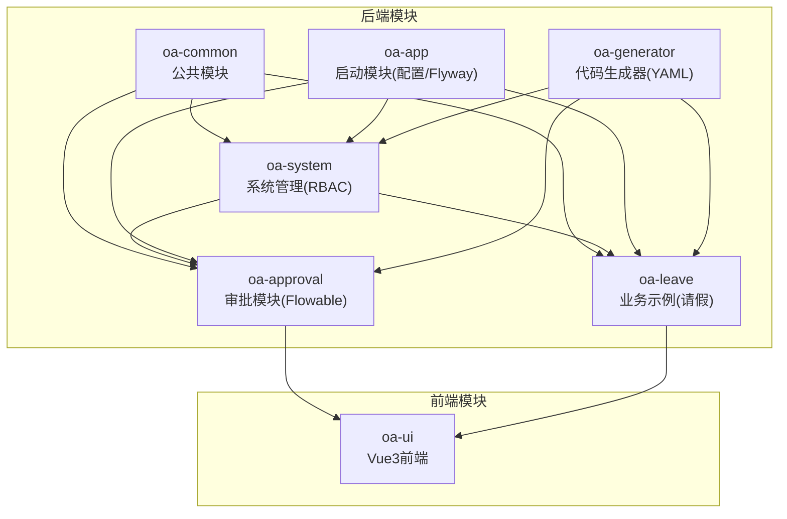
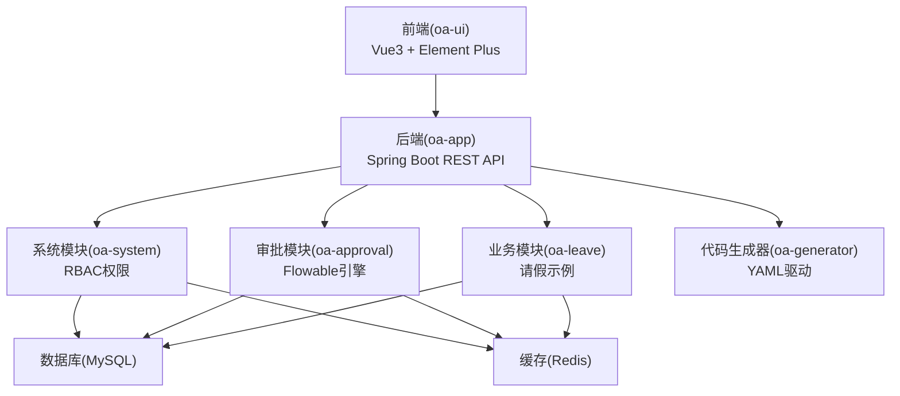
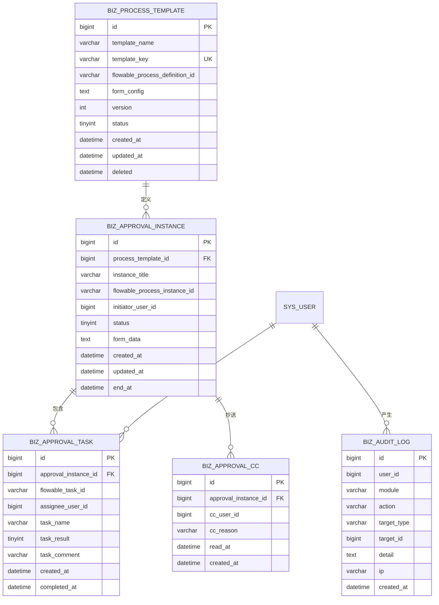
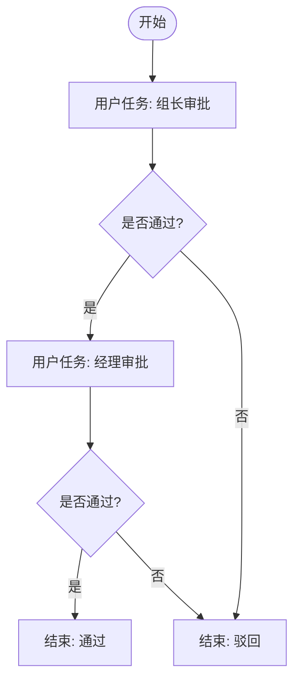
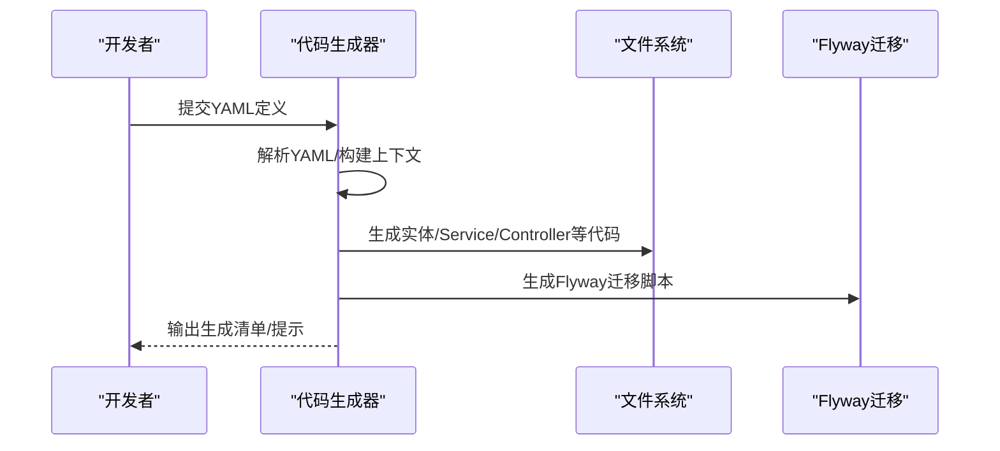
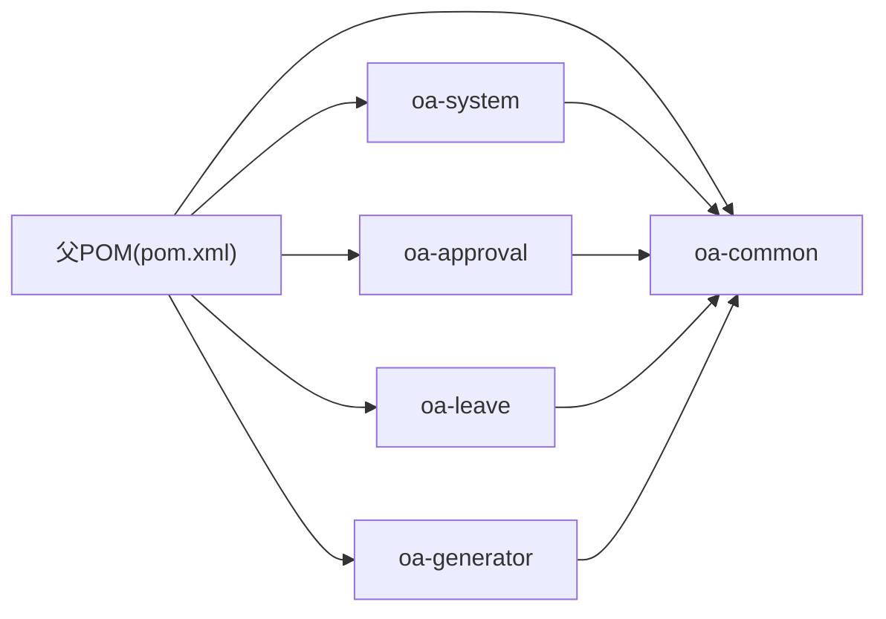

# 项目介绍

<cite>
**本文引用的文件**
- [README.md](file://README.md)
- [pom.xml](file://pom.xml)
- [OaAdminApplication.java](file://oa-app/src/main/java/com/oa/admin/OaAdminApplication.java)
- [application.yml](file://oa-app/src/main/resources/application.yml)
- [FlowableConfig.java](file://oa-approval/src/main/java/com/oa/admin/approval/config/FlowableConfig.java)
- [SysUser.java](file://oa-system/src/main/java/com/oa/admin/system/entity/SysUser.java)
- [BizApprovalInstance.java](file://oa-approval/src/main/java/com/oa/admin/approval/entity/BizApprovalInstance.java)
- [BizProcessTemplate.java](file://oa-approval/src/main/java/com/oa/admin/approval/entity/BizProcessTemplate.java)
- [V1__init_sys_tables.sql](file://oa-app/src/main/resources/db/migration/V1__init_sys_tables.sql)
- [V2__init_biz_tables.sql](file://oa-app/src/main/resources/db/migration/V2__init_biz_tables.sql)
- [V11__system_management_permissions.sql](file://oa-app/src/main/resources/db/migration/V11__system_management_permissions.sql)
- [leave_request.bpmn20.xml](file://oa-app/src/main/resources/processes/leave_request.bpmn20.xml)
- [parallel_example.bpmn20.xml](file://oa-app/src/main/resources/processes/parallel_example.bpmn20.xml)
- [orsign_example.bpmn20.xml](file://oa-app/src/main/resources/processes/orsign_example.bpmn20.xml)
- [countersign_example.bpmn20.xml](file://oa-app/src/main/resources/processes/countersign_example.bpmn20.xml)
- [CodeGenerator.java](file://oa-generator/src/main/java/com/oa/admin/generator/engine/CodeGenerator.java)
- [package.json](file://oa-ui/package.json)
- [docker-compose.yml](file://docker-compose.yml)
</cite>

## 目录
1. [引言](#引言)
2. [项目结构](#项目结构)
3. [核心组件](#核心组件)
4. [架构总览](#架构总览)
5. [详细组件分析](#详细组件分析)
6. [依赖关系分析](#依赖关系分析)
7. [性能考虑](#性能考虑)
8. [故障排查指南](#故障排查指南)
9. [结论](#结论)
10. [附录](#附录)

## 引言
OA审批管理系统是一个面向企业级后台管理场景的综合平台模板，融合了完善的RBAC权限管理体系与Flowable审批流引擎，旨在为企业提供“权限+审批”的一体化底座能力。项目以模块化分层设计为核心，后端采用Java + Spring Boot + MyBatis-Plus + Sa-Token + Flowable，前端采用Vue 3 + TypeScript + Element Plus，配合Docker一键编排，实现快速落地与扩展。

项目的发展历程体现了从基础RBAC权限管理向可配置化、可视化、低代码化的演进：初期完成系统管理（用户/角色/权限/部门）与基础审批能力；随后引入Flowable流程引擎，支持多样的审批流程形态（串行、并行、会签、或签等）；再通过代码生成器降低重复开发成本，形成“定义即生成”的敏捷开发闭环。该技术组合在易用性、扩展性与生态成熟度方面具备独特优势，适合希望快速搭建内部管理平台与业务审批系统的团队。

## 项目结构
项目采用Maven多模块结构，按职责划分清晰：
- oa-common：公共模块（统一响应、异常、基类实体、事件等）
- oa-system：系统管理模块（RBAC：用户/角色/权限/部门）
- oa-approval：审批模块（Flowable集成、模板、实例、任务、抄送、审计）
- oa-leave：业务示例模块（请假申请）
- oa-app：启动模块（应用入口、配置、Flyway迁移）
- oa-generator：代码生成器（YAML驱动的低代码生成）
- oa-ui：前端工程（Vue 3 + Element Plus）



图表来源
- [pom.xml:1-28](file://pom.xml#L21-L28)
- [OaAdminApplication.java:13-13](file://oa-app/src/main/java/com/oa/admin/OaAdminApplication.java#L13-L13)

章节来源
- [pom.xml:21-28](file://pom.xml#L21-L28)
- [README.md:48-61](file://README.md#L48-L61)

## 核心组件
- 应用入口与扫描配置：后端通过Spring Boot启动类集中扫描系统、审批、业务模块的Mapper，确保MyBatis-Plus与数据库映射生效。
- 审批引擎配置：通过Flowable配置类注册流程事件监听器，实现流程生命周期的关键节点扩展（如流程结束事件）。
- 统一配置：后端使用application.yml集中管理数据源、Redis、MyBatis-Plus、Sa-Token、Flowable等配置项，支持环境变量注入，便于容器化部署。
- 前端依赖：前端工程集成Element Plus、Pinia、Vue Router、Axios、bpmn-js等，支撑UI组件、状态管理、路由与流程图可视化。

章节来源
- [OaAdminApplication.java:13-13](file://oa-app/src/main/java/com/oa/admin/OaAdminApplication.java#L13-L13)
- [FlowableConfig.java:17-30](file://oa-approval/src/main/java/com/oa/admin/approval/config/FlowableConfig.java#L17-L30)
- [application.yml:4-59](file://oa-app/src/main/resources/application.yml#L4-L59)
- [package.json:15-36](file://oa-ui/package.json#L15-L36)

## 架构总览
系统采用前后端分离架构，后端以RESTful API提供统一接口，前端通过Axios调用后端接口并渲染页面。审批流程通过Flowable引擎执行，业务数据与流程状态解耦存储于数据库，配合Sa-Token进行会话与权限控制。



图表来源
- [docker-compose.yml:1-66](file://docker-compose.yml#L1-L66)
- [application.yml:4-59](file://oa-app/src/main/resources/application.yml#L4-L59)

章节来源
- [README.md:118-129](file://README.md#L118-L129)
- [docker-compose.yml:1-66](file://docker-compose.yml#L1-L66)

## 详细组件分析

### RBAC权限管理（系统模块）
- 数据模型：包含部门、用户、角色、权限及三张关联表，支持菜单/按钮/API三级权限树与数据权限范围（全部/本部门/自定义）。
- 实体示例：SysUser实体承载用户基本信息与部门关联，体现组织归属与状态管理。
- 权限注入：通过Flyway迁移脚本批量注入系统管理相关的API权限点，确保管理员角色拥有完整权限。

```mermaid
erDiagram
SYS_USER {
bigint id PK
varchar username UK
varchar password_hash
varchar nickname
varchar email
varchar phone
bigint dept_id FK
tinyint status
datetime created_at
datetime updated_at
tinyint deleted
}
SYS_DEPT {
bigint id PK
bigint parent_id
varchar dept_name
int sort
bigint leader_user_id
tinyint status
datetime created_at
datetime updated_at
tinyint deleted
}
SYS_ROLE {
bigint id PK
varchar role_name
varchar role_key UK
int sort
tinyint data_scope
tinyint status
datetime created_at
datetime updated_at
tinyint deleted
}
SYS_PERMISSION {
bigint id PK
bigint parent_id
varchar permission_name
tinyint permission_type
varchar path
varchar component
varchar icon
int sort
tinyint status
datetime created_at
datetime updated_at
tinyint deleted
}
SYS_USER_ROLE {
bigint id PK
bigint user_id FK
bigint role_id FK
}
SYS_ROLE_PERMISSION {
bigint id PK
bigint role_id FK
bigint permission_id FK
}
SYS_ROLE_DEPT {
bigint id PK
bigint role_id FK
bigint dept_id FK
}
SYS_USER }o--|| SYS_DEPT : "属于"
SYS_USER }o--o|| SYS_ROLE : "拥有"
SYS_ROLE }o--o|| SYS_PERMISSION : "授权"
SYS_ROLE }o--o|| SYS_DEPT : "数据范围"
```

图表来源
- [V1__init_sys_tables.sql:5-84](file://oa-app/src/main/resources/db/migration/V1__init_sys_tables.sql#L5-L84)
- [SysUser.java:16-26](file://oa-system/src/main/java/com/oa/admin/system/entity/SysUser.java#L16-L26)

章节来源
- [V1__init_sys_tables.sql:5-84](file://oa-app/src/main/resources/db/migration/V1__init_sys_tables.sql#L5-L84)
- [V11__system_management_permissions.sql:3-25](file://oa-app/src/main/resources/db/migration/V11__system_management_permissions.sql#L3-L25)
- [SysUser.java:16-26](file://oa-system/src/main/java/com/oa/admin/system/entity/SysUser.java#L16-L26)

### 审批流程引擎（审批模块）
- 数据模型：包含流程模板、审批实例、审批任务、抄送记录、审计日志等，支持流程状态流转与审批意见归档。
- 实体示例：BizApprovalInstance记录实例状态与结束时间，BizProcessTemplate承载模板元数据与Flowable部署信息。
- 流程事件：通过FlowableConfig注册流程结束监听器，实现流程完成后的一致性处理（如状态更新、通知等）。



图表来源
- [V2__init_biz_tables.sql:5-74](file://oa-app/src/main/resources/db/migration/V2__init_biz_tables.sql#L5-L74)
- [BizProcessTemplate.java:16-28](file://oa-approval/src/main/java/com/oa/admin/approval/entity/BizProcessTemplate.java#L16-L28)
- [BizApprovalInstance.java:19-32](file://oa-approval/src/main/java/com/oa/admin/approval/entity/BizApprovalInstance.java#L19-L32)

章节来源
- [V2__init_biz_tables.sql:5-74](file://oa-app/src/main/resources/db/migration/V2__init_biz_tables.sql#L5-L74)
- [BizProcessTemplate.java:16-28](file://oa-approval/src/main/java/com/oa/admin/approval/entity/BizProcessTemplate.java#L16-L28)
- [BizApprovalInstance.java:19-32](file://oa-approval/src/main/java/com/oa/admin/approval/entity/BizApprovalInstance.java#L19-L32)
- [FlowableConfig.java:17-30](file://oa-approval/src/main/java/com/oa/admin/approval/config/FlowableConfig.java#L17-L30)

### BPMN流程示例与动态候选
- 流程示例：项目内置多种BPMN示例，涵盖串行审批、并行审批、会签、或签等常见模式，便于快速理解与复用。
- 动态候选人：通过Flowable扩展元素与Bean注入，实现“部门领导”“上级部门领导”等动态指派人策略，提升流程灵活性。



图表来源
- [leave_request.bpmn20.xml:6-28](file://oa-app/src/main/resources/processes/leave_request.bpmn20.xml#L6-L28)

章节来源
- [parallel_example.bpmn20.xml:7-24](file://oa-app/src/main/resources/processes/parallel_example.bpmn20.xml#L7-L24)
- [orsign_example.bpmn20.xml:7-31](file://oa-app/src/main/resources/processes/orsign_example.bpmn20.xml#L7-L31)
- [countersign_example.bpmn20.xml:7-31](file://oa-app/src/main/resources/processes/countersign_example.bpmn20.xml#L7-L31)
- [leave_request.bpmn20.xml:6-28](file://oa-app/src/main/resources/processes/leave_request.bpmn20.xml#L6-L28)

### 代码生成器（低代码）
- YAML驱动：通过YAML定义实体与枚举，自动生成后端CRUD代码（实体、Mapper、Service、Controller、DTO、VO、Flyway迁移脚本）。
- 生成内容：每个实体默认生成6个文件，配合Flyway版本化迁移，保证数据库结构与代码同步。
- 使用方式：支持Dry Run预览、仅生成Flyway SQL、过滤特定实体等参数化选项，满足不同开发阶段需求。



图表来源
- [CodeGenerator.java:27-63](file://oa-generator/src/main/java/com/oa/admin/generator/engine/CodeGenerator.java#L27-L63)

章节来源
- [README.md:137-222](file://README.md#L137-L222)
- [CodeGenerator.java:27-133](file://oa-generator/src/main/java/com/oa/admin/generator/engine/CodeGenerator.java#L27-L133)

### 前后端集成与部署
- 前端依赖：Element Plus、Pinia、Vue Router、Axios、bpmn-js等，支撑UI组件化、状态管理、路由与流程图可视化。
- 一键部署：docker-compose编排MySQL、Redis、后端、前端，支持环境变量覆盖配置，便于本地与生产部署。

章节来源
- [package.json:15-36](file://oa-ui/package.json#L15-L36)
- [docker-compose.yml:1-66](file://docker-compose.yml#L1-L66)
- [application.yml:4-59](file://oa-app/src/main/resources/application.yml#L4-L59)

## 依赖关系分析
- 技术栈与版本：后端采用Spring Boot 3.5.x + Java 17+，ORM为MyBatis-Plus 3.5.x，权限框架Sa-Token 1.44.0，审批引擎Flowable 7.2.0，前端Vue 3 + TypeScript + Vite。
- 模块依赖：父POM统一管理各模块依赖版本，确保一致性；模块间通过公共模块共享通用能力。
- 外部依赖：MySQL 8.x、Redis 7.x、Flyway数据库迁移、bpmn-js流程图可视化等。



图表来源
- [pom.xml:44-113](file://pom.xml#L44-L113)

章节来源
- [pom.xml:30-42](file://pom.xml#L30-L42)
- [pom.xml:44-113](file://pom.xml#L44-L113)

## 性能考虑
- 数据库连接池：HikariCP参数可调，建议根据并发与QPS调整最大池大小、空闲超时与连接超时。
- 缓存策略：结合Redis进行会话与热点数据缓存，减少数据库压力。
- ORM优化：MyBatis-Plus自动填充与下划线转驼峰配置，提升开发效率与可读性。
- 审批流程：合理拆分流程节点与网关，避免过深嵌套导致性能下降；对高频查询建立索引（如实例状态、发起人、任务指派人等）。

## 故障排查指南
- 启动失败：检查数据库连通性与Flyway迁移是否成功；确认环境变量（数据库URL、用户名、密码、Redis地址）是否正确。
- 权限问题：核对系统管理权限是否已通过迁移脚本注入；确认用户角色与权限映射是否正确。
- 审批流程异常：检查流程XML是否可被Flowable正确部署；关注流程结束监听器是否注册成功。
- 前端访问：确认前端代理与后端接口前缀一致；检查CORS与跨域配置。

章节来源
- [application.yml:4-59](file://oa-app/src/main/resources/application.yml#L4-L59)
- [V11__system_management_permissions.sql:3-25](file://oa-app/src/main/resources/db/migration/V11__system_management_permissions.sql#L3-L25)
- [FlowableConfig.java:17-30](file://oa-approval/src/main/java/com/oa/admin/approval/config/FlowableConfig.java#L17-L30)

## 结论
本项目以“RBAC + Flowable审批流”为核心，结合低代码生成器与前后端一体化部署方案，为企业提供开箱即用的后台管理与审批底座。其技术组合在易用性、扩展性与生态成熟度方面具备显著优势，适合快速搭建内部OA系统与各类业务审批场景。通过模块化设计与标准化流程，团队可聚焦业务价值，缩短交付周期并提升维护效率。

## 附录
- 开源协议：MIT
- 社区支持：基于GitHub开源，遵循开源协作规范
- 发展前景：持续完善流程设计器、条件分支、动态候选人与低代码表单，逐步实现“所见即所得”的流程设计与业务配置

章节来源
- [README.md:223-226](file://README.md#L223-L226)