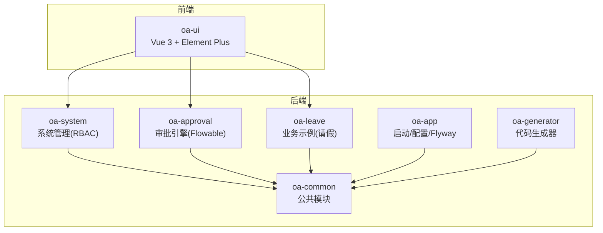
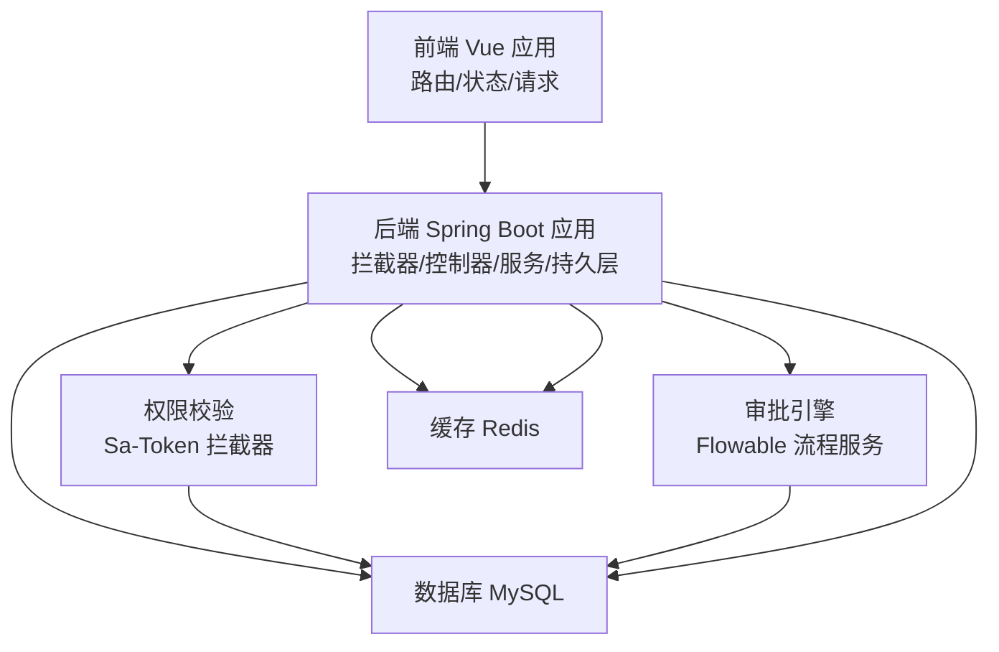
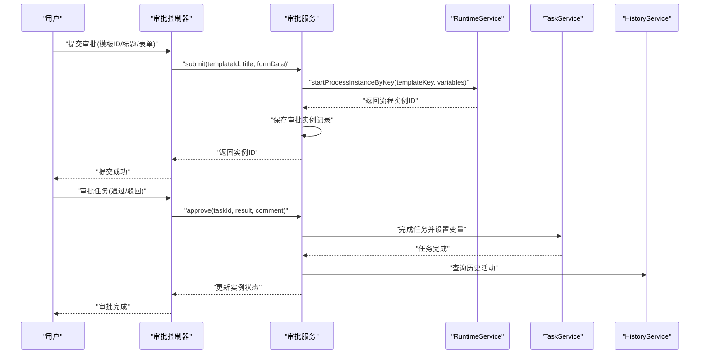
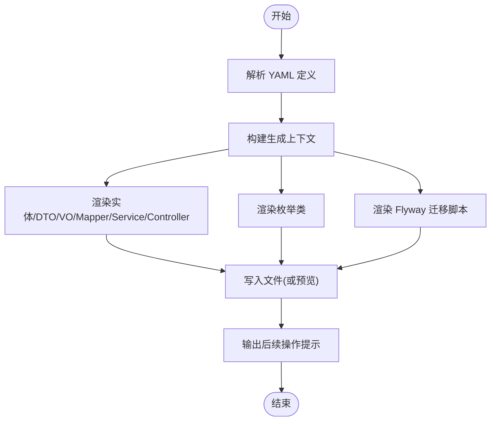
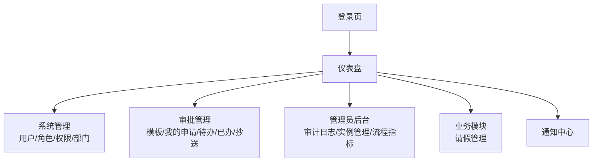
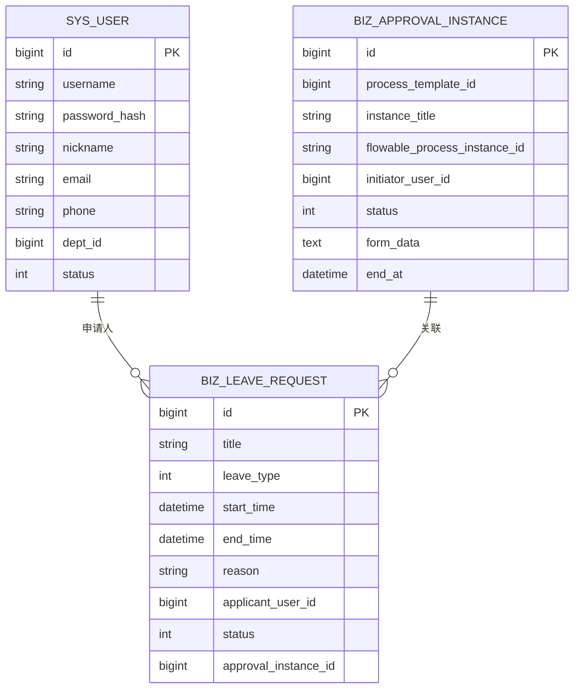
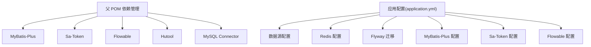

# 项目概述

<cite>
**本文档引用的文件**
- [README.md](file://README.md)
- [pom.xml](file://pom.xml)
- [application.yml](file://oa-app/src/main/resources/application.yml)
- [OaAdminApplication.java](file://oa-app/src/main/java/com/oa/admin/OaAdminApplication.java)
- [SaTokenConfig.java](file://oa-system/src/main/java/com/oa/admin/system/config/SaTokenConfig.java)
- [FlowableConfig.java](file://oa-approval/src/main/java/com/oa/admin/approval/config/FlowableConfig.java)
- [R.java](file://oa-common/src/main/java/com/oa/admin/common/result/R.java)
- [main.ts](file://oa-ui/src/main.ts)
- [package.json](file://oa-ui/package.json)
- [docker-compose.yml](file://docker-compose.yml)
- [SysUser.java](file://oa-system/src/main/java/com/oa/admin/system/entity/SysUser.java)
- [BizApprovalInstance.java](file://oa-approval/src/main/java/com/oa/admin/approval/entity/BizApprovalInstance.java)
- [LeaveRequest.java](file://oa-leave/src/main/java/com/oa/admin/leave/entity/LeaveRequest.java)
- [index.ts](file://oa-ui/src/router/index.ts)
- [SysUserServiceImpl.java](file://oa-system/src/main/java/com/oa/admin/system/service/impl/SysUserServiceImpl.java)
- [ApprovalServiceImpl.java](file://oa-approval/src/main/java/com/oa/admin/approval/service/impl/ApprovalServiceImpl.java)
- [CodeGenerator.java](file://oa-generator/src/main/java/com/oa/admin/generator/engine/CodeGenerator.java)
</cite>

## 目录
1. [引言](#引言)
2. [项目结构](#项目结构)
3. [核心组件](#核心组件)
4. [架构总览](#架构总览)
5. [详细组件分析](#详细组件分析)
6. [依赖分析](#依赖分析)
7. [性能考虑](#性能考虑)
8. [故障排除指南](#故障排除指南)
9. [结论](#结论)
10. [附录](#附录)

## 引言
本项目是一个基于 RBAC 权限管理与 Flowable 审批流引擎的企业级后台管理平台模板，旨在为组织提供“权限 + 审批”的一体化底座能力。通过模块化设计与低代码扩展机制，系统既可快速落地标准审批场景（如请假），又可灵活扩展更多业务审批流程。项目采用 Spring Boot + Vue 3 的前后端分离架构，配合 Sa-Token 实现会话与接口级安全控制，使用 Flowable 提供强大的流程编排能力，并通过 Flyway 进行数据库迁移管理。

## 项目结构
项目采用多模块 Maven 架构，核心模块包括：
- oa-common：公共基础模块（统一响应、异常、自动填充等）
- oa-system：系统管理模块（RBAC 用户/角色/权限/部门管理）
- oa-approval：审批模块（Flowable 集成、实例/任务/抄送/审计）
- oa-leave：业务示例模块（请假申请与审批联动）
- oa-app：应用启动模块（配置、Flyway 迁移、入口）
- oa-generator：代码生成器（YAML 定义驱动的后端/前端/迁移脚本生成）



图表来源
- [pom.xml:21-27](file://pom.xml#L21-L27)
- [README.md:48-61](file://README.md#L48-L61)

章节来源
- [README.md:48-61](file://README.md#L48-L61)
- [pom.xml:21-27](file://pom.xml#L21-L27)

## 核心组件
- 统一响应与异常：通过统一响应包装与全局异常处理，保证前后端一致的交互体验。
- RBAC 权限体系：用户、角色、权限、部门四张主表及关联表构成的权限模型，支持菜单/按钮/API 三级权限树与数据权限范围。
- 审批流引擎：基于 Flowable 的流程实例、任务、节点配置与事件监听，支撑复杂审批场景。
- 低代码生成器：通过 YAML 定义实体/枚举，自动生成后端 CRUD、Mapper、Service、Controller、Flyway 迁移脚本，加速业务开发。
- 前后端分离：Vue 3 + Element Plus + Pinia + Router，提供现代化的管理界面与良好的用户体验。

章节来源
- [R.java:9-43](file://oa-common/src/main/java/com/oa/admin/common/result/R.java#L9-L43)
- [SysUser.java:13-26](file://oa-system/src/main/java/com/oa/admin/system/entity/SysUser.java#L13-L26)
- [BizApprovalInstance.java:16-32](file://oa-approval/src/main/java/com/oa/admin/approval/entity/BizApprovalInstance.java#L16-L32)
- [CodeGenerator.java:22-63](file://oa-generator/src/main/java/com/oa/admin/generator/engine/CodeGenerator.java#L22-L63)

## 架构总览
系统采用分层架构与模块化设计，后端通过 Spring Boot 统一装配，前端通过 Vue 3 渲染，数据库与缓存通过 Docker Compose 一键部署。核心交互链路如下：



图表来源
- [SaTokenConfig.java:13-24](file://oa-system/src/main/java/com/oa/admin/system/config/SaTokenConfig.java#L13-L24)
- [FlowableConfig.java:15-30](file://oa-approval/src/main/java/com/oa/admin/approval/config/FlowableConfig.java#L15-L30)
- [docker-compose.yml:1-66](file://docker-compose.yml#L1-L66)
- [application.yml:4-59](file://oa-app/src/main/resources/application.yml#L4-L59)

## 详细组件分析

### RBAC 权限管理
- 设计理念：以用户为中心，通过角色聚合权限，支持部门维度的数据权限控制，满足企业常见的“按人授权、按部门隔离”的需求。
- 核心实体：用户、角色、权限、部门及多对多关联表，形成清晰的权限拓扑。
- 安全控制：全局拦截器统一校验登录状态；接口级注解校验菜单/按钮/API 权限；密码采用 BCrypt 加密存储。

```mermaid
classDiagram
class SysUser {
+id : Long
+username : String
+passwordHash : String
+nickname : String
+email : String
+phone : String
+deptId : Long
+status : Integer
}
class SysRole {
+id : Long
+name : String
+code : String
+sort : Integer
+status : Integer
}
class SysPermission {
+id : Long
+name : String
+code : String
+category : String
+url : String
+method : String
+parentId : Long
+sort : Integer
}
class SysUserRole
class SysRolePermission
class SysRoleDept
SysUser ||--o{ SysUserRole : "拥有"
SysRole ||--o{ SysUserRole : "被授予"
SysRole ||--o{ SysRolePermission : "拥有"
SysPermission ||--o{ SysRolePermission : "被授权"
SysUser ||--o{ SysRoleDept : "属于"
SysRole ||--o{ SysRoleDept : "影响"
```

图表来源
- [SysUser.java:13-26](file://oa-system/src/main/java/com/oa/admin/system/entity/SysUser.java#L13-L26)

章节来源
- [SysUser.java:13-26](file://oa-system/src/main/java/com/oa/admin/system/entity/SysUser.java#L13-L26)
- [SysUserServiceImpl.java:22-73](file://oa-system/src/main/java/com/oa/admin/system/service/impl/SysUserServiceImpl.java#L22-L73)
- [SaTokenConfig.java:13-24](file://oa-system/src/main/java/com/oa/admin/system/config/SaTokenConfig.java#L13-L24)

### 审批流引擎（Flowable 集成）
- 设计理念：将业务表单与流程引擎解耦，通过模板驱动的流程实例与任务管理，实现“表单数据 + 流程变量 + 节点配置”的灵活组合。
- 核心实体：流程模板、审批实例、审批任务、抄送记录、审计日志，支撑完整的审批生命周期。
- 扩展能力：事件监听器、候选人解析器、流程结束回调，便于接入通知、统计与审计。



图表来源
- [ApprovalServiceImpl.java:122-200](file://oa-approval/src/main/java/com/oa/admin/approval/service/impl/ApprovalServiceImpl.java#L122-L200)

章节来源
- [BizApprovalInstance.java:16-32](file://oa-approval/src/main/java/com/oa/admin/approval/entity/BizApprovalInstance.java#L16-L32)
- [FlowableConfig.java:15-30](file://oa-approval/src/main/java/com/oa/admin/approval/config/FlowableConfig.java#L15-L30)
- [ApprovalServiceImpl.java:122-200](file://oa-approval/src/main/java/com/oa/admin/approval/service/impl/ApprovalServiceImpl.java#L122-L200)

### 低代码代码生成器
- 设计理念：通过 YAML DSL 描述实体与枚举，自动生成后端 CRUD、Mapper、Service、Controller、VO/DTO、Flyway 迁移脚本，减少重复劳动，提升一致性。
- 生成内容：每个实体生成 6 个文件，枚举生成独立枚举类；支持仅生成迁移脚本或前端页面（当前不自动生成前端）。
- 使用流程：定义 YAML → 预览生成 → 正式生成 → 手动补充权限与前端页面。



图表来源
- [CodeGenerator.java:27-63](file://oa-generator/src/main/java/com/oa/admin/generator/engine/CodeGenerator.java#L27-L63)

章节来源
- [CodeGenerator.java:27-63](file://oa-generator/src/main/java/com/oa/admin/generator/engine/CodeGenerator.java#L27-L63)
- [README.md:137-222](file://README.md#L137-L222)

### 前端界面与路由
- 技术栈：Vue 3 + TypeScript + Element Plus + Pinia + Vue Router，提供现代化的后台管理界面。
- 路由设计：登录页、仪表盘、系统管理、审批管理、管理员后台、业务模块（如请假）、通知中心等。
- 状态管理：Pinia 管理用户状态与全局配置；Element Plus 提供丰富的 UI 组件库。



图表来源
- [index.ts:1-134](file://oa-ui/src/router/index.ts#L1-L134)
- [main.ts:1-14](file://oa-ui/src/main.ts#L1-L14)
- [package.json:15-36](file://oa-ui/package.json#L15-L36)

章节来源
- [index.ts:1-134](file://oa-ui/src/router/index.ts#L1-L134)
- [main.ts:1-14](file://oa-ui/src/main.ts#L1-L14)
- [package.json:15-36](file://oa-ui/package.json#L15-L36)

### 请假业务示例
- 业务模型：请假申请实体包含标题、类型、起止时间、申请人、状态、关联审批实例 ID 等字段。
- 与审批联动：发起请假即创建审批实例，审批完成后回调更新请假状态，形成闭环。



图表来源
- [LeaveRequest.java:18-47](file://oa-leave/src/main/java/com/oa/admin/leave/entity/LeaveRequest.java#L18-L47)
- [BizApprovalInstance.java:18-32](file://oa-approval/src/main/java/com/oa/admin/approval/entity/BizApprovalInstance.java#L18-L32)

章节来源
- [LeaveRequest.java:18-47](file://oa-leave/src/main/java/com/oa/admin/leave/entity/LeaveRequest.java#L18-L47)
- [BizApprovalInstance.java:18-32](file://oa-approval/src/main/java/com/oa/admin/approval/entity/BizApprovalInstance.java#L18-L32)

## 依赖分析
- 后端依赖管理：通过父 POM 锁定版本，统一管理 MyBatis-Plus、Sa-Token、Flowable、Hutool、MySQL 等依赖。
- 运行时配置：应用通过 application.yml 配置数据源、Redis、Flyway、MyBatis-Plus、Sa-Token、Flowable 等参数。
- 前后端通信：统一响应体格式与 RESTful 接口规范，前端通过 Axios 请求后端 API。



图表来源
- [pom.xml:44-112](file://pom.xml#L44-L112)
- [application.yml:4-59](file://oa-app/src/main/resources/application.yml#L4-L59)

章节来源
- [pom.xml:44-112](file://pom.xml#L44-L112)
- [application.yml:4-59](file://oa-app/src/main/resources/application.yml#L4-L59)

## 性能考虑
- 数据库连接池：HikariCP 参数可调，建议根据并发与 QPS 调整最大池大小、空闲超时与连接超时。
- 缓存策略：Redis 用于会话与热点数据缓存，建议对权限树、模板配置进行缓存以降低查询压力。
- ORM 优化：MyBatis-Plus 自动填充与逻辑删除配置，避免误删与冗余查询。
- 审批引擎：流程实例与任务查询建议增加索引与分页，避免历史数据膨胀导致查询慢。
- 前端性能：按需加载路由与组件，合理拆分包体，减少首屏加载时间。

## 故障排除指南
- 登录鉴权失败：检查 Sa-Token 拦截器是否生效，确认请求头是否携带正确的令牌名称与值。
- 审批流程异常：核对流程模板是否发布、流程变量是否正确传递、事件监听器是否注册。
- 数据库迁移问题：确认 Flyway 迁移脚本顺序与版本号，确保 baseline 设置正确。
- 前端路由跳转：确认本地存储的 token 是否存在，路由守卫逻辑是否正确重定向到登录页。
- Docker 环境：检查容器健康状态、端口映射与环境变量，确保 MySQL 与 Redis 可用。

章节来源
- [SaTokenConfig.java:13-24](file://oa-system/src/main/java/com/oa/admin/system/config/SaTokenConfig.java#L13-L24)
- [FlowableConfig.java:15-30](file://oa-approval/src/main/java/com/oa/admin/approval/config/FlowableConfig.java#L15-L30)
- [docker-compose.yml:1-66](file://docker-compose.yml#L1-L66)
- [index.ts:124-131](file://oa-ui/src/router/index.ts#L124-L131)

## 结论
本项目以“RBAC + 审批流”为核心，结合低代码生成器与模块化架构，为企业提供可快速落地、可扩展、可维护的后台管理平台模板。通过 Spring Boot 与 Vue 3 的现代技术栈，系统在安全性、可扩展性与开发效率之间取得良好平衡。建议在生产环境中进一步完善监控、告警与灰度发布机制，持续迭代流程设计器与表单设计器，提升用户体验与业务适配能力。

## 附录
- 快速开始：执行初始化脚本与 Docker Compose 一键启动，访问前端与后端默认地址。
- API 规范：统一前缀、认证方式、响应体格式与分页约定。
- 路由清单：涵盖登录、仪表盘、系统管理、审批管理、管理员后台、业务模块与通知中心。

章节来源
- [README.md:20-46](file://README.md#L20-L46)
- [README.md:87-108](file://README.md#L87-L108)
- [README.md:130-136](file://README.md#L130-L136)